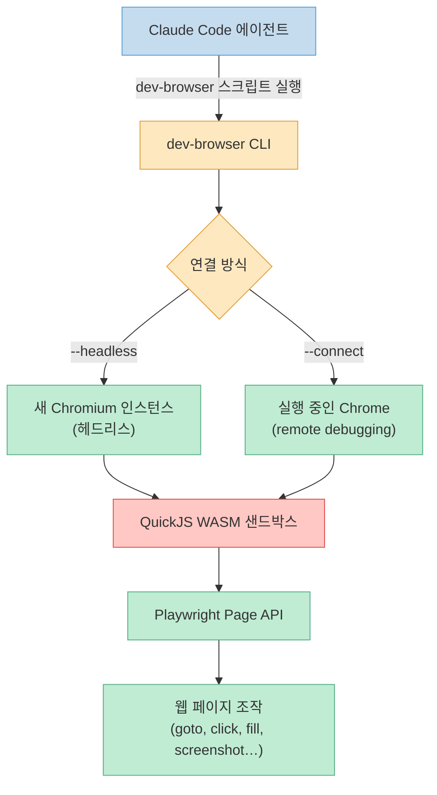
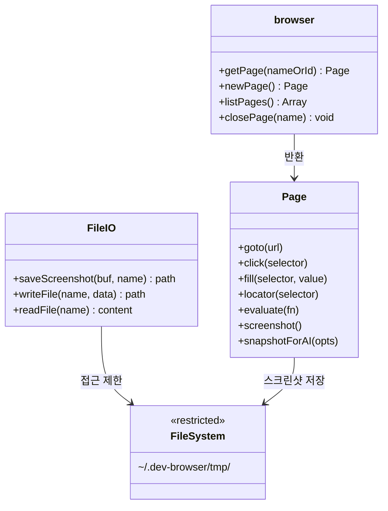
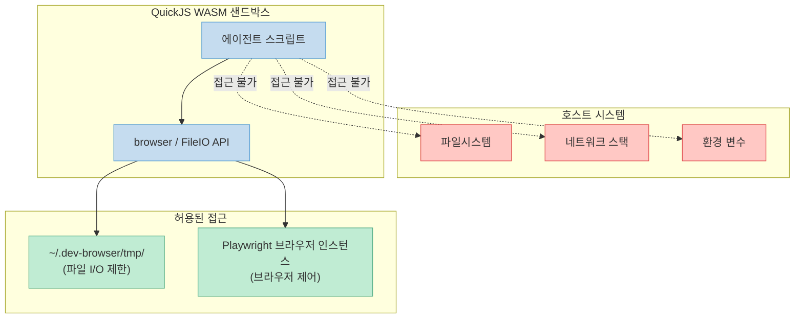
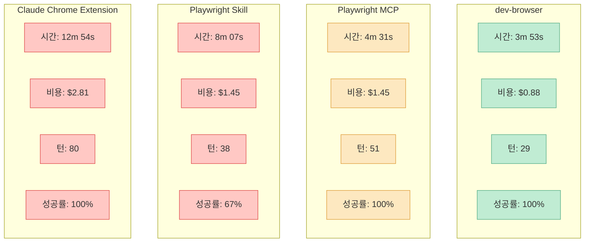
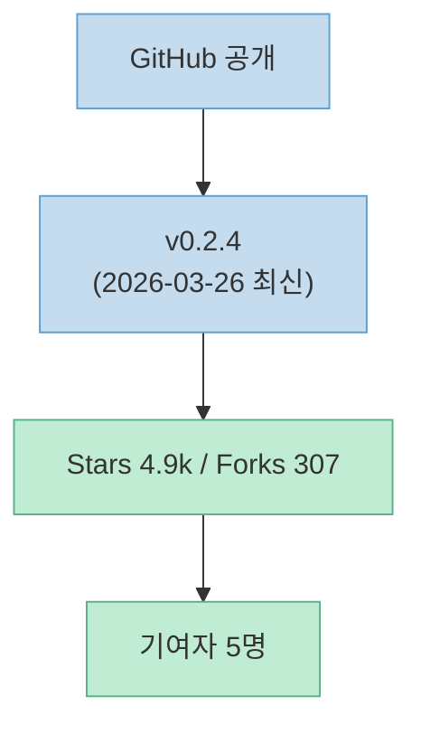

AI 에이전트가 브라우저를 다뤄야 할 때, 선택지는 여러 가지입니다. Playwright MCP, Claude Chrome Extension, Playwright Skill — 그리고 **dev-browser**.

벤치마크에서 dev-browser는 가장 빠르고, 가장 저렴하고, 가장 적은 턴으로 작업을 완료했습니다. 어떻게 이게 가능한지, 그리고 어떻게 쓰는지 살펴보겠습니다.

<!--more-->

## Sources

- [SawyerHood/dev-browser — GitHub](https://github.com/SawyerHood/dev-browser)

---

## dev-browser란 무엇인가

**dev-browser**는 AI 에이전트와 개발자가 샌드박스 JavaScript 스크립트로 브라우저를 제어할 수 있게 해주는 브라우저 자동화 도구입니다. [Do Browser](https://dobrowser.io)에서 만들었고, MIT 라이선스로 공개되어 있습니다.



핵심 특징 네 가지:

- **샌드박스 실행** — 스크립트가 QuickJS WASM 샌드박스에서 실행됩니다. 호스트 파일시스템이나 네트워크에 직접 접근할 수 없습니다.
- **영속적 페이지** — 페이지를 한 번 열어두면, 여러 스크립트에서 계속 이어서 사용할 수 있습니다.
- **자동 연결** — 실행 중인 Chrome에 붙거나, 새 Chromium을 바로 실행합니다.
- **Playwright 전체 API** — `goto`, `click`, `fill`, `locator`, `evaluate`, `screenshot` 등 Playwright가 제공하는 모든 것을 사용할 수 있습니다.

---

## 설치

```bash
npm install -g dev-browser
dev-browser install    # Playwright + Chromium 설치
```

Windows PowerShell에서도 동일합니다. Windows 환경에서는 `postinstall` 단계에서 `dev-browser-windows-x64.exe` 바이너리를 자동으로 다운로드합니다.

---

## 빠른 시작

```bash
# 헤드리스 브라우저로 실행
dev-browser --headless <<'EOF'
const page = await browser.getPage("main");
await page.goto("https://example.com");
console.log(await page.title());
EOF

# 실행 중인 Chrome에 연결 (chrome://inspect/#remote-debugging 활성화 필요)
dev-browser --connect <<'EOF'
const tabs = await browser.listPages();
console.log(JSON.stringify(tabs, null, 2));
EOF
```

Windows에서 Chrome에 연결하려면:

```powershell
chrome.exe --remote-debugging-port=9222
dev-browser --connect
```

---

## Script API: QuickJS 런타임

스크립트는 Node.js가 아닌 **QuickJS WASM 런타임** 위에서 실행됩니다. 사용 가능한 전역 객체는 다음과 같습니다:



```javascript
// 브라우저 제어
browser.getPage(nameOrId)    // 이름으로 페이지 가져오기/생성, 또는 targetId로 탭에 연결
browser.newPage()            // 익명 페이지 생성 (스크립트 종료 후 자동 정리)
browser.listPages()          // 탭 목록 반환: [{id, url, title, name}]
browser.closePage(name)      // 이름으로 페이지 닫기

// 파일 I/O (경로는 ~/.dev-browser/tmp/ 로 제한)
await saveScreenshot(buf, name)   // 스크린샷 버퍼 저장, 경로 반환
await writeFile(name, data)       // 파일 쓰기, 경로 반환
await readFile(name)              // 파일 읽기, 내용 반환

// 출력
console.log/warn/error/info       // CLI stdout/stderr로 라우팅
```

특히 주목할 메서드가 하나 있습니다: `page.snapshotForAI({ track?, depth?, timeout? })`. 이 메서드는 `{ full, incremental? }` 형태로 AI 친화적인 페이지 스냅샷을 반환합니다. AI가 페이지 상태를 이해하는 데 최적화된 형식입니다.

---

## QuickJS 샌드박스의 의미

일반적인 Node.js 기반 자동화 도구와 달리, dev-browser의 스크립트는 완전히 격리된 환경에서 실행됩니다.



이 설계 덕분에:
- 에이전트 스크립트가 호스트 파일시스템이나 네트워크에 직접 접근할 수 없습니다.
- Claude Code에서 `dev-browser` 명령어를 사전 허가해도 안전합니다.

---

## Claude Code와의 통합

### AI 에이전트에서 사용하기

설치 후 에이전트에게 `dev-browser --help`를 실행하라고 지시하면 됩니다. help 출력에 LLM 사용 가이드, 예제, API 레퍼런스가 모두 포함되어 있습니다. 별도 플러그인이나 스킬 설치가 필요 없습니다.

### 권한 설정: 매번 승인 없애기

Claude Code는 기본적으로 Bash 명령어 실행마다 승인을 요청합니다. `dev-browser`를 사전 허가하려면:

**프로젝트별** (`.claude/settings.json`):

```json
{
  "permissions": {
    "allow": [
      "Bash(dev-browser *)"
    ]
  }
}
```

**사용자 전역** (`~/.claude/settings.json`):

```json
{
  "permissions": {
    "allow": [
      "Bash(dev-browser *)",
      "Bash(npx dev-browser *)"
    ]
  }
}
```

`Bash(dev-browser *)` 패턴은 `dev-browser`로 시작하는 모든 명령어와 매칭됩니다. 앞서 설명한 샌드박스 설계 덕분에 이 허가는 안전합니다.

### 플러그인으로 설치 (Claude Code)

```
/plugin marketplace add sawyerhood/dev-browser
/plugin install dev-browser@sawyerhood/dev-browser
```

설치 후 Claude Code를 재시작합니다.

### Amp / Codex에 스킬로 설치

```bash
SKILLS_DIR=~/.claude/skills  # Codex: ~/.codex/skills
mkdir -p $SKILLS_DIR
git clone https://github.com/sawyerhood/dev-browser /tmp/dev-browser-skill
cp -r /tmp/dev-browser-skill/skills/dev-browser $SKILLS_DIR/dev-browser
rm -rf /tmp/dev-browser-skill
```

---

## 벤치마크: 다른 방법과의 비교

같은 브라우저 자동화 작업을 4가지 방법으로 수행한 결과입니다:



수치로 보면:

| 방법 | 시간 | 비용 | 턴 수 | 성공률 |
|------|------|------|-------|--------|
| **dev-browser** | **3분 53초** | **$0.88** | **29** | **100%** |
| Playwright MCP | 4분 31초 | $1.45 | 51 | 100% |
| Playwright Skill | 8분 07초 | $1.45 | 38 | 67% |
| Claude Chrome Extension | 12분 54초 | $2.81 | 80 | 100% |

dev-browser가 가장 빠른 이유는 퍼시스턴트 페이지 설계와 관련 있습니다. 매 스크립트마다 브라우저를 새로 열고 닫는 게 아니라, 한번 연 페이지를 계속 재사용합니다. 에이전트가 작업을 작은 스크립트로 쪼개도 페이지 상태가 유지됩니다. 그 결과 전체 턴 수가 줄고, LLM 호출 비용도 줄어듭니다.

---

## 프로젝트 현황



- 최신 버전: **v0.2.4** (2026년 3월 26일)
- GitHub 스타: **4.9k**, 포크: **307**
- 언어: TypeScript 93.7%, Rust 4.3%, JavaScript 1.9%
- 릴리즈: 5개
- 라이선스: MIT

---

## 핵심 요약

| 항목 | 내용 |
|------|------|
| 설치 | `npm install -g dev-browser && dev-browser install` |
| 실행 모드 | `--headless` (새 Chromium) / `--connect` (기존 Chrome) |
| 스크립트 런타임 | QuickJS WASM (Node.js 아님) |
| 파일 I/O | `~/.dev-browser/tmp/` 로 제한 |
| Playwright API | 전체 사용 가능 (`page.snapshotForAI` 포함) |
| Claude Code 통합 | `settings.json`에 `Bash(dev-browser *)` 추가로 권한 사전 허가 |
| 성능 (벤치마크) | 4가지 방법 중 가장 빠름, 가장 저렴, 성공률 100% |

---

## 결론

dev-browser의 핵심 설계 결정은 두 가지입니다: **QuickJS WASM 샌드박스**와 **퍼시스턴트 페이지**. 전자는 보안을 확보하고, 후자는 성능을 높입니다. AI 에이전트가 브라우저를 다루는 도구로서, 벤치마크 기준 현재 가장 효율적인 선택입니다.

설치는 `npm install -g dev-browser`로 충분합니다.
