"하네스 구성해줘" 한 마디면 도메인에 맞는 전문 에이전트 팀을 설계하고, 에이전트가 사용할 스킬까지 자동 생성해주는 메타 스킬이 공개됐다. 카카오 AI Native 전략 팀 리더 황민호 님이 개발한 **Harness**는 Claude Code의 에이전트 팀 시스템을 구조화된 방식으로 활용할 수 있도록 설계된 Claude Code 플러그인이다.

<!--more-->

## Sources

- https://news.hada.io/topic?id=27969
- https://github.com/revfactory/harness

## Harness란 무엇인가

Harness는 복잡한 작업을 전문 에이전트 팀으로 분해·조율하는 아키텍처 도구다. "하네스 구성해줘"라고 말하면 사용자의 도메인에 맞는 에이전트 정의(`.claude/agents/`)와 스킬(`.claude/skills/`)을 자동 생성한다.

핵심은 **에이전트(누가)** 와 **스킬(어떻게)** 의 분리다. 에이전트 정의 파일은 역할·원칙·프로토콜을 담고, 스킬 파일은 구체적인 실행 방법을 담는다. 이 분리 덕분에 에이전트는 세션 간 재사용이 가능하고, 스킬은 독립적으로 교체·확장할 수 있다.

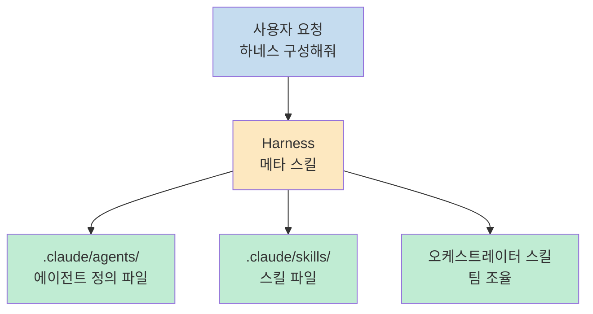

**주요 기능:**

- **에이전트 팀 설계** — 6가지 아키텍처 패턴으로 전문 에이전트 팀 구성
- **스킬 생성** — Progressive Disclosure 패턴으로 컨텍스트를 효율 관리하는 스킬 자동 생성
- **오케스트레이션** — 에이전트 간 데이터 전달, 에러 핸들링, 팀 조율 프로토콜 포함
- **검증 체계** — 트리거 검증, 드라이런 테스트, With-skill vs Without-skill 비교 테스트

## 6단계 워크플로우

Harness는 6개의 Phase로 하네스를 체계적으로 구성한다.

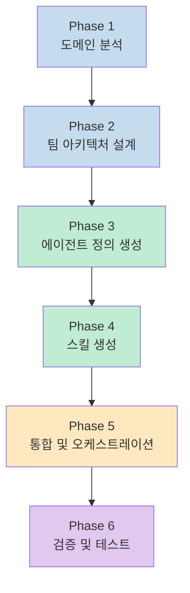

### Phase 1: 도메인 분석

사용자 요청에서 도메인/프로젝트를 파악하고, 핵심 작업 유형(생성, 검증, 편집, 분석 등)을 식별한다. 기존 에이전트/스킬과 충돌/중복이 없는지 확인하고, 프로젝트 코드베이스를 탐색해 기술 스택, 데이터 모델, 주요 모듈을 파악한다.

흥미로운 점은 **사용자 숙련도 감지**다. 대화의 맥락 단서(사용 용어, 질문 수준)로 기술 수준을 파악하고, 이후 커뮤니케이션 톤을 조절한다. 코딩 경험이 적은 사용자에게는 "assertion", "JSON schema" 같은 용어를 설명 없이 사용하지 않는다.

### Phase 2: 팀 아키텍처 설계

**실행 모드 선택**과 **아키텍처 패턴 선택** 두 단계로 구성된다. 에이전트를 어떻게 분리할지는 전문성·병렬성·컨텍스트·재사용성 4축으로 판단한다.

### Phase 3: 에이전트 정의 생성

모든 에이전트는 반드시 `프로젝트/.claude/agents/{name}.md` 파일로 정의한다. 에이전트 정의 파일 없이 Agent 도구의 prompt에 역할을 직접 넣는 것은 금지된다. 이유는 세 가지다:

1. 에이전트 정의가 파일로 존재해야 다음 세션에서 재사용 가능
2. 팀 통신 프로토콜이 명시되어야 에이전트 간 협업 품질 보장
3. 하네스의 핵심 가치는 에이전트(누가)와 스킬(어떻게)의 분리

모든 Agent 호출에는 반드시 `model: "opus"` 파라미터를 명시한다. 하네스의 품질은 에이전트의 추론 능력에 직결되기 때문이다.

### Phase 4: 스킬 생성

각 에이전트가 사용할 스킬을 `프로젝트/.claude/skills/{name}/skill.md`에 생성한다. Progressive Disclosure 패턴으로 컨텍스트를 효율적으로 관리한다(아래 별도 섹션에서 상세 설명).

### Phase 5: 통합 및 오케스트레이션

오케스트레이터 스킬이 개별 에이전트와 스킬을 하나의 워크플로우로 엮어 팀 전체를 조율한다. "각 에이전트가 무엇을 어떻게 하는가"(개별 스킬)와 "누가 언제 어떤 순서로 협업하는가"(오케스트레이터)를 명확히 분리한다.

### Phase 6: 검증 및 테스트

구조 검증, 트리거 검증, 드라이런 테스트, With-skill vs Without-skill 비교 테스트를 수행한다. 각 스킬에 대해 Should-trigger 쿼리(8~10개)와 Should-NOT-trigger 쿼리(8~10개)를 작성해 트리거 정확도를 검증한다.

## 6가지 아키텍처 패턴

Harness는 6가지 아키텍처 패턴을 지원한다. 각 패턴은 작업의 특성에 따라 선택한다.

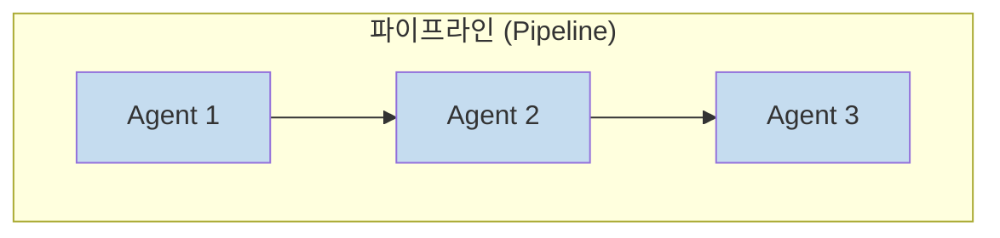

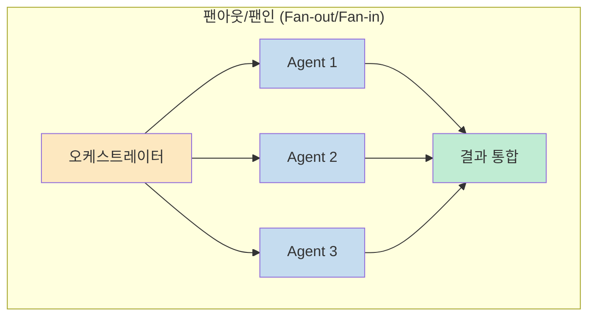

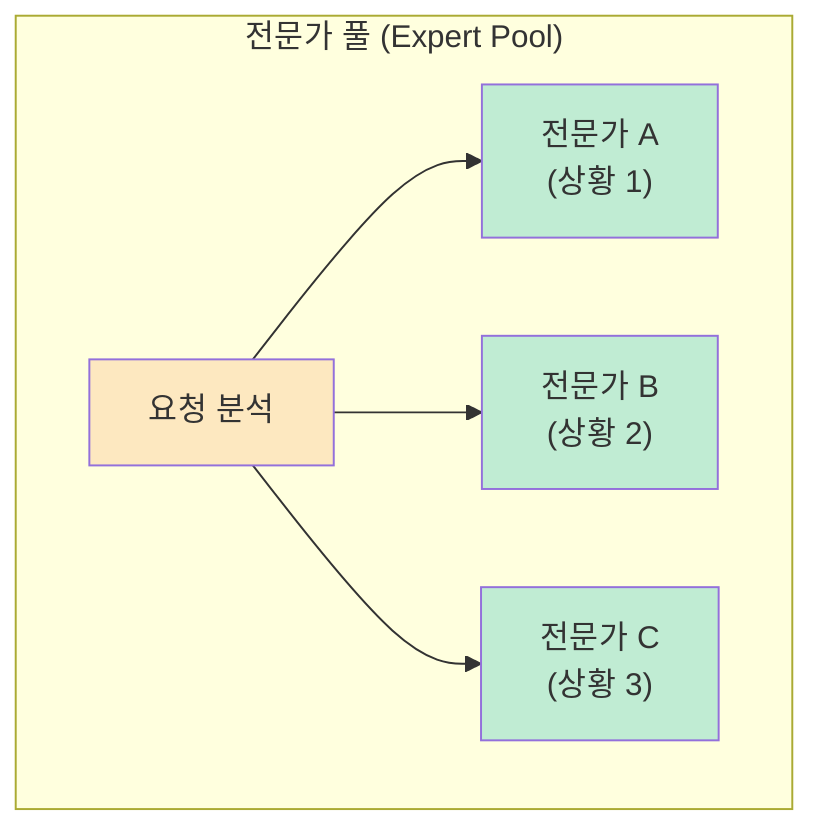

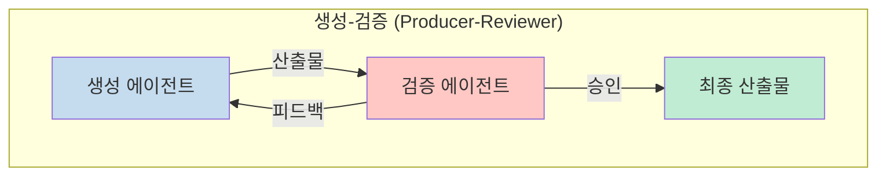

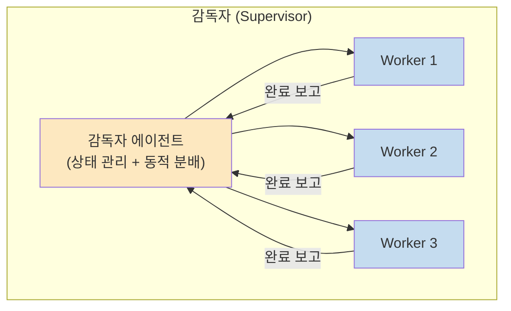

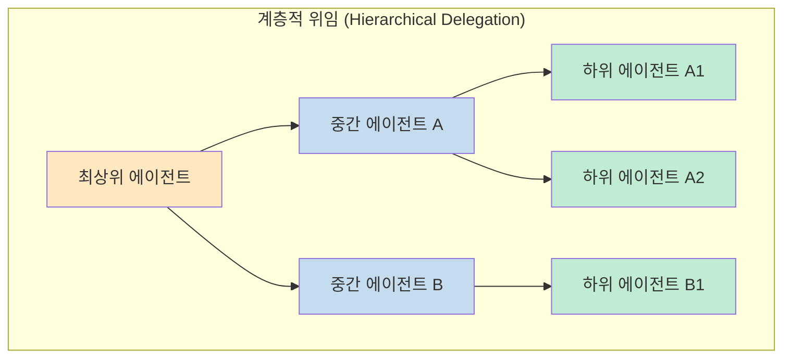

| 패턴 | 설명 | 적합한 경우 |
|------|------|-----------|
| **파이프라인** | 순차 의존 작업 | 이전 단계 출력이 다음 단계 입력 |
| **팬아웃/팬인** | 병렬 독립 작업 | 동시 처리 후 결과 통합 |
| **전문가 풀** | 상황별 선택 호출 | 문맥에 따라 다른 전문가 필요 |
| **생성-검증** | 생성 후 품질 검수 | 반복 개선이 필요한 창작/코딩 |
| **감독자** | 중앙 에이전트가 동적 분배 | 복잡한 상태 관리 필요 |
| **계층적 위임** | 상위→하위 재귀적 위임 | 복잡한 도메인 분해 |

## 실행 모드: 에이전트 팀 vs 서브 에이전트

Harness는 두 가지 실행 모드를 지원한다. **기본값은 에이전트 팀**이다.

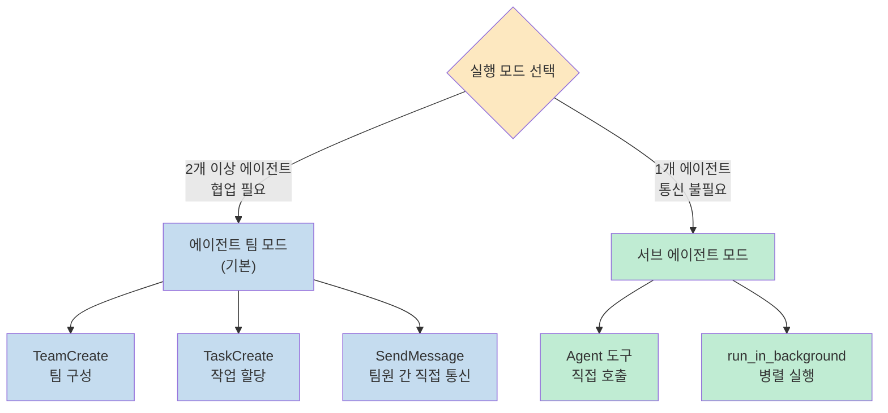

**에이전트 팀 모드**는 팀원 간 직접 통신(SendMessage)과 공유 작업 목록(TaskCreate)으로 자체 조율하며, 발견 공유·상충 토론·누락 보완이 결과 품질을 높인다.

**서브 에이전트 모드**는 에이전트가 1개뿐이거나, 에이전트 간 통신이 불필요한 구조(결과 전달만 필요)일 때 선택한다.

### 팀 크기 가이드라인

| 작업 규모 | 권장 팀원 수 | 팀원당 작업 수 |
|----------|------------|--------------|
| 소규모 (5~10개 작업) | 2~3명 | 3~5개 |
| 중규모 (10~20개 작업) | 3~5명 | 4~6개 |
| 대규모 (20개+ 작업) | 5~7명 | 4~5개 |

> 팀원이 많을수록 조율 오버헤드가 커진다. 3명의 집중된 팀원이 5명의 산만한 팀원보다 낫다.

## Progressive Disclosure 스킬 아키텍처

스킬은 3단계 로딩 시스템으로 컨텍스트 윈도우를 효율적으로 관리한다.

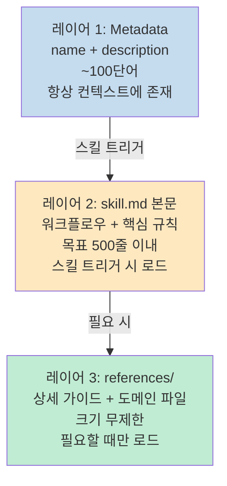

**크기 관리 규칙:**
- skill.md가 500줄에 근접하면 세부 내용을 `references/`로 분리하고, 본문에 "언제 이 파일을 읽으라"는 포인터를 남긴다
- 300줄 이상의 reference 파일에는 상단에 목차(ToC)를 포함한다
- 도메인/프레임워크별 변형이 있으면 `references/` 하위에 도메인별로 분리해 관련 파일만 로드한다

**스킬 description 작성의 핵심은 적극적("pushy") 트리거 유도다:**

나쁜 예: `"PDF 문서를 처리하는 스킬"`<br>
좋은 예: `"PDF 파일 읽기, 텍스트/테이블 추출, 병합, 분할, 회전, 워터마크, 암호화, OCR 등 모든 PDF 작업을 수행. .pdf 파일을 언급하거나 PDF 산출물을 요청하면 반드시 이 스킬을 사용할 것."`

## 에이전트 간 데이터 전달 프로토콜

오케스트레이터는 에이전트 간 데이터를 세 가지 방식으로 전달한다.

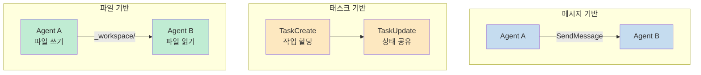

| 전략 | 방식 | 실행 모드 | 적합한 경우 |
|------|------|----------|-----------|
| **메시지 기반** | `SendMessage`로 팀원 간 직접 통신 | 에이전트 팀 | 실시간 조율, 피드백 교환, 가벼운 상태 전달 |
| **태스크 기반** | `TaskCreate`/`TaskUpdate`로 작업 상태 공유 | 에이전트 팀 | 진행상황 추적, 의존 관계 관리 |
| **파일 기반** | 약속된 경로에 파일을 쓰고 읽음 | 둘 다 | 대용량 데이터, 구조화된 산출물, 감사 추적 |

에이전트 팀 모드 권장 조합: **태스크 기반(조율) + 파일 기반(산출물) + 메시지 기반(실시간 소통)**

파일 기반 전달 시 파일명 컨벤션: `{phase}_{agent}_{artifact}.{ext}` (예: `01_analyst_requirements.md`)

## harness-100: 즉시 사용 가능한 100개 하네스

Harness 플러그인으로 생성된 **[revfactory/harness-100](https://github.com/revfactory/harness-100)** 은 10개 도메인, 100개의 프로덕션 레디 에이전트 팀 하네스를 한국어/영어 200패키지로 제공한다.

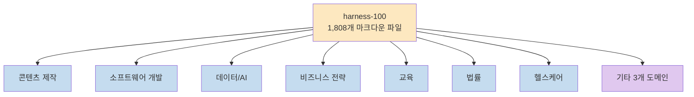

각 하네스에는 4~5명의 전문 에이전트, 오케스트레이터 스킬, 도메인 특화 스킬이 포함되어 있으며, 모두 Harness 플러그인으로 생성됐다.

## A/B 테스트 연구 결과

Harness의 효과를 검증하기 위해 15개 소프트웨어 엔지니어링 과제에 대한 통제 실험이 수행됐다 (출처: [revfactory/claude-code-harness](https://github.com/revfactory/claude-code-harness)).

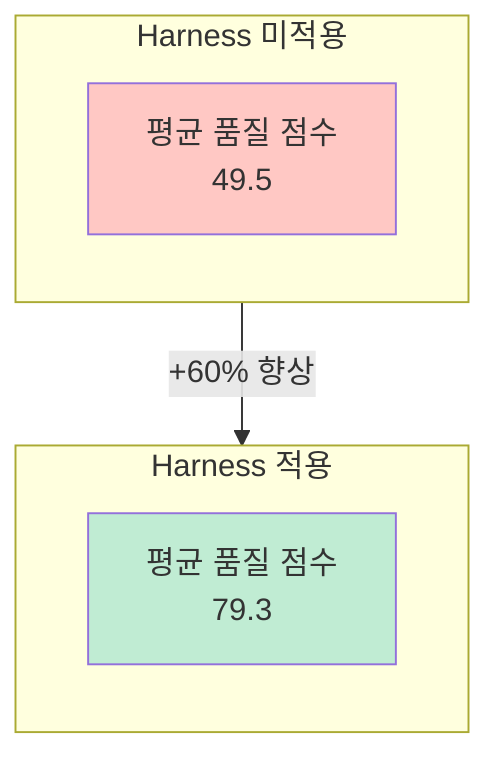

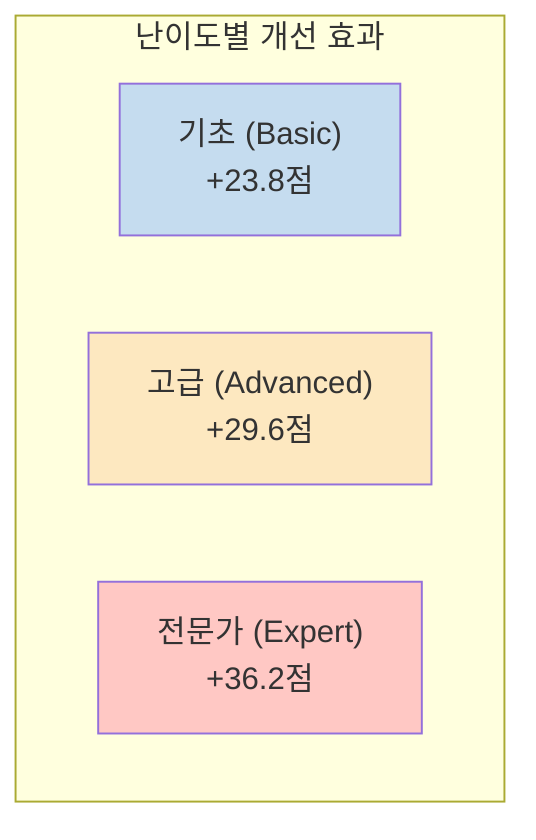

| 지표 | Harness 미적용 | Harness 적용 | 개선 |
|------|:-:|:-:|:-:|
| 평균 품질 점수 | 49.5 | 79.3 | **+60%** |
| 승률 | — | — | **100%** (15/15) |
| 출력 분산 | — | — | **-32%** |

핵심 발견: **과제 난이도가 높을수록 개선 효과가 증대**된다. 단순 작업보다 복잡한 전문가 수준 작업에서 Harness의 구조화된 사전 설정 효과가 더 크게 나타난다.

> 논문 전문: *Hwang, M. (2026). Harness: Structured Pre-Configuration for Enhancing LLM Code Agent Output Quality.*

## 설치 및 사용법

### 요구사항

Claude Code의 에이전트 팀 기능을 먼저 활성화해야 한다:

```bash
CLAUDE_CODE_EXPERIMENTAL_AGENT_TEAMS=1
```

### 설치 방법

**마켓플레이스를 통한 설치:**

```bash
/plugin marketplace add revfactory/harness
/plugin install harness@harness
```

**글로벌 스킬로 직접 설치:**

```bash
cp -r skills/harness ~/.claude/skills/harness
```

### 사용법

Claude Code에서 다음과 같이 트리거한다:

```
하네스 구성해줘
하네스 설계해줘
이 프로젝트에 맞는 에이전트 팀 구축해줘
```

### 산출물 구조

```
프로젝트/
├── .claude/
│   ├── agents/          # 에이전트 정의 파일
│   │   ├── analyst.md
│   │   ├── builder.md
│   │   └── qa.md
│   └── skills/          # 스킬 파일
│       ├── analyze/
│       │   └── skill.md
│       └── build/
│           ├── skill.md
│           └── references/
```

### 사용 사례 예시 프롬프트

**딥 리서치 하네스:**
```
리서치 하네스를 구성해줘. 어떤 주제든 여러 각도에서 조사할 수 있는
에이전트 팀이 필요해 — 웹 검색, 학술 자료, 커뮤니티 반응 —
교차 검증 후 종합 보고서를 작성하는 팀.
```

**코드 리뷰 하네스:**
```
종합 코드 리뷰 하네스를 구성해줘. 아키텍처, 보안 취약점, 성능 병목,
코드 스타일을 병렬로 감사하는 에이전트들이 결과를 하나의 리포트로
통합하는 팀.
```

**풀스택 개발 하네스:**
```
풀스택 웹사이트 개발 하네스를 구성해줘. 디자인, 프론트엔드(React/Next.js),
백엔드(API), QA 테스트를 와이어프레임부터 배포까지 파이프라인으로
조율하는 팀.
```

## 핵심 요약

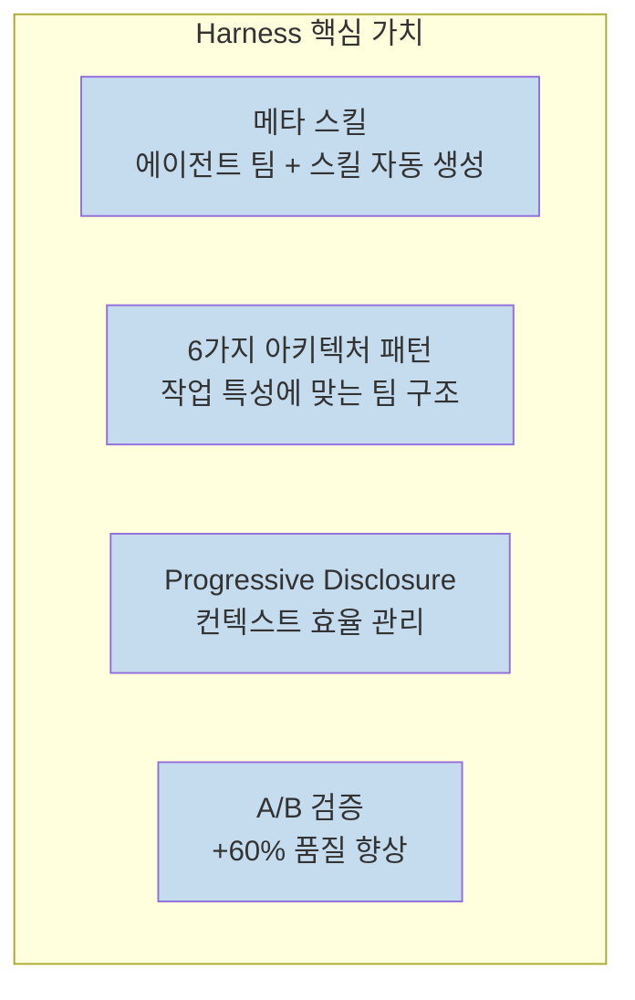

- **Harness**는 "하네스 구성해줘" 한 마디로 도메인 맞춤형 에이전트 팀과 스킬을 자동 생성하는 Claude Code 플러그인이다
- **6가지 아키텍처 패턴** (파이프라인, 팬아웃/팬인, 전문가 풀, 생성-검증, 감독자, 계층적 위임)으로 작업 특성에 맞는 팀 구조를 선택한다
- **에이전트(누가) vs 스킬(어떻게) 분리** 원칙으로 재사용성과 교체 가능성을 보장한다
- **Progressive Disclosure** 3단계 로딩으로 컨텍스트 윈도우를 효율적으로 관리한다
- A/B 테스트 결과 **+60% 품질 향상, 100% 승률, -32% 분산 감소**가 검증됐다
- **harness-100** 으로 10개 도메인 100개 하네스(1,808개 마크다운 파일)를 즉시 사용할 수 있다
- `CLAUDE_CODE_EXPERIMENTAL_AGENT_TEAMS=1` 환경 변수 설정이 필수다

## 결론

Harness는 Claude Code의 에이전트 팀 시스템을 처음부터 잘 설계하도록 도와주는 메타 도구다. "어떤 에이전트 팀을 만들어야 할까?"라는 막막한 질문 앞에서 6단계 워크플로우와 6가지 아키텍처 패턴이 체계적인 길잡이가 된다. A/B 테스트로 검증된 품질 향상 효과와 함께 harness-100의 즉시 사용 가능한 100개 하네스가 실용적인 출발점을 제공한다. 복잡한 도메인 작업을 Claude Code로 자동화하려는 개발자라면 Harness를 기반으로 시작하는 것이 효율적인 선택이다.
