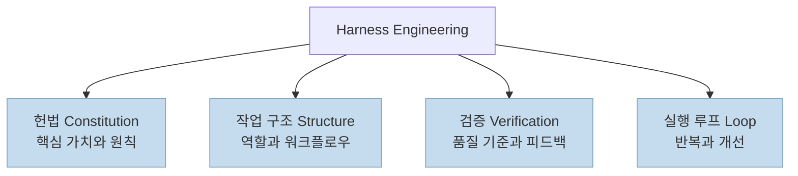
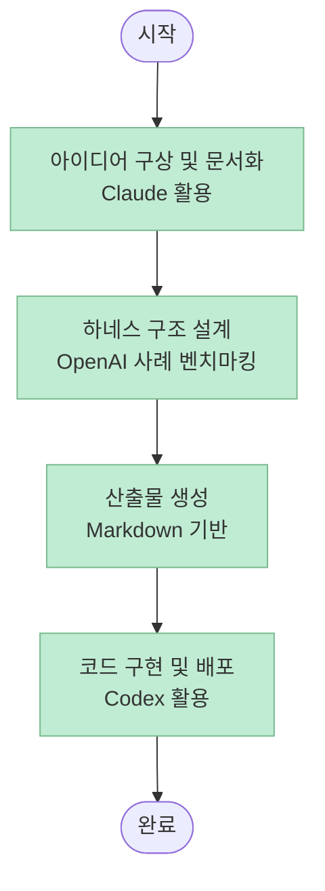
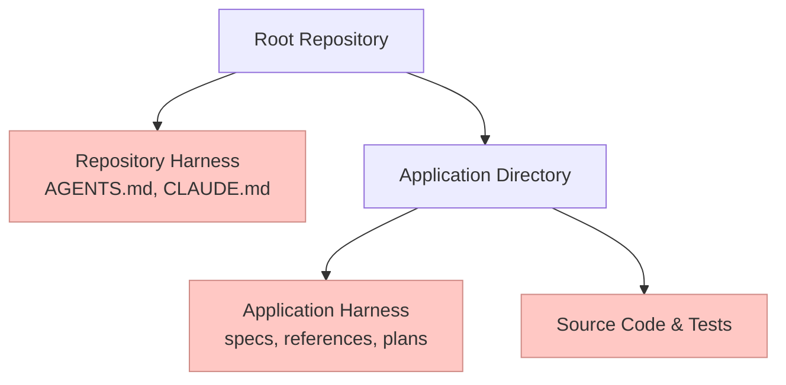
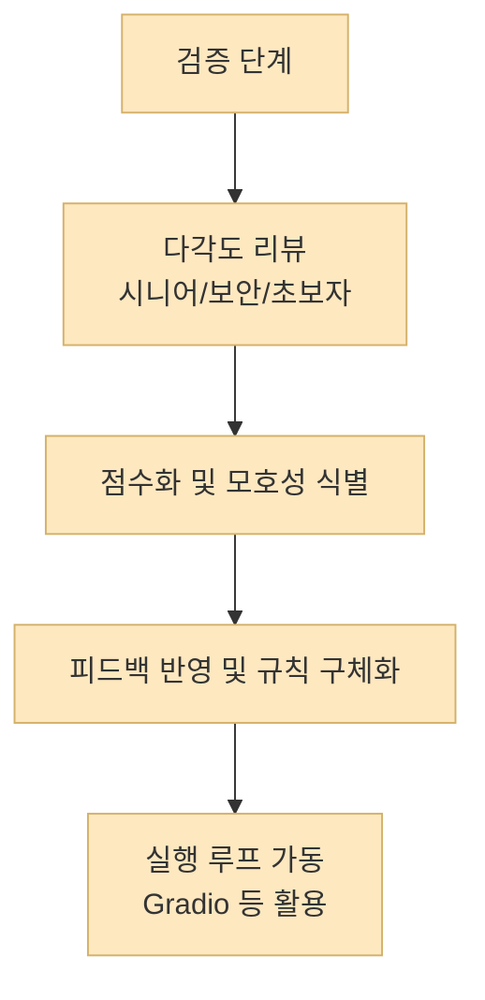
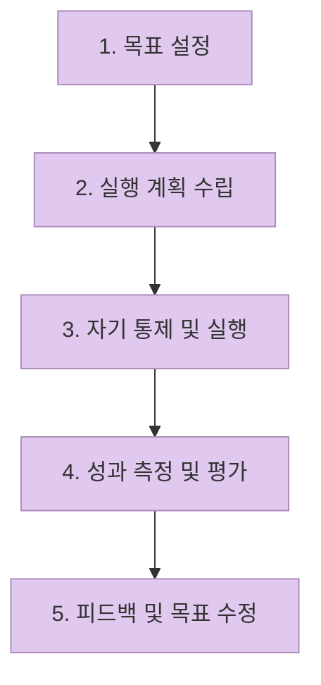

AI를 단순히 똑똑한 도구로 쓰는 단계를 넘어, 이제는 AI가 성과를 낼 수 있는 **환경** 을 설계하는 '하네스 엔지니어링(Harness Engineering)'이 주목받고 있습니다. 단순히 프롬프트를 잘 던지는 것이 아니라, AI가 일하는 방식과 규칙, 검증 절차를 시스템화하는 것이 핵심입니다.

이 글은 아래 영상을 기반으로, 하네스 엔지니어링의 개념부터 사주 분석 앱을 만드는 실전 사례, 그리고 피터 드러커의 MBO(Management by Objectives)를 결합한 관리 관점의 AI 운영 전략을 정리한 가이드입니다.

- 영상: [하네스 엔지니어링 따라하기 (Harness Engineering Practice feat. Management)](https://www.youtube.com/watch?v=kSlYNeEkdAM)
- 채널: Ask Dori! Dori와 따라하는 IT

<!--more-->

## Sources

- [하네스 엔지니어링 따라하기 (Harness Engineering Practice feat. Management)](https://www.youtube.com/watch?v=kSlYNeEkdAM)

## 하네스 엔지니어링의 정의와 4대 구성 요소

하네스 엔지니어링은 AI가 최상의 성과를 낼 수 있도록 **작업 환경을 설계하는 것** 을 의미합니다([56s](https://youtu.be/kSlYNeEkdAM?t=56)). 단순히 질문을 잘하는 프롬프트 엔지니어링을 넘어, 규칙(Rules), 작업 구조(Task Structure), 검증(Verification), 실행 루프(Execution Loop)를 하나의 패키지로 묶는 과정입니다([149s](https://youtu.be/kSlYNeEkdAM?t=149)).

영상의 화자는 하네스 엔지니어링을 다음 4가지 핵심 요소로 정의합니다([168s-201s](https://youtu.be/kSlYNeEkdAM?t=168)).

이러한 하네스는 적용 범위에 따라 두 가지로 나뉩니다([435s-442s](https://youtu.be/kSlYNeEkdAM?t=435)). 
첫째, **리포지토리 하네스 (Repository Harness)** 는 회사의 '취업 규칙'처럼 프로젝트 전반에 적용되는 공통 규칙입니다. 
둘째, **애플리케이션 하네스 (Application Harness)** 는 특정 팀의 '프로젝트 매뉴얼'처럼 개별 작업에 특화된 상세 지침입니다.

영상에서는 OpenAI의 사례를 빌려, 단 3명의 엔지니어가 5개월 동안 100만 줄 규모의 코드를 만들면서도 직접 짠 코드는 한 줄도 없었다는 수치를 언급하며 하네스의 위력을 강조합니다([286s-303s](https://youtu.be/kSlYNeEkdAM?t=286)). 이 대목은 영상 속 비유에만 머무는 것이 아니라, OpenAI 공식 글 "[Harness engineering: leveraging Codex in an agent-first world](https://openai.com/index/harness-engineering/)"에서도 같은 맥락의 수치로 확인됩니다.

## 실전 사례: 사주 분석 앱 만들기

이론을 넘어 실제 앱을 만드는 과정을 통해 하네스 엔지니어링의 위력을 확인할 수 있습니다. 영상에서는 규칙 기반의 간단한 **사주 분석 앱** 을 예로 듭니다([491s-532s](https://youtu.be/kSlYNeEkdAM?t=491)).

작업 과정에서 도구의 특성을 활용하는 점이 인상적입니다. 아이디어 구상과 문서 기반의 토론에는 **Claude** 가 적합하고, 실제 코드 구현에는 **Codex** 가 더 효율적이라는 경험을 공유합니다([543s-549s](https://youtu.be/kSlYNeEkdAM?t=543)).

특히, 처음부터 모든 것을 새로 만들기보다 기존의 잘 설계된 하네스 구조(예: OpenAI의 하네스 아티클)를 벤치마킹하여 폴더 구조를 복사하는 방식이 실무에서 매우 유용합니다([577s-645s](https://youtu.be/kSlYNeEkdAM?t=577)). 생성된 마크다운 산출물들을 압축 파일로 내려받아 프로젝트 폴더에 해제하는 것만으로도 강력한 작업 환경이 구축됩니다([912s-945s](https://youtu.be/kSlYNeEkdAM?t=912)).

## 하네스 구조의 상세 설계

하네스는 리포지토리 수준과 애플리케이션 수준에서 계층적으로 설계됩니다([1196s-1318s](https://youtu.be/kSlYNeEkdAM?t=1196)).

여기서 중요한 점은 **헌법(Constitution)** 을 만들 때 AI에게 모든 것을 맡기지 말고, AI와 함께 대화하며 만들어야 한다는 것입니다([1156s-1165s](https://youtu.be/kSlYNeEkdAM?t=1156)). 또한, 사람이 당연하게 여기는 '암묵지'를 명시적인 규칙으로 끌어내야 합니다. 예를 들어, "코드는 500줄 이하로 유지하라"는 규칙은 AI가 스스로 추론하기 어렵기 때문에 반드시 하네스에 포함해야 합니다([1520s-1598s](https://youtu.be/kSlYNeEkdAM?t=1520)).

## 검증과 실행 루프: 모호함 제거하기

하네스 엔지니어링의 핵심은 **검증(Verification)** 입니다. 작성된 문서는 시니어 개발자, 보안 전문가, 초보자 등 다양한 관점에서 리뷰되어야 하며, 각 관점별로 점수를 매기고 모호함을 줄여야 합니다([1405s-1489s](https://youtu.be/kSlYNeEkdAM?t=1405)).

특히 "한두 번 시도해보고"와 같은 모호한 표현은 "최대 5회 시도"와 같이 명확한 수치로 대체해야 AI가 정확하게 판단할 수 있습니다([1453s-1471s](https://youtu.be/kSlYNeEkdAM?t=1453)).

실행 루프에서는 Gradio와 같은 도구를 활용해 실제 작동 여부를 확인하고, 그 결과를 다시 하네스에 반영하여 시스템을 지속적으로 고도화합니다([1600s-1769s](https://youtu.be/kSlYNeEkdAM?t=1600)).

## 경영학적 관점: MBO와 하네스

하네스 엔지니어링은 단순한 기술을 넘어 **매니지먼트(Management)** 의 영역입니다. 영상에서는 나쁜 매니저의 유형으로 '지시만 하는 타입'과 '방임하는 타입'을 꼽으며, 진정한 위임은 하네스를 통해 이루어진다고 강조합니다([1833s-1866s](https://youtu.be/kSlYNeEkdAM?t=1833)).

피터 드러커의 **MBO(Management by Objectives)** 프레임워크는 하네스 운영과 매우 닮아 있습니다([1901s-1932s](https://youtu.be/kSlYNeEkdAM?t=1901)).

또한, 영상에서는 잭 샤피로(Jack Shapiro)의 '10배의 변호사(10x Lawyer)' 사례를 언급하며, AI를 통해 전문가의 생산성이 어떻게 극대화될 수 있는지를 설명합니다([1977s-1987s](https://youtu.be/kSlYNeEkdAM?t=1977)). 다만 이 사례명과 인물 표기는 영상 화자의 소개를 따른 것이고, 별도 원문 확인은 추가로 필요하다는 점을 같이 기억하는 편이 안전합니다.

지난 2~3년 사이 AI의 컨텍스트 윈도우는 A4 용지 1.5장 수준에서 수권의 소설책 분량으로 비약적으로 확장되었습니다([2040s-2057s](https://youtu.be/kSlYNeEkdAM?t=2040)). 이러한 기술적 진보가 하네스 엔지니어링을 가능하게 하는 토대가 되었습니다.

하네스는 조직의 핵심 가치, 판단 기준, 검증 기준을 재사용 가능한 자산으로 만드는 과정입니다([2116s-2149s](https://youtu.be/kSlYNeEkdAM?t=2116)). 이를 통해 51번째 작업은 50번째 작업보다 더 강력한 기반 위에서 시작할 수 있게 됩니다([2180s-2184s](https://youtu.be/kSlYNeEkdAM?t=2180)).

## 핵심 요약

1. **하네스 엔지니어링** 은 AI가 일할 수 있는 최적의 환경(규칙, 구조, 검증, 루프)을 설계하는 것입니다.
2. **헌법과 작업 구조** 를 통해 AI에게 명확한 가이드라인을 제공하고, 암묵지를 명시적 규칙으로 전환해야 합니다.
3. **다각도 검증** 과 모호성 제거를 통해 AI의 판단 정확도를 높이고, 실행 루프를 통해 지속적으로 개선합니다.
4. **MBO 프레임워크** 를 적용하여 AI를 단순한 도구가 아닌, 조직의 일원으로 관리하고 자산화해야 합니다.

## 결론

AI는 한 개인이 마치 하나의 조직처럼 움직일 수 있게 해주는 강력한 도구입니다. 그리고 **하네스** 는 그 조직의 '멘탈 모델'이자 운영 체제입니다([2197s-2230s](https://youtu.be/kSlYNeEkdAM?t=2197)). 단순히 프롬프트를 고민하는 단계를 넘어, 나만의 하네스를 구축하고 고도화하는 것이 AI 시대의 진정한 경쟁력이 될 것입니다.
