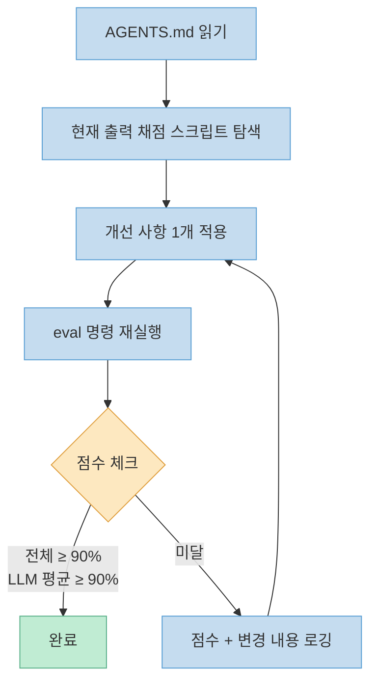
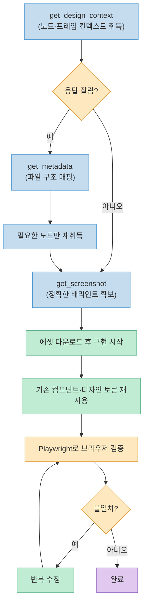
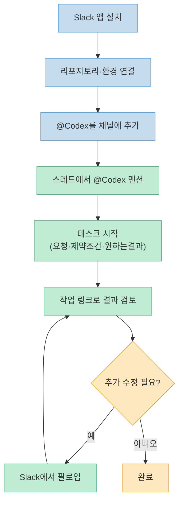
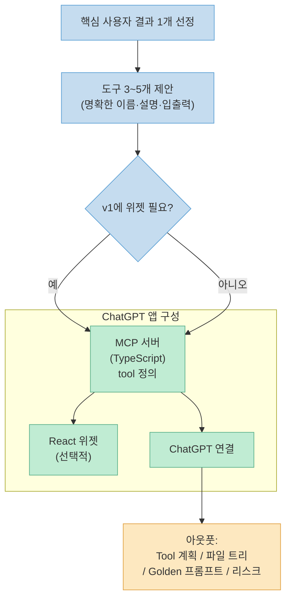
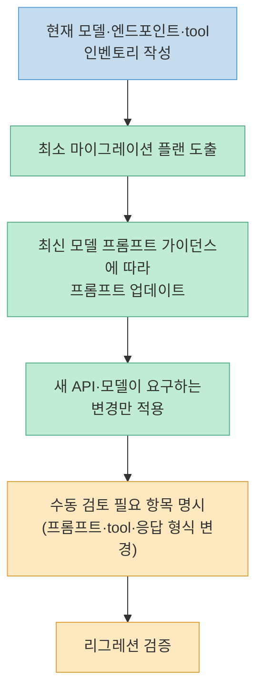

OpenAI가 agentic 코딩 도구 **Codex**를 실무에 바로 적용할 수 있는 12가지 유즈케이스를 공식 문서로 정리해 공개했습니다.

각 케이스에는 권장 팀/카테고리, 스타터 프롬프트, 활용 Skills 정보가 포함되어 있으며, Engineering·Front-end·Data·Integrations·Mobile·Evaluation 6개 카테고리로 분류됩니다.

<!--more-->

## Sources

- [Codex 활용 사례 모음 — GeekNews](https://news.hada.io/topic?id=27938)
- [Codex Use Cases — OpenAI Developers](https://developers.openai.com/codex/use-cases)

---

## 전체 구조 한눈에 보기

```mermaid
flowchart TD
    CODEX["OpenAI Codex<br>활용 사례 12가지"] --> ENG["Engineering<br>(4개)"]
    CODEX --> FE["Front-end<br>(2개)"]
    CODEX --> DATA["Data<br>(2개)"]
    CODEX --> INT["Integrations<br>(2개)"]
    CODEX --> MOB["Mobile<br>(1개)"]
    CODEX --> EVAL["Evaluation<br>(1개)"]

    ENG --> E1["코드베이스 이해\n(Easy / 5분)"]
    ENG --> E2["어려운 문제 반복 풀기\n(Advanced / Long)"]
    ENG --> E3["PR 빠르게 리뷰\n(Easy / 5분)"]
    ENG --> E4["브라우저 게임 만들기\n(Intermediate / Long)"]

    FE --> F1["반응형 UI 빌드\n(Intermediate / 1hr)"]
    FE --> F2["Figma → 코드\n(Intermediate / 1hr)"]

    DATA --> D1["데이터셋 분석·리포트\n(Intermediate / 1hr)"]
    DATA --> D2["슬라이드 덱 생성\n(Easy / 30분)"]

    INT --> I1["Slack 코딩 태스크\n(Easy / 5분)"]
    INT --> I2["ChatGPT 앱 만들기\n(Advanced / 1hr)"]

    MOB --> M1["iOS·macOS 앱 빌드\n(Advanced / 1hr)"]

    EVAL --> EV1["API 인테그레이션 업그레이드\n(Intermediate / 1hr)"]

    classDef engStyle fill:#c5dcef,stroke:#5a9fd4,color:#333
    classDef feStyle fill:#c0ecd3,stroke:#5ab08a,color:#333
    classDef dataStyle fill:#fde8c0,stroke:#e0a040,color:#333
    classDef intStyle fill:#e0c8ef,stroke:#9060c0,color:#333
    classDef mobStyle fill:#ffc8c4,stroke:#e05050,color:#333
    classDef evalStyle fill:#d0e8ff,stroke:#4080c0,color:#333

    class E1,E2,E3,E4 engStyle
    class F1,F2 feStyle
    class D1,D2 dataStyle
    class I1,I2 intStyle
    class M1 mobStyle
    class EV1 evalStyle
```



---

## Engineering 카테고리

### 1. PR 빠르게 리뷰하기

**카테고리**: Integration / Automation | **난이도**: Easy | **소요시간**: 5분

GitHub 조직 또는 리포지토리에 Codex code review를 추가하면 모든 PR에 자동 리뷰를 설정할 수 있습니다. 또는 PR 댓글에 `@codex review`를 입력해 수동으로 요청하는 방식도 가능합니다.

```
@codex review for security regressions, missing tests, and risky behavior changes
```

이슈 발견 시 `@codex fix it` 댓글로 수정 클라우드 태스크를 바로 생성하고 PR을 업데이트합니다.

**AGENTS.md 커스터마이징:**
- 오탈자·문법 오류 → P0 (최우선)
- 문서 누락·테스트 누락 → P1
- 파일별로 가장 가까운 `AGENTS.md` 지침이 적용되므로, 특정 패키지는 서브디렉토리에 별도 지침 배치 가능

**활용 Skill**: Security Best Practices — 시크릿·인증·의존성 변경 등 위험 영역 집중 리뷰

**적합 대상**: 머지 승인 전 추가 검토 시그널이 필요한 팀, 프로덕션 운영 중인 대형 코드베이스

---

### 2. 대형 코드베이스 이해하기

**카테고리**: Engineering / Analysis | **난이도**: Easy | **소요시간**: 5분

낯선 리포지토리에 진입했을 때 Codex에게 전체 코드베이스를 설명해 달라고 요청하는 것으로 시작합니다. 특정 시스템 영역에 기여해야 할 경우 범위를 좁힐수록 더 구체적인 설명을 얻을 수 있습니다.

```
Explain how the request flows through <name of the system area> in the codebase.
Include: which modules own what / where data is validated / the top gotchas
to watch for before making changes. End with the files I should read next.
```

**적합 대상**: 새 리포지토리에 온보딩 중인 신규 엔지니어, 기능 변경 전 동작 방식을 파악해야 하는 개발자

---

### 3. 어려운 문제 반복 풀기

**카테고리**: Engineering / Analysis | **난이도**: Advanced | **소요시간**: Long-running

평가 스크립트(eval)를 제공하면 Codex가 점수 기반 개선 루프를 돌며 자동 반복 개선을 수행합니다.



**핵심 제약 조건:**
- 첫 번째 수용 가능한 결과에서 멈추지 말 것
- 새 결과가 명확히 더 나쁘지 않은 이상 이전 버전으로 복원 금지
- 시각적 출력이라면 `view_image`로 직접 검사

**적합 대상**: 반복마다 채점 가능한 문제, 결정적 검사와 LLM-as-a-judge 점수가 모두 필요한 시각·주관적 출력, 진행 상황 추적이 필요한 장기 세션

---

### 4. 브라우저 기반 게임 만들기

**카테고리**: Engineering / Code | **난이도**: Intermediate | **소요시간**: Long-running

게임 브리프 → `PLAN.md`로 먼저 구체적인 계획 작성 → 실제 게임 빌드 순서로 진행합니다.

```
Use $playwright-interactive, $imagegen, and $openai-docs to plan and build
a browser game in this repo. Implement PLAN.md, and log your work under .logs/
```

**활용 Skills:**
- **Playwright**: 라이브 브라우저에서 게임 플레이, 현재 상태 검사, 컨트롤·타이밍·UI 반복 수정
- **ImageGen**: 컨셉 아트·스프라이트·배경·UI 에셋 생성, 재사용 가능한 프롬프트 저장
- **OpenAI Docs**: 게임에 OpenAI 기능 연결 전 최신 공식 가이드 참조

---

## Front-end 카테고리

### 5. 반응형 프론트엔드 디자인 빌드하기

**카테고리**: Front-end / Design | **난이도**: Intermediate | **소요시간**: 1시간

스크린샷·디자인 브리프·레퍼런스 이미지를 입력하면 Codex가 **기존 디자인 시스템 컴포넌트와 토큰**을 재사용해 반응형 UI 코드로 변환합니다.

**핵심 프롬프트 요구사항:**
- 기존 컴포넌트·디자인 시스템 재사용 (새 시스템 병렬 생성 금지)
- 스페이싱·레이아웃·계층 구조·반응형 동작을 스크린샷과 최대한 일치
- 리포지토리의 라우팅·상태 관리·데이터 패치 패턴 준수
- 모호한 부분은 가장 단순한 구현 선택 후 가정 사항 명시

**Playwright 스킬**로 실제 브라우저를 열어 구현 결과물과 스크린샷을 비교하고 반복 수정합니다. 브라우저 창 크기 조절로 다양한 브레이크포인트에서 레이아웃을 검증할 수 있습니다.

좋은 결과를 위해 데스크톱·모바일 레이아웃, 호버/선택 상태, 빈 화면·로딩 화면 등 **다양한 상태의 레퍼런스**를 제공하는 것이 권장됩니다.

---

### 6. Figma 디자인을 코드로 전환하기

**카테고리**: Front-end / Design | **난이도**: Intermediate | **소요시간**: 1시간

**Figma MCP 서버**를 통해 구조화된 디자인 컨텍스트·변수·에셋·정확한 배리언트를 가져온 뒤, 리포지토리의 디자인 시스템에 맞는 코드로 변환합니다.



**Figma 파일 사전 준비 권장사항:**
- 색상·타이포그래피·스페이싱에 **변수(variables) 또는 디자인 토큰** 사용
- 반복 UI 요소는 컴포넌트화, detached 레이어 반복 지양
- 수동 포지셔닝 대신 **auto layout** 최대한 활용
- 프레임·레이어 이름을 화면·상태·배리언트가 명확히 구분되도록 설정
- 실제 아이콘·이미지를 파일 내에 유지

**주의**: Figma MCP 출력물(React + Tailwind 형태)은 **구조적 레퍼런스**로 취급하고, 최종 코드 스타일은 프로젝트의 실제 유틸리티·컴포넌트·색상 시스템·타이포그래피·라우팅·상태 관리 패턴으로 번역해야 합니다.

---

## Data 카테고리

### 7. 데이터셋 분석 및 리포트 생성

**카테고리**: Data / Analysis | **난이도**: Intermediate | **소요시간**: 1시간

지저분한 데이터 파일을 정제·조인·탐색적 분석·모델링까지 수행하고, **재사용 가능한 아티팩트**로 패키징합니다.

**스타터 프롬프트 흐름:** `AGENTS.md` 읽기 → 데이터셋 로드 → 파일 내용·조인 키·데이터 품질 이슈 설명 → import부터 시각화·모델링·리포트 출력까지 재현 가능한 워크플로 제안

**핵심 제약 조건:**
- 일회성 노트북 상태 대신 스크립트·저장된 아티팩트 선호
- 누락 값이나 병합 키 임의 생성 금지

**활용 Skills**: Spreadsheet(CSV·TSV·Excel 검사), Jupyter Notebook(탐색적 분석), Doc(`.docx` 리포트), Pdf(최종 아티팩트 PDF 렌더링)

---

### 8. 슬라이드 덱 자동 생성

**카테고리**: Data / Automation | **난이도**: Easy | **소요시간**: 30분

**pptx 파일**을 코드로 직접 편집하고, 이미지 생성을 결합해 반복 가능한 레이아웃 규칙을 슬라이드별로 적용합니다.

**활용 Skills:**
- **Slides**: PptxGenJS로 `.pptx` 덱 생성·편집, 오버플로·오버랩·폰트 검사용 렌더 및 검증 스크립트 포함
- **ImageGen**: 일러스트·커버 아트·다이어그램·슬라이드 비주얼 생성, 재사용 가능한 비주얼 방향 유지

**적합 대상**: 노트·구조화된 입력을 반복 가능한 슬라이드로 만드는 팀, 스크린샷·PDF·레퍼런스 프레젠테이션에서 덱 재구성

---

## Integrations 카테고리

### 9. Slack에서 코딩 태스크 시작하기

**카테고리**: Integrations / Automation | **난이도**: Easy | **소요시간**: 5분



스타터 프롬프트 예:
```
@Codex analyze the issue mentioned in this thread and implement
a fix in <name of your environment>
```

**팁**: 스레드에 충분한 컨텍스트나 수정 제안이 없을 경우 프롬프트에 직접 포함할 것

**적합 대상**: Slack 스레드에서 시작하는 비동기 핸드오프, 컨텍스트 전환 없이 이슈 트리아지·버그 수정·범위 한정 구현이 필요한 팀

---

### 10. ChatGPT 앱 만들기

**카테고리**: Integrations / Code | **난이도**: Advanced | **소요시간**: 1시간

모든 ChatGPT 앱은 **MCP 서버(tool 정의) + 선택적 React 위젯 + ChatGPT 연결** 3가지로 구성됩니다.



**활용 Skills:**
- **ChatGPT Apps**: tool 계획·MCP 리소스 연결·빌드 플로 안내
- **OpenAI Docs**: 코드 작성 전 최신 Apps SDK 가이드 참조
- **Vercel**: Vercel 생태계 가이드 및 공식 Vercel MCP 서버 활용

---

## Mobile 카테고리

### 11. iOS 및 macOS 앱 빌드하기

**카테고리**: Mobile / Code | **난이도**: Advanced | **소요시간**: 1시간

**SwiftUI** 프로젝트 스캐폴딩부터 빌드·디버그까지 CLI 우선(`xcodebuild` 또는 Tuist)으로 진행합니다. 기존 Xcode 프로젝트가 있다면 **XcodeBuildMCP**로 타겟 나열·스킴 선택·빌드·실행·스크린샷 캡처를 반복합니다.

**핵심 제약 조건:**
- CLI 우선 유지
- 기존 모델·네비게이션 패턴·공유 유틸리티 재사용
- 명시적으로 범위를 한정하지 않는 한 iOS·macOS 호환성 유지
- 변경마다 소규모 검증 루프 실행

**산출물**: 앱 스캐폴드 또는 요청한 기능 슬라이스 / 빌드·실행 스크립트 / 실행한 최소 검증 단계 / 사용한 스킴·시뮬레이터·체크 명세

---

## Evaluation 카테고리

### 12. API 인테그레이션 업그레이드

**카테고리**: Evaluation / Code | **난이도**: Intermediate | **소요시간**: 1시간

기존 OpenAI API 인테그레이션을 **최신 권장 모델과 API 기능**으로 업그레이드하면서 리그레션 검증까지 수행합니다.



**활용 Skill**: OpenAI Docs — 코드 수정 전 최신 모델·마이그레이션·API 가이드 참조

**적합 대상**: 구형 모델이나 API 인터페이스에서 업그레이드하는 팀, 명시적 검증을 동반한 동작 보존형 마이그레이션이 필요한 리포

---

## 핵심 요약

| # | 유즈케이스 | 카테고리 | 난이도 | 소요시간 | 핵심 Skill |
|---|-----------|---------|-------|---------|-----------|
| 1 | PR 자동 리뷰 | Integration | Easy | 5분 | Security Best Practices |
| 2 | 코드베이스 이해 | Engineering | Easy | 5분 | — |
| 3 | 어려운 문제 반복 풀기 | Engineering | Advanced | Long | eval 스크립트 |
| 4 | 브라우저 게임 만들기 | Engineering | Intermediate | Long | Playwright, ImageGen |
| 5 | 반응형 UI 빌드 | Front-end | Intermediate | 1hr | Playwright |
| 6 | Figma → 코드 | Front-end | Intermediate | 1hr | Figma MCP, Playwright |
| 7 | 데이터 분석·리포트 | Data | Intermediate | 1hr | Jupyter, Spreadsheet |
| 8 | 슬라이드 덱 생성 | Data | Easy | 30분 | Slides, ImageGen |
| 9 | Slack 코딩 태스크 | Integrations | Easy | 5분 | — |
| 10 | ChatGPT 앱 만들기 | Integrations | Advanced | 1hr | ChatGPT Apps, Vercel |
| 11 | iOS·macOS 앱 빌드 | Mobile | Advanced | 1hr | XcodeBuildMCP |
| 12 | API 인테그레이션 업그레이드 | Evaluation | Intermediate | 1hr | OpenAI Docs |

공통적으로 눈에 띄는 패턴이 있습니다:

- **AGENTS.md가 컨텍스트 전달의 핵심**: 리뷰 우선순위, 코드 스타일, 제약 조건을 파일로 관리하면 Codex가 프로젝트 규칙을 자동으로 따릅니다.
- **Playwright가 가장 많이 등장**: Front-end 디자인 검증, 게임 플레이, Figma-to-code 검증까지 시각적 결과물이 있는 작업에 전방위로 활용됩니다.
- **"멈추지 말 것" 원칙**: 어려운 문제 반복 풀기 케이스에서 명시적으로 강조한 제약 조건. 첫 번째 수용 가능한 결과에서 멈추지 않고 기준 점수(90%)를 달성할 때까지 반복합니다.

---

## 결론

OpenAI의 공식 가이드는 Codex를 "자동화 도구"가 아닌 **피드백 루프를 가진 에이전트**로 활용하는 방식에 집중하고 있습니다. eval 스크립트, Playwright 검증, AGENTS.md 컨텍스트 관리는 세 케이스 이상에서 반복적으로 등장하는 핵심 패턴입니다.

Easy 난이도의 5분짜리 케이스(PR 리뷰, 코드베이스 이해, Slack 태스크)부터 시작해 점진적으로 Advanced 케이스로 확장하는 접근이 가장 현실적입니다.
