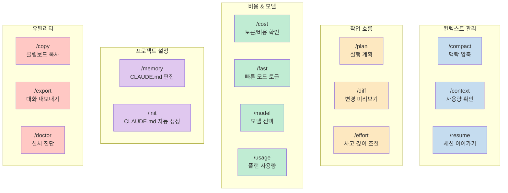
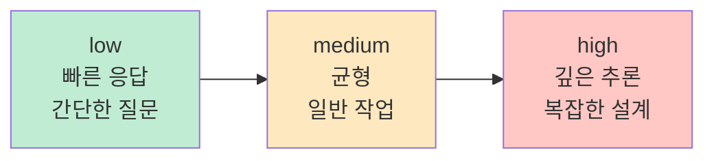
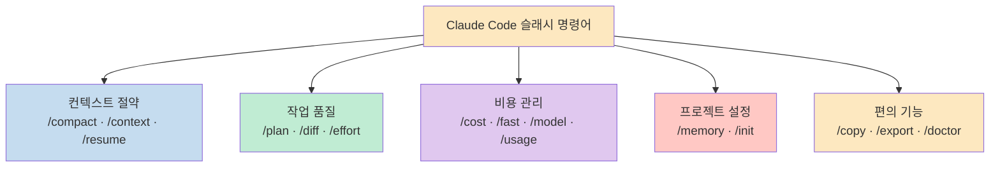

Claude Code를 매일 쓰면서도 정작 유용한 슬래시 명령어는 모르는 경우가 많다. Threads에서 조회 7,200회를 기록한 [@hyunsoo.it](https://www.threads.com/@hyunsoo.it)의 포스트에 14개 핵심 명령어가 정리돼 있어 블로그에 옮겨 적는다. 여기에 댓글에서 추가로 언급된 명령어까지 더했다.

<!--more-->

## Sources

- https://www.threads.com/@hyunsoo.it/post/DWdi0gPj2wm

## 명령어 한눈에 보기



## 컨텍스트 관리

### /compact — 대화 맥락 압축

긴 대화를 이어가다 보면 컨텍스트 윈도우가 가득 찬다. `/compact`는 현재 대화 맥락을 요약·압축해서 남은 컨텍스트를 확보한다. 대화를 새로 시작하지 않고도 흐름을 유지하면서 토큰을 절약할 수 있다.

```
/compact
```

### /context — 현재 컨텍스트 사용량 확인

지금 세션에서 컨텍스트를 얼마나 썼는지 확인한다. `/compact`나 `/resume`을 쓸 타이밍을 판단할 때 유용하다.

```
/context
```

### /resume — 이전 대화 이어가기

터미널을 닫아도 이전 대화를 복구할 수 있다. Claude Code는 세션 기록을 로컬에 저장하기 때문에, `/resume`으로 어디서 끊겼는지 되짚고 작업을 이어갈 수 있다.

```
/resume
```

> 댓글 반응 중 "터미널 껐다 켜면 다 날아가는 줄 알았음"이라는 공감이 많았다.

## 작업 흐름

### /plan — 실행 계획 수립

복잡한 작업을 시작하기 전에 Claude가 먼저 계획을 세우도록 한다. 바로 코드를 작성하는 대신 단계를 명확히 정리하고, 사용자와 방향을 맞춘 뒤 실행에 들어간다.

```
/plan
```

### /diff — 커밋 전 변경 내역 미리보기

커밋 전에 어떤 파일이 얼마나 바뀌었는지 확인한다. `git diff`를 직접 치지 않아도 대화 흐름 안에서 변경 내역을 검토할 수 있다.

```
/diff
```

### /effort — 사고 깊이 조절

Claude의 추론 깊이를 `low`, `medium`, `high` 세 단계로 조절한다. 간단한 질문엔 `low`로 빠르게 답하고, 복잡한 아키텍처 설계엔 `high`로 깊게 생각하게 할 수 있다.

```
/effort low
/effort medium
/effort high
```



## 비용 & 모델

### /cost — 세션 토큰 사용량 및 비용 확인

현재 세션에서 사용한 토큰 수와 예상 비용을 보여준다. API 비용을 관리하거나 세션 길이를 최적화할 때 참고한다.

```
/cost
```

### /fast — 빠른 응답 모드 토글

빠른 응답이 필요할 때 토글하는 모드다. 응답 속도를 높이는 대신 추론 깊이를 줄인다. 같은 Claude Opus 4.6 모델을 사용하되 응답 생성 방식을 조정한다.

```
/fast
```

### /model — 모델 직접 선택

Haiku, Sonnet, Opus 중에서 원하는 모델을 직접 고른다. 작업 특성에 따라 비용 대비 성능을 최적화할 수 있다.

```
/model
```

| 모델 | 특성 |
|------|------|
| Haiku | 빠르고 저렴, 단순 작업 |
| Sonnet | 균형, 일반 개발 작업 |
| Opus | 최고 품질, 복잡한 추론 |

### /usage — 플랜 사용량 확인

구독제(Max 플랜) 사용자라면 `/usage`로 이번 사이클에서 얼마나 사용했는지, 언제 초기화되는지 확인할 수 있다. 월 한도를 관리할 때 유용하다. (댓글에서 [@uiventure_dev](https://www.threads.com/@uiventure_dev) 추가 제보)

```
/usage
```

## 프로젝트 설정

### /memory — CLAUDE.md 프로젝트 규칙 편집

`CLAUDE.md`를 에디터 없이 Claude Code 대화 안에서 직접 수정한다. 프로젝트 컨벤션, 금지 명령어, 코딩 스타일 등을 빠르게 추가하거나 수정할 수 있다.

```
/memory
```

### /init — CLAUDE.md 자동 생성

프로젝트 파일을 분석해서 `CLAUDE.md`를 자동 생성한다. 새 프로젝트에 Claude Code를 처음 도입할 때 시작점으로 활용하면 좋다.

```
/init
```

## 유틸리티

### /copy — 마지막 응답 클립보드 복사

Claude의 마지막 응답을 바로 클립보드에 복사한다. 코드 스니펫이나 설명을 다른 곳에 붙여넣을 때 드래그-셀렉트 없이 한 방에 처리된다.

```
/copy
```

### /export — 전체 대화 파일로 내보내기

현재 세션의 전체 대화 내용을 파일로 저장한다. 작업 기록을 남기거나 팀에 공유할 때 사용한다.

```
/export
```

### /doctor — 설치 상태 자동 진단

Claude Code 설치 환경에 문제가 있는지 자동으로 진단한다. 권한, 의존성, 설정 파일 등 이슈를 체크하고 해결 방법을 제안한다.

```
/doctor
```

## 핵심 요약



- **컨텍스트 절약**: `/compact`(압축) + `/context`(사용량 확인) + `/resume`(세션 복구) 조합이 핵심
- **작업 전 루틴**: `/plan`으로 계획을 세우고, `/effort high`로 깊이를 높인 뒤 시작하면 품질이 올라간다
- **비용 관리**: `/cost`와 `/usage`로 소비량을 모니터링하고, 단순 작업엔 `/model`로 Haiku를 선택한다
- **프로젝트 첫 도입**: `/init`으로 CLAUDE.md를 만들고, `/memory`로 팀 규칙을 추가한다

## 결론

슬래시 명령어 하나하나가 작아 보여도, 매일 쓰다 보면 컨텍스트 낭비와 비용을 줄이는 데 실질적인 차이가 난다. `/compact`와 `/resume`만 익혀도 "컨텍스트가 다 찼으니 새 세션 시작"하는 일이 크게 줄어든다. `/effort`와 `/model` 조합으로 작업 복잡도에 맞게 추론 깊이와 모델을 맞추는 것도 실무 효율을 높이는 좋은 습관이다.
