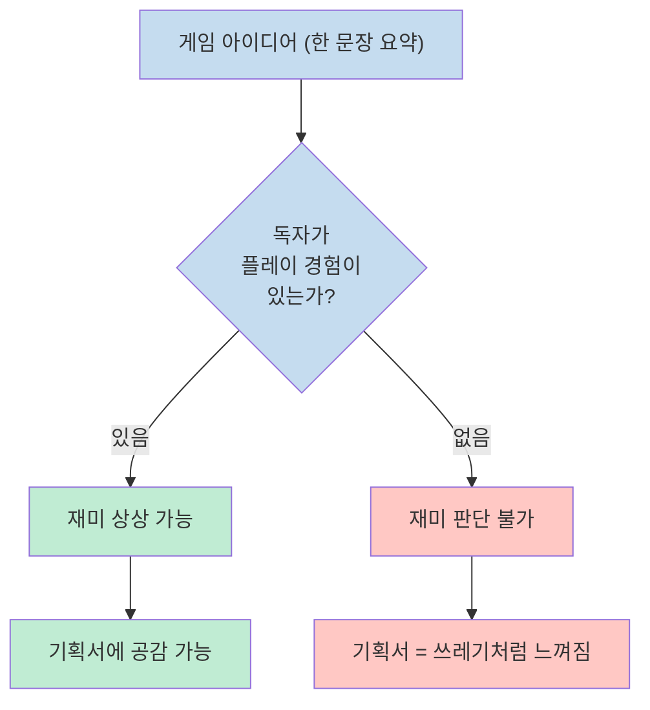
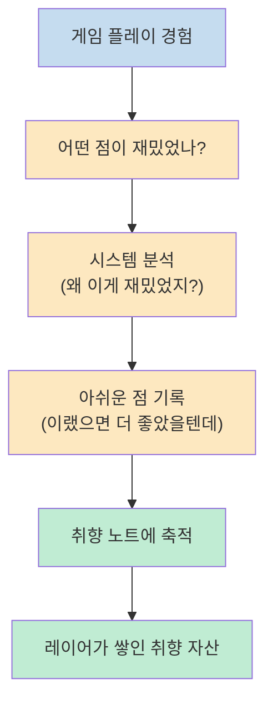
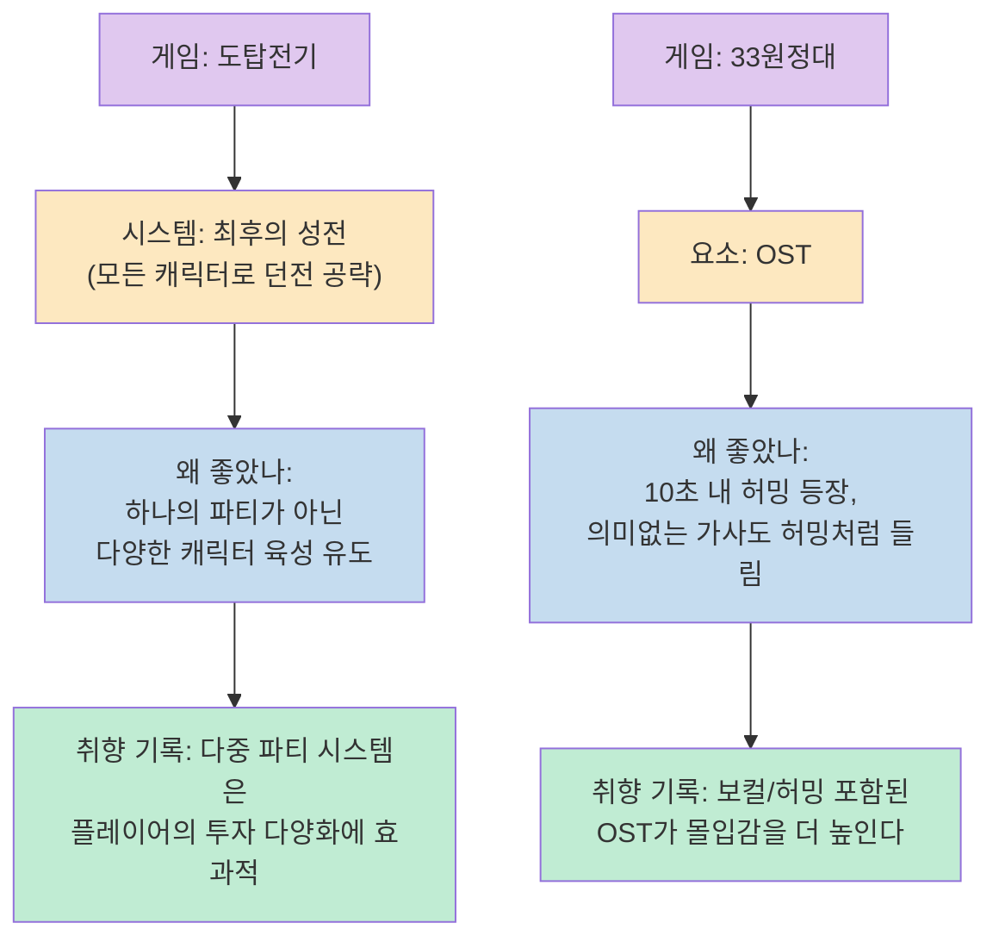
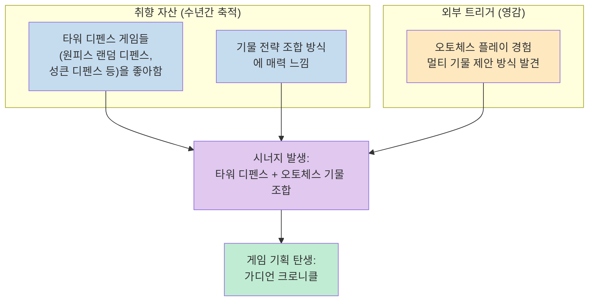
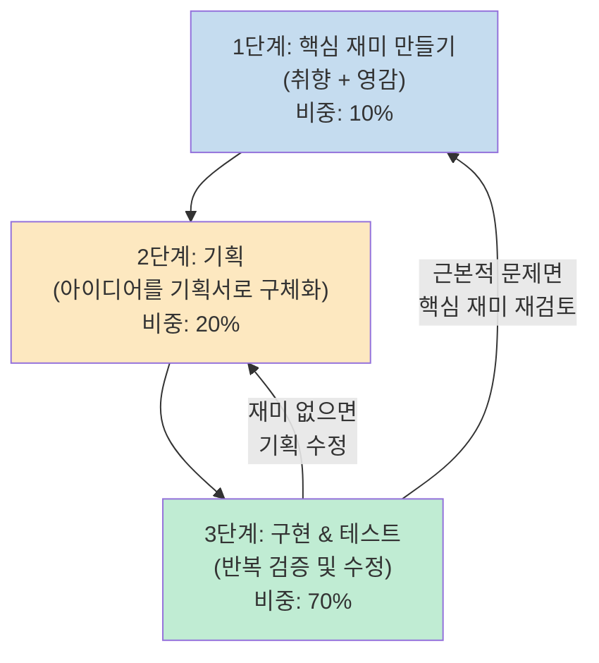
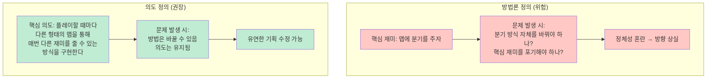
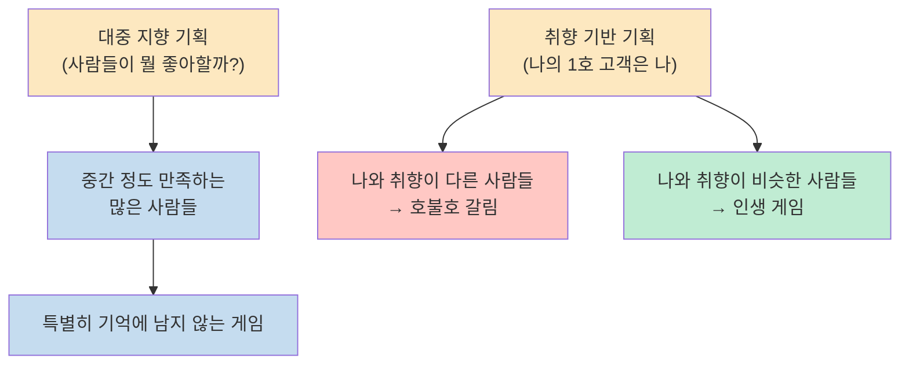
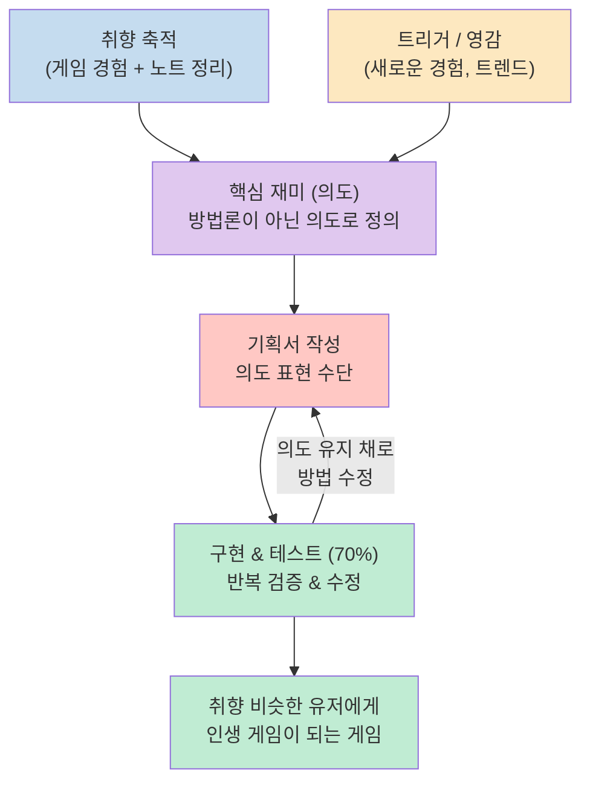

게임 기획서를 열심히 썼는데 주변 반응이 시큰둥하다면, 그건 기획서의 글쓰기 실력 문제가 아닐 수 있다. 게임 개발자 200원이 유튜브 채널에서 던진 도발적인 명제 — "당신의 기획서는 쓰레기다" — 는 사실 기획서 자체를 비하하는 말이 아니다. 기획서보다 훨씬 더 근본적인 것, 즉 **기획자의 취향과 의도** 가 먼저라는 이야기다.

이 영상은 1인 게임 개발자 또는 게임 기획을 꿈꾸는 사람을 위한 콘텐츠로, 화려한 기획서 작성 테크닉이 아닌 "왜 재밌는 게임이 나오는가"의 본질을 파고든다. 영감이 어디서 오는지, 내 취향을 어떻게 자산으로 만드는지, 그리고 테스트가 왜 전체 기획의 70%를 차지하는지를 구체적인 사례와 함께 풀어낸다.

<!--more-->

## Sources

- [당신의 게임 기획서가 쓰레기인 이유 | 게임 개발 이야기](https://youtube.com/watch?v=aiJAVPBfS8o)

---

## 1. 왜 기획서는 타인에게 쓰레기로 느껴지는가

영상은 매우 직접적인 질문으로 시작한다. "턴제 RPG 방식의 전투에서 패링이 있는 게임을 만들겠다" — 이 문장을 들었을 때 재미가 느껴지는가? 대부분은 "잘 모르겠다"고 답할 것이다. 사실 이 문장은 2025년 GOTY를 휩쓴 **Clair Obscur: Expedition 33** (33원정대) 을 한 줄로 요약한 것이다. ([youtu.be/aiJAVPBfS8o?t=100](https://youtu.be/aiJAVPBfS8o?t=100))

오버워치도 마찬가지다. "개성 있는 캐릭터들이 SF 배경으로 총싸움을 하는 FPS"라는 설명만으로는 그 게임이 얼마나 재밌는지 전혀 알 수 없다. 심지어 오버워치의 역기획서를 디테일하게 작성해도, 그것을 읽는 사람이 실제 플레이 경험 없이 재미를 느낄 가능성은 낮다. ([youtu.be/aiJAVPBfS8o?t=230](https://youtu.be/aiJAVPBfS8o?t=230))

핵심 원인은 게임이라는 매체의 특성에 있다. 게임은 상호작용이 많고 복잡하기 때문에, 직접 플레이하기 전까지 재미를 판단하는 것이 본질적으로 어렵다. 이 말은 곧, "어떻게 쓰면 좋은 기획서인가"라는 질문 자체가 한계를 갖는다는 의미이기도 하다. ([youtu.be/aiJAVPBfS8o?t=290](https://youtu.be/aiJAVPBfS8o?t=290))

그렇다면 기획서보다 더 중요한 것은 무엇인가?

> "기획서보다는 그 기획서를 쓴 사람이 어떤 의도를 가지고, 어떤 재미를 상상하면서 기획서를 썼느냐가 훨씬 더 중요하다." ([youtu.be/aiJAVPBfS8o?t=310](https://youtu.be/aiJAVPBfS8o?t=310))

오버워치의 겐지 캐릭터를 기획한 사람이 머릿속에 메탈기어 솔리드의 사이버 닌자(그레이폭스)를 떠올리며 "저렇게 멋있는 사이버 닌자를 내 게임에 만들고 싶다"는 의도로 작업했을 수 있다. 기획서를 읽는 사람은 그 의도를 알 수 없다. 그러나 기획서를 쓴 사람에게는 그 기획서가 굉장히 재미있어 보인다. 의도와 상상이 이미 기획서에 녹아 있기 때문이다.

---

## 2. 핵심은 취향이다: "가장 개인적인 것이 가장 창의적인 것"

영상이 인용하는 핵심 명언은 마틴 스코세지 감독의 말이다.

> **"가장 개인적인 것이 가장 창의적인 것이다."** ([youtu.be/aiJAVPBfS8o?t=450](https://youtu.be/aiJAVPBfS8o?t=450))

이 말의 의미는 단순하다. 핵심 재미라는 것은 굉장히 개인적인 생각에서 나온다. 그 개인적인 생각이 곧 개성이 되고, 남들과 다른 차별적인 재미가 된다. 기획서는 그것을 표현하기 위한 수단일 뿐이다.

그렇다면 내 취향을 어떻게 정의하고 쌓아가야 할까?

취향의 수준은 깊이에 따라 나뉜다. "나는 액션 게임을 좋아한다"는 얕은 취향이다. 반면 "오버워치에서 파라와 디바 같은 캐릭터가 공중을 다채롭게 활용하는 방식이 좋았는데, 파라는 무제한 비행이 아니라 부스트 제한이 있어서 전략성이 생겼다. 이런 제약 기반의 이동 메커니즘이 좋다"는 것이 깊은 취향이다. ([youtu.be/aiJAVPBfS8o?t=530](https://youtu.be/aiJAVPBfS8o?t=530))

---

## 3. 취향 노트 만들기 — 내 재미의 재료를 쌓는 법

200원은 게임 업계에 들어온 후 10년 넘게 취향 노트를 작성해 왔다고 밝혔다. 그 형식은 단순하다. ([youtu.be/aiJAVPBfS8o?t=680](https://youtu.be/aiJAVPBfS8o?t=680))

1. **이 게임을 재밌게 했다.**
2. **어떤 시스템이 특히 좋았는가?**
3. **왜 그것이 좋았는가?**
4. **고민되는 점, 개선 가능한 점은 무엇인가?**

사소한 것도 기록 대상이다. "앱이 꺼져 있어도 자동 전투로 오프라인 보상을 준다" — 지금은 당연하게 느껴지지만 처음 봤을 때는 신기하고 재밌었다. 그런 감각을 놓치지 않고 기록해야 한다. ([youtu.be/aiJAVPBfS8o?t=710](https://youtu.be/aiJAVPBfS8o?t=710))

취향 노트가 두터워질수록 두 가지 효과가 생긴다. 첫째, 게임을 플레이할 때 더 진지하게 보게 된다. "와, 재밌네"에서 끝나지 않고 "이게 왜 재밌지? 어떻게 구현됐지? 더 잘할 수 있을까?"를 생각하게 된다. 둘째, 나중에 영감이 왔을 때 이 재료들을 꼽아서 활용할 수 있게 된다.

---

## 4. 취향 + 영감 = 게임 기획의 탄생

취향이 어느 정도 쌓이면, 외부에서 새로운 경험(트리거)이 들어올 때 그것과 내 취향이 합쳐지면서 시너지가 생기는 순간이 온다. 이것이 영감이다. ([youtu.be/aiJAVPBfS8o?t=890](https://youtu.be/aiJAVPBfS8o?t=890))

영감은 반드시 번뜩이는 순간에만 오는 것이 아니다. 인위적으로 만들 수도 있다. "격투 게임을 만들고 싶다 → 요즘 덱쿠(Decku)가 유행한다 → 이 두 개를 합칠 수 없을까?" 이런 식으로 내 취향과 최근 트렌드를 의도적으로 연결하는 것이다.

영화와 만화에서도 동일한 패턴이 관찰된다.

- **봉준호 감독 '마더'**: CF에서 본 김혜자를 보고 "국민 엄마가 지독한 악인이라면?"이라는 상상을 떠올렸다. 그 영감을 5년 이상의 기획으로 발전시켰다. ([youtu.be/aiJAVPBfS8o?t=1020](https://youtu.be/aiJAVPBfS8o?t=1020))
- **진격의 거인 작가 이사야마 하지메**: PC방 알바 중 진상 손님에게 무력하게 당하는 자신을 보며 "압도적 존재에 무기력하게 당하는 감정"을 표현하고 싶었다. 그 감정이 거인이라는 존재로 발산됐다.

두 사례 모두 공통점이 있다. 창작자가 이미 축적해 온 취향과 관심이 있었고, 그 위에 트리거가 작동했다는 것이다. 아무 기반 없이 번뜩이는 영감이란 존재하지 않는다.

---

## 5. 게임 기획 3단계: 영감 10% → 기획 20% → 테스트 70%

취향과 영감으로 핵심 재미를 잡았다면, 실제 게임 기획은 세 단계로 진행된다. ([youtu.be/aiJAVPBfS8o?t=1120](https://youtu.be/aiJAVPBfS8o?t=1120))

테스트가 70%인 이유는 명확하다. "이건 분명히 재밌을 것"이라고 확신했던 기획이 실제로 플레이해보면 별로인 경우가 매우 많다. 밸런스가 안 맞거나, 조작 방식이 어색하거나, 상상했던 재미가 실제로는 구현되지 않는 경우가 생긴다. 이때 기획을 수정하게 되는데, 이 반복 사이클이 전체 작업의 대부분을 차지한다.

---

## 6. 핵심 재미는 방법론이 아닌 의도로 정의하라

여기서 매우 실용적인 조언이 나온다. 핵심 재미(핵심 기획 의도)를 정의할 때 **방법론으로 잡으면 안 된다**. **의도로 잡아야 한다.** ([youtu.be/aiJAVPBfS8o?t=1200](https://youtu.be/aiJAVPBfS8o?t=1200))

200원은 초기 런 게임을 기획했을 때의 경험을 예로 든다. 쿠키런에서 영감을 받았는데, "매번 같은 맵이 지루하다 → 분기에 따라 맵이 달라지면 재밌겠다"라는 아이디어가 생겼다. 이것을 "맵에 분기를 주자"(방법론)로 정의하면, 나중에 이 방식이 문제가 생겼을 때 핵심 재미 자체를 포기해야 하는 상황이 된다.

반면 "플레이할 때마다 다른 형태의 맵을 활용해 매번 다른 재미를 줄 수 있는 방식을 구현한다"(의도)로 정의하면, 구체적인 방법은 얼마든지 바꿀 수 있다. 의도를 유지한 채 방법을 수정하는 것은 쉽지만, 방법이 곧 의도가 돼버리면 방법을 바꾸는 순간 정체성을 잃는다.

---

## 7. 내가 1호 고객이다 — 취향 기반 기획의 결실

취향 기반 기획의 최종 지향점은 "모든 사람을 만족시키는 게임"이 아니다. ([youtu.be/aiJAVPBfS8o?t=1350](https://youtu.be/aiJAVPBfS8o?t=1350))

> "사람들이 뭘 좋아할까를 고민하기보다, 내가 온전히 뭘 좋아하는지, 내 게임의 1호 고객이 나라는 생각으로 게임 기획을 하라."

호불호가 존재하는 것은 피할 수 없다. 하지만 내 취향에 충분히 고민한 게임을 만들면, 나와 비슷한 취향을 가진 사람에게 인생 게임이 될 수 있다. 200원이 스팀에 출시한 게임의 리뷰에는 1,000시간, 3,000시간 플레이 후기가 달렸고, 서비스 종료 후에도 "제발 다시 만들어 달라"는 메시지가 온다고 한다. 이것이 취향 기반 기획의 결실이다.

마지막으로 실용적인 조언 하나. 처음부터 완벽한 게임을 만들려 하지 말고, **작고 완성 가능한 게임을 계속 완성하는 사이클** 을 반복하라고 강조한다. 완성 경험이 쌓이면서 내 취향도 더 명확해지고, 언젠가 그 취향이 완성도 높은 게임으로 이어진다.

---

## 핵심 요약

| 단계 | 핵심 내용 | 비중 |
|------|----------|------|
| 취향 축적 | 게임 경험에서 "왜 재밌었나"를 꾸준히 노트 | 기반 |
| 영감 | 취향 + 외부 트리거의 시너지 | 10% |
| 기획 | 핵심 의도를 방법론이 아닌 의도로 정의 | 20% |
| 테스트 | 반복 검증, 의도 유지 채로 방법 수정 | 70% |

- **기획서는 쓰레기가 아니다** — 의도 없이 쓴 기획서가 타인에게 의미 없을 뿐이다.
- **가장 개인적인 것이 가장 창의적인 것** (마틴 스코세지) — 취향이 곧 개성이다.
- **내 취향을 노트로 축적** 하라 — 10년치 재료가 쌓이면 영감이 게임으로 이어진다.
- **영감은 번뜩임이 아니다** — 취향 위에 트리거가 작동할 때 나온다.
- **핵심 재미는 의도로 정의** 하라 — 방법론으로 정의하면 수정 시 정체성을 잃는다.
- **내가 1호 고객** — 모두를 만족시키려 하지 말고, 내 취향을 가장 잘 만족시키는 게임을 만들어라.

---

## 결론

게임 기획에서 기획서 자체의 완성도보다 중요한 것은 기획자가 그 기획서에 얼마나 구체적인 취향과 의도를 담았느냐다. 좋은 취향 노트를 쌓고, 그 위에 영감을 얹어 의도를 정의하고, 70%의 테스트로 검증하는 이 사이클은 결국 "나와 취향이 비슷한 사람에게 인생 게임"을 만드는 가장 현실적인 경로다.

기획서 작성 스킬을 갈고닦기 전에, 오늘 플레이한 게임에서 "왜 이 부분이 재밌었지?"라는 질문을 던지고 노트에 적는 것이 먼저다.
