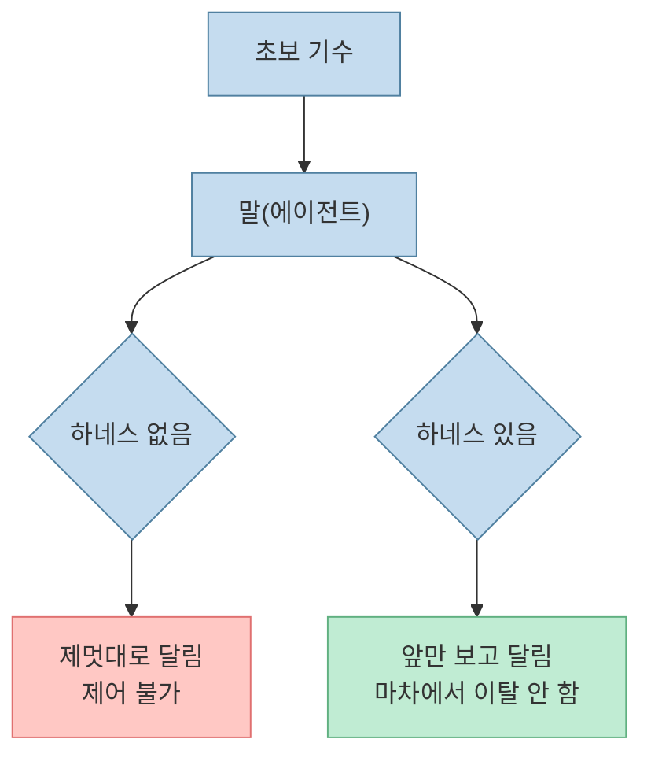
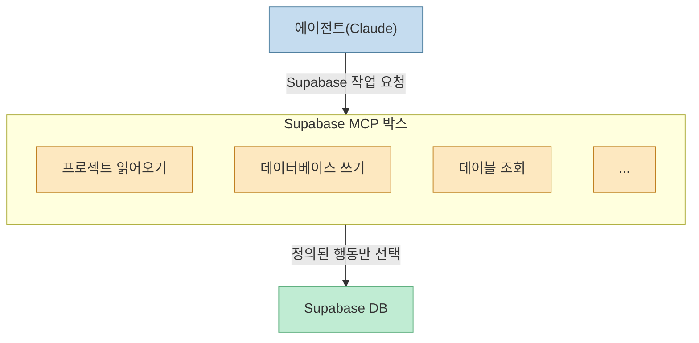
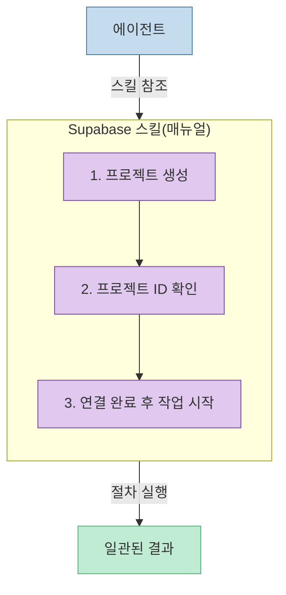
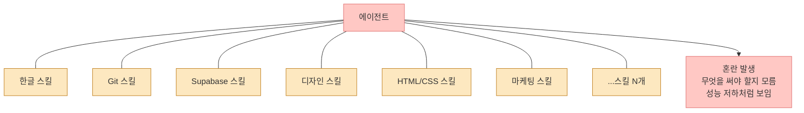
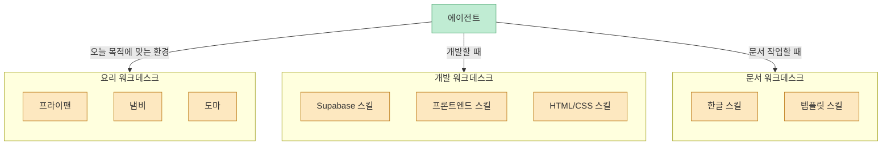
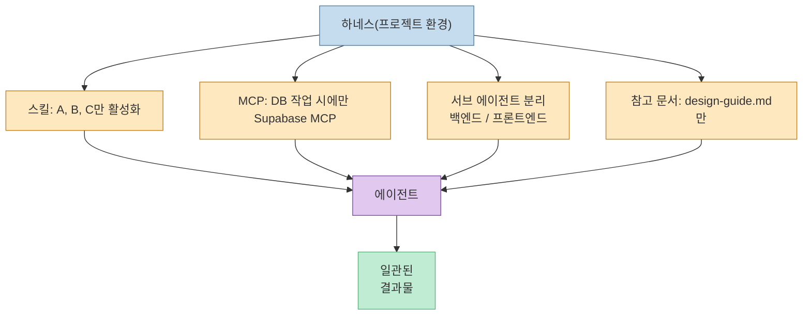
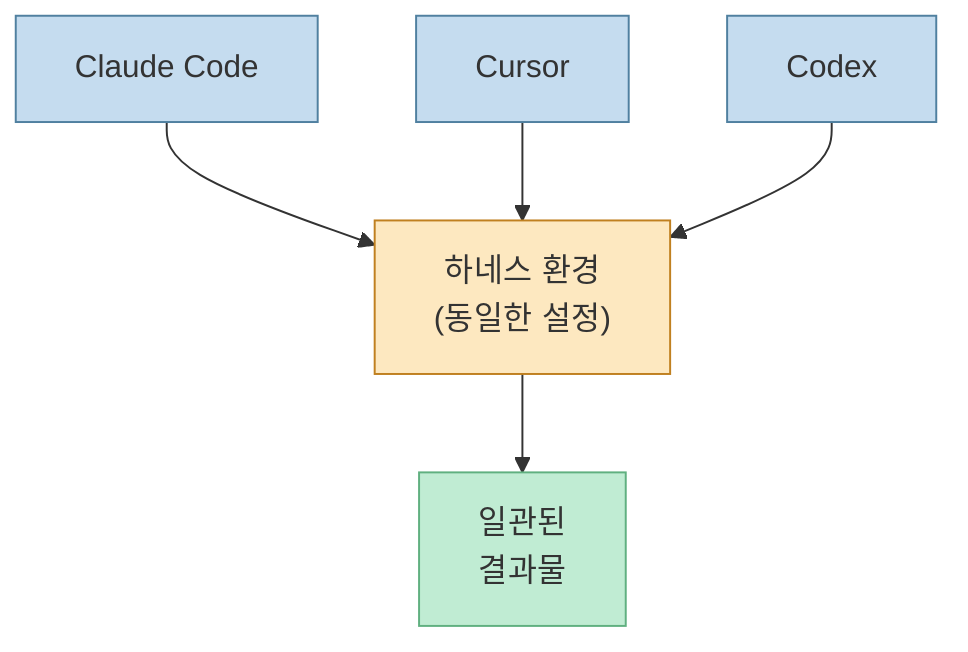
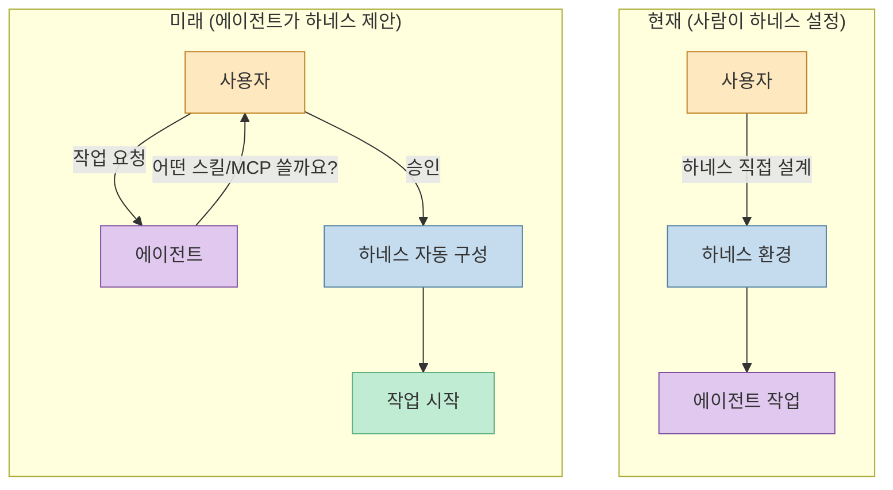

"하네스 엔지니어링"이라는 말이 에이전트 커뮤니티에서 자주 들린다. 어렵게 들리지만, 본질은 단순하다. **에이전트가 제멋대로 달리지 않도록 환경을 설계하는 것**이다. 편집자P 채널의 영상을 바탕으로, 이 개념이 왜 생겼고 어떻게 쓰이는지 초보자 눈높이에서 풀어본다.

<!--more-->

## Sources

- https://youtube.com/watch?v=2n8eg8eLWhQ&si=h-ZphVVuFLEF1XFD

---

## 하네스(Harness)란 무엇인가?

하네스(Harness)는 말에게 채우는 끈과 구속 장치를 말한다. 왜 달까?

말을 처음 타는 초보자라면, 말이 고개를 갑자기 옆으로 젖히거나 마차에서 멀어지려 할 때 속수무책이다. 하지만 하네스가 있으면 끈 끝만 잡아도 말이 앞을 보고 달린다. 마차에서 멀어지지 않도록 거리도 제어된다. 즉, **말과 교감하는 고수가 없어도 말을 일정하게 제어**할 수 있게 된다.

반대로 고수에게 하네스는 거추장스럽다. 타기 전에 일일이 채워야 하니 불편하다. 그래서 하네스는 **초보자 또는 일반화된 환경을 위한 장치**라는 게 핵심이다. 말이 바뀌어도, 타는 사람이 바뀌어도, 하네스 형태만 맞으면 말이 어느 정도 잘 달리도록 만들어준다.

> 에이전트 맥락에서 "하네스"는 Claude, Cursor, Codex 등 어떤 AI 에이전트가 오더라도 일관되게 잘 동작하게 해주는 환경 구성이다.

[출처: https://youtu.be/2n8eg8eLWhQ?t=30]

---

## 에이전트 제어의 진화: 컨텍스트 엔지니어링 → MCP → 스킬 → 하네스

하네스 엔지니어링이 갑자기 나온 개념이 아니다. 에이전트를 제어하려는 시도들이 단계적으로 진화해왔다.

### 1단계: 컨텍스트 엔지니어링 시대

초기 Claude(클로드)를 잘 쓰는 사람들은 컨텍스트를 정교하게 구성해서 넣었다. 예를 들어 웹사이트를 만들 때:

- 원하는 디자인 이미지를 먼저 넣는다
- 에이전트가 디자인을 파악하게 한다
- 관련 기술 리서치 결과를 추가로 넣는다
- 그 다음에 작업을 시킨다

이렇게 **컨텍스트를 사람이 직접 잘 구성해서 넣어야** 에이전트가 잘 동작했다. 이걸 "컨텍스트 엔지니어링"이라고 불렀다.

문제는? 일반 사용자는 이걸 몰랐다. 전문가들이 "컨텍스트를 잘 넣어야지"라고 말해도, 입문자들에게는 그게 어떻게 잘 넣는 건지 알 방법이 없었다. [출처: https://youtu.be/2n8eg8eLWhQ?t=205]

### 2단계: MCP의 등장

"컨텍스트를 사람이 다 알아서 넣으라"가 어렵다는 걸 인정하면서, 다음 해법이 나왔다. **MCP(Model Context Protocol)** 다.

MCP의 핵심 아이디어: 애플리케이션을 조작할 때 필요한 행동(action)들을 **미리 정의**해두고, 에이전트가 그 안에서 골라 쓰게 한다.

예를 들어 Supabase MCP 박스 안에는 이런 항목들이 정의되어 있다:
- 프로젝트 읽어오기
- 데이터베이스 쓰기
- ...

에이전트는 Supabase를 다룰 때 이 MCP를 보고 "여기에 있는 기능만 골라서 사용"한다. 즉, **행동의 범위를 제약**해주는 효과다. [출처: https://youtu.be/2n8eg8eLWhQ?t=280]

### 3단계: 스킬의 등장

스킬(Skill)은 MCP와 목적은 다르지만 근본은 비슷하다. **에이전트가 특정 작업을 처리하는 방법을 기술한 매뉴얼**이다.

예를 들어 "Supabase 다루기 스킬" 안에는 이런 내용이 들어있다:
- Supabase 다룰 때는 먼저 프로젝트를 만든다
- 프로젝트 ID를 받아온다
- 연결이 완료되면 작업을 시작한다

에이전트는 이 매뉴얼을 읽고 "아, Supabase는 이렇게 하면 되는구나"를 파악한다. 컨텍스트를 사람이 매번 넣어주지 않아도, 스킬이 그 역할을 대신한다. [출처: https://youtu.be/2n8eg8eLWhQ?t=410]

---

## 스킬 과부하 문제

스킬이 많아지면서 새로운 문제가 생겼다. 스킬이 처음 몇 개일 때는 괜찮았다. 하지만 주변에 수백 개의 스킬이 쌓이기 시작했다:

- 한글 문서 작성 스킬
- Git 스킬
- Supabase 스킬
- 프론트엔드 디자인 가이드 스킬
- HTML/CSS/JS 스킬
- ...

에이전트는 이 모든 스킬을 동시에 보게 된다. **지금 개발 작업을 하는데 한글 문서 스킬, 마케팅 스킬이 섞여있으면** 에이전트는 혼란스러워진다. 어떤 걸 써야 할지 모르는 것이다.

마치 달리는 말에게 날개도 달고, 가면도 씌우고, 박차도 달고, 온갖 장치를 한꺼번에 붙여놓은 것과 같다. 말이 무거워져 느려지고 이상하게 움직인다. 성능이 떨어지는 것처럼 보이지만, 사실은 **환경 설정이 잘못된 것**이다. [출처: https://youtu.be/2n8eg8eLWhQ?t=460]

---

## 하네스 엔지니어링이란?

사실 많은 사람들이 이미 자연스럽게 하고 있었다:

> "오늘은 문서 작업만 할 거니까 스킬 딱 두 개만 놓고 해야지." 
> "내일은 개발할 거니까 Supabase 스킬, 프론트엔드 디자인 가이드 스킬만 장착해야지."

이렇게 **목적에 맞게 필요한 스킬/MCP/설정만 골라 에이전트가 그 안에서만 작업하게 해주는 것**이 바로 하네스 엔지니어링이다. [출처: https://youtu.be/2n8eg8eLWhQ?t=540]

### 워크데스크(작업 책상) 비유

가장 직관적인 설명이다. 요리를 할 때를 생각해보자:

- 오늘 요리할 거라면 → 프라이팬, 냄비, 도마만 올려놓는다
- 글쓰기를 할 거라면 → 노트, 펜, 참고 자료만 올려놓는다
- 코딩을 할 거라면 → IDE, 문서, 관련 레퍼런스만 올려놓는다

이렇게 책상을 꾸미면, 에이전트가 와서 "아, 요리하면 되는구나. 프라이팬이랑 냄비가 있네. 여기서 요리해야지"라고 바로 파악한다. [출처: https://youtu.be/2n8eg8eLWhQ?t=540]

### 구체적인 하네스 엔지니어링 예시

한 프로젝트를 예로 들면:

- **스킬**: 이번 프로젝트에서는 스킬 A, B, C만 사용
- **MCP**: Supabase MCP는 데이터베이스 작업할 때만 사용
- **서브 에이전트**: 백엔드 작업은 백엔드 서브 에이전트만 담당, 2분 내 처리
- **프론트엔드**: 프론트 서브 에이전트가 전담
- **디자인**: `design-guide.md` 문서만 참고하고, 다른 소스는 절대 참고 금지

이렇게 **범위를 명확히 정의한 환경**이 하네스다. [출처: https://youtu.be/2n8eg8eLWhQ?t=660]

---

## 에이전트 독립성: 하네스의 핵심 가치

하네스의 강력한 점은 **어떤 에이전트를 데려와도 비슷하게 동작한다**는 것이다.

같은 하네스 환경에서:
- Claude Code를 쓰면 → 그 환경에서 요리한다
- Cursor를 쓰면 → 같은 환경에서 요리한다
- Codex를 쓰면 → 역시 같은 환경에서 요리한다

에이전트마다 개성이 달라도, 하네스가 범위를 잡아주기 때문에 **일관된 품질**의 결과가 나온다. 이 덕분에 앞으로는 잘 만든 하네스 환경을 공유하거나 판매하는 생태계도 생길 수 있다. [출처: https://youtu.be/2n8eg8eLWhQ?t=700]

---

## 왜 지금 하네스 엔지니어링이 중요한가

에이전트의 능력이 좋아진다는 건 두 가지를 동시에 의미한다:

1. **할 줄 아는 것이 많아진다** — 더 다양한 작업 수행 가능
2. **알고 있는 정보가 너무 많아진다** — 무엇을 해야 할지 알려주는 과정이 더 중요해진다

비유하면: 인간도 능력이 많아질수록 환경 구성이 중요해진다. 막 입사한 신입사원이라면 "이것저것 해봐"로도 됐겠지만, 경험 많은 전문가에게는 "어떤 프로젝트에서 어떤 역할을 맡아야 하는지"가 훨씬 중요한 것처럼. [출처: https://youtu.be/2n8eg8eLWhQ?t=770]

현재 에이전트의 상태:
> "나 빨리 달릴 수는 있는데 잘 몰라요. 설정해 주세요. 설정 안 해주면 저 그냥 막 달립니다."

그래서 지금은 사람이 하네스를 설정해줘야 한다. 하지만 이건 과도기다.

---

## 하네스 엔지니어링의 미래

편집자P는 에이전트가 앞으로 스스로 하네스를 구성하는 방향으로 발전할 것이라고 예상한다. [출처: https://youtu.be/2n8eg8eLWhQ?t=840]

미래의 시나리오:
1. 사용자가 "웹사이트 만들어줘"라고 요청
2. 에이전트가 먼저 묻는다: "어떤 스킬 쓸까요? AGENTS.md는 이렇게 작성할까요? 이 스킬들이 좋아 보이는데 어떤 거 쓸까요?"
3. 사용자 승인 후 작업 시작

즉, **에이전트 스스로 자신의 하네스를 설계하고 확인받는** 흐름이다.

---

## 핵심 요약

| 단계 | 개념 | 핵심 아이디어 | 한계 |
|------|------|--------------|------|
| 1단계 | 컨텍스트 엔지니어링 | 사람이 직접 컨텍스트 잘 구성 | 일반 사용자는 방법을 모름 |
| 2단계 | MCP | 앱 행동을 미리 정의, 에이전트가 선택 | 스킬 수 증가 시 혼란 |
| 3단계 | 스킬 | 작업별 매뉴얼 제공 | 너무 많아지면 성능 저하 |
| 4단계 | **하네스 엔지니어링** | 목적별 환경 선택 구성 | 현재는 사람이 직접 설계 |

하네스 엔지니어링의 3가지 핵심:

1. **선택**: 지금 작업에 필요한 스킬/MCP만 골라낸다
2. **제한**: 에이전트가 그 범위 안에서만 동작하게 한다
3. **일관성**: 어떤 에이전트를 써도 비슷한 결과가 나온다

---

## 결론

하네스 엔지니어링은 거창한 개념이 아니다. **에이전트에게 오늘 할 일에 맞는 작업 책상을 차려주는 것**이다. 요리할 때는 요리 도구만, 코딩할 때는 개발 도구만. 이미 많은 사람들이 직관적으로 해오던 일에 이름이 붙은 것이다.

에이전트가 빠르고 똑똑해질수록, 방향을 잡아주는 환경 설계가 더 중요해진다. 지금 스킬을 모으고 AGENTS.md를 어떻게 쓸지 고민하는 분들이라면, 이미 하네스 엔지니어링의 시작점에 서 있는 것이다.
