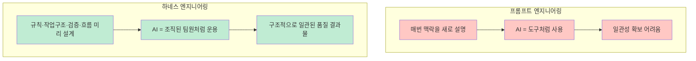
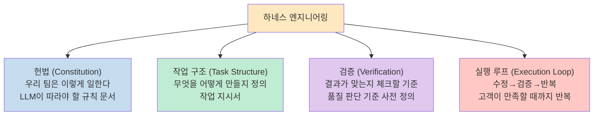
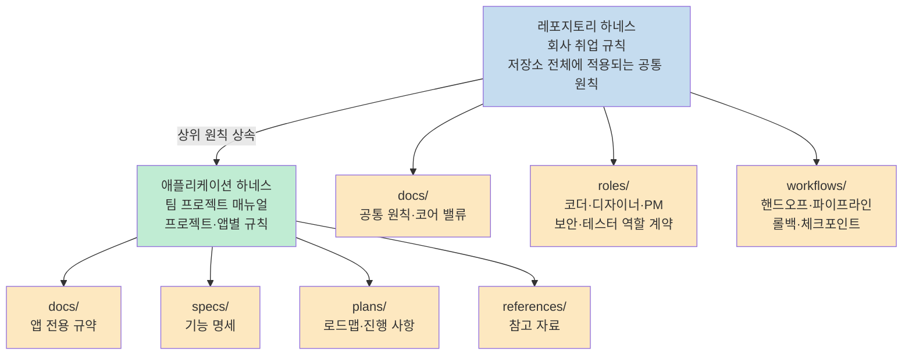
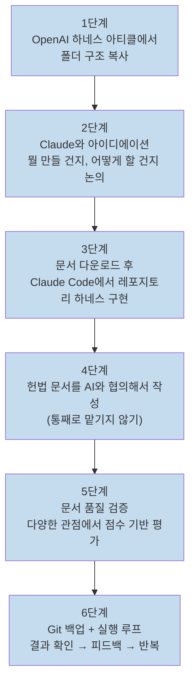
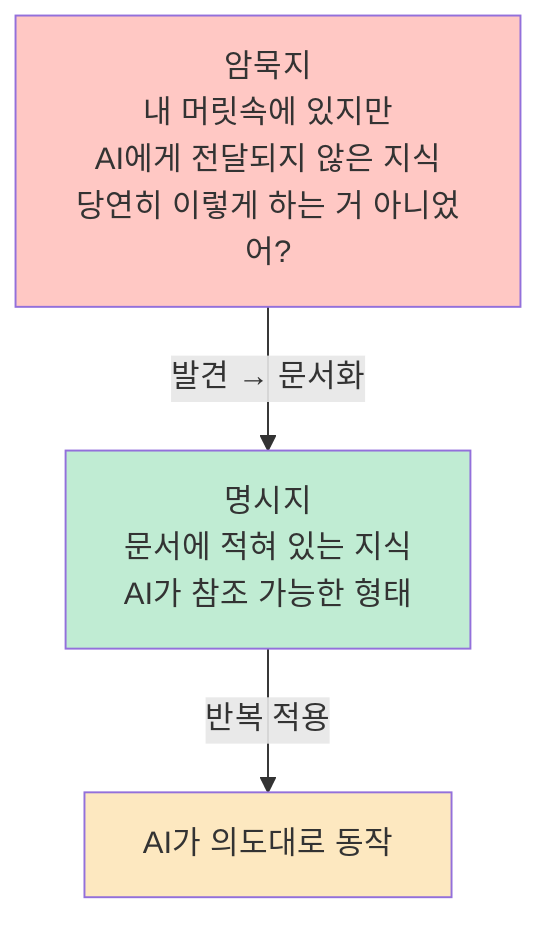
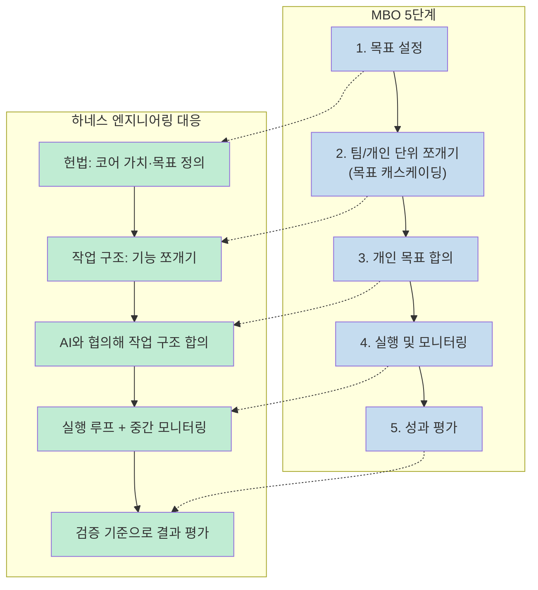
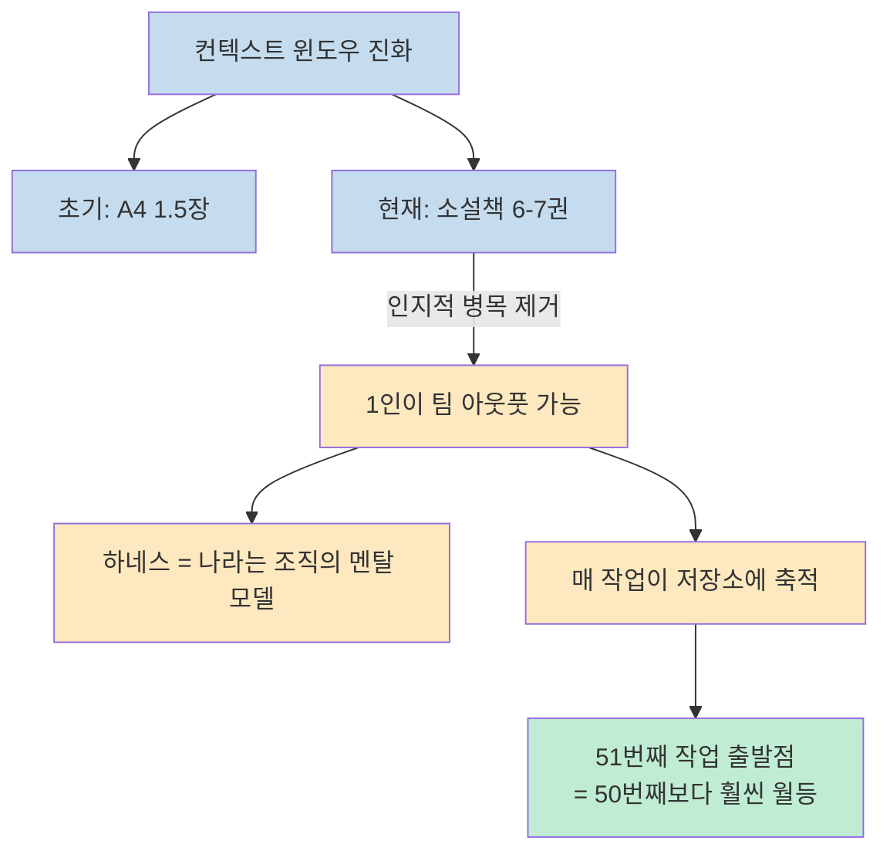
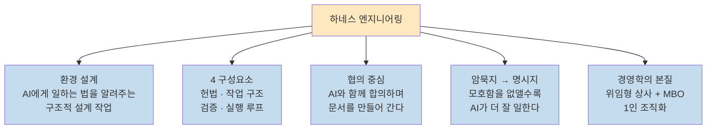

"AI가 유능하니까 일 잘하겠지"라고 믿고 그냥 던지면 결과물이 제멋대로 튄다. 하네스 엔지니어링은 그 반대 방향이다. AI에게 어떻게 일해야 하는지 **환경 자체를 설계**해 구조적으로 일관된 품질의 결과물을 뽑아내는 방식이다. Ask Dori 채널의 Dori 님이 사주팔자 분석 앱 실전 예제와 함께 이 개념을 경영학까지 연결해 풀어낸 영상을 정리한다.

<!--more-->

## Sources

- https://youtu.be/kSlYNeEkdAM?si=W-kus47sz95ij57J

## 프롬프트 엔지니어링 vs 하네스 엔지니어링

두 접근법의 차이를 이렇게 요약할 수 있다.



비유로 생각해 보면 이렇다. 나는 몹시 바쁜 팀장이고 AI에게 일을 위임하고 싶다. 매번 "이번엔 이렇게 해줘, 저번엔 저렇게 해줘"라고 설명하는 대신 "우리 팀은 이렇게 일해, 이런 결과물을 내기 위한 Do & Don't는 이것이야"를 한 번 정의해 두는 것이다. 그러면 AI는 지시가 없어도 팀의 맥락 안에서 일관되게 움직인다. [(참고: 0:00~2:00)](https://youtu.be/kSlYNeEkdAM?t=0)

하네스 엔지니어링의 공식 정의:

> **LLM에게 업무를 위임하기 위하여 규칙과 작업 구조, 검증 방법, 실행 흐름까지 미리 묶어서 제어하는 것**

## 4가지 구성 요소

하네스는 네 개의 축으로 구성된다. [(참고: 약 3:00)](https://youtu.be/kSlYNeEkdAM?t=180)



### 헌법 (Constitution)

"우리 회사는 이렇게 일한다"는 규칙을 담은 문서다. LLM이 따라야 할 Do & Don't, 우선순위, 코딩 스타일, 보안 원칙 등이 들어간다. **헌법이 흔들리면 모든 문서가 흔들린다.** 그래서 AI에게 통째로 맡기지 말고 반드시 나와 AI가 함께 협의해서 작성해야 한다.

### 작업 구조 (Task Structure)

무엇을 어떻게 만들지 정의하는 작업 지시서다. 기능 명세, 설계 문서, 실행 플랜 등이 여기에 속한다. 새 팀원에게 첫날 주는 온보딩 문서와 같다.

### 검증 (Verification)

결과물이 괜찮은지 판단할 기준을 미리 정해 두는 것이다. "뭘 보고 판단할 건데?"를 사전에 합의해야 AI가 스스로 자가 검증을 할 수 있다. 점수 기반 평가, 시니어 개발자 관점 리뷰, 보안 담당자 관점 리뷰 등을 문서화한다.

### 실행 루프 (Execution Loop)

수정하고 검증하고 반복하는 워크플로우다. **내가 만족할 수 있는 결과물이 나올 때까지**, 정해 놓은 품질 기준을 통과할 때까지 반복한다. 이 루프가 없으면 한 번 생성으로 끝나는 일회성 작업이 된다.

## 레포지토리 하네스 vs 애플리케이션 하네스

하나의 저장소 안에 두 층위의 하네스가 공존한다. [(참고: 약 8:00)](https://youtu.be/kSlYNeEkdAM?t=480)



**레포지토리 하네스**는 저장소 전체에 공통으로 적용되는 환경이다. 어떤 앱을 만들든 지켜야 할 팀 규칙, 문서 구조, 코드 린터 기준 등이 여기에 들어간다.

**애플리케이션 하네스**는 특정 프로젝트에만 적용되는 규칙이다. "이 앱은 어떤 기능을 줘야 하고, AI가 이 앱을 위해 어떻게 판단을 해야 하는지"가 정의된다.

초보자라면 레포지토리/애플리케이션을 구분하기보다 **만들고 싶은 앱을 먼저 상상하고 앱 단계부터 시작**하는 것이 더 자연스럽다.

실제로 OpenAI 팀은 빈 레포지토리에서 시작해 세 명의 엔지니어가 5개월 동안 100만 줄의 코드를 만들었는데, **사람이 직접 쓴 코드는 단 한 줄도 없었다.** [(참고: 약 7:00)](https://youtu.be/kSlYNeEkdAM?t=420)

## 실전 따라하기: 사주팔자 분석 앱 만들기

영상에서 직접 시연한 6단계 워크플로우다. [(참고: 약 12:00~30:00)](https://youtu.be/kSlYNeEkdAM?t=720)



### 1단계: 구조 복사

Google에서 OpenAI Harness Engineering 아티클을 검색해 폴더 구조 코드 블록을 복사한다. 이 구조가 대화의 출발점이 된다.

### 2단계: Claude와 아이디에이션

복사한 구조를 Claude에 붙여넣고 이렇게 시작한다:

```
안녕, Claude야. 나는 [사주 분석 앱]을 만들고 싶어.
직접 만드는 게 아니라 하네스 엔지니어링을 통해 만들고 싶어.
이 구조를 기반으로 어떤 내용을 넣어가면 좋을지 같이 의논해 볼까?
```

Claude가 선택지를 제공하며 방향을 잡아준다. "웹으로 할 건지, 모바일로 할 건지", "어떤 입력을 받을 건지" 등을 하나씩 합의해 나간다. **아이디에이션 단계는 Claude가 특히 편하다.** 선택지를 제공하고 구조가 잡혀 있어 헤매도 다음 단계로 이어갈 수 있기 때문이다.

### 3단계: 문서 다운로드 및 레포지토리 하네스 구현

Claude와 대화해서 만든 마크다운 문서들을 아티팩트로 한 번에 다운로드한다. 특정 폴더에 넣고 Claude Code를 열어 이렇게 요청한다:

```
안녕. 나는 이 폴더에서 레포지토리 레벨 하네스 엔지니어링을 구현하고 싶어.
이 폴더 안에 있는 파일들은 내가 애플리케이션을 생각하면서 만든 작업물이야.
이 작업물을 모두 읽은 후 레포지토리 하네스 엔지니어링을 같이 해봤으면 해.
```

영상에서는 Codex를 병행해 코드 중심 작업에 활용했다. "아이디에이션·문서 협의 → Claude Code, 코드 구현 → Codex" 조합이 편리했다고 한다.

### 4단계: 헌법 문서 협의 작성

헌법은 AI에게 통째로 맡기면 안 된다. 헌법이 흔들리면 그 위에 쌓인 모든 문서가 흔들린다. 예:

```
나는 유튜브 교육용으로 앱을 만들려고 해.
간결하고 쉬워야 되고 안전해야 돼.
이 원칙을 바탕으로 헌법을 같이 만들어 보자.
```

### 5단계: 문서 품질 검증

문서를 다 만든 뒤 AI에게 평가를 맡긴다. [(참고: 약 26:00)](https://youtu.be/kSlYNeEkdAM?t=1560)

```
네가 시니어 개발자라면 이 문서를 어떻게 평가할 것 같아?
500줄 이하의 한 문서에서 용어 일관성을 점검해줘.
```

여러 관점에서 반복 검증한다:
- 소프트웨어 엔지니어 관점
- 보안 담당자 관점
- 초보 개발자 관점

**점수 기반 평가**도 효과적이다. "이 문서에 100점 만점으로 점수를 매겨봐"라고 하면 일반 리뷰보다 훨씬 정교하게 평가한다. 또한 모호한 표현을 명확한 기준으로 바꿔야 한다. 예: "한두 번 수정 후에도"라는 표현 → "다섯 번까지 시도하고 같은 문제가 남으면 기록해라"처럼.

### 6단계: Git 백업 + 실행 루프

Git으로 파일을 백업한다. 여러 번의 작업을 한 번에 복구할 수 있고, AI가 자율적으로 일할수록 버전 관리가 더 필요해진다.

실행 루프는 Gradio(Python 기반 웹 UI 라이브러리)로 결과를 웹에서 확인하며 돌린다. 사주 앱의 경우 생년월일시를 입력하면 연주·월주·일주와 목의 기운·화 기운 해석이 출력됐다. LLM API 없이 규칙 기반으로도 기초적인 수준은 구현 가능하고, LLM API를 연결하면 자연어 해석까지 확장된다. [(참고: 약 30:00)](https://youtu.be/kSlYNeEkdAM?t=1800)

## 폴더 구조 예시 (GitHub 공개 예제)

영상에서 GitHub에 공개한 `saju-harness-practice` 폴더 구조다. [(참고: 약 20:00)](https://youtu.be/kSlYNeEkdAM?t=1200)

```
(root)/
├── AGENTS.md              ← 읽기 순서: harness-core → workflow → 앱 트래커
├── CLAUDE.md
├── README.md
├── harness/               ← 레포지토리 공통 하네스
│   ├── docs/
│   │   ├── index.md
│   │   ├── core-values.md
│   │   └── governance.md  ← 모든 앱 공통 적용 규칙
│   ├── roles/
│   │   ├── coder.md
│   │   ├── designer.md
│   │   ├── pm.md
│   │   ├── security-reviewer.md
│   │   └── tester.md
│   ├── workflows/
│   │   ├── handoff.md
│   │   ├── pipeline.md
│   │   ├── rollback.md
│   │   └── checkpoint.md
│   ├── templates/
│   │   ├── task-brief.md
│   │   └── ongoing.md
│   └── schemas/
│       └── manifest.md
└── apps/
    └── saju/              ← 애플리케이션 하네스
        ├── harness/
        │   ├── docs/      ← 사주 앱 전용 규약
        │   ├── specs/     ← 기능 명세
        │   ├── references/
        │   └── plans/     ← 로드맵·진행 사항
        ├── src/           ← 실제 코드
        │   ├── app.py
        │   ├── constants.py
        │   └── saju.py
        └── tests/
```

`AGENTS.md`에는 읽기 순서가 명시되어 있다: harness-core 먼저 읽기 → workflow 읽기 → 현재 작업 앱 트래커 읽기. AI는 이 순서대로 맥락을 쌓고 작업에 들어간다.

## 암묵지를 명시지로: 모호함 제거의 기술

하네스 엔지니어링의 핵심 과제 중 하나는 **암묵지(tacit knowledge)를 명시지(explicit knowledge)로 바꾸는 것**이다. [(참고: 약 28:00)](https://youtu.be/kSlYNeEkdAM?t=1680)



예를 들어 "교육용이니까 코드가 짧고 읽기 쉬워야지"라고 생각했는데 AI에게 말하지 않으면 AI는 그냥 잘 돌아가는 코드를 쓴다. 10줄로 끝낼 수 있는 걸 300줄로 만들 수도 있다. 말하지 않았기 때문이다.

명확한 기준으로 바꾸면 이렇게 된다: **"500줄 이하로 짜라. 교육용이므로 변수명은 한국어 주석을 붙이고 들여쓰기는 4칸으로 한다."**

AI와 계속 일하면서 이런 암묵지를 발견하고, 문서화하고, 반복 적용하는 과정이 **하네스 고도화**다.

## 경영학으로서의 하네스 엔지니어링

영상의 마지막 파트는 하네스 엔지니어링의 본질이 경영학에 있다고 주장한다. [(참고: 약 33:00)](https://youtu.be/kSlYNeEkdAM?t=1980)

### 상사의 세 가지 유형

```mermaid
flowchart TD
    subgraph BM["방임형 상사"]
        B1["AI는 유능하니까 믿어"]
        B2["맥락 없이 던짐"]
        B3["결과물이 제멋대로"]
        B1 --> B2 --> B3
    end

    subgraph DM["지시형 상사"]
        D1["처음부터 모든 걸 설명"]
        D2["AI가 더 나은 방법 찾을 공간 없음"]
        D3["상사 경험의 한계 = 팀 결과의 한계"]
        D1 --> D2 --> D3
    end

    subgraph EM["위임형 상사 (목표)"]
        E1["결과물에 대한 명확한 상(像) 보유"]
        E2["큰 목표를 정한 후 자율성·방법론 보장"]
        E3["중간중간 모니터링 + 평가 반복"]
        E1 --> E2 --> E3
    end

    classDef badNode fill:#ffc8c4,color:#333
    classDef midNode fill:#fde8c0,color:#333
    classDef goodNode fill:#c0ecd3,color:#333

    class B1,B2,B3 badNode
    class D1,D2,D3 midNode
    class E1,E2,E3 goodNode
```



### 피터 드러커의 MBO와의 유사성

피터 드러커의 **MBO(Management by Objectives)** 는 목표를 일방적으로 내려보내는 게 아니라 상사와 부하직원이 함께 목표를 설정하고 그 달성 여부로 성과를 평가하는 방식이다. 5단계 프로세스가 하네스 엔지니어링과 거의 일치한다.



> "하네스 엔지니어링은 분명 테크지만 본질은 경영학이다."

## AI가 만드는 1인 조직

컨텍스트 윈도우는 AI 등장 초기 A4 용지 1.5장에서 현재 소설책 6-7권 분량으로 커졌다. 이 변화가 2-3년 만에 이루어졌다. [(참고: 약 36:00)](https://youtu.be/kSlYNeEkdAM?t=2160)



잭 샤피로(Jack Shapiro)의 "10x Lawyer" 개념을 인용하며 이렇게 말한다:

기존 조직에서는 암묵지가 사람 머릿속에 분산되어 있어 사람이 나가면 지식이 사라졌다. 반면 하네스를 가진 나의 경우엔:

- 매 작업이 저장소에 축적된다
- 헌법과 작업 구조가 지속적으로 진화한다
- 검증 기준이 더 정교해진다
- 실행 루프가 더 빠르게 돌아간다

그래서 **51번째 작업의 출발점은 50번째보다 훨씬 월등하다.** 이것이 하네스의 복리 효과다. [(참고: 약 37:00)](https://youtu.be/kSlYNeEkdAM?t=2220)

영상에서 사주 앱에 부여한 역할들 — PM, 코더, 디자이너, 보안 리뷰어, 테스터 — 은 각각의 역할을 AI에게 부여해서 **하나의 조직을 구성한 것**이다. 하네스는 그 조직의 멘탈 모델이다.

> **코어 가치 → 합의 → 위임 → 축적**의 순환을 통해 저장소는 점점 나의 경험이 구조화된 형태로 보존되는 공간이 되고, 나의 판단력이 곧 해자(moat)가 된다.

## 핵심 요약



- **하네스 엔지니어링** = AI가 잘 일할 수 있도록 환경을 설계하는 것. 헌법·작업 구조·검증·실행 루프 4가지 구성 요소.
- **레포지토리 하네스**(회사 취업 규칙)와 **애플리케이션 하네스**(팀 프로젝트 매뉴얼)로 2층 구성. 초보자는 앱 단계부터 시작해도 된다.
- **실전 6단계**: 구조 복사 → Claude 아이디에이션 → 레포지토리 하네스 구현 → 헌법 협의 작성 → 문서 검증 → Git 백업 + 실행 루프.
- **암묵지를 명시지로**: AI와 일하면서 발견한 가정들을 문서화하는 과정이 하네스 고도화다.
- **경영학 본질**: 피터 드러커 MBO와 구조가 동일. 방임형도 지시형도 아닌 위임형 상사가 되는 것.
- **축적의 복리**: 51번째 작업 출발점은 50번째보다 훨씬 월등. 저장소가 내 판단력의 해자가 된다.

## 결론

하네스 엔지니어링은 "AI를 잘 쓰는 기술"이기 이전에 "AI에게 잘 위임하는 기술"이다. 문서 하나 제대로 쓰는 것에서 시작하고, AI와 협의하면서 모호함을 줄여나가면 된다. 전부 혼자 끙끙 짤 필요도 없다. AI와 같이 만드는 편이 더 정교하고 구체적이다. 사주팔자 앱처럼 가벼운 프로젝트 하나를 골라 6단계를 한 번 끝까지 돌려보면, 하네스가 어떤 방식으로 작동하는지 몸으로 익힐 수 있다.
