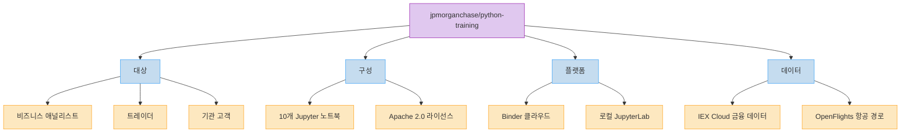
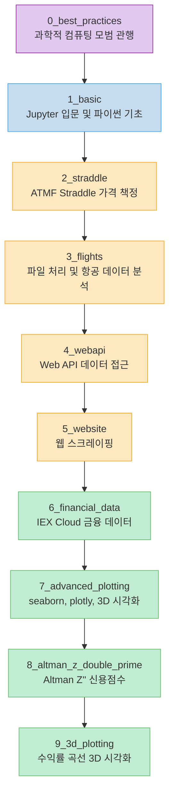
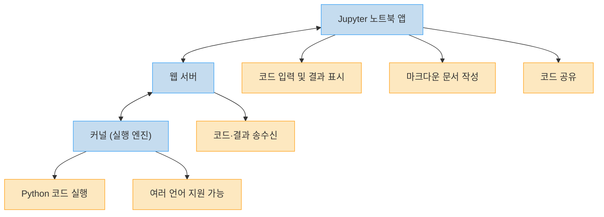
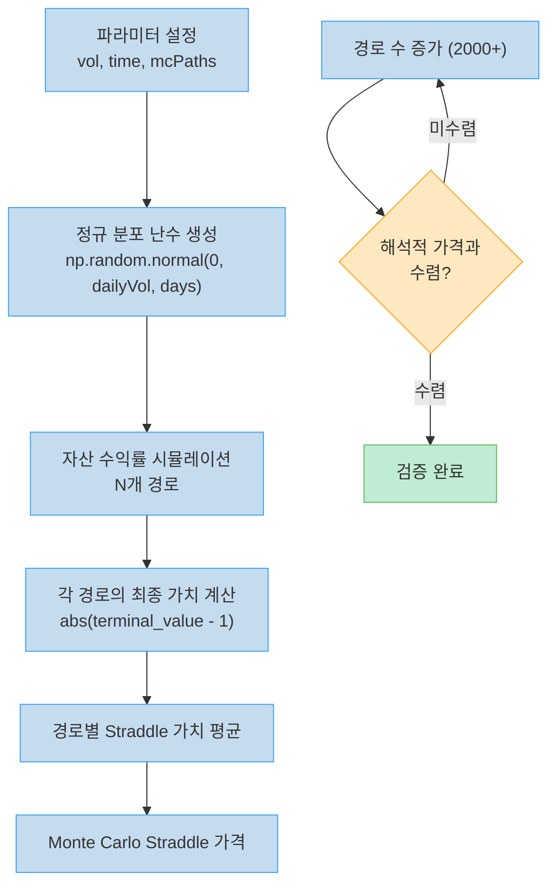
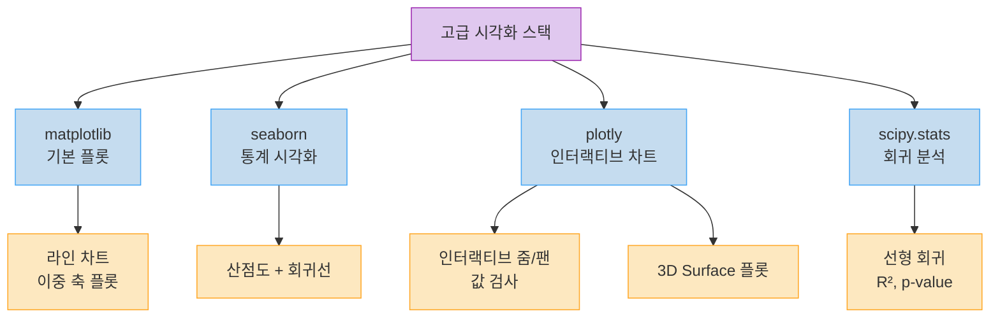
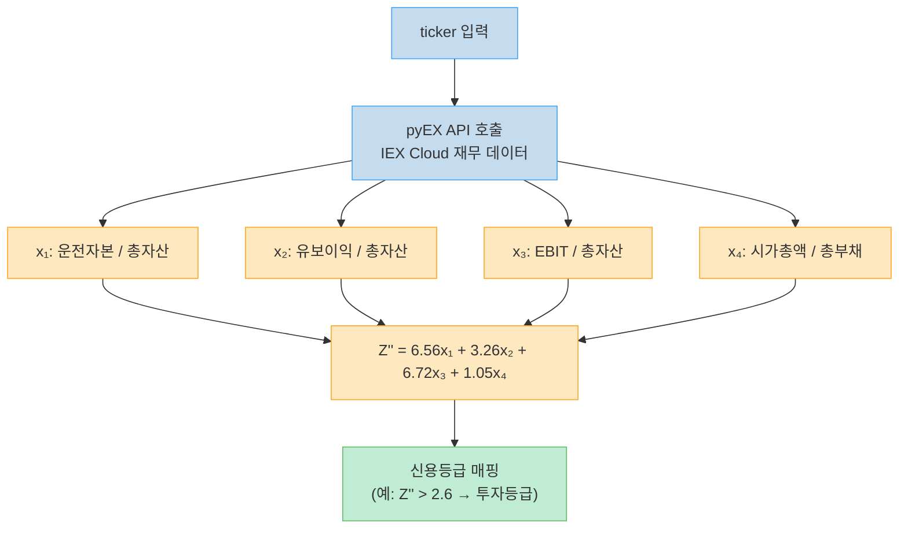
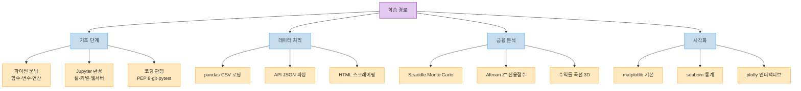

JPMorgan Chase가 12,900개 이상의 스타를 받은 오픈소스 파이썬 트레이닝 저장소를 공개해 두었다. 원래 사내 비즈니스 애널리스트와 트레이더를 대상으로 한 교육 자료였지만, Apache 2.0 라이선스로 전면 공개되어 있다.

단순한 파이썬 입문이 아니다. Jupyter 기초부터 시작해서 옵션 가격 책정의 Monte Carlo 시뮬레이션, 항공 경로 데이터 분석, 금융 API 연동, Altman Z'' 신용점수 계산, 수익률 곡선 3D 시각화까지 10개 노트북이 금융 실무 문제를 직접 다룬다. Binder를 통해 설치 없이 브라우저에서 바로 실행할 수도 있다.

<!--more-->

## Sources

- [jpmorganchase/python-training (GitHub)](https://github.com/jpmorganchase/python-training)

---

## 저장소 개요: JPMorgan이 공개한 파이썬 트레이닝

| 항목 | 내용 |
|-----|------|
| **대상** | 비즈니스 애널리스트, 트레이더, 관심 있는 기관 고객 |
| **목적** | 수치 컴퓨팅과 데이터 시각화 입문 |
| **구성** | 10개 Jupyter 노트북 |
| **라이선스** | Apache 2.0 |
| **Stars** | 12,900+ |
| **Forks** | 2,100+ |
| **플랫폼** | Binder (Google Cloud, OVH, GESIS, Turing Institute 지원) |
| **데이터** | IEX Cloud (금융), OpenFlights.org (항공 경로) |

README에는 다음과 같이 명시되어 있다:

> "This course is designed to be an introduction to numerical computing and data visualization in Python. It is not designed to be a complete course in Computer Science or programming, but rather a motivational demonstration of how relatively complex topics can be accessible even to those without formal programming backgrounds."

즉, CS 전공자를 위한 교육이 아니다. 프로그래밍 배경이 없는 사람도 복잡한 금융 분석을 파이썬으로 접근할 수 있음을 보여주는 것이 목표다.



### 노트북 전체 구성

10개 노트북이 다음 순서로 학습 난이도를 높여간다:



---

## Notebook 0: Best Practices for Scientific Computing

이 노트북은 코드를 작성하기 전에 알아야 할 관행을 먼저 다룬다. 단순한 스타일 가이드가 아니라, 오류를 줄이고 재현 가능한 분석을 만들기 위한 구조적 접근법이다.

### 1. 코드 가독성과 Zen of Python

[PEP 20](https://www.python.org/dev/peps/pep-0020/)에서 정의한 파이썬 철학을 소개한다. 핵심은 "Readability counts"다.

변수 명명의 나쁜 예와 좋은 예를 금융 공식으로 보여준다:

```python
# 나쁜 예: 의미를 알 수 없는 짧은 변수명
p0 = 3.5
p = p0 * np.cos(0.4 * x - 13.2 * t)

# 좋은 예: 물리적 의미가 명확한 변수명
base_pressure = 3.5          # Pa
wave_length = 15.7           # m
wave_number = 2 * np.pi / wave_length  # m-1
angular_frequency = 13.2     # Hz
pressure = base_pressure * np.cos(wave_number * x - angular_frequency * t)
```

PEP 8 스타일 가이드도 언급하며, 대부분의 에디터가 PEP 8 힌트를 제공한다고 설명한다.

### 2. 버전 관리 (Git)

버전 관리 없이 파일을 관리할 때의 혼란을 보여준다:

```
mycode.py
mycode_v2.py
mycode_v2_conference.py
mycode_v3_BROKEN.py
mycode_v3_FIXED.py
mycode_v2+v3.py
```

대신 git을 사용하면 커밋 흐름과 브랜치 흐름으로 이력을 체계적으로 관리할 수 있다. 비개발자를 위해 GitHub Desktop (Windows/Mac)과 SmartGit, Git-cola (Linux) 같은 GUI 도구도 소개한다.


### 3. 단위 테스트와 자동화

pytest를 이용한 단위 테스트 작성법을 설명한다. `test_*.py` 파일에 `test_*()` 함수를 만들고 `pytest` 명령어를 실행하면 된다. Numpy 테스트 유틸리티(`np.testing.assert_array_equal` 등)도 소개한다. 버전 관리와 테스트를 결합하면 CI(지속적 통합)를 구현할 수 있다고 안내한다.

### 4. Python 모듈과 패키지

로컬 모듈 작성 방법, PyPI를 통한 패키지 설치(`pip install PACKAGENAME`), `sys`, `os` 같은 내장 패키지 활용법을 다룬다.

---

## Notebook 1: Getting Started with Jupyter

Jupyter의 세 가지 구성 요소를 먼저 설명한다:



셀(Cell)의 개념, `Ctrl + Enter`로 코드 실행하는 방법, 기본 산술 연산부터 시작한다. Jupyter는 Python만 실행하는 것이 아니라 여러 언어를 지원한다는 점도 명시한다.

---

## Notebook 2: ATMF Straddle 가격 책정

이 노트북이 이 커리큘럼의 핵심이다. 단순한 파이썬 문법을 넘어, **옵션 파생상품 가격을 직접 구현**하면서 함수, NumPy, Monte Carlo를 모두 배운다.

### ATMF Straddle 가격 공식

$$STRADDLE_{ATMF} \approx \frac{2}{\sqrt{2\pi}} \times F \times \sigma \sqrt{T}$$

- σ: 내재 변동성 (implied volatility)
- T: 만기까지 시간 (time-to-maturity)
- F: 기초자산의 선도가 (forward)

### 함수 정의와 기본 구현

처음에는 하드코딩으로 계산하다가, 반복 사용을 위해 함수로 리팩토링하는 과정을 보여준다. 기본 인자와 선택적 인자(default arguments)를 단계적으로 추가한다.

```python
# 초기: 하드코딩
vol = 0.2
time = 1.0
import math
straddlePrice = (2 / math.sqrt(2 * 3.14)) * vol * math.sqrt(time)

# 개선: numpy 활용
import numpy as np
straddlePrice = (2 / np.sqrt(2 * np.pi)) * vol * np.sqrt(time)

# 최종: 재사용 가능한 함수
def straddlePricer(vol=0.2, time=1.0):
    return (2 / np.sqrt(2 * np.pi)) * vol * np.sqrt(time)
```

### Monte Carlo 시뮬레이션

해석적 공식 이외에, Monte Carlo 방법으로 Straddle 가격을 구하는 방식도 구현한다. `np.random.normal`로 일별 수익률 시계열을 생성하고, 경로별 자산 최종 가치의 평균을 취한다.



`pandas`와 `perspective` 라이브러리로 시뮬레이션 경로를 인터랙티브 테이블로 시각화하고, `matplotlib`의 `fivethirtyeight` 스타일로 차트를 그린다. `%timeit` 매직 커맨드로 함수 실행 시간을 측정하는 방법도 소개한다.

---

## Notebook 3~5: 데이터 로딩, API, 웹 스크레이핑

### Notebook 3: 파일 처리와 항공 데이터 분석

`os` 라이브러리로 파일 시스템을 탐색하고, `pandas.read_csv`로 CSV 파일을 로드하는 방법을 배운다. OpenFlights.org 데이터를 사용한다:

- 항공 경로: **68,000개**
- 전 세계 공항: **7,000개**

`missingno` 라이브러리로 결측치 현황을 시각화한다. 이 라이브러리는 데이터 완성도를 스파크라인 형태로 빠르게 보여준다.

```python
import missingno as msno
msno.matrix(airports_df)  # 결측치 시각화 행렬
```

실습 예제로 LaGuardia 공항(LGA) 찾기, 가장 높은 고도의 공항 찾기, 세계 10대 최다 운항 경로 분석 등을 수행한다. `pandas` `merge`를 이용해 경로 데이터와 공항 이름을 조인하는 방법도 다룬다.

### Notebook 4: Web API 데이터 접근

HTTP 요청으로 JSON 응답을 받아 `pandas` DataFrame으로 변환하는 흐름을 보여준다. Bitcoin Price Index (BPI) API를 예제로 사용한다.


`pandas.read_json`보다 수동 파싱이 더 유연한 경우가 있다는 것도 설명한다.

### Notebook 5: 웹 스크레이핑

`pandas.read_html`로 HTML 테이블을 한 줄로 DataFrame으로 변환하는 방법을 먼저 보여준다. 더 복잡한 파싱이 필요할 때는 `BeautifulSoup` 라이브러리를 사용한다.

실무에서 자주 접하는 지저분한 데이터(div 태그, 면책 조항 등)를 `dropna()`로 정리하는 방법, 재사용 가능한 함수로 래핑하는 방법을 다룬다. API보다 HTML 파싱이 불완전한 경우가 많다는 점도 명시한다.

---

## Notebook 7: 고급 시각화 — seaborn, plotly, 3D

이 노트북은 matplotlib 기초를 넘어 실무에서 쓰이는 시각화 스택 전체를 다룬다.

### 사용 라이브러리



### 실습 데이터와 시각화 사례

Russell 2000 내재 변동성과 HYG(하이일드 채권 ETF) 가격 시계열을 합성 데이터로 생성한다. 두 시계열의 규모가 다르기 때문에 이중 축(dual-axis) 플롯을 사용하는 이유와 방법을 설명한다.

RTY 내재 변동성을 반전시키면 HYG와의 역(inverse) 상관관계가 시각적으로 드러난다. `scipy.stats.linregress`로 수치 회귀 분석을 수행하고 R² 값을 확인한다.

```python
from scipy import stats
slope, intercept, rvalue, pvalue, stderr = stats.linregress(
    diff["HYG.spot"], diff["RTY.3m.Proxy.Implied.Vol"]
)
print("R^2 = {r:.3f}".format(r=rvalue**2))
```

### 3D 볼 Surface 플롯

`plotly.graph_objs.Surface`를 이용해 변동성 곡면(vol surface)을 3D로 그린다. 만기(maturity)와 행사 가격(strike)을 축으로 하는 3D 인터랙티브 차트를 생성한다.

```python
import plotly.graph_objs as go

fig = go.Figure(data=[
    go.Surface(
        z=df2.values.tolist(),
        y=df2.columns.values,
        x=df2.index.astype(str).values.tolist()
    )
])
```

---

## Notebook 8: Altman Z'' 신용점수 계산

이 노트북은 금융 분석의 실전 활용 예제다. Altman Z'' 스코어를 pyEX (IEX Cloud API 래퍼)로 가져온 재무 데이터로 직접 계산한다.

### Altman Z'' 공식

$$Z'' = 6.56x_1 + 3.26x_2 + 6.72x_3 + 1.05x_4$$

| 변수 | 정의 |
|-----|------|
| x₁ | 운전 자본 / 총 자산 (Working Capital / Total Assets) |
| x₂ | 유보이익 / 총 자산 (Retained Earnings / Total Assets) |
| x₃ | EBIT / 총 자산 (Earnings Before Interest & Tax / Total Assets) |
| x₄ | 시가총액 / 총 부채 (Market Value of Equity / Total Liabilities) |



`altmanZDPImpliedRating(ticker)` 함수를 정의해 티커 심볼만 입력하면 즉시 내재 신용등급을 계산한다.

---

## Notebook 9: 수익률 곡선 3D 시각화

`yield_curve.csv` 데이터를 `plotly.graph_objs.Surface`로 시각화한다. x축은 만기(maturity), y축은 날짜, z축은 수익률(yield)이 된다. 수익률 곡선의 시간 변화를 3D 공간에서 직관적으로 파악할 수 있다.

```python
import plotly.graph_objs as go
import pandas as pd

df = pd.read_csv('../data/yield_curve.csv')
# x: 만기 구간 목록, y: 날짜 목록, z: 수익률 행렬
fig = go.Figure(data=[go.Surface(z=zlist, x=xlist, y=ylist)])
```

---

## Binder로 즉시 실행하기

설치 없이 브라우저에서 즉시 실행하는 방법이 제공된다. 저장소의 Binder 링크를 클릭하면 JupyterLab 환경이 클라우드에서 자동으로 세팅된다.


`binder/` 디렉토리에 `requirements.txt`가 있어 필요한 패키지가 자동으로 설치된다. 로컬 환경을 오염시키지 않고 누구나 동일한 환경에서 실습할 수 있다.

---

## 핵심 요약

| 노트북 | 핵심 내용 | 주요 라이브러리 |
|------|--------|------------|
| 0_best_practices | PEP 8/20, git, pytest, PyPI | pytest, numpy |
| 1_basic | Jupyter 구조, 기본 연산, 셀 실행 | — |
| 2_straddle | ATMF Straddle 공식, 함수, Monte Carlo | numpy, pandas, matplotlib |
| 3_flights | CSV 로딩, 결측치 시각화, 데이터 병합 | pandas, missingno |
| 4_webapi | HTTP JSON API 연동, DataFrame 변환 | requests, pandas |
| 5_website | HTML 테이블 파싱, BeautifulSoup | pandas, BeautifulSoup |
| 6_financial_data | IEX Cloud 금융 데이터 | pyEX |
| 7_advanced_plotting | 이중 축, 회귀, 인터랙티브, 3D | seaborn, scipy, plotly |
| 8_altman_z_double_prime | Altman Z'' 신용점수 계산 | pyEX, numpy |
| 9_3d_plotting | 수익률 곡선 3D 시각화 | plotly, pandas |



---

## 결론

JPMorgan의 이 저장소가 12,900개 스타를 받은 이유가 있다. 파이썬 입문 자료는 넘쳐나지만, 금융 실무에 바로 적용할 수 있는 예제로 구성된 교육 자료는 드물다.

Straddle 가격 책정에서 Monte Carlo를 쓰고, Altman Z'' 신용점수를 실제 API 데이터로 계산하고, 수익률 곡선을 3D로 그리는 과정이 모두 "프로그래밍 배경이 없어도 접근 가능한 방식"으로 설명된다. 금융권 비개발자, 혹은 파이썬을 금융 분야에 적용하려는 사람에게 출발점으로 강력히 추천할 수 있다.

Binder 링크로 브라우저에서 바로 실행할 수 있으니, 설치 없이 지금 당장 시작할 수 있다.
