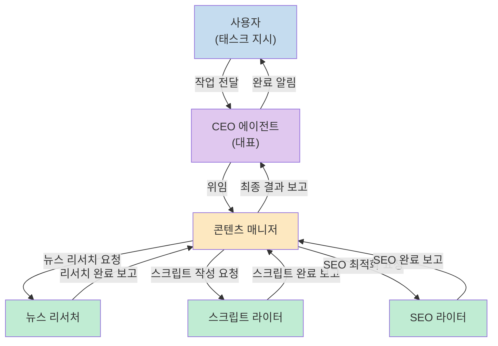
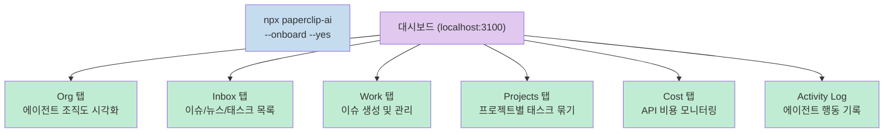
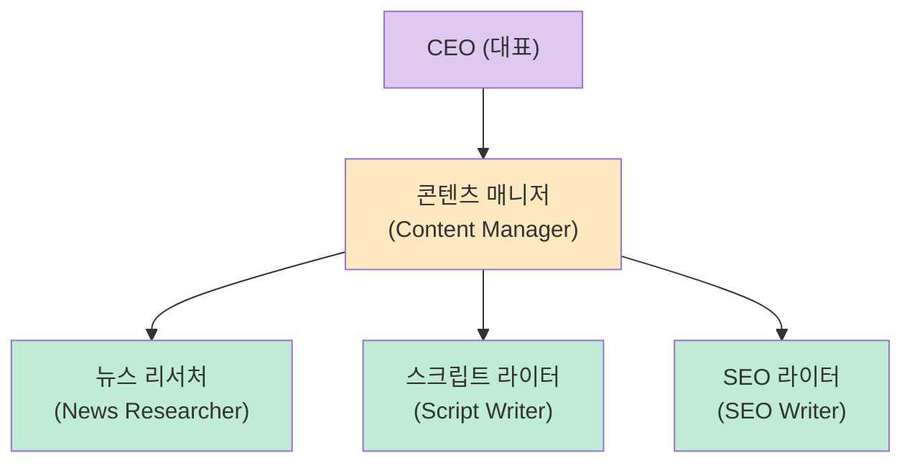
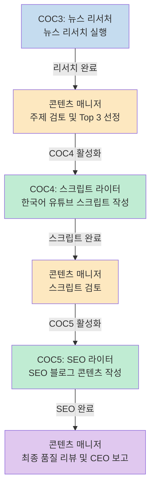
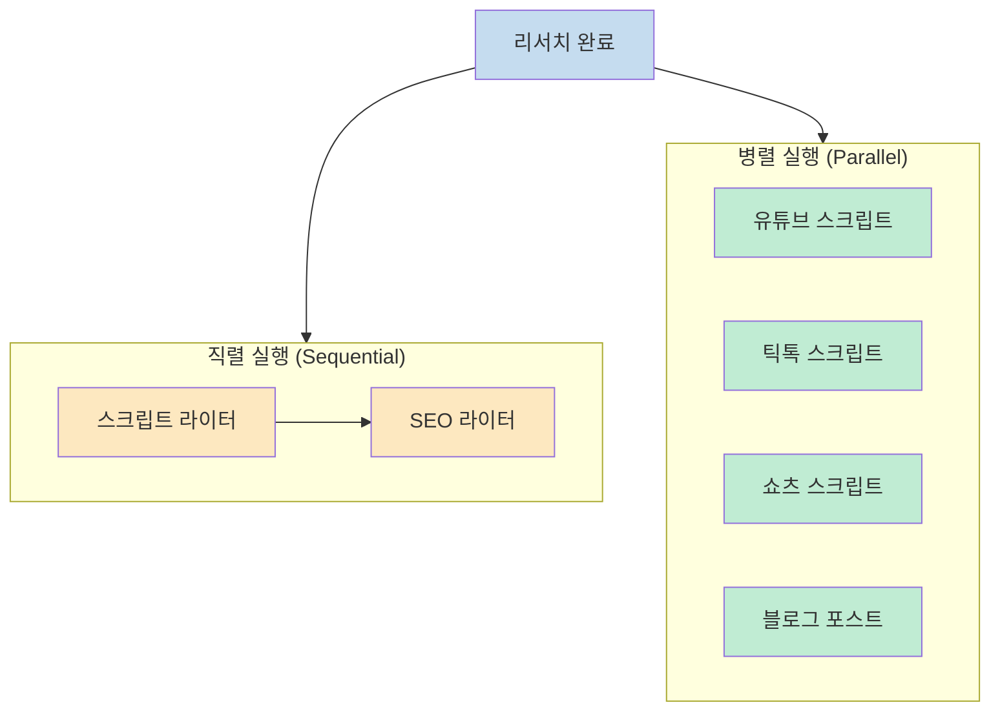
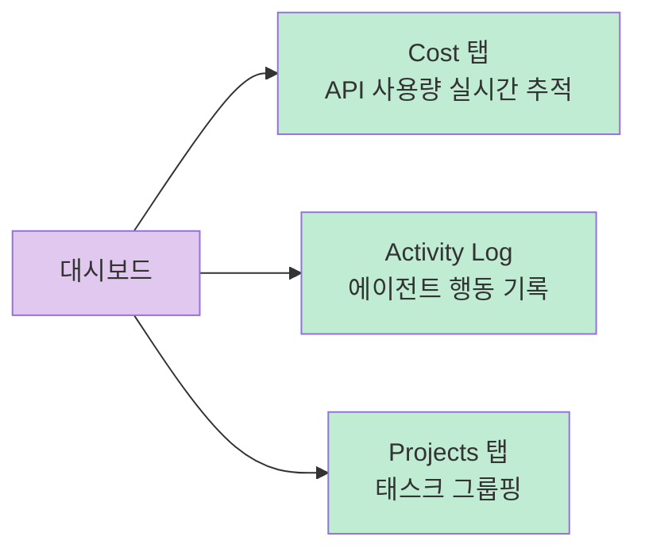
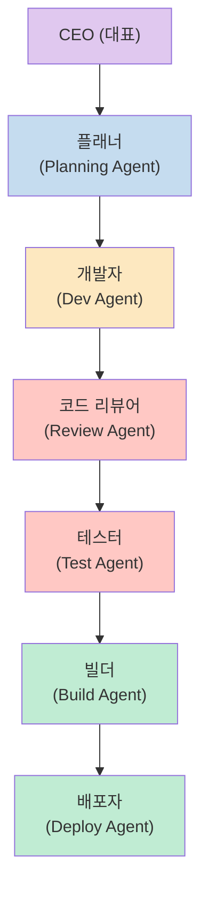
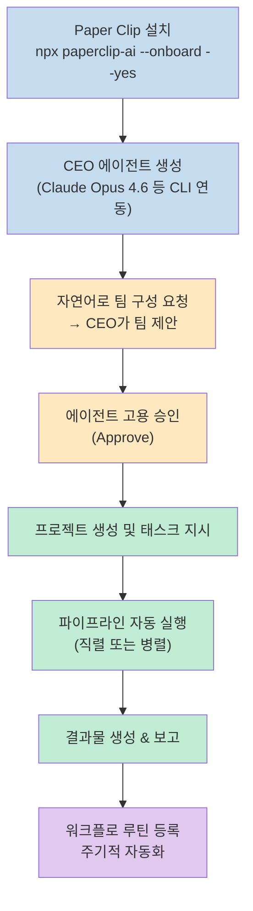

AI 에이전트 하나를 쓰는 것과, AI 에이전트들로 구성된 **회사 전체를 운영하는 것** 은 전혀 다른 이야기다. 코드팩토리 채널이 소개한 **Paper Clip** 은 후자를 가능하게 해주는 프레임워크다. CEO 에이전트가 작업을 받아 하위 팀원 에이전트에게 위임하고, 팀원들이 유기적으로 협력해 결과물을 만들어내는 구조다. 놀랍게도 완전 무료 오픈소스다.

해외에서 이미 핫하게 주목받고 있으며, 영상을 제작한 코드팩토리도 자체 프로젝트 매니지먼트 툴을 유료로 만들다가 Paper Clip에서 아이디어를 상당히 참고했을 만큼 완성도가 높다고 평가한다.

<!--more-->

## Sources

- [모르면 진짜 개손해... AI로 회사 운영 해주는 Paper Clip. 심지어 무료 오픈소스](https://www.youtube.com/watch?v=Am5y6x-erJs)

---

## 1. Paper Clip이란?

Paper Clip은 AI 에이전트들로 구성된 가상 조직을 만들고 운영할 수 있는 오픈소스 프레임워크다. 핵심 개념은 단순하다. ([youtu.be/Am5y6x-erJs?t=30](https://youtu.be/Am5y6x-erJs?t=30))

- **에이전트 = 직원**: CEO(대표), CMO, CTO, 콘텐츠 매니저, 개발자 등 역할별 에이전트를 자유롭게 정의한다.
- **태스크 = 업무 지시**: 대표 에이전트에게 작업을 던지면 알아서 적절한 하위 에이전트에게 분배한다.
- **자동화**: 에이전트 간 협업이 자동으로 파이프라인화된다.



모든 에이전트는 CLI 기반 AI 클라이언트와 연동된다. Claude Code, Codex 등 다양한 CLI 환경을 지원한다. ([youtu.be/Am5y6x-erJs?t=60](https://youtu.be/Am5y6x-erJs?t=60))

---

## 2. 설치 및 시작 방법

Paper Clip의 시작은 한 줄 명령어로 끝난다. ([youtu.be/Am5y6x-erJs?t=200](https://youtu.be/Am5y6x-erJs?t=200))

```bash
npx paperclip-ai --onboard --yes
```

실행하면 포트 **3100** 에 로컬 대시보드가 올라온다. 대시보드에서 할 수 있는 일은 다음과 같다.



첫 번째로 해야 할 일은 **CEO 에이전트** 를 만드는 것이다. 대시보드에서 에이전트를 추가하고 역할을 CEO로 설정한다. 모델은 Claude Opus 4.6을 사용할 수 있으며, CLI 연동 환경 테스트(`Test Connection`)를 통해 제대로 연결됐는지 확인한다. ([youtu.be/Am5y6x-erJs?t=240](https://youtu.be/Am5y6x-erJs?t=240))

---

## 3. 회사 구성: 에이전트 팀 만들기

CEO가 생성되면 첫 번째 태스크를 던질 수 있다. 팀 구성 자체도 자연어로 요청한다. ([youtu.be/Am5y6x-erJs?t=280](https://youtu.be/Am5y6x-erJs?t=280))

**예시 요청 (한국어 그대로 입력 가능):**
```
유튜브 콘텐츠를 만든 팀을 구성해 줄 건데
유튜브 콘텐츠를 만들 때 해야 하는 작업은:
- AI/AT 관련 뉴스를 리서치
- 리서치 내용 기반으로 중요도 선정
- 유튜브 콘텐츠 스크립트 생성
- 컨텐츠 스크립트 기반으로 SEO 전략과 블로그 글 생성

어떤 팀 멤버가 필요할지 구성해 줘
```

CEO는 이 요청을 분석한 뒤 필요한 에이전트 목록을 제안한다. 영상 실습에서는 다음 4명이 제안됐다. ([youtu.be/Am5y6x-erJs?t=310](https://youtu.be/Am5y6x-erJs?t=310))



제안을 수락하면("승인"이라고 입력) 에이전트 고용 요청이 생성된다. 이후 **Approve** 를 눌러 최종 승인하면 실제 회사처럼 고용 프로세스가 진행된다. ([youtu.be/Am5y6x-erJs?t=390](https://youtu.be/Am5y6x-erJs?t=390))

고용 전 에이전트는 "Pending Approval" 상태이며, 승인 후 "Idle" 상태로 전환된다. Org 탭에서 계층 구조가 노란색(활성)/회색(비활성)으로 시각화된다.

각 에이전트에는 역할에 맞는 **시스템 프롬프트가 자동 장착** 된다. 사용자가 직접 프롬프트를 짜지 않아도 된다.

---

## 4. 실습: 유튜브 콘텐츠 파이프라인 구동

팀이 구성되면 프로젝트를 만들고 실제 작업을 시작한다. ([youtu.be/Am5y6x-erJs?t=450](https://youtu.be/Am5y6x-erJs?t=450))

**프로젝트 생성 예시:**
```
유튜브 페이퍼클립 콘텐츠
다음 링크를 참고해서 페이퍼클립 AI에 대한 한국어 유튜브 콘텐츠를 제작한다
```

프로젝트를 생성하자마자 CEO가 자율적으로 콘텐츠 파이프라인 구조를 스스로 설정해버리는 장면이 인상적이다. 사용자가 별도로 설계하지 않아도 알아서 판단해 셋업한다.

### 파이프라인 실행 순서

Paper Clip이 자동으로 설정한 파이프라인은 다음과 같다. ([youtu.be/Am5y6x-erJs?t=490](https://youtu.be/Am5y6x-erJs?t=490))



실제로 뉴스 리서처가 작업을 완료하고 1위~10위 최신 뉴스 목록과 Top 3 추천을 반환하면, 콘텐츠 매니저가 검토 후 스크립트 라이터를 활성화(COC4 approve)한다. 이 승인도 에이전트 스스로 진행하며 사용자는 필요한 경우에만 개입한다.

---

## 5. 병렬 실행과 직렬 실행

이 실습에서는 스크립트 라이터가 완료된 후 SEO 라이터가 순서대로 실행되는 **직렬(serial) 구조** 로 동작했다. 하지만 Paper Clip은 **병렬(parallel) 실행** 도 지원한다. ([youtu.be/Am5y6x-erJs?t=620](https://youtu.be/Am5y6x-erJs?t=620))



유튜브 스크립트, 틱톡용, 쇼츠용, 블로그 포스트를 동시에 만들어 달라고 요청하면 에이전트들이 병렬로 작업한다. 이 확장성이 Paper Clip의 핵심 강점 중 하나다.

또한 운영 중 CEO가 스스로 "이런 팀원도 있으면 좋을 것 같다"고 추천할 때도 있다. 확인(컨펌)하면 새 에이전트가 고용되어 다음 사이클부터 바로 활용된다.

---

## 6. 비용 모니터링과 워크플로 자동화

### 비용 모니터링

API를 직접 사용하는 경우 Cost 탭에서 소비량을 실시간으로 추적할 수 있다. Activity Log에는 각 에이전트의 행동 기록이 시간순으로 남는다. ([youtu.be/Am5y6x-erJs?t=730](https://youtu.be/Am5y6x-erJs?t=730))



### 워크플로 루틴 자동화

Paper Clip의 또 다른 강력한 기능은 **워크플로(Workflow) 루틴 설정** 이다. ([youtu.be/Am5y6x-erJs?t=760](https://youtu.be/Am5y6x-erJs?t=760))

특정 파이프라인을 루틴으로 등록하면 주기적으로 자동 실행할 수 있다. 예를 들어 "매주 월요일 오전에 AI 관련 최신 뉴스를 리서치하고 콘텐츠 스크립트를 만들어라"와 같은 루틴이 가능하다. Claude Code를 비롯한 AI 코딩 도구처럼, 에이전트들이 유기적으로 동시에 움직여 결과물을 만들어내는 방식이다.

---

## 7. 개발팀에도 동일하게 적용 가능

영상은 콘텐츠 팀을 예시로 들었지만, 개발팀 구성에도 완전히 동일한 구조를 적용할 수 있다. ([youtu.be/Am5y6x-erJs?t=660](https://youtu.be/Am5y6x-erJs?t=660))



사용자는 최상위에서 "이런 기능을 만들어"라고만 하면, 플래너→개발자→리뷰어→테스터→빌더→배포자가 순서대로 또는 병렬로 작업을 완수하는 구조다.

---

## 핵심 요약



| 항목 | 내용 |
|------|------|
| 가격 | 완전 무료 오픈소스 |
| 시작 명령 | `npx paperclip-ai --onboard --yes` |
| 포트 | 3100 (로컬 대시보드) |
| 지원 CLI | Claude Code, Codex 등 |
| 에이전트 구조 | CEO → 매니저 → 전문 에이전트 계층 |
| 실행 방식 | 직렬/병렬 모두 지원 |
| 모니터링 | 코스트 추적 + 액티비티 로그 |
| 자동화 | 워크플로 루틴 주기 실행 |

- **에이전트 = 직원**: 자연어로 팀을 정의하면 CEO가 적합한 에이전트를 제안하고 스스로 고용한다.
- **파이프라인 자동 설계**: 프로젝트를 생성하면 CEO가 스스로 작업 순서와 파이프라인을 설정한다.
- **고용 승인 프로세스**: 실제 회사처럼 에이전트 고용에 승인 단계가 있어 제어권을 유지한다.
- **병렬 확장**: 유튜브·틱톡·쇼츠·블로그를 동시에 생산하는 병렬 파이프라인도 간단히 구성 가능하다.
- **개발팀에도 적용**: 플래너→개발→리뷰→테스트→배포 파이프라인도 동일한 방식으로 구성된다.

---

## 결론

Paper Clip은 "AI 에이전트 하나를 잘 쓰는 것"에서 한 단계 나아가, **AI 에이전트 팀 전체를 관리하는 것** 을 일반 사용자도 할 수 있게 해준다. 무료 오픈소스임에도 코스트 모니터링, 조직 시각화, 병렬 파이프라인, 워크플로 루틴까지 갖춰진 완성도는 상용 제품 수준이다.

콘텐츠 제작뿐 아니라 개발, 마케팅, 데이터 분석 등 반복적인 업무 파이프라인이 있는 모든 영역에 적용할 수 있다. AI 에이전트를 개별로 쓰던 방식에서, 조직 단위로 운영하는 방식으로 전환할 준비가 됐다면 Paper Clip이 가장 빠른 시작점이 될 것이다.
