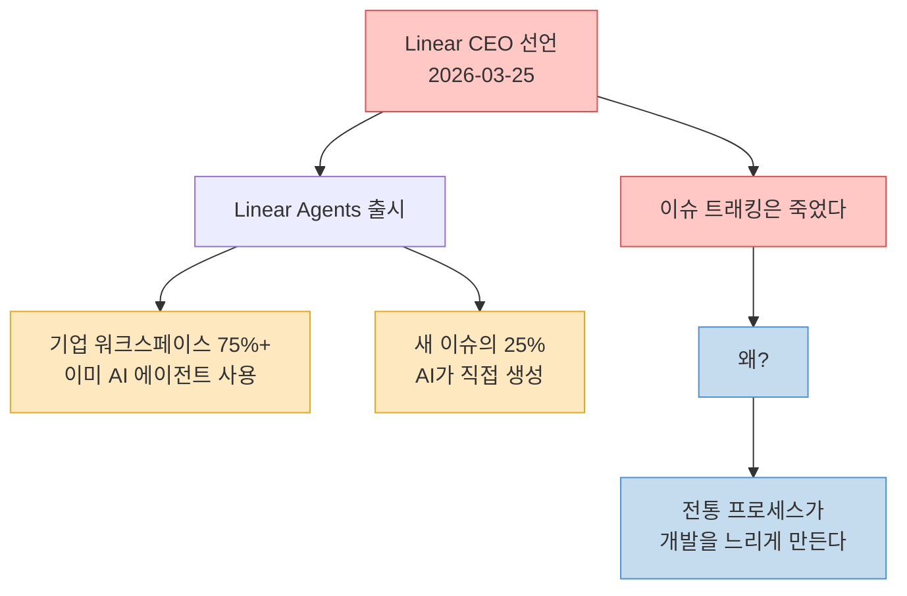
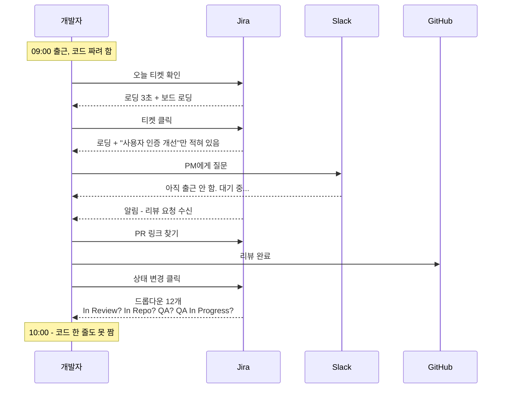
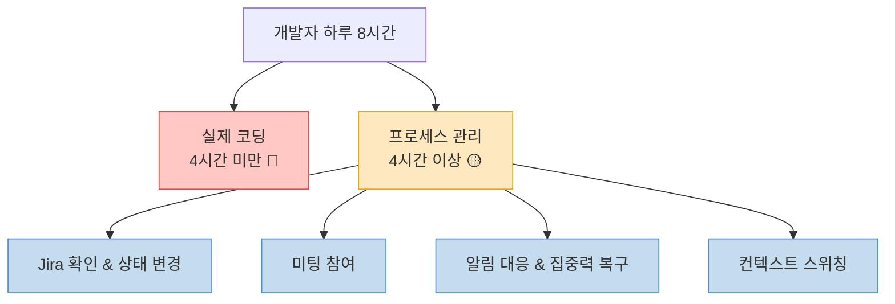
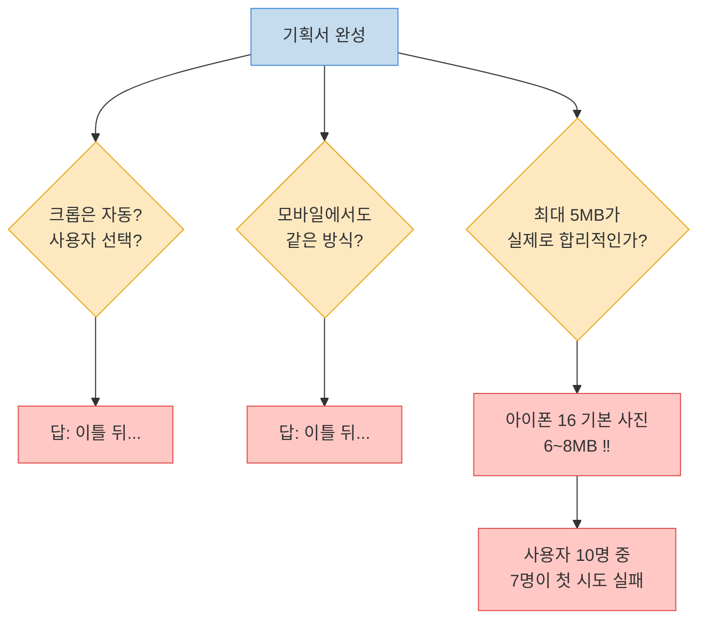
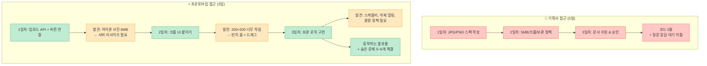
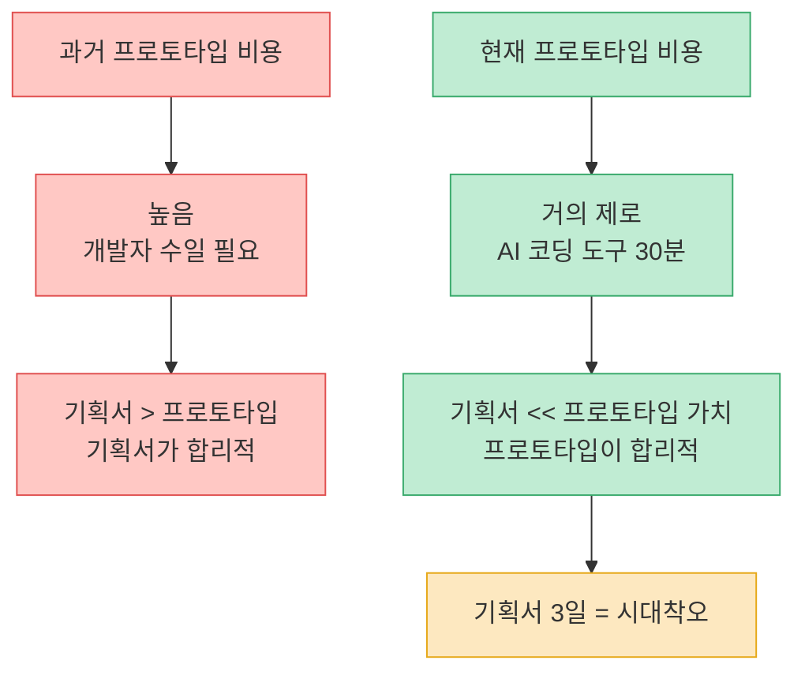
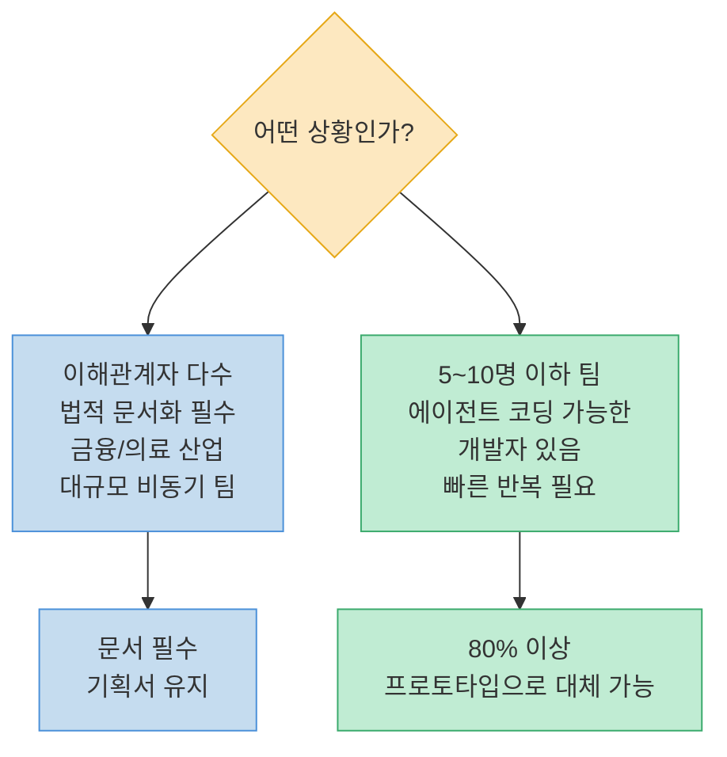
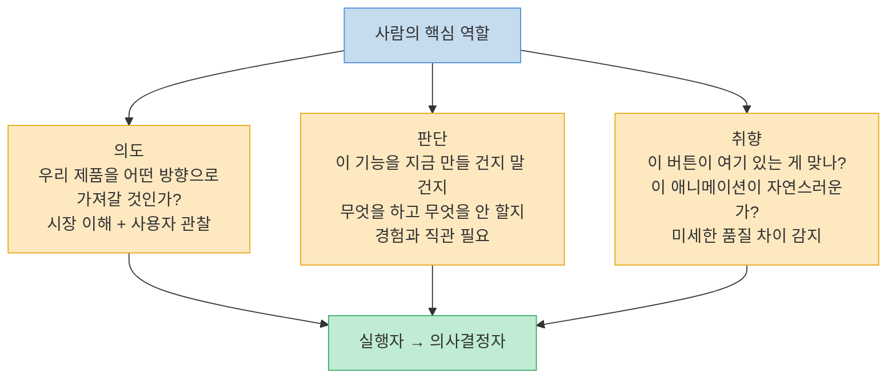
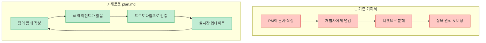
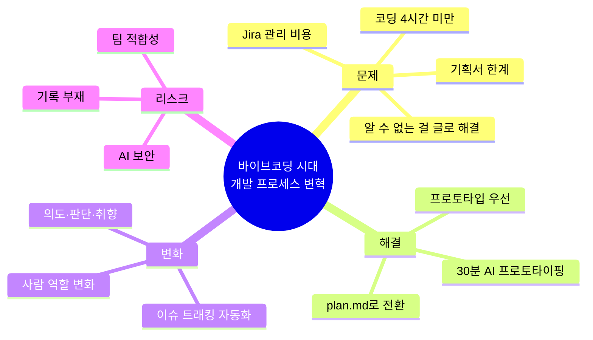

회사에서 앱 하나를 만든다고 할 때, 제일 먼저 뭘 하시나요? 기획서를 쓰시나요, 아니면 바로 코드를 짜시나요? 지금까지 정답은 당연히 기획서였습니다. 그런데 불과 며칠 전, 이 당연한 방식에 정면으로 도전하는 선언이 나왔습니다.

> [프로젝트 관리 도구 Linear의 CEO가 "이슈 트래킹은 죽었다"고 선언했습니다.](https://youtu.be/dZG3-9lKpIA?t=0)

기획서 쓰고 티켓 만들고 상태 관리하는 그 프로세스 자체가 개발을 느리게 만든다는 겁니다. 이 주장이 맞는지, 그렇다면 뭘로 바꿔야 하는지 분석합니다.

<!--more-->

## Sources

- https://youtu.be/dZG3-9lKpIA

---

## Linear의 선언: 이슈 트래킹은 죽었다

[2026년 3월 25일, Linear가 Linear Agents를 출시하며 충격적인 수치를 공개했습니다.](https://youtu.be/dZG3-9lKpIA?t=50)

- 기업 워크스페이스의 **75% 이상**이 이미 AI 에이전트를 사용 중
- 새로운 이슈의 **25%를 AI가 직접 생성**



발표 자체보다 더 중요한 것은 그 뒤에 깔린 본질적인 질문입니다. **왜 이런 변화가 필요한가?**

---

## 진짜 문제: 관리에 최적화된 도구

[전통적인 프로젝트 관리 도구들은 만드는 것이 아니라 관리에 최적화되어 있습니다.](https://youtu.be/dZG3-9lKpIA?t=80) Jira가 나쁜 도구라는 게 아닙니다. 20년 넘게 살아남은 이유가 있습니다. 하지만 핵심 문제가 있습니다.

### 개발자의 하루 재현

[5명짜리 백엔드 개발자 팀을 상상해 봅시다.](https://youtu.be/dZG3-9lKpIA?t=100)



이게 과장이 아닙니다. 실제로 많은 개발 팀에서 매일 벌어지는 일입니다.

### 관리 비용의 실제 수치

[숫자로 따져 보면 더 심각합니다.](https://youtu.be/dZG3-9lKpIA?t=170)

| 항목 | 낭비 시간 |
|---|---|
| PM 티켓 1개 작성 | 15~30분 |
| 스프린트 30개 티켓 | PM 하루 전체 |
| 알림 후 집중력 복구 | 평균 **23분** |
| 주당 스프린트/백로그/스탠드업 미팅 | **8시간** |
| 미팅 중 "이 티켓 무슨 뜻이야?" | 미팅 시간의 절반 |
| **실제 코딩 시간** | **하루 4시간 미만** |



Linear가 Jira보다 인기를 얻은 건 이 관리 비용을 극단적으로 줄였기 때문입니다. 하지만 Linear가 아무리 빠르더라도, 근본적인 문제는 해결하지 못합니다. **진짜 문제는 도구가 아니라 그 위에서 돌아가는 프로세스**에 있기 때문입니다.

---

## 기획서의 본질적 한계

[기획서는 왜 필요했을까요?](https://youtu.be/dZG3-9lKpIA?t=250) PM은 비즈니스 관점을, 디자이너는 사용자 경험을, 개발자는 기술적 가능성을 압니다. 이 세 사람의 머릿속을 맞추려면 공유 문서가 필요합니다. 여기까지는 맞습니다.

하지만 기획서에는 구조적 한계가 있습니다.

> **"기획서를 쓰는 사람은 실제로 만들어 본 적이 없으니까요. 기획서에는 아는 것만 적을 수 있어요. 모르는 것은 적을 수가 없습니다."**

### 프로필 사진 업로드 기능 예시

[간단해 보이는 기능 하나를 분석해 봅시다.](https://youtu.be/dZG3-9lKpIA?t=290)

**기획서에 적힌 것:**
```
JPG, PNG, 외부 파일 지원
최대 5MB
200×200 자동 크롭
사진 30일 보관 후 삭제
```

**기획서로 알 수 없는 것들:**



[아이폰 16의 기본 사진 용량은 6~8MB입니다.](https://youtu.be/dZG3-9lKpIA?t=290) 기획서에 5MB라고 적어도 현실에서 사용자 10명 중 7명이 첫 시도에서 실패합니다. **이걸 기획서 단계에서 알 수 있었을까요? 절대 불가능합니다. 만들어 봐야 아는 거예요.**

---

## 해결책: 기획서 3일 → 프로토타입 3일

[같은 기능을 프로토타입 접근으로 바꾸면 이렇게 됩니다.](https://youtu.be/dZG3-9lKpIA?t=330)



**비유:** 기획서로 제품 만드는 건 레시피만 읽고 요리를 평가하는 것과 같습니다. 짠지 싱거운지는 먹어봐야 알듯, 소프트웨어도 만들어봐야 압니다.

### 왜 지금 이게 가능한가?

[이 접근이 가능한 이유는 프로토타입 비용이 거의 제로에 수렴했기 때문입니다.](https://youtu.be/dZG3-9lKpIA?t=410)

> "AI 코딩 도구에게 이미지 업로드 프로토타입 만들어 달라고 프롬프팅하면 **30분 내에 동작하는 코드**가 나오는 시대입니다. 프로토타입 비용이 거의 제로인 시대에 기획서를 3일 쓰는 건 시대착오예요."



---

## 기획서가 여전히 필요한 경우

[프로토타입 우선 방식이 모든 상황의 답은 아닙니다.](https://youtu.be/dZG3-9lKpIA?t=460)



**조건:** 팀 내에 에이전트 코딩에 익숙한 개발자가 있을 때 가능합니다. 기획서를 아예 없애라는 뜻이 아닙니다.

---

## AI 시대 사람의 역할

[AI가 기획, 코딩, 테스트를 모두 한다면 사람은 뭘 하나?](https://youtu.be/dZG3-9lKpIA?t=490) PM·디자이너·프론트·백엔드·QA라는 직군 분류가 존재하는 이유는 **인간의 인지 한계** 때문에 분업한 것입니다. AI는 그 한계가 없습니다.

사람의 역할은 세 가지로 압축됩니다.



> "코드를 짜는 사람이 아니라, 어떤 코드를 짤 건지 방향을 잡는 사람."

---

## 리스크: 균형 있게 보기

[변화에는 리스크도 있습니다.](https://youtu.be/dZG3-9lKpIA?t=530) 세 가지를 짚어야 합니다.

```mermaid
flowchart TD
    Risks[리스크] --> R1[AI 에이전트 보안<br/>Linear Agents가 코드 읽고<br/>수정까지 하는데<br/>프롬프트 인젝션 취약점<br/>아직 불투명]
    Risks --> R2[기록의 부재<br/>프로토타입 중심으로 가면<br/>의사결정 히스토리 유실<br/>"왜 이렇게 만들었더라?"<br/>2개월 뒤 알 수 없음]
    Risks --> R3[팀 적합성 한계<br/>금융/의료 등 규제 산업<br/>문서화가 법적 의무<br/>프로토타입 우선 불가]

    R1 --> M1[업계 전체가<br/>풀어야 할 숙제]
    R2 --> M2[핵심 결정은<br/>어딘가 반드시 기록]
    R3 --> M3[산업별 판단 필요]

    classDef riskStyle fill:#ffc8c4,stroke:#e05050,color:#333
    classDef mitigateStyle fill:#fde8c0,stroke:#e6a817,color:#333
    class Risks,R1,R2,R3 riskStyle
    class M1,M2,M3 mitigateStyle
```

---

## 기획서의 새로운 형태: plan.md

[기획서가 완전히 사라지는 것이 아닙니다.](https://youtu.be/dZG3-9lKpIA?t=600) 형태가 바뀌는 것입니다.

> "기획이란 에이전트에게 알려줄 **plan.md 파일을 함께 만들어 나가는 것**이 기획서의 역할이 되게 될 겁니다."



이슈 트래킹이 완전히 사라지진 않겠지만, **사람이 일일이 티켓 만들고 상태 바꾸고 미팅하는 시대는 끝나가고 있습니다.**

---

## 핵심 요약



| 항목 | 기존 방식 | 새로운 방식 |
|---|---|---|
| 시작점 | 기획서(PRD) | 프로토타입 |
| 티켓 생성 | PM이 30분씩 | AI가 자동 생성 |
| 프로세스 도구 | Jira (관리 최적화) | 프로토타입 중심 |
| 기획서 형태 | 긴 문서 | plan.md (에이전트용) |
| 사람 역할 | 실행자 | 의사결정자 |
| 발견 시점 | 배포 후 | 1일차부터 |

---

## 결론

Linear CEO의 선언은 단순한 도구 교체 이야기가 아닙니다. 개발 프로세스의 근본적인 패러다임 전환입니다.

기존 프로젝트 관리 도구들은 만드는 것보다 관리하는 데 시간을 더 쓰게 만들었습니다. 기획서는 유용하지만 만들어봐야 발견할 수 있는 문제들을 미리 글로 해결하려 했습니다. 프로토타입 비용이 거의 제로에 수렴한 지금, 방식을 바꿔야 합니다.

기획서 10페이지 쓰는 대신 AI에게 30분 만에 프로토타입을 뽑아보고 그걸 보면서 판단하는 시대가 왔습니다. 우리는 대비해야 합니다.
