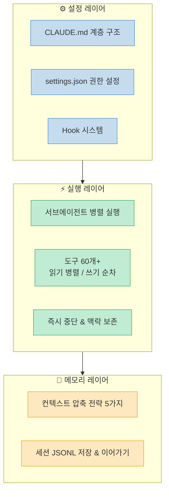
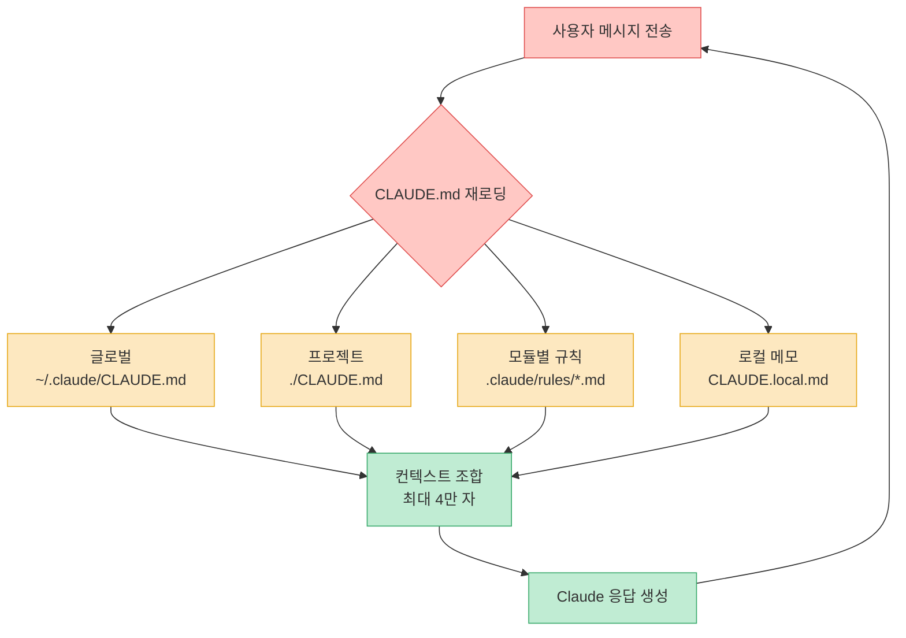
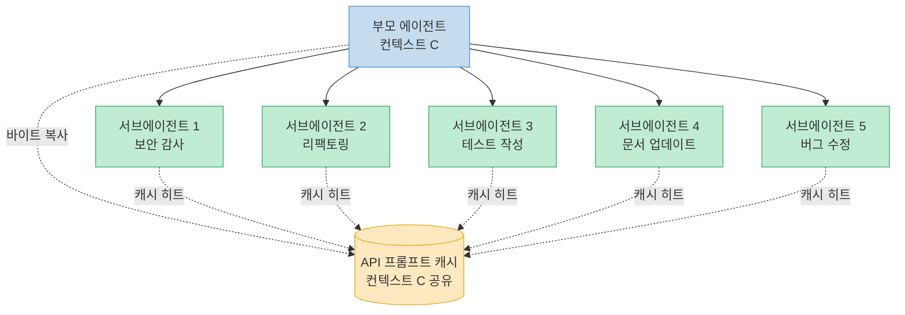
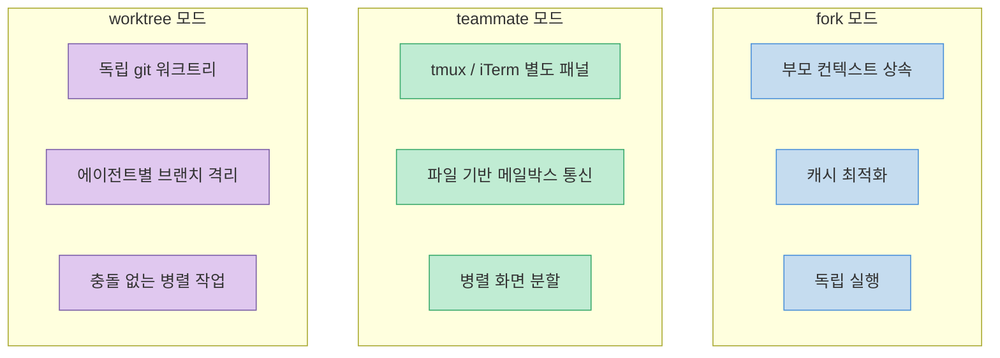
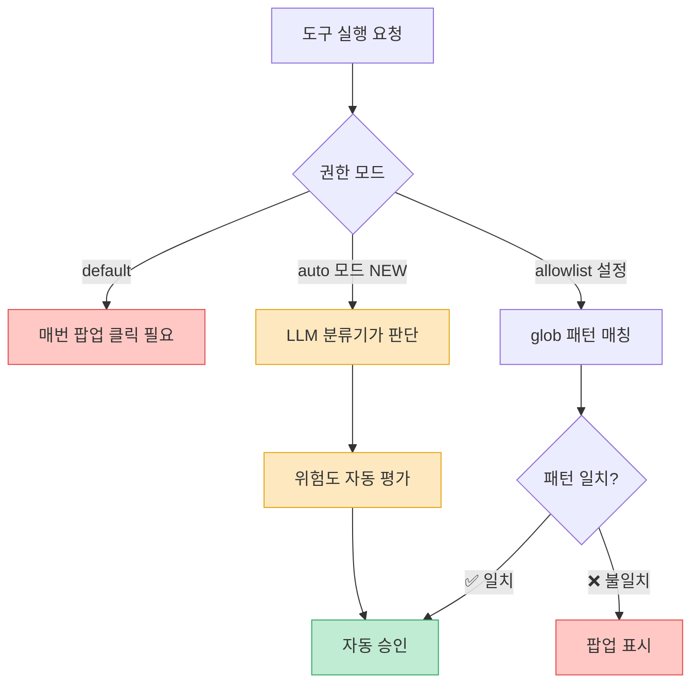
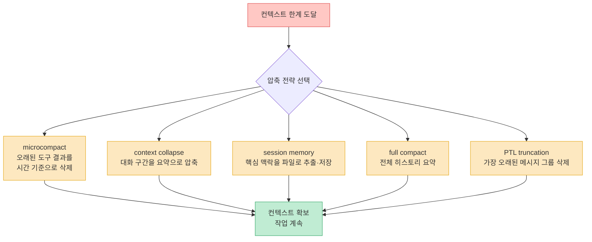
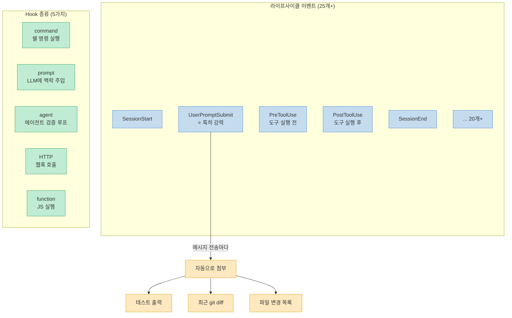
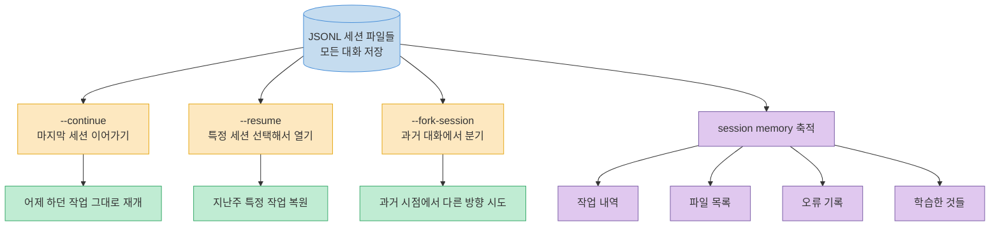
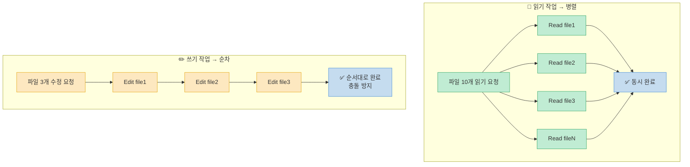
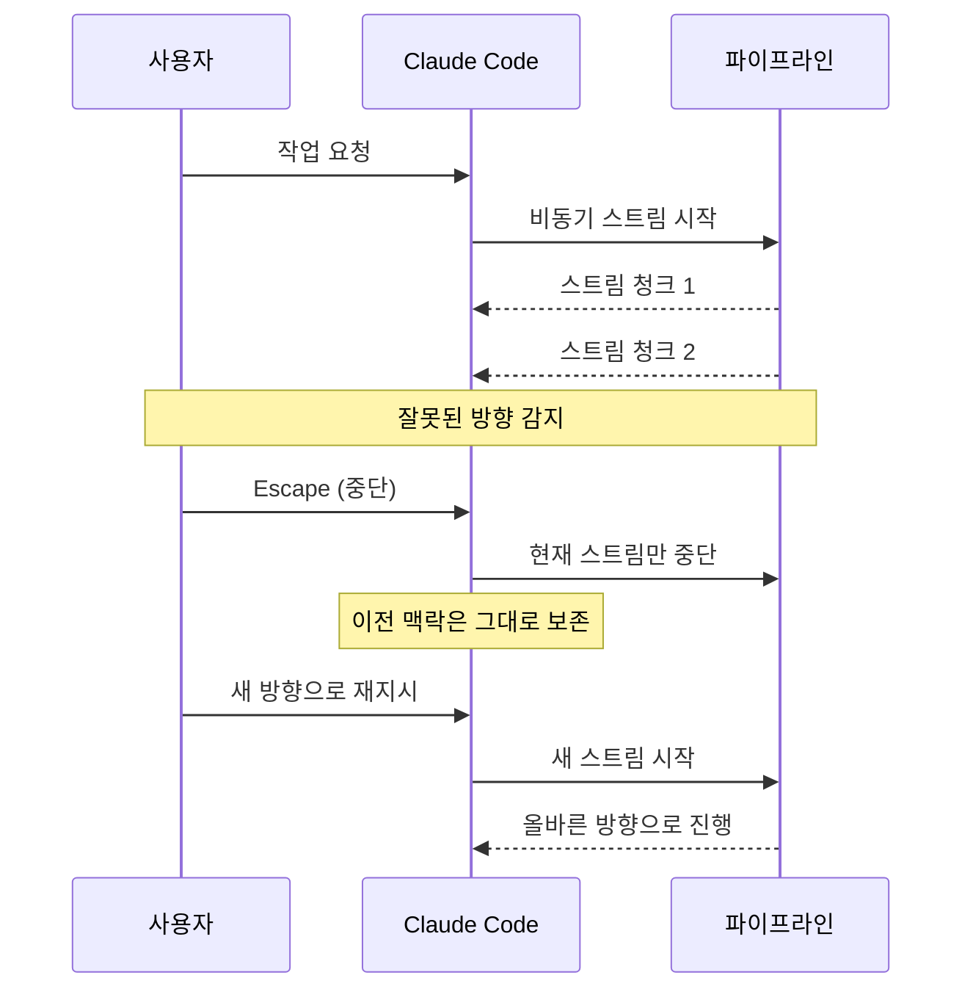

누군가 유출된 Claude Code 소스코드 51만 줄을 읽었습니다. 본인 말로는 "내가 읽었다기보다 Claude Code한테 읽혔다"고. 그렇게 해서 나온 결론은 하나입니다.

> "대부분의 사람이 Claude Code를 '프롬프트 치고, 기다리고, 다시 치는' 방식으로 쓰고 있는데, 소스코드를 보면 이건 페라리를 1단 기어로만 모는 거다."

조회 3.1만 회를 기록한 이 Threads 스레드(@unclejobs.ai)에서 정리한 9가지를 상세히 분석합니다.

<!--more-->

## Sources

- https://www.threads.com/@unclejobs.ai/post/DWjHEgOiT9U
- https://github.com/instructkr/claude-code (유출 리포)

---

## 전체 구조 한눈에 보기



---

## 1. CLAUDE.md는 매 턴마다 읽힌다

세션 시작할 때 한 번 읽는 게 아닙니다. **메시지를 보낼 때마다 다시 읽어요.** 소스코드에서 확인된 구조입니다.



**4단계 계층 구조:**

| 레벨 | 경로 | 범위 | 특징 |
|---|---|---|---|
| 글로벌 | `~/.claude/CLAUDE.md` | 모든 프로젝트 | 개인 설정 |
| 프로젝트 | `./CLAUDE.md` | 현재 프로젝트 | Git 공유 |
| 모듈별 | `.claude/rules/*.md` | 길어지면 분리 | 주제별 파일 |
| 로컬 | `CLAUDE.local.md` | 개인 전용 | .gitignore |

최대 **4만 자**까지 쓸 수 있는데, 대부분 200자도 안 쓰고 있습니다. 아키텍처 결정, 파일 규칙, 테스트 패턴, "이건 절대 하지 마" 규칙을 넣어두면 **매 메시지마다 자동 반영**됩니다.

---

## 2. 서브에이전트 5개를 돌려도 비용은 1개와 거의 같다

소스코드에서 확인된 구조입니다. 서브에이전트를 fork하면 **부모 컨텍스트의 바이트 단위 복사본**을 만들고, API가 이걸 캐시합니다. 5개를 동시에 돌려도 프롬프트 캐시를 공유하기 때문에 비용이 거의 안 늘어요.



**실행 모델 3가지:**



보안 감사·리팩토링·테스트 작성·문서 업데이트·버그 수정을 동시에 돌릴 수 있는 구조가 **이미 내장되어 있는데**, 대부분 한 번에 하나씩 시키고 있는 것입니다.

---

## 3. 권한 팝업을 매번 클릭하고 있다면 설정을 안 한 것이다

"이 작업을 허용할까요?"가 뜰 때마다 클릭하는 건 **기능이 아니라 설정 실패**입니다.

`settings.json`에 glob 패턴으로 허용 범위를 정해두면 됩니다.

```json
{
  "permissions": {
    "allow": [
      "Bash(npm *)",
      "Bash(git *)",
      "Edit(src/**)",
      "Read(**)"
    ]
  }
}
```



특히 **auto 모드**가 새로 생겼는데, LLM 분류기가 각 동작을 판단합니다. 한 번 설정하면 클릭할 일이 없어집니다.

---

## 4. 컨텍스트 압축 전략이 5가지나 있다

Anthropic 엔지니어들이 컨텍스트 넘침 문제에 엄청난 시간을 쏟았다는 증거입니다. 5가지 전략이 내장되어 있어요.



**핵심 조언:** `/compact`를 **게임의 수동 세이브**처럼 쓰세요. 자동 압축을 기다리면 중요한 맥락이 먼저 날아갈 수 있습니다. 중요한 건 보존하고, 필요 없는 건 날리고, 계속 진행하는 것이 전략입니다.

---

## 5. Hook 시스템이 진짜 확장 API다

라이프사이클 이벤트가 **25개 이상** 존재합니다. Hook 종류도 5가지입니다.



**UserPromptSubmit이 특히 강력한 이유:** 메시지를 보낼 때마다 자동으로 테스트 출력이나 최근 `git diff`를 붙일 수 있습니다. 매번 타이핑할 필요가 없어집니다.

예시: 메시지마다 `git diff HEAD~1`을 자동 첨부하는 Hook 설정:

```json
{
  "hooks": {
    "UserPromptSubmit": [
      {
        "type": "command",
        "command": "git diff HEAD~1 --stat 2>/dev/null || echo 'no git'"
      }
    ]
  }
}
```

---

## 6. 세션을 매번 새로 시작하지 마라

모든 대화가 **JSONL 파일로 저장**됩니다. 그 파일을 활용하는 3가지 방법이 있어요.



세션을 이어가면 session memory가 쌓입니다. 매번 새 세션을 여는 건 **IDE를 매시간 껐다 켜는 것**과 같습니다.

---

## 7. 도구가 60개 넘고, 읽기는 병렬, 쓰기는 순차다

소스코드에서 확인된 설계 원칙입니다.



**MCP 서버 지연 로딩:** 연결해놔도 실제로 사용하지 않으면 비용이 **0**입니다. 많이 연결해놓는 것을 두려워할 필요가 없어요.

---

## 8. 중간에 끊어도 손해가 없다

전체 파이프라인이 **비동기 제너레이터 방식**으로 구현되어 있습니다.



Escape를 누르면 현재 스트림만 깔끔하게 중단되고, **이전 맥락은 그대로 남습니다.** 잘못된 방향으로 가고 있으면 기다리지 말고 바로 끊으세요. 페어 프로그래밍에서 "아, 그 방향 말고 이쪽으로"라고 말하는 것과 같습니다.

---

## 9. 결론: 프롬프트 실력이 아니라 설정 실력이다

소스코드를 보면 분명해지는 것이 있습니다.

> "Claude Code를 잘 쓰는 사람들은 프롬프트를 잘 쓰는 게 아닙니다. 설정을 했고, 병렬로 돌렸고, Hook을 걸었고, 세션을 이어갔습니다."

```mermaid
flowchart TD
    Good[Claude Code 고수] --> G1[CLAUDE.md 계층 최적화]
    Good --> G2[서브에이전트 병렬 실행]
    Good --> G3[Hook으로 자동화]
    Good --> G4[세션 연속성 유지]
    Good --> G5[권한 glob 패턴 설정]
    Good --> G6[/compact 수동 세이브]

    Bad[Claude Code 초보] --> B1[프롬프트 잘 쓰기]
    Bad --> B2[단일 에이전트]
    Bad --> B3[권한 팝업 매번 클릭]
    Bad --> B4[매번 새 세션]
    Bad --> B5[컨텍스트 넘침 기다림]
    Bad --> B6[Escape 두려움]

    classDef goodStyle fill:#c0ecd3,stroke:#3aaa6c,color:#333
    classDef badStyle fill:#ffc8c4,stroke:#e05050,color:#333
    class Good,G1,G2,G3,G4,G5,G6 goodStyle
    class Bad,B1,B2,B3,B4,B5,B6 badStyle
```

이건 **터미널 채팅이 아니라 에이전트 오케스트레이션 플랫폼**이라는 게 소스코드에서 분명히 드러납니다.

---

## 핵심 요약

| # | 인사이트 | 실천 방법 |
|---|---|---|
| 1 | CLAUDE.md는 매 턴 재로딩 | 4만 자 계층 구조 최대 활용 |
| 2 | 병렬 에이전트 = 1개 비용 | fork/teammate/worktree 모델 활용 |
| 3 | 권한 팝업 = 설정 실패 | settings.json glob 패턴 + auto 모드 |
| 4 | 컨텍스트 압축 5전략 | /compact를 수동 세이브로 활용 |
| 5 | Hook = 진짜 확장 API | UserPromptSubmit으로 자동 첨부 |
| 6 | 세션은 JSONL로 영속 | --continue/--resume/--fork-session |
| 7 | 읽기 병렬, 쓰기 순차 | MCP 지연 로딩 부담 없이 연결 |
| 8 | Escape = 즉시 중단, 맥락 보존 | 잘못된 방향이면 바로 끊기 |
| 9 | 프롬프트 아닌 설정 실력 | 에이전트 오케스트레이션 플랫폼으로 인식 |

유출 소스코드 리포지토리: [github.com/instructkr/claude-code](https://github.com/instructkr/claude-code)

---

## 결론

소스코드 51만 줄이 말해주는 것은 명확합니다. Claude Code는 이미 완성된 에이전트 오케스트레이션 플랫폼인데, 대부분의 사람이 그 1%도 활용하지 못하고 있습니다.

CLAUDE.md 계층을 채우고, 서브에이전트를 병렬로 돌리고, Hook을 설정하고, 세션을 이어가는 것. 이 네 가지만 해도 Claude Code를 완전히 다른 도구로 경험하게 됩니다. 페라리의 기어를 올릴 준비가 됐다면, 설정 파일부터 시작하세요.
