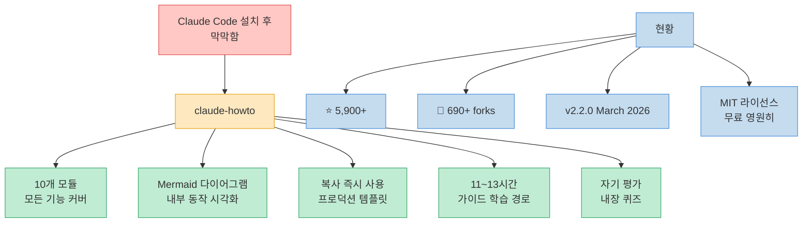
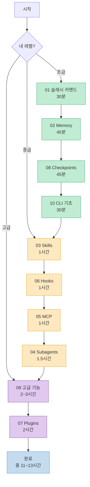
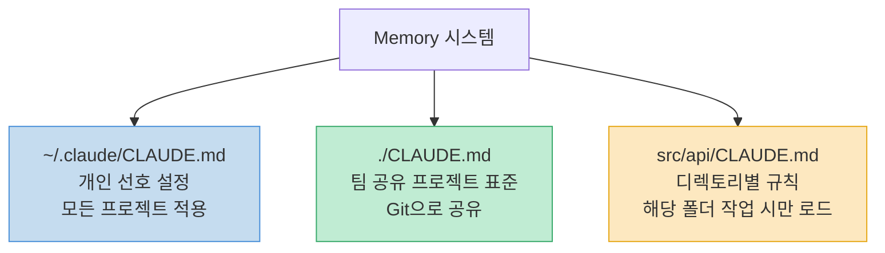
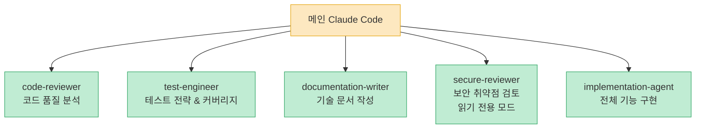
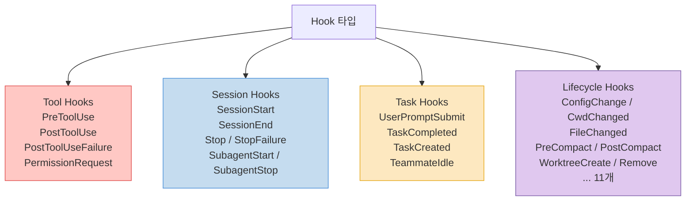
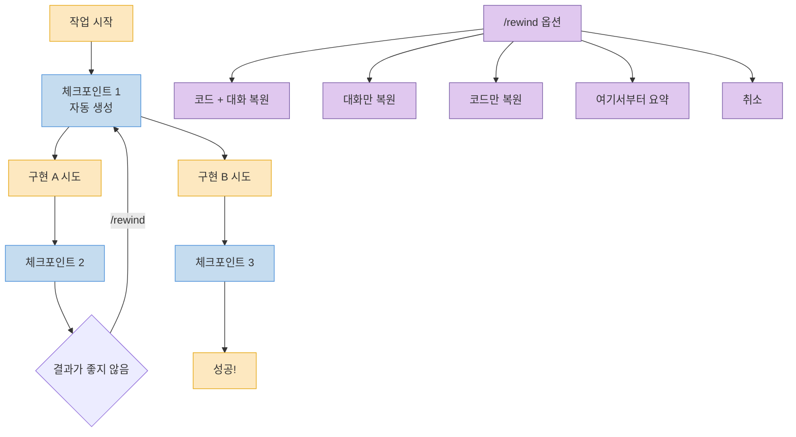
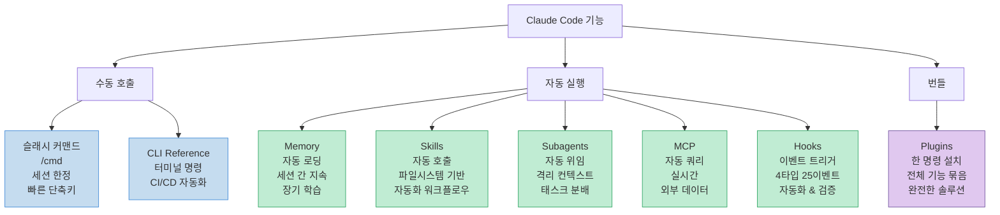
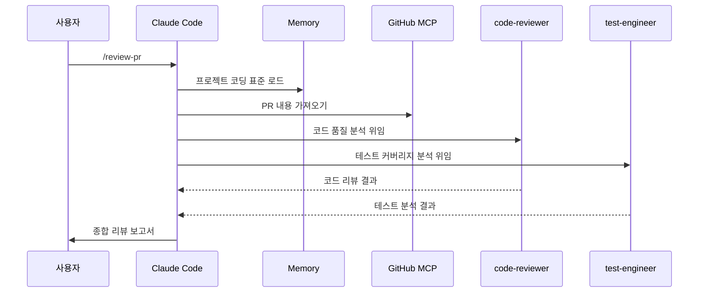
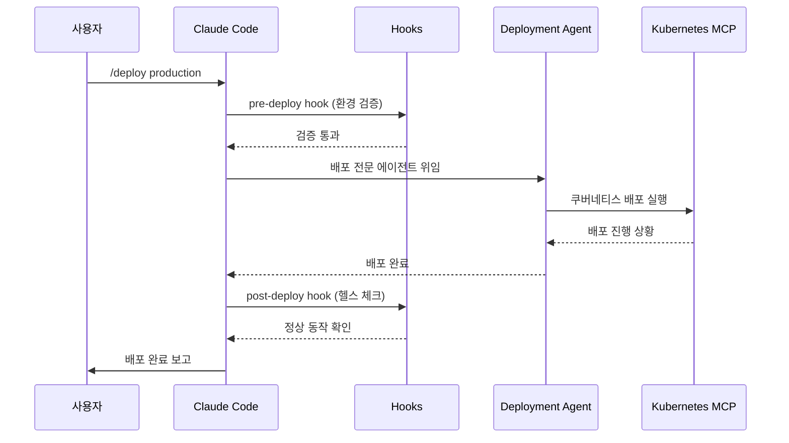
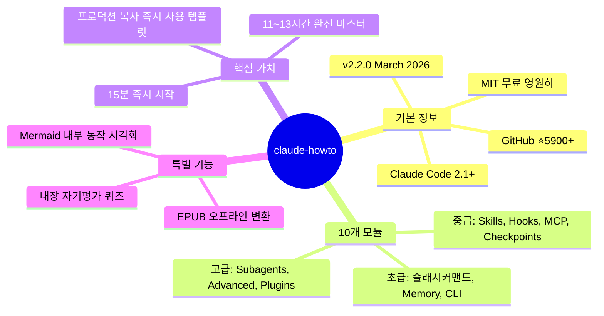

Claude Code를 설치하고 몇 가지 프롬프트를 실행했습니다. 이제 뭘 해야 할까요? 공식 문서는 기능을 설명하지만, 기능들을 어떻게 조합하는지는 알려주지 않습니다. 학습 경로도 없고, 예시는 너무 기초적입니다. GitHub 스타 5,900개를 돌파한 [claude-howto](https://github.com/luongnv89/claude-howto)는 이 공백을 메우는 구조적인 가이드입니다.

<!--more-->

## Sources

- https://github.com/luongnv89/claude-howto

---

## 프로젝트 개요



**공식 문서 vs claude-howto:**

| | 공식 문서 | claude-howto |
|---|---|---|
| **형식** | 참조 문서 | Mermaid 다이어그램 포함 시각적 튜토리얼 |
| **깊이** | 기능 설명 | 내부 작동 원리까지 |
| **예시** | 기초 스니펫 | 즉시 사용 가능한 프로덕션 템플릿 |
| **구조** | 기능 중심 | 점진적 학습 경로 (초급→고급) |
| **온보딩** | 자기 주도형 | 시간 추정 포함 가이드 로드맵 |
| **자기 평가** | 없음 | 내장 퀴즈로 갭 파악 |

---

## 학습 경로: 10개 모듈



| 순서 | 모듈 | 레벨 | 시간 |
|---|---|---|---|
| 1 | 슬래시 커맨드 | 초급 | 30분 |
| 2 | Memory | 초급+ | 45분 |
| 3 | Checkpoints | 중급 | 45분 |
| 4 | CLI 기초 | 초급+ | 30분 |
| 5 | Skills | 중급 | 1시간 |
| 6 | Hooks | 중급 | 1시간 |
| 7 | MCP | 중급+ | 1시간 |
| 8 | Subagents | 중급+ | 1.5시간 |
| 9 | 고급 기능 | 고급 | 2~3시간 |
| 10 | Plugins | 고급 | 2시간 |

---

## 기능별 심층 분석

### 01. 슬래시 커맨드

사용자가 `/cmd` 형식으로 직접 호출하는 단축키입니다. `.claude/commands/` 폴더에 Markdown 파일로 저장됩니다.

```bash
# 포함된 예시 커맨드
optimize.md       # 코드 최적화 분석
pr.md             # PR 준비
generate-api-docs.md  # API 문서 자동 생성
```

```bash
# 설치
cp 01-slash-commands/*.md /path/to/project/.claude/commands/

# 사용
/optimize
/pr
/generate-api-docs
```

### 02. Memory (영구 컨텍스트)

세션이 끊겨도 유지되는 영구 컨텍스트입니다. CLAUDE.md 파일 계층으로 관리합니다.



### 03. Skills (재사용 가능한 능력)

관련 작업 감지 시 자동 호출되는 재사용 능력입니다. 지시사항과 스크립트 묶음으로 구성됩니다.

**포함된 스킬:**
- `code-review/` — 스크립트 포함 종합 코드 리뷰
- `brand-voice/` — 브랜드 보이스 일관성 검사
- `doc-generator/` — API 문서 생성기

```bash
# 개인 설치
cp -r 03-skills/code-review ~/.claude/skills/
# 프로젝트 설치
cp -r 03-skills/code-review /path/to/project/.claude/skills/
```

### 04. Subagents (전문 AI 어시스턴트)

격리된 컨텍스트에서 특정 역할을 수행하는 전문 에이전트입니다.



```bash
cp 04-subagents/*.md /path/to/project/.claude/agents/
```

### 05. MCP Protocol

외부 도구 및 API에 접근하는 Model Context Protocol입니다.

```bash
# 예시: GitHub MCP 설정
export GITHUB_TOKEN="your_token"
claude mcp add github -- npx -y @modelcontextprotocol/server-github
```

포함 설정 파일: `github-mcp.json`, `database-mcp.json`, `filesystem-mcp.json`, `multi-mcp.json`

### 06. Hooks (이벤트 기반 자동화)

Claude Code 이벤트에 반응해 자동 실행되는 셸 스크립트입니다. **4가지 타입, 25개 이벤트**를 지원합니다.



**포함된 훅 스크립트:**
- `format-code.sh` — 쓰기 전 자동 코드 포맷
- `pre-commit.sh` — 커밋 전 테스트 실행
- `security-scan.sh` — 보안 취약점 스캔
- `log-bash.sh` — 모든 Bash 명령 로깅
- `validate-prompt.sh` — 사용자 프롬프트 검증
- `notify-team.sh` — 이벤트 발생 시 알림

**설정 예시 (`~/.claude/settings.json`):**

```json
{
  "hooks": {
    "PreToolUse": [{
      "matcher": "Write",
      "hooks": ["~/.claude/hooks/format-code.sh"]
    }],
    "PostToolUse": [{
      "matcher": "Write",
      "hooks": ["~/.claude/hooks/security-scan.sh"]
    }]
  }
}
```

### 07. Plugins (기능 번들)

슬래시 커맨드 + 에이전트 + MCP + 훅을 하나의 패키지로 묶은 완전한 솔루션입니다.

```bash
/plugin install pr-review         # PR 리뷰 워크플로우
/plugin install devops-automation # 배포 & 모니터링
/plugin install documentation     # 문서 생성
```

### 08. Checkpoints (세션 스냅샷 & 되감기)

대화 상태를 저장하고 이전 지점으로 되돌아가 다른 접근법을 탐색합니다.



- **체크포인트**: 매 사용자 프롬프트마다 자동 생성
- **되감기**: Esc 두 번 또는 `/rewind`

### 09. 고급 기능

| 기능 | 설명 | 단축키/명령 |
|---|---|---|
| Planning Mode | 코딩 전 상세 구현 계획 수립 | 자동/수동 |
| Extended Thinking | 복잡한 문제 심층 추론 | `Alt+T` / `Option+T` |
| Background Tasks | 블로킹 없는 장시간 작업 | 자동 |
| Headless Mode | CI/CD에서 Claude Code 실행 | `claude -p "..."` |
| Session Management | 세션 재개/이름변경/분기 | `/resume`, `/rename`, `/fork` |

**권한 모드 5가지:** `default`, `acceptEdits`, `plan`, `dontAsk`, `bypassPermissions`

### 10. CLI Reference

```bash
# 인터랙티브 모드
claude "explain this project"

# 출력 모드 (비대화형)
claude -p "review this code"

# 파일 내용 처리
cat error.log | claude -p "explain this error"

# JSON 출력 (스크립트 연동)
claude -p --output-format json "list functions"

# 세션 재개
claude -r "feature-auth" "continue implementation"
```

---

## 기능 비교표



---

## 실전 워크플로우

### 자동화 코드 리뷰



### DevOps 배포 파이프라인



---

## 15분 빠른 시작

```bash
# 1. 가이드 클론
git clone https://github.com/luongnv89/claude-howto.git
cd claude-howto

# 2. 첫 번째 슬래시 커맨드 복사
mkdir -p /path/to/your-project/.claude/commands
cp 01-slash-commands/optimize.md /path/to/your-project/.claude/commands/

# 3. Claude Code에서 실행
# /optimize

# 4. 프로젝트 Memory 설정
cp 02-memory/project-CLAUDE.md /path/to/your-project/CLAUDE.md

# 5. 스킬 설치
cp -r 03-skills/code-review ~/.claude/skills/
```

**1시간 핵심 설정:**

```bash
cp 01-slash-commands/*.md .claude/commands/    # 슬래시 커맨드 (15분)
cp 02-memory/project-CLAUDE.md ./CLAUDE.md     # Memory (15분)
cp -r 03-skills/code-review ~/.claude/skills/  # Skills (15분)
# 주말 목표: Hooks + Subagents + MCP + Plugins
```

---

## 자기 평가 & 내장 퀴즈

Claude Code 내에서 바로 실행할 수 있는 자기 평가 시스템이 내장되어 있습니다.

```bash
# 전체 자기 평가 (자신의 레벨 파악)
/self-assessment

# 모듈별 퀴즈 (갭 파악)
/lesson-quiz hooks
/lesson-quiz subagents
/lesson-quiz mcp
```

---

## 오프라인 EPUB 생성

전체 가이드를 Mermaid 다이어그램이 렌더링된 EPUB 전자책으로 변환할 수 있습니다.

```bash
uv run scripts/build_epub.py
# → claude-howto-guide.epub 생성
```

---

## 핵심 요약



| 레벨 | 시작 모듈 | 예상 시간 |
|---|---|---|
| 초급 (Claude Code 시작 단계) | 01 슬래시 커맨드 | ~2.5시간 |
| 중급 (CLAUDE.md, 커스텀 커맨드) | 03 Skills | ~3.5시간 |
| 고급 (MCP, Hooks 설정 경험) | 09 고급 기능 | ~5시간 |

---

## 결론

claude-howto는 "Claude Code 사용법"이 아니라 "Claude Code 마스터"를 위한 가이드입니다. 공식 문서가 기능 참조를 담당한다면, claude-howto는 그 기능들을 조합해 실제로 쓸 수 있는 워크플로우를 만드는 방법을 알려줍니다.

슬래시 커맨드 하나를 복사하는 15분에서 시작해, 주말 동안 11~13시간을 투자하면 서브에이전트와 훅과 MCP를 연결한 자동화 파이프라인을 직접 구축할 수 있습니다. MIT 라이선스, 무료, 즉시 클론 가능합니다.
