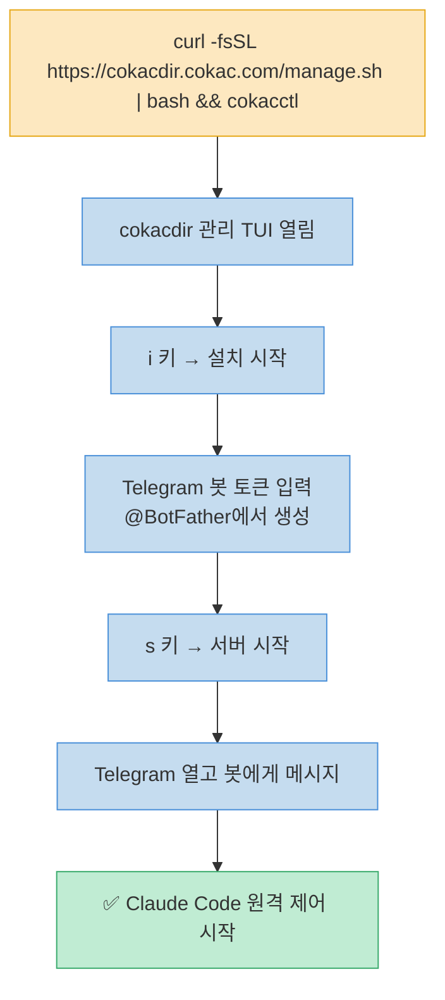
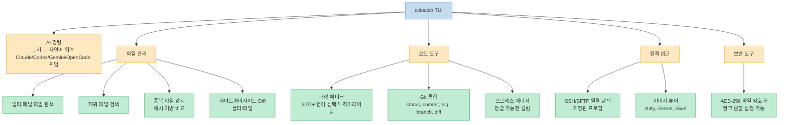
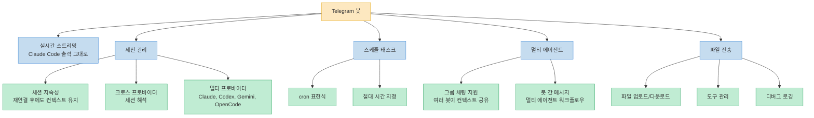
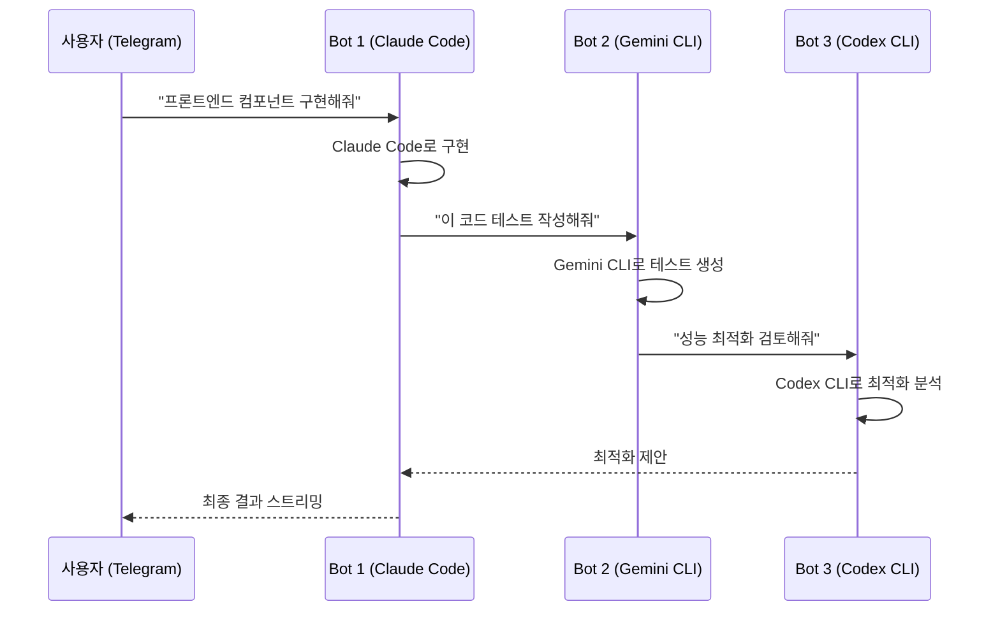
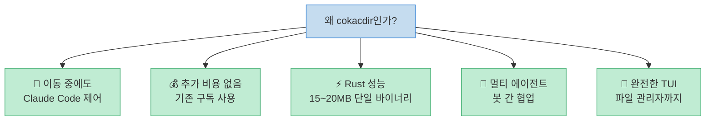

GitHub 스타 192개의 작은 프로젝트지만, 개념은 단순하고 강력합니다. Claude Code를 이미 쓰고 있다면, 그 세션을 Telegram에서 그대로 이어받을 수 있습니다. cokacdir는 AI 에이전트가 아닙니다 — 이미 사용 중인 코딩 에이전트에 위임하고, 그 결과를 Telegram으로 스트리밍해주는 원격 제어 브릿지입니다.

<!--more-->

## Sources

- https://github.com/kstost/cokacdir

---

## cokacdir란 무엇인가

```mermaid
flowchart TD
    User[👤 사용자<br/>Telegram] -->|메시지 전송| Bot[Telegram 봇<br/>cokacdir]
    Bot -->|위임| Agents[코딩 에이전트]
    Agents --> A1[Claude Code]
    Agents --> A2[Codex CLI]
    Agents --> A3[Gemini CLI]
    Agents --> A4[OpenCode]
    A1 & A2 & A3 & A4 -->|실행 결과 스트리밍| Bot
    Bot -->|실시간 스트리밍| User

    Note1[⚠️ LLM 없음<br/>AI 에이전트 아님]
    Note2[✅ 추가 비용 없음<br/>기존 구독 사용]

    classDef userStyle fill:#c5dcef,stroke:#4a90d9,color:#333
    classDef botStyle fill:#fde8c0,stroke:#e6a817,color:#333
    classDef agentStyle fill:#c0ecd3,stroke:#3aaa6c,color:#333
    classDef noteStyle fill:#e0c8ef,stroke:#7b5ea7,color:#333
    class User userStyle
    class Bot botStyle
    class A1,A2,A3,A4 agentStyle
    class Note1,Note2 noteStyle
```



**핵심 정의:**

> "cokacdir is **not** an AI agent — it does not include an LLM or reasoning engine. Instead, it delegates tasks to the coding agent you are already using (Claude Code, Codex CLI, Gemini CLI, OpenCode) and lets you control it from Telegram."

이미 사용 중인 에이전트의 구독(또는 무료 티어) 안에서 실행되므로 **추가 API 비용이 없습니다.** 폰에서 Telegram 메시지를 보내면, 로컬 컴퓨터의 Claude Code가 코드를 실행하고 파일을 편집하고 셸 명령을 수행한 뒤 결과를 실시간으로 스트리밍해줍니다.

---

## 빠른 시작: 3단계



**macOS / Linux:**
```bash
curl -fsSL https://cokacdir.cokac.com/manage.sh | bash && cokacctl
```

**Windows (PowerShell 관리자):**
```powershell
irm https://cokacdir.cokac.com/manage.ps1 | iex; cokacctl
```

---

## 두 개의 얼굴: TUI 파일 관리자 + Telegram 봇

cokacdir는 두 가지 역할을 합니다. 로컬에서는 풀기능 TUI 파일 관리자로, 원격에서는 Telegram 봇 인터페이스로 동작합니다.

### TUI 파일 관리자 기능



**성능:** Rust로 작성, LTO + strip 최적화. 단일 바이너리 15~20MB (플랫폼별 상이).

---

### Telegram 봇 기능



**Telegram 명령어 전체 목록:**

```
/start       세션 시작
/stop        세션 중지
/clear       컨텍스트 초기화
/help        도움말
/session     세션 정보
/pwd         현재 디렉토리
/model       AI 모델 변경
/down        파일 다운로드
/instruction 지시사항 설정
/instruction_clear  지시사항 초기화
/allowed     허용된 작업 목록
/allowedtools       허용된 도구 목록
/availabletools     사용 가능한 도구 목록
/context     현재 컨텍스트 보기
/query       직접 쿼리
/public      공개 모드
/direct      직접 모드
/setpollingtime     폴링 간격 설정
/debug       디버그 모드
/silent      무음 모드
```

---

## 멀티 에이전트 워크플로우

봇 간 메시지 기능으로 여러 에이전트가 협력하는 워크플로우를 구성할 수 있습니다.



그룹 채팅 지원으로 여러 봇이 동일한 컨텍스트를 공유하며 협력할 수도 있습니다.

---

## 지원 플랫폼

| 플랫폼 | 아키텍처 |
|---|---|
| macOS | Apple Silicon (M1/M2/M3) & Intel |
| Linux | x86_64 & ARM64 |
| Windows | x86_64 & ARM64 |

---

## 핵심 요약



| 항목 | 내용 |
|---|---|
| **저장소** | github.com/kstost/cokacdir |
| **언어** | Rust |
| **바이너리 크기** | 15~20MB |
| **라이선스** | MIT |
| **GitHub 스타** | ⭐ 192 |
| **지원 에이전트** | Claude Code, Codex CLI, Gemini CLI, OpenCode |
| **추가 비용** | 없음 (기존 구독 사용) |
| **Telegram 명령어** | 20개+ |
| **플랫폼** | macOS, Linux, Windows (Apple Silicon 포함) |

---

## 결론

cokacdir는 "Telegram으로 Claude Code를 원격 제어한다"는 아이디어를 Rust로 구현한 도구입니다. 별도의 AI 모델이나 API 비용이 없고, 이미 사용 중인 Claude Code 세션에 Telegram이라는 인터페이스를 추가하는 방식입니다.

TUI 파일 관리자로서의 기능(Git, SSH/SFTP, AES-256 암호화, 내장 에디터)도 충분히 풍부하지만, 핵심 가치는 하나입니다 — 폰에서 Telegram 메시지 하나로 로컬 컴퓨터의 코딩 에이전트에게 일을 시키는 것.
