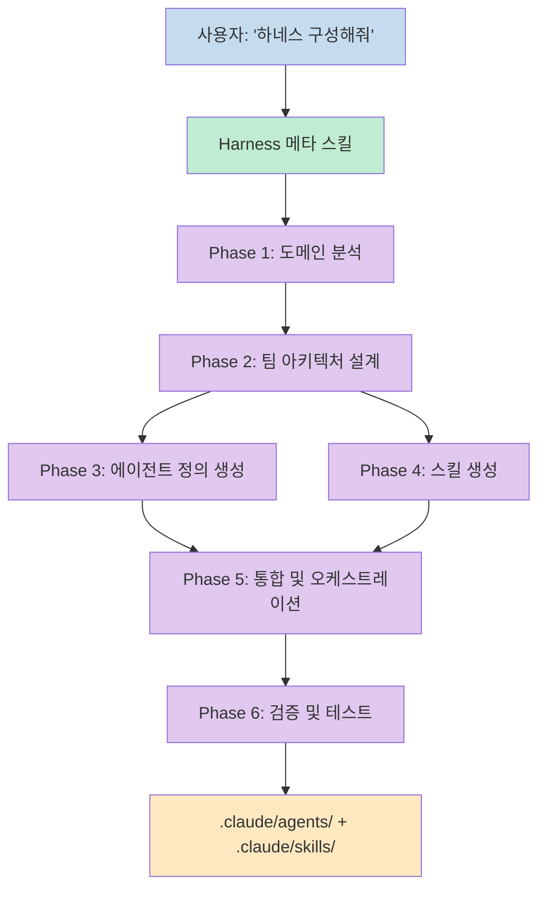
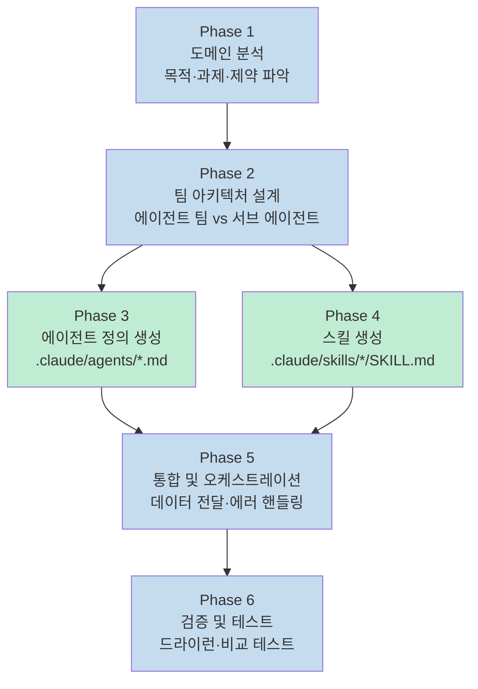
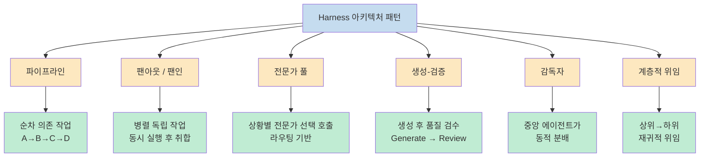
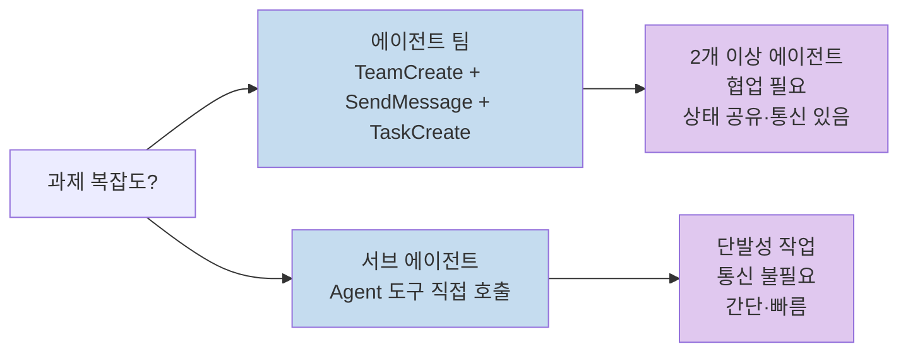
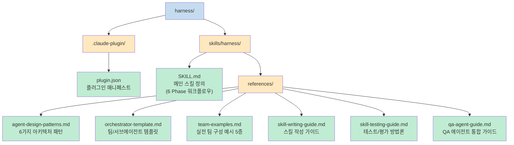
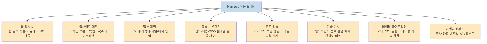
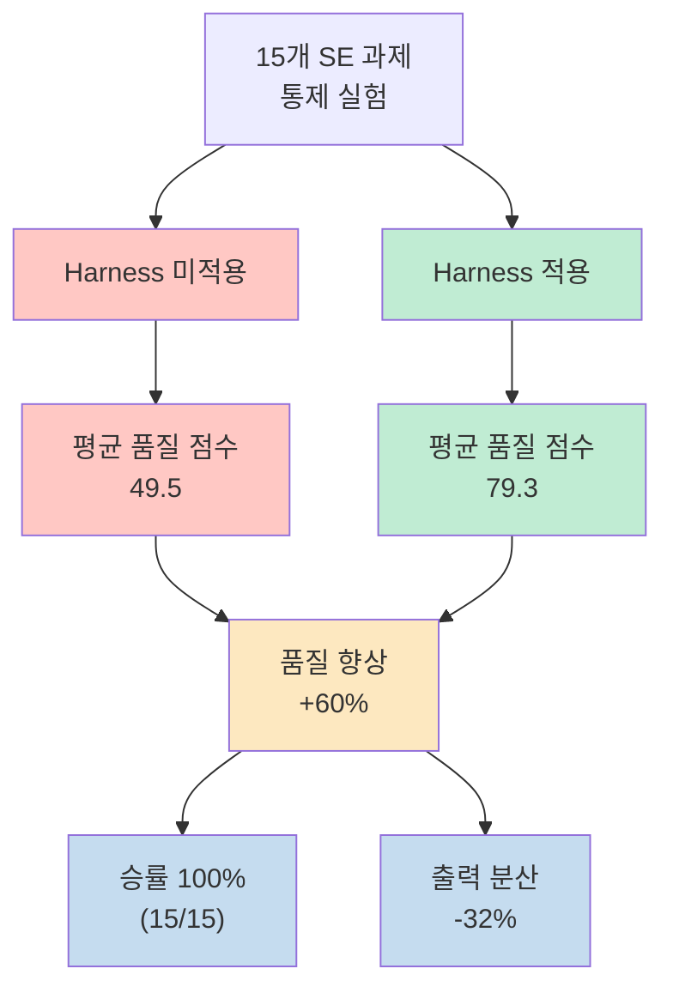
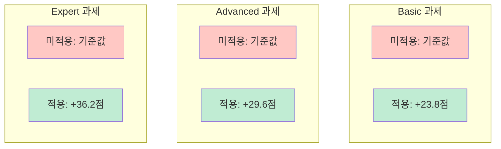
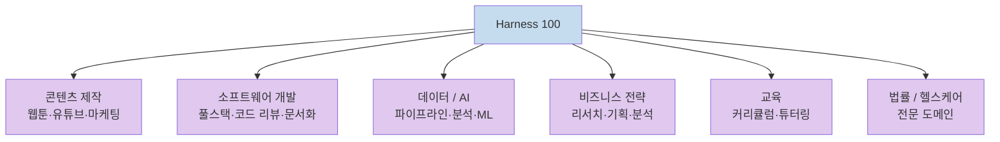

"하네스 구성해줘" 한 마디면 도메인에 맞는 전문 에이전트 팀과 스킬을 자동 생성해주는 Claude Code 플러그인 **Harness**. 1.1k GitHub 스타를 받은 이 도구는 단순한 편의 도구를 넘어, 구조화된 사전 설정이 LLM 출력 품질에 미치는 영향을 통제 실험으로 검증한 연구 결과까지 제시한다.

<!--more-->

## Sources

- https://github.com/revfactory/harness/blob/main/README_KO.md

## Harness란 무엇인가

Harness는 Claude Code의 에이전트 팀 시스템을 활용해 복잡한 작업을 전문 에이전트 팀으로 분해·조율하는 아키텍처 도구다. "하네스 구성해줘"라고 입력하면 사용자의 도메인에 맞는 에이전트 정의(`.claude/agents/`)와 스킬(`.claude/skills/`)을 자동 생성한다.

핵심 개념은 **에이전트(누가)** 와 **스킬(어떻게)** 의 분리다. 에이전트 정의 파일은 역할·원칙·프로토콜을 담고, 스킬 파일은 구체적인 실행 방법을 Progressive Disclosure 패턴으로 담는다.



## 6 Phase 워크플로우

Harness가 실행하는 작업 순서는 다음과 같이 6단계로 구성된다.



## 6가지 아키텍처 패턴

Harness는 작업 특성에 따라 아래 6가지 아키텍처 패턴 중 하나를 선택해 에이전트 팀을 설계한다.



### 패턴 선택 기준

| 패턴 | 언제 사용하나 | 예시 |
|------|-------------|------|
| 파이프라인 | 단계가 순서에 의존할 때 | 분석→설계→구현→테스트 |
| 팬아웃/팬인 | 독립적인 병렬 작업이 많을 때 | 보안·성능·스타일 동시 리뷰 |
| 전문가 풀 | 입력 유형마다 다른 전문가가 필요할 때 | 언어별 번역 에이전트 |
| 생성-검증 | 품질 보증이 핵심일 때 | 코드 생성 후 QA |
| 감독자 | 동적 작업 분배가 필요할 때 | 복잡한 리서치 조율 |
| 계층적 위임 | 재귀적 분해가 필요할 때 | 대규모 코드베이스 분석 |

## 실행 모드: 에이전트 팀 vs 서브 에이전트



## 핵심 기능 4가지

1. **에이전트 팀 설계** — 6가지 아키텍처 패턴을 도메인 분석 결과에 맞게 자동 선택
2. **스킬 생성** — Progressive Disclosure 패턴으로 컨텍스트를 효율 관리. 항상 필요한 핵심 정보만 로드하고 상세 내용은 필요 시 주입
3. **오케스트레이션** — 에이전트 간 데이터 전달, 에러 핸들링, 팀 조율 프로토콜 포함
4. **검증 체계** — 트리거 검증, 드라이런 테스트, With-skill vs Without-skill 비교 테스트

## 플러그인 구조



## 산출물: 자동 생성되는 파일

Harness가 실행되면 프로젝트 내에 아래 구조의 파일이 자동으로 생성된다.

```
프로젝트/
├── .claude/
│   ├── agents/          # 에이전트 정의 파일
│   │   ├── analyst.md
│   │   ├── builder.md
│   │   └── qa.md
│   └── skills/          # 스킬 파일
│       ├── analyze/
│       │   └── SKILL.md
│       └── build/
│           ├── SKILL.md
│           └── references/
```

## 설치 방법

### 마켓플레이스를 통한 설치

```bash
# 마켓플레이스 등록
/plugin marketplace add revfactory/harness

# 플러그인 설치
/plugin install harness@harness
```

### 글로벌 스킬로 직접 설치

```bash
cp -r skills/harness ~/.claude/skills/harness
```

### 필수 환경 변수

에이전트 팀 기능을 활성화해야 한다.

```bash
CLAUDE_CODE_EXPERIMENTAL_AGENT_TEAMS=1
```

## 실제 사용 사례 8가지

Harness는 다양한 도메인에 즉시 적용 가능하다. 아래 프롬프트를 그대로 Claude Code에 입력하면 된다.



## A/B 테스트 연구: 실제로 얼마나 효과적인가

이 프로젝트에서 가장 주목할 부분은 실증 연구다. **15개 소프트웨어 엔지니어링 과제**에 대해 Harness 적용 여부에 따른 출력 품질을 통제 실험으로 측정했다.



### 과제 난이도별 개선 효과

핵심 발견은 **난이도가 높을수록 Harness의 효과가 더 크다**는 점이다.



이 패턴은 구조화된 사전 설정이 단순 작업보다 복잡한 작업에서 더 큰 역할을 한다는 것을 시사한다. 전문 에이전트 팀 아키텍처가 복잡한 문제를 분해·조율하는 방식 자체가 LLM의 한계를 구조적으로 보완하기 때문이다.

> 논문 전문: *Hwang, M. (2026). Harness: Structured Pre-Configuration for Enhancing LLM Code Agent Output Quality.*

## Harness 100: 생태계 확장

Harness 플러그인으로 생성된 프로덕션 레디 패키지 컬렉션이 별도 저장소로 공개됐다.

**[revfactory/harness-100](https://github.com/revfactory/harness-100)**

- 10개 도메인, 100개의 프로덕션 레디 에이전트 팀 하네스 (한영 200패키지)
- 각 하네스에 4~5명의 전문 에이전트 + 오케스트레이터 스킬 + 도메인 특화 스킬 포함
- 총 **1,808개 마크다운 파일**
- 콘텐츠 제작, 소프트웨어 개발, 데이터/AI, 비즈니스 전략, 교육, 법률, 헬스케어 등 포함



## 핵심 요약

| 항목 | 내용 |
|------|------|
| **프로젝트** | Harness (revfactory/harness) |
| **종류** | Claude Code 플러그인 (메타 스킬) |
| **핵심 기능** | 에이전트 팀 설계, 스킬 자동 생성, 오케스트레이션, 검증 |
| **아키텍처 패턴** | 파이프라인, 팬아웃/팬인, 전문가 풀, 생성-검증, 감독자, 계층적 위임 |
| **품질 향상** | +60% (15/15 과제 승률 100%) |
| **출력 분산 감소** | -32% (더 일관된 결과) |
| **GitHub** | 1.1k stars, 133 forks |
| **라이선스** | Apache 2.0 |
| **필수 설정** | `CLAUDE_CODE_EXPERIMENTAL_AGENT_TEAMS=1` |

## 결론

Harness는 "에이전트 팀을 어떻게 설계할까?"라는 질문에 구조화된 답을 제공한다. 6가지 아키텍처 패턴과 6단계 워크플로우는 복잡한 작업을 체계적으로 분해하는 프레임워크를 제공하며, 통제 실험을 통한 +60% 품질 향상 데이터는 이 접근법의 실효성을 뒷받침한다. 난이도가 높을수록 효과가 커진다는 발견은, 구조화된 사전 설정이 LLM의 컨텍스트 한계를 보완하는 방식으로 작동함을 시사한다. Claude Code에서 에이전트 팀을 활용한다면 Harness는 출발점으로 검토할 만한 도구다.
