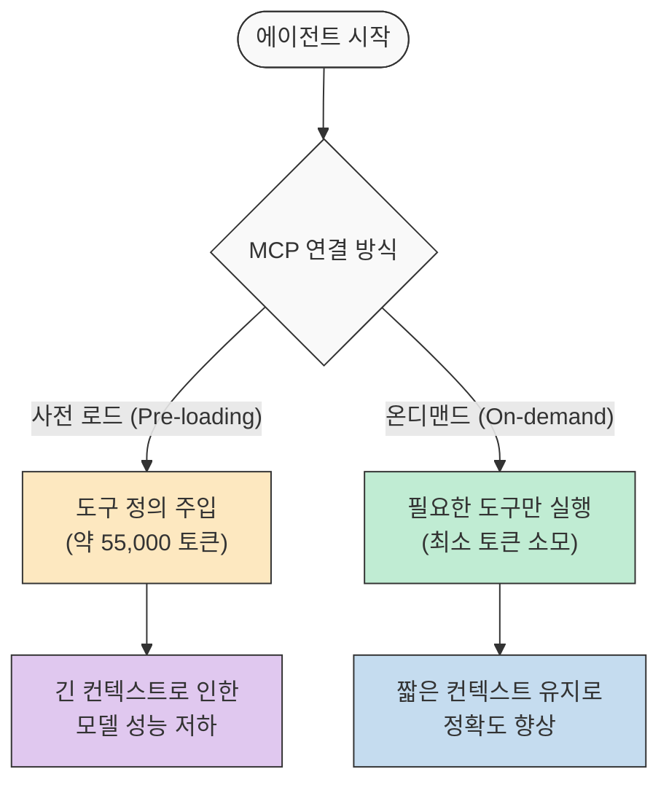
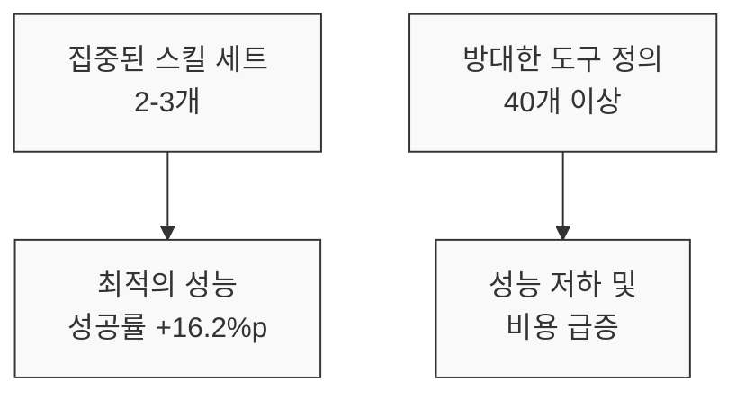
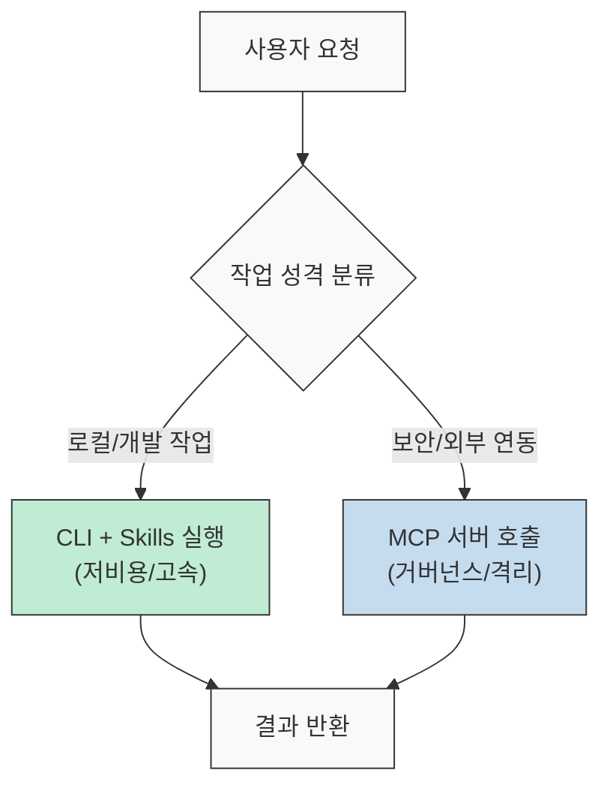

최근 AI 에이전트 생태계에서 Model Context Protocol(MCP)은 도구 연결의 표준으로 자리 잡았습니다. 하지만 모든 도구를 MCP로 연결하는 것이 항상 최선은 아닙니다. 특히 개발자 개인의 워크플로우에서는 MCP의 과도한 토큰 소모와 성능 저하가 문제가 될 수 있습니다. 이번 글에서는 VibeLabs 공유게시판에 2026년 3월 27일 올라온 글과, 그 글이 기대는 공개 벤치마크·엔지니어링 문서를 함께 읽으면서, 왜 CLI와 Skills의 결합이 더 효율적인 대안이 될 수 있는지, 그리고 어떤 상황에서 MCP를 유지해야 하는지 살펴보겠습니다. 참고로 VibeLabs 원문은 제목과 날짜는 확인되지만 작성자 표기는 명확하지 않습니다.

<!--more-->

## Sources

- [기존 MCP를 삭제하세요: Skills + CLI가 약 20배 저렴한 비용으로 더 뛰어난 성능을 발휘합니다 (VibeLabs, 2026-03-27)](https://vibelabs.kr/shared/6)
- [MCP vs CLI: Which modality is right for your AI agent? (Scalekit)](https://www.scalekit.com/blog/mcp-vs-cli-use)
- [Code execution with MCP (Anthropic Engineering)](https://www.anthropic.com/engineering/code-execution-with-mcp)
- [SkillsBench: A Benchmark for Evaluating Skill-based AI Agents (arXiv:2602.12670v1)](https://arxiv.org/html/2602.12670v1)

## MCP의 토큰 비용 함정과 성능 저하

VibeLabs 원문은 GitHub Copilot MCP 서버를 연결할 경우 약 43개의 도구가 노출되고, 에이전트가 실제 코드를 읽기 전부터 약 55,000개의 토큰이 컨텍스트에 주입된다고 주장합니다. 이 수치는 특정 서버 구성과 측정 방식에 따라 달라질 수 있지만, 원문의 문제의식은 분명합니다. 도구 정의 비용만으로도 세션 초반 비용이 커질 수 있다는 것입니다.

Anthropic의 엔지니어링 블로그에서도 비슷한 문제를 지적합니다. 모든 도구 정의를 미리 로드하고 중간 결과를 모델을 통해 라우팅하는 방식은 토큰 사용량을 불필요하게 늘립니다. Anthropic은 온디맨드 도구 로딩과 코드 실행 방식을 통해 토큰 사용량을 150,000개에서 2,000개로 획기적으로 줄인 사례를 공유했습니다.

긴 컨텍스트는 단순히 비용 문제에 그치지 않고 모델의 추론 성능을 저하시키는 원인이 됩니다. 도구 정의가 많아질수록 모델은 정작 중요한 작업 지침을 놓칠 가능성이 커집니다.

## CLI + Skills: 개발자 워크플로우의 효율성

VibeLabs는 에이전트가 이미 학습 데이터를 통해 `gh` (GitHub CLI)와 같은 도구 사용법을 잘 알고 있다는 점을 강조합니다. 굳이 모든 CLI 명령어를 MCP 도구로 다시 정의해서 주입할 필요가 없다는 뜻입니다.

Scalekit의 벤치마크 결과는 이를 뒷받침합니다. 이들의 75회 벤치마크에서는 CLI 방식이 효율성 지표에서 MCP보다 유리하게 나왔습니다. 다만 이것 역시 GitHub 작업, 특정 모델, 특정 서버 조건에서 얻은 결과이므로 그대로 일반화하면 안 됩니다. 안전하게 읽으면, 적어도 그 실험에서는 MCP가 CLI보다 4배에서 최대 32배 더 많은 토큰을 소모했고, 신뢰도도 약 72% 수준에 머물렀다는 뜻입니다.

또한 SkillsBench 연구에 따르면, 에이전트에게 2~3개의 집중된 스킬(Curated Skills)을 제공하는 것이 가장 높은 성능을 발휘합니다. 스킬 세트가 너무 커지면 오히려 평균 성공률(Pass Rate)이 떨어지는 수확 체감 현상이 발생합니다.

이러한 결과는 개발자가 직접 소유하고 제어하는 워크플로우에서는 방대한 MCP 서버보다 필요한 기능만 선별한 Skills와 CLI의 조합이 훨씬 유리함을 보여줍니다.

## 거버넌스와 보안: MCP가 여전히 필요한 영역

그렇다고 MCP가 무용지물인 것은 아닙니다. Scalekit은 에이전트가 누구를 대신해 행동하는지에 따라 선택이 달라져야 한다고 조언합니다.

1. **개발자를 대신할 때 (Acting for Developer):** 로컬 환경의 권한을 가진 개발자가 직접 도구를 실행하므로 CLI와 Skills가 더 빠르고 저렴합니다.
2. **고객 사용자를 대신할 때 (Acting for Customer):** 멀티 테넌트 격리, 엔터프라이즈급 인증, 엄격한 감사(Audit) 로그가 필요한 SaaS 환경에서는 MCP가 제공하는 표준화된 인터페이스와 보안 계층이 필수적입니다.

즉, 테넌트 간의 격리와 중앙 집중식 거버넌스가 중요한 기업용 서비스 환경에서는 MCP가 여전히 강력한 가치를 가집니다.

## 실전 적용 포인트

VibeLabs는 무조건적인 MCP 삭제보다는 실용적인 하이브리드 아키텍처를 제안합니다.

- **로컬 개발 워크플로우:** 자주 사용하는 작업은 `gh`, `git`, `npm` 등의 CLI 명령어를 직접 호출하는 Skills로 구성하여 토큰 비용을 최소화합니다.
- **복잡한 외부 연동:** 인증이나 복잡한 상태 관리가 필요한 외부 서비스 연동에만 선별적으로 MCP를 사용합니다.
- **점진적 노출 (Progressive Disclosure):** 에이전트가 처음부터 모든 도구를 알게 하지 말고, 작업 단계에 따라 필요한 도구 정의만 컨텍스트에 추가하는 방식을 채택합니다.

## 핵심 요약

- **비용 효율성:** MCP는 도구 정의만으로 수만 개의 토큰을 소모할 수 있으며, CLI 방식은 이를 20배 이상 절감할 수 있습니다.
- **성능 최적화:** 2~3개의 집중된 스킬을 제공할 때 에이전트의 성공률이 가장 높으며, 과도한 도구 로딩은 모델의 정확도를 떨어뜨립니다.
- **거버넌스 균형:** 개인 개발자 워크플로우에는 CLI+Skills가 적합하지만, 보안과 감사가 중요한 엔터프라이즈 환경에서는 MCP가 여전히 유효합니다.
- **하이브리드 전략:** 모든 것을 한 방식으로 통일하기보다, 작업의 성격에 따라 도구 노출 방식을 다르게 가져가는 것이 실전에서 가장 효과적입니다.

## 결론

MCP는 도구 간의 연결성을 혁신했지만, 그 이면의 비용과 성능 트레이드오프를 간과해서는 안 됩니다. 개발자로서 우리는 에이전트에게 무거운 도구 가방을 통째로 들려주기보다, 지금 당장 필요한 도구만 주머니에 넣어주는 지혜가 필요합니다. CLI의 강력함과 Skills의 유연함을 결합하여 더 빠르고 경제적인 AI 워크플로우를 구축해 보시기 바랍니다.
