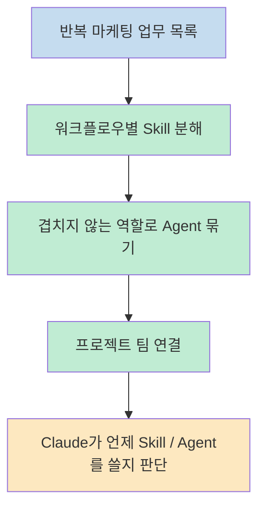
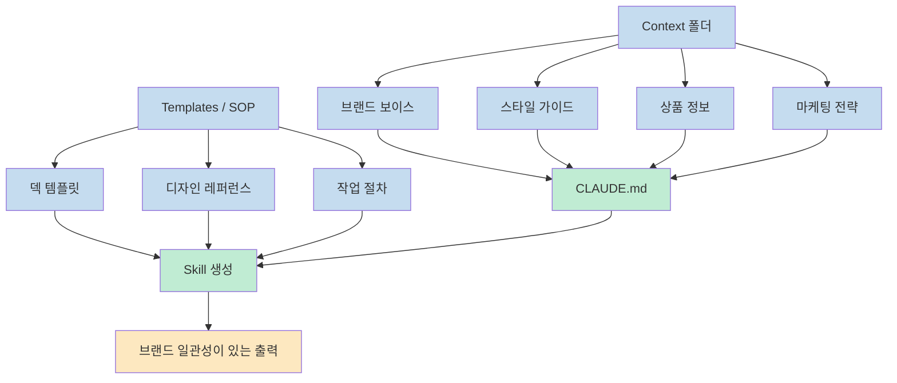
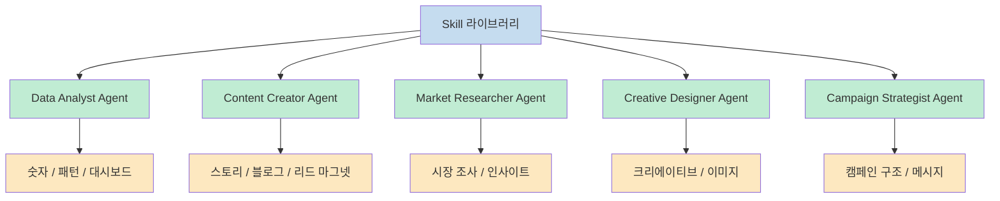
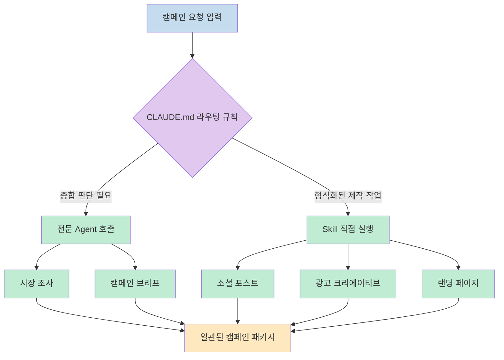
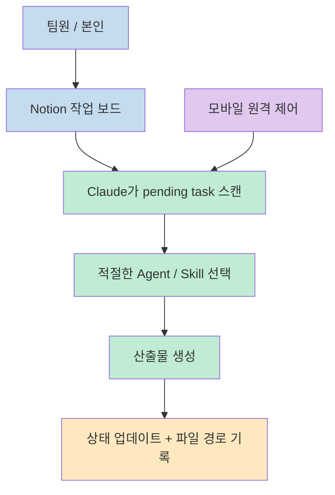

이 영상의 핵심은 Claude Code에 에이전트를 많이 만드는 법 자체보다, 마케팅 업무를 `skill -> agent -> team` 계층으로 조직하는 방법을 보여 준다는 데 있습니다. Grace Leung은 `Go Travel` 이라는 예시 브랜드를 두고, 반복 가능한 작업은 스킬로 만들고, 서로 다른 사고방식이 필요한 일만 에이전트로 분리한 뒤, 마지막에는 하나의 캠페인을 거의 자율적으로 굴리는 흐름까지 시연합니다 (근거: [t=5](https://youtu.be/yLXLHnD4fco?t=5), [t=128](https://youtu.be/yLXLHnD4fco?t=128), [t=491](https://youtu.be/yLXLHnD4fco?t=491), [t=766](https://youtu.be/yLXLHnD4fco?t=766)).

<!--more-->

## Sources

- https://www.youtube.com/watch?v=yLXLHnD4fco

## 1) 출발점은 "마케팅 업무 목록"을 먼저 나누는 것이다

발표자는 AI 마케팅 팀을 바로 에이전트 개수부터 설계하지 않습니다. 먼저 매주 반복되는 마케팅 업무를 적어 보고, 그중 재사용 가능한 워크플로우를 각각 하나의 스킬로 만든 다음, 비슷한 스킬을 겹치지 않는 역할로 묶어 에이전트로 올리라고 설명합니다. 다시 말해 이 영상이 제안하는 순서는 `사람처럼 팀을 먼저 상상` 하는 것이 아니라, `업무 단위 -> 스킬 -> 역할 -> 팀` 순서로 점층적으로 추상화를 올리는 방식입니다 (근거: [t=5](https://youtu.be/yLXLHnD4fco?t=5)).

이 프레임이 중요한 이유는, Claude에게 처음부터 "마케팅 총괄을 해 줘" 라고 던지면 역할이 지나치게 넓어지기 때문입니다. 반대로 반복 업무를 잘게 쪼개면 각 스킬의 입력과 산출물이 선명해지고, 에이전트는 그 스킬을 적절히 조합하는 상위 조정자로 바뀝니다. 발표자가 예시로 든 구성도 이 원리를 따릅니다. `Go Travel` 프로젝트 안에 총 5개 에이전트와 12개 스킬을 두고, 브랜드 특성에 따라 조정하되 설계 원리는 동일하다고 선을 긋습니다 (근거: [t=5](https://youtu.be/yLXLHnD4fco?t=5)).

또 하나 눈에 띄는 점은 비기술 직군도 따라 할 수 있도록 진입 장벽을 낮춘다는 점입니다. 발표자는 Claude Code를 데스크톱 탭, IDE, 터미널이라는 세 가지 진입 방식으로 설명하면서, 이번 영상에서는 파일과 폴더가 눈에 잘 보이는 VS Code 환경을 선택합니다. 즉 이 설계는 "엔지니어만 가능한 깊은 터미널 자동화" 보다는, 팀 운영 구조를 시각적으로 이해할 수 있는 워크스페이스 설계에 가깝습니다 (근거: [t=5](https://youtu.be/yLXLHnD4fco?t=5)).

---

## 2) 좋은 Skill은 프롬프트보다 컨텍스트와 레퍼런스에서 나온다

영상에서 가장 실무적인 대목은 프로젝트 폴더 구조를 잡는 방식입니다. 발표자는 마케팅 폴더 아래에 결과물이 쌓이는 작업 폴더와, 재사용 컨텍스트가 들어가는 시스템 폴더를 구분합니다. 특히 `context`, `SOP`, `templates` 같은 자산을 먼저 준비해서, 에이전트가 브랜드 보이스 가이드, 스타일 가이드, 상품 정보, 마케팅 전략을 이미 알고 있는 상태에서 일을 시작하게 해야 한다고 강조합니다. 이 관점에서는 스킬의 품질이 단순한 프롬프트 문장보다, **어떤 파일을 미리 읽히느냐** 에 더 크게 좌우됩니다 (근거: [t=128](https://youtu.be/yLXLHnD4fco?t=128)).

그래서 첫 단계도 바로 스킬 생성이 아니라 `CLAUDE.md` 초기화입니다. 발표자는 Claude에게 프로젝트 폴더를 스캔하게 해서 초안 `CLAUDE.md` 를 만들고, 이후 계속 업데이트해야 한다고 설명합니다. 이 파일은 한 번 쓰고 끝내는 지침문이 아니라, 프로젝트 전체 행동 규칙을 계속 누적하는 운영 문서로 다뤄집니다. 이 지점은 많은 사용자가 스킬만 모으는 데 집중하다가 놓치는 부분입니다. 스킬은 실행 단위이고, `CLAUDE.md` 는 그 실행 단위를 어떤 맥락에서 쓸지를 정의하는 상위 계약에 가깝습니다 (근거: [t=128](https://youtu.be/yLXLHnD4fco?t=128)).

첫 번째 예시 스킬은 브랜드 덱 제작입니다. 발표자는 기존 브랜드 슬라이드 템플릿과 그 템플릿 분석 보고서를 Claude에게 먼저 주고, 그다음 공식 PowerPoint 스킬을 확장해 자기 브랜드 전용 deck skill을 만듭니다. 여기서 핵심은 "좋은 결과물 예시" 와 "그 예시의 구조 분석" 을 함께 넣는다는 점입니다. 단순히 템플릿 파일만 주는 것이 아니라, 무엇이 좋은지에 대한 패턴 분석까지 같이 넣어야 스킬이 더 일관되게 작동한다는 뜻입니다. 실제 결과도 13장짜리 슬라이드 덱이 빠르게 생성되고, 여백이나 차트 같은 일부 디테일만 다듬으면 될 정도라고 평가합니다 (근거: [t=128](https://youtu.be/yLXLHnD4fco?t=128)).

두 번째 예시는 외부 도구와 연결되는 소셜 크리에이티브 스킬입니다. 이 경우에는 시각 레퍼런스를 모아 둔 스타일 라이브러리와 함께, 프로젝트 루트의 `.mcp.json` 파일에 이미지 생성용 MCP 서버를 연결합니다. 즉 텍스트 스킬과 달리, 이미지 스킬은 템플릿뿐 아니라 외부 생성 도구 연결까지 포함해야 합니다. 발표자가 강조하는 포인트는 "디자인을 그대로 복제하게 하는 것" 이 아니라, 레퍼런스의 분위기와 스타일 원칙을 학습시켜 새로운 크리에이티브를 뽑게 하는 것입니다 (근거: [t=128](https://youtu.be/yLXLHnD4fco?t=128)).

---

## 3) Agent는 Skill 묶음이 아니라 "사고방식이 다른 팀원" 이다

영상의 중간 지점부터 발표자는 더 많은 스킬을 한 대화에 계속 쌓아 넣으면 Claude의 집중력이 떨어진다고 말합니다. 한 사람이 동시에 writer, analyst, designer를 다 하려고 하면 산만해지는 것과 같다는 비유도 붙입니다. 그래서 이 시점부터 필요한 것이 에이전트, 즉 공식 표현으로는 sub-agent입니다. 여기서 정의가 명확합니다. **에이전트는 역할과 도구를 가진 전문 팀원** 이고, **스킬은 그 팀원이 필요할 때 꺼내 쓰는 공용 플레이북** 입니다 (근거: [t=491](https://youtu.be/yLXLHnD4fco?t=491)).

첫 번째 에이전트 예시는 데이터 분석가입니다. 발표자는 `Agents` 폴더 아래에 agent markdown 파일을 생성하고, 그 안에 역할, 사용할 스킬, 핵심 책임을 명시합니다. 이후 실제 캠페인 데이터셋을 넣고 이 에이전트를 호출하자, Claude는 캠페인 리포트와 대시보드를 생성합니다. 여기서 중요한 점은 이 에이전트가 단순히 표를 예쁘게 만드는 것이 아니라, 숫자·패턴·차트 중심으로 사고하는 전용 인지 프레임을 갖는다는 것입니다. 즉 에이전트의 가치는 "도구 호출 단축" 이 아니라, **어떤 관점으로 문제를 해석하느냐** 를 고정하는 데 있습니다 (근거: [t=491](https://youtu.be/yLXLHnD4fco?t=491)).

그 다음 예시는 콘텐츠 크리에이터 에이전트입니다. 이 에이전트는 블로그, 리드 마그넷, 키워드 리서치 등 여러 콘텐츠 생성 스킬을 묶어서, 숫자 분석가와는 다른 방향으로 사고합니다. 발표자는 같은 프로젝트 안에서도 데이터 분석가가 보는 세계와 콘텐츠 제작자가 보는 세계가 다르기 때문에, 이 둘을 하나의 범용 에이전트로 합치지 않는 것이 더 낫다고 보여 줍니다. 실제 데모에서는 블로그 글과 PDF 가이드가 함께 생성되며, 리드 마그넷 링크까지 연결되는 하나의 콘텐츠 패키지로 이어집니다 (근거: [t=491](https://youtu.be/yLXLHnD4fco?t=491)).

이후 비슷한 방식으로 market researcher, creative designer, campaign strategist까지 총 다섯 역할을 구성합니다. 여기서 발표자가 굳이 `non-overlapping agent roles` 를 강조한 이유가 드러납니다. 에이전트가 늘어날수록 중요한 것은 숫자가 아니라 경계입니다. 누가 어떤 종류의 문제를 맡는지 경계가 선명해야 Claude가 라우팅에서 망설이지 않고, 사람도 시스템을 유지보수하기 쉽습니다 (근거: [t=5](https://youtu.be/yLXLHnD4fco?t=5), [t=491](https://youtu.be/yLXLHnD4fco?t=491)).

---

## 4) 팀이 실제로 굴러가려면 `CLAUDE.md` 에 라우팅 규칙이 들어가야 한다

에이전트와 스킬을 많이 만들어도, Claude가 언제 누구를 불러야 하는지 모르면 시스템은 불안정해집니다. 그래서 발표자는 다섯 개 에이전트를 만든 뒤 `CLAUDE.md` 를 다시 업데이트해서 agent routing rules를 넣는 과정을 별도로 강조합니다. 즉 이 파일은 단순한 프로젝트 소개서가 아니라, "어떤 문제는 agent를 쓰고, 어떤 문제는 skill만으로 끝낸다" 는 운영 라우터 역할도 합니다 (근거: [t=766](https://youtu.be/yLXLHnD4fco?t=766)).

데모 과제는 일본 벚꽃 시즌 캠페인 출시입니다. 여기서 필요한 결과물은 시장 조사, 캠페인 브리프, 소셜 포스트, 랜딩 페이지, 광고 크리에이티브 같은 풀 패키지입니다. 발표자는 이 과제가 복잡하기 때문에 Claude가 스스로 agent와 skill의 사용 범위를 나눠야 한다고 설명합니다. 예를 들어 조사와 브리프처럼 여러 정보를 종합하고 판단해야 하는 단계는 agent가 유리하고, 특정 형식으로 결과물을 만드는 제작 단계는 executional하고 straightforward하므로 skill만으로도 충분하다고 구분합니다. 이 설명은 agent와 skill의 차이를 가장 실무적으로 드러내는 대목입니다 (근거: [t=766](https://youtu.be/yLXLHnD4fco?t=766)).

결과도 꽤 인상적입니다. 약 10분 안에 시장 조사, 타깃 고객 제안, `Sakura like a Local` 같은 태그라인이 포함된 캠페인 브리프, 소셜 포스트, 광고 이미지, 그리고 브랜드 톤에 맞는 랜딩 페이지까지 연결된 deliverable이 나옵니다. 여기서 중요한 것은 각 결과물이 따로 노는 것이 아니라, 하나의 캠페인 테마 안에서 메시지와 시각 요소가 맞물려 있다는 점입니다. 발표자는 이 연결성이 바로 팀 구조를 갖춘 시스템의 장점이라고 보여 줍니다 (근거: [t=766](https://youtu.be/yLXLHnD4fco?t=766)).

---

## 5) 마지막 단계는 생성이 아니라 운영이다: Notion 보드와 모바일 원격 제어

영상 후반부에서 흥미로운 전환이 일어납니다. 발표자는 "AI 마케팅 팀을 만들었다" 에서 멈추지 않고, 실제 팀원과 협업할 수 있는 운영 인터페이스를 붙입니다. 그 방법이 Notion 칸반 보드입니다. 우선순위, 작업 제목, 상세 설명, 상태가 있는 보드를 만들고, Claude에게 이 보드의 pending task를 스캔해서 적절한 agent를 배정하고 우선순위대로 실행하라고 지시합니다. 작업이 끝나면 보드 상태를 완료로 바꾸고 산출물 파일 경로까지 남깁니다. 이 구조는 AI를 채팅창 안의 도우미가 아니라, 팀 티켓 시스템에 연결된 실행 주체로 다루는 방식입니다 (근거: [t=912](https://youtu.be/yLXLHnD4fco?t=912)).

이 설계가 실용적인 이유는 사람 팀원과 AI 팀원이 동일한 작업 큐를 공유하게 만들기 때문입니다. 누군가는 보드에 일만 넣으면 되고, Claude는 그것을 읽어서 조사·디자인·콘텐츠 작성 같은 일을 처리합니다. 발표자가 보여 준 예시에서는 유럽 캠페인 런치 작업을 집어 와서 조사와 캐러셀 포스트 제작을 수행하고, 완료 후 결과물을 다시 검증합니다. 결국 이 시스템의 핵심은 좋은 프롬프트 한 번이 아니라, **일감 유입 -> 우선순위 결정 -> 담당 할당 -> 실행 -> 완료 표시** 의 운영 루프를 자동화하는 데 있습니다 (근거: [t=912](https://youtu.be/yLXLHnD4fco?t=912)).

마지막으로 모바일 원격 제어가 붙습니다. 발표자는 Claude Code의 로컬 세션을 휴대폰에서 원격으로 연결할 수 있다고 소개하며, remote control 링크를 통해 외부에서도 같은 세션에 태스크를 던질 수 있다고 보여 줍니다. 이 기능의 의미는 단순한 편의성보다 큽니다. 사무실 밖에서도 "작업 보드 확인해" 같은 명령을 보내면, 이미 로컬에서 준비된 컨텍스트와 스킬을 가진 세션이 그대로 이어서 작동하기 때문입니다. 다만 한 세션에 계속 쌓이는 컨텍스트 한계가 있으니, 필요하면 대화를 비워 다시 시작해야 한다는 제약도 함께 언급합니다 (근거: [t=912](https://youtu.be/yLXLHnD4fco?t=912)).

## 실전 적용 포인트

- 마케팅팀 자동화를 시작할 때는 에이전트 수를 먼저 정하지 말고, **매주 반복되는 작업 목록** 부터 적는 편이 훨씬 안정적입니다. 이 영상에서도 첫 출발점은 업무를 skill 단위로 쪼개는 일이었습니다 (근거: [t=5](https://youtu.be/yLXLHnD4fco?t=5)).
- Skill 품질은 화려한 프롬프트보다 **컨텍스트 파일과 레퍼런스 자산** 에 더 크게 좌우됩니다. 브랜드 보이스, 스타일 가이드, 상품 정보, SOP, 템플릿이 먼저 있어야 결과물 일관성이 올라갑니다 (근거: [t=128](https://youtu.be/yLXLHnD4fco?t=128)).
- Agent는 "스킬 모음집" 이 아니라, 서로 다른 판단 프레임을 가진 팀원으로 설계해야 합니다. 데이터 분석가와 콘텐츠 제작자를 하나로 뭉치면 Claude의 초점이 흐려질 가능성이 큽니다 (근거: [t=491](https://youtu.be/yLXLHnD4fco?t=491)).
- `CLAUDE.md` 에 라우팅 규칙을 써 두지 않으면 복잡한 요청에서 agent와 skill의 선택이 흔들릴 수 있습니다. 복잡한 종합 판단은 agent, 형식화된 제작은 skill이라는 구분을 먼저 명시하는 편이 좋습니다 (근거: [t=766](https://youtu.be/yLXLHnD4fco?t=766)).
- 운영 단계까지 가려면 채팅창 밖의 작업 큐가 필요합니다. 영상에서 보여 준 Notion 보드 방식은 AI를 실험용 데모가 아니라, 실제 팀의 백로그를 처리하는 실행 단위로 바꾸는 방법입니다 (근거: [t=912](https://youtu.be/yLXLHnD4fco?t=912)).

## 핵심 요약

- 이 영상은 Claude Code를 이용해 **5개 에이전트와 12개 스킬로 AI 마케팅 팀을 설계하는 방법** 을 보여 줍니다 (근거: [t=5](https://youtu.be/yLXLHnD4fco?t=5)).
- 핵심 설계 원리는 `반복 업무 -> skill -> non-overlapping agent roles -> team orchestration` 순서입니다 (근거: [t=5](https://youtu.be/yLXLHnD4fco?t=5), [t=491](https://youtu.be/yLXLHnD4fco?t=491)).
- 좋은 스킬은 한 줄 프롬프트보다, `CLAUDE.md`, 브랜드 컨텍스트, 템플릿, SOP, 외부 도구 연결 같은 **주변 구조** 에서 성능이 갈립니다 (근거: [t=128](https://youtu.be/yLXLHnD4fco?t=128)).
- Agent와 Skill의 경계를 명확히 하고 `CLAUDE.md` 에 라우팅 규칙을 써 두면, 복잡한 캠페인도 조사·브리프·콘텐츠·랜딩 페이지까지 하나의 일관된 패키지로 연결할 수 있습니다 (근거: [t=766](https://youtu.be/yLXLHnD4fco?t=766)).
- 최종적으로는 Notion 보드와 모바일 원격 제어까지 붙여, AI 팀을 실제 운영 체계 안으로 집어넣는 방향을 제시합니다 (근거: [t=912](https://youtu.be/yLXLHnD4fco?t=912)).

## 결론

이 영상을 보고 바로 가져갈 만한 교훈은 "에이전트를 많이 만들자" 가 아닙니다. 오히려 **반복되는 일을 어떻게 skill로 표준화하고, 어떤 종류의 사고만 agent에게 맡길지 경계를 세우자** 에 더 가깝습니다. Claude Code를 강력하게 만드는 것은 모델 자체보다도, 그 모델이 읽는 컨텍스트와 라우팅 규칙, 그리고 작업을 흘려보내는 운영 시스템이라는 점을 이 영상은 꽤 설득력 있게 보여 줍니다 (근거: [t=5](https://youtu.be/yLXLHnD4fco?t=5), [t=128](https://youtu.be/yLXLHnD4fco?t=128), [t=766](https://youtu.be/yLXLHnD4fco?t=766), [t=912](https://youtu.be/yLXLHnD4fco?t=912)).

특히 AI를 잘 쓰는 팀은 채팅창 안에서 똑똑한 답변을 받는 데서 끝나지 않습니다. 컨텍스트 자산을 쌓고, 역할을 나누고, 작업 큐를 연결하고, 원격으로 운영할 수 있게 만드는 쪽으로 시스템을 확장합니다. 이 영상이 보여 주는 진짜 메시지도 바로 그것입니다. Claude Code를 "잘 대답하는 도구" 로 쓰는 단계에서, "실제로 일을 처리하는 팀" 으로 올려 쓰는 단계로 넘어가라는 것입니다 (근거: [t=128](https://youtu.be/yLXLHnD4fco?t=128), [t=491](https://youtu.be/yLXLHnD4fco?t=491), [t=912](https://youtu.be/yLXLHnD4fco?t=912)).
