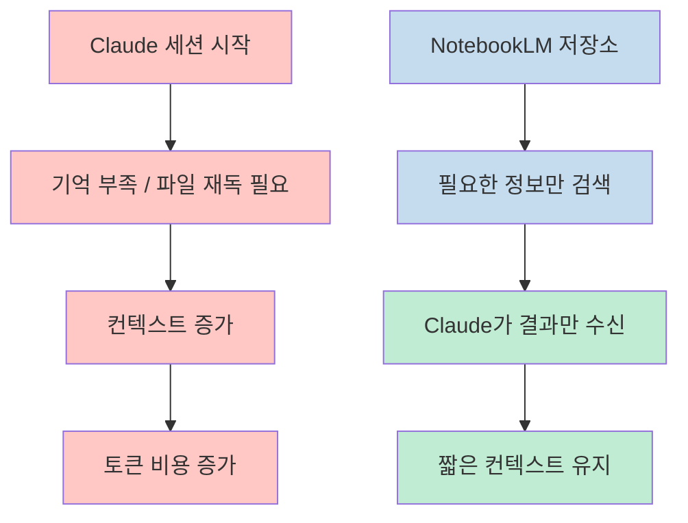
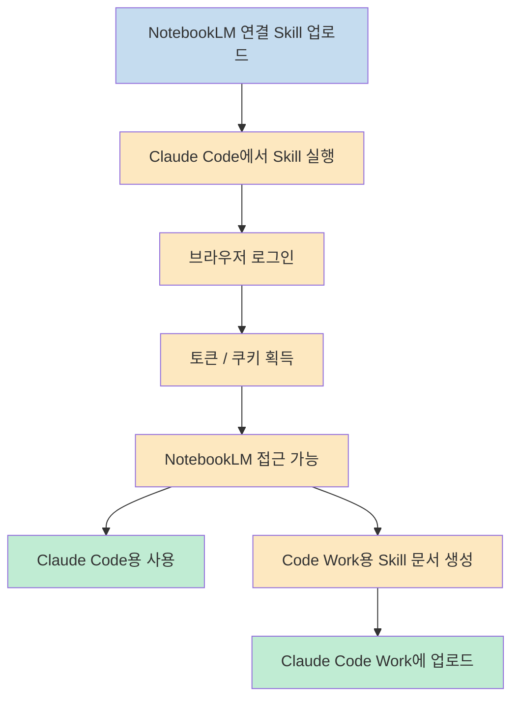
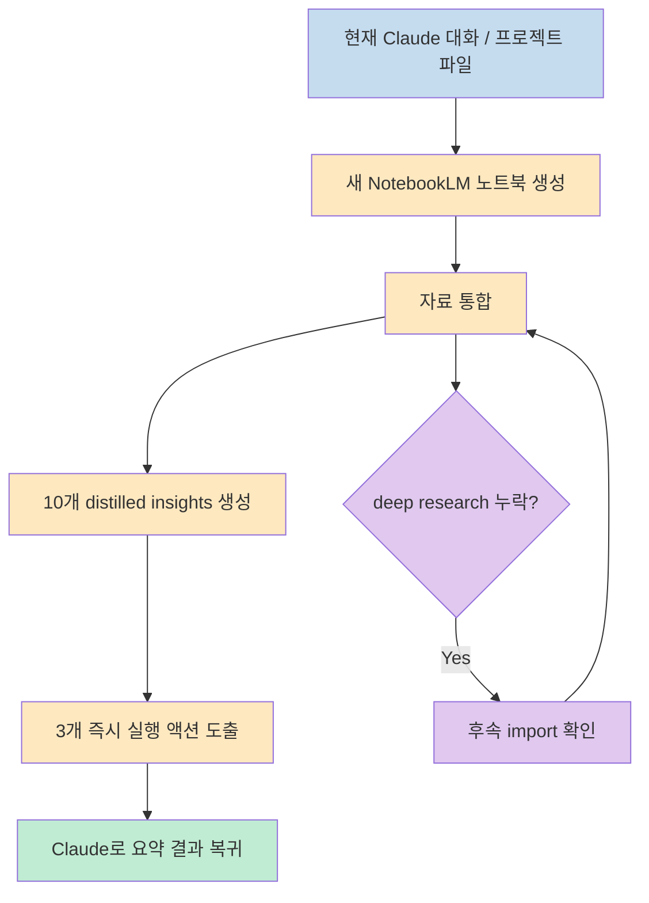
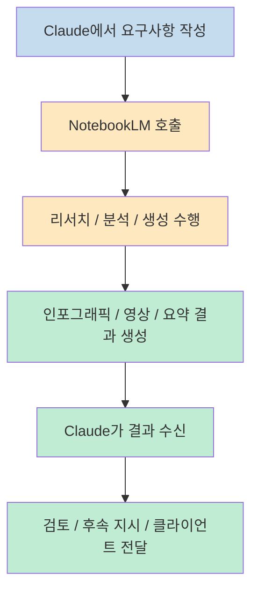
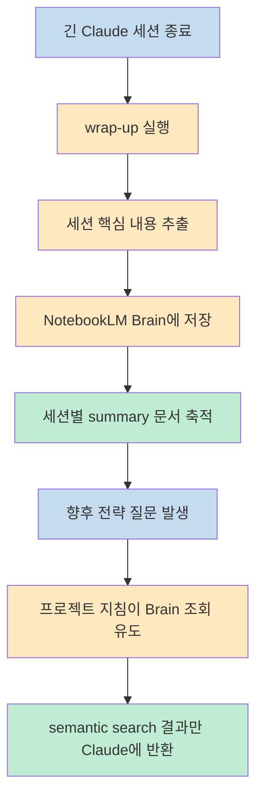

이 영상이 흥미로운 이유는 단순히 "Claude에 NotebookLM을 붙일 수 있다" 는 데 있지 않습니다. 발표자는 Claude의 짧은 세션 기억 문제를 NotebookLM의 RAG 기반 저장소로 우회하면서, 동시에 비용을 줄이고, 리서치·에셋 생성·세션 요약까지 하나의 워크플로우로 묶을 수 있다고 주장합니다. 즉 이 영상의 핵심은 메모리 기능 하나가 아니라, **Claude는 실행과 오케스트레이션을 맡고, NotebookLM은 장기 기억과 대규모 문맥 검색을 맡는 분업 구조** 에 있습니다 (근거: [t=4](https://youtu.be/6t32nPxeJb8?t=4), [t=211](https://youtu.be/6t32nPxeJb8?t=211), [t=913](https://youtu.be/6t32nPxeJb8?t=913)).

<!--more-->

## Sources

- https://www.youtube.com/watch?v=6t32nPxeJb8

## 1) 출발점은 Claude의 "세션성 기억" 한계를 NotebookLM으로 우회하는 것이다

발표자는 먼저 Claude의 가장 큰 약점으로 "amnesia" 를 듭니다. 세션을 새로 시작하면 다시 0에서 출발하는 느낌이 강하고, 필요한 맥락을 되살리려면 많은 파일을 다시 읽어야 하며, 그 과정이 곧 컨텍스트 증가와 비용 증가로 이어진다는 설명입니다. 이 문제 설정 위에 NotebookLM을 "항상 기억하는 시스템" 으로 올려놓고, Claude가 거기서 필요한 정보만 다시 가져오게 만드는 것이 전체 구조의 출발점입니다 (근거: [t=4](https://youtu.be/6t32nPxeJb8?t=4)).

이 설명에서 중요한 것은 발표자가 NotebookLM을 단순 문서 요약기가 아니라 **프로젝트 메모리 레이어** 로 다룬다는 점입니다. 그는 NotebookLM이 persistent project memory, personal CRM, decision journal, institutional knowledge, meeting intelligence 같은 역할을 할 수 있다고 말합니다. 즉 파일을 직접 다 읽어 재구성하는 방식보다, 프로젝트 결정과 배경을 미리 구조화해 둔 저장소에서 필요한 단위만 꺼내 오는 방식이 더 효율적이라는 주장입니다 (근거: [t=4](https://youtu.be/6t32nPxeJb8?t=4), [t=131](https://youtu.be/6t32nPxeJb8?t=131)).

여기서 발표자가 말하는 비용 절감 논리도 함께 봐야 합니다. 핵심은 모든 문맥을 Claude 컨텍스트 창에 계속 밀어 넣는 대신, NotebookLM이 외부에서 검색과 정리를 하고 Claude에는 필요한 결과만 가져온다는 점입니다. 이 구조가 성립하면 Claude는 거대한 원본 문서를 전부 들고 있을 필요가 없고, 그만큼 토큰 소모를 줄일 수 있습니다. 다만 이 수치는 발표자의 운영 경험에 근거한 주장이지 공식 벤치마크는 아니므로, 실제 절감 폭은 사용 패턴에 따라 달라질 수 있다고 읽는 편이 안전합니다 (근거: [t=4](https://youtu.be/6t32nPxeJb8?t=4), [t=430](https://youtu.be/6t32nPxeJb8?t=430)).

---

## 2) 연결 방식의 핵심은 공식 기능보다 "Skill + unofficial bridge" 에 가깝다

설치 과정도 흥미롭습니다. 발표자는 먼저 자신이 만든 `Claude NotebookLM skill` 파일을 Claude에 넣고 실행하게 합니다. 이 스킬은 NotebookLM과 연결하는 과정을 자동화하고, 필요하면 Claude Code Work 쪽에서도 재사용할 수 있도록 문서를 생성합니다. 즉 연결 방식의 진짜 핵심은 Claude가 기본적으로 NotebookLM을 네이티브 지원해서 붙는 것이 아니라, **스킬이 설치 절차와 연결 규칙을 대신 설명해 주는 래퍼 역할** 을 한다는 점입니다 (근거: [t=211](https://youtu.be/6t32nPxeJb8?t=211), [t=332](https://youtu.be/6t32nPxeJb8?t=332)).

여기서 발표자는 이 연결이 unofficial하다고 분명히 말합니다. 구체적으로는 누군가 만든 Python 스크립트를 GitHub 저장소에서 내려받아 인증을 돕고, 브라우저 로그인과 토큰/쿠키 획득을 통해 NotebookLM에 접근하는 구조라고 설명합니다. 따라서 이 방식은 편리하지만, 안정성과 지속성 면에서 공식 통합과는 다르게 봐야 합니다. 브라우저 인증 방식이나 외부 저장소 구조가 바뀌면 깨질 여지도 있다는 뜻입니다 (근거: [t=211](https://youtu.be/6t32nPxeJb8?t=211)).

연결이 끝나면 Claude 안에서 NotebookLM의 프로젝트 생성, 자산 생성, 질문, 조회 같은 작업을 수행할 수 있다고 시연합니다. 이어서 같은 연결을 Claude Code뿐 아니라 Claude Code Work에도 확장하는데, 이때 Claude Code가 Code Work용 skill 문서를 생성해 준다는 점이 실무적으로 재미있습니다. 즉 Code가 설치기이자 브리지 역할을 하고, Code Work는 그 결과물을 소비하는 프런트엔드처럼 쓰이는 구조입니다 (근거: [t=211](https://youtu.be/6t32nPxeJb8?t=211), [t=332](https://youtu.be/6t32nPxeJb8?t=332)).

---

## 3) 첫 번째 실전 패턴은 enrichment다: 프로젝트 전체를 NotebookLM에 넣고 다시 요약받는다

영상의 첫 번째 핵심 사용 사례는 발표자가 "enrichment" 라고 부르는 흐름입니다. Claude와 이미 나누고 있는 대화, 프로젝트 안의 파일, 추가 컨텍스트를 바탕으로 새 NotebookLM 노트북을 만들고, 그 전체 자료를 다시 분석해서 `10 distilled insights` 와 `3 core actions` 를 끌어오게 합니다. 여기서 포인트는 Claude가 혼자 계속 사고를 이어 가는 것이 아니라, **한 번 외부 기억 계층으로 보내 재정리한 뒤 그 결과를 다시 받아 오는 순환 구조** 를 만든다는 데 있습니다 (근거: [t=430](https://youtu.be/6t32nPxeJb8?t=430)).

발표자가 보여 준 장면에서는 70개가 넘는 리소스를 불러 와 유튜브 채널 전략, 최근 영상 성과, 커뮤니티 자료, 외부 리서치 등을 합쳐서 정제된 인사이트를 뽑아 냅니다. 이 방식의 장점은 Claude 세션 내부에서 긴 컨텍스트를 직접 소화하는 대신, NotebookLM이 먼저 문맥을 정리하고 Claude는 압축된 결과를 소비한다는 점입니다. 따라서 이 패턴은 길고 복잡한 프로젝트일수록 더 가치가 커집니다 (근거: [t=430](https://youtu.be/6t32nPxeJb8?t=430)).

다만 발표자도 한 가지 한계를 인정합니다. deep research 자료가 타임아웃 때문에 누락될 수 있고, 그 경우 후속 지시로 다시 import 여부를 확인해야 한다는 점입니다. 즉 이 워크플로우는 강력하지만 완전히 매끄러운 블랙박스는 아니며, 중간에 데이터가 실제로 모두 들어갔는지 한 번 더 확인하는 운영 습관이 필요합니다 (근거: [t=430](https://youtu.be/6t32nPxeJb8?t=430), [t=553](https://youtu.be/6t32nPxeJb8?t=553)).

---

## 4) 두 번째 패턴은 asset generation이다: Claude는 오케스트레이터, NotebookLM은 생산기

중반부에서 발표자는 이 연결을 단순 메모리 시스템이 아니라 **asset generation pipeline** 으로 확장합니다. 예를 들어 5단계 이메일 시퀀스를 설계한 뒤, 그 내용을 NotebookLM에서 인포그래픽으로 만들어 달라고 Claude에게 요청합니다. 발표자의 설명에 따르면 이때 Claude는 요구사항을 전달하고, NotebookLM이 실제 에셋을 생성한 다음, Claude는 다시 그 결과를 받아와 열어 주는 식으로 동작합니다 (근거: [t=430](https://youtu.be/6t32nPxeJb8?t=430), [t=553](https://youtu.be/6t32nPxeJb8?t=553)).

이 장면에서 발표자가 반복해서 강조하는 메시지는 "NotebookLM 쪽에서 처리하고 Claude는 다이아몬드만 받는다" 는 비유입니다. 즉 Claude 안에서 모든 걸 처리하려고 하지 말고, Google 쪽 시스템이 더 잘하는 리서치·정리·생성은 그쪽에 맡기고, Claude는 실제 워크플로우 오케스트레이션과 후속 행동 지시에 집중하라는 뜻입니다. 이것이 그가 말하는 비용 절감과 속도 향상의 핵심 메커니즘입니다 (근거: [t=553](https://youtu.be/6t32nPxeJb8?t=553)).

발표자는 이 구조를 이메일 인포그래픽에만 한정하지 않습니다. competitive intelligence, market synthesis, due diligence, literature review, trend spotting, client deliverable enrichment, SOP/playbook 생성 등으로 확장합니다. 여기서 중요한 건 NotebookLM이 단순한 자료 보관함이 아니라, **문서를 넣어 두고 나중에 읽는 저장소** 가 아니라 **질문에 따라 즉시 자산과 요약을 돌려주는 계산 레이어** 로 쓰인다는 점입니다 (근거: [t=553](https://youtu.be/6t32nPxeJb8?t=553)).

---

## 5) 마지막 퍼즐은 wrap-up skill이다: 세션을 NotebookLM에 적재해 "브레인" 으로 만든다

영상 후반부의 핵심은 두 번째 스킬, 즉 `wrap up` 패턴입니다. 이 스킬은 긴 Claude 세션이 끝난 뒤 대화 전체를 훑어 보고, 그 내용을 NotebookLM 안의 특정 브레인 노트북에 세션 요약 문서로 저장합니다. 발표자는 이를 `Jack's brain` 이라는 이름으로 시연하면서, 각 세션에서 나온 의사결정과 논의를 한곳에 축적해 두면 이후 어떤 프로젝트에서도 다시 호출할 수 있다고 설명합니다 (근거: [t=913](https://youtu.be/6t32nPxeJb8?t=913)).

이 방식의 본질은 대화 로그 자체를 다시 컨텍스트 창에 밀어 넣는 것이 아니라, 세션의 중요한 결정을 추려 문서화하고, 그 문서를 NotebookLM의 검색 가능한 기억 레이어에 넣는 것입니다. 그래서 다음 번에 Claude에게 전략 질문을 할 때, 일일이 예전 세션을 복사해 넣지 않고도 semantic search를 통해 관련 내용만 가져오게 할 수 있습니다. 발표자가 여기서 Harry Potter와 수백만 권의 책을 한 번에 읽는 비유를 쓰는 이유도 같습니다. 전체를 전부 들고 있지 말고, 필요한 부분만 정밀 검색해 오라는 것입니다 (근거: [t=913](https://youtu.be/6t32nPxeJb8?t=913)).

더 실무적인 포인트는 이걸 프로젝트 지침과 연결하는 방법입니다. 발표자는 프로젝트 instructions에 "전략 질문에 답할 때는 항상 Jack brain.md를 참고하라" 는 식의 규칙을 넣습니다. 이 한 줄이 들어가면 Claude는 전략성 질문마다 NotebookLM 쪽 장기 기억을 먼저 조회하는 습관을 갖게 됩니다. 결국 메모리 시스템은 저장만 잘한다고 완성되지 않고, **언제 그 기억을 조회할지에 대한 호출 규칙** 이 함께 있어야 실제 성능으로 이어진다는 뜻입니다 (근거: [t=913](https://youtu.be/6t32nPxeJb8?t=913)).

## 실전 적용 포인트

- 이 영상의 핵심은 NotebookLM을 그냥 참고자료 보관함으로 쓰는 것이 아니라, **Claude 바깥의 장기 기억 레이어** 로 쓰는 데 있습니다 (근거: [t=4](https://youtu.be/6t32nPxeJb8?t=4)).
- 공식 기능처럼 보이더라도 실제 연결은 unofficial bridge에 가깝기 때문에, 인증 방식과 GitHub 기반 스크립트에 의존한다는 점을 감안하고 써야 합니다 (근거: [t=211](https://youtu.be/6t32nPxeJb8?t=211)).
- enrichment 패턴은 장기 프로젝트나 복잡한 전략 작업에서 특히 유용합니다. 기존 대화와 프로젝트 자료를 한 번 NotebookLM로 보내 정리한 뒤, distilled insight만 다시 받는 방식이기 때문입니다 (근거: [t=430](https://youtu.be/6t32nPxeJb8?t=430)).
- asset generation 패턴은 Claude를 생산 엔진이 아니라 **오케스트레이터** 로 재배치합니다. 생성과 리서치는 외부 레이어에 맡기고 Claude는 요청과 후속 지시를 담당하게 됩니다 (근거: [t=553](https://youtu.be/6t32nPxeJb8?t=553)).
- wrap-up skill을 쓴다면 저장만 하지 말고, 프로젝트 instructions에 Brain 조회 규칙을 넣어야 실제로 메모리 시스템이 작동합니다 (근거: [t=913](https://youtu.be/6t32nPxeJb8?t=913)).

## 핵심 요약

- 발표자는 Claude의 세션성 기억 문제를 NotebookLM의 장기 기억 구조로 우회하자고 제안합니다 (근거: [t=4](https://youtu.be/6t32nPxeJb8?t=4)).
- 연결 방식은 공식 통합이라기보다, skill과 unofficial Python/GitHub bridge를 활용한 설치 자동화에 가깝습니다 (근거: [t=211](https://youtu.be/6t32nPxeJb8?t=211)).
- enrichment는 프로젝트 전체 문맥을 다시 정리해 distilled insight와 next action으로 돌려받는 패턴입니다 (근거: [t=430](https://youtu.be/6t32nPxeJb8?t=430)).
- asset generation은 NotebookLM을 리서치/생성 엔진으로, Claude를 오케스트레이터로 쓰는 구조입니다 (근거: [t=553](https://youtu.be/6t32nPxeJb8?t=553)).
- wrap-up skill과 Brain 조회 규칙을 조합하면, Claude 세션을 끊어 쓰더라도 축적된 판단을 장기적으로 재사용할 수 있습니다 (근거: [t=913](https://youtu.be/6t32nPxeJb8?t=913)).

## 결론

이 영상을 통해 얻을 수 있는 가장 큰 통찰은 "Claude 자체에 메모리를 더 많이 넣자" 가 아닙니다. 오히려 **메모리는 외부 검색 가능한 계층으로 분리하고, Claude는 그 계층을 지능적으로 호출하는 실행기처럼 쓰자** 에 더 가깝습니다. 발표자가 NotebookLM을 붙여 해결하려는 문제도 결국 같은 방향입니다. 컨텍스트 창을 무한정 키우는 대신, 세션 요약과 프로젝트 지식을 별도 레이어에 쌓아 두고 필요할 때만 호출하는 쪽이 더 지속 가능하다는 것입니다 (근거: [t=4](https://youtu.be/6t32nPxeJb8?t=4), [t=430](https://youtu.be/6t32nPxeJb8?t=430), [t=913](https://youtu.be/6t32nPxeJb8?t=913)).

실제로 따라 해 볼 때는 두 가지를 같이 기억하면 좋겠습니다. 첫째, 이 통합은 아직 unofficial 성격이 강하므로 설치 안정성을 계속 확인해야 합니다. 둘째, 진짜 효과는 NotebookLM을 연결하는 순간이 아니라, `enrichment -> asset generation -> wrap-up memory` 같은 운영 루프를 반복할 때 나옵니다. 결국 이 영상은 도구 소개 영상이면서도, 동시에 **AI 작업 메모리를 어떻게 분리 설계할 것인가** 에 대한 꽤 실전적인 설계 제안이라고 볼 수 있습니다 (근거: [t=211](https://youtu.be/6t32nPxeJb8?t=211), [t=553](https://youtu.be/6t32nPxeJb8?t=553), [t=913](https://youtu.be/6t32nPxeJb8?t=913)).
