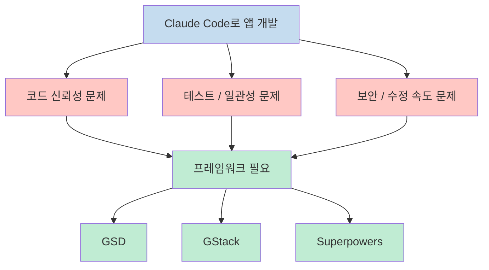
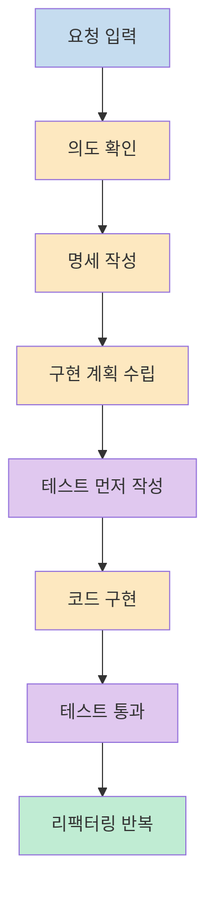
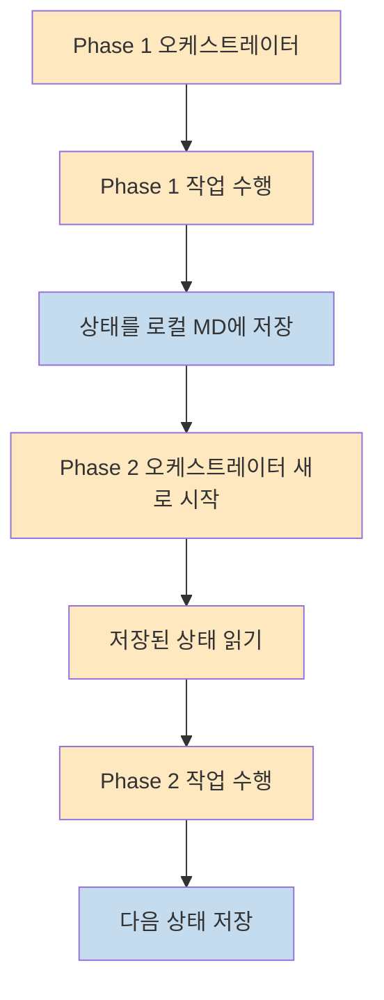
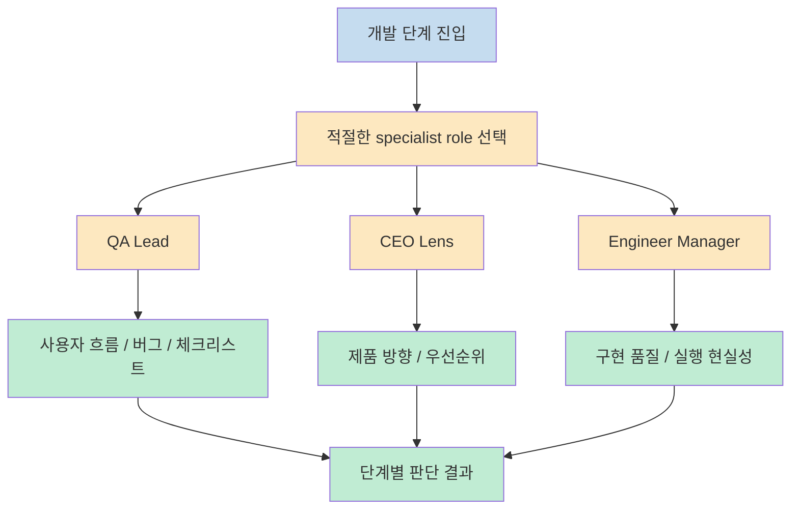
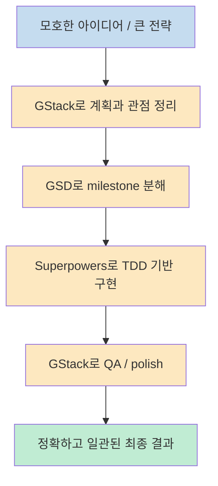

이 영상의 좋은 점은 `GSD`, `GStack`, `Superpowers` 를 단순히 "요즘 뜨는 Claude Code 프레임워크" 로 묶지 않는다는 데 있습니다. 발표자는 세 프레임워크가 같은 문제를 푸는 경쟁 관계가 아니라, **서로 다른 병목을 해결하려는 설계** 라고 설명합니다. 즉 어떤 것이 최고인가를 고르는 이야기라기보다, Claude Code의 정확도와 일관성을 떨어뜨리는 원인이 무엇이고 그 원인마다 어떤 프레임워크가 잘 맞는지를 구분해 보는 이야기입니다 (근거: [t=7](https://youtu.be/bzutStZJ1Ig?t=7), [t=113](https://youtu.be/bzutStZJ1Ig?t=113), [t=605](https://youtu.be/bzutStZJ1Ig?t=605)).

<!--more-->

## Sources

- https://youtu.be/bzutStZJ1Ig?si=F_UpBl7gOfU37JQi

## 1) 출발점은 "Claude가 코드를 만들 수 있느냐" 가 아니라 "믿을 수 있느냐" 다

발표자는 영상 시작부터 중요한 문제 설정을 던집니다. Claude Code가 앱 아이디어를 코드로 만들어 내는 능력 자체는 이미 충분히 강하지만, 정말 믿을 수 있는 코드인지, 자동화 테스트가 갖춰져 있는지, 일관된 출력을 내는지, 보안은 어떤지, 심지어 자기가 만든 버그를 스스로 고치는 시간이 오히려 더 오래 걸리는 건 아닌지가 더 중요하다는 것입니다. 즉 문제는 생성 능력의 부재가 아니라 **품질과 운영 안정성** 입니다 (근거: [t=0](https://youtu.be/bzutStZJ1Ig?t=0), [t=7](https://youtu.be/bzutStZJ1Ig?t=7)).

이 문제의식 위에서 발표자는 커뮤니티가 만든 세 가지 대표 프레임워크를 꺼냅니다. `GSD`, `GStack`, 그리고 `Superpowers` 입니다. 여기서 바로 핵심을 못 박습니다. 세 프레임워크는 같은 것을 두고 경쟁하는 게 아니라, **각각 프로세스 안의 서로 다른 문제를 푼다** 는 설명입니다. 그래서 이 영상을 이해하는 가장 좋은 방법은 "누가 더 센가" 보다 **어떤 병목에 어떤 틀이 맞는가** 를 보는 것입니다 (근거: [t=7](https://youtu.be/bzutStZJ1Ig?t=7)).

발표자의 메시지를 조금 더 풀면, Claude Code는 이미 강력하지만 강력함만으로는 부족하다는 것입니다. 실제 팀이나 프로젝트에서는 결과가 항상 같아야 하고, 테스트가 앞서야 하고, 세션이 길어질수록 품질이 무너지지 않아야 하며, 각 단계에서 누가 어떤 관점으로 검토하는지가 중요합니다. 결국 이 영상은 모델 소개보다 **AI 코딩 운영체계 소개** 에 가깝습니다 (근거: [t=0](https://youtu.be/bzutStZJ1Ig?t=0), [t=7](https://youtu.be/bzutStZJ1Ig?t=7)).

---

## 2) Superpowers는 프로세스를 제약한다: 계획, 테스트, 리팩터링 순서를 강제한다

발표자에 따르면 `Superpowers` 의 본질은 Claude에게 엄격한 소프트웨어 개발 방법론을 따르게 만드는 것입니다. 즉 Claude가 매번 다른 방식으로 즉흥적으로 코딩하지 않게 하고, 먼저 의도를 확인하고, 명세를 만들고, 구현 계획을 세우고, 특히 테스트 주도 접근을 따르게 만드는 프레임워크입니다. 그는 이걸 사실상 **에이전트가 따라야 할 개발 프로세스 템플릿** 으로 설명합니다 (근거: [t=113](https://youtu.be/bzutStZJ1Ig?t=113)).

여기서 핵심은 `test-driven` 흐름입니다. 발표자는 Superpowers가 먼저 소프트웨어가 어떻게 동작해야 하는지 테스트로 규칙을 세우고, 그다음 구현을 작성하게 하며, 테스트가 통과한 뒤에도 리팩터링을 반복한다고 말합니다. 즉 이 프레임워크가 제약하는 것은 모델의 성격이나 세션 크기가 아니라, **일을 처리하는 순서와 규율** 입니다. 정확도 향상의 원천도 모델 자체가 아니라 잘 정의된 절차에서 나옵니다 (근거: [t=113](https://youtu.be/bzutStZJ1Ig?t=113)).

이걸 실무적으로 해석하면 Superpowers는 "좋은 시니어 엔지니어처럼 일하는 Claude" 를 만들려는 시도에 가깝습니다. 브레인스토밍, 명세, 계획, 테스트, 구현, 리팩터링이 한 흐름으로 묶여 있기 때문에, 무언가를 빨리 만들어 내는 대신 **일관되게 검증 가능한 형태로 진척시키는 데 강점** 이 있습니다. 그래서 발표자도 뒤에서 Superpowers를 `senior engineer` 역할에 가까운 프레임워크로 재배치합니다 (근거: [t=113](https://youtu.be/bzutStZJ1Ig?t=113), [t=605](https://youtu.be/bzutStZJ1Ig?t=605)).

---

## 3) GSD는 컨텍스트를 제약한다: 세션을 50% 아래로 유지해 정확도를 지키려 한다

`GSD` 는 전혀 다른 병목을 겨냥합니다. 발표자는 이 프레임워크가 해결하려는 핵심 문제를 `context rot` 로 설명합니다. 처음 20% 정도는 잘 작동하던 대화가, 40%, 60%, 80%로 갈수록 품질이 급격히 떨어지는 현상입니다. GSD의 핵심 가정은 간단합니다. **컨텍스트 윈도우를 항상 50% 이하로 유지하면 정확도를 가장 안정적으로 유지할 수 있다** 는 것입니다 (근거: [t=230](https://youtu.be/bzutStZJ1Ig?t=230)).

그래서 GSD는 작업을 여러 단계로 쪼개고, 각 단계마다 다른 서브에이전트와 오케스트레이터를 사용합니다. 각 세션이 끝나면 상태를 `.md` 파일 형태로 로컬 디스크에 저장하고, 다음 세션은 그 상태를 읽어서 이어 갑니다. 이 구조의 중요한 점은 상태는 남기되, 오케스트레이터의 컨텍스트는 매 단계 새로 시작된다는 것입니다. 즉 이전의 긴 대화를 계속 끌고 가지 않고, **상태만 저장하고 실행 컨텍스트는 리셋** 하는 방식입니다 (근거: [t=230](https://youtu.be/bzutStZJ1Ig?t=230), [t=300](https://youtu.be/bzutStZJ1Ig?t=300)).

발표자는 Superpowers와의 차이도 여기서 분명히 합니다. Superpowers 역시 여러 단계와 서브에이전트를 사용하지만, 전체를 통제하는 메가 오케스트레이터는 계속 같은 대화 안에 남아 있습니다. 반면 GSD는 단계가 바뀔 때 오케스트레이터도 새로 바뀝니다. 즉 하나는 **프로세스는 구조화하지만 메인 컨텍스트는 이어 가는 방식** 이고, 다른 하나는 **상태는 저장하되 메인 컨텍스트 자체를 끊어 가는 방식** 입니다 (근거: [t=300](https://youtu.be/bzutStZJ1Ig?t=300)).

그래서 GSD를 한 문장으로 줄이면, **장기 프로젝트를 여러 짧고 정확한 세션으로 쪼개는 프로젝트 매니저형 프레임워크** 라고 볼 수 있습니다. 발표자도 마지막에 GSD를 `project manager` 에 가까운 역할로 정리합니다 (근거: [t=605](https://youtu.be/bzutStZJ1Ig?t=605)).

---

## 4) GStack은 관점을 제약한다: 하나의 범용 에이전트 대신 specialist role을 쓴다

`GStack` 이 푸는 문제는 프로세스도, 컨텍스트도 아닙니다. 발표자에 따르면 GStack의 미션은 **단일 범용 에이전트를 여러 specialist role로 분해하는 것** 입니다. 하나의 general agent가 모든 걸 다 하게 두는 대신, CEO, engineer manager, designer, release engineer 같은 역할을 두고 단계마다 해당 역할을 호출합니다. 즉 GStack은 같은 개발 과정이라도 어떤 렌즈로 보느냐를 바꾸는 프레임워크입니다 (근거: [t=360](https://youtu.be/bzutStZJ1Ig?t=360)).

이 대목에서 발표자는 Superpowers와의 차이도 짚습니다. Superpowers도 브레인스토밍, 계획, 실행 같은 단계는 있지만, 결국 하나의 disciplined engineer가 개발 방법론을 따르는 구조에 가깝습니다. 반면 GStack은 QA lead가 실제 사용자 흐름과 체크리스트만 보고, CEO role이 제품 방향성만 보고, 다른 역할은 또 그 책임에 맞는 관점만 보는 식으로, **관점의 분업 자체가 설계의 핵심** 입니다 (근거: [t=360](https://youtu.be/bzutStZJ1Ig?t=360), [t=450](https://youtu.be/bzutStZJ1Ig?t=450)).

발표자는 GStack이 단순 role prompt가 아니라고도 설명합니다. 그는 다섯 가지 레이어를 언급하는데, 역할 집중, 이전 단계 결과 위에 쌓이는 데이터 흐름, 각 역할의 체크리스트 기반 품질 관리, 자기 역할 범위를 넘지 않는 `boil the lake` 식 책임 한정, 그리고 결과를 단순하게 요약하는 방식이 그것입니다. 요지는 GStack이 "QA처럼 행동해" 수준의 프롬프트가 아니라, **역할이 깨지지 않도록 운영 규칙을 여러 겹으로 쌓아 놓은 시스템** 이라는 것입니다 (근거: [t=450](https://youtu.be/bzutStZJ1Ig?t=450)).

그래서 발표자는 GStack을 최종적으로 `planning` 과 `QA/polish` 쪽에서 강한 프레임워크로 배치합니다. 특히 다양한 관점이 필요한 큰 아이디어 검토나, UI를 실제로 클릭해 보는 QA 쪽에 잘 맞는다고 설명합니다 (근거: [t=605](https://youtu.be/bzutStZJ1Ig?t=605)).

---

## 5) 진짜 포인트는 하나를 고르는 게 아니라, 세 가지를 서로 다른 단계에 배치하는 것이다

영상의 결론은 세 프레임워크 중 하나를 승자로 고르는 방식이 아닙니다. 발표자는 오히려 이 셋을 조합해 `power stack` 으로 쓸 수 있다고 말합니다. 그의 제안은 대략 이렇습니다. 큰 방향성과 전략 계획은 관점이 풍부한 `GStack` 으로 다듬고, 그 계획을 실제 작업 가능한 milestone으로 분해하는 것은 컨텍스트 보호에 강한 `GSD` 로 맡기고, 각 milestone의 실제 구현은 테스트 주도 개발에 강한 `Superpowers` 로 실행하는 것입니다. 마지막 QA와 폴리싱은 다시 GStack으로 가져옵니다 (근거: [t=605](https://youtu.be/bzutStZJ1Ig?t=605)).

이 조합이 설득력 있는 이유는 각 프레임워크의 강점을 자연스럽게 재배치하기 때문입니다. GStack은 다양한 렌즈로 프로젝트를 바라보는 데 유리하고, GSD는 긴 여정을 안전하게 작은 단위로 쪼개는 데 강하고, Superpowers는 실제 구현을 검증 가능한 절차 안에서 밀어붙이는 데 강합니다. 다시 말해 셋은 대체재가 아니라 **계획-분해-실행-검수** 파이프라인의 서로 다른 부위를 담당할 수 있습니다 (근거: [t=605](https://youtu.be/bzutStZJ1Ig?t=605)).

결국 이 영상의 실전적인 교훈은 아주 단순합니다. 프레임워크를 브랜드처럼 소비하지 말고, **지금 내 워크플로우에서 모자란 게 프로세스인지, 컨텍스트인지, 관점인지** 먼저 보라는 것입니다. 그래야 세 가지를 섞어 쓸 때도 무엇을 왜 가져오는지 분명해집니다 (근거: [t=605](https://youtu.be/bzutStZJ1Ig?t=605)).

## 실전 적용 포인트

- `Superpowers` 는 개발 프로세스를 제약하는 프레임워크로 보는 것이 가장 정확합니다. 의도 확인, 명세, 테스트 우선, 구현, 리팩터링 순서를 강제합니다 (근거: [t=113](https://youtu.be/bzutStZJ1Ig?t=113)).
- `GSD` 는 컨텍스트를 제약합니다. 상태는 저장하되 오케스트레이터를 단계마다 새로 시작해 긴 세션에서 오는 정확도 저하를 줄이려 합니다 (근거: [t=230](https://youtu.be/bzutStZJ1Ig?t=230), [t=300](https://youtu.be/bzutStZJ1Ig?t=300)).
- `GStack` 은 관점을 제약합니다. 하나의 범용 에이전트 대신 specialist role이 각 단계의 다른 렌즈를 담당합니다 (근거: [t=360](https://youtu.be/bzutStZJ1Ig?t=360), [t=450](https://youtu.be/bzutStZJ1Ig?t=450)).
- 세 프레임워크는 경쟁 관계보다 상호보완 관계로 보는 편이 실무적으로 더 유용합니다 (근거: [t=605](https://youtu.be/bzutStZJ1Ig?t=605)).
- 결국 중요한 건 "무슨 프레임워크가 더 유명한가" 가 아니라, 현재 내 프로젝트의 병목이 무엇인가를 먼저 진단하는 것입니다 (근거: [t=7](https://youtu.be/bzutStZJ1Ig?t=7), [t=605](https://youtu.be/bzutStZJ1Ig?t=605)).

## 핵심 요약

- 이 영상은 Claude Code 정확도를 높이려는 세 가지 커뮤니티 프레임워크를 비교합니다: `Superpowers`, `GSD`, `GStack` (근거: [t=7](https://youtu.be/bzutStZJ1Ig?t=7)).
- `Superpowers` 는 프로세스를 제약하고, `GSD` 는 컨텍스트를 제약하고, `GStack` 은 관점을 제약합니다 (근거: [t=113](https://youtu.be/bzutStZJ1Ig?t=113), [t=230](https://youtu.be/bzutStZJ1Ig?t=230), [t=360](https://youtu.be/bzutStZJ1Ig?t=360)).
- 그래서 셋은 서로 같은 자리를 두고 경쟁하는 것이 아니라, 개발 파이프라인의 서로 다른 병목을 줄이는 데 적합합니다 (근거: [t=605](https://youtu.be/bzutStZJ1Ig?t=605)).
- 계획과 QA는 GStack, milestone 분해는 GSD, 구현은 Superpowers라는 조합이 영상의 핵심 제안입니다 (근거: [t=605](https://youtu.be/bzutStZJ1Ig?t=605)).
- 실제로는 유행하는 이름을 좇기보다, 내 워크플로우에서 무엇이 부족한지 먼저 보는 편이 더 중요합니다 (근거: [t=605](https://youtu.be/bzutStZJ1Ig?t=605)).

## 결론

이 영상을 보고 나면 세 프레임워크를 바라보는 시선이 조금 달라집니다. `GSD vs GStack vs Superpowers` 같은 비교표를 보며 하나를 고르는 문제가 아니라, **내 개발 워크플로우에서 정확도를 깎아먹는 원인이 어디에 있느냐** 를 먼저 봐야 한다는 점이 더 중요해집니다. 프로세스가 흔들리면 Superpowers가, 세션이 길어져 무너지면 GSD가, 역할과 관점이 뒤섞이면 GStack이 더 잘 맞을 수 있습니다 (근거: [t=113](https://youtu.be/bzutStZJ1Ig?t=113), [t=230](https://youtu.be/bzutStZJ1Ig?t=230), [t=360](https://youtu.be/bzutStZJ1Ig?t=360)).

결국 Claude Code를 잘 쓰는 사람은 프레임워크 이름을 많이 아는 사람이 아니라, 각 프레임워크가 **무엇을 제약하고 무엇을 안정화하는지** 이해한 뒤 자기 프로젝트에 맞게 배치할 줄 아는 사람일 겁니다. 이 영상은 바로 그 관점을 꽤 명확하게 정리해 주는 영상입니다 (근거: [t=605](https://youtu.be/bzutStZJ1Ig?t=605)).
