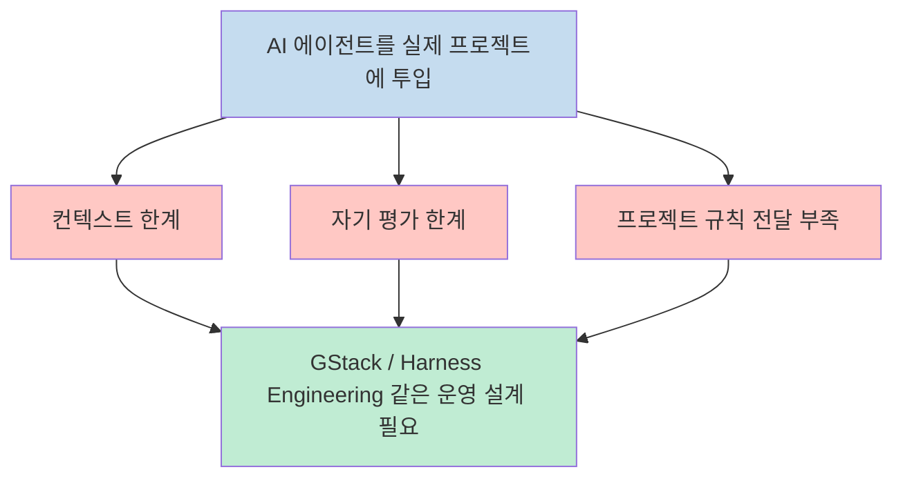
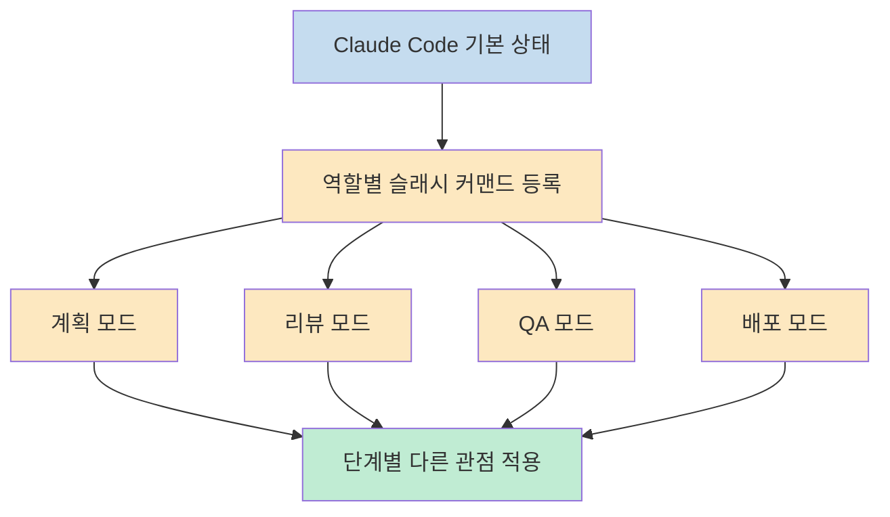
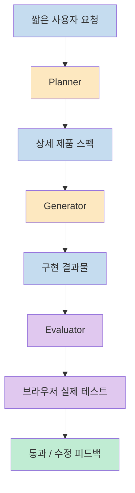
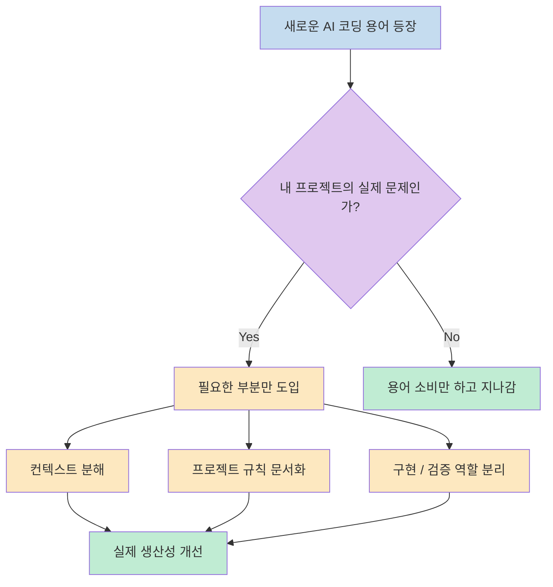

이 영상의 핵심은 `GStack` 이나 `Harness Engineering` 이라는 이름 자체를 외우는 데 있지 않습니다. 발표자는 두 개념 모두 결국 **AI 에이전트를 실제 프로젝트에 투입할 때 반복해서 부딪히는 문제**, 즉 컨텍스트 한계, 자기 평가의 부정확함, 프로젝트 규칙 전달 부족을 해결하려는 시도라고 설명합니다. 그래서 이 글도 용어 소개보다, 각 방식이 어떤 문제를 겨냥하고 어떤 식으로 풀려 하는지에 초점을 맞춰 정리해 보겠습니다 (근거: [t=18](https://youtu.be/OvZiSEZpzxs?t=18), [t=78](https://youtu.be/OvZiSEZpzxs?t=78), [t=270](https://youtu.be/OvZiSEZpzxs?t=270)).

<!--more-->

## Sources

- https://youtu.be/OvZiSEZpzxs?si=xCQeRZfqffTovT8F

## 1) 두 용어의 출발점은 같고, 둘 다 "AI를 더 잘 일하게 만드는 운영 설계" 다

발표자는 영상 초반에 최근 AI 코딩에서 두 가지가 화제라고 정리합니다. 하나는 YC CEO 게리 탄이 공개한 Claude Code 세팅인 GStack이고, 다른 하나는 미첼 하시모토가 이름을 붙인 Harness Engineering입니다. 그는 GStack 저장소가 큰 주목을 받았고, Harness Engineering 역시 OpenAI와 Anthropic 사례가 나오면서 빠르게 퍼졌다고 설명합니다. 하지만 여기서 더 중요한 문장은 따로 있습니다. 발표자는 **GStack도 결국 Harness Engineering의 한 예시** 라고 말합니다. 즉 둘을 서로 전혀 다른 종파처럼 볼 필요는 없다는 뜻입니다 (근거: [t=18](https://youtu.be/OvZiSEZpzxs?t=18), [t=40](https://youtu.be/OvZiSEZpzxs?t=40), [t=64](https://youtu.be/OvZiSEZpzxs?t=64)).

이 관점이 중요한 이유는, 이름이 달라도 실제로 겨냥하는 문제는 거의 같기 때문입니다. 발표자는 세 가지를 핵심 문제로 꼽습니다. 첫째는 프로젝트가 커질수록 AI가 앞선 작업을 잊거나 일관성을 잃는 **컨텍스트 한계** 입니다. 둘째는 AI가 자기 결과물을 검토할 때 지나치게 낙관적인 판단을 내리는 **자기 평가의 한계** 입니다. 셋째는 프로젝트 안에서 쓰는 패턴, 라이브러리 사용법, 팀 규칙 같은 **안목과 규칙 전달의 한계** 입니다. 이 세 가지가 실제로 존재하는 문제이고, GStack과 Harness Engineering은 이를 각자 다른 방식으로 다루려는 설계라는 설명입니다 (근거: [t=78](https://youtu.be/OvZiSEZpzxs?t=78)).

즉 이 영상이 주는 첫 번째 메시지는, 새로운 용어가 나올 때마다 "또 새로운 비법이 나왔다" 고 보기보다, **이게 실제로 무슨 문제를 해결하려고 나온 건가** 를 먼저 보라는 것입니다. 이후 설명도 전부 이 프레임 위에서 이어집니다 (근거: [t=18](https://youtu.be/OvZiSEZpzxs?t=18), [t=78](https://youtu.be/OvZiSEZpzxs?t=78), [t=502](https://youtu.be/OvZiSEZpzxs?t=502)).

---

## 2) GStack의 핵심은 역할 분리다: 하나의 범용 Claude 대신 단계별 전문가를 만든다

발표자에 따르면 GStack의 핵심 접근은 **역할 분리** 입니다. Claude Code를 하나의 범용 어시스턴트처럼 계속 쓰는 대신, 계획, 리뷰, QA, 배포 같은 상황마다 다른 전문가적 관점을 활성화하는 방식입니다. 그는 게리 탄의 표현을 빌려 "계획은 리뷰와 다르고, 리뷰는 배포와 다르다" 고 설명합니다. 즉 각 단계에는 각기 다른 기어가 필요하고, GStack의 슬래시 커맨드는 그 기어를 빠르게 바꿔 끼우는 장치라는 뜻입니다 (근거: [t=154](https://youtu.be/OvZiSEZpzxs?t=154)).

영상에서 든 예시도 이 논리를 잘 보여 줍니다. `plan CEO review` 는 CEO 관점에서 제품 방향성을 검증하고, `review` 는 프로덕션에서 터질 수 있는 버그를 찾고, `QA` 는 실제 브라우저를 열어 앱을 클릭하며 테스트하고, 다른 커맨드는 테스트 실행과 PR 생성까지 처리합니다. 그러니까 GStack은 새로운 모델을 발명한 것이 아니라, Claude에게 **지금은 어떤 역할로 일해야 하는지** 를 마크다운 기반 스킬/커맨드로 명확히 주입하는 운영 패키지에 가깝습니다 (근거: [t=154](https://youtu.be/OvZiSEZpzxs?t=154), [t=198](https://youtu.be/OvZiSEZpzxs?t=198)).

설치 과정도 비교적 단순하게 설명됩니다. Claude Code, git, Bun 런타임을 준비한 뒤 명령어 하나로 저장소를 내려받고 셋업 스크립트를 실행해 슬래시 커맨드를 등록합니다. 그리고 `CLAUDE.md` 에 GStack 섹션을 추가하면 바로 사용할 수 있다고 보여 줍니다. 다만 발표자는 여기서 중요한 단서를 붙입니다. 설치했다고 해서 바로 극적인 변화가 생기지는 않으며, 결국 이건 도구이기 때문에 **자기 프로젝트에 맞게 써야 효과가 난다** 는 점입니다 (근거: [t=198](https://youtu.be/OvZiSEZpzxs?t=198), [t=246](https://youtu.be/OvZiSEZpzxs?t=246)).

이 설명을 기술적으로 다시 풀면, GStack의 본질은 화려한 자동화라기보다 **마크다운 기반 역할 프롬프트를 표준화한 패키지** 입니다. 발표자도 본질적으로는 잘 패키징된 워크플로우 모음이라고 정리합니다. 그래서 GStack의 가치는 "완전히 새로운 원리" 보다도, 많은 사람들이 이미 감각적으로 하던 역할 분리를 재사용 가능한 형태로 묶어 줬다는 데 있습니다 (근거: [t=246](https://youtu.be/OvZiSEZpzxs?t=246), [t=502](https://youtu.be/OvZiSEZpzxs?t=502)).

---

## 3) Harness Engineering의 핵심은 검증 구조다: 만드는 에이전트와 보는 에이전트를 분리한다

Harness Engineering 쪽 설명에서는 발표자가 Anthropic 사례를 중심으로 구조를 풀어냅니다. 여기서 핵심은 AI가 장시간 자율적으로 앱을 만들 때 두 가지 근본적 문제가 드러난다는 점입니다. 하나는 시간이 길어질수록 모델이 일관성을 잃고, 심하면 컨텍스트가 차는 걸 감지해 서둘러 끝내려는 경향까지 보인다는 것입니다. 그는 이를 Anthropic이 `context anxiety` 라고 부른다고 소개합니다. 다른 하나는 AI가 자기가 만든 결과를 평가할 때 품질이 떨어져도 자신 있게 잘 만들었다고 말하는 자기 평가 한계입니다 (근거: [t=270](https://youtu.be/OvZiSEZpzxs?t=270)).

그래서 Harness의 핵심 설계는 **만드는 에이전트와 검증하는 에이전트를 구조적으로 분리하는 것** 입니다. 발표자는 이를 planner, generator, evaluator 세 가지로 설명합니다. planner는 짧은 프롬프트를 상세한 제품 스펙으로 확장하고, generator는 그 스펙을 기반으로 구현을 만들고, evaluator는 완성된 앱을 실제 브라우저에서 직접 클릭하며 테스트합니다. 즉 스스로 만들고 스스로 칭찬하는 닫힌 구조를 깨고, 계획·생성·검증을 분리된 단계로 재조립한 것입니다 (근거: [t=320](https://youtu.be/OvZiSEZpzxs?t=320)).

성과 비교도 인상적입니다. 발표자는 단독 에이전트에게 2D 레트로 게임 메이커를 맡겼을 때는 핵심 기능이 동작하지 않았고, Harness를 적용했을 때는 비용과 시간은 더 들었지만 실제로 플레이 가능한 결과물이 나왔다고 소개합니다. 이 사례가 말해 주는 건 단순히 "더 비싸게 돌리면 된다" 가 아니라, **좋은 결과는 더 강한 모델 하나에서만 나오는 것이 아니라, 올바른 검증 구조에서도 나온다** 는 점입니다 (근거: [t=352](https://youtu.be/OvZiSEZpzxs?t=352)).

여기서 더 흥미로운 부분은, 좋은 모델이 나오자 오히려 Harness를 단순화했다는 설명입니다. 발표자는 Anthropic 팀이 Opus 4.1 이후 더 좋은 모델이 나오자 스프린트 분해 구조 같은 통제를 제거했다고 전합니다. 이 말은 곧 Harness가 고정된 성전이 아니라, **현재 모델이 혼자 못하는 부분만 채워 주는 가변적 설계** 라는 뜻입니다. 모델이 좋아지면 하네스도 다시 단순해질 수 있다는 이야기입니다 (근거: [t=410](https://youtu.be/OvZiSEZpzxs?t=410)).

---

## 4) 둘 다 유용하지만, 과장된 이름보다 "내 문제에 필요한 부분만 가져오기" 가 더 중요하다

영상 후반부는 기술 소개보다 메타 비평에 가깝습니다. 발표자는 GStack이 왜 사랑과 증오를 동시에 받는지, 그리고 Harness Engineering이 새 개념처럼 포장되지만 사실 기존 프롬프트/컨텍스트/환경 설계의 연장선으로도 볼 수 있다는 반응들을 소개합니다. 그는 이 비판에 일정 부분 공감한다고 말하면서, 기술 자체를 부정하는 것이 아니라 **용어 중심의 뽐모와 불안 마케팅이 과해질 수 있다** 는 문제를 짚습니다 (근거: [t=470](https://youtu.be/OvZiSEZpzxs?t=470)).

그렇다고 발표자가 두 접근을 부정하는 것은 아닙니다. 오히려 둘 다 실제 문제를 해결하고 잘 쓰면 효과가 있다고 명확히 말합니다. 다만 적용한다고 해서 결과가 180도 달라지는 마법은 아니고, 현재 모델 자체가 이미 상당히 강하기 때문에 많은 경우 차이는 모델의 순수 능력보다 **우리가 AI를 어떻게 활용하고 구조화하느냐** 에서 나온다고 설명합니다 (근거: [t=502](https://youtu.be/OvZiSEZpzxs?t=502)).

그래서 발표자가 제안하는 실전 접근은 꽤 현실적입니다. 컨텍스트 관리가 문제라면 작업을 기능 단위로 쪼개고, AI가 프로젝트 규칙을 몰라 엉뚱한 코드를 만든다면 파일에 적어서 알려 주고, 자기 코드를 스스로 검증하지 못한다면 구현 에이전트와 검증 에이전트를 분리하라는 것입니다. 즉 GStack의 모든 커맨드를 다 깔고 쓸 필요도 없고, Harness 전체 체계를 처음부터 만들 필요도 없으며, **내 프로젝트에서 실제로 막히는 지점에만 필요한 구조를 가져다 쓰면 된다** 는 결론입니다 (근거: [t=540](https://youtu.be/OvZiSEZpzxs?t=540)).

## 실전 적용 포인트

- `GStack` 과 `Harness Engineering` 은 서로 완전히 다른 진영이라기보다, 둘 다 **AI 코딩 작업을 더 안정적으로 만들기 위한 운영 설계** 로 보는 편이 맞습니다 (근거: [t=18](https://youtu.be/OvZiSEZpzxs?t=18), [t=64](https://youtu.be/OvZiSEZpzxs?t=64)).
- GStack의 본질은 역할 분리입니다. 계획, 리뷰, QA, 배포를 다른 관점의 전문가처럼 다루는 것이 핵심입니다 (근거: [t=154](https://youtu.be/OvZiSEZpzxs?t=154)).
- Harness Engineering의 본질은 검증 구조입니다. planner, generator, evaluator를 분리해 자기 평가의 한계를 우회합니다 (근거: [t=320](https://youtu.be/OvZiSEZpzxs?t=320)).
- 좋은 하네스는 무조건 복잡할 필요가 없습니다. 모델이 좋아지면 오히려 통제를 줄이고 더 단순한 구조가 맞을 수도 있습니다 (근거: [t=410](https://youtu.be/OvZiSEZpzxs?t=410)).
- 결국 중요한 건 새로운 용어를 빠르게 좇는 것이 아니라, **내 프로젝트에서 실제로 반복되는 실패 지점이 무엇인지** 먼저 파악하는 것입니다 (근거: [t=540](https://youtu.be/OvZiSEZpzxs?t=540)).

## 핵심 요약

- 발표자는 GStack과 Harness Engineering 모두 AI 코딩에서 부딪히는 공통 문제를 풀기 위한 시도라고 설명합니다 (근거: [t=78](https://youtu.be/OvZiSEZpzxs?t=78)).
- GStack은 Claude Code를 역할별 전문가 모드처럼 다루게 만드는 워크플로우 패키지에 가깝습니다 (근거: [t=154](https://youtu.be/OvZiSEZpzxs?t=154), [t=246](https://youtu.be/OvZiSEZpzxs?t=246)).
- Harness Engineering은 만드는 에이전트와 검증하는 에이전트를 분리해 품질을 높이는 설계입니다 (근거: [t=320](https://youtu.be/OvZiSEZpzxs?t=320), [t=352](https://youtu.be/OvZiSEZpzxs?t=352)).
- 두 접근 모두 효과는 있지만, 그것만으로 결과가 마법처럼 바뀌는 것은 아니며 결국 활용 방식이 더 중요합니다 (근거: [t=502](https://youtu.be/OvZiSEZpzxs?t=502)).
- 실전에서는 모든 것을 도입하기보다, 컨텍스트 분해·규칙 문서화·구현/검증 분리처럼 필요한 부분만 가져오는 편이 더 현실적입니다 (근거: [t=540](https://youtu.be/OvZiSEZpzxs?t=540)).

## 결론

이 영상이 좋았던 이유는 유행하는 AI 코딩 용어를 단순 소개로 끝내지 않고, 결국 그것들이 무엇을 해결하려는지 다시 문제 중심으로 돌려놓기 때문입니다. 발표자의 메시지를 한 줄로 줄이면 이렇습니다. **새로운 프레임워크나 이름이 중요한 것이 아니라, AI가 실제로 어디서 실패하는지 보고 그 실패를 막는 구조를 설계하는 것이 중요하다** 는 것입니다 (근거: [t=470](https://youtu.be/OvZiSEZpzxs?t=470), [t=540](https://youtu.be/OvZiSEZpzxs?t=540)).

그래서 GStack이든 Harness Engineering이든 무작정 전부 가져오는 것보다, 내 프로젝트에서 어떤 문제가 실제로 아픈지부터 보는 게 더 낫습니다. 컨텍스트가 문제면 쪼개고, 규칙 전달이 문제면 문서화하고, 자기 검증이 문제면 역할을 분리하면 됩니다. 결국 AI 코딩의 본질은 새로운 이름을 배우는 데 있지 않고, **AI와 함께 일하는 환경을 목적에 맞게 설계하는 감각** 을 키우는 데 있다는 점을 이 영상은 꽤 설득력 있게 보여 줍니다 (근거: [t=540](https://youtu.be/OvZiSEZpzxs?t=540)).
