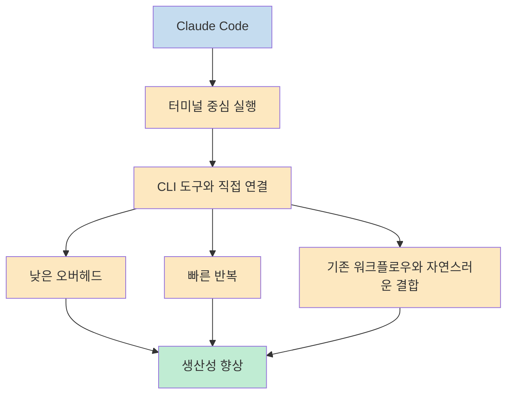
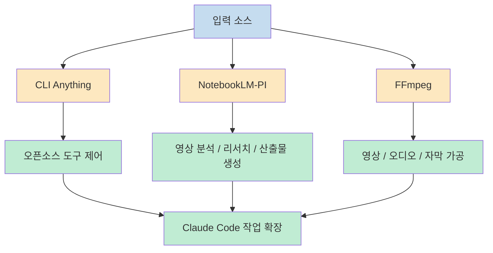
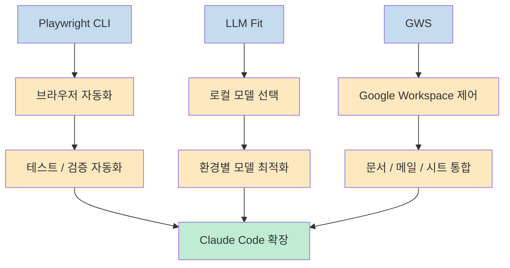

이 영상의 핵심은 단순한 도구 추천 리스트가 아닙니다. 발표자는 Claude Code 생태계가 점점 **MCP 중심에서 CLI 중심으로 이동하고 있다** 고 보고, 그 이유를 "터미널 안에서 더 직접적으로 연결되고 토큰 오버헤드가 적기 때문" 이라고 설명합니다. 즉 이 글도 10개 도구를 나열하는 데서 그치지 않고, 왜 CLI가 Claude Code와 특히 잘 맞는지, 그리고 어떤 종류의 작업에서 강한지 중심으로 정리해 보겠습니다 (근거: [t=0](https://youtu.be/uULvhQrKB_c?t=0), [t=585](https://youtu.be/uULvhQrKB_c?t=585), [t=780](https://youtu.be/uULvhQrKB_c?t=780)).

<!--more-->

## Sources

- https://youtu.be/uULvhQrKB_c?si=QfQAofM0UPH-jxYf

## 1) 왜 지금 CLI 도구가 다시 중요해졌나: Claude Code는 원래 터미널 안에 살기 때문이다

영상은 처음부터 방향을 분명히 합니다. 발표자는 Claude Code 생태계에서 "everyone is building CLI tools" 라고 말하면서, 이제는 유튜브 리서치부터 배포, Google Workspace 제어까지 CLI로 확장하는 흐름이 커지고 있다고 설명합니다. 여기서 중요한 건 단순히 도구 개수가 늘었다는 사실보다, **Claude Code가 터미널 안에서 일하는 에이전트이기 때문에 CLI와 결합할 때 마찰이 적다** 는 점입니다 (근거: [t=0](https://youtu.be/uULvhQrKB_c?t=0)).

후반부에서는 이 관점을 더 직접적으로 말합니다. 발표자는 Playwright CLI와 MCP 서버를 비교한 영상을 언급하면서, 같은 작업을 할 때 CLI가 더 빠르고 토큰도 훨씬 적게 썼다고 설명합니다. 그리고 이걸 일반화해서 "we're moving away from MCPs, we're moving into CLIs" 라는 식으로 정리합니다. 물론 이건 보편적 진리가 아니라 발표자의 현 시점 실무 감각에 가까운 주장입니다. 하지만 최소한 Claude Code처럼 **터미널 친화적인 에이전트** 에서는 꽤 설득력 있는 관찰입니다 (근거: [t=585](https://youtu.be/uULvhQrKB_c?t=585), [t=780](https://youtu.be/uULvhQrKB_c?t=780)).

즉 이 영상의 핵심 메시지는 "MCP가 나쁘다" 가 아닙니다. 오히려 Claude Code와의 결합이라는 맥락에서 보면, 많은 경우 CLI가 더 직접적이고 효율적인 선택일 수 있다는 쪽에 가깝습니다. 이 전제를 이해하면 뒤에서 나오는 10개 도구가 왜 한 리스트에 묶였는지도 자연스럽게 보입니다 (근거: [t=585](https://youtu.be/uULvhQrKB_c?t=585), [t=780](https://youtu.be/uULvhQrKB_c?t=780)).

---

## 2) 연구와 콘텐츠 작업을 확장하는 도구들: CLI Anything, NotebookLM-PI, FFmpeg

첫 번째 도구인 `CLI Anything` 은 말 그대로 다른 CLI 도구를 만드는 CLI라는 점에서 메타 도구입니다. 발표자는 이 프로젝트가 open-source 프로젝트를 Claude Code가 다룰 수 있는 CLI로 바꾸는 데 유용하다고 설명하며, Blender, Inkscape, OBS, Zoom, NotebookLM 같은 예시를 듭니다. 핵심은 어떤 프로그램이 API를 제공하지 않더라도, 오픈소스이고 터미널에서 다룰 수 있다면 **Claude Code가 그 프로그램을 다룰 수 있는 조작 레이어를 빠르게 만들 수 있다** 는 점입니다 (근거: [t=18](https://youtu.be/uULvhQrKB_c?t=18)).

두 번째 도구인 `NotebookLM-PI` 는 발표자가 특히 실사용 중이라고 말하는 도구입니다. 그는 Claude 계열 모델이 비디오 처리에 약한 반면, NotebookLM은 유튜브 URL을 던져 분석할 수 있고, 그 분석을 Google 쪽 토큰으로 처리한 뒤 다시 Claude Code로 가져올 수 있다는 점을 강조합니다. 여기에 podcast, slide deck, infographic, quiz, flashcard 같은 NotebookLM deliverable 생성까지 결합됩니다. 즉 이 도구의 가치는 단순 연동이 아니라, **Claude가 약한 영역을 NotebookLM으로 오프로드한 뒤 결과만 다시 합치는 구조** 에 있습니다 (근거: [t=118](https://youtu.be/uULvhQrKB_c?t=118)).

여기서 발표자는 중요한 실전 패턴도 말합니다. 많은 CLI 도구는 두 단계가 필요합니다. 하나는 실제 CLI 도구 설치이고, 다른 하나는 Claude Code가 그 도구를 제대로 쓰게 만드는 skill입니다. 그는 NotebookLM-PI를 예로 들며, 저장소 설명 페이지나 설치 문서를 Claude Code에 그대로 넘기면 설치와 skill 적용까지 꽤 자연스럽게 처리할 수 있다고 설명합니다. 즉 CLI 도구 그 자체보다도 **도구 사용법을 Claude에게 어떻게 주입할지** 가 실제 활용도에 큰 영향을 줍니다 (근거: [t=200](https://youtu.be/uULvhQrKB_c?t=200)).

네 번째 도구 `FFmpeg` 는 미디어 조작 계층입니다. 발표자는 실제 웹페이지 스크롤 애니메이션 예시를 들며, 비디오를 프레임으로 쪼개거나, 반복/역재생/합치기 같은 작업을 Claude Code가 자동으로 처리하게 만들 수 있다고 말합니다. 즉 FFmpeg는 영상 제작자만의 도구가 아니라, **웹 애니메이션·오디오·자막·멀티미디어 자산 가공을 Claude Code에 맡기고 싶을 때** 굉장히 강한 선택지가 됩니다 (근거: [t=290](https://youtu.be/uULvhQrKB_c?t=290)).

---

## 3) 코드와 배포 파이프라인 쪽에서는 GitHub CLI, Vercel CLI, Supabase CLI가 기본 축이 된다

발표자는 다섯 번째 도구로 `GitHub CLI` 를 사실상 기본값처럼 소개합니다. 코드를 쓰고 GitHub에 push해야 하는 흐름이 있다면, 굳이 브라우저 탭을 오가며 작업할 이유가 없고, GitHub CLI를 Claude Code가 다루게 하면 인증 이후 브랜치, 커밋, PR 같은 반복 작업을 터미널 안에서 처리할 수 있다는 설명입니다. 이 부분은 새롭다기보다 중요한 상기입니다. **이미 Claude Code가 잘 아는 도메인일수록 CLI 결합 효과가 더 크다** 는 뜻입니다 (근거: [t=360](https://youtu.be/uULvhQrKB_c?t=360)).

배포 쪽에서는 `Vercel CLI` 가 같은 맥락으로 등장합니다. 발표자는 Vercel의 넉넉한 free tier와 GitHub와의 연결성을 좋아한다고 말하면서, deployment architecture의 일부를 터미널 안에서 제어할 수 있다는 점을 강조합니다. 그리고 Vercel이 공식적으로 제공하는 skills 페이지도 함께 언급합니다. 즉 Vercel CLI의 강점은 단순 deploy 명령 하나가 아니라, **배포·브라우저 자동화·UI 작업까지 이어지는 주변 생태계** 가 준비돼 있다는 데 있습니다 (근거: [t=444](https://youtu.be/uULvhQrKB_c?t=444)).

일곱 번째 도구 `Supabase CLI` 는 백엔드 축입니다. 발표자는 Supabase를 Vercel과 비슷한 이유로 선호한다고 말하며, generous free tier와 데이터베이스+인증을 한 곳에서 다룰 수 있다는 점을 강조합니다. 또한 Supabase가 원래 Firebase 대안을 지향하는 오픈소스 프로젝트라는 점도 언급합니다. 따라서 이 도구는 **Claude Code가 프론트엔드만이 아니라 데이터베이스와 인증까지 터미널에서 다루게 해 주는 확장 레이어** 로 보는 편이 맞습니다 (근거: [t=516](https://youtu.be/uULvhQrKB_c?t=516)).

---

## 4) 브라우저와 로컬 모델, 워크스페이스 제어까지 가면 Playwright CLI, LLM Fit, GWS가 중요해진다

여덟 번째 도구 `Playwright CLI` 는 발표자가 특히 `CLI vs MCP` 비교 사례로 직접 끌어오는 도구입니다. 그는 Playwright 팀이 CLI와 MCP 서버를 비교한 영상을 언급하며, 같은 브라우저 자동화 작업을 CLI로 수행할 때 더 빠르고 훨씬 적은 토큰을 썼다고 설명합니다. 이 맥락에서 Playwright CLI는 단순 테스트 도구가 아니라, **Claude Code가 스스로 브라우저를 열고 공격적으로 UI를 검증하게 만드는 실전용 자동화 계층** 입니다 (근거: [t=585](https://youtu.be/uULvhQrKB_c?t=585)).

아홉 번째 도구 `LLM Fit` 은 로컬 모델 선택 문제를 푸는 도구입니다. 발표자는 오픈소스 모델 공간이 너무 복잡하고, 대부분의 사람에게 "내 환경에 어떤 모델이 맞는가" 는 자명하지 않다고 말합니다. 그래서 LLM Fit은 하드웨어와 환경에 맞는 로컬 모델 선택을 도와주는 CLI로 소개됩니다. 이것은 작은 포인트 같지만 중요합니다. Claude Code 워크플로우를 확장할 때 항상 원격 상용 모델만 쓰는 게 아니라, **어떤 작업을 로컬 모델로 내려서 처리할지 판단하는 보조 레이어** 도 필요하다는 뜻입니다 (근거: [t=670](https://youtu.be/uULvhQrKB_c?t=670)).

마지막 도구 `GWS` 는 Google Workspace 제어 계층입니다. 발표자는 이 도구가 이메일, Docs, Sheets 등 Google 생태계를 Claude Code에서 다루게 해 준다고 설명하면서도, 동시에 보안 문제를 분명히 짚습니다. 다행히 shared folder, filter, Google의 Guardrails 같은 장치를 통해 어느 정도 샌드박싱이 가능하다고 말합니다. 그리고 이 저장소는 skill이 너무 많아서 무엇을 실제로 설치할지 Claude와 상의해 골라야 한다고 조언합니다. 즉 여기서는 기능 확장 자체보다 **권한 범위와 skill 선택을 어떻게 통제할지** 가 더 중요합니다 (근거: [t=733](https://youtu.be/uULvhQrKB_c?t=733)).

---

## 5) 이 영상이 주는 진짜 교훈은 "CLI 설치" 가 아니라 "CLI + Skill" 설계다

영상 전체를 관통하는 실전 포인트는 단순히 좋은 CLI 목록이 아닙니다. 발표자는 여러 번, CLI 도구 하나만 설치해서 끝나는 경우보다, Claude Code가 그 도구를 어떤 문맥에서 어떻게 써야 하는지 알려 주는 skill이 함께 필요하다고 말합니다. 특히 NotebookLM-PI와 GWS에서 이 부분을 강조합니다. 즉 도구가 기능을 준다면, skill은 **그 기능을 언제 꺼내 쓸지에 대한 사용 설명서** 를 Claude에게 주는 셈입니다 (근거: [t=200](https://youtu.be/uULvhQrKB_c?t=200), [t=733](https://youtu.be/uULvhQrKB_c?t=733)).

또 다른 핵심은 모든 CLI를 무조건 다 넣는 것이 아니라는 점입니다. 발표자는 GWS처럼 skill이 너무 많은 경우 오히려 적절한 트리거가 어려워질 수 있다고 말합니다. 즉 중요한 것은 도구의 수보다 **현재 작업에서 어떤 확장이 진짜 필요한가** 입니다. 이건 앞서 소개된 Playwright, Vercel, Supabase, NotebookLM-PI에도 모두 같은 원리로 적용됩니다 (근거: [t=733](https://youtu.be/uULvhQrKB_c?t=733)).

결국 이 영상의 리스트는 이렇게 읽는 편이 더 정확합니다. 10개의 CLI가 각각 대단해서가 아니라, Claude Code가 기본적으로 강하지 않은 영역—비디오 분석, 브라우저 제어, 배포, 데이터베이스, 로컬 모델 선택, 워크스페이스 제어—에 **정확히 기능을 빌려 주는 방식** 이라는 점이 핵심입니다. 그리고 그 기능을 안정적으로 쓰게 만드는 건 skill과 워크플로우 설계입니다 (근거: [t=0](https://youtu.be/uULvhQrKB_c?t=0), [t=200](https://youtu.be/uULvhQrKB_c?t=200), [t=780](https://youtu.be/uULvhQrKB_c?t=780)).

## 실전 적용 포인트

- 이 영상은 CLI 도구를 단순 추천하는 것이 아니라, Claude Code가 약한 작업 영역을 어떻게 확장할지 보여 줍니다 (근거: [t=0](https://youtu.be/uULvhQrKB_c?t=0)).
- NotebookLM-PI 같은 도구는 Claude가 약한 비디오 분석/대규모 리서치를 외부 계층으로 넘기는 방식으로 이해하면 좋습니다 (근거: [t=118](https://youtu.be/uULvhQrKB_c?t=118)).
- GitHub CLI, Vercel CLI, Supabase CLI는 코드 작성 이후의 반복 작업을 터미널 안으로 끌어와 워크플로우를 짧게 만듭니다 (근거: [t=360](https://youtu.be/uULvhQrKB_c?t=360), [t=444](https://youtu.be/uULvhQrKB_c?t=444), [t=516](https://youtu.be/uULvhQrKB_c?t=516)).
- Playwright CLI는 CLI가 MCP보다 잘 맞을 수 있다는 대표 사례로 소개되며, 브라우저 검증 자동화의 실전 도구로 추천됩니다 (근거: [t=585](https://youtu.be/uULvhQrKB_c?t=585)).
- CLI 도구의 효과는 설치 자체보다, Claude가 그 도구를 언제 어떻게 쓸지 알려 주는 skill 설계에서 크게 갈립니다 (근거: [t=200](https://youtu.be/uULvhQrKB_c?t=200), [t=733](https://youtu.be/uULvhQrKB_c?t=733)).

## 핵심 요약

- 영상은 Claude Code 생태계가 점점 CLI 중심으로 이동하고 있다고 주장합니다 (근거: [t=0](https://youtu.be/uULvhQrKB_c?t=0), [t=780](https://youtu.be/uULvhQrKB_c?t=780)).
- 소개된 10개 CLI는 연구, 콘텐츠, 배포, 백엔드, 브라우저 자동화, 로컬 모델, 워크스페이스 통합 등 Claude의 약한 영역을 보완합니다 (근거: [t=18](https://youtu.be/uULvhQrKB_c?t=18), [t=118](https://youtu.be/uULvhQrKB_c?t=118), [t=360](https://youtu.be/uULvhQrKB_c?t=360), [t=585](https://youtu.be/uULvhQrKB_c?t=585), [t=733](https://youtu.be/uULvhQrKB_c?t=733)).
- 발표자의 관점에서 CLI는 Claude Code와 같은 터미널 에이전트에 더 직접적이고 저오버헤드인 선택지입니다 (근거: [t=585](https://youtu.be/uULvhQrKB_c?t=585), [t=780](https://youtu.be/uULvhQrKB_c?t=780)).
- 하지만 실제 효과는 도구 개수보다, CLI와 skill을 어떻게 조합하느냐에 달려 있습니다 (근거: [t=200](https://youtu.be/uULvhQrKB_c?t=200), [t=733](https://youtu.be/uULvhQrKB_c?t=733)).

## 결론

이 영상을 보고 얻을 수 있는 가장 큰 통찰은 "좋은 CLI 10개를 외우자" 가 아닙니다. 더 중요한 건 Claude Code가 기본적으로 잘하는 일과 못하는 일을 구분하고, 못하는 부분에만 적절한 CLI를 붙여 **기능을 바깥에서 빌려오는 설계** 를 하자는 데 있습니다. 그 과정에서 CLI는 Claude Code와 같은 터미널 에이전트에게 꽤 자연스러운 확장 방식이 될 수 있습니다 (근거: [t=0](https://youtu.be/uULvhQrKB_c?t=0), [t=780](https://youtu.be/uULvhQrKB_c?t=780)).

결국 발표자의 리스트가 유효한 이유는 도구 자체가 화려해서가 아니라, 각각이 Claude Code의 빈틈을 아주 구체적으로 메워 주기 때문입니다. 연구는 NotebookLM-PI, 배포는 Vercel CLI, 백엔드는 Supabase CLI, 브라우저 검증은 Playwright CLI, 워크스페이스 제어는 GWS처럼 말입니다. 중요한 건 유행하는 도구를 다 넣는 것이 아니라, **내 작업에서 가장 큰 병목을 먼저 없애는 CLI부터 고르는 것** 입니다 (근거: [t=118](https://youtu.be/uULvhQrKB_c?t=118), [t=444](https://youtu.be/uULvhQrKB_c?t=444), [t=516](https://youtu.be/uULvhQrKB_c?t=516), [t=585](https://youtu.be/uULvhQrKB_c?t=585), [t=733](https://youtu.be/uULvhQrKB_c?t=733)).
