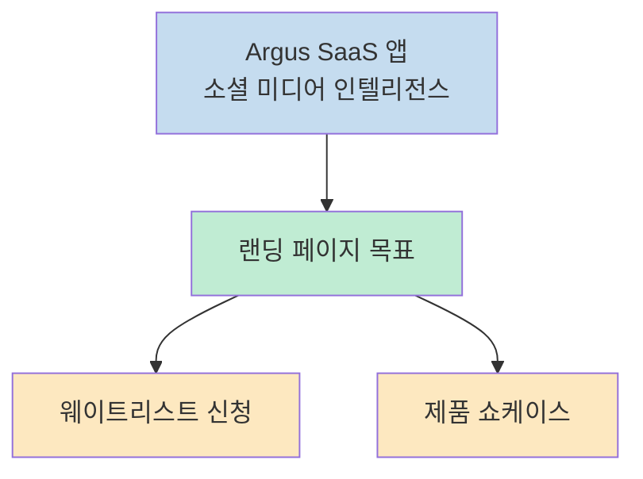
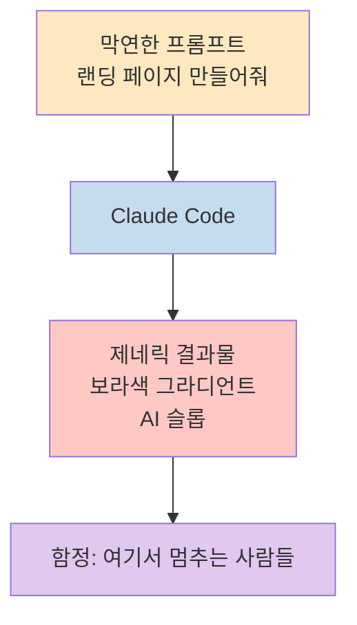
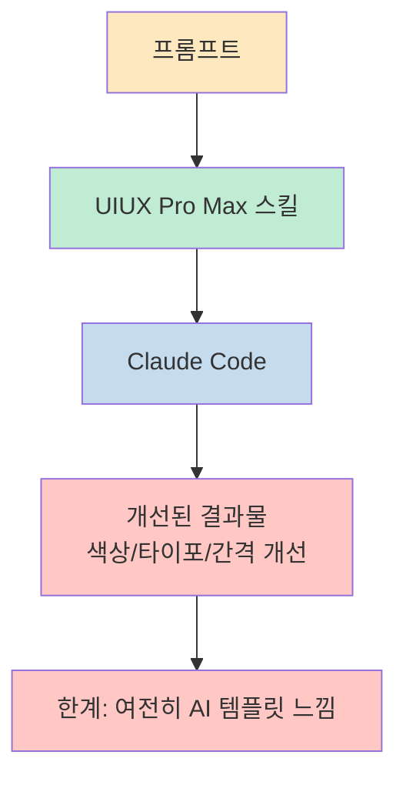
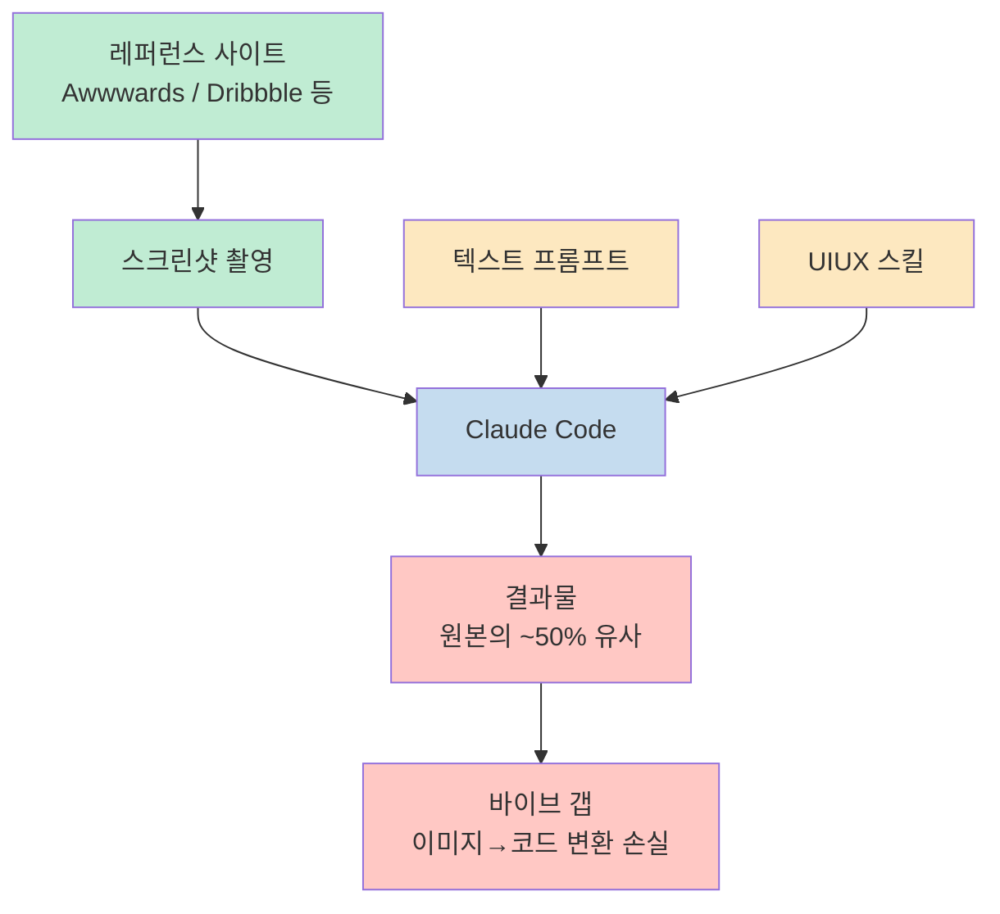
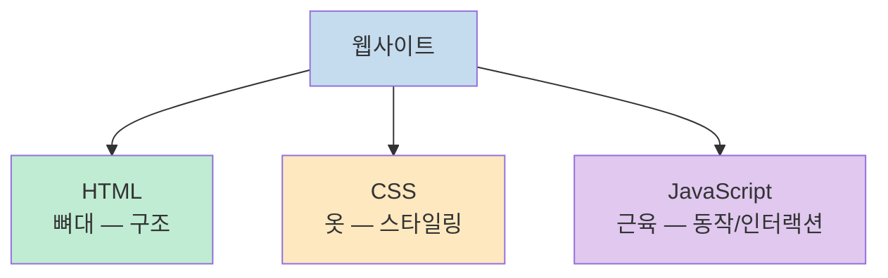
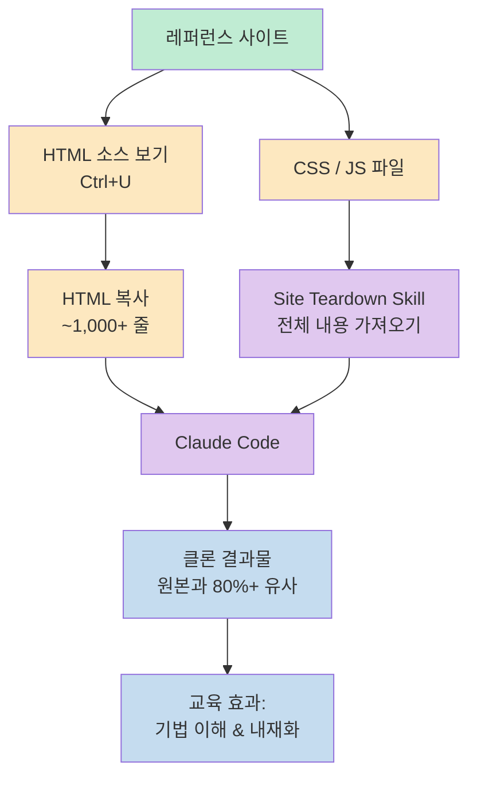
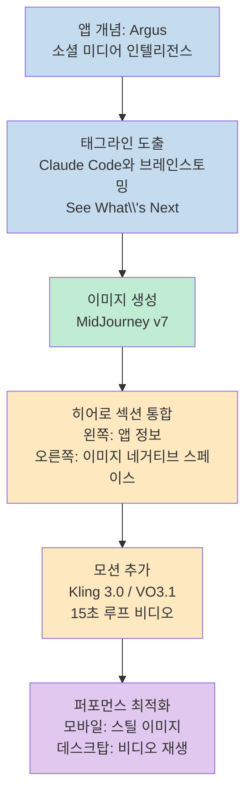
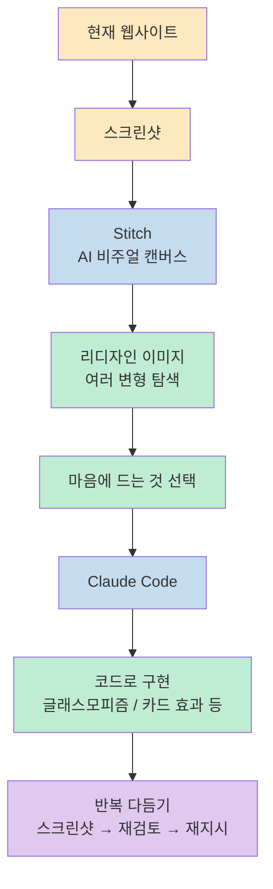
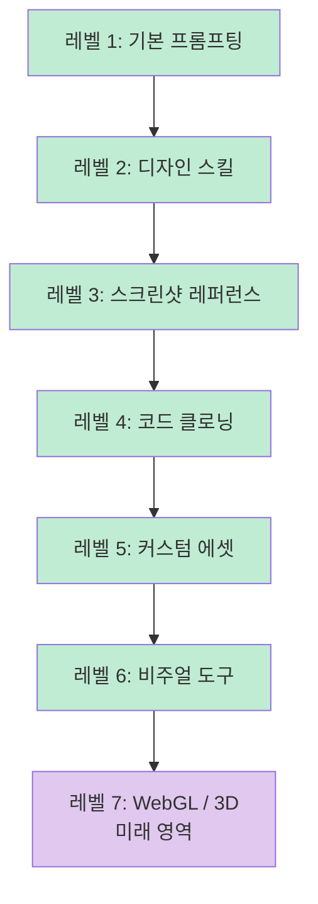
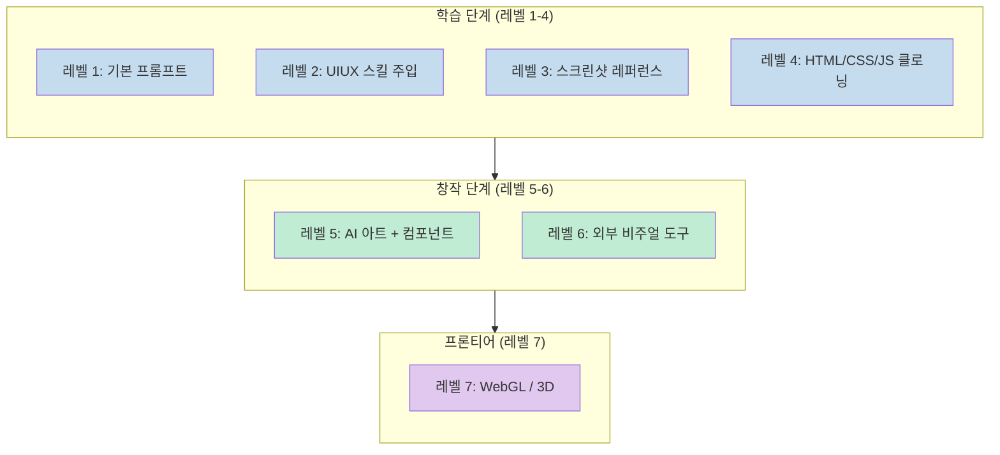

Claude Code로 웹 페이지를 만들면 늘 비슷하게 생긴 결과물이 나온다는 느낌을 받은 적이 있는가? Chase AI의 유튜브 영상 "The 7 Levels of Building ELITE Websites with Claude Code"는 이 문제의 근본 원인이 AI에 있지 않고 우리에게 있다고 말한다. 디자인 취향을 언어로 표현하지 못하는 것, 시각적 레퍼런스 없이 텍스트만으로 시각적 결과를 요구하는 것이 핵심 문제다. 이 영상은 그 간극을 좁히기 위한 7단계 로드맵을 제시한다.

<!--more-->

## Sources

- [The 7 Levels of Building ELITE Websites with Claude Code – Chase AI](https://www.youtube.com/watch?v=1PXFAFMgdns)

---

## 케이스 스터디: Argus 프로젝트

영상 전반에 걸쳐 사용되는 예시 프로젝트는 **Argus**다. Argus는 콘텐츠 크리에이터가 자신의 니치에서 트렌딩 토픽을 찾을 수 있는 소셜 미디어 인텔리전스 SaaS 웹 앱이다. 이 가상의 앱을 랜딩 페이지로 만들어 나가며 레벨 1부터 7까지 각 단계의 차이를 시각적으로 비교한다.



---

## 레벨 1: 그냥 프롬프트만 사용하기

[https://youtu.be/1PXFAFMgdns?t=0](https://youtu.be/1PXFAFMgdns?t=0)

대부분의 사람들이 시작하는 지점이다. Claude Code를 열고 "Argus라는 소셜 미디어 인텔리전스 앱 랜딩 페이지 만들어줘"라고 입력한다. Plan Mode를 써도 결과물은 제네릭하다. 보라색 그라디언트, 평범한 레이아웃, 흔히 본 AI 슬롭 디자인이 나온다.

**왜 이렇게 될까?**

AI는 취향이 없다는 말을 자주 듣는다. 그러나 더 정확한 진단은 *우리 대부분도 디자인 취향이 있지만 그것을 언어로 표현하는 법을 모른다*는 것이다. Claude Code에게 "무엇이 좋아 보이는지"를 모르면 Claude Code도 그것을 알 수 없다.

이 레벨에서 마스터해야 할 세 가지 스킬:

1. **서술적 프롬프트 작성** — 막연한 지시가 아닌 구체적인 방향성 제시
2. **프레임워크 이해** — Next.js, 일반 HTML, Astro 등이 무엇인지 알기
3. **기본 디자인 어휘 구축** — 용어를 알아야 표현할 수 있다

Plan Mode는 이 세 가지를 자연스럽게 훈련시킨다. "텍스트 스택을 뭐로 할까요?"라는 질문을 받을 때, 모르는 용어를 바로 Claude에게 물어보는 것이 핵심이다.



---

## 레벨 2: AI에게 디자인 교육하기 — 스킬 활용

[https://youtu.be/1PXFAFMgdns?t=200](https://youtu.be/1PXFAFMgdns?t=200)

레벨 2의 핵심은 **특화 스킬(Skill)로 Claude Code의 디자인 프롬프트를 강화**하는 것이다.

영상에서 소개하는 도구는 **UIUX Pro Max 스킬**이다. GitHub에 오픈소스로 공개된 이 스킬은 52,000 스타를 보유하고 있으며, 내부적으로는 수십 개의 텍스트 프롬프트로 구성된 체크리스트다.

- "이 산업의 웹 페이지를 만들 때 고려해야 할 것들"
- "AI 슬롭 디자인 기법 목록 — 이것들을 피해라"

이 체크리스트가 Claude Code에 주입되어, 우리가 빈약한 프롬프트를 입력해도 자동으로 더 나은 결과를 유도한다.

**설치 방법:**

```
/plugin marketplace add <스킬명>
```

또는 스킬의 GitHub URL을 Claude Code에 붙여넣고 "이 스킬을 설치해줘"라고 입력해도 된다.

**결과:** 이전보다 훨씬 나아진다. 실제 배경, 마우스오버 시 색상 변화 버튼, 섹션마다 바뀌는 색상. 그러나 여전히 "AI 템플릿"처럼 보인다. 핵심 구조는 동일하고 표면만 바뀐 것이다.

**레벨 2의 함정:** 스킬만으로는 제네릭함을 완전히 탈피할 수 없다. 스킬은 일반적인 색상 이론, 타이포그래피, 간격 원칙을 제공하지만, 진짜 차별화는 우리가 무엇을 원하는지 구체적으로 보여주는 것에서 온다.



---

## 레벨 3: 비주얼 디렉터 — 스크린샷으로 보여주기

[https://youtu.be/1PXFAFMgdns?t=400](https://youtu.be/1PXFAFMgdns?t=400)

텍스트로 *말하는* 것을 멈추고, 이미지로 *보여주는* 것을 시작하는 단계다. Claude Code는 텍스트 설명보다 실제 이미지를 참고할 때 훨씬 정확하게 작동한다.

**레퍼런스 찾는 곳:**

| 사이트 | 특징 |
|--------|------|
| **Awwwards** (awwwards.com) | 크리에이티브 프론트엔드 작업물 평가 플랫폼 |
| **Godly.website** | 무한 스크롤 디자인 갤러리 |
| **Pinterest** | SaaS 랜딩 페이지 검색 시 의외로 다양한 결과 |
| **Dribbble** (dribbble.com) | UI/UX 작업물 공유 커뮤니티 |

**프로세스:**

1. 좋아하는 사이트(예: OpenHands)를 찾는다
2. 해당 페이지의 스크린샷을 여러 장 찍는다
3. Claude Code에 스크린샷 + "이 스타일로 맞춰줘"라고 입력한다

이 방법의 부수 효과: 레퍼런스를 많이 볼수록 "좋은 것"이 무엇인지 눈이 개발된다. 그리고 점점 평범한 AI 슬롭이 눈에 거슬리기 시작한다.

**레벨 3의 함정 — 바이브 갭(Vibe Gap):**

스크린샷을 줘도 결과물은 원본의 약 50% 정도만 닮는다. 왜냐하면 이미지 → 코드 변환 과정에서 여전히 손실이 발생하기 때문이다. 대부분의 사람들은 여기서 멈춰서 무한히 스크린샷을 교체하며 프롬프팅을 반복하지만, 완성에 도달하지 못한다.



---

## 레벨 4: 클로너 — 프로의 코드 직접 분석하기

[https://youtu.be/1PXFAFMgdns?t=700](https://youtu.be/1PXFAFMgdns?t=700)

레벨 3의 스크린샷 방식이 50%에서 막히는 이유는 표면만 보기 때문이다. 레벨 4는 그 아래로 들어간다.

**프론트엔드 3요소 이해:**



**클로닝 프로세스:**

1. 좋아하는 사이트에서 `Ctrl+U`로 HTML 소스 전체를 복사한다 (예: OpenHands는 1,152줄)
2. HTML 하단에 있는 CSS 및 JS 파일 링크를 확인한다
3. Claude Code에 "이 HTML을 참고해. CSS와 JS 파일도 확인해봐"라고 입력한다

**주의 사항 — 웹 페치 품질 문제:**

Claude Code가 일반 `web_fetch`로 CSS/JS를 가져오면 더 작은 모델이 요약본만 반환한다. 실제 구현에 필요한 세부 코드가 손실된다. 이를 해결하기 위해 영상에서는 **Site Teardown Skill**이라는 커스텀 스킬을 소개한다. 이 스킬은 CSS와 JS의 전체 내용을 요약 없이 가져온다.

**이 과정에서 무엇을 배우는가:**

단순히 복사하는 것이 목적이 아니다. Claude Code에게 "이 배경 효과는 어떻게 구현됐어?", "이 스크롤 애니메이션의 원리가 뭐야?"라고 물으며 *코드를 읽고 이해하는 교육 과정*을 거친다. 반복할수록 프로 기법을 내재화할 수 있다.

**습득해야 할 세 가지 스킬:**
- 소스 코드를 읽고 이해하기 (Claude 도움 활용)
- 특정 기법 ↔ 특정 효과 매핑 인식
- 클론 패턴을 자신의 디자인에 맞게 응용하기

**레벨 4의 함정 — 클론 시링(Clone Ceiling):**

원리를 이해하지 않고 단계를 기계적으로 따르면, 누구나 할 수 있는 작업이 된다. 차별화는 "왜"를 이해하는 데서 온다.



---

## 레벨 5: 커스텀 컴포넌트와 나만의 에셋

[https://youtu.be/1PXFAFMgdns?t=1100](https://youtu.be/1PXFAFMgdns?t=1100)

레벨 4까지는 *보고, 분석하고, 모방하는* 과정이었다. 레벨 5부터는 나만의 것을 만들기 시작한다.

### 5-1. 컴포넌트 라이브러리 활용

**21st.dev**: 버튼, 카루셀, 스크롤 영역, 내비게이션 등 다양한 컴포넌트 디자인을 제공한다. 마음에 드는 컴포넌트를 선택하면 프롬프트를 바로 복사해 Claude Code에 붙여넣을 수 있다.

다른 소스들:
- **CodePen** — 인터랙티브 CSS/JS 데모
- **Monae** — 고품질 컴포넌트 모음

### 5-2. 커스텀 AI 아트 — 비주얼 스토리텔링

단순한 컴포넌트 교체를 넘어, 앱의 정체성을 담은 원본 이미지를 만드는 단계다.

Argus 예시:
- Argus는 그리스 신화의 1만 개 눈을 가진 존재 → "See What's Next" 태그라인
- 소셜 미디어 감시, 트렌드 탐색이라는 앱 기능과 연결
- Claude Code와 브레인스토밍 후 MidJourney로 배경 이미지 생성



### 5-3. 비디오 배경 추가

정적 이미지에 생동감을 더하기 위해 AI 비디오 생성 도구를 활용한다:

- **Kling 3.0** 또는 **VO3.1**에서 시작/끝 프레임 지정 방식으로 생성
- 약 15초 길이, **모션은 최대한 미묘하게** — 새, 구름, 물결 정도
- 완벽한 루프가 어려울 경우 15초 비선형 비디오로 대체 (15초 내에 전체를 보는 사람은 드뭄)
- 모바일에서는 비디오 대신 스틸 이미지 로드 → Claude Code에 지시하면 자동 처리

**이 레벨의 핵심 원칙:**

> "처음 네 레벨은 기초를 배우는 과정이다. 레벨 5부터는 진정한 커스터마이징이 시작된다."

---

## 레벨 6: 외부 비주얼 도구로 세밀하게 다듬기

[https://youtu.be/1PXFAFMgdns?t=1600](https://youtu.be/1PXFAFMgdns?t=1600)

Claude Code는 터미널이다. 텍스트로 시각적 결과를 다루다 보면 점점 한계를 느낀다. 레벨 6은 Claude Code 밖으로 나가 비주얼 편집 도구를 도입하는 단계다.

**주요 비주얼 도구들:**

| 도구 | 특징 |
|------|------|
| **Stitch** (Google) | 무료, AI 기반 캔버스, 스크린샷 기반 리디자인 |
| **Figma** | 전문 UI 디자인 도구 |
| **Pencil.dev** | VS Code / Cursor 내 실시간 캔버스 편집 |
| **Paper.design** | AI 보조 프로토타이핑 |

**Stitch 활용 예시:**

1. 현재 웹사이트 스크린샷을 Stitch에 업로드
2. "히어로는 마음에 들지만 하단 섹션을 완전히 리디자인해줘"라고 요청
3. 생성된 리디자인 이미지에서 마음에 드는 것을 선택
4. 해당 이미지를 Claude Code에 가져와 "이 글래스모피즘 효과 적용해줘"라고 지시

**Stitch의 핵심 가치:**

- 완성 코드가 아닌 *아이디어 시각화 도구*
- 빠른 변형(variant) 탐색 — 레이아웃, 색상, 이미지 조합 실험
- 인터랙션: 리디자인 결과물 우클릭 → "Variants" → 반복 개선



**레벨 6에서의 세밀한 디테일들:**

Argus 최종 버전에 적용된 요소들 ([https://youtu.be/1PXFAFMgdns?t=1800](https://youtu.be/1PXFAFMgdns?t=1800)):

- **로딩 애니메이션** — 페이지 진입 시 텍스트가 천천히 나타남 → 무게감 부여
- **커스텀 폰트** — Google Fonts 활용, 타이포그래피가 프리미엄 느낌의 핵심
- **스크롤 섹션 + 틱커** — 비디오 히어로와 이미지 배경 사이의 자연스러운 경계
- **글래스모피즘 카드** — Stitch 아이디어에서 착안, 배경 아트워크를 투과해서 보여줌
- **카운터 애니메이션** — 숫자가 0에서 1,000만으로 빠르게 올라가는 효과
- **조명 효과** — "AI tools", "content strategy" 텍스트 위를 빛이 흘러가는 미묘한 효과
- **스크롤 진행 바** — 상단에 읽기 진행률 표시

이런 디테일 하나하나는 개별적으로 작을지 몰라도, 모이면 "신경 써서 만든 웹사이트"라는 인상을 만든다.

**레벨 6의 핵심:**

> "이 레벨은 단순히 도구 사용이 아니라, 처음으로 Claude Code를 *나의 도구*로 활용하는 단계다. 앞 레벨들은 AI의 안내를 따라갔다면, 이 레벨부터는 내가 운전석에 앉는다."

---

## 레벨 7: 3D 프론티어 — 미래의 영역

[https://youtu.be/1PXFAFMgdns?t=2000](https://youtu.be/1PXFAFMgdns?t=2000)

솔직히 말하면, 레벨 7은 현재 시점(2026년 3월)에서는 대부분의 사람에게 해당되지 않는다.

**레벨 7에서 다루는 것들:**
- 커스텀 WebGL
- GLSL 셰이더
- 풀 3D 인터랙티브 경험
- 웹사이트가 비디오게임처럼 보이는 수준

이 수준의 사이트들은 전문 디자이너 팀이 오랫동안 공들여 만든 예술 작품이다. `Ctrl+U`로 소스를 열어도 이해할 수 없는 수준의 커스텀 코드다.

**왜 이 레벨을 소개하는가:**

Awwwards의 "Site of the Day"나 "Site of the Month"를 보면서 가능성의 지평을 인식하기 위해서다. 오늘 당장 만들 수 없더라도, 이런 것이 존재한다는 것을 아는 것 자체가 방향성을 제시한다.



---

## 핵심 요약



| 레벨 | 이름 | 핵심 방법 | 한계 |
|------|------|-----------|------|
| 1 | 기본 프롬프팅 | 텍스트만으로 지시 | 제네릭 결과, AI 슬롭 |
| 2 | 스킬 활용 | UIUX Pro Max 스킬 주입 | 여전히 AI 템플릿 느낌 |
| 3 | 비주얼 디렉터 | 스크린샷 레퍼런스 제공 | 50% 정도만 유사, 바이브 갭 |
| 4 | 클로너 | HTML/CSS/JS 전체 분석 | 클론 시링: 복사는 해도 창조 불가 |
| 5 | 커스텀 에셋 | AI 아트, 비디오 배경, 컴포넌트 | 없음 (창작 단계 시작) |
| 6 | 비주얼 도구 | Stitch, Figma, Pencil.dev | 무한 반복, 지름길 없음 |
| 7 | 3D 프론티어 | WebGL, 셰이더 | 현재 대부분 접근 불가 |

**근본 원인 재확인:**

Claude Code가 나쁜 게 아니다. 우리가 *디자인 취향을 언어로 표현하는 능력*이 없기 때문이다. 7단계 로드맵은 그 능력을 점진적으로 키우는 경로다.

---

## 결론

Chase AI의 7단계 프레임워크는 "Claude Code로 멋진 웹사이트를 만들려면 왜 잘 안 되는가"에 대한 명쾌한 답을 제시한다. 답은 도구의 문제가 아니라 *어휘의 부재*다. 디자인을 언어로 표현하려면 먼저 좋은 디자인을 많이 봐야 하고, 그것을 코드 수준에서 분석해야 하며, 자신만의 창작 요소를 더해야 한다.

레벨 1부터 6까지 각 단계는 자연스럽게 다음 단계의 필요성을 만들어낸다. 스킬을 써도 제네릭하니까 스크린샷을 써보고, 스크린샷도 50%에서 막히니까 코드를 분석하고, 클로닝만으로는 나만의 것이 없으니까 커스텀 에셋을 만들고, 텍스트 기반 도구의 한계를 느끼니까 비주얼 도구로 확장한다.

핵심은 **점진적 노출과 반복**이다. 프로의 코드를 읽고, 기법을 이해하고, 자신의 스타일로 응용하는 과정이 쌓이면 어떤 스킬 하나로 한 번에 해결하는 것보다 훨씬 탄탄한 결과물을 만들 수 있다.
