RAG(Retrieval-Augmented Generation)가 죽었다는 주장이 있다. Opus 4.6처럼 대규모 컨텍스트를 처리하는 LLM이 등장했으니 굳이 RAG를 쓸 필요가 없다는 논리다. 하지만 그 벽은 생각보다 빨리, 그리고 갑자기 찾아온다. 500개, 1,000개의 문서를 AI로 분석해야 하는 순간이 오면 컨텍스트 창 크기로는 답이 없다.

Chase AI의 영상 "Claude Code + LightRAG = UNSTOPPABLE"은 이 문제를 Graph RAG 방식으로 해결하는 오픈소스 LightRAG를 Claude Code와 연동하는 전 과정을 다룬다. 나이브 RAG의 한계부터 Graph RAG의 원리, 설치 방법, Claude Code 스킬 연동, 도입 시점 판단까지 실무에 바로 쓸 수 있는 내용을 정리한다.

<!--more-->

## Sources

- https://www.youtube.com/watch?v=QHlB-RJfx8w

---

## RAG는 죽지 않았다

LLM의 컨텍스트 창이 커진 건 사실이다. 하지만 컨텍스트 창은 비용과 속도 측면에서 선형으로 커지지 않는다. 5개, 10개 문서는 컨텍스트에 넣어도 괜찮다. 그런데 500개, 1,000개 문서를 처리해야 한다면?

> "if you think that means you will never need rag, you are going to hit a wall that you can't just prompt your way out of"
> — [영상 0:05](https://youtu.be/QHlB-RJfx8w?t=5)

Claude Code가 파일을 검색하는 방식(Agent GP)은 이미 훌륭하다. 하지만 그건 수십~수백 페이지 수준을 전제로 설계된 것이다. 2,000페이지, 4,000페이지, 5,000페이지가 되는 순간 한계가 온다. 그 지점에서 RAG 시스템은 **더 빠르고 더 저렴하게** 동작한다.

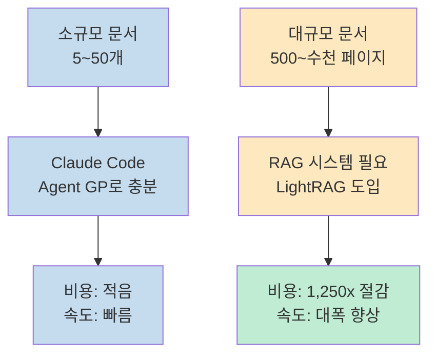

---

## 나이브 RAG의 작동 원리와 한계

2024년 말~2025년 초에 유행했던 "Pinecone에 넣고 Supabase로 검색" 방식이 바로 나이브 RAG다. 기초를 이해해야 왜 그것이 부족한지, 그리고 Graph RAG가 왜 등장했는지 알 수 있다.

### 나이브 RAG 파이프라인

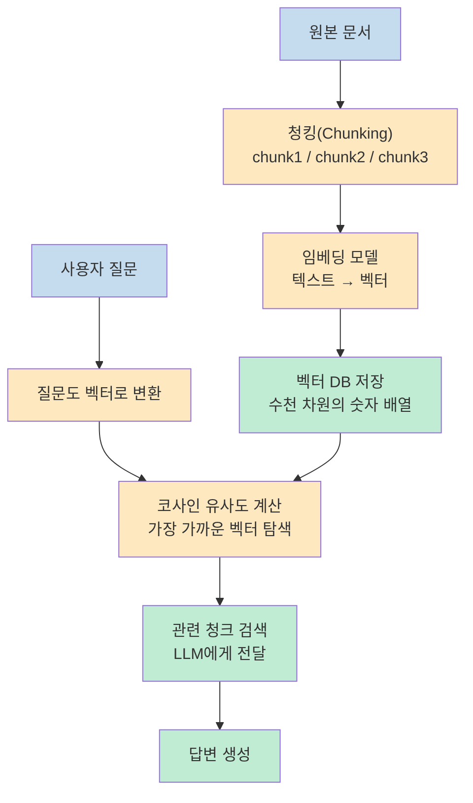

임베딩 모델은 문서를 청크 단위로 잘라 각각을 고차원 벡터(수천 개의 숫자 배열)로 변환한다. 예를 들어 "banana"는 `[0.52, 5.12, 9.31, ...]`처럼 표현된다. 군함에 대한 문서라면 boats/ships 관련 벡터들과 가까운 위치에 배치된다.

사용자가 질문하면 그 질문 역시 벡터로 변환되고, 코사인 유사도를 통해 가장 가까운 벡터(청크)들을 찾아 LLM에게 전달한다. 이것이 나이브 RAG의 전부다. [(영상 ~2:00)](https://youtu.be/QHlB-RJfx8w?t=120)

**한계:** 나이브 RAG는 사실상 "고급 Ctrl+F"에 불과하다. 개별 청크와의 유사도만 비교하기 때문에, 여러 문서에 걸쳐 있는 개념 간의 관계나 상위 수준의 추론을 처리하지 못한다.

---

## Graph RAG: 지식 그래프로 관계를 연결하다

Graph RAG는 나이브 RAG의 플랫 벡터 DB 위에 **지식 그래프(Knowledge Graph)** 를 추가한다. [(영상 ~5:00)](https://youtu.be/QHlB-RJfx8w?t=300)

### 엔티티와 관계의 추출

문서를 처리할 때 단순 청킹에 그치지 않고, 텍스트에서 **엔티티(Entity)** 와 **관계(Relationship/Edge)** 를 추출한다.

예시: "Anthropic created Claude Code"라는 문장이 있다면

- 엔티티 1: `Anthropic`
- 엔티티 2: `Claude Code`
- 관계(Edge): `created`

이 관계는 그래프의 엣지로 저장되며, 엣지에는 관계를 설명하는 풍부한 텍스트가 함께 저장된다.

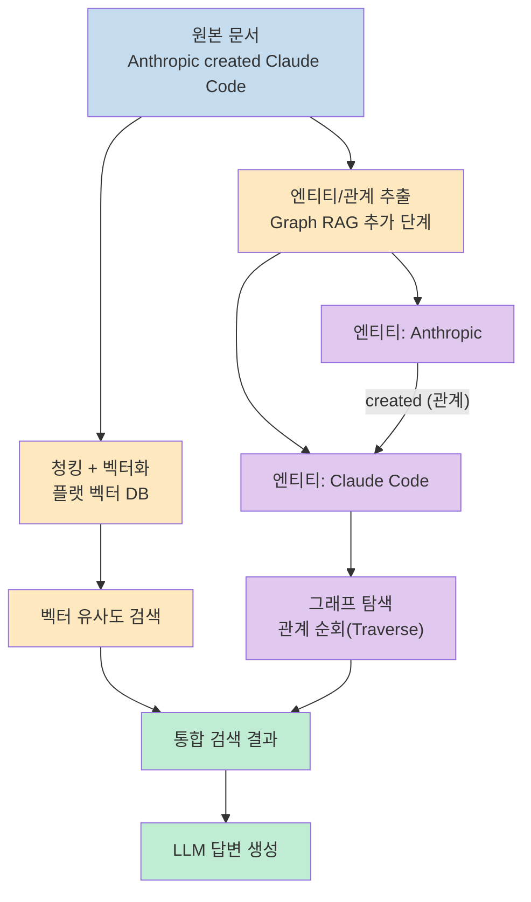

### 나이브 RAG vs Graph RAG 비교

**나이브 RAG**

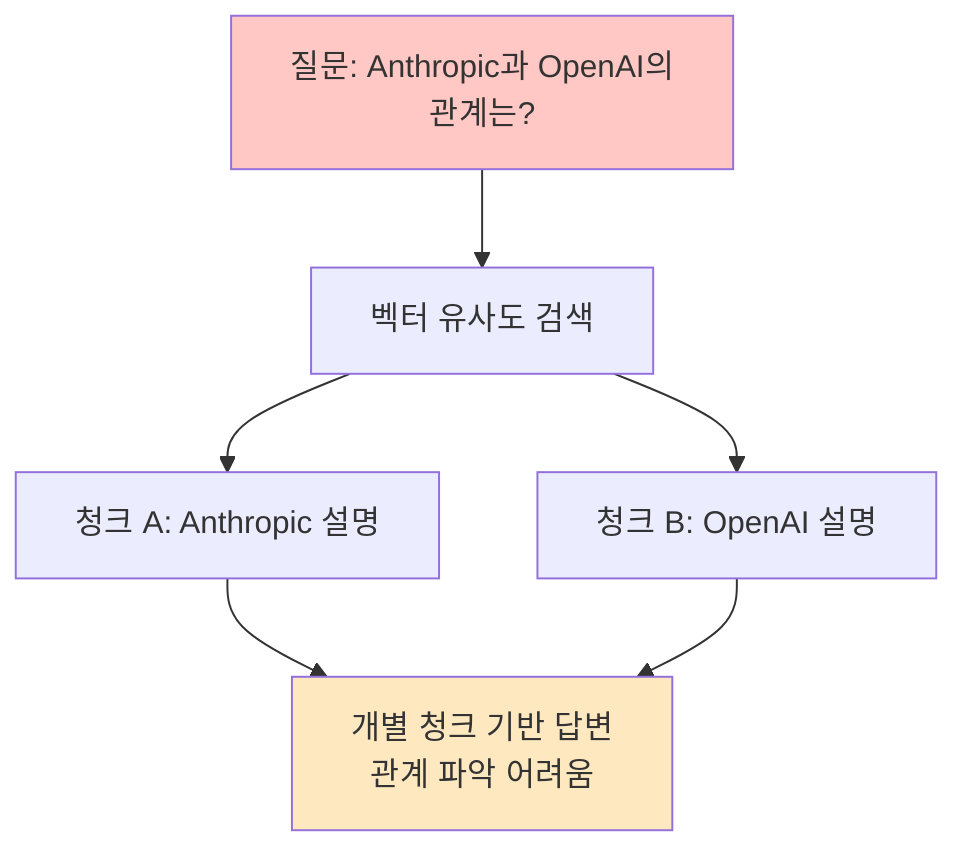

**Graph RAG**

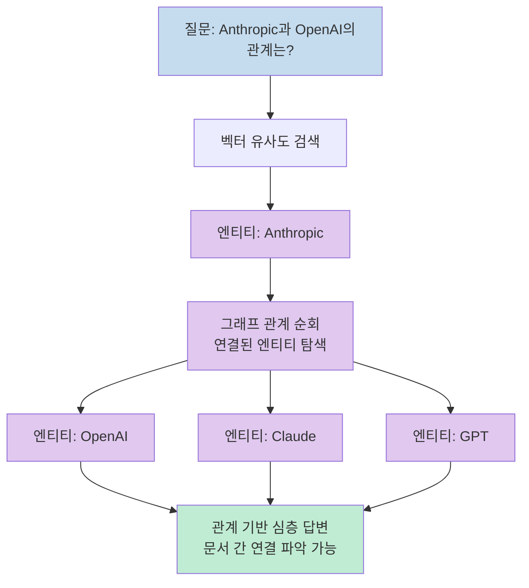

Graph RAG의 핵심 가치는 **분산된 정보 간의 관계를 연결**하는 것이다. "이 문서와 저 문서의 내용이 어떻게 연관되는가"를 묻는 질문에 답할 수 있게 된다.

---

## LightRAG: 오픈소스 Graph RAG의 최강자

LightRAG는 Graph RAG를 구현한 오픈소스 프로젝트로, Microsoft Graph RAG와 같은 고비용 시스템과 경쟁하면서도 **비용은 아주 작은 비율**에 불과하다. [(영상 ~1:00)](https://youtu.be/QHlB-RJfx8w?t=60)

**핵심 특징:**
- 플랫 벡터 DB + 지식 그래프를 **동시에 병렬로** 구축
- 질문 시 벡터 검색 + 그래프 탐색을 함께 활용
- OpenAI 임베딩 모델 또는 완전 로컬(Ollama) 모두 지원
- Docker 기반으로 간편 배포
- Web UI 제공 (업로드, 그래프 시각화, 검색, API 문서)
- REST API를 통해 외부 시스템(Claude Code)과 연동 가능

---

## Claude Code + LightRAG 설치 방법

설치는 놀랍도록 간단하다. Claude Code에게 다음 프롬프트 한 방이면 된다. [(영상 ~8:00)](https://youtu.be/QHlB-RJfx8w?t=480)

**사전 준비:**
- Docker Desktop (설치 후 실행 상태 유지)
- OpenAI API 키 (임베딩 모델용)

**Claude Code 프롬프트:**

```
clone the Lightrag repo. Write the .env file configured for OpenAI 
with GPT-4o mini and text-embedding-3-large. Use all default local 
storage and start it with Docker Compose.
[LightRAG GitHub URL]
```

Claude Code가 이 프롬프트를 받아 저장소 클론, `.env` 파일 생성, Docker Compose 실행까지 모두 처리한다.

**설치 흐름:**

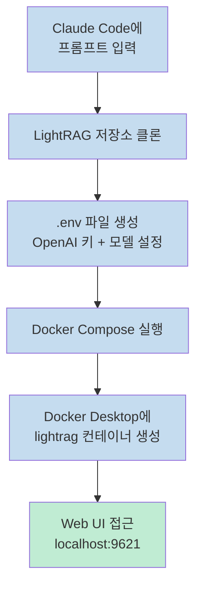

설치 완료 후 `localhost:9621`에 접속하면 LightRAG Web UI를 볼 수 있다.

---

## Web UI 활용법

Web UI는 4개의 주요 탭으로 구성된다. [(영상 ~10:00)](https://youtu.be/QHlB-RJfx8w?t=600)

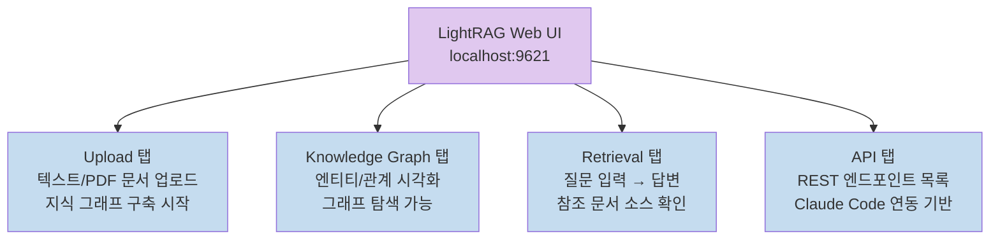

**문서 업로드 시 주의사항:**
- 텍스트 기반 파일만 지원 (TXT, PDF 등)
- 업로드 시 임베딩 + 지식 그래프 구축이 동시에 진행되므로 시간이 걸림
- Knowledge Graph 탭이 로드되지 않으면 좌측 상단 리셋 버튼 클릭

**Retrieval 탭 활용 예시:**
- "2026년 RAG 운영 비용의 전체 그림은?" 같은 복잡한 질문에도 깊이 있는 답변 제공
- 답변 하단에 참조 문서(source references) 자동 표시
- Knowledge Graph의 특정 엔티티(예: OpenAI)를 클릭하면 엔티티 타입, 관련 파일, 청킹 ID, 연결 관계 확인 가능

---

## Claude Code 스킬로 LightRAG 제어하기

Web UI를 직접 사용하는 것도 가능하지만, LightRAG의 REST API를 Claude Code 스킬로 래핑하면 훨씬 효율적이다. [(영상 ~12:00)](https://youtu.be/QHlB-RJfx8w?t=720)

**핵심 4가지 스킬:**

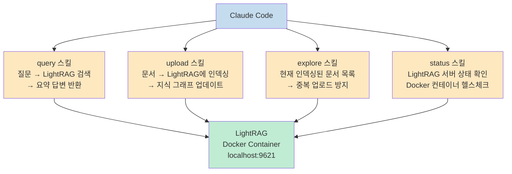

**query 스킬 사용 예시:**

Claude Code 안에서 다음처럼 호출하면 된다:

```
lightrag query 스킬을 사용해서 "RAG 시스템의 2026년 비용 구조"에 대해 물어봐
```

Claude Code는 LightRAG API에 요청을 보내고, 받은 JSON 응답을 요약해서 돌려준다. 원시(raw) 응답이 필요하면 그것도 받을 수 있다. [(영상 ~13:30)](https://youtu.be/QHlB-RJfx8w?t=810)

**스킬의 장점:**
- Web UI를 열지 않아도 Claude Code 워크플로우 안에서 RAG 검색 가능
- LightRAG 응답이 길고 복잡할 때 Claude Code가 자동으로 요약
- 파이프라인 자동화 가능 (문서 업로드 → 인덱싱 확인 → 질문 응답 일괄 처리)

---

## LightRAG 도입 시점: 언제 써야 할까?

명확한 숫자 기준이 있다. [(영상 ~14:00)](https://youtu.be/QHlB-RJfx8w?t=840)

> "somewhere between like 500 and 2,000 pages worth of documents... Beyond that, it probably makes sense for sure to start integrating light rag"

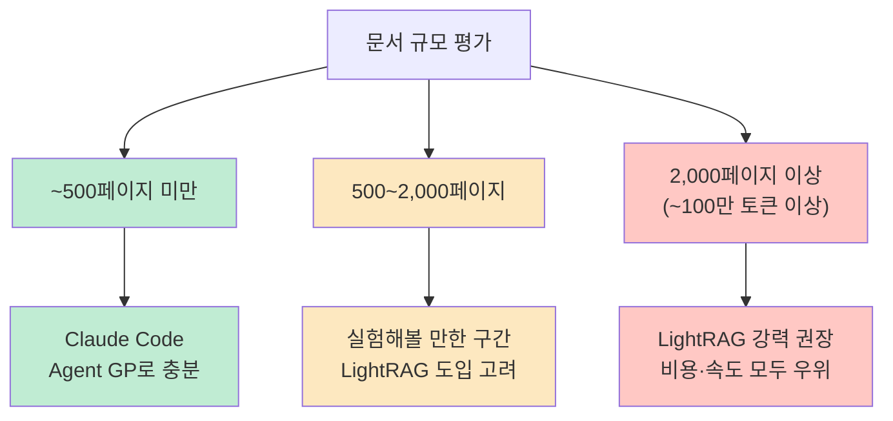

**비용 비교 (2025년 7월 연구 기준):**

RAG vs 표준 LLM 컨텍스트 방식의 비용 차이는 연구 당시 **최대 1,250배**였다. 단, 이 연구는 Gemini 2.0 기준이고 에이전트 하니스 없이 단순 텍스트 비교였으므로, 현재 모델과의 격차는 좁혀졌을 가능성이 있다. [(영상 ~16:30)](https://youtu.be/QHlB-RJfx8w?t=990)

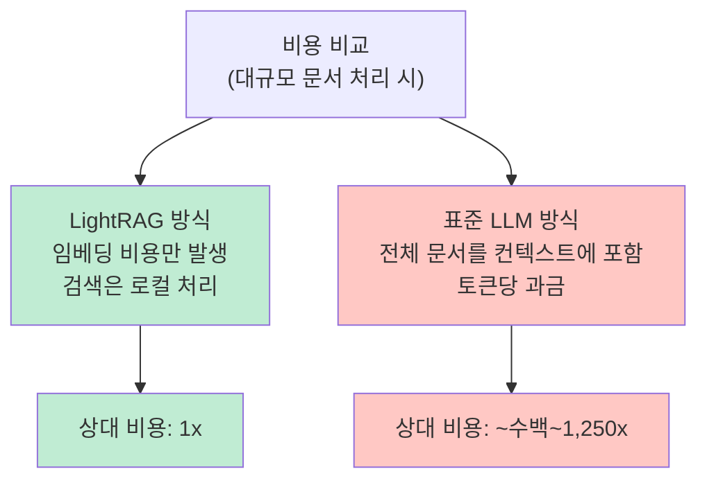

**실용적 조언:** 정확한 수치보다 직접 실험해보는 것이 낫다. 임베딩 과정이 가장 오래 걸리지만 치명적이지 않다. LightRAG는 빠르게 구축할 수 있으므로 부담 없이 시도해볼 수 있다.

---

## 스케일링 옵션: 로컬 vs 클라우드

LightRAG는 완전히 유연한 배포 옵션을 제공한다. [(영상 ~13:00)](https://youtu.be/QHlB-RJfx8w?t=780)

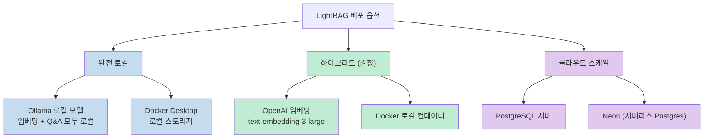

**선택 기준:**
- 개인 프로젝트/보안 민감 데이터 → 완전 로컬 (Ollama)
- 일반 개발/프로토타이핑 → 하이브리드 (OpenAI 임베딩 + 로컬 Docker)
- 기업/팀 공유/대규모 → 클라우드 (PostgreSQL/Neon)

---

## 핵심 요약

| 항목 | 내용 |
|------|------|
| **RAG 필요 시점** | 500~2,000페이지 이상의 문서 코퍼스 |
| **나이브 RAG 한계** | 개별 청크 유사도 비교만 가능, 문서 간 관계 파악 불가 |
| **Graph RAG 강점** | 엔티티+관계 지식 그래프로 깊은 질문 처리 가능 |
| **LightRAG 특징** | 벡터 DB + 지식 그래프 동시 구축, Microsoft Graph RAG 대비 저비용 |
| **설치 방법** | Claude Code + 프롬프트 한 줄 → Docker 자동 구성 |
| **연동 방식** | REST API → Claude Code 스킬 4종 (query / upload / explore / status) |
| **비용 효율** | 대규모 문서에서 표준 LLM 대비 수백~1,250배 저렴 (연구 기준) |
| **스케일링** | 완전 로컬(Ollama) ~ 클라우드(PostgreSQL/Neon) 유연 선택 가능 |

---

## 결론

컨텍스트 창이 아무리 커져도 수천 페이지의 문서를 다루는 엔터프라이즈 환경이나 대형 개인 프로젝트에서는 RAG가 여전히 필수다. LightRAG는 Graph RAG의 복잡한 이점을 오픈소스로, 그리고 놀랍도록 저렴하게 제공한다.

Claude Code와의 연동은 도커 한 줄, 스킬 4개면 충분하다. 문서 500페이지가 넘기 시작한다면, 지금 바로 LightRAG 실험을 시작해볼 만하다. 영상 제작자가 말했듯, "잃을 게 별로 없다."

다음 영상에서는 같은 제작자가 LightRAG 위에 멀티모달 지원을 추가하는 **RAG Anything** 통합을 다룰 예정이다. 테이블, 차트, 이미지 같은 비텍스트 데이터까지 RAG에 포함시키는 방법이 궁금하다면 주목할 만하다.
