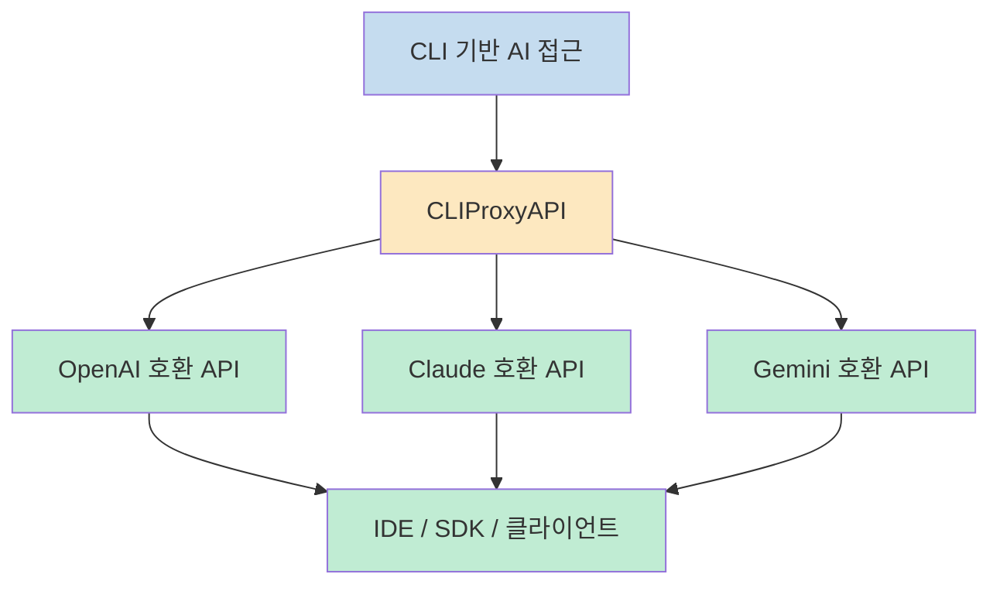
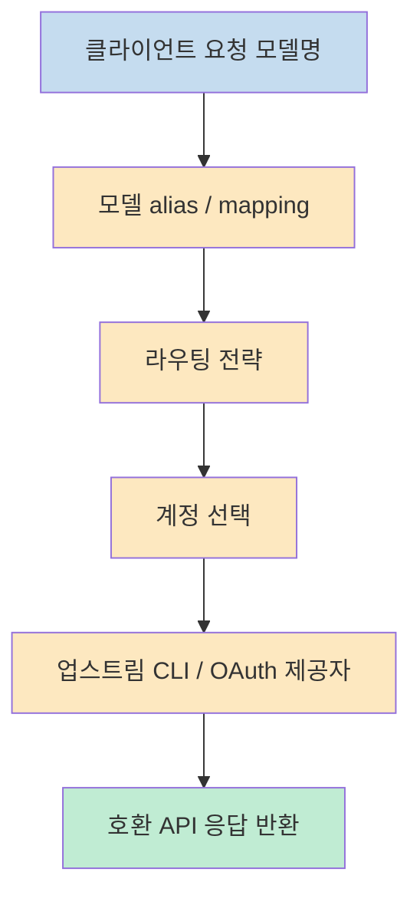
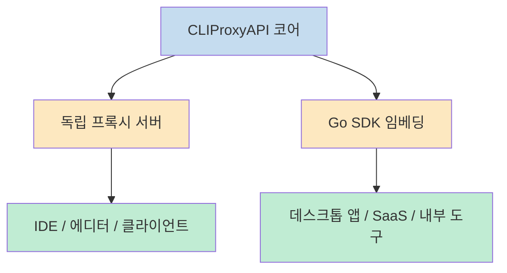

`CLIProxyAPI` 의 핵심은 아주 단순합니다. **CLI 기반 AI 도구를 표준 API 서버처럼 보이게 만든다** 는 것입니다. README는 이 프로젝트를 OpenAI/Gemini/Claude/Codex 호환 API 인터페이스를 제공하는 프록시 서버라고 설명하고, 로컬 또는 멀티 계정 기반 CLI 접근을 기존 클라이언트와 SDK에서 그대로 쓸 수 있게 해 준다고 밝힙니다. 즉 이 저장소는 새로운 모델을 만드는 것이 아니라, 이미 존재하는 CLI 기반 접근 방식을 더 많은 도구가 이해할 수 있는 API 계층으로 번역하는 역할을 합니다 (근거: [README](https://raw.githubusercontent.com/router-for-me/CLIProxyAPI/main/README.md)).

<!--more-->

## Sources

- https://github.com/router-for-me/CLIProxyAPI
- https://raw.githubusercontent.com/router-for-me/CLIProxyAPI/main/README.md
- https://raw.githubusercontent.com/router-for-me/CLIProxyAPI/main/config.example.yaml
- https://raw.githubusercontent.com/router-for-me/CLIProxyAPI/main/docs/sdk-usage.md
- https://raw.githubusercontent.com/router-for-me/CLIProxyAPI/main/docker-compose.yml

## 1) 이 프로젝트가 푸는 문제는 "CLI 모델을 다른 앱에서 어떻게 재사용할 것인가" 다

README가 가장 먼저 강조하는 문장은 이 저장소가 CLI용 모델을 OpenAI/Gemini/Claude/Codex 호환 API로 노출한다는 점입니다. 여기에 더해 OpenAI Codex와 Claude Code를 OAuth 로그인으로도 지원한다고 밝히고 있습니다. 즉 사용자는 특정 CLI 도구 안에서만 모델을 쓰는 대신, 그 접근 권한을 프록시 뒤로 감싸서 다른 클라이언트, SDK, IDE, 코딩 도구가 동일한 모델을 API 형태로 호출하게 만들 수 있습니다 (근거: [README](https://raw.githubusercontent.com/router-for-me/CLIProxyAPI/main/README.md)).

이 문제는 생각보다 실무적입니다. 예를 들어 이미 Gemini CLI, Claude Code, Codex 쪽에 인증된 계정이 있더라도, 많은 도구는 여전히 OpenAI 호환 API나 Claude 호환 엔드포인트를 기대합니다. CLIProxyAPI는 바로 이 간극을 메웁니다. README는 "local or multi-account CLI access" 를 OpenAI/Gemini/Claude 호환 클라이언트와 SDK에서 사용할 수 있다고 명시합니다. 즉 이 저장소의 본질은 모델 제공자가 아니라 **접근 방식 변환기** 입니다 (근거: [README](https://raw.githubusercontent.com/router-for-me/CLIProxyAPI/main/README.md)).

게다가 지원 범위도 넓습니다. README의 Overview는 Gemini, Claude, Codex 외에도 Qwen Code, iFlow, Amp CLI 지원, OpenAI-compatible upstream provider 구성, 멀티모달 입력, function calling/tools 지원 등을 나열합니다. 다시 말해 이 프로젝트는 단순히 "몇 개 모델을 우회 호출하는 프록시" 가 아니라, 여러 채널과 여러 프로토콜을 묶는 **AI 게이트웨이 성격** 을 띱니다 (근거: [README Overview](https://raw.githubusercontent.com/router-for-me/CLIProxyAPI/main/README.md)).

---

## 2) 핵심 구조는 단순 프록시가 아니라 "호환성 + 라우팅 + 계정 운영" 계층이다

이 저장소를 흥미롭게 만드는 지점은 단순한 reverse proxy가 아니라는 점입니다. README에는 스트리밍/비스트리밍 응답, function calling/tools 지원, 멀티모달 입력 지원, 여러 계정에 대한 round-robin 로드 밸런싱, 다양한 upstream provider 구성 기능이 함께 들어 있습니다. 즉 요청을 그냥 전달하는 것이 아니라, **어느 계정으로 보낼지, 어떤 모델 이름으로 매핑할지, 어떤 프로토콜 표면을 노출할지** 까지 관여합니다 (근거: [README Overview](https://raw.githubusercontent.com/router-for-me/CLIProxyAPI/main/README.md)).

`config.example.yaml` 을 보면 이 구조가 더 선명해집니다. 기본 포트는 `8317` 이고, 인증 저장소는 `~/.cli-proxy-api` 입니다. 여기에 `routing.strategy: "round-robin"`, `quota-exceeded.switch-project`, `switch-preview-model`, `force-model-prefix`, `oauth-model-alias`, `oauth-excluded-models`, `payload.default`, `payload.override`, `filter` 같은 설정이 붙어 있습니다. 이건 단순히 모델 하나를 대신 호출하는 수준이 아니라, **실제 운영 환경에서 계정·모델·쿼터·페이로드를 제어하는 정책 엔진** 에 가깝습니다 (근거: [config.example.yaml](https://raw.githubusercontent.com/router-for-me/CLIProxyAPI/main/config.example.yaml)).

특히 모델 매핑과 alias 기능은 실무적으로 중요합니다. README의 Amp CLI 섹션은 특정 모델이 없을 때 다른 대체 모델로 routing 하는 model mapping을 언급하고, `config.example.yaml` 은 `oauth-model-alias` 와 `excluded-models` 예시를 길게 제공합니다. 즉 사용자는 "클라이언트가 기대하는 모델 이름" 과 "실제로 호출 가능한 upstream 모델" 사이를 분리해서 운영할 수 있습니다. 이건 여러 제공자를 섞어 쓰거나, 공급자별 모델 availability가 다를 때 아주 유용한 방식입니다 (근거: [README Amp CLI Support](https://raw.githubusercontent.com/router-for-me/CLIProxyAPI/main/README.md), [config.example.yaml](https://raw.githubusercontent.com/router-for-me/CLIProxyAPI/main/config.example.yaml)).

---

## 3) 관리 API와 보안 설정은 "개발 편의성" 보다 운영성을 먼저 본다

`config.example.yaml` 에서 가장 눈에 띄는 부분 중 하나는 management API 설정입니다. `remote-management.allow-remote` 는 기본적으로 `false` 이고, localhost만 접근할 수 있게 되어 있으며, 심지어 localhost에서도 `secret-key` 가 필요합니다. 게다가 `secret-key` 를 비워 두면 `/v0/management` 전체가 404로 비활성화된다고 명시돼 있습니다. 즉 이 프로젝트는 관리 기능을 기본 오픈 상태로 두지 않고, **관리 평면을 별도로 잠그는 쪽** 을 기본값으로 택하고 있습니다 (근거: [config.example.yaml](https://raw.githubusercontent.com/router-for-me/CLIProxyAPI/main/config.example.yaml)).

README의 Amp CLI 섹션도 같은 철학을 보여 줍니다. provider route alias, management proxy, smart model fallback 같은 기능을 말하면서도 `Security-first design with localhost-only management endpoints` 를 명시합니다. 이건 중요한 포인트입니다. 이런 프록시는 인증 토큰, 여러 계정, 관리 패널, 로그, 라우팅 규칙을 다루기 때문에, 잘못 열어 두면 단순 개발 도구가 아니라 **위험한 내부 제어 평면** 이 될 수 있습니다 (근거: [README Amp CLI Support](https://raw.githubusercontent.com/router-for-me/CLIProxyAPI/main/README.md), [config.example.yaml](https://raw.githubusercontent.com/router-for-me/CLIProxyAPI/main/config.example.yaml)).

또한 프록시 설정 자체도 꽤 세밀합니다. 전역 `proxy-url`, per-entry proxy override, `direct`/`none` 지정, request retry, max retry credentials, quota exceeded 처리 등이 모두 설정 파일에 포함됩니다. 즉 이 저장소는 단순한 로컬 개발 도구를 넘어서, **여러 네트워크 제약과 계정 제약 속에서 안정적으로 모델 접근을 유지하려는 운영 요구** 를 전제로 설계된 것으로 읽는 편이 맞습니다 (근거: [config.example.yaml](https://raw.githubusercontent.com/router-for-me/CLIProxyAPI/main/config.example.yaml)).

---

## 4) SDK 제공은 이 프로젝트를 "서버" 에서 "내장 가능한 플랫폼" 으로 확장한다

`docs/sdk-usage.md` 가 특히 흥미로운 이유는 이 프로젝트를 단순 바이너리 서버로 두지 않고, Go 라이브러리로도 내장 가능하게 만들었다는 점입니다. 문서는 `sdk/cliproxy` 모듈이 proxy를 reusable Go library로 노출하며, 외부 프로그램이 routing, authentication, hot-reload, translation layer를 직접 임베드할 수 있다고 설명합니다. 즉 CLIProxyAPI는 단지 standalone proxy 프로세스가 아니라, **다른 제품 안에 끼워 넣을 수 있는 구성 요소** 이기도 합니다 (근거: [docs/sdk-usage.md](https://raw.githubusercontent.com/router-for-me/CLIProxyAPI/main/docs/sdk-usage.md)).

문서가 보여 주는 빌더 패턴도 꽤 실용적입니다. `WithConfig`, `WithConfigPath`, `WithServerOptions`, `WithMiddleware`, `WithRouterConfigurator`, `WithCoreAuthManager`, `WithTokenClientProvider` 같은 옵션을 통해 서버 동작과 인증 로직을 외부 프로그램이 세밀하게 조정할 수 있습니다. 이 말은 곧, 이 프로젝트의 가치가 단순한 API endpoint 제공에서 끝나지 않고, **라우팅/인증/관리 계층 자체를 재사용 가능한 인프라로 제공** 하는 데 있다는 뜻입니다 (근거: [docs/sdk-usage.md](https://raw.githubusercontent.com/router-for-me/CLIProxyAPI/main/docs/sdk-usage.md)).

이 구조는 "프록시를 쓰는 앱" 을 만들고 싶은 팀에게 특히 유리합니다. 예를 들어 내부 개발 도구나 데스크톱 앱, SaaS 백엔드, 관리 패널이 이 SDK를 그대로 감싸면, 별도 프로세스를 외부에서 호출하기보다 하나의 서비스 안에 내장할 수 있습니다. README가 여러 2차 프로젝트와 포크, 데스크톱 앱, 대시보드, 관리 패널을 길게 나열하는 이유도 결국 여기에 있습니다. CLIProxyAPI는 이미 **다른 제품들이 위에 올라타기 쉬운 기반층** 으로 작동하고 있습니다 (근거: [README Who is with us?](https://raw.githubusercontent.com/router-for-me/CLIProxyAPI/main/README.md), [docs/sdk-usage.md](https://raw.githubusercontent.com/router-for-me/CLIProxyAPI/main/docs/sdk-usage.md)).

---

## 5) 설치와 배포는 비교적 단순하지만, 실제 운영은 config 설계가 훨씬 중요하다

배포 측면만 보면 이 프로젝트는 생각보다 단순합니다. `docker-compose.yml` 은 `eceasy/cli-proxy-api:latest` 이미지를 기본으로 쓰고, `8317`, `8085`, `1455`, `54545`, `51121`, `11451` 포트를 열며, `config.yaml`, `auths`, `logs` 를 볼륨으로 마운트합니다. 즉 컨테이너 실행 자체는 어렵지 않습니다. 설정 파일과 인증 디렉터리만 준비되면 서버는 빠르게 띄울 수 있습니다 (근거: [docker-compose.yml](https://raw.githubusercontent.com/router-for-me/CLIProxyAPI/main/docker-compose.yml)).

하지만 진짜 어려운 부분은 배포가 아니라 운영 정책입니다. `config.example.yaml` 이 보여 주듯, 어떤 모델을 어떤 alias로 노출할지, 어떤 계정들을 어떤 전략으로 순환시킬지, quota exceeded 시 어떻게 fallback 할지, management API를 어디까지 열지, 프록시를 어떻게 적용할지 등을 결정해야 합니다. 다시 말해 이 프로젝트는 설치형 도구이지만, 실제 가치는 `docker compose up` 보다 **config.yaml 설계 능력** 에 더 크게 달려 있습니다 (근거: [config.example.yaml](https://raw.githubusercontent.com/router-for-me/CLIProxyAPI/main/config.example.yaml), [docker-compose.yml](https://raw.githubusercontent.com/router-for-me/CLIProxyAPI/main/docker-compose.yml)).

이 점에서 CLIProxyAPI는 많은 사용자가 기대하는 "간단한 우회 도구" 보다 훨씬 더 운영자 친화적인 프로젝트입니다. 잘 설정하면 강력하지만, 반대로 설정을 대충 하면 모델 충돌, 관리 평면 노출, 계정 소진, 애매한 routing 같은 문제가 생길 수 있습니다. 그래서 이 프로젝트를 평가할 때는 기능 개수보다도, **정책을 얼마나 세밀하게 제어할 수 있는가** 를 봐야 합니다 (근거: [README](https://raw.githubusercontent.com/router-for-me/CLIProxyAPI/main/README.md), [config.example.yaml](https://raw.githubusercontent.com/router-for-me/CLIProxyAPI/main/config.example.yaml)).

## 실전 적용 포인트

- 이 프로젝트의 본질은 "CLI 기반 AI 도구를 API처럼 다시 노출하는 프록시 레이어" 입니다 (근거: [README](https://raw.githubusercontent.com/router-for-me/CLIProxyAPI/main/README.md)).
- 단순 프록시가 아니라 모델 alias, 제외 규칙, 페이로드 override, 계정 로드밸런싱, 쿼터 전환까지 담당하는 정책 계층입니다 (근거: [config.example.yaml](https://raw.githubusercontent.com/router-for-me/CLIProxyAPI/main/config.example.yaml)).
- 관리 API는 기본적으로 닫혀 있고 localhost + secret-key 기반으로 보호되기 때문에, 운영 설계에서 보안을 꽤 진지하게 다루고 있습니다 (근거: [config.example.yaml](https://raw.githubusercontent.com/router-for-me/CLIProxyAPI/main/config.example.yaml)).
- Go SDK를 제공하므로 독립 프록시 서버로만 쓸 필요가 없고, 다른 애플리케이션 안에 내장하는 것도 가능합니다 (근거: [docs/sdk-usage.md](https://raw.githubusercontent.com/router-for-me/CLIProxyAPI/main/docs/sdk-usage.md)).
- 실제 도입 난이도는 Docker가 아니라 `config.yaml` 설계에서 결정됩니다 (근거: [docker-compose.yml](https://raw.githubusercontent.com/router-for-me/CLIProxyAPI/main/docker-compose.yml), [config.example.yaml](https://raw.githubusercontent.com/router-for-me/CLIProxyAPI/main/config.example.yaml)).

## 핵심 요약

- `CLIProxyAPI` 는 Gemini CLI, Claude Code, Codex 같은 CLI 접근을 OpenAI·Claude·Gemini 호환 API로 번역해 주는 프록시 서버입니다 (근거: [README](https://raw.githubusercontent.com/router-for-me/CLIProxyAPI/main/README.md)).
- 프로젝트의 진짜 강점은 호환성 자체보다도 멀티 계정, 라우팅, 모델 매핑, fallback, 페이로드 제어 같은 운영 기능에 있습니다 (근거: [README Overview](https://raw.githubusercontent.com/router-for-me/CLIProxyAPI/main/README.md), [config.example.yaml](https://raw.githubusercontent.com/router-for-me/CLIProxyAPI/main/config.example.yaml)).
- 관리 API는 기본적으로 보수적으로 잠겨 있고, localhost + secret-key 기반 보안 모델을 채택합니다 (근거: [config.example.yaml](https://raw.githubusercontent.com/router-for-me/CLIProxyAPI/main/config.example.yaml)).
- Go SDK가 있어서 독립 실행형 서버뿐 아니라 내장형 플랫폼 구성요소로도 활용할 수 있습니다 (근거: [docs/sdk-usage.md](https://raw.githubusercontent.com/router-for-me/CLIProxyAPI/main/docs/sdk-usage.md)).
- 따라서 이 프로젝트는 단순한 프록시를 넘어, 여러 AI 접근 방식을 통합하는 운영 게이트웨이로 보는 편이 더 정확합니다 (근거: [README](https://raw.githubusercontent.com/router-for-me/CLIProxyAPI/main/README.md)).

## 결론

CLIProxyAPI를 보고 가장 먼저 떠오르는 표현은 "프록시" 보다는 **AI 접근 통합 레이어** 입니다. 단순히 요청을 중계하는 수준을 넘어서, 어떤 모델을 어떤 이름으로 노출할지, 어떤 계정을 어떻게 순환시킬지, 어떤 프로토콜 표면으로 내보낼지, 관리 평면을 어떻게 잠글지까지 함께 설계하게 만듭니다. 그래서 이 프로젝트의 핵심 가치는 모델을 더 많이 붙이는 데 있지 않고, **AI 접근 경로를 운영 가능한 형태로 표준화하는 데** 있다고 보는 편이 맞습니다 (근거: [README](https://raw.githubusercontent.com/router-for-me/CLIProxyAPI/main/README.md), [config.example.yaml](https://raw.githubusercontent.com/router-for-me/CLIProxyAPI/main/config.example.yaml)).

특히 로컬 CLI 인증, 멀티 계정 운영, IDE/SDK 재사용, 관리 API 보호, SDK 임베딩까지 한데 묶었다는 점에서, 이 프로젝트는 개인 해커용 유틸리티이면서 동시에 팀 단위 AI 인프라 부품으로도 읽힙니다. 결국 이 저장소가 던지는 질문은 "어떤 모델을 쓸까" 가 아니라, **여러 모델과 여러 계정을 어떻게 하나의 안정된 인터페이스 뒤로 숨길까** 에 더 가깝습니다 (근거: [README](https://raw.githubusercontent.com/router-for-me/CLIProxyAPI/main/README.md), [docs/sdk-usage.md](https://raw.githubusercontent.com/router-for-me/CLIProxyAPI/main/docs/sdk-usage.md)).
