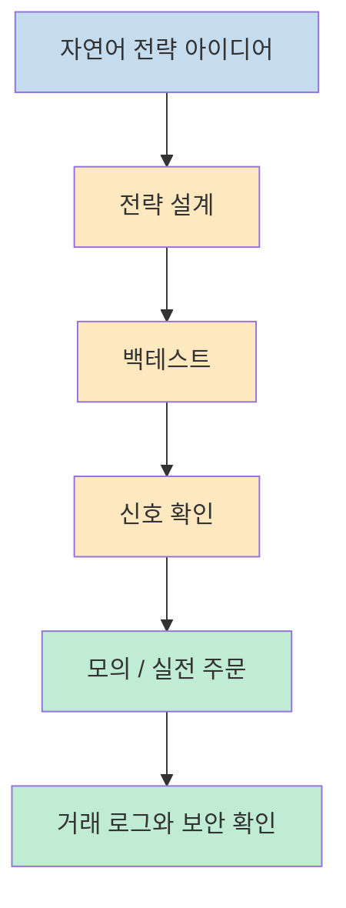
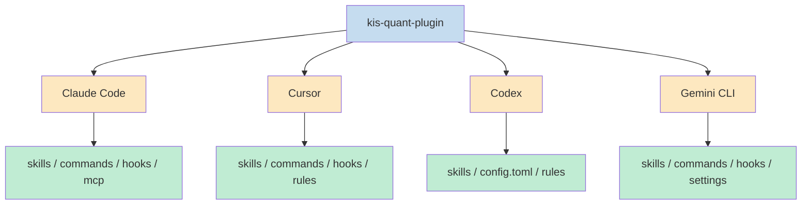
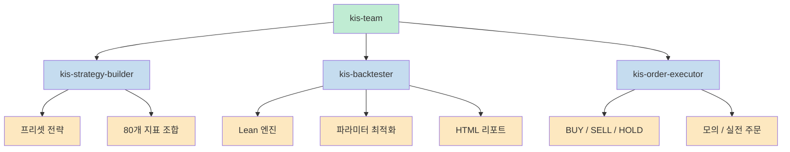
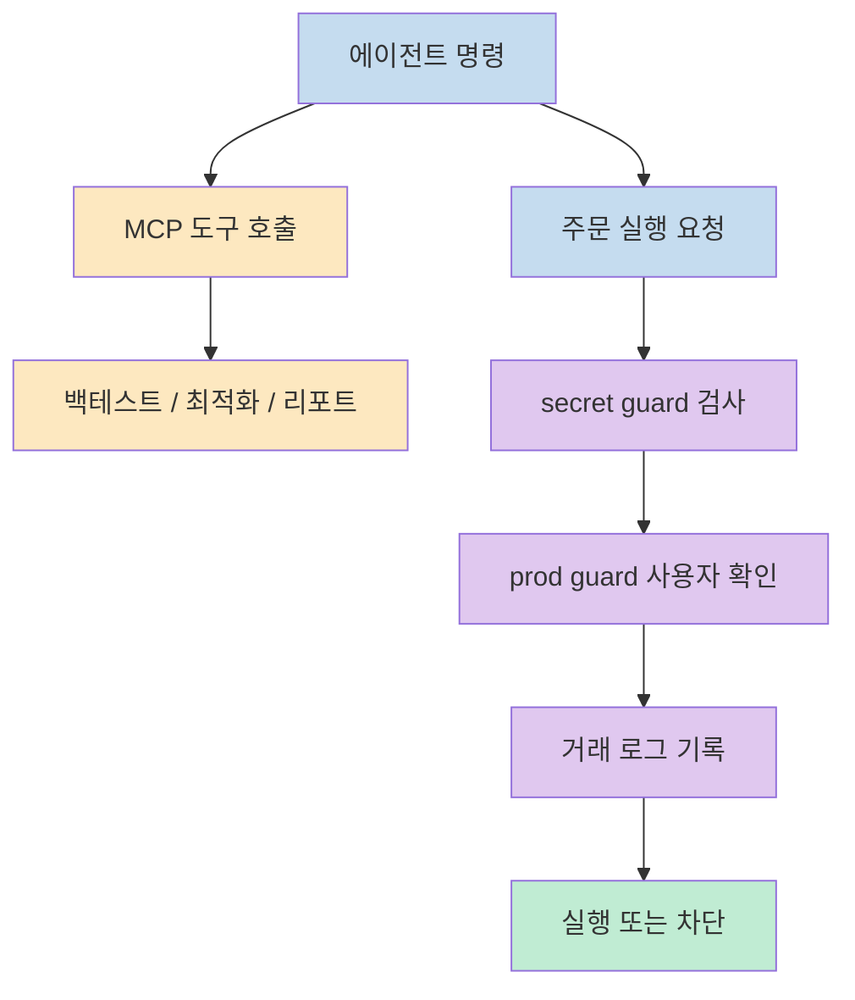

`kis-ai-extensions` 의 핵심은 한국투자증권 OpenAPI를 단순히 감싼 래퍼가 아니라, **AI 코딩 에이전트 안에서 전략 설계 → 백테스트 → 주문 실행** 으로 이어지는 파이프라인 전체를 자연어 중심으로 다룰 수 있게 만드는 플러그인 세트라는 점입니다. README는 이 프로젝트를 `@koreainvestment/kis-quant-plugin` 패키지 중심의 확장 기능 모음으로 설명하며, Claude Code·Cursor·Codex·Gemini CLI 같은 주요 AI 에이전트에서 같은 워크플로우를 재사용할 수 있게 설계했다고 밝힙니다 (근거: [README](https://raw.githubusercontent.com/koreainvestment/kis-ai-extensions/main/README.md), [package.json](https://raw.githubusercontent.com/koreainvestment/kis-ai-extensions/main/package.json)).

<!--more-->

## Sources

- https://github.com/koreainvestment/kis-ai-extensions
- https://raw.githubusercontent.com/koreainvestment/kis-ai-extensions/main/README.md
- https://raw.githubusercontent.com/koreainvestment/kis-ai-extensions/main/package.json

## 1) 이 저장소는 무엇을 해결하나: KIS OpenAPI를 AI 에이전트용 작업 파이프라인으로 바꾼다

README가 가장 먼저 강조하는 문장은 이 플러그인이 한국투자 OpenAPI 기반의 **전략 설계 → 백테스팅 → 주문 실행** 파이프라인을 AI 코딩 에이전트에서 자연어로 조작할 수 있게 해 준다는 점입니다. 즉 사용자는 API 엔드포인트를 직접 조합하거나 주문 로직을 처음부터 연결하기보다, 에이전트에게 자연어로 전략을 설명하고, 백테스트를 돌리고, 신호를 확인하고, 주문까지 이어 가는 상위 인터페이스를 얻게 됩니다 (근거: [README](https://raw.githubusercontent.com/koreainvestment/kis-ai-extensions/main/README.md)).

이 관점은 `package.json` 에도 그대로 반영됩니다. 패키지 설명은 이 도구를 "strategy design, backtesting, and order execution via natural language" 로 정의하고 있고, 키워드에도 `claude-code`, `cursor`, `codex`, `gemini`, `mcp`, `quant`, `autotrade` 같은 항목이 함께 들어 있습니다. 즉 이 프로젝트의 본질은 투자 API를 위한 단순 SDK가 아니라, **AI 에이전트 중심의 퀀트 투자 워크플로우 도구** 입니다 (근거: [package.json](https://raw.githubusercontent.com/koreainvestment/kis-ai-extensions/main/package.json)).

README의 기능 목록도 이 해석을 강화합니다. 전략 설계, Docker 기반 백테스팅, 신호 기반 주문, 보안 훅, MCP 서버가 한 세트로 묶여 있습니다. 다시 말해 이 저장소는 어떤 단일 기능 하나보다, **아이디어를 전략으로 바꾸고 검증한 뒤 실제 주문까지 연결하는 운영 흐름** 을 제공하는 데 초점이 있습니다 (근거: [README Features](https://raw.githubusercontent.com/koreainvestment/kis-ai-extensions/main/README.md)).

---

## 2) 어떤 에이전트를 지원하나: Claude Code, Cursor, Codex, Gemini CLI를 같은 구조로 묶는다

이 저장소가 흥미로운 이유 중 하나는 특정 에이전트 하나에 묶이지 않는다는 점입니다. README는 설치 명령에서 `--agent claude`, `cursor`, `codex`, `gemini`, `all` 옵션을 제공하고, 각 에이전트별 설치 후 디렉터리 구조를 따로 보여 줍니다. 이 말은 곧 플러그인의 핵심 로직은 공통으로 유지하면서도, 각 도구의 설정 방식에 맞춰 **self-contained 구조로 배포** 한다는 뜻입니다 (근거: [README Installation](https://raw.githubusercontent.com/koreainvestment/kis-ai-extensions/main/README.md)).

예를 들어 Claude Code는 `.claude/` 아래에 `scripts/`, `skills/`, `commands/`, `hooks/`, `status_lines/`, `logs/` 를 두고 `.mcp.json` 과 `AGENTS.md` 를 함께 둡니다. Cursor는 `.cursor/` 아래에 hooks와 rules를, Codex는 `.codex/` 와 `config.toml`, Gemini CLI는 `.gemini/` 와 `settings.json` 을 씁니다. 즉 저장소는 "에이전트별 차이" 를 숨기지 않고 인정하면서도, 사용자가 체감하는 기능 집합은 최대한 동일하게 유지하려고 합니다 (근거: [README 에이전트별 설치 후 구조](https://raw.githubusercontent.com/koreainvestment/kis-ai-extensions/main/README.md)).

실무적으로 보면 이 구조의 장점은 분명합니다. 같은 투자/백테스트 워크플로우를 도구마다 새로 설계할 필요 없이, 팀이 어떤 에이전트를 쓰든 비슷한 명령과 스킬 묶음을 공유할 수 있습니다. README가 자급자족형 구조라고 표현한 이유도 여기에 있습니다. 플러그인 파일이 각 에이전트 디렉터리 안에 들어가기 때문에 이동성과 관리성이 좋아집니다 (근거: [README 에이전트별 설치 후 구조](https://raw.githubusercontent.com/koreainvestment/kis-ai-extensions/main/README.md)).

---

## 3) 실제 기능은 어떻게 나뉘나: strategy-builder, backtester, order-executor, team

README가 정의한 핵심 스킬은 다섯 개입니다. `kis-strategy-builder`, `kis-backtester`, `kis-order-executor`, `kis-team`, `kis-cs` 가 그것입니다. 각각의 역할이 명확해서, 이 저장소가 단순한 명령어 모음이 아니라 **기능 단위로 설계된 에이전트 도구 상자** 라는 점이 잘 드러납니다 (근거: [README Skills](https://raw.githubusercontent.com/koreainvestment/kis-ai-extensions/main/README.md)).

`kis-strategy-builder` 는 10개 프리셋 전략과 80개 기술지표 조합을 바탕으로 `.kis.yaml` 전략을 설계합니다. `kis-backtester` 는 QuantConnect Lean 엔진을 이용한 백테스트, 파라미터 최적화, HTML 리포트를 담당합니다. `kis-order-executor` 는 BUY/SELL/HOLD 신호와 강도를 확인한 뒤 모의/실전 주문을 실행합니다. 그리고 `kis-team` 은 이 세 단계를 하나의 풀 파이프라인으로 연결합니다. 즉 단계별로 쪼개서 쓸 수도 있고, 전체를 한 번에 묶어서 실행할 수도 있게 설계한 셈입니다 (근거: [README Features](https://raw.githubusercontent.com/koreainvestment/kis-ai-extensions/main/README.md), [README Skills](https://raw.githubusercontent.com/koreainvestment/kis-ai-extensions/main/README.md)).

특히 README는 10개 프리셋 전략을 꽤 구체적으로 나열합니다. 골든크로스, 모멘텀, 52주 신고가, 연속 상승/하락, 이격도, 돌파 실패, 강한 종가, 변동성 확장, 평균회귀, 추세 필터가 들어 있습니다. 이 부분은 중요한데, 단순히 "전략을 만들어 준다" 가 아니라 **즉시 활용 가능한 전략 템플릿과 커스텀 조합을 동시에 제공** 한다는 의미이기 때문입니다 (근거: [README 10개 프리셋 전략](https://raw.githubusercontent.com/koreainvestment/kis-ai-extensions/main/README.md)).

---

## 4) 설치와 실행 흐름은 어떻게 이어지나: open-trading-api 위에 플러그인을 얹는다

설치 흐름을 보면 이 저장소가 독립 실행형이라기보다 `open-trading-api` 메인 저장소 위에 얹히는 형태라는 걸 알 수 있습니다. README는 먼저 `open-trading-api` 저장소를 clone 하고, 그 안에서 `uv sync` 로 Python 의존성을 맞추라고 안내합니다. 이후 `npx @koreainvestment/kis-quant-plugin init --agent claude` 같은 명령으로 원하는 에이전트용 확장을 설치합니다 (근거: [README Installation](https://raw.githubusercontent.com/koreainvestment/kis-ai-extensions/main/README.md)).

사전 요구사항도 명확합니다. Python 3.11+, uv, Node.js 18+, Docker Desktop, KIS Open API 앱키/시크릿이 필요합니다. 이 조합만 봐도 저장소가 단순 프런트엔드 플러그인이나 단순 스크립트 모음이 아니라, **Python 기반 전략/백테스팅, Node 기반 CLI, Docker 기반 Lean 엔진, 증권사 API 인증** 이 한 번에 연결되는 구조라는 걸 알 수 있습니다 (근거: [README Prerequisites](https://raw.githubusercontent.com/koreainvestment/kis-ai-extensions/main/README.md), [package.json engines](https://raw.githubusercontent.com/koreainvestment/kis-ai-extensions/main/package.json)).

설치 후 사용 흐름도 일관적입니다. `/kis-setup` 으로 환경 진단을 하고, `/auth vps` 또는 `/auth prod` 로 인증하고, `/my-status` 로 계좌 상태를 확인합니다. 그 다음 전략 설계, 백테스트, 주문 단계로 넘어갑니다. 즉 에이전트 안에서의 사용자 경험은 결국 **진단 → 인증 → 상태 확인 → 전략/검증/실행** 으로 표준화되어 있습니다 (근거: [README Installation](https://raw.githubusercontent.com/koreainvestment/kis-ai-extensions/main/README.md), [README Commands](https://raw.githubusercontent.com/koreainvestment/kis-ai-extensions/main/README.md)).

---

## 5) 왜 MCP와 보안 훅이 중요한가: 금융 도메인에서 에이전트 자동화를 버틸 최소 장치

이 저장소에서 가장 인상적인 부분은 MCP 서버와 보안 훅입니다. README는 백테스팅 엔진이 MCP(Model Context Protocol) 서버로 동작하며, `run_backtest`, `optimize_params`, `get_report`, `list_strategies` 같은 도구를 통해 AI 에이전트가 백테스트를 호출할 수 있다고 설명합니다. 즉 백테스터를 단순 외부 프로그램으로 두는 것이 아니라, **에이전트가 안전하게 부를 수 있는 표준 도구 인터페이스** 로 승격시킨 셈입니다 (근거: [README MCP Server](https://raw.githubusercontent.com/koreainvestment/kis-ai-extensions/main/README.md)).

보안 쪽도 금융 도메인답게 꽤 공격적으로 설계돼 있습니다. Claude Code와 Gemini CLI 쪽에는 `kis-secret-guard`, `kis-prod-guard`, `kis-trade-log`, `kis-mcp-log` 훅이 있고, Cursor는 훅 모델이 달라 `kis-safety.mdc` 규칙으로 대체합니다. 특히 실전 주문에서는 사용자 확인을 강제하고, `appkey`, `appsecret`, 토큰 같은 민감 정보의 출력과 하드코딩을 금지합니다. 또한 신호 강도 0.5 미만이면 주문을 자동으로 건너뛰는 안전 규칙도 명시돼 있습니다 (근거: [README Security](https://raw.githubusercontent.com/koreainvestment/kis-ai-extensions/main/README.md)).

이 부분이 중요한 이유는, 투자 자동화에서 에이전트의 편의성보다 더 먼저 필요한 것이 **오작동 억제 장치** 이기 때문입니다. 저장소가 백테스트와 주문 기능만 강조하지 않고, 실전 주문 안전장치와 로그 계층을 함께 배치한 것은 이 프로젝트를 단순 데모가 아니라 실제 사용 가능한 운영 도구로 만들려는 의도가 강하다는 신호로 볼 수 있습니다 (근거: [README Security](https://raw.githubusercontent.com/koreainvestment/kis-ai-extensions/main/README.md), [README MCP Tools](https://raw.githubusercontent.com/koreainvestment/kis-ai-extensions/main/README.md)).

## 실전 적용 포인트

- 이 저장소는 KIS OpenAPI를 AI 에이전트용 자연어 인터페이스로 감싼 **퀀트 투자 워크플로우 도구** 로 보는 게 가장 정확합니다 (근거: [README](https://raw.githubusercontent.com/koreainvestment/kis-ai-extensions/main/README.md), [package.json](https://raw.githubusercontent.com/koreainvestment/kis-ai-extensions/main/package.json)).
- 특정 에이전트 하나만 지원하는 것이 아니라 Claude Code, Cursor, Codex, Gemini CLI에 같은 기능 집합을 배포하도록 설계돼 있습니다 (근거: [README Installation](https://raw.githubusercontent.com/koreainvestment/kis-ai-extensions/main/README.md)).
- 전략 설계, 백테스트, 주문 실행이 각각 스킬로 분리되어 있고 `kis-team` 으로 전체 파이프라인을 묶을 수 있습니다 (근거: [README Skills](https://raw.githubusercontent.com/koreainvestment/kis-ai-extensions/main/README.md)).
- 설치 자체보다 중요한 건 의존성 구조입니다. Python, uv, Node, Docker, KIS Open API 인증이 모두 맞아야 전체 흐름이 동작합니다 (근거: [README Prerequisites](https://raw.githubusercontent.com/koreainvestment/kis-ai-extensions/main/README.md)).
- 금융 도메인 특성상 MCP 서버보다 더 중요한 것은 보안 훅과 사용자 승인 규칙입니다. 이 저장소는 그 부분을 비교적 구체적으로 문서화하고 있습니다 (근거: [README Security](https://raw.githubusercontent.com/koreainvestment/kis-ai-extensions/main/README.md)).

## 핵심 요약

- `kis-ai-extensions` 는 KIS OpenAPI를 AI 에이전트에서 자연어로 다루게 하는 `kis-quant-plugin` 중심 확장 저장소입니다 (근거: [README](https://raw.githubusercontent.com/koreainvestment/kis-ai-extensions/main/README.md), [package.json](https://raw.githubusercontent.com/koreainvestment/kis-ai-extensions/main/package.json)).
- 핵심 흐름은 전략 설계 → 백테스트 → 주문 실행이며, 이 흐름을 스킬과 명령으로 에이전트 안에서 조작할 수 있게 합니다 (근거: [README Features](https://raw.githubusercontent.com/koreainvestment/kis-ai-extensions/main/README.md), [README Commands](https://raw.githubusercontent.com/koreainvestment/kis-ai-extensions/main/README.md)).
- Claude Code, Cursor, Codex, Gemini CLI를 모두 지원하고, 각 에이전트 디렉터리 안에 self-contained 구조로 설치됩니다 (근거: [README 에이전트별 설치 후 구조](https://raw.githubusercontent.com/koreainvestment/kis-ai-extensions/main/README.md)).
- Lean 기반 백테스터를 MCP 서버로 연결하고, 보안 훅으로 민감정보 출력과 실전 주문을 통제하는 점이 이 저장소의 강한 차별점입니다 (근거: [README MCP Server](https://raw.githubusercontent.com/koreainvestment/kis-ai-extensions/main/README.md), [README Security](https://raw.githubusercontent.com/koreainvestment/kis-ai-extensions/main/README.md)).
- 결국 이 프로젝트는 단순 API wrapper라기보다, AI 에이전트 기반 퀀트 투자 자동화의 운영 레이어에 더 가깝습니다 (근거: [README](https://raw.githubusercontent.com/koreainvestment/kis-ai-extensions/main/README.md)).

## 결론

`kis-ai-extensions` 를 보고 가장 먼저 드는 생각은, 한국투자 OpenAPI를 위한 도구가 아니라 **AI 에이전트가 금융 도메인에서 일할 수 있게 만드는 실행 환경** 에 더 가깝다는 점입니다. 전략을 설계하고, 검증하고, 주문을 넣는 과정 자체는 익숙할 수 있지만, 이를 에이전트 친화적인 스킬·명령·MCP·보안 훅 구조로 다시 묶어낸 것이 이 저장소의 진짜 가치입니다 (근거: [README](https://raw.githubusercontent.com/koreainvestment/kis-ai-extensions/main/README.md)).

특히 실전 자동화에서 중요한 것은 "자연어로 주문할 수 있다" 는 편리함보다, 그 편리함이 어디까지 통제되고 검증되는가입니다. 이 저장소는 바로 그 지점, 즉 **에이전트 자동화와 금융 안전장치 사이의 균형** 을 어떻게 설계할지를 꽤 구체적으로 보여 주는 사례라고 볼 수 있습니다 (근거: [README Security](https://raw.githubusercontent.com/koreainvestment/kis-ai-extensions/main/README.md), [README MCP Server](https://raw.githubusercontent.com/koreainvestment/kis-ai-extensions/main/README.md)).
