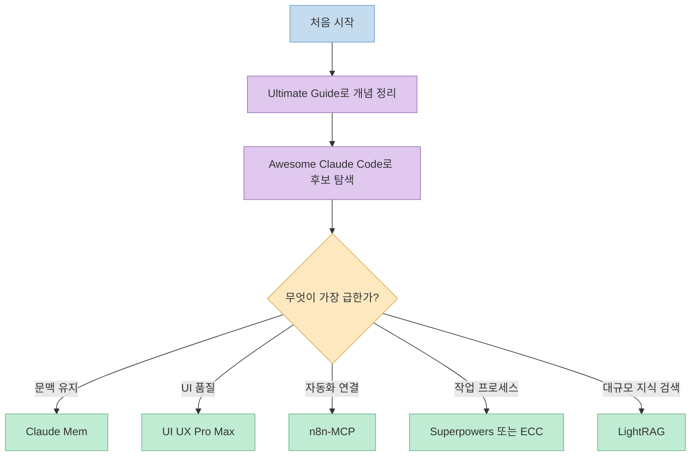

Claude Code 관련 저장소가 빠르게 늘어나면서, 이제는 "무엇이 유명한가"보다 "내 워크플로우에 어떤 레이어를 추가해 주는가"가 더 중요해졌습니다. 이 글은 커뮤니티에서 돌던 추천 목록을 바탕으로, 링크 오류와 중복 항목을 바로잡고 실제 GitHub 저장소 기준으로 다시 정리한 큐레이션입니다.
<!--more-->

검증한 저장소 링크는 아래와 같습니다.

- [thedotmack/claude-mem](https://github.com/thedotmack/claude-mem)
- [nextlevelbuilder/ui-ux-pro-max-skill](https://github.com/nextlevelbuilder/ui-ux-pro-max-skill)
- [czlonkowski/n8n-mcp](https://github.com/czlonkowski/n8n-mcp)
- [HKUDS/LightRAG](https://github.com/HKUDS/LightRAG)
- [affaan-m/everything-claude-code](https://github.com/affaan-m/everything-claude-code)
- [hesreallyhim/awesome-claude-code](https://github.com/hesreallyhim/awesome-claude-code)
- [obra/superpowers](https://github.com/obra/superpowers)
- [FlorianBruniaux/claude-code-ultimate-guide](https://github.com/FlorianBruniaux/claude-code-ultimate-guide)
- [sickn33/antigravity-awesome-skills](https://github.com/sickn33/antigravity-awesome-skills)
- [danielrosehill/Claude-Code-Projects-Index](https://github.com/danielrosehill/Claude-Code-Projects-Index)
- [mbailey/voicemode](https://github.com/mbailey/voicemode)
- [ComposioHQ/awesome-claude-plugins](https://github.com/ComposioHQ/awesome-claude-plugins)

먼저 정리할 점이 있습니다.

- 원문의 2번 `UI UX Pro Max` 링크는 `n8n-mcp` 로 잘못 붙어 있었습니다. 실제로는 `nextlevelbuilder/ui-ux-pro-max-skill` 저장소를 보는 편이 맞습니다.
- 원문의 6번 `Awesome Claude Code` 는 `sickn33/antigravity-awesome-skills` 가 아니라 `hesreallyhim/awesome-claude-code` 로 정리하는 것이 자연스럽습니다.
- `Claude-Agent-Blueprints` 는 현재 GitHub에서 `Claude-Code-Projects-Index` 로 리다이렉트됩니다.

이 12개를 한 번에 외우기보다는, 아래처럼 네 개 레이어로 나눠 보면 훨씬 이해가 쉽습니다.

```mermaid
flowchart TD
    Start["Claude Code 활용 목표"] --> M["문맥 유지"]
    Start --> U["UI / 자동화 / 인터페이스"]
    Start --> W["워크플로우 강화"]
    Start --> L["학습 / 카탈로그"]

    M --> M1["Claude Mem"]
    M --> M2["LightRAG"]

    U --> U1["UI UX Pro Max"]
    U --> U2["n8n-MCP"]
    U --> U3["VoiceMode"]

    W --> W1["Everything Claude Code"]
    W --> W2["Awesome Claude Code"]
    W --> W3["Antigravity Awesome Skills"]
    W --> W4["Superpowers"]

    L --> L1["Ultimate Guide"]
    L --> L2["Claude Agent Blueprints"]
    L --> L3["Awesome Claude Plugins"]

    classDef rootTone fill:#c5dcef,color:#333,stroke:#6d9dc5,stroke-width:1px;
    classDef memoryTone fill:#c0ecd3,color:#333,stroke:#6ab38a,stroke-width:1px;
    classDef interfaceTone fill:#fde8c0,color:#333,stroke:#d9ab4d,stroke-width:1px;
    classDef workflowTone fill:#e0c8ef,color:#333,stroke:#9a74b5,stroke-width:1px;
    classDef learningTone fill:#ffc8c4,color:#333,stroke:#cf7f79,stroke-width:1px;

    class Start rootTone
    class M,M1,M2 memoryTone
    class U,U1,U2,U3 interfaceTone
    class W,W1,W2,W3,W4 workflowTone
    class L,L1,L2,L3 learningTone
```

## 1. 문맥을 쌓아 주는 저장소

### 1.1. [Claude Mem](https://github.com/thedotmack/claude-mem)
**Claude Mem** 은 세션 사이에 문맥을 이어 붙이는 메모리 계층에 가깝습니다. README 기준으로 도구 사용 관찰을 저장하고, 이를 의미적으로 요약한 뒤 다음 세션에 다시 주입하는 구조를 갖고 있습니다.

이 저장소가 좋은 이유는 단순히 "기억한다"가 아니라, 장기 프로젝트에서 반복 설명 비용을 줄여 준다는 점입니다. 며칠에 걸쳐 이어지는 리팩터링, 여러 브랜치를 넘나드는 작업, 혹은 혼자서 여러 저장소를 병행하는 경우에 특히 체감이 큽니다.

다만 메모리를 붙인다고 모든 문제가 해결되지는 않습니다. 오래된 관찰이 계속 쌓이면 오히려 문맥 오염이 생길 수 있으므로, 어떤 정보를 저장하고 어떤 정보는 제외할지에 대한 운영 기준이 필요합니다.

### 1.2. [LightRAG](https://github.com/HKUDS/LightRAG)
**LightRAG** 는 벡터 검색만으로 놓치기 쉬운 관계를 그래프 레이어로 보완하는 접근입니다. 프로젝트 README에서도 그래프 저장소와 벡터 저장소를 함께 다루며, 지식 그래프 시각화와 엔티티/관계 편집 기능을 강조합니다.

Claude Code와 직접 연결된 전용 저장소는 아니지만, 코드베이스나 문서 집합이 커졌을 때 "이 함수가 어디에서 의미를 갖는가", "이 개념이 다른 모듈과 어떻게 연결되는가" 같은 질문에 더 구조적으로 접근할 수 있다는 점이 강점입니다.

즉, **Claude Mem** 이 세션 히스토리 기억이라면, **LightRAG** 는 프로젝트 지식베이스의 구조화에 가깝습니다. 둘은 경쟁 관계라기보다 서로 다른 층위의 보완재로 보는 편이 맞습니다.

## 2. UI, 자동화, 인터페이스를 확장하는 저장소

### 2.1. [UI UX Pro Max](https://github.com/nextlevelbuilder/ui-ux-pro-max-skill)
**UI UX Pro Max** 는 디자인 감각을 Claude Code에 주입하는 스킬 세트입니다. 현재 README 기준으로 67개 스타일, 161개 컬러 팔레트, 57개 폰트 조합, 161개 카테고리 규칙을 바탕으로 디자인 방향을 추천합니다.

이 저장소의 핵심은 예쁜 컴포넌트 몇 개를 복사해 주는 것이 아니라, 요청을 받았을 때 적절한 스타일, 색, 타이포그래피, UX 규칙을 검색해 추천하는 "디자인 지식 베이스"로 동작한다는 점입니다. 랜딩 페이지, 대시보드, 모바일 UI처럼 Claude가 평범하고 안전한 디자인으로 수렴하기 쉬운 작업에서 특히 효과가 큽니다.

반대로 이미 팀의 디자인 시스템이 아주 강한 프로젝트라면, 이 저장소를 그대로 강하게 적용하는 것보다 참조 레이어로 두는 편이 더 낫습니다.

### 2.2. [n8n-MCP](https://github.com/czlonkowski/n8n-mcp)
**n8n-MCP** 는 Claude Code가 n8n 워크플로를 설계하고, 검사하고, 실행하는 데 도움을 주는 MCP 서버입니다. README 기준으로 1,396개의 n8n 워크플로우 노드 문서에 접근할 수 있고, 워크플로우 테스트, 실행 관리, 자격 증명 관리, 인스턴스 감사 같은 운영 도구도 함께 제공합니다.

원문에는 "400+ integration" 같은 표현이 있었는데, 실제로 중요한 포인트는 숫자보다 **Claude가 n8n이라는 자동화 허브를 경유해 외부 시스템과 연결되는 작업 흐름을 다룰 수 있다** 는 점입니다. 즉 직접 모든 SaaS를 Claude에 붙이는 대신, n8n을 허브로 두고 자동화 체인을 설계하는 방식입니다.

자동화 파이프라인을 많이 쓰는 팀이라면, 이 저장소는 Claude Code를 단순 코딩 도구가 아니라 운영 워크플로우 설계 도구로 확장해 줍니다.

### 2.3. [VoiceMode MCP](https://github.com/mbailey/voicemode)
**VoiceMode** 는 이름 그대로 Claude Code에 양방향 음성 인터페이스를 붙이는 프로젝트입니다. README도 "typing을 대체하는 것"보다, 손이나 눈을 쓰기 어려운 순간에 Claude를 계속 사용할 수 있게 하는 데 초점을 둡니다.

이 저장소가 흥미로운 이유는 생산성 그 자체보다 **작업 입력 방식의 전환** 에 있습니다. 산책 중이거나, 회의실 이동 중이거나, 모니터를 오래 보기 어려운 상황에서 터미널 기반 코딩 에이전트와 계속 상호작용할 수 있게 만드는 방향이기 때문입니다.

즉, 음성은 부가기능이 아니라 Claude Code의 사용 가능한 시간을 늘리는 인터페이스 확장이라고 보는 편이 더 정확합니다.

## 3. Claude Code 워크플로우를 강화하는 저장소

### 3.1. [Everything Claude Code](https://github.com/affaan-m/everything-claude-code)
**Everything Claude Code** 는 스킬 몇 개를 모아 둔 저장소라기보다, 에이전트 하네스 전체를 성능 관점에서 다듬는 시스템에 가깝습니다. 저장소 소개도 skills, instincts, memory, security, research-first development를 한 번에 묶어 설명합니다.

이런 류의 저장소는 개별 명령 하나보다 **작업 습관을 강하게 규정** 합니다. 코드 작성 전에 조사, 보안, 메모리, 검증 같은 레이어를 먼저 세우게 만들기 때문에, 혼자 쓸 때는 생산성이 오르고 팀에 바로 넣으면 다소 무겁게 느껴질 수 있습니다.

따라서 이 저장소는 "당장 설치해서 다 켜기"보다, 내 작업 흐름에 필요한 규율만 골라 이식하는 방식이 현실적입니다.

### 3.2. [Awesome Claude Code](https://github.com/hesreallyhim/awesome-claude-code)
**Awesome Claude Code** 는 Claude Code 주변 생태계를 넓게 훑고 싶을 때 가장 먼저 보는 큐레이션 허브 중 하나입니다. README를 보면 skills, agents, plugins, hooks, slash-commands, workflows 등 분류 체계가 잘 잡혀 있습니다.

이 저장소의 장점은 많다는 사실 자체보다 **선별되어 있다는 점** 입니다. 무작정 대량의 스킬을 설치하기보다, 지금 필요한 범주의 자료를 먼저 찾고 비교할 수 있게 도와줍니다.

즉 처음 진입할 때는 설치 저장소라기보다 "Claude Code 생태계 지도"로 보는 것이 맞습니다.

### 3.3. [Antigravity Awesome Skills](https://github.com/sickn33/antigravity-awesome-skills)
**Antigravity Awesome Skills** 는 현재 README 기준 1,344개 이상의 agentic skills를 제공하는 대형 라이브러리입니다. 설치형 카탈로그라는 점에서, 특정 작업을 즉시 확장하고 싶은 사용자에게 매우 실용적입니다.

이 저장소의 강점은 폭입니다. 계획, 코딩, 디버깅, 테스트, 보안, 인프라, 제품 업무까지 범위가 넓어서, "필요한 스킬이 대체로 이미 있을 가능성"이 높습니다.

하지만 이런 대형 저장소는 언제나 역효과도 있습니다. 너무 많은 스킬을 한 번에 넣으면 호출 기준이 흐려지고, 컨텍스트 비용이 커질 수 있습니다. 그래서 초반에는 필요한 도메인만 골라 좁게 쓰는 편이 낫습니다.

### 3.4. [Superpowers](https://github.com/obra/superpowers)
**Superpowers** 는 단순한 스킬 모음이 아니라, 에이전트가 코드를 쓰기 전에 먼저 생각하게 만드는 워크플로우 프레임워크입니다. README도 "바로 코드를 쓰지 않고, 먼저 무엇을 만들려는지 묻는다"는 점을 핵심으로 설명합니다.

이 저장소가 강력한 이유는 생산성 비결이 프롬프트 트릭이 아니라 **작업 순서의 재설계** 라는 점을 보여 주기 때문입니다. 특히 스펙 작성, 계획 수립, 검증 같은 단계를 강제하면, 큰 작업일수록 품질 차이가 벌어집니다.

다만 이런 구조는 소규모 수정에도 다소 무겁게 느껴질 수 있으므로, 팀 전체 표준으로 채택할지, 특정 프로젝트에서만 사용할지 판단이 필요합니다.

## 4. 학습, 카탈로그, 템플릿 관점에서 볼 저장소

### 4.1. [Claude Code Ultimate Guide](https://github.com/FlorianBruniaux/claude-code-ultimate-guide)
**Claude Code Ultimate Guide** 는 설치형 도구라기보다 학습용 레퍼런스에 가깝습니다. 현재 README 기준으로 41개의 Mermaid 다이어그램과 271문항 퀴즈, 그리고 다수의 템플릿을 통해 초보자부터 파워 유저까지 연결하는 구성이 강점입니다.

이 저장소가 좋은 이유는 설정법만 나열하지 않고, agents와 skills와 commands를 언제 어떻게 써야 하는지에 대한 **멘탈 모델** 을 만들어 준다는 점입니다. 툴을 여러 개 붙였는데도 왜 생산성이 오르지 않는지 고민하는 사람에게 특히 유용합니다.

설치를 늘리기 전에 먼저 이 저장소로 사고방식을 정리하는 접근도 충분히 합리적입니다.

### 4.2. [Claude Agent Blueprints](https://github.com/danielrosehill/Claude-Code-Projects-Index)
이 항목은 현재 GitHub에서 `Claude-Code-Projects-Index` 로 연결됩니다. 저장소 설명대로, 다양한 코드/비코드 시나리오를 위한 에이전트 워크스페이스 템플릿을 폭넓게 모아 둔 인덱스입니다.

특히 README에는 `Claude Agent Blueprints` 를 75개 이상의 agent workspace templates로 소개하고 있어서, "Claude Code를 코딩 이외 업무까지 어디까지 확장할 수 있는가"를 보는 데 적합합니다.

혼자 실험할 때는 템플릿이 과해 보일 수 있지만, 팀 내부 템플릿의 출발점을 찾는 용도로는 상당히 실용적입니다.

### 4.3. [Awesome Claude Plugins](https://github.com/ComposioHQ/awesome-claude-plugins)
**Awesome Claude Plugins** 는 production-ready plugin을 큐레이션하는 저장소입니다. 원문의 "9,000+ repos indexed" 같은 표현과 달리, 실제 저장소 소개는 Claude Code 플러그인 목록을 정리해 개발 워크플로우를 확장하는 데 초점을 둡니다.

이 저장소를 볼 때 핵심은 숫자가 아니라 **무엇을 설치할 가치가 있는지 빠르게 찾는 탐색 비용 절감** 입니다. MCP, custom commands, agents, hooks 등을 어떻게 조합할지 감이 없는 상태라면 좋은 출발점이 됩니다.

## 5. 이 12개를 어떻게 조합하면 좋은가

아래처럼 목적별 온보딩 순서를 생각하면 훨씬 덜 복잡합니다.

실제로는 다음 세 가지 조합이 가장 현실적입니다.

1. **입문 조합**: `Ultimate Guide + Awesome Claude Code` 무엇이 있는지 파악하고, 도구보다 개념부터 잡고 싶은 경우에 적합합니다.
2. **실전 조합**: `Claude Mem + UI UX Pro Max + n8n-MCP` 문맥 유지, UI 품질, 외부 자동화 연결을 한 번에 강화할 수 있습니다.
3. **고급 조합**: `Superpowers + Everything Claude Code + LightRAG` 작업 절차, 에이전트 운영 기준, 대규모 지식 검색까지 한 단계 더 구조화하고 싶을 때 맞습니다.

## 6. 결론

2026년의 Claude Code 생태계는 더 이상 "좋은 프롬프트 몇 개" 수준이 아닙니다. 메모리, 스킬, 플러그인, MCP, 워크플로우, 학습 자료가 각각 독립된 레이어를 이루고 있고, 어떤 저장소를 선택하느냐에 따라 Claude의 행동 방식 자체가 달라집니다.

그래서 중요한 질문은 "가장 유명한 저장소가 무엇인가"가 아니라, **내 프로젝트에 지금 부족한 레이어가 무엇인가** 입니다. 문맥이 문제라면 **Claude Mem** 이고, 구조적 검색이 필요하면 **LightRAG** 이고, UI 결과물이 아쉽다면 **UI UX Pro Max** 이고, 작업 순서 자체를 바꾸고 싶다면 **Superpowers** 나 **Everything Claude Code** 를 봐야 합니다.

한 번에 열두 개를 다 넣을 필요는 없습니다. 카탈로그 하나, 워크플로우 하나, 전문 확장 하나만 골라도 Claude Code의 체감 성능은 꽤 크게 달라집니다.
