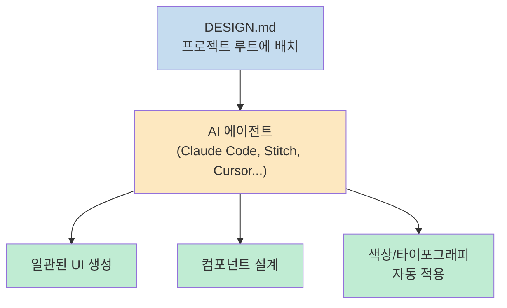
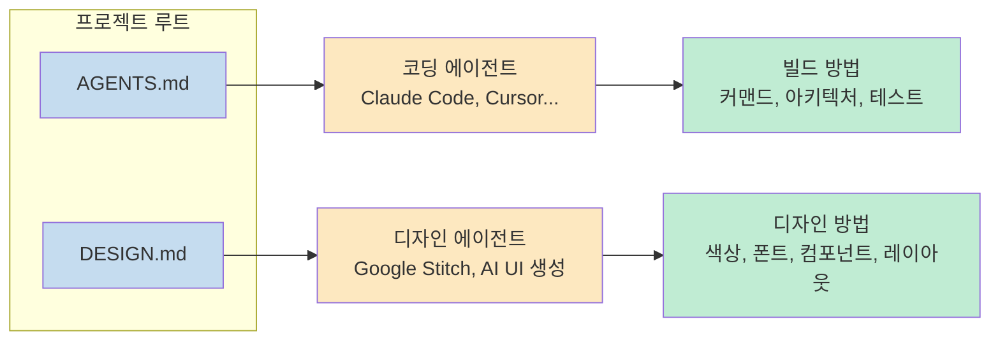
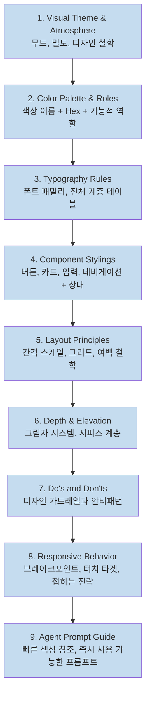
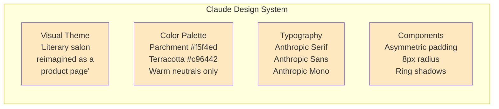
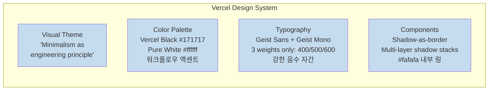
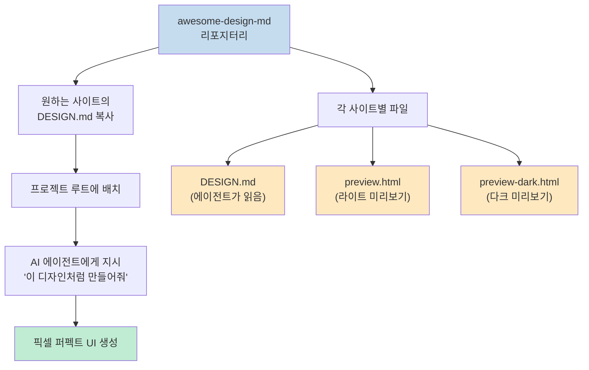
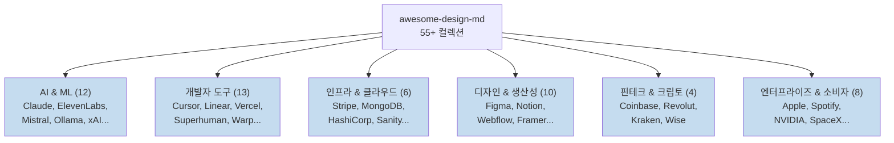
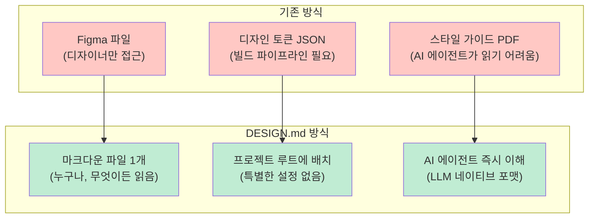

`AGENTS.md`가 AI 에이전트에게 프로젝트를 **어떻게 빌드할지** 알려준다면, `DESIGN.md`는 **어떻게 보여야 할지** 를 알려준다. Google Stitch가 도입한 이 개념은 Figma 익스포트도, JSON 스키마도, 특별한 툴링도 없이 마크다운 파일 하나로 AI 에이전트에게 완전한 디자인 시스템을 전달한다.

VoltAgent의 `awesome-design-md` 리포지터리는 이 개념을 실용적으로 구현했다. Claude, Vercel, Stripe, Figma 등 55개 이상의 실제 서비스 디자인 시스템을 DESIGN.md 형식으로 추출해 누구나 프로젝트에 즉시 적용할 수 있도록 제공한다.

<!--more-->

## Sources

- [Stitch DESIGN.md Format](https://stitch.withgoogle.com/docs/design-md/format/) — Google Stitch (JS SPA, 직접 추출 불가)
- [awesome-design-md](https://github.com/VoltAgent/awesome-design-md/tree/main) — VoltAgent (6.8k stars)

---

## DESIGN.md란 무엇인가?

Google Stitch가 정의한 DESIGN.md는 **AI 에이전트가 읽어 일관된 UI를 생성할 수 있도록 하는 플레인텍스트 디자인 시스템 문서**다. 핵심은 단순함에 있다.

> "It's just a markdown file. No Figma exports, no JSON schemas, no special tooling. Drop it into your project root and any AI coding agent or Google Stitch instantly understands how your UI should look."

마크다운은 LLM이 가장 잘 읽는 형식이다. 파싱 설정도, 특별한 빌드 파이프라인도 없다. 프로젝트 루트에 놓기만 하면 AI 에이전트가 즉시 이해한다.

---

## AGENTS.md vs DESIGN.md: 역할 분리

개발 컨텍스트 파일 생태계에서 두 파일은 명확히 다른 역할을 맡는다.

| 파일 | 읽는 주체 | 정의하는 내용 |
|---|---|---|
| `AGENTS.md` | 코딩 에이전트 | 프로젝트를 어떻게 빌드할지 |
| `DESIGN.md` | 디자인 에이전트 | 프로젝트가 어떻게 보여야 할지 |

이 역할 분리는 "코드 빌드 방법"과 "UI 모양"을 독립적으로 관리할 수 있게 한다. 디자인 시스템이 바뀌어도 빌드 지침은 그대로고, 반대도 마찬가지다.

---

## DESIGN.md의 9개 섹션 구조

Stitch DESIGN.md 포맷은 9개의 표준 섹션으로 구성된다. awesome-design-md의 모든 파일이 이 구조를 따른다.

### 각 섹션의 역할

**1. Visual Theme & Atmosphere**: 디자인의 "느낌"을 말로 정의한다. "literary salon", "terminal-native", "cinematic dark" 같은 무드 설명이 AI 에이전트가 전체 톤앤매너를 일관되게 유지하도록 한다.

**2. Color Palette & Roles**: 단순한 색상 목록이 아니다. 시맨틱 이름(Primary, Surface, Accent), Hex 값, 기능적 역할(배경, 텍스트, 포인트)을 함께 정의한다. 예: `Terracotta #c96442 — brand accent, CTAs`.

**3. Typography Rules**: 폰트 패밀리뿐 아니라 전체 계층 테이블을 포함한다. 헤드라인 크기, 라인 높이, 자간, 폰트 웨이트를 사이즈별로 명세한다.

**4. Component Stylings**: 버튼, 카드, 입력 필드, 네비게이션의 스타일을 각 상태(normal, hover, active, disabled)별로 정의한다. 패딩, 보더 반경, 그림자까지 구체적 값이 들어간다.

**5. Layout Principles**: 간격 스케일의 기본 단위(4px, 8px 등), 최대 콘텐츠 너비, 그리드 컬럼 수, 여백 철학을 정의한다.

**6. Depth & Elevation**: 그림자 시스템과 서피스 계층 구조. Vercel처럼 드롭 섀도 대신 `box-shadow: 0px 0px 0px 1px rgba(0,0,0,0.08)`로 경계를 표현하는 방식도 여기서 명세한다.

**7. Do's and Don'ts**: 디자인 가드레일. AI 에이전트가 실수하기 쉬운 안티패턴을 명시적으로 금지한다. 예: "포화도 높은 색상 사용 금지", "항상 shadow-as-border 사용".

**8. Responsive Behavior**: 브레이크포인트 목록, 각 크기에서의 레이아웃 변화 전략, 터치 타겟 최소 크기를 정의한다.

**9. Agent Prompt Guide**: AI 에이전트가 즉시 복사해 사용할 수 있는 컬러 레퍼런스와 프롬프트 템플릿. 예: "Use Vercel Black (#171717) for primary text, Pure White (#ffffff) for backgrounds".

---

## 실전 예시: Claude와 Vercel의 DESIGN.md

실제 파일이 어떻게 보이는지 두 가지 사례로 살펴본다.

### Claude DESIGN.md

- **Visual Theme**: "literary salon reimagined as a product page" — 따뜻함과 지적 절제
- **배경색**: Parchment `#f5f4ed` — 디지털 화면이 아닌 고급 종이 느낌
- **브랜드 색**: Terracotta `#c96442` — 의도적으로 기술적이지 않은 흙빛
- **팔레트 규칙**: 차가운 파란색 없음. 접근성 포커스 링 제외
- **폰트**: Anthropic Serif (헤드라인, weight 500 전용), Anthropic Sans (UI), Anthropic Mono (코드)
- **일러스트레이션**: 테라코타, 블랙, 뮤트 그린의 유기적 손그림 느낌 벡터
- **깊이**: 드롭 섀도 없음. `0px 0px 0px 1px` 링 섀도로 표현
- **버튼**: 비대칭 패딩 `0px 12px 0px 8px`, 8px radius

### Vercel DESIGN.md

- **Visual Theme**: "minimalism as engineering principle" — 순수 흰색과 `#171717` 텍스트
- **Geist 타이포**: 헤드라인에 `-2.4px ~ -2.88px` 자간 압축으로 긴박감 표현
- **보더 전략**: 전통적인 border 대신 `box-shadow: 0px 0px 0px 1px rgba(0,0,0,0.08)`
- **폰트 웨이트**: 오직 3가지 (400, 500, 600) — 절대 초과 금지
- **워크플로우 액센트**: Ship Red `#ff5b4f`, Preview Pink `#de1d8d`, Develop Blue `#0a72ef`
- **카드**: 멀티레이어 섀도 스택 (border + elevation + ambient depth + `#fafafa` 내부 글로우)

두 사이트 모두 완전히 다른 미학이지만, 같은 9개 섹션 포맷으로 명확하게 표현된다. AI 에이전트는 이 파일을 읽고 "Claude스러운 UI"와 "Vercel스러운 UI"를 정확히 구분해 생성할 수 있다.

---

## awesome-design-md 컬렉션

[VoltAgent/awesome-design-md](https://github.com/VoltAgent/awesome-design-md)는 55개 이상의 실제 서비스 디자인 시스템을 DESIGN.md 형식으로 제공한다. 6.8k stars, 866 forks를 받은 MIT 라이선스 프로젝트다.

### 사용법

1. 원하는 사이트의 `DESIGN.md`를 프로젝트 루트에 복사한다
2. AI 에이전트에게 "이 디자인처럼 페이지를 만들어줘"라고 지시한다

각 사이트 디렉터리에는 세 파일이 포함된다:
- `DESIGN.md`: 에이전트가 읽는 디자인 시스템 명세
- `preview.html`: 색상 스워치, 타입 스케일, 버튼, 카드를 보여주는 시각적 카탈로그 (라이트 모드)
- `preview-dark.html`: 동일한 카탈로그의 다크 버전

### 카테고리별 컬렉션

**AI & Machine Learning (12개)**
- Claude (Anthropic) — 따뜻한 테라코타 액센트, 에디토리얼 레이아웃
- ElevenLabs — 다크 시네마틱 UI, 오디오 웨이브폼 미학
- Mistral AI — 프랑스 엔지니어링 미니멀리즘, 퍼플 톤
- Ollama — 터미널 퍼스트, 모노크롬 심플리시티
- xAI — 스타크 모노크롬, 퓨처리스틱 미니멀리즘

**Developer Tools & Platforms (13개)**
- Cursor — 슬릭 다크 인터페이스, 그라디언트 액센트
- Linear — 울트라 미니멀, 퍼플 액센트
- Vercel — 흑백 정밀, Geist 폰트
- Warp — 다크 IDE 느낌, 블록 기반 커맨드 UI
- Superhuman — 프리미엄 다크, 키보드 퍼스트, 퍼플 글로우

**Infrastructure & Cloud (6개)**
- Stripe — 시그니처 퍼플 그라디언트, weight-300 엘레강스
- MongoDB — 그린 리프 브랜딩, 개발자 문서 포커스
- HashiCorp — 엔터프라이즈 클린, 흑백

**Design & Productivity (10개)**
- Figma — 멀티컬러 활기, 플레이풀 + 프로페셔널
- Notion — 웜 미니멀리즘, 세리프 헤딩, 소프트 서피스
- Framer — 볼드 블랙앤블루, 모션 퍼스트

---

## DESIGN.md 생태계의 의미

DESIGN.md는 기존 디자인 시스템 전달 방식의 근본적인 전환을 의미한다.

**왜 마크다운인가?** LLM은 마크다운을 가장 잘 파싱한다. 구조화된 섹션, 테이블, 코드 블록이 모두 LLM이 이해하는 자연스러운 형식이다. JSON 스키마나 Figma API는 추가 파싱 레이어가 필요하지만, 마크다운은 바로 컨텍스트로 들어간다.

**확장성**: awesome-design-md의 접근 방식은 한 번 추출해두면 프로젝트 간 재사용이 가능하다. "Stripe 스타일로" 혹은 "Notion 느낌으로"라는 지시 한 줄이 완전한 디자인 시스템 적용을 의미하게 된다.

---

## 핵심 요약

| 항목 | 내용 |
|---|---|
| **개념** | Google Stitch가 도입한 AI 에이전트용 플레인텍스트 디자인 명세 |
| **포맷** | 마크다운 파일 1개 (DESIGN.md) |
| **9개 섹션** | Visual Theme, Color, Typography, Components, Layout, Depth, Do's & Don'ts, Responsive, Agent Prompt Guide |
| **AGENTS.md와 차이** | AGENTS.md=빌드 방법, DESIGN.md=디자인 방법 |
| **awesome-design-md** | 55개+ 사이트 DESIGN.md 컬렉션, 6.8k stars, MIT |
| **사용법** | 프로젝트 루트에 복사 → AI 에이전트에게 "이 디자인처럼" 지시 |
| **각 사이트 파일** | DESIGN.md + preview.html + preview-dark.html |
| **사용 가능 도구** | Google Stitch, Claude Code, Cursor 등 AI 코딩 에이전트 |

---

## 결론

DESIGN.md는 개발자와 AI 에이전트 사이의 "디자인 언어 장벽"을 제거한다. Figma를 열 필요도, 디자인 토큰 파이프라인을 설정할 필요도 없다. 마크다운 파일 하나가 AI 에이전트에게 완전한 디자인 시스템을 전달하고, awesome-design-md는 그 출발점을 55개 이상의 검증된 사이트 디자인으로 이미 만들어 두었다.

Claude Code와 함께 사용할 때 특히 강력하다. `AGENTS.md`로 빌드 방법을 정의하고, `DESIGN.md`로 디자인을 정의하면 AI 에이전트는 기능과 외형을 모두 일관되게 구현할 수 있다. "Notion 느낌의 메모 앱을 만들어줘"가 픽셀 퍼펙트 결과로 이어지는 시대가 이미 시작되었다.
