AI 에이전트를 써보면 자꾸 같은 실수를 반복하는 경험을 해본 적 있을 것이다. 프롬프트에 "이렇게 하지 마라"고 써놔도 에이전트는 또 그 실수를 한다. 2026년 2월, 개발자 미첼 하시모토(Mitchell Hashimoto)가 이 문제에 이름을 붙였다. **하네스 엔지니어링(Harness Engineering)**. 이 글은 castlestudio의 영상을 바탕으로, 하네스 엔지니어링이 무엇인지, 왜 필요한지, 어떻게 구성하는지를 체계적으로 정리한다.

<!--more-->

## Sources

- [하네스 공식문서 100번 읽은 것처럼 만들어드림 — castlestudio](https://youtu.be/DrekqeDlO1w?si=x9ThAFeiWnU4Ecou)

---

## 하네스(Harness)의 탄생과 이름의 유래

### 개념의 시작

2026년 2월, [미첼 하시모토](https://youtu.be/DrekqeDlO1w?t=30)가 AI 코딩 에이전트를 사용하던 중 반복 실수 문제에 직면했다. 프롬프트에 아무리 "이렇게 하지 말라"고 적어도 에이전트는 같은 실수를 반복했다. 그는 이 문제를 이렇게 정의했다.

> "하네스 엔지니어링은 에이전트가 실수를 할 때마다 그 실수가 다시는 반복되지 않도록 엔지니어링 하는 것이다."

하시모토 혼자만의 고민이 아니었다. OpenAI, Anthropic, LangChain 모두 같은 문제를 겪고 있었고, 이 이름이 붙자마자 업계 전체가 동조하면서 용어로 자리잡았다.

### 마구(馬具)에서 온 이름

[하네스(harness)는 영어로 마구(馬具)를 뜻한다.](https://youtu.be/DrekqeDlO1w?t=60) 야생말을 경마장에 풀어놓으면 본능대로 날뛰며 울타리를 넘고 관중석으로 뛰어들 것이다. 하지만 마구를 채우면 달라진다.

- **고비**: 방향을 잡아준다
- **안장**: 사람이 올라타 의도를 전달한다
- **끈**: 트랙 안에서만 달리게 한다

중요한 것은 마구를 채운다고 말이 느려지지 않는다는 점이다. 오히려 그 힘을 올바른 방향으로 집중시켜 더 빠르고 정확하게 달리게 만든다.

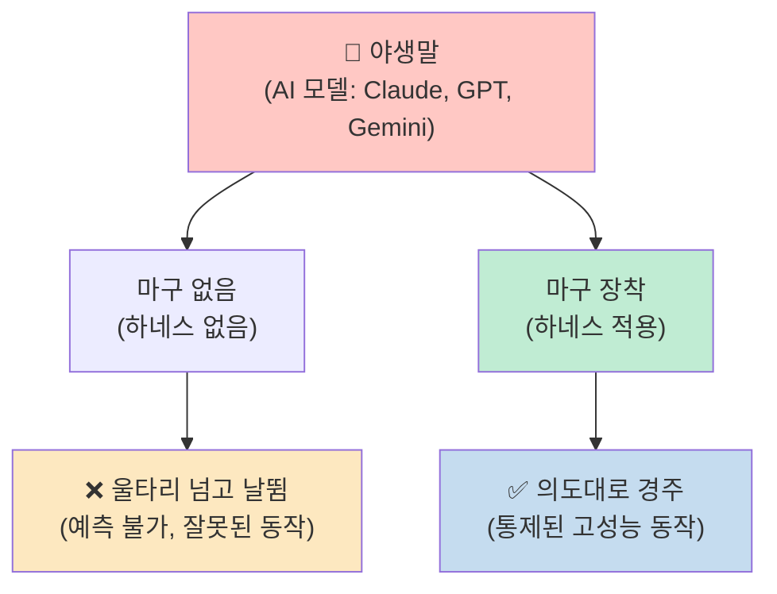

AI 모델(Claude, GPT, Gemini)은 그 자체로 야생말이다. 혼자 풀어놓으면 어디로 튈지 모른다. [하네스는 그 힘을 억누르는 것이 아니라, 올바른 방향으로 제어하면서 최대한 활용하기 위한 구조다.](https://youtu.be/DrekqeDlO1w?t=80)

### 하네스의 범위

[모델이 아닌 것이 모두 하네스다.](https://youtu.be/DrekqeDlO1w?t=90) Claude Code 기준으로 예를 들면:

- `CLAUDE.md` / `AGENTS.md`
- MCP (Model Context Protocol)
- 스킬(Skill) 파일
- 훅(Hook) 스크립트

별거 없어 보이지만, 이게 전부 하네스다.

### 이미 하네스를 쓰고 있다

[충격적인 사실이 하나 있다.](https://youtu.be/DrekqeDlO1w?t=110) 이미 하네스를 쓰고 있다는 것이다. Claude나 ChatGPT와 대화할 때 이전 메시지를 기억하는 것처럼 느껴지는 이유는 무엇일까?

AI 모델은 기본적으로 **텍스트를 넣으면 텍스트만 뱉는 함수**다. 혼자서는 이전 대화를 기억하지 못하고, 파일을 읽지 못하며, 인터넷에도 접속하지 못한다. 우리가 대화 히스토리를 경험하는 이유는 하네스가 대화 내용을 계속 모아서 매번 모델에게 새로 전달해주기 때문이다. 이전 메시지를 추적하고 새 메시지를 이어붙이는 그 루프 자체가 기본적인 하네스다. 매일 쓰는 채팅창 자체가 하네스 위에서 돌아가고 있는 것이다.

---

## AI 활용의 진화: 프롬프트 → 컨텍스트 → 하네스

[AI를 활용하는 방식은 단계적으로 발전해 왔다.](https://youtu.be/DrekqeDlO1w?t=130)

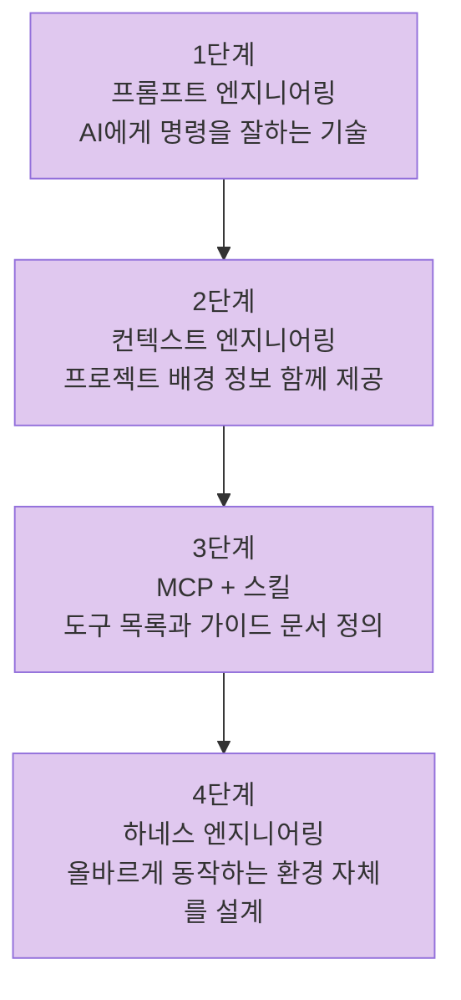

**1단계 — 프롬프트 엔지니어링**: "웹사이트 만들어 줘"보다 "반응형 로그인 페이지, 모바일 지원, 다크모드 포함"처럼 구체적으로 요청하는 기술. 하지만 한계가 있었다. 아무리 말을 잘 걸어도 AI가 우리 프로젝트 상황을 모르면 엉뚱한 코드가 나왔다.

**2단계 — 컨텍스트 엔지니어링**: 프로젝트 구조, 코드 스타일 같은 배경 정보를 함께 제공해 AI가 상황을 알고 일하게 만드는 방식.

**3단계 — MCP + 스킬**: MCP는 AI가 쓸 수 있는 도구 목록을 미리 정의하는 것이고, 스킬은 특정 작업 시 참고할 가이드 문서다. 그런데 여기서 문제가 생겼다. 스킬이 수백 개가 쌓이니 AI가 오히려 헷갈리기 시작했다. 온갖 장치를 다 달고 뛰는 말이 너무 무거워진 것처럼.

**4단계 — 하네스 엔지니어링**: 도구를 계속 얹어주는 것이 아니라, 정확하게 동작할 수 있는 환경 자체를 설계하는 개념. 2026년은 하네스의 해다. 에이전트를 얼마나 잘 쓰느냐는 하네스가 결정한다.

---

## 하네스가 해결하는 두 가지 핵심 문제

### 문제 1: 컨텍스트 부패 (Context Corruption)

[Anthropic 연구팀이 Claude Opus에게 Claude.ai를 클론하도록 시켰다.](https://youtu.be/DrekqeDlO1w?t=230) 두 가지 실패 패턴이 반복됐다.

1. **컨텍스트 소진으로 인한 미완성**: 모든 걸 한 번에 해결하려다 컨텍스트가 바닥나서 절반만 구현됐다. 다음 세션이 시작됐을 때 어디서 멈췄는지 기억이 없어 처음부터 다시 파악하느라 시간을 낭비했다.

2. **조기 종료 선언**: 아직 한참 남았는데 "다 됐다"고 선언해버렸다.

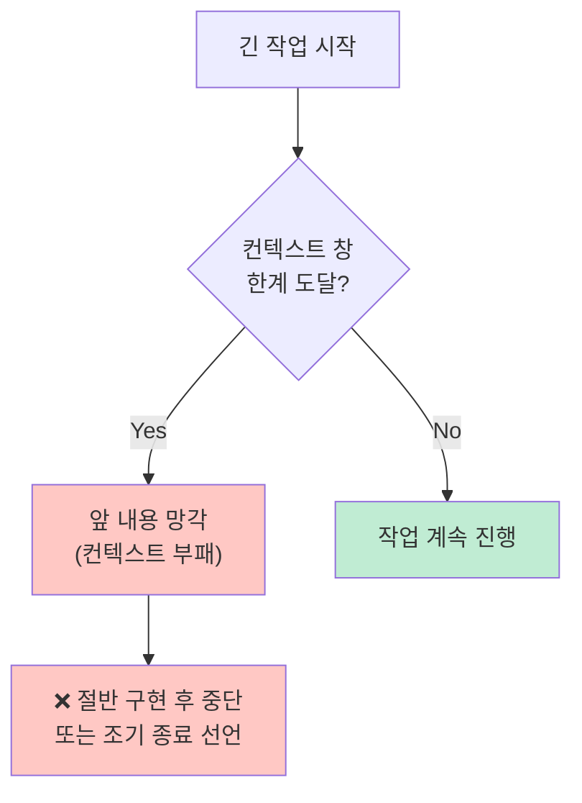

컨텍스트 창(Context Window)은 AI가 한 번에 볼 수 있는 정보의 양이다. 책으로 치면 한 번에 펼쳐 볼 수 있는 페이지 수다. 아무리 좋은 AI도 이 창을 넘어가면 앞에서 한 내용을 잊어버리기 시작하는데, 이것이 **컨텍스트 부패**다.

### 문제 2: 규칙과 울타리의 부재

[이것은 정보의 문제가 아니다.](https://youtu.be/DrekqeDlO1w?t=290) 결제 시스템을 만들라고 시켰는데 갑자기 DB 테이블을 삭제한다고 가정해보자. AI가 결제 시스템을 몰라서가 아니다. "이건 절대 하면 안 돼"라는 구조적 제약이 없으니 마음대로 행동하는 것이다.

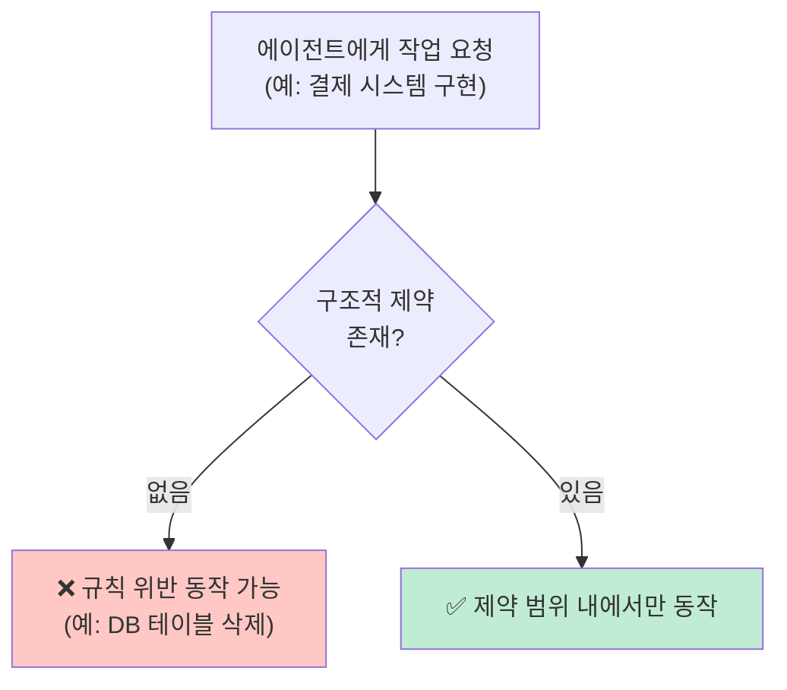

이 두 가지 문제를 해결하기 위해 나온 것이 바로 하네스 엔지니어링이다.

---

## 하네스의 핵심 철학: 프롬프트는 부탁, 하네스는 강제

### 결정적 차이

[에이전트가 규칙을 어겼을 때 일반적으로는 프롬프트를 수정한다.](https://youtu.be/DrekqeDlO1w?t=420) "이거 하지 마라"고 부탁하는 것이다. 그러면 또 실수한다. 프롬프트는 강제가 아니기 때문이다.

하네스 엔지니어링은 다르게 접근한다. **그 실수 자체가 불가능한 구조를 설계해서 실수를 원천 봉쇄한다.**

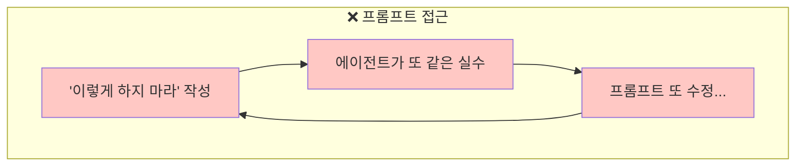
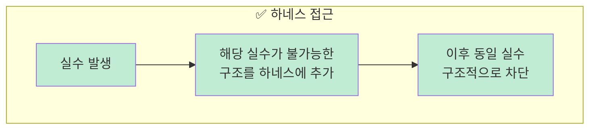

공장 안전 시스템과 동일하다. 안전모를 안 쓰면 출입문 자체가 안 열리고, 기계에 손이 들어가면 자동으로 멈추는 것처럼, 규칙이 사람의 판단에 의존하는 것이 아니라 시스템에 내장되어 자동으로 강제된다.

> **프롬프트는 부탁이고, 하네스는 강제다.**

### Claude.md로 해결하는 컨텍스트 부패

[Claude는 새 세션이 시작될 때마다 `CLAUDE.md` 파일을 가장 먼저 읽는다.](https://youtu.be/DrekqeDlO1w?t=310) 매번 읽는다. 컨텍스트가 꽉 차서 앞 내용을 잊어버려도 이 파일은 항상 다시 읽는다.

퇴사자가 아무리 바뀌어도 신규 입사자가 첫날 반드시 읽어야 하는 온보딩 문서가 있듯이, `CLAUDE.md`가 그 역할을 한다. 이 프로젝트가 뭔지, 어떤 규칙으로 돌아가는지, 절대 하면 안 되는 게 뭔지 — 매번 새로 출근하는 Claude가 이 문서를 읽고 바로 일을 시작한다. 새 세션마다 리셋되는 기억을 `CLAUDE.md`가 잡아주는 것이다.

### 훅(Hook)으로 해결하는 규칙 위반

[Claude Code에는 훅(Hook) 기능이 있다.](https://youtu.be/DrekqeDlO1w?t=360) Claude가 작업을 마치려는 순간 자동으로 실행되는 스크립트다. 예를 들어 코드를 저장하려는 순간, 훅이 자동으로 타입 검사와 문법 체크를 실행한다. 에러가 있으면 Claude에게 다시 돌려보내고, Claude는 그걸 보고 스스로 수정한다. 사람이 개입하지 않아도 된다.

프롬프트에 "잘 짜달라"고 부탁하는 것이 아니라, 잘못 짜면 훅에서 막혀서 저장 자체가 안 되는 구조를 만드는 것이다.

---

## 실전 사례로 보는 하네스 효과

### OpenAI 사례: 코드 한 줄 없이 5개월

[OpenAI 공식 블로그에 기재된 내용이다.](https://youtu.be/DrekqeDlO1w?t=450) 엔지니어 세 명이 5개월 동안 코드를 한 줄도 작성하지 않았다. 대신 그들이 한 것은 네 가지다.

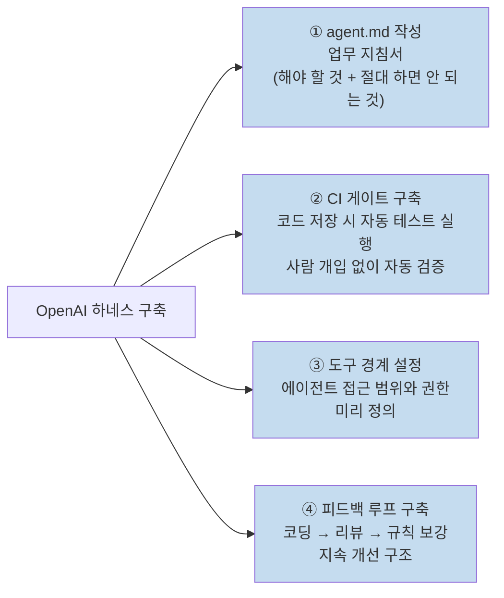

결론은 **코드를 쓴 게 아니라 시스템을 만든 것**이다. 사람이 시스템을 만들고, 에이전트는 그 시스템 안에서 수행만 한다.

### LangChain 사례: 하네스만으로 30위→5위권

[LangChain은 코딩 에이전트 벤치마크에서 모델을 바꾸지 않고 하네스만 개선했다.](https://youtu.be/DrekqeDlO1w?t=510) 결과는 30위권에서 5위권으로 **25단계 상승**이었다.

모델은 그대로였고, 하네스만 바뀌었다. **AI 에이전트 성능을 좌우하는 것은 모델의 지능이 아니라 하네스다.**

---

## 하네스의 세 가지 기둥

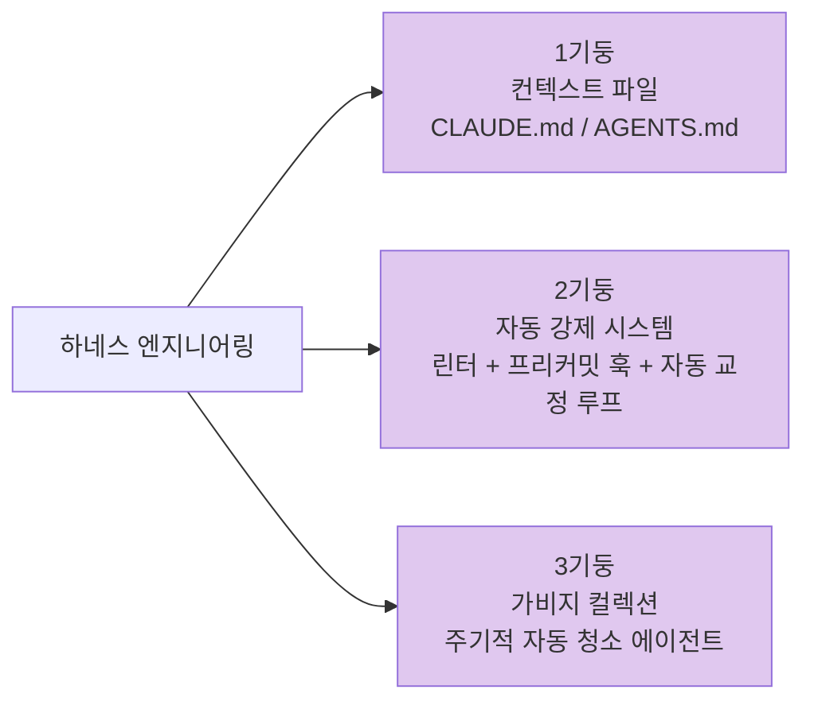

### 기둥 1: 컨텍스트 파일

[AGENTS.md나 CLAUDE.md 같은 파일들이다.](https://youtu.be/DrekqeDlO1w?t=540) AI가 작업을 시작할 때 가장 먼저 읽는 파일이다.

중요한 원칙이 있다. OpenAI 팀이 말했다: **"1,000페이지 설명서가 아니라 지도를 줘야 한다."** 다 설명하려고 하지 말고, 60줄 이하로 보편적으로 항상 적용되는 내용만 넣고, 세부 내용은 다른 파일에 나눠서 넣어 필요할 때만 가져다 쓰게 하는 것이다.

하네스라는 말을 처음 만든 하시모토가 만든 Ghosty의 `agent.md`는 에이전트가 저질렀던 실수를 모두 한 줄씩 적어놓은 파일이다. 처음부터 완벽하게 설계한 것이 아니라, **실패할 때마다 한 줄씩 추가되면서 점진적으로 개선된 것**이다.

### 기둥 2: 자동 강제 시스템

[에이전트에게 "좋은 코드를 작성해 줘"라고 말하는 것이 아니라, 기계적으로 강제하는 것이다.](https://youtu.be/DrekqeDlO1w?t=600)

**린터(Linter)**: 코드의 맞춤법 검사다. 사람이 글을 쓸 때 맞춤법을 틀리면 빨간 줄을 그어주듯, 코드가 정해진 규칙을 어기면 자동으로 에러를 띄운다.

**프리커밋 훅(Pre-commit Hook)**: 코드를 저장하기 직전에 자동으로 돌아가는 검사 스크립트다. 저장 버튼을 누르는 순간 "잠깐, 이것부터 확인하고 저장해"라고 작동한다.

**자동 교정 루프**: 여기서 진짜 강력한 것이 나온다. 린터가 빨간 불을 켜면 에이전트가 스스로 코드를 수정하기 시작한다. 말이 고비에 의해 방향이 틀어지면 자연스럽게 올바른 방향으로 돌아오는 것처럼, **이 자동 교정 루프가 하네스의 핵심 메커니즘이다.**

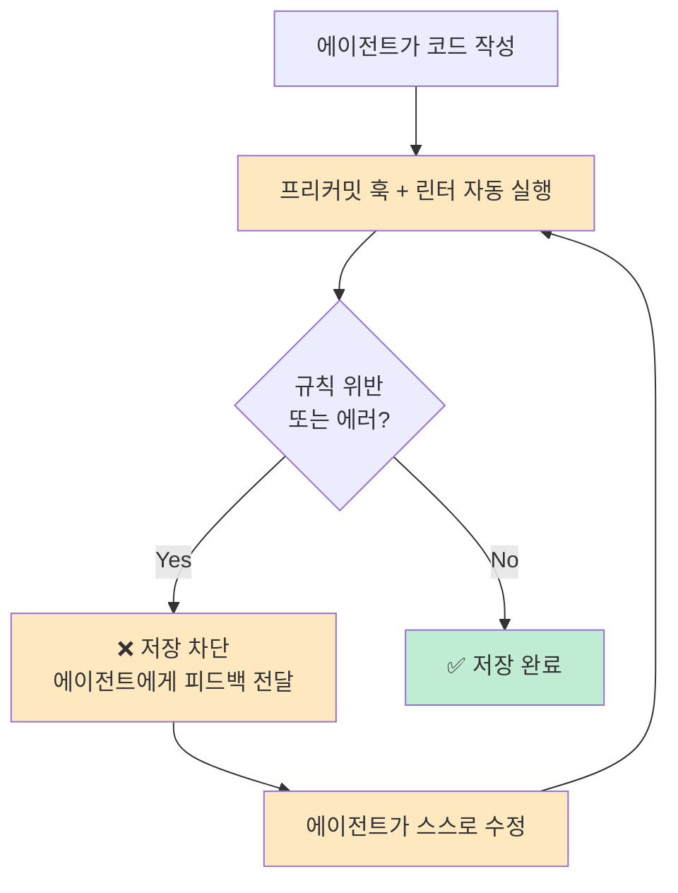

중요한 원칙이 하나 더 있다. **"성공은 조용히, 실패만 시끄럽게 하라."** 테스트가 다 통과하면 아무 말도 하지 않는다. 실패했을 때만 에이전트에게 알려준다. 통과한 테스트 결과 4,000줄을 다 보여주면 AI가 그걸 읽느라 정작 할 일을 잃어버리기 때문이다.

### 기둥 3: 가비지 컬렉션

[기존 코드에 나쁜 패턴이 있으면 AI는 그것을 그대로 따라한다.](https://youtu.be/DrekqeDlO1w?t=680) 나쁜 패턴이 눈덩이처럼 불어나는 것이다.

이를 막기 위해 **주기적으로 돌아가는 청소 에이전트**를 만든다. 이 에이전트가 자동으로 검사하는 것들:

- 문서가 실제 코드와 달라진 게 없는지
- 규칙을 위반한 코드가 생겼는지
- 사용하지 않는 코드가 쌓였는지

### 하네스의 진화 메커니즘

[하네스가 진정으로 강력해지는 이유는 이것이다.](https://youtu.be/DrekqeDlO1w?t=720) 에이전트가 실수를 할 때마다, 그 실수가 새로운 규칙이 된다. 린터 규칙이 추가되고, 테스트가 추가되고, 제약이 추가된다. 시간이 지날수록 하네스가 점점 더 정교해진다. 말이 한 번 넘으려고 했던 울타리가 점점 더 높아져서 두 번 다시 같은 실수를 할 수 없게 되는 것이다.

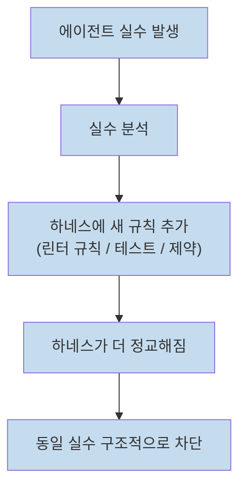

---

## 실용적 시작법과 마인드셋

### 레벨 1: 지금 바로 시작하기

[하네스 엔지니어링은 새로운 것이 아니다.](https://youtu.be/DrekqeDlO1w?t=740) 바이브 코딩을 열심히 하던 사람들은 이미 하던 기법이고, 이름만 붙은 것이다. 설정할 것은 딱 두 가지다.

1. **컨텍스트 파일**: `CLAUDE.md` 또는 `AGENTS.md` — 프로젝트 지침서
2. **프리커밋 훅**: 저장하기 전 자동으로 검사해주는 스크립트

이 두 가지 설정은 한두 시간이면 완료된다.

### 올바른 마인드셋

[한 번에 완벽하게 하려고 하지 말아야 한다.](https://youtu.be/DrekqeDlO1w?t=770) 에이전트가 실제로 실패한 경우에만 그 케이스를 모아서 하네스를 조금씩 개선하는 것이 맞는 방향이다.

아이디어가 아직 모호하거나 검증되지 않았다면, 하네스를 구축하는 것보다 결과물을 빠르게 만들어내는 것이 먼저다.

그리고 기억해야 할 것이 있다. **"Garbage In, Garbage Out."** 문제나 기획 자체가 나쁘면 아무리 하네스를 거쳐도 좋은 결과물이 나오지 않는다. 하네스는 좋은 것을 더 잘 만들게 도와주는 것이지, 나쁜 것을 좋게 만들어주는 마법이 아니다.

> **일단 만들어보고, 실패하면 그때 하네스를 손보면 된다.**

---

## 하네스의 미래 전망

### 모델이 똑똑해질수록 하네스는 단순해진다

[강화학습 창시자 리처드 서튼(Richard Sutton)이 말했다.](https://youtu.be/DrekqeDlO1w?t=840) "모델이 똑똑해질수록 하네스는 더 단순해져야 한다." 모델이 업그레이드될 때마다 하드코딩된 규칙을 더 추가하고 있다면 흐름을 거슬러 가고 있는 것이다. 에이전트가 스스로 판단할 수 있는 것을 억지로 제약하는 것이니까.

### 에이전트가 스스로 하네스 엔지니어링을 할 것

[언젠가 에이전트가 스스로 하네스 엔지니어링을 할 것이다.](https://youtu.be/DrekqeDlO1w?t=870) "내가 일을 잘하기 위한 환경 구성부터 먼저 물어보고, 그것을 설정한 다음 작업을 시작하는" 방식으로. 지금 그렇게 하지 않기 때문에 하네스 엔지니어링이 중요한 것이고, 앞으로는 방향이 바뀔 것이다.

### 하네스가 서비스 템플릿이 될 것

[지금 팀들이 새 프로젝트를 시작할 때 서비스 템플릿을 가져다 쓰는 것처럼](https://youtu.be/DrekqeDlO1w?t=900), 앞으로는 "이 기술 스택용 하네스"라는 형태로 템플릿처럼 제공될 것이다. 기술 스택 선택 기준이 "개발자 경험이 좋은 프레임워크"에서 "좋은 하네스가 갖춰진 프레임워크"로 바뀔 수도 있다.

### 개발자 역할의 변화

[개발자의 역할이 바뀌고 있다.](https://youtu.be/DrekqeDlO1w?t=960) 코드를 작성하는 것에서 → AI가 코드를 올바르게 작성할 수 있는 환경을 설계하는 것으로. 공을 차는 선수에서 전술을 짜고 팀을 운영하는 감독으로 한 단계 올라가는 것이다.

Chad Paula는 이것을 **"엄밀함의 재배치"** 라고 표현했다. 코드 한 줄 한 줄을 정확하게 짜던 엄밀함이, 에이전트가 올바르게 동작하는 시스템을 설계하는 엄밀함으로 옮겨가고 있다는 것이다. 엔지니어가 덜 기술적으로 되는 것이 아니라, 더 높은 차원의 기술이 요구되는 것이다.

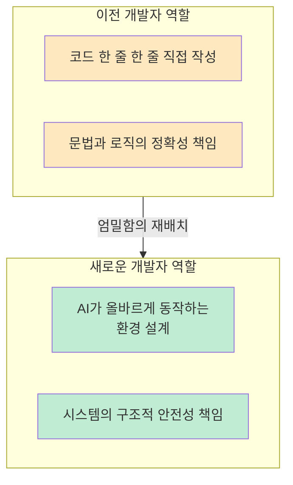

---

## 핵심 요약

| 구분 | 내용 |
|------|------|
| **정의** | 에이전트가 실수를 할 때마다 그 실수가 다시는 반복되지 않도록 엔지니어링하는 것 |
| **핵심 비유** | 야생말(AI 모델)에 마구(하네스)를 씌워 올바른 방향으로 제어 |
| **범위** | 모델이 아닌 것이 모두 하네스 (CLAUDE.md, MCP, 스킬, 훅 등) |
| **두 가지 문제** | 컨텍스트 부패 + 규칙/울타리 부재 |
| **핵심 원칙** | 프롬프트는 부탁, 하네스는 강제 |
| **세 가지 기둥** | 컨텍스트 파일 + 자동 강제 시스템 + 가비지 컬렉션 |
| **검증된 효과** | LangChain: 모델 유지, 하네스만 개선 → 30위→5위권 |
| **시작법** | CLAUDE.md + 프리커밋 훅 (한두 시간이면 설정 완료) |

---

## 결론

AI 코딩 에이전트가 기대만큼 동작하지 않을 때, 모델을 탓하기 전에 하네스를 점검해야 한다. `CLAUDE.md`에 뭘 넣었는지, 어떤 도구를 연결했는지, 피드백 루프가 있는지 확인해보자.

하네스는 AI를 억누르는 것이 아니다. AI의 힘을 올바른 방향으로 집중시켜 최대한 활용하기 위한 구조다. 마구를 채운 말이 더 빠르고 정확하게 달리듯, 잘 설계된 하네스 위에서 에이전트는 더 강력하게 동작한다.
