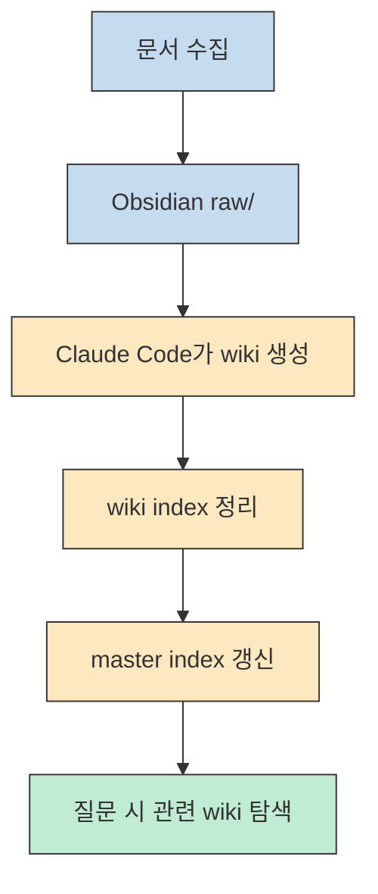
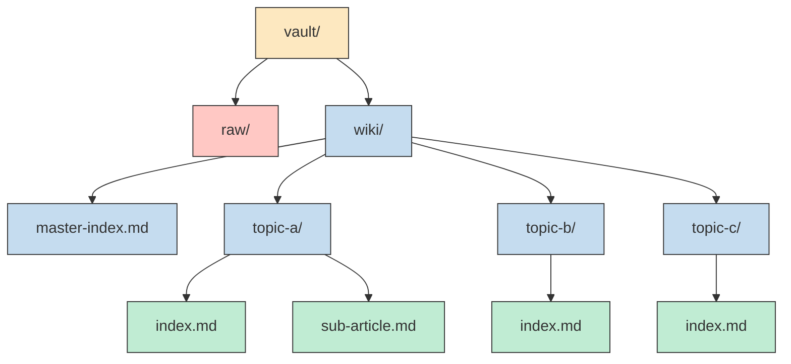
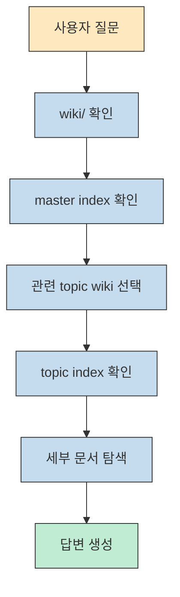
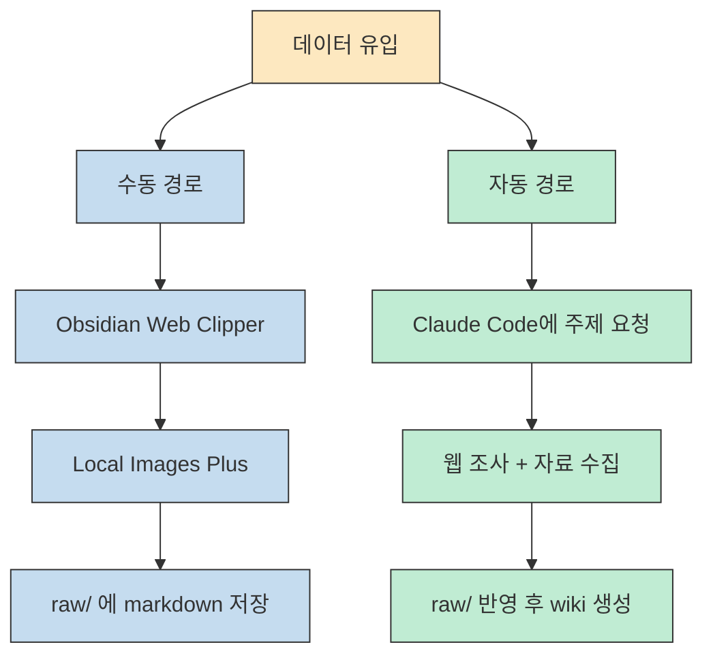
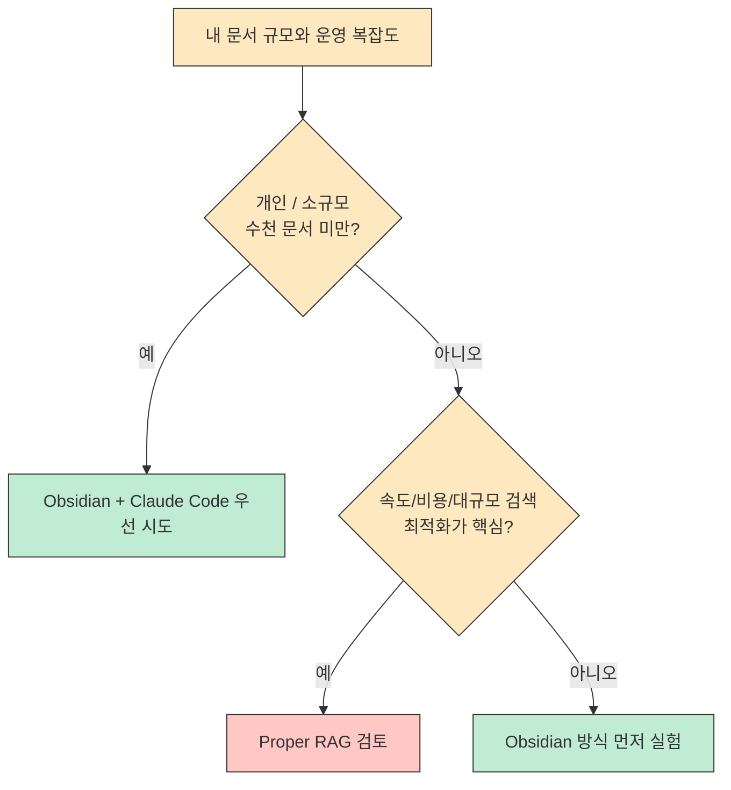

RAG를 이야기할 때 우리는 보통 벡터 DB, 임베딩, 검색 파이프라인부터 떠올립니다. 그런데 Chase AI의 영상은 완전히 다른 출발점을 제안합니다. **Obsidian vault의 파일 구조만 잘 잡으면, Claude Code가 꽤 많은 문서를 다루는 지식베이스를 사실상 RAG처럼 사용할 수 있다** 는 것입니다. 영상은 이걸 Andrej Karpathy의 Obsidian 기반 개인 지식 시스템에서 가져와 설명합니다. [영상 0:00](https://youtu.be/OSZdFnQmgRw?t=0) [영상 1:01](https://youtu.be/OSZdFnQmgRw?t=61)
<!--more-->

핵심은 "진짜 RAG를 완전히 대체한다"가 아닙니다. 오히려 **대부분의 개인 개발자나 소규모 팀에게는 이 정도 구조가 훨씬 가볍고 충분할 수 있다** 는 주장에 가깝습니다. 특히 수천 문서 미만 규모에서, 파일을 직접 눈으로 보면서 정리하고 Claude Code로 질문하는 워크플로우를 원한다면 꽤 설득력 있습니다. [영상 12:00](https://youtu.be/OSZdFnQmgRw?t=720) [영상 13:00](https://youtu.be/OSZdFnQmgRw?t=780)

## Sources

- https://youtu.be/OSZdFnQmgRw

## 1) 이 구조의 핵심 아이디어: "RAG처럼 동작하지만 RAG 스택은 없다"

영상의 첫 메시지는 매우 선명합니다. 이 Obsidian 기반 지식베이스에는 **vector database도 없고, embeddings도 없고, 복잡한 retrieval 프로세스도 없습니다.** 그런데도 LLM이 많은 문서를 다루고 질문에 답하며, 문서 간 연결을 따라갈 수 있게 해 준다는 점에서 "RAG 같은 효과"를 냅니다. 그래서 발표자는 아예 "RAG"에 따옴표를 붙입니다. [영상 0:00](https://youtu.be/OSZdFnQmgRw?t=0)

왜 이런 주장이 가능할까요? 영상 기준 답은 두 가지입니다.

1. 문서를 그냥 쌓아두는 것이 아니라 **파일 시스템을 검색 친화적으로 구조화** 한다.
2. Claude Code가 그 구조를 따라가며 **index 파일과 요약 파일을 자동으로 유지** 하게 만든다. [영상 1:19](https://youtu.be/OSZdFnQmgRw?t=79) [영상 2:35](https://youtu.be/OSZdFnQmgRw?t=155)

즉 여기서 중요한 것은 "고급 검색 엔진"이 아니라 **좋은 폴더 구조 + 좋은 인덱스 + 좋은 요약** 입니다. 영상은 이 지점 때문에 Obsidian을 단순 메모 앱이 아니라, 사람이 직접 안을 들여다볼 수 있는 knowledge base의 프런트엔드로 봅니다. [영상 1:50](https://youtu.be/OSZdFnQmgRw?t=110)

영상의 관점에서 보면, 진짜 포인트는 검색 알고리즘보다 **Claude가 읽기 쉬운 문서 생태계** 를 만드는 것입니다. 복잡한 그래프 RAG처럼 내부 구조가 블랙박스가 되는 대신, 사람도 Obsidian에서 raw 문서와 wiki, 링크 구조를 직접 볼 수 있다는 점이 이 방식의 가장 큰 장점으로 제시됩니다. [영상 1:58](https://youtu.be/OSZdFnQmgRw?t=118) [영상 2:22](https://youtu.be/OSZdFnQmgRw?t=142)

## 2) 파일 구조가 전부다: vault, raw, wiki, master index

영상은 구체적인 파일 구조를 아주 중요하게 다룹니다. 먼저 최상단에는 Obsidian이 관리하는 **vault** 가 있습니다. 그 안에 최소한 두 가지 하위 구조가 필요합니다.

- `raw/`: 아직 정제되지 않은 연구 자료를 쌓는 곳
- `wiki/`: Claude Code가 주제별로 정리한 문서를 저장하는 곳

그리고 `wiki/` 바로 아래에는 **master index markdown** 이 하나 있어야 합니다. 이 파일은 지금까지 만들어진 wiki들의 목록이자, Claude Code가 어느 주제로 들어가야 하는지 판단하는 첫 관문 역할을 합니다. [영상 3:53](https://youtu.be/OSZdFnQmgRw?t=233) [영상 4:17](https://youtu.be/OSZdFnQmgRw?t=257) [영상 4:51](https://youtu.be/OSZdFnQmgRw?t=291)

여기서 `raw/` 는 staging area입니다. 웹페이지를 클리핑한 markdown, PDF, 수동으로 모은 자료 등이 일단 여기에 들어옵니다. 아직 사람이 읽기 좋게 정리된 상태가 아니라, 말 그대로 "원재료 저장소"에 가깝습니다. [영상 3:53](https://youtu.be/OSZdFnQmgRw?t=233) [영상 4:05](https://youtu.be/OSZdFnQmgRw?t=245)

반대로 `wiki/` 는 Claude Code가 주제별로 요약·구조화한 결과물입니다. 예를 들어 `rag-systems`, `ai-agents`, `content-creation` 같은 폴더가 생길 수 있고, 각 폴더 안에는 다시 topic index와 세부 문서들이 연결됩니다. 사용자는 Obsidian 왼쪽 패널에서 이 트리를 직접 따라가며 읽을 수 있고, Claude Code도 같은 구조를 따라가며 질문에 답합니다. [영상 4:33](https://youtu.be/OSZdFnQmgRw?t=273) [영상 5:00](https://youtu.be/OSZdFnQmgRw?t=300) [영상 6:00](https://youtu.be/OSZdFnQmgRw?t=360)

영상이 이 구조를 높게 평가하는 이유는, 결국 **사람과 AI가 같은 정보 구조를 공유** 하기 때문입니다. 사람은 Obsidian UI에서 탐색하고, Claude Code는 같은 markdown 트리를 읽으며 추론합니다. 이게 "사람도 볼 수 있는 RAG"에 가까운 체감으로 이어집니다. [영상 2:08](https://youtu.be/OSZdFnQmgRw?t=128) [영상 6:20](https://youtu.be/OSZdFnQmgRw?t=380)

## 3) 검색 대신 인덱스를 쓴다: master index와 topic index의 역할

이 워크플로우의 진짜 핵심은 `master index` 입니다. 영상 설명대로라면, 사용자가 Claude Code에게 "내 wiki에서 RAG 시스템에 대해 알려줘" 같은 질문을 했을 때 Claude는 무작정 raw 문서를 뒤지는 것이 아니라 먼저 `wiki/` 로 가고, 그다음 `master index` 를 보고 어떤 위키가 존재하는지 확인합니다. 이후 해당 topic folder 안의 `index` 파일을 열고, 거기서 세부 문서와 링크를 따라갑니다. [영상 4:51](https://youtu.be/OSZdFnQmgRw?t=291) [영상 5:13](https://youtu.be/OSZdFnQmgRw?t=313)

이게 중요한 이유는, 우리가 흔히 말하는 retrieval을 **파일 이름과 index 문서 구조로 대체** 하고 있기 때문입니다. 즉 이 시스템은 "문서 조각을 벡터 공간에서 뽑아오는 검색기"보다는, **LLM이 이해할 수 있는 목차 체계** 에 가깝습니다.

영상은 이 방식이 인간에게도 이해하기 쉬워서 좋다고 말합니다. Obsidian UI에서 `wiki → master index → 특정 위키 index → 세부 문서` 로 들어가는 흐름이 명확하기 때문에, 지금이 3개 wiki든 3,000개 wiki든 상대적으로 감을 잃지 않는다는 것입니다. [영상 6:00](https://youtu.be/OSZdFnQmgRw?t=360)

물론 이것이 "무한 확장성"을 뜻하지는 않습니다. 하지만 영상이 강조하는 포인트는 따로 있습니다. **대부분의 사용자는 처음부터 수백만 문서 규모를 다루지 않는다** 는 점입니다. 그런 사용자에게는 복잡한 retrieval stack보다 좋은 인덱스 구조가 더 실용적일 수 있다는 주장입니다. [영상 12:25](https://youtu.be/OSZdFnQmgRw?t=745)

## 4) 데이터 유입 경로는 두 개다: 수동 클리핑과 Claude Code 리서치

영상에서 raw 폴더로 데이터를 넣는 방법은 크게 두 가지입니다.

첫 번째는 **Obsidian Web Clipper** 입니다. 발표자는 웹페이지를 markdown 파일로 쉽게 가져와 `raw/` 로 보낼 수 있다고 설명합니다. 즉 사용자가 직접 읽어 보고 싶은 글, 문서, 참고자료를 빠르게 vault로 들여오는 수동 funnel입니다. [영상 8:07](https://youtu.be/OSZdFnQmgRw?t=487) [영상 9:25](https://youtu.be/OSZdFnQmgRw?t=565)

다만 기본 Web Clipper는 이미지 처리에 약하다고 말합니다. 링크만 남기고 이미지를 제대로 가져오지 못하는 경우가 있기 때문입니다. 그래서 영상은 Obsidian community plugin인 `Local Images Plus` 를 추가로 설치해, 클리핑한 문서 안의 이미지도 vault 내부에서 바로 볼 수 있게 만듭니다. [영상 8:24](https://youtu.be/OSZdFnQmgRw?t=504) [영상 8:40](https://youtu.be/OSZdFnQmgRw?t=520) [영상 9:10](https://youtu.be/OSZdFnQmgRw?t=550)

두 번째는 **Claude Code에게 직접 리서치를 맡기는 방식** 입니다. 영상 예시에서는 사용자가 Claude Code에게 "Claude Code skills에 대한 wiki를 만들어라. 이미 raw 폴더에 있는 자료를 참고하고, 추가로 직접 조사해서 관련 raw markdown을 가져오라"는 식으로 요청합니다. 그러면 Claude Code가 웹을 탐색하고, 자료를 끌어와 wiki를 생성합니다. [영상 10:10](https://youtu.be/OSZdFnQmgRw?t=610) [영상 10:29](https://youtu.be/OSZdFnQmgRw?t=629)

흥미로운 점은 발표자가 raw 폴더를 "반드시 사람이 모든 파일을 직접 채워 넣어야 하는 곳"으로 보지 않는다는 것입니다. raw 폴더는 사람을 위한 정리 공간이기도 하지만, Claude Code가 자동으로 조사해 넣는 자료의 staging area가 될 수도 있습니다. 즉 manual inbox이면서 automated intake queue이기도 합니다. [영상 10:40](https://youtu.be/OSZdFnQmgRw?t=640) [영상 10:53](https://youtu.be/OSZdFnQmgRw?t=653)

## 5) 이 구조가 잘 맞는 사람과 안 맞는 사람

영상의 후반부는 이 방식이 "만능"이 아니라는 점을 분명히 합니다. 발표자의 기준은 규모입니다.

- 개인 개발자
- solo operator
- 작은 팀
- 아직 수천 문서 이상을 다루지 않는 경우

이런 경우에는 Obsidian 기반 구조가 더 가볍고, 실제로는 "진짜 RAG"가 필요 없을 수 있다고 말합니다. Claude Code 같은 harness가 markdown 파일 구조를 따라가며 읽고 정리하는 것만으로도 충분한 체감 가치를 줄 수 있다는 것입니다. [영상 12:00](https://youtu.be/OSZdFnQmgRw?t=720)

반대로 문서 수가 수백만 수준으로 커지거나, 속도·비용·대규모 검색 최적화가 정말 중요해지는 시점에는 proper RAG system이 더 맞다고 봅니다. 발표자는 이 지점을 아주 실용적으로 말합니다. **일단 Obsidian 방식으로 해 보고, 안 되면 LightRAG 같은 진짜 RAG로 넘어가면 된다** 는 것입니다. [영상 12:25](https://youtu.be/OSZdFnQmgRw?t=745) [영상 13:05](https://youtu.be/OSZdFnQmgRw?t=785)

이 대목이 중요한 이유는, 영상이 복잡한 시스템을 부정하려는 것이 아니라 **도입 순서를 바꾸자** 고 제안하기 때문입니다. 처음부터 벡터 DB와 그래프 검색을 붙이기보다, 내가 진짜로 그런 규모와 복잡도를 필요로 하는지 먼저 검증하자는 이야기입니다.

## 6) 실전 적용 포인트

이 영상을 실제 워크플로우로 바꾸려면 아래 순서가 가장 자연스럽습니다.

1. Obsidian vault를 하나 만든다. [영상 3:30](https://youtu.be/OSZdFnQmgRw?t=210)
2. vault 아래 `raw/` 와 `wiki/` 구조를 만든다. 이 작업 자체는 Claude Code에 시킬 수 있다. [영상 6:54](https://youtu.be/OSZdFnQmgRw?t=414)
3. `wiki/` 아래 `master index` 를 두고, 주제별 wiki가 생길 때마다 갱신하게 한다. [영상 4:51](https://youtu.be/OSZdFnQmgRw?t=291)
4. Web Clipper로 자료를 넣고, 이미지가 필요하면 `Local Images Plus` 를 함께 쓴다. [영상 8:07](https://youtu.be/OSZdFnQmgRw?t=487) [영상 8:55](https://youtu.be/OSZdFnQmgRw?t=535)
5. Claude Code에게 특정 주제의 wiki 생성을 맡기고, 기존 raw 자료 + 추가 웹 조사까지 함께 하게 한다. [영상 10:10](https://youtu.be/OSZdFnQmgRw?t=610)
6. 이후 질문은 raw 전체가 아니라 `master index → topic index → 하위 문서` 흐름을 따라가게 유도한다. [영상 5:13](https://youtu.be/OSZdFnQmgRw?t=313)

실전적으로 보면 이 방식의 강점은 세 가지입니다.

- 사람이 직접 Obsidian에서 구조를 눈으로 확인할 수 있다
- Claude Code가 markdown과 링크 구조를 그대로 따라가므로 설명 가능성이 높다
- 처음 비용이 거의 들지 않고, 안 맞으면 그때 진짜 RAG로 확장하면 된다

반면 한계도 분명합니다.

- retrieval 품질이 파일 구조와 index 품질에 강하게 의존한다
- 자동 생성한 wiki의 품질 검토를 사람이 해야 한다
- 대규모·고빈도 질의 환경에서는 proper RAG보다 느리거나 비경제적일 수 있다

즉 이건 "RAG의 종결자"가 아니라, **많은 사람에게는 더 먼저 시도해 볼 가치가 있는 경량 지식베이스 패턴** 으로 이해하는 편이 맞습니다.

## 핵심 요약

- 이 영상의 핵심은 벡터 DB 없이도 Obsidian vault와 Claude Code만으로 RAG 비슷한 지식베이스를 만들 수 있다는 점이다. [영상 0:00](https://youtu.be/OSZdFnQmgRw?t=0)
- 구조의 핵심은 `raw/`, `wiki/`, 그리고 `master index` 이다. [영상 3:53](https://youtu.be/OSZdFnQmgRw?t=233) [영상 4:51](https://youtu.be/OSZdFnQmgRw?t=291)
- `raw/` 는 문서 원재료 저장소이고, `wiki/` 는 Claude Code가 정리한 주제별 결과물이다. [영상 4:05](https://youtu.be/OSZdFnQmgRw?t=245) [영상 4:17](https://youtu.be/OSZdFnQmgRw?t=257)
- retrieval 역할은 벡터 검색기가 아니라 `master index` 와 topic index가 맡는다. [영상 5:13](https://youtu.be/OSZdFnQmgRw?t=313)
- 데이터 유입은 Web Clipper 같은 수동 경로와 Claude Code의 추가 리서치 같은 자동 경로로 나뉜다. [영상 8:07](https://youtu.be/OSZdFnQmgRw?t=487) [영상 10:10](https://youtu.be/OSZdFnQmgRw?t=610)
- 개인 개발자나 소규모 팀에는 이 경량 구조가 충분할 수 있지만, 대규모 문서 검색과 비용 최적화가 중요해지면 proper RAG가 더 적합하다. [영상 12:00](https://youtu.be/OSZdFnQmgRw?t=720) [영상 13:05](https://youtu.be/OSZdFnQmgRw?t=785)

## 결론

이 영상이 흥미로운 이유는 "RAG를 더 잘 만드는 법"보다 **RAG를 덜 복잡하게 시작하는 법** 을 보여 주기 때문입니다. 파일 시스템, 인덱스, 요약, 링크만 잘 설계해도 Claude Code는 꽤 많은 문서를 쓸 만한 지식베이스로 바꿔 줍니다.

그래서 지금 RAG를 고민 중이라면 질문을 이렇게 바꿔 보는 것이 좋겠습니다. "벡터 DB가 필요한가?"가 아니라, **"먼저 Obsidian + Claude Code 수준의 경량 구조로도 내 문제를 풀 수 있지 않은가?"** 입니다. 영상의 메시지는 분명합니다. 대부분은 여기서부터 시작해도 늦지 않습니다.
