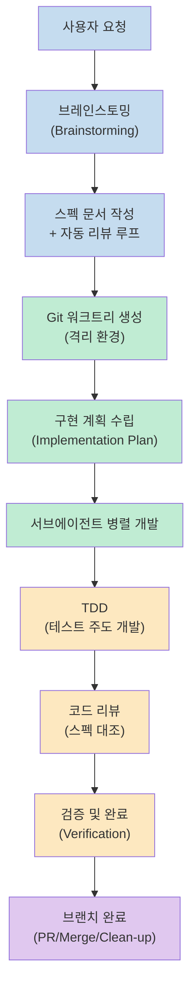
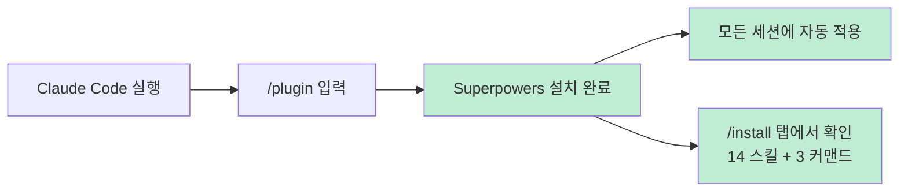
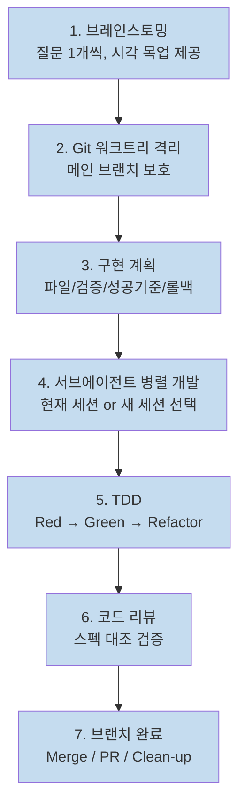
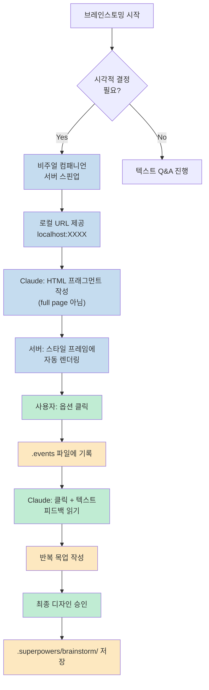
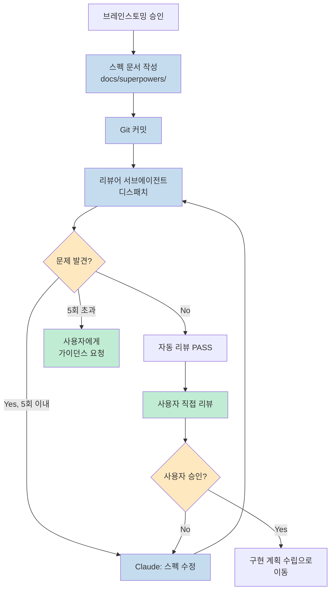
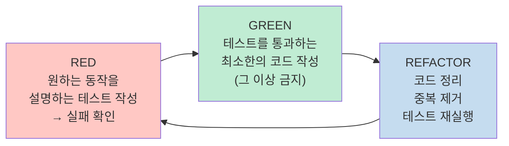
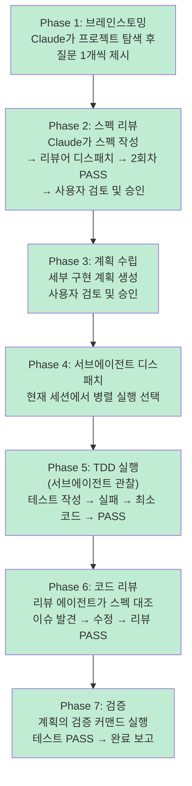
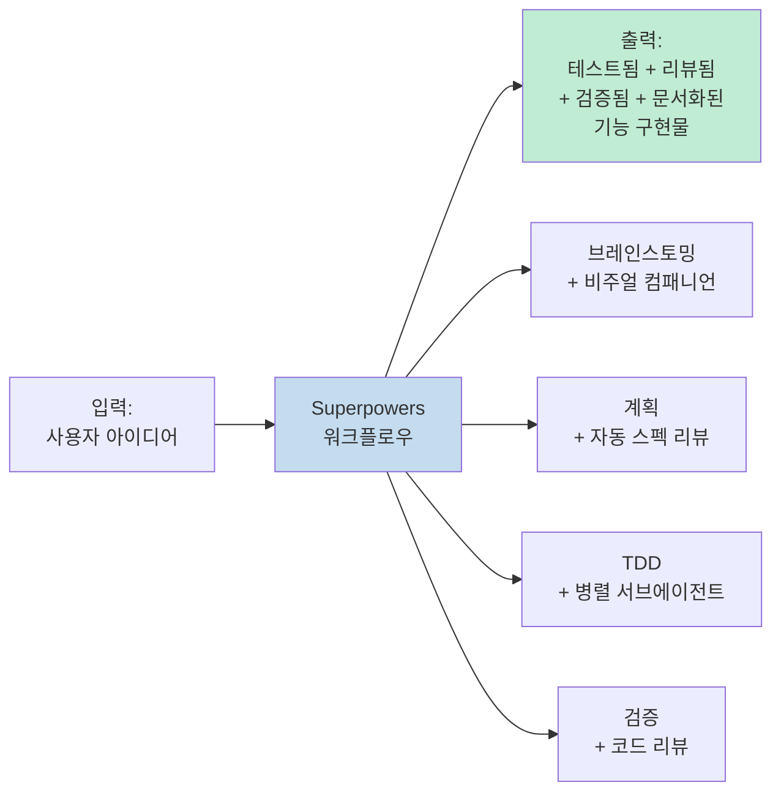

Claude Code를 쓰다 보면 한 가지 패턴이 반복된다. 아이디어를 바로 코드로 던지면 Claude가 빠르게 무언가를 만들어 내지만, 이후 20분을 엣지 케이스 디버깅과 놓친 세부 사항 보정에 쓰게 된다. **Superpowers** 플러그인은 이 패턴을 근본적으로 바꾼다. 코드를 작성하기 전에 브레인스토밍하고, 계획을 세우고, 테스트를 먼저 작성하고, 자체 검토까지 수행하도록 Claude를 구조화된 워크플로우 안에 넣는다.

GritAI Studio의 Alex가 제작한 이 영상은 Superpowers 플러그인의 모든 기능을 실전 중심으로 소개한다. 비주얼 컴패니언이라는 신기능부터 14개 스킬의 철학까지, 이 가이드로 완전히 정리해 보자.

<!--more-->

## Sources

- [How to Master the Superpowers Plugin in Claude Code](https://youtu.be/yEzzBxhkUw4?si=Lhl9kCm7XqML0K71) — GritAI Studio (2026-04-03)

---

## Superpowers 플러그인이란?

Superpowers는 Claude Code 생태계에서 현재 가장 주목받는 플러그인으로, GitHub의 Jesse Vincent(obra)가 제작했다. 이 플러그인의 핵심 가치 제안은 단순하다.

> "Claude Code의 공식 베스트 프랙티스 권고인 **'탐색 → 계획 → 코드'** 를 자동화하고 강제 집행한다."

Superpowers가 없는 상태에서 Claude Code는 빠른 코드 생성기다. Superpowers가 있으면 **체계적인 개발 파트너**로 변한다. 플러그인은 Claude가 다음을 하도록 강제한다.

- 코드보다 **계획을 먼저** 작성한다
- 구현 코드보다 **테스트를 먼저** 작성한다
- 완료 선언 전에 **자체 검토**를 수행한다
- 스크립트를 이탈하지 않고 **끝까지 따른다**

실전 경험을 가진 Alex의 말은 단호하다: "브레인스토밍 단계에 시간을 투자하면 Claude는 내가 던지는 모든 것을 one-shot으로 구현한다. 계획에 투자하는 것, 그 자체가 레벨 업이다." ([영상 0:00](https://youtu.be/yEzzBxhkUw4?t=0))



---

## 설치 방법

설치는 매우 간단하다. Superpowers는 Anthropic의 공식 마켓플레이스에 등록되어 있어 Claude Code 설치 시 마켓플레이스도 함께 등록된다. 별도 설정 없이 다음 명령어 하나로 끝난다. ([영상 ~2:07](https://youtu.be/yEzzBxhkUw4?t=127))

```
/plugin
```

설치 후 `/install` 탭에서 **14개 스킬**과 **3개 핵심 커맨드**(`/brainstorm`, `/write-plan`, `/execute-plan`)가 목록에 나타나면 정상이다.



---

## 7단계 구조화 워크플로우

Superpowers는 세 가지 핵심 커맨드(`/brainstorm`, `/write-plan`, `/execute-plan`)를 중심으로 돌아가지만, 내부적으로는 7개의 단계를 거친다. ([영상 ~2:07](https://youtu.be/yEzzBxhkUw4?t=127))

### 단계 1: 브레인스토밍 (Brainstorming)

Claude는 코드로 바로 뛰어들지 않는다. 프로젝트 컨텍스트를 먼저 탐색하고, 질문을 **한 번에 하나씩** 던진다. 설계안을 소화 가능한 섹션 단위로 제시하고 각 섹션마다 승인을 받는다. 시각적 결정이 필요한 경우 브라우저 기반 비주얼 컴패니언을 제안한다.

**핵심 하드 게이트**: "사용자가 설계안을 승인하기 전까지 절대 코드를 작성하지 않는다."

### 단계 2: Git 워크트리 격리

코드에 손대기 전 Superpowers는 격리된 Git 워크트리를 생성한다. 메인 브랜치는 항상 깨끗한 상태를 유지한다. 구현이 잘못되어도 워크트리만 삭제하면 된다.

### 단계 3: 구현 계획 수립 (Planning)

단순한 개요가 아닌 **세밀한 구현 계획**을 작성한다. 포함 내용:
- 파일 인벤토리 (생성/수정할 파일 목록)
- 검증 커맨드 (테스트 및 확인 명령)
- 성공 기준
- 롤백 절차

이 계획의 목표 수준은 README에서 직접 인용된 말로 표현된다: *"판단력이 부족하고, 프로젝트 컨텍스트도 없고, 테스트를 싫어하는 열정적인 주니어 엔지니어도 따라갈 수 있는 계획."*

### 단계 4: 서브에이전트 병렬 개발 (Sub-Agent Driven Development)

두 가지 실행 옵션을 제공한다:
- **현재 세션에서 병렬 실행**: 여러 서브에이전트가 동시에 작업
- **새 세션에서 실행**: 깨끗한 컨텍스트 윈도우로 대규모 구현에 적합

### 단계 5: 테스트 주도 개발 (TDD)

철칙: 실패하는 테스트 먼저, 그 다음 최소 코드. 자세한 내용은 아래 별도 섹션에서 다룬다.

### 단계 6: 코드 리뷰

각 서브에이전트의 작업 결과를 스펙 문서와 대조하여 리뷰한다. 문제가 발견되면 구현 에이전트가 수정하고 리뷰를 재통과한다. 이슈가 쌓이기 전에 차단한다.

### 단계 7: 브랜치 완료

머지, PR 생성, 워크트리 정리까지의 결정 트리를 자동으로 처리한다.



---

## 14개 스킬 상세 분석

Superpowers v5.02 기준으로 14개 스킬이 포함된다. 각 스킬은 마크다운 파일 형태의 지침으로 구성되며, **Claude가 적절한 컨텍스트를 감지하면 자동으로 트리거된다**. 수동으로 호출할 필요가 없다. ([영상 ~4:14](https://youtu.be/yEzzBxhkUw4?t=254))

```mermaid
flowchart TD
    SP["Superpowers v5.02\n14개 스킬"]
    SP --> CORE["핵심 워크플로우"]
    SP --> DEV["개발"]
    SP --> QA["품질 보증"]
    SP --> OPS["운영"]
    SP --> META["메타"]

    CORE --> C1["brainstorming\n시각 컴패니언 포함"]
    CORE --> C2["writing-plan\n구현 로드맵 생성"]
    CORE --> C3["executing-plan\n배치 실행 + 리뷰 체크포인트"]

    DEV --> D1["test-driven-development\nRed-Green-Refactor"]
    DEV --> D2["systematic-debugging\n4단계 근본 원인 분석"]
    DEV --> D3["subagent-driven-development\n병렬 에이전트 조율"]

    QA --> Q1["requesting-code-review\n리뷰 서브에이전트 런칭"]
    QA --> Q2["receiving-code-review\n피드백 수용 방법 정의"]
    QA --> Q3["verification-before-completion\n증거 없이 성공 선언 금지"]

    OPS --> O1["using-git-worktrees\n격리 브랜치 개발"]
    OPS --> O2["finishing-dev-branch\nMerge/PR 결정 트리"]
    OPS --> O3["dispatching-parallel-agents\n멀티에이전트 조율"]

    META --> M1["writing-skills\n스킬 자체 제작 TDD 방식"]
    META --> M2["using-superpowers\n전체 프레임워크 통합"]

    classDef core fill:#c5dcef,color:#333
    classDef devStyle fill:#c0ecd3,color:#333
    classDef qaStyle fill:#fde8c0,color:#333
    classDef opsStyle fill:#e0c8ef,color:#333
    classDef metaStyle fill:#ffc8c4,color:#333

    class C1,C2,C3 core
    class D1,D2,D3 devStyle
    class Q1,Q2,Q3 qaStyle
    class O1,O2,O3 opsStyle
    class M1,M2 metaStyle
```



### 주목할 스킬들

**receiving-code-review**: 단순히 리뷰를 받는 방법이 아니다. "리뷰 피드백에 맹목적으로 동의하지 말라. 기술적으로 검증 후 구현하라"는 철학을 Claude에게 주입한다. 리뷰어가 틀릴 수도 있다는 전제다.

**verification-before-completion**: 성공 주장을 하기 전에 반드시 검증 커맨드를 실행하고 출력 결과를 확인해야 한다. "증거보다 주장이 먼저"는 허용되지 않는다.

**systematic-debugging**: 4단계 근본 원인 분석 프로세스를 사용한다. 추측 기반 디버깅을 배제한다.

**writing-skills**: TDD 방식을 스킬 제작에 적용한다. 즉, Superpowers 자신이 스킬을 만들 때도 같은 엄격함을 적용한다.

---

## 비주얼 컴패니언 (Visual Companion) — 신기능

이 기능이 이 영상에서 가장 놀라운 부분이다. Alex는 "솔직히 내 마음을 날려버렸다"고 표현했다. ([영상 ~6:21](https://youtu.be/yEzzBxhkUw4?t=381))

### 작동 원리

브레인스토밍 중 UI 레이아웃, 컴포넌트 디자인, 아키텍처 다이어그램, 내비게이션 구조 같은 시각적 결정이 필요한 주제가 등장하면, Superpowers는 **로컬 브라우저 기반 컴패니언 서버를 스핀업**할지 묻는다.

승인하면:
1. 로컬 서버가 시작되고 URL을 제공한다 (예: `http://localhost:XXXX`)
2. Claude는 **완전한 HTML 페이지가 아닌 콘텐츠 프래그먼트**를 작성한다
3. 서버가 자동으로 스타일이 적용된 프레임에 감싸서 렌더링한다
4. 사용자가 클릭한 선택지는 `.events` 파일에 기록된다
5. Claude가 터미널로 돌아왔을 때 텍스트 피드백과 함께 클릭 이벤트를 읽는다
6. 피드백 기반으로 더 상세한 목업을 반복적으로 제공한다

### 제공되는 CSS 클래스 ([영상 ~8:28](https://youtu.be/yEzzBxhkUw4?t=508))

서버는 다음 빌트인 CSS 클래스를 제공한다:

| 클래스 | 용도 |
|---|---|
| `options` | A/B/C 클릭 가능한 선택지 (선택 표시 포함) |
| `cards` | 시각적 디자인 프레젠테이션용 카드 |
| `mockups` | 헤더가 있는 와이어프레임 컨테이너 |
| `split-view` | 사이드바이사이드 비교 레이아웃 |
| `pro-con` | 장단점 비교 구조 |
| 목업 요소 | 와이어프레임 빌딩 블록 (navbar, sidebar, button, input 등) |

### 중요한 특성

- **도구이지 모드가 아니다**: Claude가 질문별로 시각적으로 보여줄지 텍스트로 설명할지 판단한다
- **30분 비활성 후 자동 종료**: 서버가 장기 실행되지 않는다
- **목업 영구 저장**: `.superpowers/brainstorm/` 폴더에 저장되어 이후 참조 가능
- **클릭 인식이 불완전할 수 있음**: `.events` 파일 읽기가 때로 신뢰성이 낮아, 선택지를 텍스트로 직접 입력해야 할 수도 있다



### 코딩 이외의 활용

Alex는 비주얼 컴패니언이 개발 이외 용도로도 강력하다고 강조한다:
- 프레젠테이션 구조 브레인스토밍
- 콘텐츠 전략 수립
- 웹사이트 정보 아키텍처
- 디자인 결정 — 텍스트로 설명하는 것보다 옵션을 나란히 보는 것이 훨씬 효율적인 모든 작업

---

## 자동 스펙 리뷰 루프

브레인스토밍이 승인되면 Superpowers는 설계 스펙 문서를 `docs/superpowers`에 작성하고 Git에 커밋한다. 그러나 여기서 끝나지 않는다. ([영상 ~10:35](https://youtu.be/yEzzBxhkUw4?t=635))

**자동화된 스펙 리뷰 루프**가 시작된다:

1. Claude가 **스펙 문서 리뷰어 서브에이전트**를 디스패치한다
2. 리뷰어가 스펙에서 문제, 모호성, 누락된 엣지 케이스, 불일치를 찾는다
3. 발견된 문제를 Claude가 수정한다
4. 리뷰어가 다시 디스패치된다
5. 이 과정이 **최대 5회** 반복된다
6. 5회 후에도 미해결 문제가 있으면 사용자에게 가이던스를 요청한다

자동 리뷰 통과 후에도 **사용자의 직접 리뷰와 승인**을 거쳐야만 구현 계획으로 넘어간다.



Alex의 평가: "Plan Mode를 단순 실행하는 것보다 훨씬 낫다. 코드가 실제로 작성될 때 이미 검토된 설계 문서가 Git에 커밋되어 있다. 나중에 무언가 잘못되어도 무엇에 동의했는지, 왜 그랬는지를 항상 되돌아볼 수 있다."

---

## TDD — 철칙으로서의 테스트 주도 개발

Superpowers에서 TDD는 선택이 아닌 **철칙(iron law)**이다. ([영상 ~12:42](https://youtu.be/yEzzBxhkUw4?t=762))

**Red-Green-Refactor 사이클:**



### TDD 스킬의 핵심 인사이트

스킬 내부에 명시된 문장: **"테스트가 실패하는 것을 직접 보지 않았다면, 그 테스트가 올바른 것을 검사하는지 알 수 없다."**

이것이 왜 중요한가? 테스트를 먼저 작성하고 실패를 확인하지 않으면:
- 테스트가 항상 통과하는 죽은 테스트일 수 있다
- 테스트가 실제로 의도한 동작을 검증하는지 보장할 수 없다
- 나중에 구현이 변경되어도 테스트가 경고를 주지 않는다

Alex의 평가: "TDD 스킬은 6번의 red-green-refactor 반복을 통해 흠잡을 데가 없었다. Superpowers에서 가장 의견이 강하고 가장 가치 있는 부분 중 하나다."

**"최소 코드만" 원칙**: Green 단계에서 테스트를 통과하는 최소한의 코드만 작성한다. 그 이상은 금지다. 추가 기능은 새로운 테스트로 시작하는 새로운 사이클이다.

---

## 실전 시연: 전체 흐름

Alex가 실제 기능을 구현하며 보여주는 7단계 전체 흐름이다. ([영상 ~11:35](https://youtu.be/yEzzBxhkUw4?t=695))



Alex의 핵심 비교:

> "Raw Claude Code를 쓰면 더 빠르게 무언가를 얻었을 수도 있다. 하지만 그 다음 20분을 놓친 엣지 케이스 디버깅과 단순한 계획 단계에서 생각하지 못한 세부 사항 추가에 쓰게 된다." ([영상 ~12:42](https://youtu.be/yEzzBxhkUw4?t=762))

---

## 효과적인 활용 팁

Alex가 공유한 실전 팁 7가지다. ([영상 ~14:29](https://youtu.be/yEzzBxhkUw4?t=869))

### 1. 브레인스토밍 단계를 거부하지 마라
처음에는 느리게 느껴진다. 하지만 그 몇 분의 질의응답이 재작업에 쓰이는 엄청난 시간을 절약한다. 계획에 투자하면 Claude는 구현을 단락하지 않는다.

### 2. 비주얼 컴패니언에 "Yes"라고 말하라
UI 작업이 조금이라도 포함된다면 코드 작성 전에 브라우저 목업으로 정렬을 얻는 것이 압도적으로 효율적이다.

### 3. 계획 문서를 직접 읽어라
Claude가 사용자를 위해 생성한다. 무언가 잘못 보인다면 세 개의 서브에이전트가 구현한 후가 아니라 **지금 잡아야** 한다.

### 4. 검증 단계를 신성하게 여겨라
Superpowers는 증거 없이 Claude가 성공을 선언하는 것을 허용하지 않는다. 이 기준을 그대로 유지하라.

### 5. 두 가지 실행 모드를 모두 시도하라
- **소규모 작업**: 현재 세션에서 서브에이전트 병렬 실행
- **대규모 구현**: 계획을 새 Claude Code 세션으로 가져가 깨끗한 컨텍스트 윈도우에서 실행

컨텍스트 윈도우 크기에 주의할 것.

### 6. 실제 작업으로 시작하라
"Hello World" 류의 테스트 프로젝트가 아닌 실제로 구축할 기능에 적용하라. 차이가 가장 크게 느껴지는 곳이 거기다.

### 7. 단계를 건너뛰지 마라
Superpowers의 가치는 모든 단계의 강제 집행에서 나온다. 하나를 생략하면 보호막이 사라진다.

---

## 핵심 요약

| 항목 | 내용 |
|---|---|
| **플러그인명** | Superpowers (by Jesse Vincent/obra) |
| **설치** | `/plugin` — Anthropic 공식 마켓플레이스 |
| **버전** | v5.02 (14개 스킬 포함) |
| **핵심 커맨드** | `/brainstorm`, `/write-plan`, `/execute-plan` |
| **워크플로우** | 7단계: 브레인스토밍 → Git 격리 → 계획 → 서브에이전트 → TDD → 코드리뷰 → 브랜치 완료 |
| **비주얼 컴패니언** | 브레인스토밍 중 로컬 브라우저 목업 서버 자동 스핀업 |
| **스펙 리뷰 루프** | 자동화된 서브에이전트 리뷰, 최대 5회 반복 |
| **TDD** | 실패 테스트 먼저 → 최소 코드 → 리팩터링 (철칙) |
| **실전 효과** | 브레인스토밍 투자 → Claude one-shot 구현 |



---

## 결론

Superpowers는 Claude Code를 빠른 코드 생성기에서 **체계적인 개발 파트너**로 변환한다. 핵심은 속도를 희생하는 것이 아니라 **재작업을 제거**하는 것이다. 브레인스토밍 단계에 투자한 시간이 구현 단계의 one-shot 성공으로 돌아온다.

특히 비주얼 컴패니언 기능은 개발 영역을 넘어 디자인, 콘텐츠 기획, 정보 아키텍처 작업에도 전혀 다른 수준의 협업 루프를 제공한다. "탐색 → 계획 → 코드"라는 Claude Code 공식 베스트 프랙티스를 자동화하고 강제 집행하는 플러그인, 아직 써보지 않았다면 지금이 시작할 때다.
