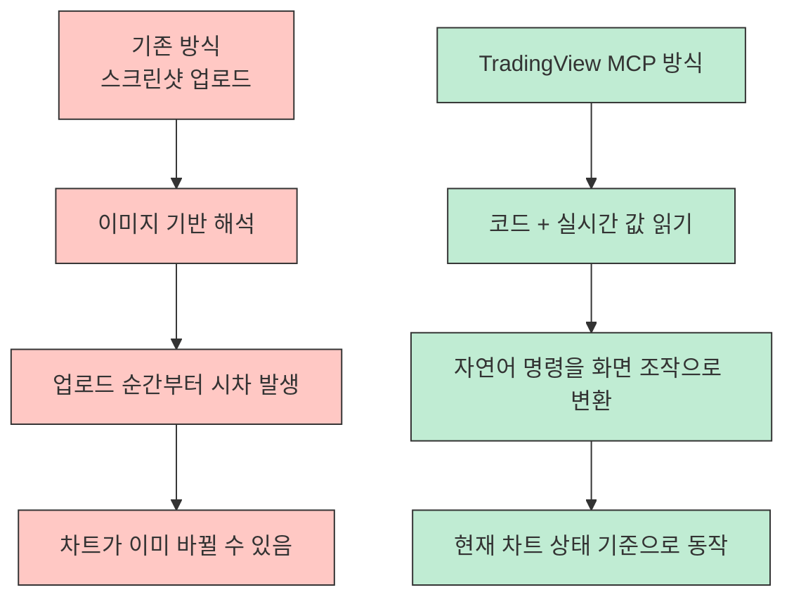
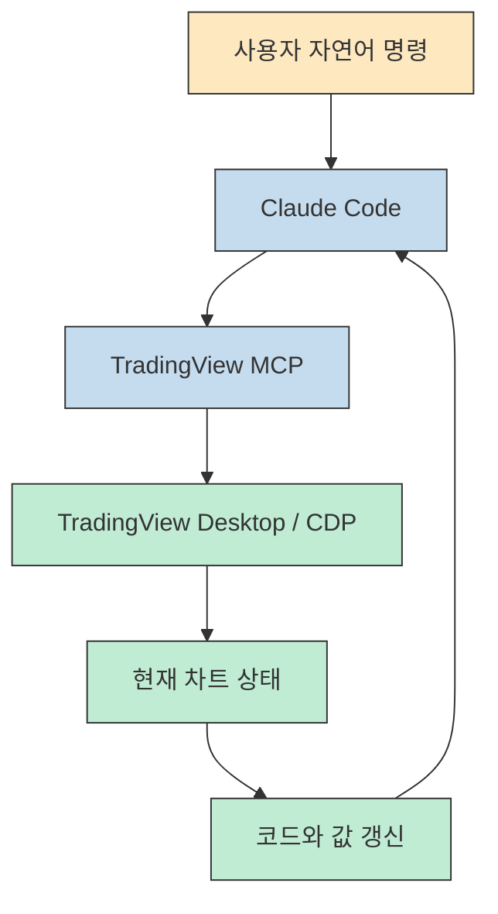
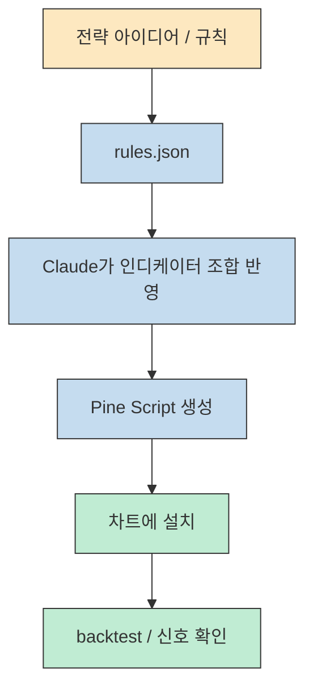
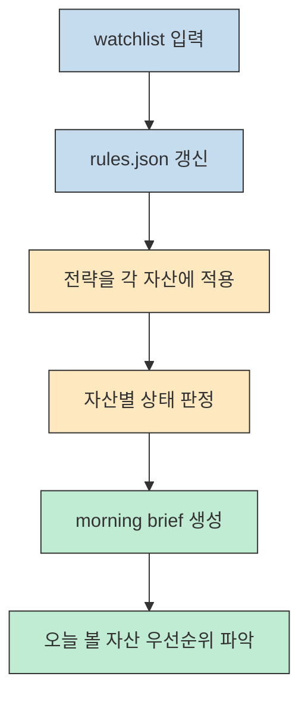

AI로 차트를 읽는다고 할 때 많은 사람이 떠올리는 방식은 비슷합니다. TradingView 화면을 캡처해서 AI에 올리고, 거기서 해석을 받는 방식입니다. 그런데 Lewis Jackson의 영상은 이 접근 자체가 이미 늦고 부정확하다고 지적합니다. 대신 **Claude가 TradingView의 화면 이미지를 보는 것이 아니라, 차트 뒤에서 바뀌는 코드와 값 자체를 읽게 만들자** 는 쪽으로 갑니다. [영상 2:17](https://youtu.be/vIX6ztULs4U?t=137) [영상 3:17](https://youtu.be/vIX6ztULs4U?t=197)
<!--more-->

이 글은 영상의 주장 가운데 홍보성 표현은 덜어내고, 실제로 중요한 구조만 정리합니다. 핵심은 다섯 가지입니다. `TradingView MCP` 가 무엇인지, 왜 screenshot 기반보다 다른지, 설치는 어떤 흐름인지, `rules.json` 과 `Pine Script` 가 어떤 역할을 하는지, 그리고 watchlist와 `morning brief` 까지 어떻게 이어지는지입니다.

## Sources

- https://youtu.be/vIX6ztULs4U?si=wjTHpAeUDDylyCgg

## 1) 핵심 아이디어: Claude가 이미지를 읽는 것이 아니라 차트의 "코드와 값"을 읽는다

영상이 가장 먼저 강조하는 차별점은 이것입니다. 기존 AI 차트 도구는 대개 screenshot을 기반으로 동작합니다. 그런데 screenshot은 업로드하는 순간 이미 시간이 지나 있고, 촛대가 조금만 움직여도 해석 기준이 달라질 수 있습니다. 게다가 픽셀 수준의 작은 차이가 실제 트레이딩 판단에는 꽤 중요할 수 있습니다. [영상 0:23](https://youtu.be/vIX6ztULs4U?t=23) [영상 2:49](https://youtu.be/vIX6ztULs4U?t=169)

반면 이 시스템에서 Claude는 이미지를 읽지 않습니다. 발표자 설명에 따르면 Claude는 TradingView 페이지의 **코드와 화면 값** 을 실시간으로 읽고, 그 위에서 동작합니다. 그래서 "Bitcoin 1주봉을 열어 줘", "볼륨 인디케이터를 제거해 줘" 같은 명령을 터미널에서 자연어로 내리면, Claude가 그 요청을 해석해 화면을 직접 바꿉니다. [영상 3:17](https://youtu.be/vIX6ztULs4U?t=197) [영상 9:00](https://youtu.be/vIX6ztULs4U?t=540)

이 차이는 단순 편의성보다 훨씬 큽니다. screenshot workflow는 "이 이미지를 어떻게 읽을까"에 가깝지만, MCP 방식은 **실시간 인터페이스를 Claude에게 노출해 차트 조작과 상태 확인을 자동화하는 것** 에 가깝습니다. 즉 chart-reading AI라기보다, Claude를 TradingView 위에 연결한 operable layer로 보는 편이 더 정확합니다. [영상 2:20](https://youtu.be/vIX6ztULs4U?t=140) [영상 4:00](https://youtu.be/vIX6ztULs4U?t=240)

## 2) 내부 동작 원리: Inspect, CDP, MCP를 통해 실시간 페이지 상태에 붙는다

영상은 내부 동작을 아주 깊게 설명하지는 않지만, 직관적인 비유는 줍니다. 브라우저에서 우클릭 후 `Inspect` 를 열면 페이지의 코드가 보이고, 화면이 바뀌면 그 코드도 동적으로 바뀐다는 점입니다. 발표자는 TradingView와 Claude를 잇는 프로젝트가 바로 이 동적인 페이지 상태를 읽는 방식이라고 설명합니다. [영상 4:09](https://youtu.be/vIX6ztULs4U?t=249)

또 setup 중간에 `TradingView desktop` 을 설치하고, **CDP가 live 상태인지 확인** 하는 단계가 나옵니다. 여기서 CDP는 Claude가 TradingView 앱/페이지와 연결돼 실제 상태를 읽고 조작할 수 있는 통로 역할을 하는 것으로 제시됩니다. [영상 7:12](https://youtu.be/vIX6ztULs4U?t=432) [영상 8:03](https://youtu.be/vIX6ztULs4U?t=483)

중요한 것은 이 구조가 "Claude가 차트를 이해한다"는 말보다, **Claude가 TradingView라는 인터페이스에 접속해 현재 상태를 코드 수준에서 다룬다** 는 의미라는 점입니다. 그래서 영상에서 이 도구를 단순 해석기가 아니라 "code-to-code basis"에 가깝다고 말하는 것입니다. [영상 2:12](https://youtu.be/vIX6ztULs4U?t=132)

## 3) 설치 흐름: 복잡한 수작업 대신 one-shot setup prompt

영상 초반에는 원래 GitHub에 manual version이 있지만, 발표자가 그 과정을 귀찮고 실수하기 쉬운 방식으로 보고 **one-shot setup prompt** 를 준비했다고 설명합니다. 사용자는 이 프롬프트를 Claude Code에 붙여 넣고, 몇 가지 확인 질문에 답하면 됩니다. 그 과정에서 `mcp.json` 생성 여부를 묻는 장면도 나옵니다. [영상 5:00](https://youtu.be/vIX6ztULs4U?t=300) [영상 5:21](https://youtu.be/vIX6ztULs4U?t=321)

그다음 흐름은 대체로 이렇습니다.

1. Claude Code에서 one-shot setup 실행
2. `mcp.json` 같은 설정 파일 생성 허용
3. TradingView Desktop 설치 및 실행
4. Claude가 안내한 명령으로 연결 상태 확인
5. `TV health check` 와 CDP live 상태 확인 [영상 7:12](https://youtu.be/vIX6ztULs4U?t=432) [영상 8:03](https://youtu.be/vIX6ztULs4U?t=483)

영상 관점에서 이 단계는 "설치"라기보다 **Claude가 TradingView를 다룰 수 있는 실행 환경을 만드는 단계** 입니다. 한 번 연결되면 이후에는 세부 설정을 파일을 직접 열어 편집하는 대신, 가능하면 계속 Claude에게 말로 시키는 흐름을 유지합니다. 발표자가 파일 수정보다 대화를 선호한다고 밝히는 이유도 여기에 있습니다. [영상 8:19](https://youtu.be/vIX6ztULs4U?t=499)

## 4) `rules.json` 은 전략의 기억장치이고, `Pine Script` 는 실행 가능한 전략 형식이다

영상에서 가장 중요한 파일은 `rules.json` 입니다. CDP 연결이 완료된 뒤 하단에 "`watchlist` 와 `trading rules` 를 `rules.json` 에 채우라"는 메시지가 나오고, 발표자는 직접 파일을 열기보다 Claude에게 말로 지시해 이 파일을 채우게 합니다. [영상 8:21](https://youtu.be/vIX6ztULs4U?t=501)

이 파일 안에는 대략 이런 성격의 정보가 들어갑니다.

- 어떤 자산을 볼지
- 어떤 타임프레임을 쓸지
- 진입 조건과 청산 조건
- 강세/약세/중립 판단 기준
- watchlist와 관련 규칙 [영상 17:48](https://youtu.be/vIX6ztULs4U?t=1068)

하지만 `rules.json` 만으로는 아직 화면 위에 전략이 보이지 않습니다. 영상은 여기서 한 단계를 더 밟습니다. Claude가 조사하거나 사용자가 설명한 전략을 **Pine Script로 변환** 해서 TradingView 차트 위에 올리는 것입니다. 발표자는 공개 트레이더들의 전략을 조사하게 한 뒤, 그 결과를 차트에 반영하고, 이어서 Pine Script로 만들어 과거 구간에서 backtest 가능하게 만드는 흐름을 보여 줍니다. [영상 10:00](https://youtu.be/vIX6ztULs4U?t=600) [영상 11:19](https://youtu.be/vIX6ztULs4U?t=679) [영상 12:24](https://youtu.be/vIX6ztULs4U?t=744)

이 구조를 보면 `rules.json` 은 사람이 설명하는 전략의 저장소이고, Pine Script는 그 전략을 TradingView가 실제로 실행·표시·백테스트할 수 있는 형식이라고 볼 수 있습니다. 즉 **말로 설명한 규칙 → JSON 규칙 저장 → Pine Script 실행 전략** 으로 번역하는 파이프라인이 핵심입니다. [영상 12:08](https://youtu.be/vIX6ztULs4U?t=728) [영상 12:31](https://youtu.be/vIX6ztULs4U?t=751)

## 5) 운영 자동화의 핵심: watchlist와 morning brief

발표자가 원본 프로젝트에 덧붙여 개선했다고 강조하는 부분이 바로 watchlist와 `morning brief` 입니다. 기존에는 자산을 하나씩 열어서 AI에게 "이더리움 봐 줘, 다음엔 솔라나 봐 줘"처럼 반복 지시해야 했다고 합니다. 그런데 발표자가 추가한 개선은 **watchlist 전체를 기준으로 한 번에 상태를 훑고 요약을 받는 흐름** 입니다. [영상 13:00](https://youtu.be/vIX6ztULs4U?t=780) [영상 14:00](https://youtu.be/vIX6ztULs4U?t=840)

watchlist를 넣으면 Claude는 각 자산에 같은 전략을 적용하고, weekly 기준으로 bearish / neutral 같은 상태를 요약해 줍니다. 이어서 `morning brief` 명령을 실행하면 모든 자산의 상태를 한 번에 정리한 보고서를 돌려줍니다. 발표자는 이걸 하루 한 번 아침에 쓰는 브리프처럼 설명하지만, 필요하면 10분마다, 심지어 1분마다도 돌릴 수 있다고 말합니다. [영상 16:00](https://youtu.be/vIX6ztULs4U?t=960) [영상 17:00](https://youtu.be/vIX6ztULs4U?t=1020)

이건 단순 편의 기능이 아니라 운영 방식 자체를 바꿉니다. 사용자가 자산마다 수동으로 열람하고 판단하는 대신, **전략과 watchlist를 한 번 정의해 두고 브리프로 상태를 받는 구조** 로 바뀌기 때문입니다. 발표자가 이걸 가장 큰 실전 개선점 중 하나로 보는 이유도 여기에 있습니다. [영상 17:08](https://youtu.be/vIX6ztULs4U?t=1028) [영상 18:12](https://youtu.be/vIX6ztULs4U?t=1092)

## 6) 실전 적용 포인트

이 영상을 실무 관점에서 읽으면, 핵심은 "AI에게 차트 예측을 맡긴다"가 아닙니다. 오히려 아래처럼 보는 편이 더 정확합니다.

1. TradingView를 Claude가 조작 가능한 실행 환경으로 만든다.
2. 자연어로 전략 규칙과 watchlist를 정의한다.
3. 그 규칙을 `rules.json` 에 저장한다.
4. 필요하면 Pine Script로 변환해 차트에 구현하고 backtest한다.
5. 이후에는 morning brief로 여러 자산의 상태를 빠르게 점검한다.

즉 이건 예측 모델 하나를 붙이는 접근이 아니라, **Claude를 전략 번역기이자 차트 운영 자동화 레이어로 쓰는 접근** 입니다.

다만 영상 내용만 기준으로 봐도 몇 가지는 분명히 구분할 필요가 있습니다.

- 이것은 투자 조언 시스템이 아니라 자동화 인터페이스에 더 가깝습니다.
- 공개 트레이더 전략을 가져와 Pine Script로 바꾸는 흐름은 기술적으로는 가능하지만, 전략 검증 책임은 사용자에게 있습니다.
- morning brief가 준 신호는 "현재 규칙 기준 상태 요약"이지, 수익 보장을 뜻하지 않습니다.

따라서 이 도구의 진짜 강점은 매매 판단 자체보다 **차트 조작, 전략 적용, watchlist 요약, 브리핑 자동화의 속도** 에 있다고 보는 편이 안전합니다.

## 핵심 요약

- 이 영상의 핵심은 Claude가 TradingView screenshot을 읽는 것이 아니라, TradingView의 코드와 값을 실시간으로 다루게 만든다는 점이다. [영상 3:17](https://youtu.be/vIX6ztULs4U?t=197)
- 연결 과정에는 one-shot setup, `mcp.json`, TradingView Desktop, CDP live 확인이 포함된다. [영상 5:00](https://youtu.be/vIX6ztULs4U?t=300) [영상 8:03](https://youtu.be/vIX6ztULs4U?t=483)
- `rules.json` 은 watchlist와 트레이딩 규칙을 담는 핵심 파일이다. [영상 8:21](https://youtu.be/vIX6ztULs4U?t=501)
- Claude는 전략 설명을 바탕으로 인디케이터를 적용하고, 더 나아가 Pine Script로 변환해 backtest 가능한 형태로 만들 수 있다. [영상 11:19](https://youtu.be/vIX6ztULs4U?t=679) [영상 12:24](https://youtu.be/vIX6ztULs4U?t=744)
- watchlist와 `morning brief` 는 여러 자산을 한 번에 점검하는 운영 자동화 레이어다. [영상 14:00](https://youtu.be/vIX6ztULs4U?t=840) [영상 17:00](https://youtu.be/vIX6ztULs4U?t=1020)

## 결론

이 영상이 보여 주는 것은 "AI가 차트를 더 잘 예측한다"는 약속이라기보다, **Claude를 TradingView 위에서 작동하는 자동화 조수로 바꾸는 방식** 입니다. 실시간 차트 상태 접근, 전략의 규칙화, Pine Script 생성, watchlist 브리핑까지 이어지는 흐름은 분명히 강력합니다.

하지만 진짜 포인트는 예언이 아니라 구조입니다. TradingView MCP는 Claude에게 차트를 보여 주는 도구가 아니라, Claude가 차트 환경 안에서 일하게 만드는 도구입니다. 그래서 이 영상을 볼 때는 "이게 맞는 매매 신호인가?"보다 먼저, **"내가 쓰는 전략과 점검 루틴을 이렇게 자동화할 수 있는가?"** 를 질문하는 편이 더 생산적입니다.
