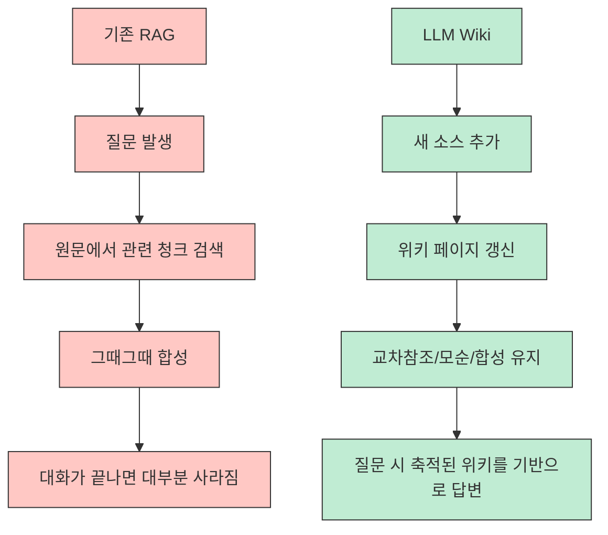
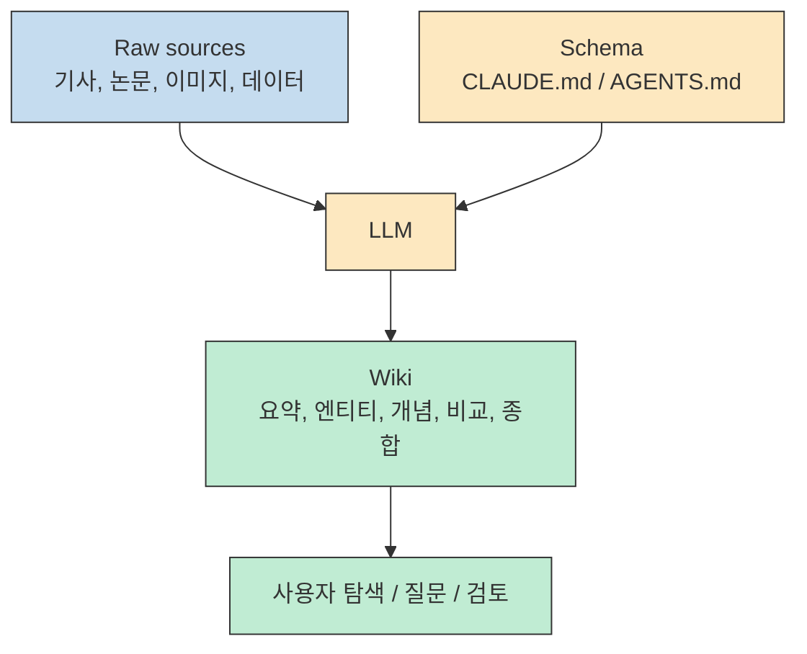
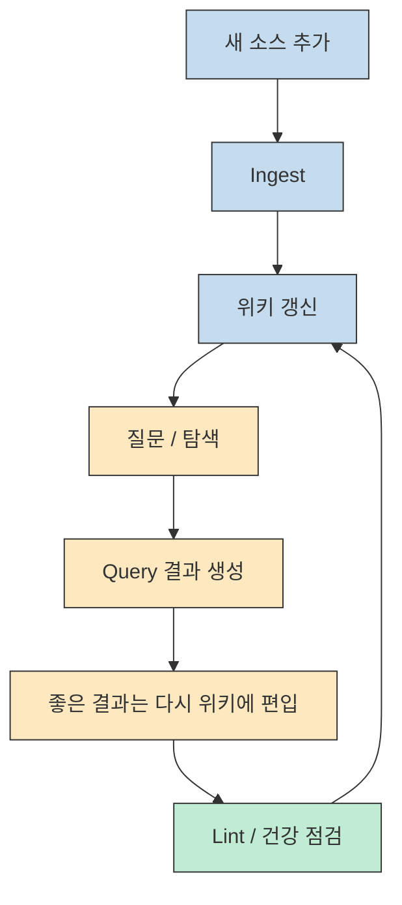
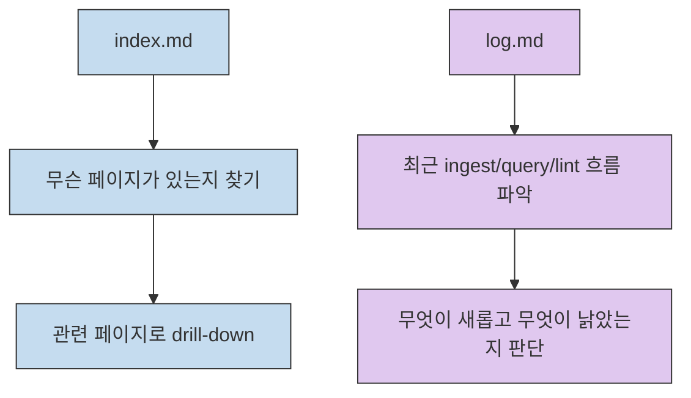

Andrej Karpathy가 공개한 `LLM Wiki` 문서는 구현체가 아니라 패턴 문서에 가깝습니다. 핵심 주장은 단순합니다. 대부분의 RAG는 질문할 때마다 원문에서 관련 조각을 다시 찾고 다시 합성하지만, **LLM이 직접 유지하는 영속적 위키를 하나 두면 지식이 누적되고 복리처럼 쌓일 수 있다** 는 것입니다. [Karpathy gist](https://gist.github.com/karpathy/442a6bf555914893e9891c11519de94f) GeekNews도 이 포인트를 잘 요약하면서, 개인 지식 저장소·연구·독서·팀 위키 등으로 확장 가능한 패턴으로 소개했습니다. [GeekNews](https://news.hada.io/topic?id=28208)
<!--more-->

이 아이디어가 흥미로운 이유는 "RAG를 더 정교하게 만든다"가 아니라, **검색 이전에 지식을 한 번 구조화해 두자** 는 방향 전환을 제안하기 때문입니다. 말하자면 원문 문서와 질문 사이에 `wiki` 라는 중간층을 두고, LLM은 매 질문마다 처음부터 찾는 존재가 아니라 그 위키를 계속 편집·갱신하는 관리자 역할을 맡습니다. 이 글에서는 gist 원문을 중심으로 구조를 정리하고, GeekNews에서 드러난 실전 해석과 우려도 함께 묶어 보겠습니다.

## Sources

- https://gist.github.com/karpathy/442a6bf555914893e9891c11519de94f
- https://news.hada.io/topic?id=28208

## 1) 핵심 차이: RAG는 매번 다시 찾고, LLM Wiki는 한 번 쌓고 계속 유지한다

Karpathy가 가장 먼저 대비시키는 것은 기존 RAG 흐름입니다. 보통은 문서를 업로드해 두고, 질문이 들어올 때마다 관련 청크를 검색해 답변을 생성합니다. 이 방식도 유용하지만, 미묘한 질문을 할 때마다 LLM은 관련 조각을 다시 찾고, 다시 조립하고, 다시 합성해야 합니다. 즉 매 질문이 사실상 "새로운 재발견"입니다. NotebookLM, ChatGPT 파일 업로드, 일반적인 RAG 시스템 다수가 이 구조에 가깝다고 gist는 설명합니다. [Karpathy gist](https://gist.github.com/karpathy/442a6bf555914893e9891c11519de94f)

반대로 `LLM Wiki` 의 아이디어는 질의 시점에만 검색하는 대신, **원문과 질문 사이에 지속적으로 갱신되는 wiki 층을 둔다** 는 것입니다. 새 소스가 들어오면 LLM은 단순히 인덱싱만 하지 않고, 기존 위키의 엔티티 페이지를 갱신하고, 토픽 요약을 고치고, 새 데이터가 기존 주장과 충돌하는지 표시하고, 전체 합성을 더 강하게 만듭니다. 지식은 질문마다 다시 파는 것이 아니라 한 번 축적되고 계속 최신화됩니다. [Karpathy gist](https://gist.github.com/karpathy/442a6bf555914893e9891c11519de94f)

Karpathy는 이 차이를 **persistent, compounding artifact** 라는 표현으로 설명합니다. 이미 교차 참조가 있고, 이미 모순이 표시되어 있고, 이미 합성이 반영된 결과물이 위키로 남아 있다는 뜻입니다. 그래서 사용자가 좋은 질문을 할수록, 그리고 좋은 소스를 더할수록 지식베이스가 복리처럼 좋아지는 구조가 됩니다. GeekNews 요약 역시 이 부분을 "영속적 위키"와 "점진적 축적"으로 받아 적고 있습니다. [Karpathy gist](https://gist.github.com/karpathy/442a6bf555914893e9891c11519de94f) [GeekNews](https://news.hada.io/topic?id=28208)

## 2) 아키텍처는 의외로 단순하다: Raw sources, Wiki, Schema

gist가 제안하는 구조는 세 층뿐입니다.

1. `Raw sources`
2. `The wiki`
3. `The schema`

`Raw sources` 는 기사, 논문, 이미지, 데이터 파일 같은 원문 소스 모음입니다. 이 레이어는 **immutable**, 즉 수정하지 않는 진실의 원천입니다. LLM은 여기서 읽기만 하고 원문 자체는 건드리지 않습니다. [Karpathy gist](https://gist.github.com/karpathy/442a6bf555914893e9891c11519de94f)

`The wiki` 는 LLM이 실제로 관리하는 markdown 디렉터리입니다. 요약 페이지, 엔티티 페이지, 개념 페이지, 비교 페이지, 개요, 종합 문서가 여기에 쌓입니다. 사용자는 읽고 탐색하고, LLM은 이 레이어를 쓰고 고칩니다. GeekNews 요약이 말한 "Obsidian을 열어두고 LLM이 실시간으로 마크다운을 편집한다"는 흐름이 바로 이 레이어의 사용 방식입니다. [Karpathy gist](https://gist.github.com/karpathy/442a6bf555914893e9891c11519de94f) [GeekNews](https://news.hada.io/topic?id=28208)

`The schema` 는 위키 구조와 컨벤션, ingest/query/lint 방법을 정의하는 설정 문서입니다. Karpathy는 Claude Code라면 `CLAUDE.md`, Codex라면 `AGENTS.md` 같은 문서를 예로 듭니다. 즉 중요한 것은 "LLM이 똑똑하다"가 아니라, **LLM을 일관된 위키 관리자처럼 행동하게 만드는 운영 규칙** 입니다. [Karpathy gist](https://gist.github.com/karpathy/442a6bf555914893e9891c11519de94f)

이 구조가 좋은 이유는 책임 분리가 명확하기 때문입니다. 원문은 그대로 두고, LLM이 만드는 것은 중간 결과물이며, 그 LLM의 행동 방식은 schema로 통제합니다. 즉 원문, 가공물, 운영 규칙이 섞이지 않습니다. 이 점이 나중에 유지보수성과 신뢰성을 좌우합니다.

## 3) 운영은 세 가지 루프다: Ingest, Query, Lint

Karpathy는 `LLM Wiki` 의 운영을 세 개의 루프로 설명합니다.

### 3-1) Ingest

새 소스를 raw collection에 넣고 LLM에게 처리하라고 지시합니다. 그 결과 LLM은 소스를 읽고, 핵심 내용을 요약하고, 인덱스를 갱신하고, 관련 엔티티/개념 페이지를 업데이트하고, 로그에 항목을 남깁니다. gist는 **단일 소스가 10~15개 위키 페이지를 건드릴 수 있다** 고까지 말합니다. GeekNews도 이 대목을 인용해 "단일 소스 처리 시 10~15개 페이지 업데이트 가능"이라고 정리합니다. [Karpathy gist](https://gist.github.com/karpathy/442a6bf555914893e9891c11519de94f) [GeekNews](https://news.hada.io/topic?id=28208)

### 3-2) Query

질문이 들어오면 LLM은 위키에서 관련 페이지를 찾고, 읽고, 인용과 함께 답을 합성합니다. 중요한 포인트는 여기서 나온 좋은 답변도 **다시 위키의 새 페이지로 저장할 수 있다** 는 점입니다. 비교표든 분석 문서든 새로운 연결 통찰이든, 채팅창에서 사라지지 않고 지식베이스로 편입됩니다. [Karpathy gist](https://gist.github.com/karpathy/442a6bf555914893e9891c11519de94f)

### 3-3) Lint

주기적으로 위키를 점검합니다. 페이지 간 모순, 최신 소스에 의해 오래된 주장, inbound link 없는 고아 페이지, 별도 페이지가 필요한 중요 개념, 누락된 교차 참조, 웹 검색으로 보완할 수 있는 데이터 공백 등을 찾게 합니다. gist는 이 lint 단계가 위키 건강도를 유지하는 핵심이라고 봅니다. [Karpathy gist](https://gist.github.com/karpathy/442a6bf555914893e9891c11519de94f)

이 세 루프를 보면 `LLM Wiki` 는 단순 문서 저장소가 아닙니다. ingest는 입력 루프, query는 활용 루프, lint는 정비 루프입니다. 결국 이 셋이 함께 돌아야 지식베이스가 "살아 있는 시스템"이 됩니다.

## 4) index.md와 log.md가 사실상 경량 검색 엔진 역할을 한다

gist는 특별히 `index.md` 와 `log.md` 를 중요 파일로 따로 설명합니다.

`index.md` 는 콘텐츠 중심 파일입니다. 위키의 모든 페이지를 링크와 한 줄 요약, 때로는 날짜나 source count 같은 메타데이터와 함께 나열하는 카탈로그입니다. Karpathy는 LLM이 질문에 답할 때 먼저 index를 읽고, 그다음 관련 페이지로 들어가는 방식이 **중간 규모(~100 sources, hundreds of pages)** 에서는 surprisingly well 작동한다고 말합니다. 즉 이 정도 규모라면 굳이 embedding 기반 RAG 인프라 없이도 탐색이 가능하다는 뜻입니다. [Karpathy gist](https://gist.github.com/karpathy/442a6bf555914893e9891c11519de94f)

`log.md` 는 시간순 기록입니다. ingest, query, lint가 언제 무슨 주제로 일어났는지 append-only 형식으로 남깁니다. gist는 접두사를 일정하게 맞추면 `grep` 같은 유닉스 도구로 최근 항목을 쉽게 추적할 수 있다고 설명합니다. 즉 log는 인간을 위한 audit trail이면서, LLM에게도 "최근 무슨 일이 있었는지"를 알려 주는 메모리 장치입니다. [Karpathy gist](https://gist.github.com/karpathy/442a6bf555914893e9891c11519de94f)

이 지점이 중요합니다. 많은 사람이 RAG를 떠올리면 바로 벡터 인덱스부터 생각하지만, `LLM Wiki` 는 우선 **사람과 LLM 모두가 읽을 수 있는 목차 구조** 로 버텨 보자는 아이디어입니다. 규모가 더 커지면 qmd 같은 로컬 검색 엔진을 붙일 수 있다고 gist는 말합니다. 즉 검색 엔진은 처음부터 전제가 아니라, 위키가 성장한 다음에 붙는 선택적 보강재입니다. [Karpathy gist](https://gist.github.com/karpathy/442a6bf555914893e9891c11519de94f)

## 5) 왜 이게 매력적인가: 유지보수 비용을 LLM에게 넘긴다

gist의 "Why this works" 섹션은 사실상 이 문서의 철학적 핵심입니다. 지식 베이스 유지의 어려움은 읽기나 생각 자체가 아니라, **북키핑(bookkeeping)** 이라는 것입니다. 교차 참조를 갱신하고, 요약을 최신화하고, 새 데이터가 기존 주장과 충돌하는지 표시하고, 여러 페이지의 일관성을 맞추는 일이 너무 귀찮아서 인간은 결국 위키를 버린다는 진단입니다. [Karpathy gist](https://gist.github.com/karpathy/442a6bf555914893e9891c11519de94f)

Karpathy는 여기서 인간과 LLM의 역할을 아주 명확히 가릅니다.

- 인간: 소스를 큐레이션하고, 질문을 던지고, 해석의 방향을 잡는다
- LLM: 요약, 교차 참조, 분류, 갱신, 정리, 일관성 유지 같은 반복 노동을 맡는다

즉 `LLM Wiki` 는 "AI가 인간 대신 생각한다"는 발상보다는, **지식 관리에서 인간이 싫어하는 유지보수 비용을 LLM이 흡수한다** 는 발상에 가깝습니다. GeekNews 요약도 이 부분을 "북키핑 비용을 거의 0에 가깝게 낮춘다"는 말로 받아 적었습니다. [Karpathy gist](https://gist.github.com/karpathy/442a6bf555914893e9891c11519de94f) [GeekNews](https://news.hada.io/topic?id=28208)

## 6) GeekNews 반응을 보면 이 아이디어의 현실적 쟁점도 보인다

GeekNews의 장점은 gist 요약만이 아니라 커뮤니티 반응이 같이 보인다는 점입니다. 읽어 보면 크게 세 갈래의 해석이 나옵니다.

첫째, **실제로 바로 구현해 보는 흐름** 입니다. 댓글에는 Obsidian 볼트를 GitHub 백업과 연결해 보거나, 다른 LLM용 파서를 붙여 봤다는 사례가 나옵니다. 즉 이 아이디어를 단순 이론보다 실제 PKM/에이전트 시스템으로 곧바로 옮기려는 반응이 강합니다. [GeekNews](https://news.hada.io/topic?id=28208)

둘째, **검색과 구조화 문제** 입니다. BM25가 한국어 검색에 약하니 한글 검색용 가드레일을 따로 넣었다는 언급도 있습니다. 이는 gist가 말한 "index로도 중간 규모는 충분"하다는 주장에 더해, 실제 언어권과 도메인에 맞는 retrieval 보강이 필요할 수 있음을 보여 줍니다. 이 부분은 단일 댓글 기반이므로 확정적 사실이라기보다 커뮤니티 실전 포인트로 보는 편이 맞습니다. [GeekNews](https://news.hada.io/topic?id=28208)

셋째, **컨텍스트 부패와 모델 붕괴 우려** 입니다. Hacker News 의견을 옮긴 부분에서는 LLM이 LLM이 쓴 문서를 계속 다시 다루면 품질이 누적 저하될 수 있다는 걱정, 혹은 `claude.md` 하나도 제대로 유지 못하는데 위키 전체를 안정적으로 유지할 수 있겠느냐는 회의가 나옵니다. 이것 역시 검증된 결론이라기보다 커뮤니티의 합리적 우려로 읽는 편이 좋습니다. 다만 중요한 건, `LLM Wiki` 가 "무조건 더 낫다"는 답이 아니라 **축적과 유지보수라는 이득을 위해 어떤 위험을 감수할지 선택하는 패턴** 이라는 점입니다. [GeekNews](https://news.hada.io/topic?id=28208)

## 7) 실전 적용 포인트

이 아이디어를 실제로 적용할 때는 처음부터 거창하게 가기보다 아래 순서가 안전합니다.

1. 원문 소스 저장소와 위키 디렉터리를 분리한다.
2. `CLAUDE.md` 혹은 `AGENTS.md` 에 위키의 구조, 파일 명명 규칙, ingest/query/lint 절차를 적는다.
3. `index.md` 와 `log.md` 를 가장 먼저 만든다.
4. 처음에는 소스를 하나씩 ingest 하며 사람이 결과를 검토한다.
5. 모순 표시, 링크 누락, stale claim 탐지를 lint 루프로 정기화한다.
6. 규모가 커질 때만 qmd 같은 검색 엔진을 붙인다.

중요한 점은 `LLM Wiki` 가 구현체가 아니라 패턴이라는 것입니다. gist도 마지막에 이 문서는 일부러 추상적으로 썼고, 디렉터리 구조나 페이지 포맷은 각자의 도메인과 취향에 맞게 LLM과 함께 구체화하라고 말합니다. 즉 정답 폴더 구조가 있는 것이 아니라, **영속적 위키라는 중간층을 두고 지식을 누적시킨다** 는 원칙이 핵심입니다. [Karpathy gist](https://gist.github.com/karpathy/442a6bf555914893e9891c11519de94f)

실무적으로는 이런 팀에 특히 잘 맞습니다.

- 장기 리서치를 하는 개인/팀
- 프로젝트 문서가 흩어져 있고 유지가 안 되는 조직
- 단발성 Q&A보다 축적형 지식이 더 중요한 환경
- Obsidian 같은 markdown 기반 도구를 이미 쓰는 사용자

반대로 아래 경우에는 조심해야 합니다.

- 원문보다 wiki가 더 권위 있어지는 순간
- LLM이 쓴 요약을 검증 없이 계속 다시 재료로 쓰는 순간
- 구조 설계 없이 무작정 페이지부터 늘리는 순간

즉 이 패턴의 진짜 성패는 모델 성능만이 아니라 **schema와 검토 루프를 얼마나 잘 설계하느냐** 에 달려 있습니다.

## 핵심 요약

- `LLM Wiki` 의 핵심은 매 질의마다 raw 문서를 다시 찾는 대신, LLM이 유지하는 영속적 위키를 중간층으로 두는 것이다. [Karpathy gist](https://gist.github.com/karpathy/442a6bf555914893e9891c11519de94f)
- 구조는 `Raw sources`, `Wiki`, `Schema` 의 세 계층으로 단순하다. [Karpathy gist](https://gist.github.com/karpathy/442a6bf555914893e9891c11519de94f)
- 운영은 `Ingest`, `Query`, `Lint` 세 루프로 돌아가며, 좋은 답변도 다시 위키로 편입시켜 지식을 누적한다. [Karpathy gist](https://gist.github.com/karpathy/442a6bf555914893e9891c11519de94f)
- `index.md` 와 `log.md` 는 경량 검색과 시간순 메모리 역할을 맡는다. [Karpathy gist](https://gist.github.com/karpathy/442a6bf555914893e9891c11519de94f)
- 이 패턴의 매력은 지식 유지의 북키핑 비용을 LLM에게 넘기는 데 있다. [Karpathy gist](https://gist.github.com/karpathy/442a6bf555914893e9891c11519de94f) [GeekNews](https://news.hada.io/topic?id=28208)
- 다만 커뮤니티에서는 검색 품질, 위키 유지 가능성, LLM이 쓴 요약의 누적 품질 저하 가능성 같은 우려도 함께 제기된다. 이는 현재로서는 실전적 검토 포인트다. [GeekNews](https://news.hada.io/topic?id=28208)

## 결론

Karpathy의 `LLM Wiki` 는 "RAG를 버리자"는 선언이 아니라, **지식 축적의 중심을 retrieval에서 maintenance로 옮겨 보자** 는 제안에 가깝습니다. 매번 원문에서 다시 캐내는 대신, 한 번 구조화된 위키를 계속 키우고 다듬는 쪽으로 무게를 옮기자는 것입니다.

그래서 이 아이디어를 볼 때 핵심 질문은 "벡터 검색이 더 좋으냐"가 아닙니다. 오히려 **"내 지식 작업에서 진짜 병목은 검색인가, 아니면 유지보수인가?"** 입니다. 그 답이 후자라면, `LLM Wiki` 는 꽤 진지하게 실험해 볼 가치가 있는 패턴입니다.
