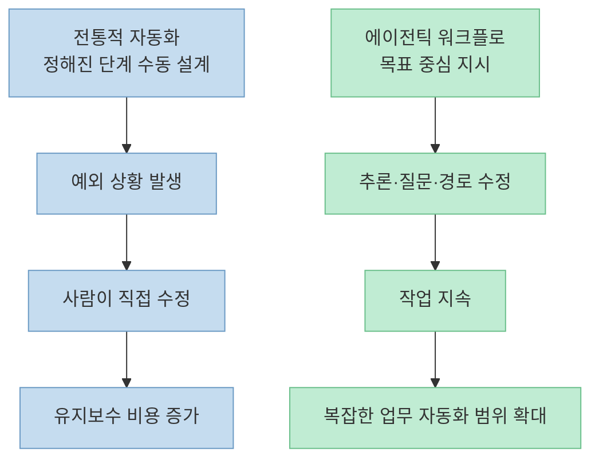
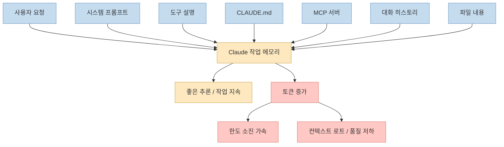
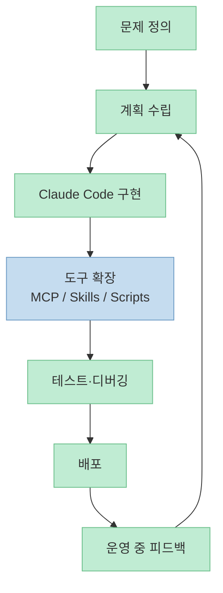
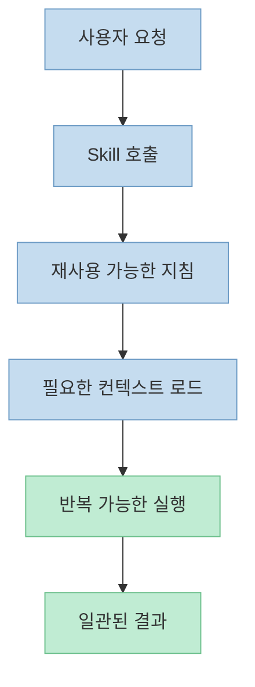
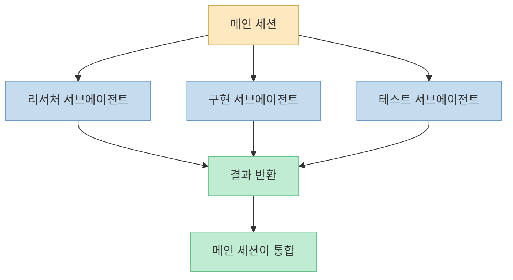
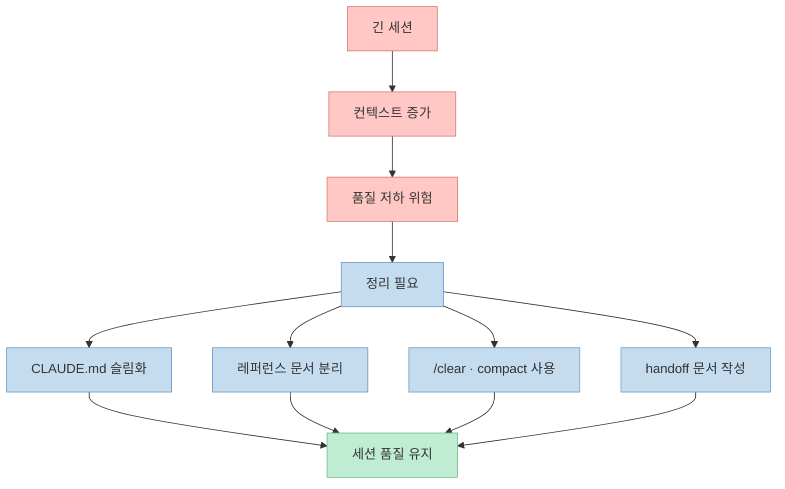
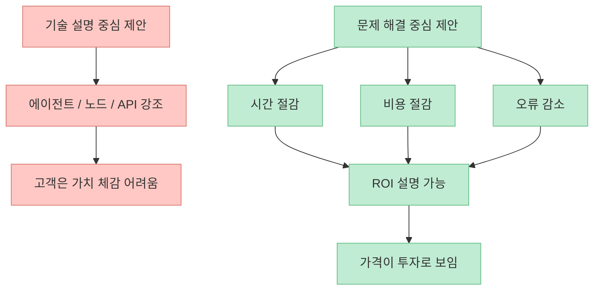

Nate Herk의 `Build & Sell with Claude Code (10+ Hour Course)` 는 단순한 사용법 영상이 아니라, **Claude Code를 개발 도구이자 자동화 오케스트레이터, 그리고 수익화 가능한 서비스 제작 도구로 보는 관점** 을 길게 밀어붙이는 코스입니다. 영상은 왜 이걸 배워야 하는지부터 시작해 환경 설정, 컨텍스트 관리, 워크플로 구축, MCP와 스킬, 서브에이전트, 브라우저 자동화, GitHub 운용, 그리고 마지막에는 실제로 어떻게 팔고 넘길지까지 한 흐름으로 묶습니다. ([t=74](https://youtu.be/mpALXah_PBg?t=74), [t=1568](https://youtu.be/mpALXah_PBg?t=1568), [t=6643](https://youtu.be/mpALXah_PBg?t=6643), [t=22083](https://youtu.be/mpALXah_PBg?t=22083), [t=30306](https://youtu.be/mpALXah_PBg?t=30306))

특히 인상적인 부분은 Claude Code를 "코드를 대신 쳐주는 채팅창" 으로 축소하지 않는다는 점입니다. 이 코스에서 Claude Code는 프로젝트 문서를 읽고, 필요한 도구를 호출하고, 병렬 작업을 분리하고, 테스트하고, 배포하고, 나아가 고객 문제를 해결하는 산출물까지 조직하는 **작업 시스템** 으로 다뤄집니다. 그래서 이 영상의 핵심은 기능 나열보다도, **어떤 운영 원리로 Claude Code를 써야 생산성과 품질이 올라가는가** 에 더 가깝습니다. ([t=2485](https://youtu.be/mpALXah_PBg?t=2485), [t=3053](https://youtu.be/mpALXah_PBg?t=3053), [t=3310](https://youtu.be/mpALXah_PBg?t=3310), [t=24690](https://youtu.be/mpALXah_PBg?t=24690))

<!--more-->

## Sources

- [Build & Sell with Claude Code (10+ Hour Course) - YouTube](https://youtu.be/mpALXah_PBg?si=4Y-JeDMP2I35fk1G)

## 1. 이 코스는 Claude Code를 어떤 문제의 해법으로 보나

영상 초반의 문제 정의는 꽤 명확합니다. 발표자는 전통적인 자동화가 예상된 경로에서는 강력하지만, 예외 상황이나 변동성이 들어오면 결국 사람이 다시 붙어서 고쳐야 한다고 설명합니다. 반면 agentic workflow는 "어떻게 할지"를 일일이 고정하기보다 "무엇을 원한다"를 주면 시스템이 추론하고, 필요하면 질문하고, 도중에 경로를 수정하면서 작업을 계속 이어가는 방식으로 소개됩니다. 다만 이 "자기 치유"가 배포 후에도 영원히 자동으로 보장되는 건 아니며, 특히 스케줄 실행이나 webhook 기반 운영에서는 결국 코드와 도구가 배포되는 것이지 상주 에이전트 자체가 배포되는 것은 아니라는 점도 선을 긋습니다. ([t=74](https://youtu.be/mpALXah_PBg?t=74), [t=3537](https://youtu.be/mpALXah_PBg?t=3537))

그래서 이 코스는 Claude Code를 "AI가 코드를 써준다" 수준에서 멈추지 않고, **불확실성이 있는 문제를 다루는 운영 도구** 로 위치시킵니다. 발표자는 시장 전망과 기업 도입 흐름을 예로 들며 이런 워크플로를 만들 수 있는 능력이 가치 있는 기술이 될 것이라고 주장하고, 동시에 영상 후반에서는 이 능력을 어떻게 돈으로 바꿀지까지 연결합니다. 즉 이 코스의 전체 구조는 기술 튜토리얼이라기보다 "빌드와 운영, 판매" 를 한 세트로 보는 프레임입니다. ([t=74](https://youtu.be/mpALXah_PBg?t=74), [t=30306](https://youtu.be/mpALXah_PBg?t=30306))

## 2. 입문자가 먼저 이해해야 할 것: 실행 환경, 토큰, CLAUDE.md

환경 설정 파트에서 발표자는 Claude Code를 터미널, VS Code, 데스크톱 앱 등 여러 surface에서 쓸 수 있지만, 결국 같은 엔진을 여러 방식으로 감싼 구조라고 설명합니다. 여기서 터미널은 가장 강력하고 해킹 가능성이 높지만 텍스트 중심이라 진입 장벽이 있고, 그래픽 환경은 접근성이 좋지만 내부 동작을 깊게 이해하려면 결국 CLI 기반 사고가 필요하다는 식으로 정리합니다. 이 설명의 포인트는 "어디서 쓰느냐" 보다 "Claude Code의 본체는 동일하다" 는 점입니다. ([t=1568](https://youtu.be/mpALXah_PBg?t=1568))

토큰과 컨텍스트 윈도우 설명도 이 코스의 운영 철학을 잘 드러냅니다. 발표자는 토큰을 모델이 읽는 단위, 컨텍스트 윈도우를 Claude의 작업 메모리로 비유하면서, 시스템 프롬프트·도구 설명·`CLAUDE.md`·MCP 서버·대화 내역·파일 내용이 모두 이 메모리를 잠식한다고 설명합니다. 그래서 세션이 길어질수록 비용이 늘고, 중간 정보가 흐려지는 "lost in the middle" 이나 품질 저하가 생길 수 있으니 결국 중요한 건 더 많이 집어넣는 게 아니라 **컨텍스트를 관리하는 것** 이라고 봅니다. ([t=3053](https://youtu.be/mpALXah_PBg?t=3053), [t=27750](https://youtu.be/mpALXah_PBg?t=27750))

`CLAUDE.md` 설명은 더 실용적입니다. 발표자는 이 파일을 프로젝트용 시스템 프롬프트라고 정의하면서, Claude Code가 매 메시지 전에 이 문서를 읽기 때문에 길고 장황한 백과사전이 아니라 "절대 잊으면 안 되는 규칙" 만 담은 얇은 소스 오브 트루스로 유지해야 한다고 권합니다. 세부 레퍼런스는 별도 문서에 두고, `CLAUDE.md` 에는 정체성, 기본 규칙, 참조 위치만 남겨야 토큰 낭비를 줄이면서 일관성을 확보할 수 있다는 설명입니다. ([t=3310](https://youtu.be/mpALXah_PBg?t=3310), [t=27750](https://youtu.be/mpALXah_PBg?t=27750))

## 3. 워크플로 구축의 핵심: 자연어 지시에서 계획, 구현, 배포까지

첫 번째 워크플로 파트에서 발표자는 전통적 자동화와 에이전틱 워크플로의 차이를 다시 한 번 강조합니다. 기존 방식은 노드를 연결하고 변수 전달과 오류 처리를 사람이 직접 설계하는 반면, 에이전틱 방식은 원하는 결과를 설명하면 에이전트가 구현 경로를 조합하고 필요한 질문을 던지는 방향으로 바뀝니다. 물론 이것이 deterministic한 업무를 모두 대체한다는 뜻은 아니고, 오히려 예측 가능한 작업은 기존 자동화가 여전히 강하며 AI 워크플로 빌더의 역할은 **비결정적 과정을 최대한 결정적으로 운영되게 만드는 것** 이라고 설명합니다. ([t=3537](https://youtu.be/mpALXah_PBg?t=3537))

배포 파트로 가면 흐름이 더 선명해집니다. 발표자는 인터페이스 설명, 빌드 프레임워크, 계획 수립, 명확한 커뮤니케이션, MCP와 skills 같은 확장 장치, 테스트, 최적화, 최종 배포를 하나의 루프로 보여주겠다고 말합니다. 즉 Claude Code를 잘 쓰는 법은 단순히 프롬프트를 잘 치는 게 아니라, **계획 → 도구 확장 → 테스트 → 프로덕션 전환** 의 반복 가능한 루프를 만드는 것이라는 메시지입니다. ([t=6643](https://youtu.be/mpALXah_PBg?t=6643))

영상의 챕터 구성만 봐도 이 루프가 얼마나 넓게 잡혀 있는지 드러납니다. `Project Architecture & Commands`, `RAG`, `Turning n8n Workflow into App`, `Website Building Hacks`, `APIs and MCPs` 가 이어지는 배열은 Claude Code를 단순 코딩 툴이 아니라 "여러 시스템을 묶는 조립기" 로 보고 있음을 보여줍니다. 특히 API와 MCP 파트가 별도 장으로 배치된 것은, 생산성을 좌우하는 요소가 모델 자체보다도 **어떤 외부 시스템과 연결되느냐** 임을 시사합니다. ([t=11146](https://youtu.be/mpALXah_PBg?t=11146), [t=11859](https://youtu.be/mpALXah_PBg?t=11859), [t=18002](https://youtu.be/mpALXah_PBg?t=18002))

## 4. 생산성을 폭발시키는 레이어: Skills, Sub-agents, Agent Teams

이 코스의 중반 이후는 사실상 Claude Code를 단일 에이전트에서 다중 작업 시스템으로 확장하는 방법론입니다. 먼저 skills는 발표자 표현대로 reusable instructions, 즉 한 번 작성해 두고 반복해서 호출할 수 있는 실행 절차입니다. 영상 데모에서는 아침 일정 정리, 프로젝트 pulse check, Excalidraw 다이어그램 생성, 유튜브 댓글 분석 같은 작업을 각기 다른 세션에서 병렬로 돌리는데, 핵심은 이 병렬 작업들이 각자 필요한 문맥을 이미 스킬 차원에서 갖고 있다는 점입니다. 그래서 사용자는 매번 긴 설명을 반복하지 않고, 스킬 호출만으로 일관된 결과를 얻습니다. ([t=22083](https://youtu.be/mpALXah_PBg?t=22083))

sub-agent 파트에서는 왜 병렬성이 중요한지가 더 구체화됩니다. 발표자는 메인 세션이 하나의 프로젝트 리드처럼 행동하고, 개별 전문 작업은 별도의 서브에이전트에 위임하는 구조를 설명합니다. 예를 들어 캐러셀 기획용 서브에이전트나 SMB/엔터프라이즈 리서치 서브에이전트를 병렬로 띄우면, 메인 세션은 전체 컨텍스트를 오염시키지 않으면서 역할별 산출물만 받아 통합할 수 있습니다. 이때 각 서브에이전트는 stateless하게 깨어나 자신의 목적과 모델, 도구만 가진 fresh context로 일하기 때문에, 범용 세션 하나로 모든 걸 끌고 가는 것보다 결과가 더 안정적이라는 논리입니다. ([t=24690](https://youtu.be/mpALXah_PBg?t=24690))

agent teams는 여기서 한 단계 더 나갑니다. sub-agent가 메인 세션과만 일방향으로 연결되는 focused worker라면, agent team은 프런트엔드 개발자·백엔드 개발자·QA 같은 역할이 공유 태스크리스트를 보고 서로 대화할 수 있는 협업 구조입니다. 영상 데모에서는 QA가 문제를 발견하면 다시 개발 에이전트에게 수정을 돌려보내고, 메인 세션은 PM처럼 진행과 품질을 관리합니다. 즉 팀 단위 기능의 핵심 차별점은 병렬성 자체보다도 **에이전트끼리 상호 피드백 루프를 만들 수 있느냐** 에 있습니다. ([t=25880](https://youtu.be/mpALXah_PBg?t=25880))

## 5. 브라우저 자동화와 권한 관리: 강력하지만 운영 규율이 필요하다

브라우저 자동화 구간에서 발표자는 Playwright CLI를 Claude Code와 연결해 QA, 리드 수집, 로그인 세션이 필요한 작업 같은 사례를 보여줍니다. 여기서 눈에 띄는 포인트는 Chrome DevTools MCP 대신 Playwright CLI를 택한 이유가 단순 취향이 아니라 **컨텍스트 비용** 이라는 점입니다. 발표자는 DevTools MCP가 도구 설명만으로도 토큰을 많이 차지하기 때문에, 특정 사용 사례에서는 CLI 스크립트 기반 접근이 더 실용적이었다고 말합니다. 즉 브라우저 제어는 가능성의 문제를 넘어, 어떤 연결 방식이 세션 품질과 비용을 덜 해치느냐의 문제로 다뤄집니다. ([t=26850](https://youtu.be/mpALXah_PBg?t=26850))

permissions와 context management 파트는 화려하진 않지만 이 코스의 실전성을 가장 잘 보여줍니다. 발표자는 `CLAUDE.md` 를 짧게 유지하고, 레퍼런스 문서는 별도 파일로 분리하고, `/clear` 와 compact를 전략적으로 쓰며, 필요할 때 handoff 문서를 남기라고 권합니다. 핵심은 긴 세션을 억지로 버티는 게 아니라, **세션을 언제 비우고 무엇을 문서로 남길지** 를 운영 규칙으로 정하라는 것입니다. 이는 개인 비서형 프로젝트든 제품 개발이든 세션 품질을 유지하는 공통 원칙으로 제시됩니다. ([t=27750](https://youtu.be/mpALXah_PBg?t=27750))

GitHub와 worktree 설명 역시 같은 맥락입니다. 발표자는 Git과 GitHub의 차이, commit/branch/push/pull 같은 개념을 비개발자도 이해할 수 있게 풀어주면서, 정작 중요한 것은 세부 명령을 외우는 게 아니라 Claude Code에게 자연어로 원하는 버전 관리 작업을 명확히 지시하는 것이라고 설명합니다. 즉 버전 관리 자체도 또 하나의 "AI에게 잘 맡기되, 경계는 사람이 정하는" 운영 영역으로 다뤄집니다. ([t=28209](https://youtu.be/mpALXah_PBg?t=28209))

## 6. 후반부의 진짜 차별점: Claude Code 사용법이 아니라 판매법까지 간다

이 영상이 일반적인 Claude Code 튜토리얼과 갈라지는 지점은 뒤쪽 2시간 가까이의 비즈니스 파트입니다. 발표자는 AI agent나 workflow 자체를 팔려고 하지 말고, 고객의 시간·돈·집중력을 아껴주는 **해결책** 을 팔아야 한다고 반복해서 말합니다. 즉 "15노드짜리 워크플로" 가 아니라 "콘텐츠 제작 시간을 매주 몇 시간 줄여주는 시스템" 으로 말해야 하며, 비즈니스는 AI라는 수단보다 결과에 반응한다는 것입니다. ([t=30306](https://youtu.be/mpALXah_PBg?t=30306))

가격 책정도 같은 논리로 value-based pricing을 중심에 둡니다. 발표자는 초보자가 흔히 작업 시간이나 고생한 정도를 기준으로 가격을 매기지만, 실제 고객은 시간 절감·비용 절감·오류 감소 같은 결과에 돈을 낸다고 설명합니다. 그래서 얼마를 부를지보다 중요한 것은 "그 숫자가 어떤 ROI 계산에서 나왔는지" 를 설명할 수 있느냐이며, 가격을 투자처럼 느끼게 해야 한다고 강조합니다. ([t=33296](https://youtu.be/mpALXah_PBg?t=33296))

납품 파트는 더 현실적입니다. 발표자는 핵심 질문을 "누가 워크플로를 호스팅할 것인가" 로 잡고, 계정 소유권·인프라 소유권·접근 권한을 초기에 명확히 합의해야 한다고 설명합니다. n8n 예시를 들지만, 곧바로 이 원칙이 Claude Code 기반 코드 프로젝트에도 그대로 적용된다고 말합니다. 결국 자동화는 코드이고, 문제는 코드의 형태가 아니라 **그 코드가 어디에 살고, 누가 비밀값과 런타임을 관리하느냐** 라는 것입니다. ([t=34536](https://youtu.be/mpALXah_PBg?t=34536))

## 7. 실전 적용 포인트

이 코스를 다 보고 바로 가져갈 만한 실전 포인트는 꽤 분명합니다.

첫째, Claude Code를 잘 쓰려면 프롬프트 묘기보다도 세션 설계가 먼저입니다. `CLAUDE.md` 를 얇게 유지하고, 긴 규칙은 외부 문서와 스킬로 밀어내고, 세션을 계속 끌기보다 handoff 문서와 compact를 활용하는 편이 더 재현성이 높습니다. ([t=3310](https://youtu.be/mpALXah_PBg?t=3310), [t=27750](https://youtu.be/mpALXah_PBg?t=27750))

둘째, 반복 업무는 스킬로 고정하고, 전문 업무는 서브에이전트로 분리하는 것이 이 코스의 핵심 운영 패턴입니다. 발표자가 보여준 morning planning, pulse check, 댓글 분석, 캐러셀 생성 사례는 모두 "잘되는 프롬프트를 계속 다시 쓰지 말고 실행 단위로 패키징하라" 는 메시지로 읽힙니다. ([t=22083](https://youtu.be/mpALXah_PBg?t=22083), [t=24690](https://youtu.be/mpALXah_PBg?t=24690))

셋째, 브라우저 자동화·MCP·GitHub 같은 강력한 기능은 단순히 많이 붙이는 게 아니라 컨텍스트 비용과 운영 복잡도를 같이 봐야 합니다. 도구는 많을수록 좋은 게 아니라, 지금 프로젝트에 필요한 연결만 남겨 Claude의 작업 메모리를 덜 오염시키는 쪽이 유리하다는 시각이 일관되게 흐릅니다. ([t=18002](https://youtu.be/mpALXah_PBg?t=18002), [t=26850](https://youtu.be/mpALXah_PBg?t=26850))

넷째, 이 코스가 진짜로 유용한 이유는 기술 데모로 끝나지 않고 판매·가격·납품까지 이어진다는 점입니다. Claude Code를 배워도 결국 고객 문제로 번역하지 못하면 시장에서는 차별화가 어렵다는 경고가 계속 나오기 때문에, 이 영상은 "툴 사용법" 보다 "서비스 전달 구조" 에 더 큰 가치를 둡니다. ([t=30306](https://youtu.be/mpALXah_PBg?t=30306), [t=33296](https://youtu.be/mpALXah_PBg?t=33296), [t=34536](https://youtu.be/mpALXah_PBg?t=34536))

## 핵심 요약

- 이 10시간 코스는 Claude Code를 코드 생성기가 아니라 **작업 시스템** 으로 본다. ([t=2485](https://youtu.be/mpALXah_PBg?t=2485), [t=6643](https://youtu.be/mpALXah_PBg?t=6643))
- 초반부 핵심은 환경보다도 **토큰·컨텍스트·`CLAUDE.md` 운영 원리** 를 이해하는 데 있다. ([t=1568](https://youtu.be/mpALXah_PBg?t=1568), [t=3053](https://youtu.be/mpALXah_PBg?t=3053), [t=3310](https://youtu.be/mpALXah_PBg?t=3310))
- 중반부 핵심은 skills, sub-agents, agent teams로 Claude Code를 병렬 작업 시스템으로 확장하는 것이다. ([t=22083](https://youtu.be/mpALXah_PBg?t=22083), [t=24690](https://youtu.be/mpALXah_PBg?t=24690), [t=25880](https://youtu.be/mpALXah_PBg?t=25880))
- 후반부 핵심은 AI 에이전트를 팔지 말고 **문제 해결과 ROI** 를 팔라는 비즈니스 관점이다. ([t=30306](https://youtu.be/mpALXah_PBg?t=30306), [t=33296](https://youtu.be/mpALXah_PBg?t=33296))
- 납품 단계에서는 호스팅, 계정 소유권, 접근 제어를 먼저 정해야 한다. ([t=34536](https://youtu.be/mpALXah_PBg?t=34536))

## 결론

`Build & Sell with Claude Code` 는 길지만, 긴 이유가 분명한 영상입니다. Claude Code를 "어떻게 설치하나" 에서 멈추지 않고, "어떻게 운영하고, 어떻게 병렬화하고, 어떻게 고객 가치로 번역하나" 까지 한 번에 밀어붙입니다. 그래서 이 영상을 한 줄로 요약하면, **Claude Code를 잘 쓰는 법이 아니라 Claude Code로 일을 굴리는 법을 가르치는 코스** 라고 보는 편이 더 정확합니다. ([t=1568](https://youtu.be/mpALXah_PBg?t=1568), [t=22083](https://youtu.be/mpALXah_PBg?t=22083), [t=30306](https://youtu.be/mpALXah_PBg?t=30306))
