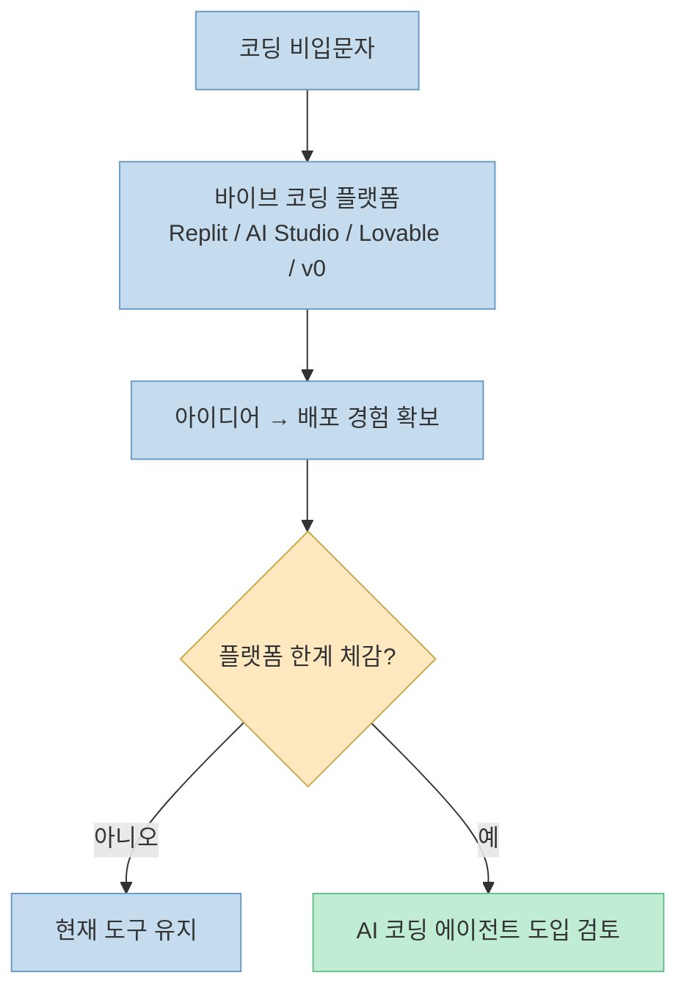
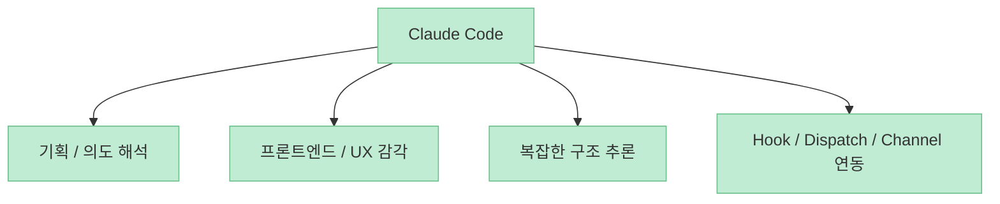
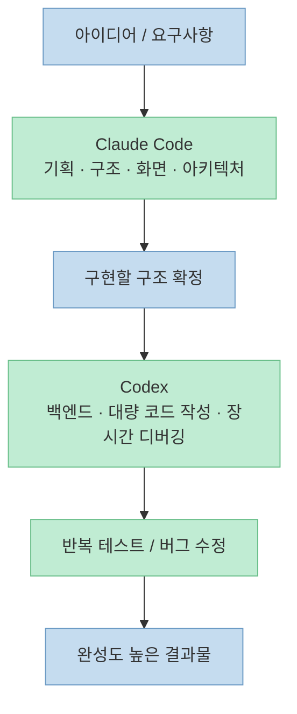

이 스레드의 핵심 주장은 꽤 도발적입니다. **코딩 입문자가 처음부터 Claude Code 같은 CLI 기반 도구를 잡으면 금방 막힐 수 있다** 는 것입니다. 대신 글쓴이는 먼저 Replit, AI Studio, Lovable, Vercel v0 같은 이른바 바이브 코딩 플랫폼으로 감을 잡고, 이후 장시간 코딩과 백엔드 작업은 Codex, 전체 기획과 화면·아키텍처는 Claude Code로 나누는 흐름을 추천합니다. (원문: [Threads](https://www.threads.com/@choi.openai/post/DW04NrGj2N8?xmt=AQF0ALcUiTuJcid1btFA7W5XMnxRY26gX1uHURHzR_YhhGJyhhEoHdHLd8Zo5SM8bPZ3lis&slof=1), 추출: Jina Reader)

중요한 점은 이 스레드가 공식 벤치마크가 아니라 **작성자의 실사용 관찰과 커뮤니티 체감** 을 정리한 글이라는 점입니다. 그래서 아래 내용은 "절대적인 우열 비교" 보다, **입문자와 실무자가 도구를 단계별로 어떻게 배치하면 덜 막히는가** 에 대한 하나의 실전 가이드로 읽는 편이 맞습니다. (원문: [Threads](https://www.threads.com/@choi.openai/post/DW04NFHDwIQ), [Threads](https://www.threads.com/@choi.openai/post/DW04Q4QDygX))

<!--more-->

## Sources

- [CHOI on Threads](https://www.threads.com/@choi.openai/post/DW04NrGj2N8?xmt=AQF0ALcUiTuJcid1btFA7W5XMnxRY26gX1uHURHzR_YhhGJyhhEoHdHLd8Zo5SM8bPZ3lis&slof=1)

## 1. 왜 입문자가 Claude Code CLI부터 시작하면 막히는가

스레드의 첫 출발점은 도구 성능이 아니라 **진입 마찰** 입니다. 작성자는 코딩 지식이 거의 없는 상태에서 터미널을 열고 Claude Code나 Codex 같은 CLI 도구를 바로 다루는 것은 부담이 크다고 말합니다. 이유는 간단합니다. 비개발자가 처음 막히는 지점은 대개 모델의 추론 능력보다, 백엔드 연결, 데이터베이스 세팅, 배포, 파일 구조 같은 환경 문제이기 때문입니다. ([Threads](https://www.threads.com/@choi.openai/post/DW04NrGj2N8))

그래서 첫 단계에서는 Replit, AI Studio, Lovable, Vercel v0 같은 바이브 코딩 플랫폼을 먼저 경험해 보라고 권합니다. 이 플랫폼들은 서버 연결이나 DB 환경 설정 같은 무거운 부분을 많이 감춰 주기 때문에, 사용자는 프롬프트 몇 줄로 아이디어를 바로 웹이나 앱으로 확인하고 배포까지 경험할 수 있습니다. 즉 입문 단계에서 중요한 것은 "어떤 에이전트가 더 똑똑한가" 보다도, **내가 지금 무엇을 직접 관리하지 않아도 되는가** 입니다. ([Threads](https://www.threads.com/@choi.openai/post/DW04NrGj2N8))

하지만 이 단계에도 한계는 분명하다고 적습니다. 플랫폼이 제공하는 규격화된 틀을 벗어나 복잡한 커스텀 로직을 짜거나, 이미 큰 프로젝트의 기존 코드를 수정하려 하면 답답함이 생긴다는 것입니다. 스레드의 논리는 여기서 바뀝니다. "바이브 코딩 플랫폼으로 끝내라" 가 아니라, **그 틀에 답답함을 느끼는 순간부터 본격적인 AI 코딩 에이전트로 넘어가라** 는 구조입니다. ([Threads](https://www.threads.com/@choi.openai/post/DW04NrGj2N8))

## 2. Codex를 먼저 추천하는 이유: 오래 가는 백엔드 작업에 강하다는 평가

스레드에서 Codex는 "장시간 코딩을 진행하는 파워 유저" 에게 실사용성이 높은 도구로 묘사됩니다. 작성자는 가장 큰 장점으로 토큰 효율과 넉넉한 할당량에서 오는 지속성을 꼽습니다. 저렴한 플랜이나 무료 접근만으로도 하루 종일 작업 흐름이 잘 끊기지 않는다는 체감이 실무자들에게 매력적이라는 설명입니다. ([Threads](https://www.threads.com/@choi.openai/post/DW04OTAD-Ss), [Threads](https://www.threads.com/@choi.openai/post/DW04QW7D7Ug))

강점이 강조되는 영역도 비교적 명확합니다. 복잡한 데이터베이스 쿼리, 대규모 리팩토링, 긴 호흡의 디버깅처럼 논리적 정합성과 지속적인 실행이 중요한 백엔드 작업에서 오류율이 낮고 작업 충실도가 높다고 평가합니다. 또한 여러 세션을 동시에 굴리거나, 사전 정의된 skills와 자동화를 엮어 개발 환경을 유연하게 구성하는 데에도 유리하다고 서술합니다. 다만 이 부분은 공식 성능 수치가 아니라 **작성자의 실사용 정리** 라는 점을 전제로 읽어야 합니다. ([Threads](https://www.threads.com/@choi.openai/post/DW04OTAD-Ss))

특히 입문용 가성비에 대해서는 꽤 강한 의견을 냅니다. 작성자는 최근 커뮤니티 체감상 Codex가 같은 작업에서 Claude보다 훨씬 적은 할당량을 차지하며, 무료 계정으로도 감을 잡기 좋다고 말합니다. 스레드 안에는 Figma 스타일 작업과 job scheduler 작업에서 Claude 대비 Codex가 더 적은 토큰을 사용했다는 예시 숫자도 나오지만, 이는 스레드 작성자의 단일 예시이므로 일반화된 벤치마크라기보다 **실사용 참고 사례** 로 보는 편이 안전합니다. ([Threads](https://www.threads.com/@choi.openai/post/DW04QW7D7Ug))

## 3. Codex의 약점: 프론트엔드 감각과 모호한 기획 해석은 아쉽다

흥미로운 점은 이 스레드가 Codex를 단순 찬양으로 밀지 않는다는 것입니다. 작성자는 Codex의 명확한 약점으로 시각적·창의적 영역, 즉 섬세한 프론트엔드 인터페이스 구현과 트렌디한 디자인 감각이 필요한 작업을 꼽습니다. 또한 완전히 백지 상태에서 모호한 프롬프트만 던져 기획 수준의 설계를 요구할 때, 행간의 맥락을 읽고 해석하는 능력은 아쉽다고 봅니다. ([Threads](https://www.threads.com/@choi.openai/post/DW04Ox3j8YC))

그래서 화면 디자인이 중요한 프로젝트라면 디자인 초안을 먼저 다른 도구로 만든 뒤, 그 결과를 Codex에 넘겨 로직을 붙이는 식의 분업을 추천합니다. 즉 Codex는 "없는 그림을 멋지게 상상해 내는 도구" 라기보다, **이미 정리된 구조와 제약을 바탕으로 오래 밀어붙이는 실행 엔진** 에 가깝게 위치시킵니다. ([Threads](https://www.threads.com/@choi.openai/post/DW04Ox3j8YC))

## 4. 그렇다면 Claude Code는 어디에 강한가

Claude Code에 대해서는 다른 종류의 강점이 강조됩니다. 작성자는 하네스 구조와 에이전트 구조를 어느 정도 이해한 뒤라면, 확장성과 통제력 측면에서 Claude Code를 고려할 만하다고 말합니다. 특히 인간의 언어와 의도를 더 깊게 이해하고, 초기 아키텍처 설계와 프론트엔드 영역에서 강점을 보인다고 평가합니다. ([Threads](https://www.threads.com/@choi.openai/post/DW04PeDDxId))

스레드에서 Claude Code는 모호한 아이디어를 구체적인 기획으로 발전시키는 능력이 좋고, 디자인 감각을 바탕으로 더 세련된 UX/UI를 만드는 데 강하다고 서술됩니다. 더불어 여러 파일이 얽힌 레거시 코드 분석, 난해한 아키텍처의 의존성 파악, 꼬인 문제 해결 같은 깊은 추론도 장점으로 꼽힙니다. 여기에 Hook, Dispatch, Channel 같은 개발자 친화적 생태계를 통해 기존 시스템과 깊게 통합하고 정밀 제어할 수 있다는 점도 무기로 제시됩니다. ([Threads](https://www.threads.com/@choi.openai/post/DW04PeDDxId), [Threads](https://www.threads.com/@choi.openai/post/DW04P7rD-hf))

## 5. Claude Code의 약점으로 지목된 것: 토큰 소모와 긴 작업의 피로감

반대로 작성자가 Claude Code의 가장 현실적인 약점으로 지목하는 것은 토큰 소모량과 사용 제한입니다. 스레드에 따르면 고가 요금제를 쓰더라도 집중적으로 코딩하면 몇 시간 만에 제한에 걸려 흐름이 끊기는 일이 잦고, 이 때문에 메인 코딩 도구로 단독 사용하기에는 부담이 크다고 봅니다. 이를 완화하려면 월 100~200달러 수준의 Max 요금제를 고려해야 하므로 예산이 민감한 입문자에게는 진입 장벽이 될 수 있다는 주장입니다. ([Threads](https://www.threads.com/@choi.openai/post/DW04P7rD-hf))

이 역시 어디까지나 스레드 작성자의 실사용 관찰이므로, 개인의 사용 패턴과 프로젝트 규모에 따라 체감은 달라질 수 있습니다. 다만 중요한 포인트는 "Claude Code가 더 똑똑해 보여도, 장시간 반복 작업을 계속 맡기기에는 비용 구조가 부담될 수 있다" 는 문제 제기 자체입니다. 즉 이 비교는 성능 경쟁이 아니라 **작업 시간과 비용 지속성의 비교** 로 읽는 편이 맞습니다. ([Threads](https://www.threads.com/@choi.openai/post/DW04P7rD-hf))

## 6. 스레드의 결론: 하나만 고르지 말고 하이브리드 워크플로를 짜라

결국 작성자가 추천하는 최종 해법은 양자택일이 아니라 하이브리드 워크플로입니다. 전체적인 기획, 복잡한 아키텍처 설계, 파일 간 의존성 파악은 Claude Code에 맡기고, 그 구조 위에서 실제 코드를 대량 작성하거나, 견고한 백엔드 로직을 붙이고, 긴 테스트와 반복적인 버그 수정은 Codex에 넘기라는 식입니다. ([Threads](https://www.threads.com/@choi.openai/post/DW04Q4QDygX))

이 논리의 핵심은 도구를 제품처럼 소비하지 말고 **공정의 단계별 역할** 로 배치하라는 데 있습니다. 즉 Claude Code는 방향과 구조를 잡는 데, Codex는 지속적인 실행과 반복 작업에 배치하는 식입니다. 스레드에서는 최근 공개된 Claude Code Codex Plugin까지 언급하며, 하나의 도구에 맹목적으로 묶이기보다 강점이 다른 도구를 적재적소에 배치하는 것이 중요하다고 정리합니다. ([Threads](https://www.threads.com/@choi.openai/post/DW04Q4QDygX))

## 7. 실전 적용 포인트

첫째, 완전 비개발자라면 바로 CLI로 들어가기보다 바이브 코딩 플랫폼으로 "앱을 만들고 배포하는 경험" 부터 확보하는 편이 낫다는 조언은 꽤 현실적입니다. 환경 설정이라는 첫 장애물을 우회해 주기 때문입니다. ([Threads](https://www.threads.com/@choi.openai/post/DW04NrGj2N8))

둘째, 장시간 코딩과 백엔드 중심 작업에서는 토큰 효율과 할당량 체감이 매우 중요합니다. 이 영역에서 Codex가 낫다는 평가는 스레드 작성자의 관찰이지만, 최소한 "지속성이 중요한 작업" 과 "짧고 똑똑한 추론이 중요한 작업" 을 분리해 보는 관점은 유효합니다. ([Threads](https://www.threads.com/@choi.openai/post/DW04OTAD-Ss), [Threads](https://www.threads.com/@choi.openai/post/DW04QW7D7Ug))

셋째, 화면 설계와 초기 구조 정의, 복잡한 의존성 파악은 Claude Code 같은 도구가 더 강하게 느껴질 수 있습니다. 따라서 모든 작업을 한 도구에 몰아주기보다, 프로젝트 초반과 후반의 성격을 나눠 보는 편이 생산성이 높을 수 있습니다. ([Threads](https://www.threads.com/@choi.openai/post/DW04PeDDxId), [Threads](https://www.threads.com/@choi.openai/post/DW04Q4QDygX))

## 핵심 요약

- 비개발자 입문자는 처음부터 Claude Code 같은 CLI 도구보다 바이브 코딩 플랫폼으로 시작하는 편이 덜 막힐 수 있다. ([Threads](https://www.threads.com/@choi.openai/post/DW04NrGj2N8))
- Codex는 스레드 작성자 기준으로 토큰 효율과 장시간 백엔드 작업의 지속성이 강점으로 평가된다. ([Threads](https://www.threads.com/@choi.openai/post/DW04OTAD-Ss), [Threads](https://www.threads.com/@choi.openai/post/DW04QW7D7Ug))
- Codex는 프론트엔드 감각과 모호한 기획 해석에서는 상대적으로 아쉽다고 본다. ([Threads](https://www.threads.com/@choi.openai/post/DW04Ox3j8YC))
- Claude Code는 기획, 화면, 아키텍처, 복잡한 구조 추론 쪽 강점이 강조된다. ([Threads](https://www.threads.com/@choi.openai/post/DW04PeDDxId))
- 결론은 둘 중 하나를 고르기보다 Claude Code와 Codex를 공정별로 나눠 쓰는 하이브리드 워크플로다. ([Threads](https://www.threads.com/@choi.openai/post/DW04Q4QDygX))

## 결론

이 스레드의 메시지는 "Claude Code냐 Codex냐" 같은 단순 우열 비교가 아닙니다. 오히려 **입문 단계에서는 진입 장벽이 낮은 도구로 시작하고, 실무 단계에서는 도구를 역할별로 분업하라** 는 이야기입니다. 하나의 도구에 모든 기대를 몰아주기보다, 어떤 단계에서 무엇이 막히는지 먼저 보고 도구를 배치하는 편이 더 현실적인 전략이라는 점에서 꽤 설득력이 있습니다. ([Threads](https://www.threads.com/@choi.openai/post/DW04NrGj2N8), [Threads](https://www.threads.com/@choi.openai/post/DW04Q4QDygX))
