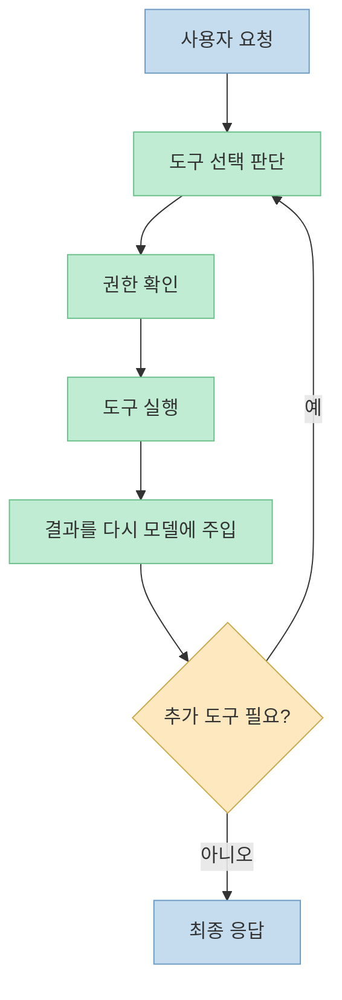
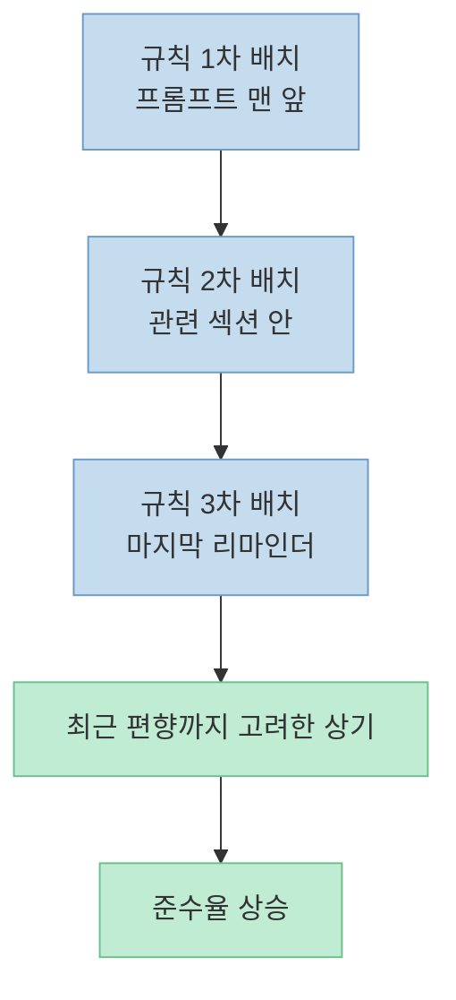
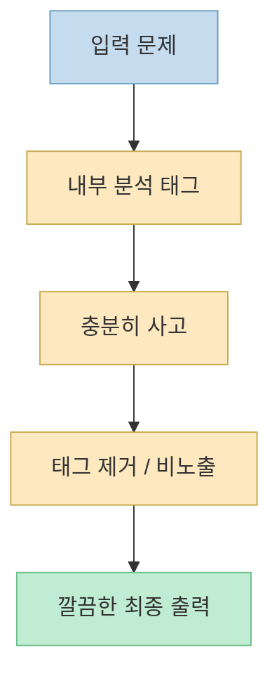
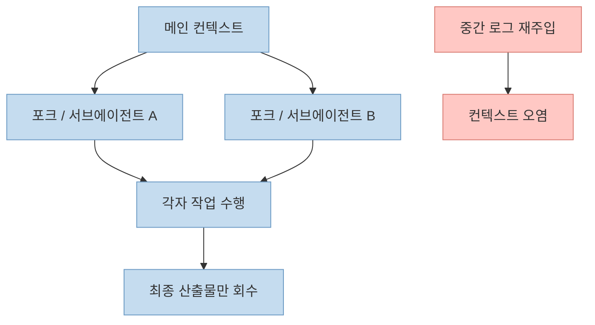

샘 호트만의 이 영상은 유출된 Claude Code 소스 자체를 해설하는 데 머물지 않습니다. 오히려 핵심은 "51만 줄을 읽어서 Claude Code를 복제하자" 가 아니라, **Anthropic이 자기 AI에게 어떤 방식으로 지시하고 있었는가** 를 읽어내는 데 있습니다. 발표자는 오늘 당장 `CLAUDE.md` 나 프롬프트, 스킬 설명, 작업 분해 방식에 적용할 수 있는 7가지 원칙을 쉬운 것부터 구조적인 것까지 순서대로 정리합니다. ([t=0](https://youtu.be/ZmRu5k63xLk?t=0))

특히 이 영상이 좋은 점은 소스 유출을 자극적으로 소비하지 않고, 결국 중요한 것은 코드가 아니라 **에이전트에게 좋은 맥락을 주는 방법** 이라고 선을 긋는다는 점입니다. 그래서 이 글도 유출 사건 자체보다, 그 안에서 끌어낸 프롬프트·컨텍스트 엔지니어링 원칙에 집중해 정리하겠습니다. ([t=0](https://youtu.be/ZmRu5k63xLk?t=0), [t=1029](https://youtu.be/ZmRu5k63xLk?t=1029))

<!--more-->

## Sources

- [클로드코드 50만 줄로부터 실력 향상을 위한 7가지 레슨런 포인트와 원칙들 - YouTube](https://youtu.be/ZmRu5k63xLk?si=jXkoAv-X2R8ScOY0)

## 1. 전제부터 바꾸자: Claude Code는 채팅창이 아니라 에이전트 런타임이다

발표자가 본론 전에 먼저 고정하는 관점은 하나입니다. Claude Code는 챗봇이 아니라 **에이전트 런타임** 이라는 점입니다. 설명에 따르면 구조의 핵심은 사용자 입력을 받은 뒤, AI가 어떤 도구를 써야 할지 판단하고, 권한을 확인하고, 도구를 실행한 결과를 다시 AI에게 돌려주는 루프이며, 더 이상 도구가 필요 없을 때까지 이 과정이 반복됩니다. ([t=82](https://youtu.be/ZmRu5k63xLk?t=82))

이 프레임이 중요한 이유는 작업 지시 방식 자체가 달라지기 때문입니다. 일반 챗봇에게는 "이거 어떻게 해?" 라고 물어도 되지만, 에이전트에게는 조사, 계획, 실행, 검증을 나눠서 시키는 편이 훨씬 맞습니다. 거대한 단일 프롬프트보다 작은 작업 단위로 쪼개는 편이 Claude Code의 실제 동작 구조와 더 잘 맞는다는 설명입니다. ([t=82](https://youtu.be/ZmRu5k63xLk?t=82))

## 2. 원칙 1~3: AI 행동을 좁히는 가장 기본적인 프롬프트 설계

### 2-1. 원칙 1: DO & DON'T 를 같이 써라

첫 번째 원칙은 해야 할 것만 쓰지 말고, **하지 말아야 할 것까지 나란히 써라** 는 것입니다. 발표자는 "간결하게 써 줘" 같은 추상적 표현만으로는 기준이 사람마다 달라 AI가 과잉 생산할 수 있다고 설명합니다. 그래서 Anthropic은 "비슷한 코드 세 줄 복붙이 성급한 추상화보다 낫다" 같은 식으로, 추상 원칙이 아니라 멈출 기준이 있는 문장을 사용했다고 소개합니다. ([t=172](https://youtu.be/ZmRu5k63xLk?t=172))

핵심은 여기서 끝나지 않습니다. 문서화 프롬프트 예시에서도 "문서화할 것" 과 "문서화하지 말 것" 이 함께 적혀 있었고, 도구 선택에서도 "glob를 써라, find나 ls는 쓰지 마라" 처럼 선호 도구와 금지 도구가 한 줄에 함께 있었다고 말합니다. 즉 AI의 행동을 안정시키는 가장 쉬운 방법은 권장 경로만 주는 것이 아니라 **우회 경로를 미리 닫아버리는 것** 입니다. ([t=172](https://youtu.be/ZmRu5k63xLk?t=172))

### 2-2. 원칙 2: 검증할 수 없으면 검증할 수 없다고 말하게 하라

두 번째 원칙은 결과 검증 강제입니다. 발표자는 Claude Code가 "모든 테스트를 통과했습니다" 라고 말했지만 실제로는 그렇지 않은 경험을 예로 들며, 소스 안에는 작업 완료를 보고하기 전에 실제 실행·테스트·출력 확인을 하라는 지시와 함께, **검증할 수 없으면 검증할 수 없다고 명시하라** 는 문장이 있었다고 설명합니다. ([t=310](https://youtu.be/ZmRu5k63xLk?t=310))

여기서 중요한 건 AI가 원래 자신감 있게 말하려는 경향이 있기 때문에, "모른다" 혹은 "검증 불가" 를 말해도 된다는 허가를 프롬프트 차원에서 줘야 한다는 점입니다. 더 나아가 Anthropic은 "실패한 체크를 성공처럼 포장하지 마라", "미완성 작업을 완료라고 하지 마라", "결과를 조작하거나 예측하지 마라" 처럼 나쁜 행동의 형태를 세분화해 금지했다고 설명합니다. 금지만으로는 부족하고, **어떤 식의 자기합리화도 허용하지 않는다** 는 수준까지 분해해야 효과가 높다는 메시지입니다. ([t=310](https://youtu.be/ZmRu5k63xLk?t=310))

### 2-3. 원칙 3: 정말 중요한 규칙은 세 번 반복하라

세 번째 원칙은 3중 반복 패턴입니다. 발표자는 자동 압축 기능 프롬프트에서 "도구를 호출하지 마라" 는 지시가 프롬프트 맨 앞, 중간 본문, 맨 끝 리마인더에 세 번 등장했다고 설명합니다. 이유는 최근 편향 때문입니다. 모델은 최근에 읽은 정보를 더 강하게 반영하기 때문에, 시작에서 주의를 잡고 끝에서 실행 직전 다시 상기시키는 식으로 배치해야 준수율이 올라간다는 것입니다. ([t=420](https://youtu.be/ZmRu5k63xLk?t=420))

이 세 원칙은 결국 하나로 묶입니다. **행동 범위를 좁히고, 거짓 완료를 막고, 잊히지 않게 반복하라** 는 것입니다. 프롬프트를 "좋은 문장" 으로 쓰려 하기보다, 에이전트가 빠져나갈 구멍을 줄이는 운영 규칙으로 작성하라는 쪽에 가깝습니다. ([t=172](https://youtu.be/ZmRu5k63xLk?t=172), [t=310](https://youtu.be/ZmRu5k63xLk?t=310), [t=420](https://youtu.be/ZmRu5k63xLk?t=420))

## 3. 원칙 4~5: 순서와 사고를 설계해야 토큰과 품질이 같이 잡힌다

### 3-1. 원칙 4: 턴 예산 전략과 컨텍스트 비용을 이해하라

네 번째 원칙은 단순히 "말을 잘하는 프롬프트" 를 넘어서, 시스템이 동작하는 순서와 비용 구조를 이해하라는 것입니다. 발표자는 메모리 추출 에이전트 프롬프트 예시를 들며, 읽을 파일은 한 턴에서 병렬로 읽고, 쓸 파일은 다음 턴에서 병렬로 쓰고, 읽기와 쓰기를 여러 턴에 걸쳐 섞지 말라는 지시가 있었다고 설명합니다. ([t=528](https://youtu.be/ZmRu5k63xLk?t=528))

이 설명의 요지는 단순 속도 최적화가 아닙니다. 안전한 읽기·검색 도구는 병렬화하고, 수정이나 명령 실행 같은 위험한 도구는 순차적으로 처리해야 한다는 구분이 있었고, 더 중요한 건 컨텍스트에 올린 파일이 매 턴마다 다시 전송되므로 **컨텍스트 관리가 곧 비용 관리** 라는 점입니다. 즉 파일을 무심코 많이 읽히는 것 자체가 과금과 품질에 영향을 줍니다. ([t=528](https://youtu.be/ZmRu5k63xLk?t=528))

### 3-2. 원칙 5: Chain of Thought 는 출력이 아니라 내부 품질 개선용으로 써라

다섯 번째 원칙은 Chain of Thought stripping 패턴입니다. 발표자는 자동 압축 프롬프트에 분석을 특정 태그 안에 작성하게 한 뒤, 최종 출력에서는 그 태그를 제거하는 구조가 있었다고 설명합니다. 즉 생각은 충분히 하게 만들되, 그 생각 과정을 사용자에게 그대로 노출하지는 않는 방식입니다. ([t=668](https://youtu.be/ZmRu5k63xLk?t=668))

이 구조의 장점은 두 가지입니다. 첫째, 복잡한 작업에서 사고 품질은 올라갑니다. 둘째, 최종 출력은 불필요하게 장황해지지 않습니다. 발표자 표현대로라면 연습장 풀이 덕분에 답은 좋아지지만, 제출물에는 깔끔한 답만 남는 셈입니다. 그래서 이 원칙은 "생각하게 만들어라" 에서 끝나지 않고, **생각을 어떻게 숨기고 관리할 것인가** 까지 포함한 한 단계 높은 설계입니다. ([t=668](https://youtu.be/ZmRu5k63xLk?t=668))

## 4. 원칙 6~7: 스킬 예산과 컨텍스트 오염을 관리하라

### 4-1. 원칙 6: 커스텀 스킬이 안 먹는 이유는 설명 예산일 수 있다

여섯 번째 원칙은 skills description budget입니다. 발표자는 이전부터 스킬의 description이 사실상 유일한 트리거라고 말해 왔는데, 소스 안에서는 이게 왜 그런지 더 명확히 드러났다고 설명합니다. 스킬 목록에 할당되는 토큰 예산이 전체 컨텍스트 윈도우의 1%로 고정되어 있고, 개별 스킬 description도 최대 250자로 제한된다는 것입니다. ([t=786](https://youtu.be/ZmRu5k63xLk?t=786))

이게 실전에 의미하는 바는 단순합니다. 스킬을 많이 만들수록 좋은 게 아니라, 예산을 넘으면 사용자 스킬의 설명부터 잘리고, 심하면 이름만 남아 Claude가 언제 발동해야 할지 판단할 근거를 잃게 됩니다. 발표자는 Anthropic 공식 번들 스킬은 설명을 유지하지만 사용자 스킬은 먼저 축소된다고 설명하며, 결국 커스텀 스킬 설계에서는 **개수보다 촘촘한 설명 압축** 이 더 중요하다고 봅니다. ([t=786](https://youtu.be/ZmRu5k63xLk?t=786))

### 4-2. 원칙 7: 분리한 작업의 로그를 다시 끌어오지 마라

일곱 번째 원칙은 컨텍스트 오염 방지입니다. 발표자는 포크 에이전트 시스템에서, 사용자가 명시적으로 요청하지 않는 한 출력 파일을 읽거나 tail하지 말라는 규칙이 있었고, 그 이유는 포크 작업의 도구 노이즈가 본체 컨텍스트로 다시 유입되면 포크를 쓰는 목적 자체가 무산되기 때문이라고 설명합니다. ([t=923](https://youtu.be/ZmRu5k63xLk?t=923))

이건 서브에이전트나 백그라운드 태스크를 쓸 때 특히 중요합니다. 작업을 분리한 이유가 있는데, 중간 로그를 계속 현재 세션에 끌고 오면 결국 작업 경계가 무너집니다. 발표자는 순서를 설계하는 것이 턴 예산 전략이라면, 경계를 설계하는 것이 컨텍스트 오염 방지라고 표현합니다. 결국 복잡한 프로젝트에서 중요한 것은 더 많은 에이전트를 띄우는 것이 아니라, **각 에이전트의 맥락이 서로 더럽혀지지 않게 하는 것** 입니다. ([t=923](https://youtu.be/ZmRu5k63xLk?t=923), [t=1029](https://youtu.be/ZmRu5k63xLk?t=1029))

## 5. 이 영상이 말하는 진짜 교훈: 코드를 짜는 기술보다 코드를 짜게 만드는 기술

마무리에서 발표자는 아주 직접적으로 말합니다. 51만 줄의 소스를 다 읽는다고 해서 돈을 버는 것도 아니고, 그걸로 Claude Code를 복제할 수도 없다고요. 대신 이 코드가 알려주는 진짜 교훈은 엔지니어링 패러다임이 바뀌고 있다는 점이며, Anthropic 내부 프롬프트에는 "당신은 단순 실행자가 아니라 협업자다. 사용자는 당신의 순종이 아니라 판단력을 필요로 한다" 는 식의 문장이 있었다고 소개합니다. ([t=1029](https://youtu.be/ZmRu5k63xLk?t=1029))

이 문맥에서 발표자는 앞으로 더 중요한 능력은 코드를 빠르게 치는 손보다, 무엇을 만들어야 하는지 정의하고, 테스트와 맥락을 설계하고, 작업을 잘게 쪼개는 분해 능력이라고 봅니다. 그리고 오늘 소개한 7가지 원칙—DO & DON'T, 검증 게이트, 반복 배치, 턴 예산, 사고 관리, 스킬 예산, 작업 경계—은 전부 **AI에게 좋은 맥락을 제공하는 기술** 이라고 정리합니다. ([t=1029](https://youtu.be/ZmRu5k63xLk?t=1029))

## 6. 실전 적용 포인트

첫째, `CLAUDE.md` 나 팀 프롬프트를 쓸 때 "무엇을 할지" 만 적지 말고, "무엇을 하지 말지" 를 반드시 붙이세요. 특히 선호 도구와 금지 도구를 짝지어 적으면 우회 행동을 줄이는 데 효과적입니다. ([t=172](https://youtu.be/ZmRu5k63xLk?t=172))

둘째, 완료 보고 앞에는 항상 검증 게이트를 넣는 편이 좋습니다. 테스트·실행·출력 확인을 먼저 시키고, 확인할 수 없는 경우는 검증 불가라고 쓰게 해야 거짓 완료 보고를 줄일 수 있습니다. ([t=310](https://youtu.be/ZmRu5k63xLk?t=310))

셋째, 정말 중요한 규칙은 프롬프트 상단·관련 섹션·마지막 리마인더에 반복하세요. 안전 규칙, 삭제 금지, 배포 금지 같은 항목은 한 번 적는 것보다 반복 배치가 더 강합니다. ([t=420](https://youtu.be/ZmRu5k63xLk?t=420))

넷째, 작업 순서를 명시하세요. 관련 파일을 먼저 전부 읽고, 그다음 수정하고, 마지막에 검증하라고 쓰는 것만으로도 토큰 낭비와 왕복 호출을 줄일 수 있습니다. ([t=528](https://youtu.be/ZmRu5k63xLk?t=528))

다섯째, 스킬은 많이 만들기보다 짧고 정확한 description으로 정리해야 합니다. 설명이 장황하거나 스킬 수가 많아 예산을 넘으면 트리거가 사실상 죽을 수 있습니다. ([t=786](https://youtu.be/ZmRu5k63xLk?t=786))

여섯째, 포크나 서브에이전트를 쓴다면 중간 로그를 자꾸 현재 세션에 끌어오지 마세요. 분리의 목적은 맥락을 분리하는 것이고, 최종 결과만 회수하는 쪽이 전체 품질을 지키기 쉽습니다. ([t=923](https://youtu.be/ZmRu5k63xLk?t=923))

## 핵심 요약

- Claude Code는 채팅형 도구보다 **에이전트 런타임** 으로 보는 편이 정확하다. ([t=82](https://youtu.be/ZmRu5k63xLk?t=82))
- 좋은 프롬프트는 예쁜 문장이 아니라 **행동 범위를 좁히는 운영 규칙** 이다. ([t=172](https://youtu.be/ZmRu5k63xLk?t=172), [t=310](https://youtu.be/ZmRu5k63xLk?t=310))
- 중요한 규칙은 한 번 쓰는 것보다 반복 배치가 더 강하다. ([t=420](https://youtu.be/ZmRu5k63xLk?t=420))
- 토큰 비용과 속도는 작업 순서 설계와 컨텍스트 관리에 크게 좌우된다. ([t=528](https://youtu.be/ZmRu5k63xLk?t=528))
- Chain of Thought 는 보여주기보다 내부 품질 개선용으로 쓰는 편이 낫다. ([t=668](https://youtu.be/ZmRu5k63xLk?t=668))
- 커스텀 스킬과 서브에이전트의 핵심은 더 많이 만드는 것이 아니라 **예산과 경계를 관리하는 것** 이다. ([t=786](https://youtu.be/ZmRu5k63xLk?t=786), [t=923](https://youtu.be/ZmRu5k63xLk?t=923))

## 결론

이 영상이 정말 잘한 일은, 유출된 소스 코드를 구경거리로 소비하지 않고 **"Anthropic은 AI에게 어떻게 일 시키는가"** 라는 질문으로 번역했다는 점입니다. 결국 Claude Code 활용 역량은 기능을 많이 아는 데서 끝나지 않고, 지시·검증·반복·순서·예산·경계를 설계하는 능력에서 갈립니다. 이 7가지 원칙은 그 설계 감각을 꽤 선명하게 보여주는 사례입니다. ([t=0](https://youtu.be/ZmRu5k63xLk?t=0), [t=1029](https://youtu.be/ZmRu5k63xLk?t=1029))
