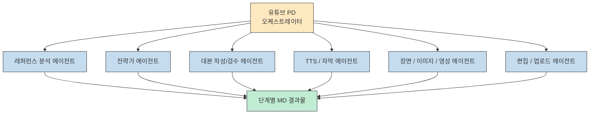
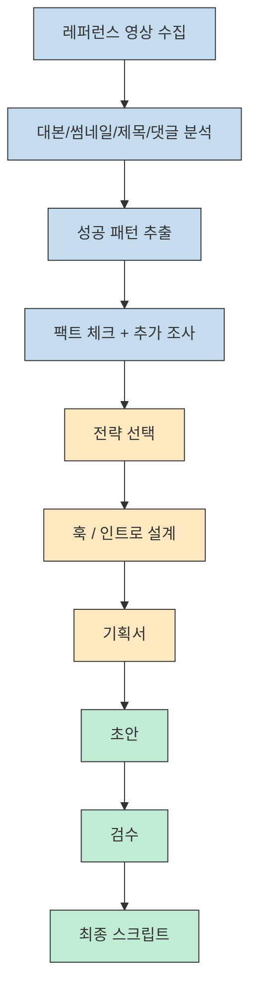
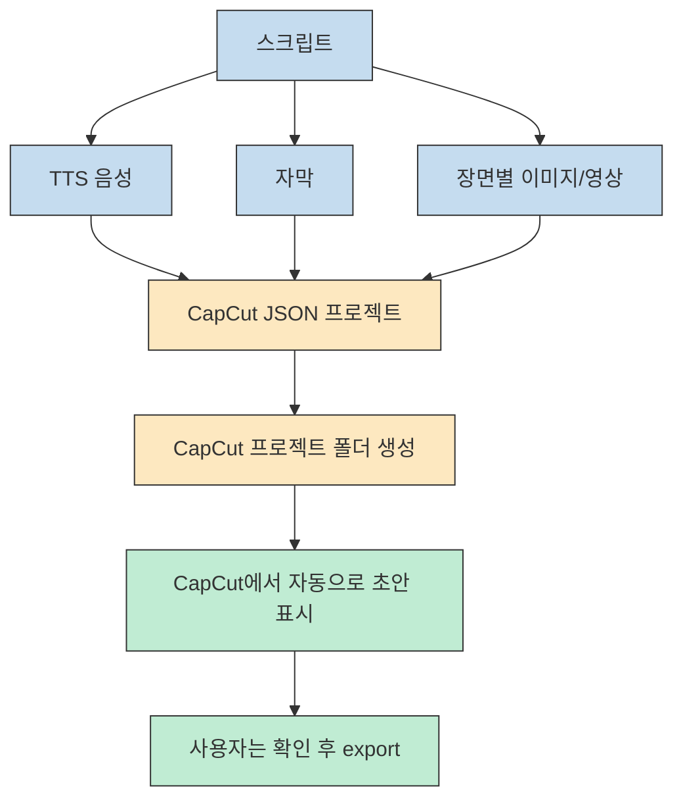

유튜브 자동화라고 하면 보통 대본 자동 생성이나 썸네일 생성 정도를 떠올리기 쉽습니다. 그런데 Builder Josh 채널의 이 영상은 그보다 한 단계 더 나갑니다. 사례의 주인공인 개발남노씨(노정원)는 **Claude Code에게 레퍼런스 수집, 전략 수립, 대본 작성, 음성 생성, 이미지/영상 생성, CapCut 편집 프로젝트 생성, 업로드 준비까지 거의 전 과정을 맡기는 시스템** 을 만들었다고 설명합니다. [영상 2:34](https://youtu.be/arrKfg0V268?t=154) [영상 3:16](https://youtu.be/arrKfg0V268?t=196)
<!--more-->

핵심은 단순히 "AI가 영상도 만든다"가 아닙니다. 오히려 이 사례는 Claude Code를 하나의 거대한 에이전트가 아니라, **명확한 역할을 나눈 오케스트레이션 시스템** 으로 쓰는 방식에 가깝습니다. 이 글에서는 영상에 나온 구조를 기준으로, 어떤 워크플로우가 자동화되고 어디서 사람이 빠지는지, 그리고 무엇이 실제 병목인지 차근차근 정리해 보겠습니다.

## Sources

- https://youtu.be/arrKfg0V268?si=vWjaKce0LeFz1PBf

## 1) 전체 시스템의 중심은 `유튜브 PD` 라는 오케스트레이터다

영상에서 가장 먼저 눈에 들어오는 것은 스킬과 에이전트 구조입니다. 발표자는 프로젝트 안에 `유튜브 PD` 라는 메인 스킬이 있고, 이 스킬이 전체 워크플로우를 관장한다고 설명합니다. 대본 작성, 이미지 생성, 영상 생성, 편집, TTS 음성 생성 같은 세부 작업은 각각 다른 에이전트들이 맡고, `유튜브 PD` 는 이들을 조율하는 오케스트레이터 역할을 합니다. [영상 3:39](https://youtu.be/arrKfg0V268?t=219) [영상 4:05](https://youtu.be/arrKfg0V268?t=245)

이 구조의 핵심은 **모든 걸 한 세션에서 한 번에 처리하지 않는 것** 입니다. 발표자는 각 단계의 결과를 markdown 파일(`MD 파일`)로 저장해 두고, 다음 에이전트에게 그 맥락을 넘기는 식으로 흐름을 설계했다고 말합니다. 즉 오케스트레이션은 스킬이 하고, 에이전트 간 맥락 전달은 단계별 결과물 파일이 담당합니다. [영상 5:00](https://youtu.be/arrKfg0V268?t=300)

이 설계는 Claude Code를 단순 "잘 쓰는 프롬프트" 수준이 아니라, **순서와 역할이 분리된 제작 파이프라인** 으로 만든다는 점에서 중요합니다. 발표자가 스킬을 쓰는 이유도 결국 "정해진 워크플로우를 체크하면서 순서대로 실행하게 만들기 위함"이라고 직접 말합니다. [영상 4:41](https://youtu.be/arrKfg0V268?t=281)

## 2) 사실상 승부처는 대본 이전이 아니라 대본까지다

영상에서 발표자는 솔직하게 말합니다. 이후 단계도 중요하지만, 실제로 가장 중요한 것은 **대본과 썸네일, 그리고 사람을 잡아끄는 훅 인트로** 라고 봅니다. 이미지 품질이나 장면 연출도 필요하지만, 정보성 롱폼 AI 영상에서는 생각보다 시각적 완성도보다 대본과 음성 쪽이 더 중요하다고 판단했다고 설명합니다. [영상 6:00](https://youtu.be/arrKfg0V268?t=360) [영상 10:00](https://youtu.be/arrKfg0V268?t=600)

대본 생성 흐름은 꽤 공들여 설계돼 있습니다.

1. 같은 주제의 유튜브 레퍼런스 3개 정도 수집
2. 각 영상의 대본, 썸네일, 제목, 댓글까지 가져와 분석
3. 왜 성공했는지 패턴 도출
4. 허위 정보 가능성이 있는 부분은 추가 검색으로 팩트 체크
5. 주제별 전략과 타깃 방향 선택
6. 클릭률을 좌우할 훅/인트로 먼저 설계
7. 기획서 작성
8. 초안 작성 → 검수 → 최종 스크립트 확정 [영상 7:00](https://youtu.be/arrKfg0V268?t=420) [영상 8:00](https://youtu.be/arrKfg0V268?t=480) [영상 8:34](https://youtu.be/arrKfg0V268?t=514)

특히 흥미로운 점은 발표자가 이 과정에 에이전트 약 6개 정도가 붙는다고 기억한다고 말하는 부분입니다. 이유는 단순합니다. 한 세션에서 긴 대본 전체를 한 번에 쓰게 하면 뒤로 갈수록 품질이 흐려지고, 글자 수나 일관성이 무너지기 쉽기 때문입니다. 그래서 **기획서를 강하게 만든 뒤, 각 파트를 분업시키는 방식** 을 택했다고 합니다. [영상 9:00](https://youtu.be/arrKfg0V268?t=540)

## 3) 장면 설계 이후는 생산 파이프라인이다: TTS, 자막, 이미지, 영상

대본이 정리되면 이후는 상대적으로 기계적인 파이프라인으로 넘어갑니다. 발표자는 `ElevenLabs` 를 이용해 음성을 만들고, 그 결과로 자막도 생성한다고 설명합니다. 음성과 자막을 만든 다음에는 장면(scene) 설계가 들어갑니다. 여기서도 중요한 것은 대본만 보는 것이 아니라 **기획서와 대본을 함께 보고, 어떤 내용을 몇 초 단위의 장면으로 쪼갤지 판단** 하게 한다는 점입니다. [영상 10:00](https://youtu.be/arrKfg0V268?t=600) [영상 12:00](https://youtu.be/arrKfg0V268?t=720)

발표자의 설명에 따르면, 정보성 콘텐츠에서는 한 장면을 6~7초 정도로 잡는 패턴을 많이 벤치마킹했고, 그 기준으로 장면별 이미지 프롬프트를 만들고 이미지와 일부 영상까지 생성합니다. 당시 기준으로는 이미지 생성은 Google `Whisk AI`, 영상 생성은 `Grok` 을 사용했다고 말합니다. 다만 이는 발표 시점의 도구 선택이며, 앞으로 더 나은 품질의 모델로 교체될 수 있다고 열어 둡니다. [영상 11:00](https://youtu.be/arrKfg0V268?t=660) [영상 19:00](https://youtu.be/arrKfg0V268?t=1140)

여기서 흥미로운 현실적 판단도 나옵니다. 모든 구간에 영상 생성까지 넣으면 공수가 너무 커지고 비용도 비싸므로, 보통은 **후킹이 중요한 인트로 쪽에만 영상 요소를 넣고 뒤는 이미지 위주로 간다** 는 것입니다. 즉 이 시스템은 무조건 최고 퀄리티를 만드는 것이 아니라, **성과 대비 가성비가 가장 좋은 조합을 고르는 자동화** 에 가깝습니다. [영상 12:00](https://youtu.be/arrKfg0V268?t=720)

## 4) 진짜 놀라운 부분: CapCut 편집 자체도 JSON 프로젝트 생성으로 밀어 넣는다

이 사례의 가장 기술적으로 흥미로운 부분은 편집 단계입니다. 발표자는 자동화 강의들을 참고하다가, 어떤 서비스가 JSON 형식 요청으로 편집을 수행하는 것을 보고 아이디어를 얻었다고 말합니다. 그래서 CapCut도 비슷한 형식으로 프로젝트를 만들 수 있지 않을까 추적했고, 실제로 **CapCut 프로젝트가 JSON 기반 편집 명세를 읽는 구조** 라는 점을 활용했다고 설명합니다. [영상 20:00](https://youtu.be/arrKfg0V268?t=1200)

즉 Claude Code는:

- 이미지
- 영상
- 음성
- 자막
- 각 리소스가 어느 시점에 얼마나 들어갈지에 대한 JSON

을 모두 생성한 뒤, 이를 CapCut 프로젝트 폴더에 넣습니다. 그러면 CapCut 메인 화면에서 이미 편집이 끝난 초안 프로젝트가 바로 떠버린다는 것입니다. 사용자는 사실상 열어서 확인하고 export만 누르면 됩니다. [영상 21:00](https://youtu.be/arrKfg0V268?t=1260) [영상 22:00](https://youtu.be/arrKfg0V268?t=1320)

발표자는 확대/이동 같은 이미지 모션도 JSON에 명시할 수 있고, 해보진 않았지만 전환 효과 역시 JSON에 넣을 수 있다고 말합니다. 물론 자막 싱크나 장면 타이밍은 쉬운 문제가 아니어서, 여기에는 꽤 많은 전처리와 시행착오가 있었다고 솔직히 인정합니다. 특히 ElevenLabs 쪽 자막 타이밍 오류나 자막 분절 기준은 가장 애를 먹은 부분으로 설명합니다. [영상 23:00](https://youtu.be/arrKfg0V268?t=1380) [영상 24:00](https://youtu.be/arrKfg0V268?t=1440)

## 5) 인간이 빠지는 마지막 단계: 전략 선택과 업로드까지 자동화

이 시스템이 더 흥미로운 이유는, 발표자가 처음에는 전략과 제목/썸네일 선택 정도는 사람이 해야 한다고 봤지만, 점점 그 부분도 AI에게 넘기게 되었다고 말하는 지점입니다. 전략가 에이전트가 후보 3개를 내놓고 무엇을 추천하는지까지 설명해 주는데, 실제로 그 추천이 나쁘지 않았고, 오히려 직접 고르는 것보다 더 나은 경우도 있었다는 것입니다. 그래서 나중에는 레퍼런스 URL 몇 개만 넣고 이후는 거의 손을 떼게 되었다고 설명합니다. [영상 16:00](https://youtu.be/arrKfg0V268?t=960) [영상 17:00](https://youtu.be/arrKfg0V268?t=1020)

영상 업로드도 마찬가지입니다. 렌더링 결과물과 썸네일, 설명 메타데이터가 프로젝트 폴더에 정리되면, 발표자는 유튜브 공식 API를 이용해 업로드까지 자동화했다고 말합니다. 처음에는 손으로 올렸지만, 하루에 여러 개 올리다 보면 그것조차 귀찮아서 자동화했다고 합니다. 다만 CapCut 렌더링에서 export 버튼 자체는 사람이 눌러야 한다고 설명합니다. [영상 13:00](https://youtu.be/arrKfg0V268?t=780) [영상 14:00](https://youtu.be/arrKfg0V268?t=840)

## 6) 비용과 교훈: 병목은 기술이 아니라 하네스 설계다

비용 이야기도 꽤 구체적으로 나옵니다. 발표자 경험 기준으로 20분짜리 영상이면 스크립트 글자 수가 8천~1만 자 정도 되고, TTS 비용이 가장 크게 들어 2,500원~3,000원 수준이라고 합니다. 여기에 Claude 사용 비용 500원~1,000원 정도, 썸네일 생성을 위한 추가 비용까지 합쳐서 **영상 하나당 대략 5,000원 수준** 으로 본다고 설명합니다. 이 수치는 발표자의 실제 운영 체감값이며, 모델·도구·재시도 횟수에 따라 달라질 수 있습니다. [영상 26:00](https://youtu.be/arrKfg0V268?t=1560) [영상 27:00](https://youtu.be/arrKfg0V268?t=1620)

이 사례가 던지는 더 큰 교훈은 따로 있습니다. 발표자는 자신이 한 일이 단순히 Claude에게 "대본 써 줘"라고 시킨 것이 아니라, **유튜브 생태계와 훅/CTR/대본 구조에 대한 도메인 지식을 먼저 공부하고, 그것을 하네스와 워크플로우로 옮긴 것** 이라고 말합니다. 즉 정답이 있었던 것이 아니라, 무료 강의와 사례를 많이 보고, 스스로 이해한 내용을 구조화해 AI가 따라가게 만든 것이 핵심이라는 뜻입니다. [영상 15:00](https://youtu.be/arrKfg0V268?t=900)

## 7) 실전 적용 포인트

이 사례를 그대로 복제하기보다, 아래 순서로 이해하면 더 현실적입니다.

1. 우선 오케스트레이터 스킬 하나를 만든다.
2. 그다음 대본/전략/검수/TTS/편집 같은 단계를 쪼갠다.
3. 단계별 산출물을 markdown 파일로 남겨 다음 에이전트가 읽게 한다.
4. 훅/인트로/대본 품질에 가장 많은 공을 들인다.
5. 이미지/영상은 최고 퀄리티보다 가성비 좋은 조합을 먼저 찾는다.
6. 편집 프로그램의 프로젝트 포맷(JSON 등)을 파악해 "사람이 클릭하던 편집"을 데이터 생성 문제로 바꾼다.

이 중 특히 중요한 것은 마지막입니다. 이 사례가 단순 영상 AI 사례를 넘어서는 이유는, 편집을 사람이 하는 예술 작업으로 보지 않고 **프로젝트 명세 파일을 생성하는 문제로 환원** 했기 때문입니다.

동시에 조심할 점도 있습니다.

- 모든 주제와 채널이 같은 패턴으로 성공하진 않습니다.
- 발표자도 자막 싱크와 분절은 특히 어렵다고 말합니다.
- "AI가 다 고른 전략"이 항상 더 낫다는 보장은 없습니다.
- 비용은 낮아도, 설계와 실험에는 상당한 시간이 들어갑니다.

따라서 이 사례의 본질은 "영상이 버튼 한 번에 나온다"보다, **사람이 하던 기획·편집 과정을 어떤 데이터 구조와 에이전트 분업으로 옮길 수 있는가** 에 있습니다.

## 핵심 요약

- 이 사례의 중심은 `유튜브 PD` 스킬이 여러 에이전트를 오케스트레이션하는 구조다. [영상 3:39](https://youtu.be/arrKfg0V268?t=219)
- 대본 생성은 레퍼런스 분석, 패턴 추출, 팩트 체크, 전략 선택, 훅 설계, 기획서, 초안, 검수, 최종 스크립트로 이어지는 긴 파이프라인이다. [영상 7:00](https://youtu.be/arrKfg0V268?t=420) [영상 8:34](https://youtu.be/arrKfg0V268?t=514)
- 후반 제작은 TTS, 자막, 장면 설계, 이미지/영상 생성으로 이어지며, 정보성 콘텐츠 기준으로는 대본 품질이 특히 중요하다고 본다. [영상 10:00](https://youtu.be/arrKfg0V268?t=600) [영상 11:00](https://youtu.be/arrKfg0V268?t=660)
- CapCut 편집은 프로젝트 폴더와 JSON 명세를 생성하는 방식으로 자동화됐다. [영상 20:00](https://youtu.be/arrKfg0V268?t=1200) [영상 21:00](https://youtu.be/arrKfg0V268?t=1260)
- 업로드도 공식 API로 자동화할 수 있지만, 렌더링 export 자체는 여전히 사람 손이 필요한 부분으로 남아 있다. [영상 13:00](https://youtu.be/arrKfg0V268?t=780)
- 발표자 경험 기준 비용은 20분 영상당 대략 5,000원 수준이며, 가장 큰 병목은 모델 성능보다 하네스 설계와 자막/타이밍 정합성이다. [영상 26:00](https://youtu.be/arrKfg0V268?t=1560)

## 결론

이 영상의 진짜 가치는 "AI가 유튜브 편집도 한다"는 데 있지 않습니다. 더 중요한 것은 **기획, 검수, 장면 설계, 편집 프로젝트 생성, 업로드 준비를 하나의 워크플로우로 쪼개고, Claude Code가 그 워크플로우를 따라가게 만들었다** 는 점입니다.

결국 이 사례는 영상 자동화 예시이면서 동시에 하네스 설계 예시입니다. 사람이 직접 모든 걸 만드는 대신, 어디까지를 전략으로 남기고 어디까지를 에이전트 분업과 파일 산출물로 넘길지 설계하는 문제로 바뀐 것입니다. 그래서 이 사례를 따라 해 볼 때는 "어떤 모델을 쓰나?"보다 먼저, **"내 제작 과정을 어떤 단계와 산출물로 정의할 수 있나?"** 를 질문하는 편이 맞습니다.
