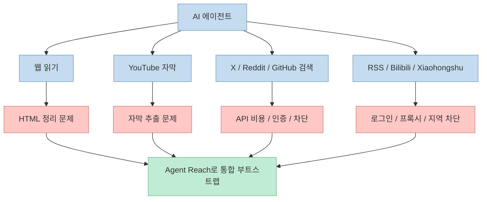
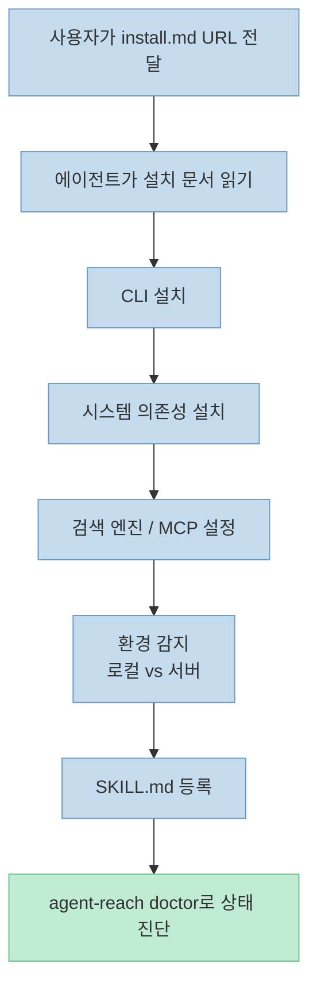
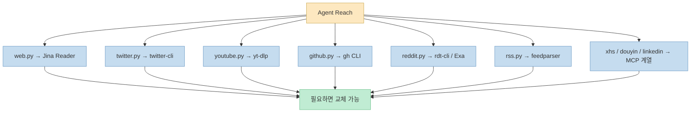

`Agent Reach` 는 AI 에이전트가 인터넷을 “볼 수 있게” 만드는 환경 부트스트랩 도구를 표방합니다. 핵심 메시지는 단순합니다. 웹 읽기, YouTube 자막, X 읽기, Reddit 검색, GitHub 탐색, RSS 구독 같은 능력 자체는 각 플랫폼별 도구를 조합하면 구현할 수 있지만, 실제로는 API 비용, 로그인, 쿠키, 프록시, 의존성 설치, 툴 선택 때문에 매번 처음부터 삽질하게 된다는 것입니다. Agent Reach는 이 골치 아픈 선행 작업을 한 번에 정리해, 에이전트가 곧바로 인터넷 채널을 다루게 만드는 것을 목표로 합니다. (출처: [GitHub README](https://github.com/Panniantong/Agent-Reach))

이 프로젝트가 흥미로운 이유는 새로운 프레임워크를 만들겠다고 주장하지 않는다는 점입니다. README는 Agent Reach를 **framework가 아니라 scaffolding** 이라고 정의합니다. 즉 자체 추상화 계층으로 모든 것을 감싸는 게 아니라, `yt-dlp`, `gh`, `twitter-cli`, `rdt-cli`, `Jina Reader`, `feedparser`, `mcporter` 같은 기존 상위 도구들을 에이전트가 바로 쓸 수 있도록 설치·선택·연결·진단 레이어를 제공하는 방식입니다. (출처: [GitHub README](https://github.com/Panniantong/Agent-Reach), [raw README](https://raw.githubusercontent.com/Panniantong/Agent-Reach/main/README.md))

<!--more-->

## Sources

- [https://github.com/Panniantong/Agent-Reach](https://github.com/Panniantong/Agent-Reach)

## 1. Agent Reach가 풀려고 하는 문제: 에이전트는 똑똑한데 인터넷은 잘 못 본다

README는 문제 정의를 꽤 선명하게 합니다. 에이전트는 코드 작성, 문서 수정, 프로젝트 관리 같은 내부 작업은 잘하지만, 외부 웹 플랫폼으로 나가는 순간 갑자기 무력해집니다. YouTube는 자막 추출이 막히고, X는 유료 API 문제를 만나고, Reddit은 서버 IP가 막히고, Xiaohongshu는 로그인 장벽이 있고, GitHub는 인증 구성이 귀찮고, 웹페이지는 HTML 덩어리로만 읽히는 식입니다. 즉 “인터넷 능력” 은 모델 능력보다도 **플랫폼별 접근 문제** 에 더 많이 막힌다는 게 이 프로젝트의 전제입니다. (출처: [raw README](https://raw.githubusercontent.com/Panniantong/Agent-Reach/main/README.md))

README가 반복해서 강조하는 포인트는 이것이 “어려운 기술” 이라기보다 “귀찮은 통합 작업” 이라는 점입니다. 채널마다 필요한 툴이 다르고, 어떤 것은 API 비용이 들고, 어떤 것은 쿠키가 필요하고, 어떤 것은 프록시나 서버 환경에서만 막히며, 어떤 것은 결과 정제가 필요합니다. Agent Reach는 바로 이 “한 플랫폼씩 각각 다른 귀찮음” 을 표준화해 한 번에 설치 가능한 형태로 줄이려는 접근입니다. (출처: [raw README](https://raw.githubusercontent.com/Panniantong/Agent-Reach/main/README.md))

## 2. 무엇을 지원하나: “바로 사용 가능”과 “설정 후 확장”을 나누는 채널 매트릭스

README의 지원 플랫폼 표는 이 프로젝트를 이해하는 데 가장 중요한 부분입니다. 채널들은 단순히 “지원/미지원” 으로 나뉘지 않고, **설치 직후 바로 되는 능력** 과 **로그인이나 쿠키, 프록시를 넣었을 때 풀리는 능력** 으로 이중 계층화되어 있습니다. 예를 들어 웹 읽기, YouTube 자막/검색, RSS, GitHub 공개 저장소 읽기, Reddit 검색과 읽기, WeChat 글 검색·읽기, Weibo 검색, V2EX, 일부 X 읽기 등은 비교적 빠르게 접근할 수 있는 채널로 정리됩니다. 반면 X 검색/타임라인/발행, GitHub의 private repo나 PR/Issue 조작, Xiaohongshu 읽기/발행, Douyin 파싱, LinkedIn 상세 조회 같은 영역은 설정 후에 확장되는 능력으로 설명됩니다. (출처: [raw README](https://raw.githubusercontent.com/Panniantong/Agent-Reach/main/README.md))

이 구분이 중요한 이유는 실제 에이전트 인터넷 도구의 UX가 “다 설치하면 다 된다” 가 아니기 때문입니다. 사용자는 먼저 무료·무설정 채널에서 즉시 효용을 얻고, 필요할 때만 쿠키나 프록시, 로그인 구성을 추가합니다. README도 문서를 읽기보다 “Agent에게 X 설정을 도와달라고 말해라”, “GitHub 로그인 도와달라고 말해라” 같은 대화형 안내를 추천합니다. 즉 Agent Reach는 도구 모음이면서 동시에 **설정 과정을 에이전트-주도 온보딩으로 바꾸는 인터페이스** 이기도 합니다. (출처: [raw README](https://raw.githubusercontent.com/Panniantong/Agent-Reach/main/README.md))

## 3. 설치 경험의 핵심: 사람 대신 에이전트에게 설치 문서를 읽힌다

이 프로젝트의 온보딩은 꽤 상징적입니다. 사용자는 CLI 설치 명령을 직접 외우는 대신, 에이전트에게 `install.md` URL을 전달합니다. README 예시 그대로라면 "帮我安装 Agent Reach: <install.md URL>" 같은 문장을 에이전트에게 주면, 에이전트가 그 문서를 읽고 남은 설치 과정을 알아서 수행하는 구조입니다. 이미 설치했다면 `update.md` 를 같은 방식으로 읽혀 업데이트할 수도 있고, 안전 모드에서는 시스템 패키지를 자동 설치하지 않고 필요한 것만 알려주게 할 수도 있습니다. (출처: [raw README](https://raw.githubusercontent.com/Panniantong/Agent-Reach/main/README.md))

README가 설명하는 설치 후 작업 흐름은 대략 다섯 단계입니다. `agent-reach` CLI 설치, Node.js·gh CLI·mcporter·twitter-cli·rdt-cli 같은 시스템 의존성 준비, Exa 기반 검색 설정, 현재 환경이 로컬인지 서버인지 판별, 그리고 Agent의 skills 디렉터리에 SKILL.md 등록입니다. 즉 이 프로젝트는 단순 패키지 하나를 깔아 주는 것이 아니라, **에이전트가 웹 도구를 다룰 수 있는 런타임 주변 환경까지 함께 세팅** 하는 편에 가깝습니다. (출처: [raw README](https://raw.githubusercontent.com/Panniantong/Agent-Reach/main/README.md))

## 4. 구조의 핵심: 프레임워크가 아니라 스캐폴딩, 래퍼가 아니라 상류 도구 연결기

README에서 가장 인상적인 문장은 “Agent Reach는 scaffolding이지 framework가 아니다” 입니다. 이는 설치 후 실제 읽기/검색/발행 동작을 Agent Reach가 대신 실행하는 게 아니라, 에이전트가 `twitter-cli`, `yt-dlp`, `gh CLI`, `feedparser`, `mcporter` 같은 상위 도구를 직접 부르게 만든다는 의미입니다. 다시 말해 Agent Reach는 자체 런타임으로 모든 요청을 감싸지 않고, **상류 도구 선택과 연결을 표준화하는 얇은 레이어** 입니다. (출처: [raw README](https://raw.githubusercontent.com/Panniantong/Agent-Reach/main/README.md))

README가 제시한 `channels/` 구조도 이 철학과 맞닿아 있습니다. `web.py → Jina Reader`, `twitter.py → twitter-cli`, `youtube.py → yt-dlp`, `github.py → gh CLI`, `reddit.py → Exa/rdt-cli`, `xiaohongshu.py → mcporter MCP`, `rss.py → feedparser` 식으로 채널별 구현이 명시되어 있고, 필요하면 다른 상류 도구로 갈아끼울 수 있다고 설명합니다. 이 설계는 두 가지 장점을 줍니다. 첫째, 특정 채널이 막혀도 해당 채널 구현만 교체하면 됩니다. 둘째, 에이전트는 추상화된 새 DSL을 배우지 않고 이미 널리 쓰이는 도구를 그대로 사용합니다. (출처: [raw README](https://raw.githubusercontent.com/Panniantong/Agent-Reach/main/README.md))

## 5. 이 프로젝트의 장점과 트레이드오프

README 기준의 장점은 명확합니다. 첫째, 무료/오픈소스 중심 구성입니다. README는 모든 툴과 API가 무료이며, 비용이 생길 수 있는 부분은 서버 프록시 정도라고 설명합니다. 둘째, 쿠키를 로컬에만 두는 방식으로 프라이버시를 강조합니다. 셋째, Claude Code, OpenClaw, Cursor, Windsurf 같은 “명령줄 실행이 가능한” 에이전트 전반과 호환된다고 말합니다. 넷째, `agent-reach doctor` 로 어떤 채널이 통하고 막혔는지 빠르게 진단할 수 있다고 강조합니다. (출처: [raw README](https://raw.githubusercontent.com/Panniantong/Agent-Reach/main/README.md))

반대로 트레이드오프도 분명합니다. 이 프로젝트는 상위 도구 의존성이 강하기 때문에, Twitter/X 정책 변화나 플랫폼 차단, 쿠키 만료, 프록시 필요성 같은 외부 변수의 영향을 그대로 받습니다. README가 “플랫폼이 막히면 우리가 고치고 새 채널이 생기면 추가하겠다” 고 말하는 이유도 여기에 있습니다. 또한 OpenClaw처럼 기본 도구 프로파일에서 shell 실행 권한이 꺼져 있는 환경에서는 설치 전 권한 설정을 먼저 바꿔야 한다고 안내합니다. 즉 Agent Reach는 마법이 아니라, **플랫폼 현실을 에이전트 친화적으로 정리한 운영층** 입니다. (출처: [raw README](https://raw.githubusercontent.com/Panniantong/Agent-Reach/main/README.md))

## 6. 실전 적용 포인트

첫째, 이 프로젝트를 “멀티 플랫폼 인터넷 브라우저” 로 보기보다, **에이전트 인터넷 부트스트랩 킷** 으로 보는 편이 정확합니다. 직접 기능을 구현하는 것보다, 에이전트가 쓸 도구와 설정을 미리 묶어 두는 역할에 가깝기 때문입니다. (출처: [GitHub README](https://github.com/Panniantong/Agent-Reach))

둘째, 구조가 얇기 때문에 확장성이 좋습니다. 어떤 채널 구현이 마음에 들지 않으면 해당 상위 도구만 교체해도 전체 시스템을 갈아엎을 필요가 없습니다. README가 channel 단위를 강조하는 이유가 바로 이 점입니다. (출처: [raw README](https://raw.githubusercontent.com/Panniantong/Agent-Reach/main/README.md))

셋째, 설치 문서를 Agent에게 읽혀 스스로 설치하게 만드는 UX는 에이전트 도구 배포 방식 자체에 대한 힌트를 줍니다. 사람이 긴 설치 문서를 따라가는 대신, **설치 문서를 또 다른 기계 친화 인터페이스로 쓰는 방식** 은 앞으로 다른 에이전트 도구에도 널리 퍼질 수 있는 패턴입니다. (출처: [raw README](https://raw.githubusercontent.com/Panniantong/Agent-Reach/main/README.md))

넷째, 무료라고 해서 완전히 무설정인 것은 아닙니다. GitHub private repo, X 검색/발행, Xiaohongshu, LinkedIn 같은 곳은 결국 로그인·쿠키·프록시 같은 현실적 설정이 필요합니다. Agent Reach의 장점은 그 현실을 없애는 것이 아니라, **그 과정을 표준화하고 에이전트가 도와주게 만든다** 는 데 있습니다. (출처: [raw README](https://raw.githubusercontent.com/Panniantong/Agent-Reach/main/README.md))

## 핵심 요약

- Agent Reach는 AI 에이전트가 인터넷 채널을 읽고 검색하게 만드는 **설치/연결/진단 스캐폴딩** 이다. (출처: [GitHub README](https://github.com/Panniantong/Agent-Reach))
- 웹, YouTube, RSS, GitHub, X, Reddit, Bilibili, Xiaohongshu, Douyin, LinkedIn, WeChat 등 다수 채널을 다룬다. (출처: [raw README](https://raw.githubusercontent.com/Panniantong/Agent-Reach/main/README.md))
- 설치 UX의 핵심은 사용자가 에이전트에게 `install.md` URL을 전달하고, 에이전트가 나머지를 수행하게 만드는 것이다. (출처: [raw README](https://raw.githubusercontent.com/Panniantong/Agent-Reach/main/README.md))
- 설계 철학은 framework가 아니라 scaffolding이며, 실제 동작은 `yt-dlp`, `gh CLI`, `twitter-cli`, `Jina Reader` 같은 상류 도구가 맡는다. (출처: [raw README](https://raw.githubusercontent.com/Panniantong/Agent-Reach/main/README.md))
- 장점은 빠른 부트스트랩과 채널 확장성, 한계는 외부 플랫폼 정책과 쿠키/프록시 같은 현실적 운영 이슈다. (출처: [raw README](https://raw.githubusercontent.com/Panniantong/Agent-Reach/main/README.md))

## 결론

Agent Reach의 진짜 가치는 “인터넷 검색을 해 준다” 에 있지 않습니다. 그보다 **에이전트가 인터넷을 다루기 위해 필요한 설치와 설정의 반복 노동을 표준화한다** 는 데 더 큰 의미가 있습니다. 새로운 모델이나 새로운 프레임워크보다, 이런 부트스트랩 계층이 에이전트 활용의 실제 생산성을 크게 바꿀 수 있다는 점에서 꽤 실용적인 프로젝트입니다. (출처: [GitHub README](https://github.com/Panniantong/Agent-Reach))
