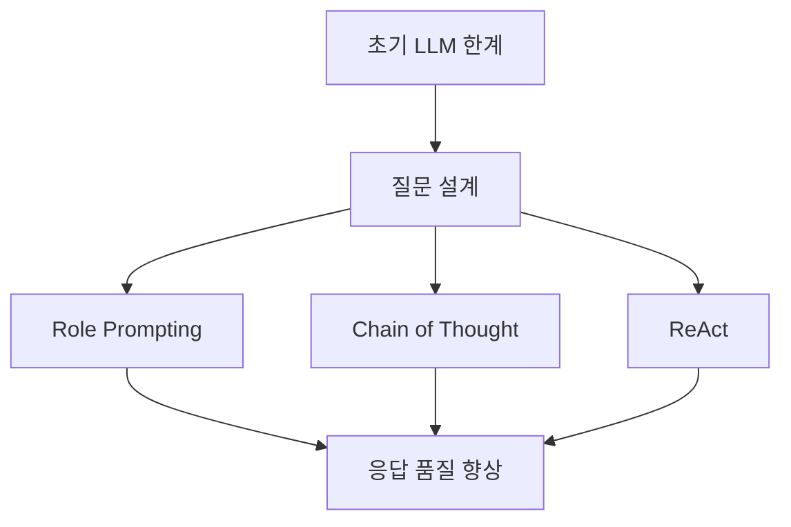
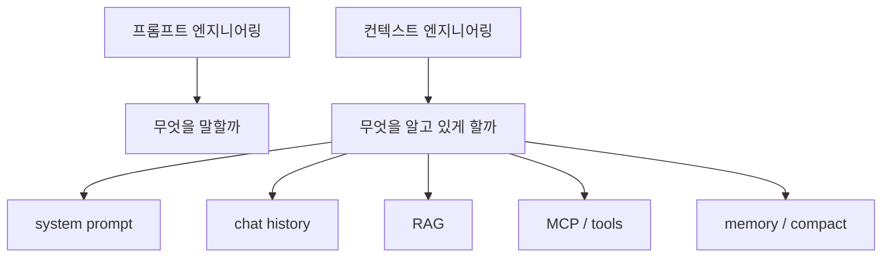
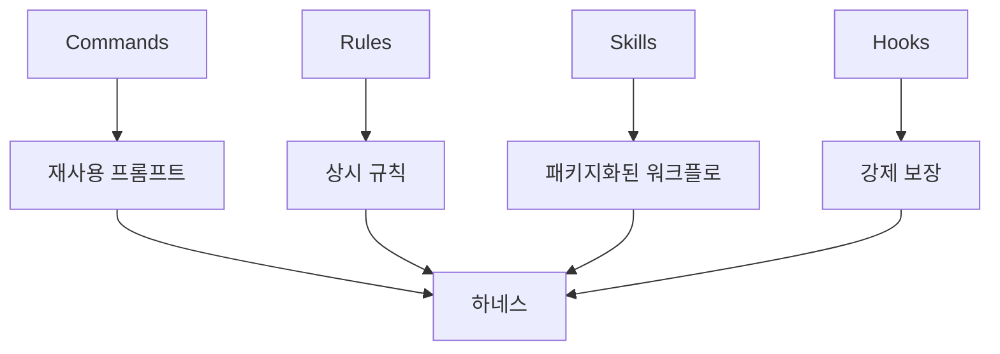

AI 코딩과 에이전트 이야기는 유행어만 계속 바뀌는 것처럼 보이지만, 실제로는 꽤 분명한 방향으로 진화해 왔습니다. 이 영상은 그 흐름을 `프롬프트 엔지니어링 → 컨텍스트 엔지니어링 → 바이브 코딩 → 하네스 엔지니어링` 으로 묶어 설명합니다. 중요한 건 이름이 아니라, 각 단계가 **이전 단계의 한계를 해결하려고 등장했다** 는 점입니다. [0:01](https://youtu.be/ryyEm2MKwtg?t=1) [0:16](https://youtu.be/ryyEm2MKwtg?t=16)
<!--more-->

그래서 이 영상은 단순한 개념 소개보다 “왜 이제는 하네스가 중요해졌는가”를 이해하는 데 유용합니다. 모델에게 질문을 잘하는 시대에서, 모델이 어떤 문맥을 보게 할지 설계하는 시대로, 다시 에이전트가 함부로 튀지 않게 작업 환경을 구축하는 시대로 관심사가 옮겨 갔다는 이야기이기 때문입니다. [5:50](https://youtu.be/ryyEm2MKwtg?t=350) [8:40](https://youtu.be/ryyEm2MKwtg?t=520)

## Sources

- https://youtu.be/ryyEm2MKwtg?si=wZ6AJdTm_BanMtH0

## 1. 시작점은 프롬프트 엔지니어링이었다

영상은 2022년 GitHub Copilot의 정식 출시와 그해 10월 ChatGPT 등장부터 이야기를 시작합니다. Copilot은 자동완성 기반의 AI 코딩 보조를 보여 줬고, ChatGPT는 훨씬 더 넓은 대중에게 “질문을 잘하면 더 좋은 답이 나온다”는 감각을 심어 줬습니다. 당시 모델 성능은 지금보다 약했기 때문에, 좋은 응답을 끌어내기 위한 질문 설계가 곧 실력처럼 여겨졌습니다. [0:33](https://youtu.be/ryyEm2MKwtg?t=33) [0:59](https://youtu.be/ryyEm2MKwtg?t=59) [1:39](https://youtu.be/ryyEm2MKwtg?t=99)

그래서 역할 부여(role prompting), 단계적으로 생각하게 하는 Chain of Thought, 추론과 행동을 번갈아 수행하는 ReAct 같은 기법이 중요하게 다뤄졌습니다. 이 시기의 핵심 질문은 “모델에게 무엇을 말해야 더 잘 대답할까?”였습니다. 다시 말해, 초점은 어디까지나 **좋은 한 번의 질문** 에 있었습니다. [2:06](https://youtu.be/ryyEm2MKwtg?t=126) [2:27](https://youtu.be/ryyEm2MKwtg?t=147) [2:56](https://youtu.be/ryyEm2MKwtg?t=176)

## 2. 하지만 한 번의 질문보다 더 큰 문제가 컨텍스트였다

프롬프트 엔지니어링이 어느 정도 효과를 보였지만, 곧 한계도 드러났습니다. 영상은 이 지점에서 `context window` 를 모델의 기억력 비유로 설명합니다. 대화가 길어질수록 이전 입력과 출력이 누적되어 함께 들어가고, 결국 처음의 맥락을 점점 잊거나 성능이 떨어지는 문제가 생긴다는 것입니다. [4:19](https://youtu.be/ryyEm2MKwtg?t=259) [4:53](https://youtu.be/ryyEm2MKwtg?t=293) [5:20](https://youtu.be/ryyEm2MKwtg?t=320)

이때부터 중요한 질문이 바뀝니다. “한 문장을 더 잘 쓰는 법”이 아니라 “한정된 컨텍스트 안에 무엇을 넣고 무엇을 빼야 하는가”가 더 중요해진 것입니다. 영상은 Andrej Karpathy와 Tobias Lütke 등의 논의를 언급하며, 여기서부터 `컨텍스트 엔지니어링` 이 빠르게 확산됐다고 설명합니다. 시스템 프롬프트, 채팅 히스토리, 장기 기억, RAG, MCP 같은 요소를 조합해 모델이 **무엇을 알고 있는 상태에서 답하게 할지** 설계하는 관점으로 바뀌었다는 뜻입니다. [5:50](https://youtu.be/ryyEm2MKwtg?t=350) [6:23](https://youtu.be/ryyEm2MKwtg?t=383) [6:57](https://youtu.be/ryyEm2MKwtg?t=417)

## 3. 바이브 코딩은 가능성을 보여 줬지만, 통제의 한계를 드러냈다

영상은 이어서 `바이브 코딩` 을 AI에 전적으로 의존해 소프트웨어를 개발하는 방법론으로 소개합니다. Lovable, Replit, v0, Bolt 같은 서비스가 빠르게 주목받았지만, 코드에 대한 이해 없이 결과를 수용하는 방식에는 분명한 한계가 있었다고 말합니다. 초기에는 인상적이었지만, 실제 트래픽과 관심이 어느 시점 이후 줄기 시작한 이유도 여기에 있다고 봅니다. [7:29](https://youtu.be/ryyEm2MKwtg?t=449) [8:05](https://youtu.be/ryyEm2MKwtg?t=485) [8:24](https://youtu.be/ryyEm2MKwtg?t=504)

이 대목이 중요한 이유는, 바이브 코딩이 실패했다기보다 **자율성을 높일수록 안전장치가 더 필요해진다** 는 사실을 보여 줬기 때문입니다. 에이전트가 대신 해 주는 일이 많아질수록, 잘못된 방향으로 달릴 때 어떻게 붙잡을지가 더 중요해졌습니다. 그리고 바로 그 문제의식이 하네스 엔지니어링으로 이어집니다. [8:39](https://youtu.be/ryyEm2MKwtg?t=519)

## 4. 하네스 엔지니어링은 에이전트가 일하는 “환경”을 만드는 일이다

영상에서 정의하는 하네스 엔지니어링은 AI 에이전트에게 안전장치와 실행 환경을 제공하는 일입니다. 에이전트가 더 자율적으로 움직일수록 원하지 않는 방향으로 튀거나 보안상 위험한 행동을 할 가능성도 커지기 때문에, 이를 제어하는 구조가 필요해진다는 설명입니다. 여기서 개발자의 역할도 달라집니다. 코드를 직접 많이 쓰는 사람이기보다, **에이전트가 올바르게 일하도록 주변 환경을 구축하는 사람** 이 되는 것입니다. [8:40](https://youtu.be/ryyEm2MKwtg?t=520) [9:31](https://youtu.be/ryyEm2MKwtg?t=571)

즉 프롬프트 엔지니어링이 질문 설계였다면, 하네스 엔지니어링은 작업 조건 설계입니다. 에이전트가 어떤 순서로 일하고, 언제 어떤 규칙을 참고하고, 어떤 행동은 금지되며, 어떤 시점에는 어떤 검증이 강제되는지까지 포함합니다. 이쯤 되면 더 이상 “좋은 프롬프트” 하나로 해결되는 범위를 넘어섭니다. [9:54](https://youtu.be/ryyEm2MKwtg?t=594)

## 5. 하네스는 보통 commands, rules, skills, hooks 네 층으로 쌓인다

영상은 하네스를 구성하는 실전 레이어를 네 가지로 설명합니다. 첫째는 반복 프롬프트를 템플릿화한 `commands`, 둘째는 에이전트가 상시 참고할 규칙 파일인 `rules`, 셋째는 예시 템플릿과 스크립트를 더 고도화해 패키지처럼 묶은 `skills`, 넷째는 특정 시점에 규칙을 강제로 실행하게 만드는 `hooks` 입니다. [10:46](https://youtu.be/ryyEm2MKwtg?t=646) [11:49](https://youtu.be/ryyEm2MKwtg?t=709) [12:00](https://youtu.be/ryyEm2MKwtg?t=720) [12:46](https://youtu.be/ryyEm2MKwtg?t=766)

이 설명이 좋은 이유는, 많은 팀이 이미 이 네 요소의 일부를 쓰고 있으면서도 그것을 “하네스”라고 부르지 않았다는 점을 일깨워 주기 때문입니다. 자주 쓰는 프롬프트를 저장해 두고, 프로젝트 규칙 파일을 두고, 반복 작업을 패키지화하고, 특정 시점에 검증 로직을 걸어 두는 일은 이미 많은 개발자가 하고 있습니다. 하네스 엔지니어링은 새로운 마법이 아니라, **흩어진 관행을 하나의 안전한 구조로 묶는 일** 에 더 가깝습니다. [10:00](https://youtu.be/ryyEm2MKwtg?t=600) [10:33](https://youtu.be/ryyEm2MKwtg?t=633)

## 6. Rules는 유도이고, Hooks는 강제다

후반부에서 특히 중요한 구분은 rules와 hooks의 차이입니다. 영상은 rules가 에이전트에게 어떤 방향을 “유도”할 수는 있지만, 100% 지키게 보장하지는 못한다고 말합니다. 반대로 hooks는 파일을 읽기 전, bash 명령을 실행하기 전 같은 시점에 코드로 개입해 특정 규칙을 강제할 수 있습니다. [14:40](https://youtu.be/ryyEm2MKwtg?t=880) [15:07](https://youtu.be/ryyEm2MKwtg?t=907)

예시도 매우 실용적입니다. 특정 파일은 절대 접근하지 못하게 막거나, 운영 브랜치에 직접 push하지 못하게 하거나, 테스트 코드 없이는 commit하지 못하게 만드는 식입니다. 또 TDD 규칙을 자꾸 잊는다면 reminder hook으로 테스트 먼저 작성하게 밀어 넣을 수 있습니다. 결국 진짜 하네스는 “좋은 조언”이 아니라, **위험한 행동은 못 하게 하고 필요한 행동은 빼먹지 못하게 만드는 장치** 입니다. [15:39](https://youtu.be/ryyEm2MKwtg?t=939) [16:00](https://youtu.be/ryyEm2MKwtg?t=960)

## 7. 구축은 크게가 아니라 작게 시작해야 한다

영상의 마지막 조언은 꽤 현실적입니다. 처음부터 완벽한 하네스를 설계하려 하지 말고, 작은 command 하나에서 시작해 그것이 skill이 되고, skill들이 쌓여 rule이 되고, 마지막으로 꼭 지켜야 할 부분만 hook으로 올리는 식으로 단계적으로 가라는 것입니다. 즉 하네스는 한 번에 설계하는 거대한 프레임워크가 아니라, **반복 작업을 발견할 때마다 조금씩 고도화하는 과정** 에 가깝습니다. [16:40](https://youtu.be/ryyEm2MKwtg?t=1000) [16:47](https://youtu.be/ryyEm2MKwtg?t=1007)

플러그인이나 외부 프레임워크를 가져다 쓰는 것도 방법이지만, 발표자는 팀마다 컨벤션과 워크플로가 다르기 때문에 직접 조합해서 만드는 편을 더 선호한다고 말합니다. 이 메시지는 중요합니다. 하네스 엔지니어링의 핵심은 특정 플러그인 이름이 아니라, **우리 팀의 작업 방식이 에이전트의 행동을 어디까지 결정해야 하는가** 를 설계하는 데 있기 때문입니다. [17:07](https://youtu.be/ryyEm2MKwtg?t=1027) [17:28](https://youtu.be/ryyEm2MKwtg?t=1048)

## 실전 적용 포인트

- 프롬프트 최적화에만 머물러 있다면, 지금부터는 컨텍스트와 작업 환경 설계로 관심을 옮겨야 합니다. [5:50](https://youtu.be/ryyEm2MKwtg?t=350)
- 이미 반복 프롬프트, 규칙 파일, 스크립트 패키지, 사전 검증 로직을 쓰고 있다면 하네스의 일부를 하고 있는 셈입니다. [10:33](https://youtu.be/ryyEm2MKwtg?t=633)
- 규칙 파일만으로는 부족하고, 반드시 지켜야 하는 것은 hook으로 강제하는 편이 안전합니다. [14:40](https://youtu.be/ryyEm2MKwtg?t=880)
- 바이브 코딩의 한계는 곧 하네스의 필요성을 보여 주는 신호입니다. [8:24](https://youtu.be/ryyEm2MKwtg?t=504)
- 가장 현실적인 시작점은 “반복 프롬프트 하나를 command로 만드는 것”입니다. [10:46](https://youtu.be/ryyEm2MKwtg?t=646)

## 핵심 요약

이 영상이 보여 주는 4년의 변화는 단순 유행사가 아닙니다. 프롬프트 엔지니어링은 질문의 질을 높였고, 컨텍스트 엔지니어링은 모델이 보는 문맥 전체를 설계하게 만들었으며, 바이브 코딩은 자율화의 가능성과 위험을 동시에 드러냈습니다. 그리고 하네스 엔지니어링은 그 자율화를 안전하고 반복 가능한 워크플로 안에 가두려는 시도입니다. [1:39](https://youtu.be/ryyEm2MKwtg?t=99) [6:23](https://youtu.be/ryyEm2MKwtg?t=383) [8:39](https://youtu.be/ryyEm2MKwtg?t=519)

결국 개발자의 역할도 바뀝니다. 앞으로 중요한 것은 “코드를 얼마나 직접 빨리 쓰느냐”만이 아니라, 에이전트가 팀의 규칙과 구조 안에서 일하게 만드는 실행 환경을 얼마나 잘 설계하느냐입니다. 그 관점에서 보면 하네스 엔지니어링은 일시적 유행이라기보다, 에이전트 시대의 개발 운영 방식에 더 가깝습니다. [9:31](https://youtu.be/ryyEm2MKwtg?t=571) [18:04](https://youtu.be/ryyEm2MKwtg?t=1084)

## 결론

하네스 엔지니어링은 거창한 프레임워크 이름이 아니라, 에이전트가 우리 팀의 울타리 안에서 일하도록 만드는 방법의 총합입니다. command로 반복을 줄이고, rules로 방향을 맞추고, skills로 워크플로를 패키지화하고, hooks로 마지막 안전장치를 거는 흐름만 이해해도 이미 절반은 시작한 셈입니다. [10:46](https://youtu.be/ryyEm2MKwtg?t=646) [12:46](https://youtu.be/ryyEm2MKwtg?t=766) [15:39](https://youtu.be/ryyEm2MKwtg?t=939)
