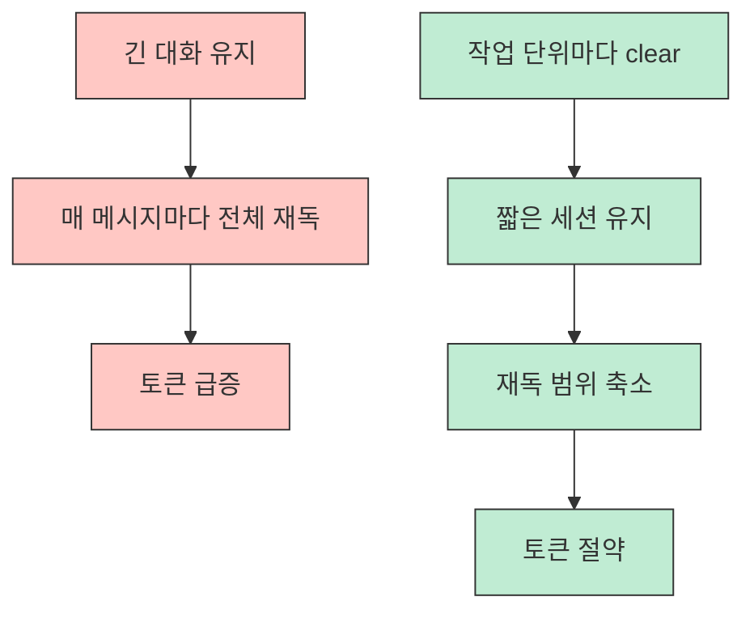
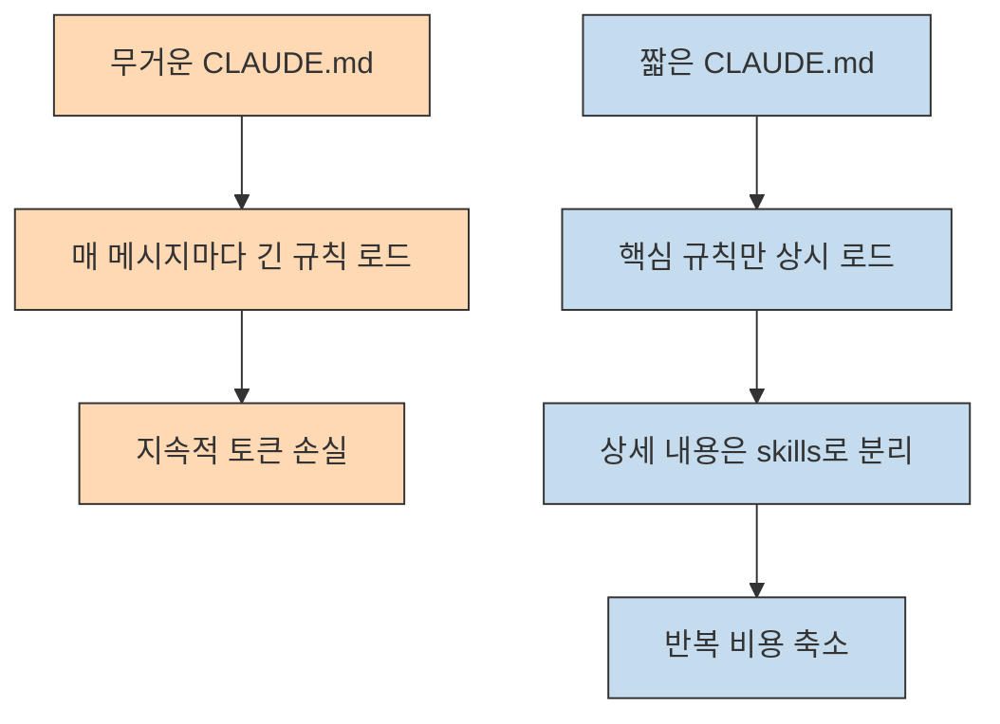
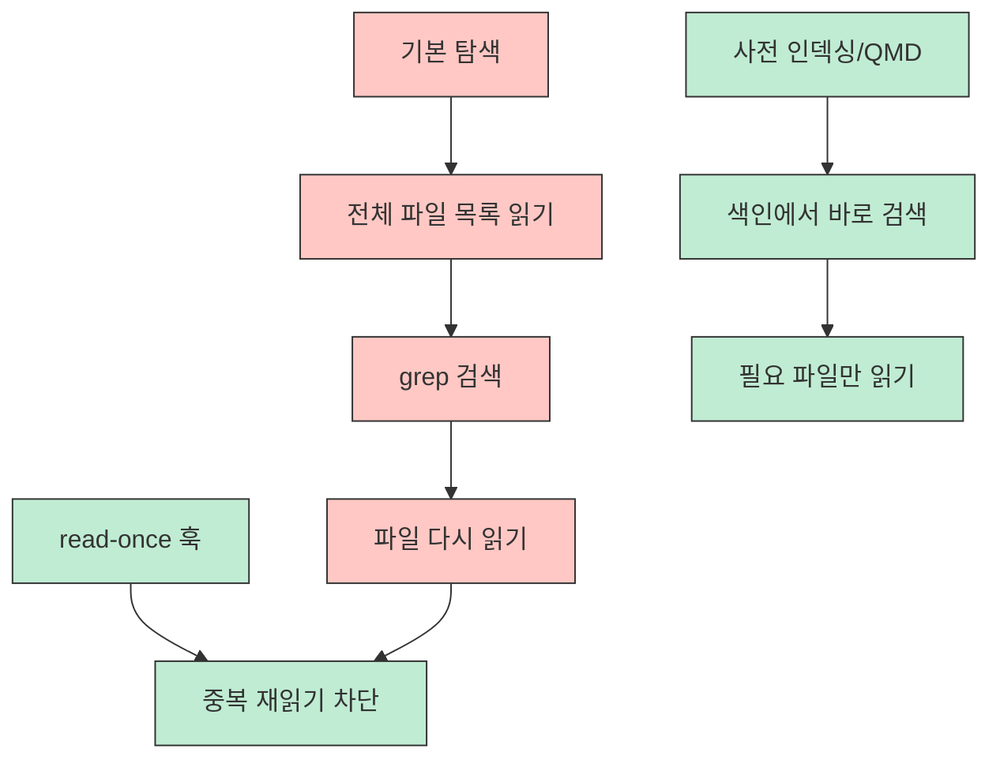

Claude Code를 오래 쓰다 보면 어느 순간 “모델이 비싸다”보다 “내가 너무 비효율적으로 쓰고 있나?”가 더 큰 문제가 됩니다. 이 영상도 바로 그 지점을 찌릅니다. 발표자는 요금제보다 먼저 **쓰는 방식과 절약 노하우** 가 중요하다고 말하면서, 공식 문서·기술 블로그·커뮤니티 팁을 모아 토큰 절약 방법 52가지를 초급·중급·고급으로 나눠 정리합니다. [0:01](https://youtu.be/afr2jTsRSMc?t=1) [0:20](https://youtu.be/afr2jTsRSMc?t=20) [0:40](https://youtu.be/afr2jTsRSMc?t=40)
<!--more-->

핵심 메시지는 단순합니다. Claude Code는 매번 대화의 앞부분부터 다시 읽기 때문에, 세션이 길어질수록 비용은 생각보다 빠르게 커집니다. 그래서 토큰 최적화는 “모델을 더 싼 걸 쓰자”가 아니라, **컨텍스트를 덜 읽게 만들고, 덜 로드하게 만들고, 잘못된 작업을 덜 하게 만드는 운영 습관** 에 가깝습니다. 이 글은 52개를 전부 나열하기보다, 실제로 효과가 큰 규칙들을 초급·중급·고급의 흐름으로 묶어 보겠습니다. [1:26](https://youtu.be/afr2jTsRSMc?t=86) [2:17](https://youtu.be/afr2jTsRSMc?t=137)

## Sources

- https://youtu.be/afr2jTsRSMc?si=X5O4T9RFXLxVvhqz

## 1. 초급: 먼저 “대화를 짧게 유지하는 습관”부터 고쳐야 한다

영상 초반에서 가장 먼저 강조하는 것은 Claude Code가 메시지를 보낼 때마다 이전 대화를 전부 다시 읽는다는 점입니다. 발표자는 이 때문에 비용이 단순 선형이 아니라 체감상 훨씬 빠르게 커진다고 설명하고, 가장 쉬운 절약법으로 작업이 끝날 때마다 `/clear` 로 세션을 초기화하라고 권합니다. 이건 고급 팁이 아니라, 토큰 절약의 출발점에 가깝습니다. [1:26](https://youtu.be/afr2jTsRSMc?t=86) [2:17](https://youtu.be/afr2jTsRSMc?t=137) [2:35](https://youtu.be/afr2jTsRSMc?t=155)

이어지는 초급 팁들도 대부분 같은 방향을 가리킵니다. 범위를 넓게 말하지 말고 특정 파일·특정 함수·특정 줄을 집어 말하기, 간단한 요청은 한 번에 묶되 무거운 작업은 쪼개기, 긴 파일 전체를 태그하지 않기 같은 원칙입니다. 즉 모델을 더 똑똑하게 만들기보다, **불필요한 읽기 자체를 줄여라** 는 것입니다. [2:52](https://youtu.be/afr2jTsRSMc?t=172) [3:07](https://youtu.be/afr2jTsRSMc?t=187) [4:11](https://youtu.be/afr2jTsRSMc?t=251)

초급 파트에서 눈에 띄는 다른 기준은 모델 선택과 MCP 사용 습관입니다. 기본 모델을 Sonnet으로 두고, 정말 단순한 작업은 Haiku, 깊은 설계나 고난도 디버깅만 Opus를 쓰라는 조언이 나옵니다. 또 안 쓰는 MCP는 꺼 두고, 매 세션마다 반복하는 자기소개나 역할 설명은 메모리와 사용자 설정에 저장해 프롬프트로 되풀이하지 말라고 합니다. 이런 팁은 화려하지 않지만 즉시 체감이 옵니다. [5:05](https://youtu.be/afr2jTsRSMc?t=305) [5:26](https://youtu.be/afr2jTsRSMc?t=326) [6:19](https://youtu.be/afr2jTsRSMc?t=379)

## 2. 중급: 진짜 차이는 `CLAUDE.md`, MCP, 컨텍스트 압축에서 난다

중급 파트는 사실상 이 영상의 중심입니다. 발표자도 이 시리즈를 기획한 이유가 여기 있다고 말할 정도입니다. 첫 번째 핵심은 `.claudeignore` 입니다. Claude가 `node_modules`, `.next` 같은 거대한 디렉터리까지 탐색하려 들면 토큰이 녹아 버리므로, 프로젝트 초반부터 읽지 않아도 되는 폴더를 명시해 두라는 것입니다. Git의 `.gitignore` 처럼, Claude에게도 “여기는 보지 마”를 알려 주는 셈입니다. [11:43](https://youtu.be/afr2jTsRSMc?t=703) [12:20](https://youtu.be/afr2jTsRSMc?t=740)

두 번째 핵심은 `CLAUDE.md` 다이어트입니다. 발표자는 이 파일이 세션 시작 때만 읽히는 것이 아니라 메시지마다 반복해서 영향을 준다고 보고, 200줄 이하를 권장합니다. 장황한 서술형 문장을 지우고, 헤딩·리스트·테이블로 압축하고, 상세 지식은 skill로 분리하라는 조언이 여기서 나옵니다. 결국 `CLAUDE.md` 는 모든 걸 다 적는 백과사전이 아니라, **반복적으로 항상 주입되어야 하는 최소 규칙 집합** 이어야 한다는 뜻입니다. [12:56](https://youtu.be/afr2jTsRSMc?t=776) [13:33](https://youtu.be/afr2jTsRSMc?t=813)

또 하나 중요한 축은 MCP 관리입니다. 이 영상은 MCP를 많이 붙이는 것 자체보다, **도구 정의가 매번 컨텍스트에 실려 오는 오버헤드** 를 더 경계합니다. 불필요한 MCP 연결이 없는지 확인하고, 툴 서치 옵션을 활용하고, 글로벌 MCP와 프로젝트 레벨 MCP를 분리하고, 서버 수와 설명 길이를 기준으로 토큰 비용을 대략 추정해 줄이라고 권합니다. 길고 친절한 툴 설명문도 결국 토큰 비용이라는 점을 계속 상기시킵니다. [18:20](https://youtu.be/afr2jTsRSMc?t=1100) [18:34](https://youtu.be/afr2jTsRSMc?t=1114) [19:07](https://youtu.be/afr2jTsRSMc?t=1147) [19:53](https://youtu.be/afr2jTsRSMc?t=1193)

중급에서 특히 실전적인 팁은 수동 compact입니다. 자동 compact는 95% 근처에서 작동하지만, 그 시점이면 이미 컨텍스트 품질이 상당히 저하돼 있을 수 있으니 60% 즈음에서 미리 수동으로 compact하고 “무엇을 보존할지”를 함께 지시하라는 것입니다. 이것은 단순 압축이 아니라, 앞으로 이어질 작업에 필요한 핵심 상태를 선별해 남기는 과정입니다. [15:47](https://youtu.be/afr2jTsRSMc?t=947) [16:14](https://youtu.be/afr2jTsRSMc?t=974)

## 3. 중급의 진짜 핵심은 “잘못된 작업을 덜 하게 만드는 것”이다

영상 후반 중급 팁 중 가장 중요한 것은 Plan Mode를 먼저 쓰라는 조언입니다. 발표자는 토큰 낭비의 최대 원인으로 “잘못된 방향으로 코드를 잔뜩 쌓아 두고 전부 버리는 상황”을 듭니다. 코드를 쓰는 데도 토큰이 들고, 그 코드를 지우는 데도 토큰이 드니 사실상 두 배 손실이라는 것입니다. 그래서 Shift+Tab으로 Plan Mode에 들어가, 어떤 파일을 어떤 순서로 건드릴지 먼저 검토한 뒤 실행으로 넘어가라고 합니다. [22:20](https://youtu.be/afr2jTsRSMc?t=1340) [22:44](https://youtu.be/afr2jTsRSMc?t=1364) [23:01](https://youtu.be/afr2jTsRSMc?t=1381)

여기서 핵심은 절약이 곧 검소함이 아니라는 점입니다. 시간을 조금 더 써서 초반에 방향을 잡으면, 뒤에서 수천 토큰을 허비하는 삽질을 막을 수 있습니다. 즉 토큰을 아끼는 가장 좋은 방법은 짧은 답을 강요하는 게 아니라, **덜 틀리게 일하게 만드는 것** 입니다. 이 관점은 단순 비용 절감 팁보다 훨씬 오래 갑니다. [22:20](https://youtu.be/afr2jTsRSMc?t=1340)

## 4. 고급: 탐색 비용과 중복 읽기를 구조적으로 줄여야 한다

고급 파트에 들어가면 개별 습관보다 구조적 최적화가 중심이 됩니다. 대표적인 예가 코드베이스 사전 인덱싱인 `QMD` 입니다. 발표자는 Claude가 보통 전체 파일 목록을 훑고, grep으로 키워드를 찾고, 그다음 찾은 파일을 다시 읽는 식으로 탐색한다고 설명하면서, 앞의 두 단계는 사실상 낭비에 가깝다고 봅니다. QMD로 프로젝트를 미리 색인해 두면 Claude가 검색 엔진처럼 바로 필요한 코드를 찾게 되어 이 과정을 크게 줄일 수 있다고 말합니다. [26:41](https://youtu.be/afr2jTsRSMc?t=1601) [27:20](https://youtu.be/afr2jTsRSMc?t=1640) [27:48](https://youtu.be/afr2jTsRSMc?t=1668)

그다음은 중복 재읽기 방지입니다. 발표자는 Claude Code가 같은 파일을 세션 내에서 반복해서 읽는 것이 큰 낭비라고 보고, 이미 읽은 파일의 재읽기를 추적·차단하는 `read once` 계열 훅을 소개합니다. 이건 모델이 멍청해서 생기는 문제가 아니라, 에이전트형 작업이 본질적으로 같은 파일을 여러 번 확인하기 쉬운 구조이기 때문입니다. 그래서 고급 최적화는 프롬프트 문구보다 **탐색/읽기 경로를 구조적으로 줄이는 레이어** 에 가깝습니다. [28:08](https://youtu.be/afr2jTsRSMc?t=1688) [28:31](https://youtu.be/afr2jTsRSMc?t=1711)

고급 파트에서는 환경 변수로 비용을 직접 제어하는 방법도 소개합니다. 백그라운드 모델 호출을 줄이는 플래그, 비용 경고 메시지를 끄는 옵션, 프롬프트 캐싱을 유지하는 설정 등이 그것입니다. 특히 발표자는 프롬프트 캐싱은 반복 요청에서 절약 효과가 크기 때문에 끄지 말 것을 권합니다. 또 오픈소스 MCP를 직접 손보는 사용자라면 도구 설명을 짧게 다이어트해 매 메시지마다 따라오는 정의 비용을 줄이라고도 말합니다. [30:06](https://youtu.be/afr2jTsRSMc?t=1806) [30:47](https://youtu.be/afr2jTsRSMc?t=1847) [31:32](https://youtu.be/afr2jTsRSMc?t=1892)

## 5. 서브에이전트와 멀티 터미널은 생산성 팁이자 비용 통제 수단이다

영상 후반의 포인트 하나는 “많이 쓰는 기능”이 아니라 “분리해서 쓰는 구조”입니다. 서브에이전트마다 필요한 도구만 연결하면, 각 에이전트 컨텍스트에 불필요한 툴 정의가 들어오지 않아 토큰이 줄고 오작동 위험도 낮아진다고 설명합니다. 코드 리뷰 에이전트에 DB 도구가 붙어 있으면 실수 위험도 커진다는 예시가 나옵니다. [33:22](https://youtu.be/afr2jTsRSMc?t=2002) [33:40](https://youtu.be/afr2jTsRSMc?t=2020)

비슷한 맥락에서 멀티 터미널 전략도 소개합니다. 피처 개발, 리팩터링, 버그 수정 같은 서로 다른 일을 한 터미널 안에서 모두 처리하면 컨텍스트가 뒤섞입니다. 반대로 터미널을 여러 개 띄우면 각 창이 별도 컨텍스트를 가지므로 충돌이 줄고 병렬 작업도 쉬워집니다. 즉 멀티 터미널은 생산성 팁이면서, 동시에 **컨텍스트 오염을 줄여 토큰을 덜 새게 하는 팁** 이기도 합니다. [33:45](https://youtu.be/afr2jTsRSMc?t=2025) [34:09](https://youtu.be/afr2jTsRSMc?t=2049)

## 실전 적용 포인트

- 가장 먼저 할 일은 `/clear` 습관, 범위 좁은 프롬프트, 필요한 파일만 읽게 하기 같은 초급 규칙부터 몸에 익히는 것입니다. [2:17](https://youtu.be/afr2jTsRSMc?t=137)
- `CLAUDE.md` 는 길게 쓰는 문서가 아니라 상시 주입되는 최소 규칙 파일로 보고, 상세 지식은 skills로 분리하는 편이 낫습니다. [12:56](https://youtu.be/afr2jTsRSMc?t=776) [13:33](https://youtu.be/afr2jTsRSMc?t=813)
- MCP는 “많이 붙이면 강해진다”보다 “붙을수록 컨텍스트 기본세가 올라간다”는 관점으로 관리해야 합니다. [18:20](https://youtu.be/afr2jTsRSMc?t=1100)
- 토큰을 아끼는 최고의 방법 중 하나는 Plan Mode로 삽질을 줄이는 것입니다. [22:20](https://youtu.be/afr2jTsRSMc?t=1340)
- 고급 최적화는 프롬프트 문장보다 탐색 구조, 재읽기 구조, 도구 로딩 구조를 바꾸는 일에 가깝습니다. [26:41](https://youtu.be/afr2jTsRSMc?t=1601) [28:08](https://youtu.be/afr2jTsRSMc?t=1688)

## 핵심 요약

이 영상의 장점은 “토큰 절약 팁”을 사소한 요령 모음으로 끝내지 않는다는 데 있습니다. 초급에서는 세션 길이와 프롬프트 범위를 줄이고, 중급에서는 `CLAUDE.md`·MCP·compact 운영을 최적화하고, 고급에서는 검색·재읽기·도구 로딩 구조 자체를 바꾸라고 합니다. 즉 절약의 레버가 점점 깊어집니다. [11:43](https://youtu.be/afr2jTsRSMc?t=703) [26:41](https://youtu.be/afr2jTsRSMc?t=1601)

결국 중요한 것은 “더 싼 모델”보다 “더 적게 읽게 만드는 시스템”입니다. 세션을 짧게 유지하고, 불필요한 파일과 도구를 못 보게 하고, 잘못된 방향으로 실행하기 전에 계획을 검토하고, 탐색과 재읽기를 구조적으로 줄이면 같은 요금제 안에서도 체감 효율이 크게 달라집니다. [1:26](https://youtu.be/afr2jTsRSMc?t=86) [22:20](https://youtu.be/afr2jTsRSMc?t=1340) [30:06](https://youtu.be/afr2jTsRSMc?t=1806)

## 결론

52개를 한 번에 다 적용할 필요는 없습니다. 오히려 발표자 말처럼 한꺼번에 바꾸면 부담만 커집니다. 지금 바로 실전에 옮길 만한 순서를 잡자면, `clear 습관 → 범위 좁은 지시 → .claudeignore → 짧은 CLAUDE.md → MCP 정리 → Plan Mode → 사전 인덱싱` 정도가 현실적입니다. 이 순서만 따라가도 Claude Code는 “금방 토큰이 녹는 도구”에서 “생산성 대비 비용이 맞는 도구”로 훨씬 다르게 느껴질 가능성이 큽니다. [35:00](https://youtu.be/afr2jTsRSMc?t=2100) [35:15](https://youtu.be/afr2jTsRSMc?t=2115)
