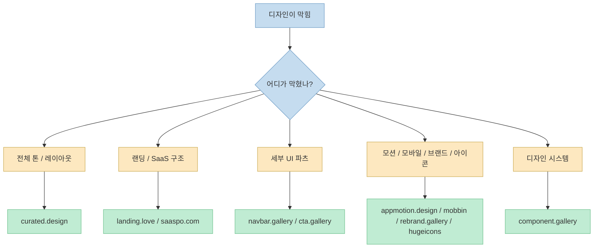
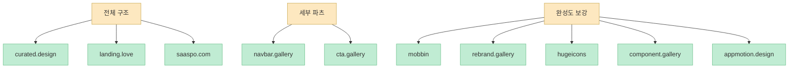
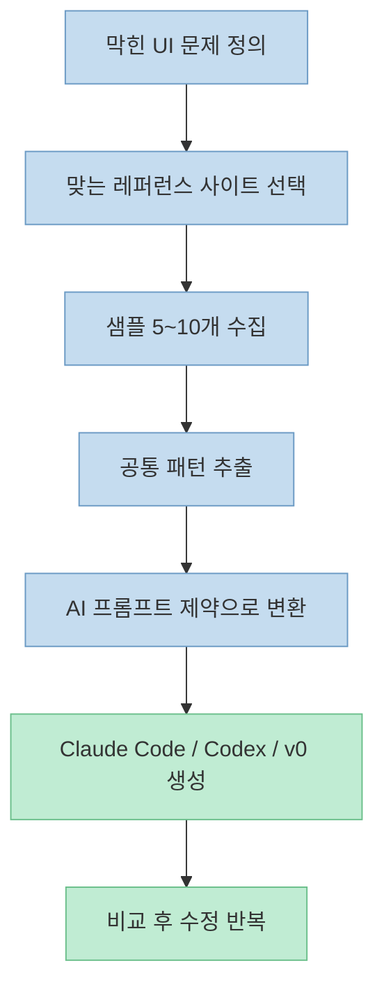

이 X 포스트는 긴 설명 대신 아주 실용적인 지도를 던집니다. 디자인 영감이 필요할 때 카테고리별로 어디를 열어야 하는지 한 줄씩 정리해 둔 링크 모음입니다. 웹 디자인, 랜딩 페이지, SaaS 사이트, 내비게이션 바, CTA, 애니메이션, 모바일 앱, 브랜드, 아이콘, 디자인 시스템까지 **"무엇이 막혔는지" 에 따라 바로 들어갈 입구를 나눠 준다** 는 점이 핵심입니다. (원문: [X 포스트](https://x.com/i/status/2041197380192882846), 추출: Jina Reader)

이런 종류의 큐레이션이 유용한 이유는 레퍼런스를 무작정 많이 보는 것보다, 지금 막힌 문제가 "전체 톤", "히어로 섹션", "CTA", "아이콘", "컴포넌트 체계" 중 무엇인지 먼저 분류하는 편이 훨씬 빠르기 때문입니다. 특히 Claude Code, Codex, v0, Lovable 같은 도구로 화면을 만들 때도 결국 잘 되는 프롬프트는 추상적 취향이 아니라 **구체적 레퍼런스의 묶음** 에서 나옵니다. (원문: [X 포스트](https://x.com/i/status/2041197380192882846))

<!--more-->

## Sources

- [Raunak Yadush on X](https://x.com/i/status/2041197380192882846)

## 1. 이 포스트가 주는 진짜 가치: 레퍼런스를 “주제별 검색”이 아니라 “문제별 검색”으로 바꾸기

원문 포스트는 다음처럼 아주 간결한 구조를 갖습니다. `Web Design → curated.design`, `Landing Pages → landing.love`, `Saas Websites → saaspo.com`, `Navbar → navbar.gallery`, `CTA Sections → cta.gallery`, `Animation → appmotion.design`, `Mobile Apps → mobbin`, `Brands → rebrand.gallery`, `Icons → hugeicons`, `Design Systems → component.gallery` 식으로 카테고리와 목적지를 1:1로 매핑합니다. ([X 포스트](https://x.com/i/status/2041197380192882846))

이 방식이 좋은 이유는 레퍼런스 탐색의 단위를 "예쁜 사이트 찾기" 에서 "지금 어느 레이어가 막혔는가" 로 바꾸기 때문입니다. 화면 전체 레이아웃이 막혔는지, 랜딩 페이지의 카피와 섹션 구조가 막혔는지, SaaS 제품 문법이 막혔는지, 혹은 아주 세부적으로 navbar나 CTA 구성만 막혔는지에 따라 열어야 할 레퍼런스 창이 달라집니다. 즉 이 리스트는 단순 추천 목록이 아니라 **탐색 비용을 줄이는 인덱스** 로 볼 수 있습니다. ([X 포스트](https://x.com/i/status/2041197380192882846))

## 2. 작업 단계별로 보면 이 10개 사이트는 이렇게 나뉜다

### 2-1. 전체 화면 감각을 잡는 레퍼런스

원문 목록에서 가장 먼저 열어볼 사이트는 전체적인 웹 톤과 레이아웃을 보는 축입니다. `curated.design` 은 웹 디자인 전반의 레퍼런스를 보는 입구로, `landing.love` 는 랜딩 페이지에 집중된 큐레이션, `saaspo.com` 은 SaaS 웹사이트 톤에 맞춘 큐레이션으로 읽을 수 있습니다. 세 사이트는 전부 "무드보드" 역할을 하지만 보는 포인트는 다릅니다. 웹 디자인은 폭넓은 시각 언어, 랜딩 페이지는 설득 흐름, SaaS 사이트는 제품 문법과 정보 구조를 보는 데 가깝습니다. ([X 포스트](https://x.com/i/status/2041197380192882846))

실제로 이런 구분은 AI 툴에 레퍼런스를 넘길 때도 중요합니다. 예를 들어 `landing.love` 계열 레퍼런스는 히어로-문제 제기-기능 소개-신뢰 요소-FAQ-CTA 같은 설득 흐름을 뽑는 데 유용하고, SaaS 레퍼런스는 대시보드 캡처, 기능 비교, 가격표, 사회적 증거처럼 제품 사이트 특유의 패턴을 잡는 데 더 적합합니다. 원문은 그 차이를 길게 설명하지 않지만, 링크 구성이 이미 그런 탐색 경로를 암시합니다. ([X 포스트](https://x.com/i/status/2041197380192882846))

### 2-2. 막히는 지점만 잘라 보는 파츠 단위 레퍼런스

둘째 축은 페이지 전체가 아니라 특정 파츠에 대한 레퍼런스입니다. 원문에서 `navbar.gallery` 와 `cta.gallery` 를 따로 떼어 넣은 이유가 여기에 있습니다. 화면 전체는 얼추 나왔는데 상단 내비게이션이 애매하거나, 마지막 전환 버튼 섹션이 평범하게 느껴질 때는 전체 레퍼런스를 다시 뒤지는 것보다 해당 파츠 전용 갤러리로 바로 들어가는 편이 훨씬 빠릅니다. ([X 포스트](https://x.com/i/status/2041197380192882846))

이 접근은 바이브 코딩이나 AI 코딩 도구를 쓸 때 특히 유리합니다. "세련되게 만들어줘" 보다 "navbar.gallery 느낌의 얇은 상단 구조, sticky behavior, 2단 hover 상태를 참고해 달라" 혹은 "cta.gallery에서 자주 보이는 큰 한 줄 카피 + 보조 텍스트 + 2버튼 구조로 재구성해 달라" 처럼 지시를 줄 수 있기 때문입니다. 즉 파츠 단위 레퍼런스는 감상용이 아니라 **프롬프트 정밀도를 올리는 재료** 입니다. ([X 포스트](https://x.com/i/status/2041197380192882846))

### 2-3. 무드와 디테일을 채우는 보조 레퍼런스

셋째 축은 모션, 모바일, 브랜드, 아이콘, 디자인 시스템처럼 "전체 뼈대" 가 아니라 화면의 완성도를 밀어 올리는 영역입니다. 원문은 `appmotion.design`, `mobbin`, `rebrand.gallery`, `hugeicons`, `component.gallery` 를 여기에 배치합니다. 모바일 앱 흐름을 보고 싶을 때는 Mobbin, 브랜드 아이덴티티 감각이 필요할 때는 Rebrand, 아이콘 세트를 빠르게 맞추고 싶을 때는 Hugeicons, 컴포넌트와 패턴 체계를 보고 싶을 때는 Component Gallery를 여는 식입니다. ([X 포스트](https://x.com/i/status/2041197380192882846))

다만 2026년 4월 8일 확인 기준으로는 이 목록의 일부는 접근 상태가 매끄럽지 않았습니다. `appmotion.design` 은 Framer의 404 페이지로 보였고, `saaspo.com` 은 Cloudflare 403 응답이 관찰됐습니다. 반대로 `landing.love`, `navbar.gallery`, `cta.gallery`, `mobbin`, `rebrand.gallery`, `hugeicons`, `component.gallery` 는 현재 열리는 것을 확인했습니다. 따라서 이 포스트는 "원문 추천 목록" 을 기준으로 정리하되, 실제 접근성은 시점에 따라 달라질 수 있다는 점을 함께 보는 편이 좋습니다. ([X 포스트](https://x.com/i/status/2041197380192882846))

## 3. 이 목록을 Claude Code·Codex·v0 같은 도구와 함께 쓰는 방법

이 리스트를 가장 잘 쓰는 방법은 "레퍼런스 수집 → 규칙 추출 → AI에게 전달" 의 3단계로 보는 것입니다. 먼저 현재 작업 단계에 맞는 사이트를 열어 레퍼런스를 5~10개 정도 빠르게 수집합니다. 다음으로 공통 규칙을 뽑습니다. 예를 들면 히어로 섹션 높이, CTA 버튼 개수, 카드 모서리 라운드, 아이콘 톤, 내비게이션 밀도, 브랜드 컬러 사용량 같은 요소입니다. 마지막으로 그 규칙을 AI 도구에 구조화된 제약으로 넘깁니다. ([X 포스트](https://x.com/i/status/2041197380192882846))

중요한 것은 링크를 많이 던지는 게 아니라, 레퍼런스에서 뽑은 패턴을 문장으로 바꾸는 일입니다. 예를 들어 "Mobbin에서 본 onboarding flow처럼 화면마다 한 가지 행동만 남겨라", "Component Gallery 계열처럼 카드와 배지 계층을 명확히 나눠라", "Rebrand Gallery 참고해서 컬러는 1개 메인 + 1개 보조만 쓰라" 처럼 바꿔 주면 Claude Code나 v0가 훨씬 안정적으로 결과를 냅니다. 즉 레퍼런스 사이트는 영감을 얻는 장소이기도 하지만, 더 정확히는 **제약을 추출하는 데이터셋** 으로 보는 편이 유용합니다. ([X 포스트](https://x.com/i/status/2041197380192882846))

## 4. 실전 적용 포인트

첫째, 레퍼런스 탐색은 "예쁜 것 찾기" 보다 "현재 어떤 층위가 막혔는지 분류하기" 가 먼저입니다. 전체 톤이 막혔는지, 랜딩 설득 구조가 막혔는지, navbar나 CTA만 막혔는지부터 나누면 탐색 시간이 크게 줄어듭니다. ([X 포스트](https://x.com/i/status/2041197380192882846))

둘째, 파츠 전용 갤러리는 AI 툴과 궁합이 좋습니다. 전체 사이트 레퍼런스보다 navbar, CTA, component 같은 세부 패턴 레퍼런스가 프롬프트의 제약 조건으로 옮기기 쉽기 때문입니다. ([X 포스트](https://x.com/i/status/2041197380192882846))

셋째, 모바일·브랜드·아이콘·디자인 시스템 자료는 "없으면 안 되는 것" 보다 "있으면 품질 차이가 크게 나는 것" 에 가깝습니다. 그래서 뼈대가 나온 뒤 완성도를 끌어올리는 후반 공정에서 특히 유용합니다. ([X 포스트](https://x.com/i/status/2041197380192882846))

넷째, 추천 링크는 시점에 따라 상태가 달라질 수 있습니다. 2026년 4월 8일 기준 제가 확인했을 때 일부 링크는 정상 접근이 어려웠기 때문에, 목록을 절대적 정답으로 보기보다 현재 접근 가능한 대체 레퍼런스와 함께 운영하는 편이 좋습니다. ([X 포스트](https://x.com/i/status/2041197380192882846))

## 핵심 요약

- 이 X 포스트는 디자인 레퍼런스 10개를 **문제 유형별 인덱스** 로 묶어 준다. ([X 포스트](https://x.com/i/status/2041197380192882846))
- 전체 웹 톤은 `curated.design`, 랜딩 구조는 `landing.love`, SaaS 문법은 `saaspo.com` 처럼 큰 단위에서 시작할 수 있다. ([X 포스트](https://x.com/i/status/2041197380192882846))
- 세부 파츠는 `navbar.gallery`, `cta.gallery` 같은 전용 갤러리로 바로 가는 편이 빠르다. ([X 포스트](https://x.com/i/status/2041197380192882846))
- 모바일, 브랜드, 아이콘, 디자인 시스템 레퍼런스는 후반 완성도를 끌어올리는 보조 축이다. ([X 포스트](https://x.com/i/status/2041197380192882846))
- AI 코딩 도구와 함께 쓸 때는 레퍼런스를 그대로 넘기기보다, 거기서 공통 규칙을 뽑아 제약 조건으로 바꾸는 것이 중요하다. ([X 포스트](https://x.com/i/status/2041197380192882846))

## 결론

좋은 레퍼런스 리스트의 가치는 링크 개수보다 **탐색 방향을 줄여 준다** 는 데 있습니다. 이 포스트가 유용한 이유도 바로 거기에 있습니다. 디자인이 막혔을 때 인터넷 전체를 뒤지는 대신, 지금 막힌 층위에 맞는 창 하나를 바로 열 수 있게 해 주기 때문입니다. 특히 AI 도구로 화면을 만드는 시대에는, 이런 레퍼런스 맵이 곧 더 좋은 프롬프트의 출발점이 됩니다. ([X 포스트](https://x.com/i/status/2041197380192882846))
