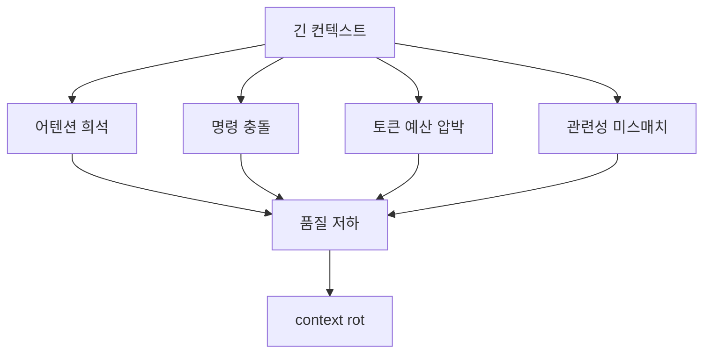
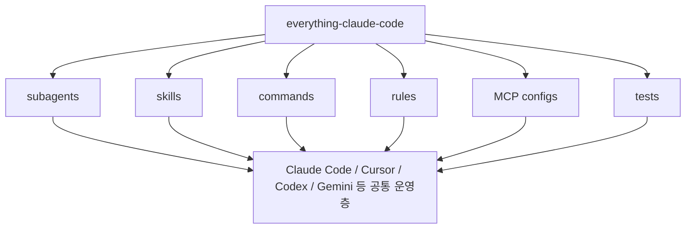
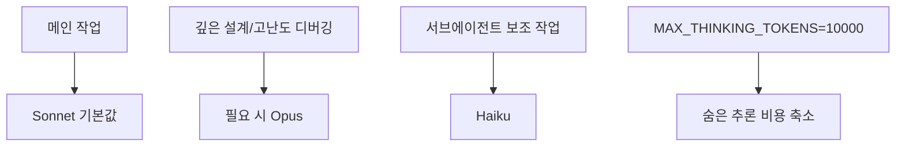
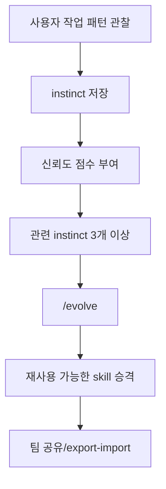

Claude Code를 오래 붙잡고 있다 보면 에러가 난 것도 아닌데 갑자기 품질이 흐려지는 순간이 있습니다. 같은 실수를 반복하고, 분명히 말한 규칙을 잊고, 굳이 안 건드려도 되는 파일까지 만지는 식입니다. 이 영상은 그 현상을 단순한 기분 문제가 아니라 **`context rot` 라는 구조적 문제** 로 설명합니다. 그리고 그 해법으로 `everything-claude-code` 저장소의 설정, 특히 `settings.json` 세 줄과 메모리 학습 시스템을 소개합니다. [0:01](https://youtu.be/4rN-UWKSmp0?t=1) [1:51](https://youtu.be/4rN-UWKSmp0?t=111)
<!--more-->

영상의 좋은 점은 “좋은 프롬프트를 써라” 같은 추상론에 머물지 않는다는 데 있습니다. 왜 Claude Code가 점점 둔해지는지, 왜 토큰 비용이 의외로 빨리 부풀어 오르는지, 그리고 이 문제를 settings·skills·memory·security 레이어에서 어떻게 나눠 다룰지 짧은 시간 안에 구조적으로 보여 줍니다. [0:44](https://youtu.be/4rN-UWKSmp0?t=44) [4:37](https://youtu.be/4rN-UWKSmp0?t=277)

## Sources

- https://youtu.be/4rN-UWKSmp0?si=bPdbFRtAjXbUTCLf

## 1. `context rot` 는 왜 생기나

발표자는 `context rot` 를 “컨텍스트가 썩는 현상”이라고 설명합니다. 오랫동안 한 세션에서 계속 작업시키면, 모델이 갑자기 멍청해진 것처럼 보이지만 사실은 네 가지 구조적 이유가 겹친다는 것입니다. 첫째는 attention dilution, 즉 문맥이 길어질수록 중간 정보 회수가 어려워지는 문제이고, 둘째는 누적된 지시가 서로 충돌하는 문제, 셋째는 부풀어 오른 시작 컨텍스트가 실제 작업 토큰을 잠식하는 문제, 넷째는 관련 없는 파일까지 매번 로드되며 관련성 미스매치가 생기는 문제입니다. [1:51](https://youtu.be/4rN-UWKSmp0?t=111) [2:15](https://youtu.be/4rN-UWKSmp0?t=135) [2:36](https://youtu.be/4rN-UWKSmp0?t=156)

영상은 이것을 “큰 연료탱크를 가진 자동차인데 출발할 때부터 트렁크에 짐을 한가득 싣고 달리는 상태”에 비유합니다. 운전은 되지만 연비와 핸들 감각이 동시에 나빠진다는 것입니다. 그래서 Claude Code 최적화의 핵심은 무조건 더 큰 컨텍스트를 쓰는 것이 아니라, **시작 시점에 무엇을 실을지 줄이는 일** 에 가깝습니다. [2:44](https://youtu.be/4rN-UWKSmp0?t=164) [3:09](https://youtu.be/4rN-UWKSmp0?t=189)

## 2. `everything-claude-code` 는 단순 설정 모음이 아니다

영상이 소개하는 `everything-claude-code` 는 그냥 팁 저장소가 아닙니다. 발표자 설명에 따르면 전문 영역별 서브에이전트, 필요할 때만 로드되는 skills, 다수의 slash commands, rules, MCP 서버 설정, 그리고 1,000개가 넘는 자동화 테스트까지 묶인 일종의 Claude Code 운영체제에 가깝습니다. 더 흥미로운 점은 이 구조가 Claude Code 전용이 아니라 Cursor, Codex, OpenCode, Gemini 같은 다른 툴에서도 공통 설정층처럼 동작하도록 설계되어 있다는 점입니다. [3:43](https://youtu.be/4rN-UWKSmp0?t=223) [4:18](https://youtu.be/4rN-UWKSmp0?t=258)

즉 이 저장소의 핵심은 “좋은 프롬프트 모음”이 아니라, 에이전트가 어떤 규칙을 읽고, 어떤 skill을 필요할 때만 로드하며, 어떤 MCP를 어느 수준에서 붙일지까지 포함하는 **작업 운영 규칙의 패키지화** 라고 볼 수 있습니다. 이 점 때문에 14만 명이 넘는 사람이 즐겨찾기한 이유도 단순 인기보다는 재사용 가능한 운영 체계에 가깝습니다. [0:16](https://youtu.be/4rN-UWKSmp0?t=16) [3:43](https://youtu.be/4rN-UWKSmp0?t=223)

## 3. 비용 80% 절감의 출발점은 `settings.json` 세 줄이다

영상에서 가장 실용적인 팁은 홈 디렉터리의 `~/.claude/settings.json` 에 넣는 세 가지 설정입니다. 첫째는 기본 모델을 Opus 대신 Sonnet으로 두는 것, 둘째는 `MAX_THINKING_TOKENS` 를 10,000으로 낮추는 것, 셋째는 서브에이전트 모델을 Haiku로 지정하는 것입니다. 발표자는 이 조합이 누적으로 80% 이상 비용 절감을 만들 수 있다고 설명합니다. [4:37](https://youtu.be/4rN-UWKSmp0?t=277) [5:06](https://youtu.be/4rN-UWKSmp0?t=306) [5:26](https://youtu.be/4rN-UWKSmp0?t=326)

여기서 중요한 건 단순히 “싼 모델을 써라”가 아니라 역할 분리를 한다는 점입니다. 코딩 작업의 대부분은 Sonnet으로 충분하고, 깊은 아키텍처 고민이나 어려운 디버깅만 잠깐 Opus로 올리며, 보조 역할을 수행하는 서브에이전트는 Haiku로 보내는 식입니다. 즉 메인 추론과 보조 노동을 같은 가격으로 처리하지 말라는 뜻입니다. [4:47](https://youtu.be/4rN-UWKSmp0?t=287) [5:41](https://youtu.be/4rN-UWKSmp0?t=341)

## 4. `/clear` 와 `/compact` 는 같은 다이어트가 아니다

영상은 토큰 절약을 설정 파일 수정으로 끝내지 않습니다. 손가락 습관도 바뀌어야 한다고 말하면서 `/clear` 와 `/compact` 의 차이를 분명하게 구분합니다. `/clear` 는 완전히 다른 작업으로 넘어갈 때 컨텍스트를 통째로 비우는 용도이고, `/compact` 는 리서치가 끝나고 구현으로 넘어가거나 디버깅이 끝나고 다음 기능으로 넘어가는 식의 **마일스톤 사이 전환점** 에서 쓰는 압축 도구입니다. [5:57](https://youtu.be/4rN-UWKSmp0?t=357) [6:18](https://youtu.be/4rN-UWKSmp0?t=378)

발표자는 구현 중간에 compact를 남발하면 변수명, 파일 경로, 부분 상태 같은 중요한 문맥을 잃기 쉽다고 경고합니다. 즉 compact는 메모리 보존이 아니라 기억 재구성에 가깝기 때문에, 쓰는 타이밍이 중요합니다. 이 설명은 많은 사용자가 `/compact` 를 “아무 때나 줄이기 버튼”처럼 쓰는 문제를 잘 짚습니다. [6:27](https://youtu.be/4rN-UWKSmp0?t=387)

## 5. MCP는 많이 붙을수록 강해지는 게 아니라 기본세가 올라간다

영상은 MCP를 많이 켜 두면 20만 토큰짜리 컨텍스트 윈도우가 사실상 7만 수준까지 줄 수 있다고 말합니다. 이유는 각 MCP가 도구 설명과 정의를 토큰으로 가져오기 때문입니다. 그래서 프로젝트당 MCP는 10개 이하, 활성 도구는 80개 이하로 유지하라고 권합니다. 이건 MCP를 부정하는 이야기가 아니라, **컨텍스트 기본세를 관리하는 관점** 으로 읽는 편이 맞습니다. [6:41](https://youtu.be/4rN-UWKSmp0?t=401) [6:57](https://youtu.be/4rN-UWKSmp0?t=417)

이 포인트는 앞서 본 context rot와도 정확히 맞물립니다. 상관없는 파일이 너무 많이 로드되면 모델이 멍해지는 것처럼, 상관없는 도구 정의가 지나치게 많아도 정작 중요한 작업 토큰이 줄어듭니다. 결국 파일·규칙·도구 모두에서 “지금 필요한 것만 실어라”는 원칙이 반복됩니다. [2:15](https://youtu.be/4rN-UWKSmp0?t=135) [6:41](https://youtu.be/4rN-UWKSmp0?t=401)

## 6. 진짜 핵심은 `Continuous Learning v2` 라는 메모리 학습 시스템이다

발표자는 사람들이 이 저장소를 저장해 두는 진짜 이유가 따로 있다고 말합니다. 바로 `Continuous Learning v2` 입니다. 설명에 따르면 이 시스템은 Claude Code가 도구를 호출하기 직전과 직후에 작동하는 hooks를 이용해 사용자의 작업 패턴을 관찰하고, 반복되는 행동을 `instinct` 라는 단위로 저장합니다. 예를 들어 폴더 구조를 짜는 습관이나 에러 처리 스타일 같은 것이 여기에 해당합니다. [7:03](https://youtu.be/4rN-UWKSmp0?t=423) [7:20](https://youtu.be/4rN-UWKSmp0?t=440)

더 흥미로운 부분은 승격 규칙입니다. 관련된 instinct가 세 개 이상 모이면 `/evolve` 명령으로 재사용 가능한 skill로 승격된다고 설명합니다. 즉 일회성 행동 기록이 아니라, **반복된 습관을 실행 가능한 모듈로 굳히는 구조** 입니다. 나아가 export/import로 팀원 간 공유도 가능하다고 하니, 개인 생산성 도구를 넘어 팀의 작업 스타일을 누적하는 장치로 볼 수도 있습니다. [7:33](https://youtu.be/4rN-UWKSmp0?t=453) [7:45](https://youtu.be/4rN-UWKSmp0?t=465)

## 7. AgentShield는 Claude Code 설정 자체를 점검하는 보안 스캐너다

후반부의 보너스처럼 보이지만, 실제로는 꽤 중요한 부분이 AgentShield입니다. 발표자는 같은 제작자가 만든 보안 스캐너로, `CLAUDE.md`, `settings.json`, MCP 설정, hooks, 에이전트 정의 등 Claude Code 설정 전반을 다섯 가지 범주로 스캔한다고 설명합니다. 시크릿 노출, 과도한 권한, hook injection 취약점, 위험한 MCP 서버까지 점검 대상에 들어갑니다. [8:10](https://youtu.be/4rN-UWKSmp0?t=490) [8:20](https://youtu.be/4rN-UWKSmp0?t=500)

특히 `--opus` 플래그를 붙이면 여러 에이전트가 레드팀·블루팀·오디터처럼 분리되어 적대적으로 검증한다고 합니다. 이건 단순 린터가 아니라 에이전트 설정 자체를 공격·방어 시나리오로 읽는다는 뜻이라, 앞으로 AI 도구 설정이 보안 표면이 되는 시대를 미리 보여 주는 사례로 볼 수 있습니다. [8:36](https://youtu.be/4rN-UWKSmp0?t=516) [8:59](https://youtu.be/4rN-UWKSmp0?t=539)

## 실전 적용 포인트

- 오늘 바로 할 수 있는 최소 조치는 `settings.json` 의 3줄 수정입니다. [9:11](https://youtu.be/4rN-UWKSmp0?t=551)
- 플러그인과 rules를 한꺼번에 다 깔지 말고, core skill부터 시작하는 편이 낫습니다. [9:24](https://youtu.be/4rN-UWKSmp0?t=564) [9:41](https://youtu.be/4rN-UWKSmp0?t=581)
- `/clear` 는 작업 전환용, `/compact` 는 마일스톤 전환용으로 역할을 분리해야 합니다. [5:57](https://youtu.be/4rN-UWKSmp0?t=357)
- MCP는 연결 수보다 “기본적으로 얼마를 먹고 들어가느냐”의 관점으로 줄여야 합니다. [6:41](https://youtu.be/4rN-UWKSmp0?t=401)
- 장기적으로는 memory 학습 시스템이 가장 큰 차이를 만들 수 있습니다. [7:03](https://youtu.be/4rN-UWKSmp0?t=423)

## 핵심 요약

이 영상의 핵심은 Claude Code가 멍청해지는 이유를 사용자 탓이 아니라 `context rot` 라는 구조 문제로 설명하고, 그 대응을 네 층으로 나눠 제시한다는 데 있습니다. 설정층에서는 `settings.json` 3줄, 운영층에서는 `/clear` 와 `/compact`, 확장층에서는 MCP 절제, 학습층에서는 Continuous Learning, 보안층에서는 AgentShield가 각각 역할을 맡습니다. [1:51](https://youtu.be/4rN-UWKSmp0?t=111) [4:37](https://youtu.be/4rN-UWKSmp0?t=277) [8:10](https://youtu.be/4rN-UWKSmp0?t=490)

그래서 `everything-claude-code` 는 한두 개의 팁보다, Claude Code를 장기적으로 굴릴 때 필요한 운영 체계를 패키지화한 시도에 가깝습니다. 단기 효과만 보면 settings.json 3줄이 가장 눈에 띄지만, 장기적으로는 memory와 security 레이어까지 포함한 전체 구조가 더 중요해 보입니다. [0:44](https://youtu.be/4rN-UWKSmp0?t=44) [7:03](https://youtu.be/4rN-UWKSmp0?t=423)

## 결론

이 영상을 한 줄로 요약하면 이렇습니다. Claude Code가 점점 둔해지는 건 “내가 프롬프트를 못 써서”가 아니라, 너무 많은 문맥과 규칙과 도구를 싣고 달리기 때문입니다. 그래서 해결도 더 좋은 주문이 아니라, 어떤 설정을 기본값으로 둘지, 언제 비우고 언제 압축할지, 무엇을 학습으로 남기고 무엇을 보안 점검할지 정하는 운영 설계에서 시작합니다. [9:59](https://youtu.be/4rN-UWKSmp0?t=599) [10:12](https://youtu.be/4rN-UWKSmp0?t=612)
