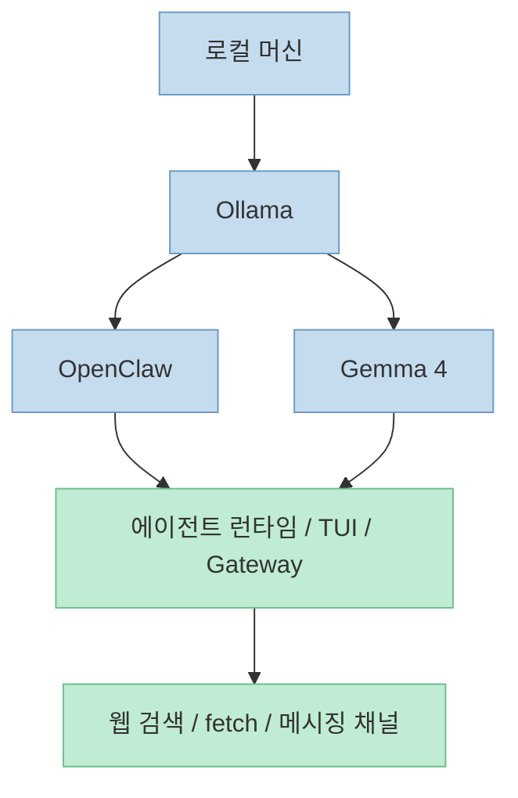
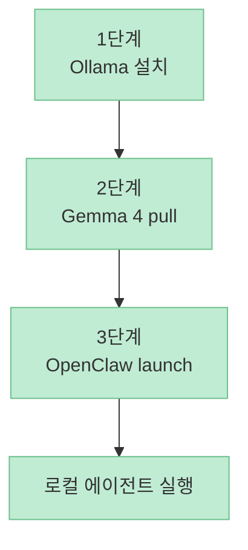
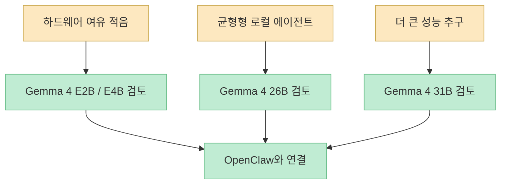

Google Gemma 계정의 이 X 포스트는 메시지가 아주 단순합니다. **Gemma 4를 OpenClaw와 로컬에서 3단계로 붙일 수 있다** 는 것입니다. 포스트가 제시한 단계는 Ollama 설치, Gemma 4 모델 다운로드, 그리고 OpenClaw를 Ollama 백엔드로 실행하는 흐름입니다. 짧은 포스트지만, 로컬 에이전트 스택을 구성하려는 사람에게는 꽤 중요한 신호입니다. Gemma 4를 “그냥 로컬 LLM” 으로 쓰는 데서 끝나지 않고, OpenClaw 같은 에이전트 런타임에 연결해 실제 작업 흐름으로 올리는 이야기이기 때문입니다. (출처: [X 포스트](https://x.com/i/status/2041512106269319328))

다만 X 포스트 자체는 요약본에 가깝기 때문에, 이 글에서는 그 3단계 흐름을 Ollama의 OpenClaw 통합 문서와 Google의 Gemma+Ollama 공식 문서로 교차 확인해 보겠습니다. 즉 출발점은 소셜 포스트지만, 실제로 따라 할 수 있는 수준의 구조는 공식 문서 기준으로 다시 정리합니다. (출처: [X 포스트](https://x.com/i/status/2041512106269319328), [Ollama OpenClaw 문서](https://docs.ollama.com/integrations/openclaw), [Google Gemma + Ollama 문서](https://ai.google.dev/gemma/docs/integrations/ollama))

<!--more-->

## Sources

- [Google Gemma on X](https://x.com/i/status/2041512106269319328)
- [OpenClaw - Ollama](https://docs.ollama.com/integrations/openclaw)
- [Run Gemma with Ollama - Google AI for Developers](https://ai.google.dev/gemma/docs/integrations/ollama)

## 1. 이 조합이 흥미로운 이유: Gemma 4를 “로컬 에이전트용 두뇌” 로 쓰는 흐름

Google이 소개한 Gemma 4의 포지션은 꽤 분명합니다. 최근 공개된 Gemma 4는 로컬 실행과 오프라인 코드 생성, 에이전트 워크플로에 어울리는 기능을 강조하며, Ollama를 포함한 여러 도구를 day-one 생태계로 지원합니다. Google 공식 블로그는 Gemma 4가 function calling, structured JSON output, system instructions 같은 요소를 통해 agentic workflow 구축에 적합하다고 설명합니다. 즉 Gemma 4는 “가벼운 로컬 모델” 을 넘어서, **도구 호출형 에이전트의 로컬 백엔드 후보** 로도 읽힙니다. (출처: [Google Gemma 4 블로그](https://blog.google/innovation-and-ai/technology/developers-tools/gemma-4/))

OpenClaw 쪽 문서도 같은 방향을 보여 줍니다. Ollama 문서에서 OpenClaw는 개인용 AI assistant이자 여러 메시징 채널과 AI coding agent를 연결하는 gateway로 설명되며, `ollama launch openclaw` 로 바로 실행할 수 있는 통합 경로를 제공합니다. 즉 이 스택의 의미는 “Gemma 4를 로컬에 올렸다” 가 아니라, **Gemma 4를 OpenClaw의 실제 대화형 에이전트 런타임 뒤쪽 두뇌로 붙였다** 는 데 있습니다. (출처: [OpenClaw - Ollama](https://docs.ollama.com/integrations/openclaw))

## 2. X 포스트 기준 3단계: Ollama 설치 → Gemma 4 다운로드 → OpenClaw 실행

X 포스트가 제시한 3단계는 매우 직선적입니다. 첫째, Ollama를 설치합니다. 둘째, Gemma 4 26B A4B 모델을 로컬 머신에 내려받습니다. 셋째, OpenClaw를 Gemma 4를 백엔드로 삼아 Ollama를 통해 실행합니다. 포스트는 이 흐름이 몇 분 안에 끝나고, 세 번째 단계가 OpenClaw 설치와 실행까지 자동 처리해 준다고 설명합니다. (출처: [X 포스트](https://x.com/i/status/2041512106269319328))

Google의 Gemma+Ollama 공식 문서는 첫 두 단계를 뒷받침합니다. Ollama를 먼저 설치하고, 이후 `ollama pull gemma4` 로 기본 Gemma 4 변형을 다운로드할 수 있으며, 태그 단위로는 `gemma4:e2b`, `gemma4:e4b`, `gemma4:26b`, `gemma4:31b` 같은 모델 크기를 선택할 수 있다고 설명합니다. 따라서 X 포스트의 “Gemma 4 26B A4B” 라는 선택은, 공식 Ollama/Gemma 문서가 제시하는 26B 계열 태그와 자연스럽게 연결됩니다. (출처: [Run Gemma with Ollama](https://ai.google.dev/gemma/docs/integrations/ollama))

세 번째 단계는 Ollama의 OpenClaw 통합 문서가 보강합니다. 공식 문서는 `ollama launch openclaw` 를 기본 빠른 시작 명령으로 제시하고, 특정 모델을 바로 지정하고 싶다면 `ollama launch openclaw --model <model>` 형식을 쓸 수 있다고 설명합니다. 따라서 X 포스트의 3단계는 실질적으로 **Ollama에 Gemma 4를 준비한 뒤, OpenClaw를 Ollama 통합 런처로 띄우는 경로** 로 이해하면 됩니다. 여기서 `--model gemma4:26b` 같은 형태는 공식 문서 구조에 근거한 자연스러운 적용입니다. (출처: [OpenClaw - Ollama](https://docs.ollama.com/integrations/openclaw), [Run Gemma with Ollama](https://ai.google.dev/gemma/docs/integrations/ollama))

## 3. 실제로 OpenClaw는 무엇을 자동으로 해 주나

Ollama 문서에 따르면 `ollama launch openclaw` 는 단순 실행 커맨드가 아닙니다. 설치되지 않았다면 npm 기반 설치를 유도하고, 첫 실행에서는 도구 접근에 대한 보안 경고를 보여 주며, 모델 선택 UI를 제공하고, provider 구성과 gateway daemon 설치, primary model 설정, web search/fetch plugin 설치까지 자동으로 처리합니다. 즉 X 포스트가 “3단계면 된다” 고 말할 수 있는 이유는 이 마지막 단계가 실제로 여러 하위 작업을 감싸고 있기 때문입니다. (출처: [OpenClaw - Ollama](https://docs.ollama.com/integrations/openclaw))

여기서 중요하게 봐야 할 부분은 OpenClaw가 단순히 로컬 채팅 인터페이스가 아니라는 점입니다. 문서는 web search와 fetch plugin이 기본 활성화되며, local model을 쓸 때도 웹 검색과 읽기 능력을 붙일 수 있다고 설명합니다. 즉 Gemma 4를 OpenClaw와 연결한다는 것은 단순 질의응답이 아니라, **도구 사용과 웹 접근이 가능한 로컬 에이전트 컨테이너** 안에 모델을 넣는다는 뜻입니다. (출처: [OpenClaw - Ollama](https://docs.ollama.com/integrations/openclaw))

## 4. 모델 선택에서 봐야 할 것: 26B만 정답은 아니다

X 포스트는 26B A4B를 “capable and fast” 한 선택지로 제시합니다. 다만 이 평가는 포스트 작성자의 선택 제안이므로 그대로 절대화할 필요는 없습니다. Google 공식 문서는 Gemma 4 라인업을 `e2b`, `e4b`, `26b`, `31b` 로 설명하고, 각기 다른 하드웨어 상황에 맞게 사용할 수 있게 설계했다고 밝힙니다. 즉 실제 선택은 “무조건 26B” 가 아니라, **내 로컬 머신의 RAM/VRAM, 속도 기대치, 에이전트 작업 복잡도** 에 따라 달라집니다. (출처: [X 포스트](https://x.com/i/status/2041512106269319328), [Run Gemma with Ollama](https://ai.google.dev/gemma/docs/integrations/ollama), [Gemma 4 블로그](https://blog.google/innovation-and-ai/technology/developers-tools/gemma-4/))

또 하나 중요한 점은 OpenClaw 문서가 local model 사용 시 **최소 64K context window 권장** 을 명시하고 있다는 것입니다. 즉 “로컬에서 돈 안 들고 돌린다” 는 장점만 보고 들어가기보다, 실제 에이전트 런타임에서는 모델의 컨텍스트 길이와 추론 지속성도 중요하게 봐야 합니다. Gemma 4는 Google 공식 블로그에서 최대 256K 컨텍스트까지 제공하는 계열이 있다고 설명되므로, 로컬 에이전트 용도에서는 단순 파라미터 수보다도 **내가 고르는 변형이 충분한 컨텍스트를 제공하느냐** 가 더 중요할 수 있습니다. (출처: [OpenClaw - Ollama](https://docs.ollama.com/integrations/openclaw), [Gemma 4 블로그](https://blog.google/innovation-and-ai/technology/developers-tools/gemma-4/))

## 5. 실전 적용 포인트

첫째, 로컬 LLM 설치와 로컬 에이전트 런타임 연결은 다른 단계입니다. `ollama pull gemma4` 로 모델을 받아도 끝이 아니라, 실제 작업 도구 체계와 붙이려면 OpenClaw 같은 런타임이 필요합니다. 이번 X 포스트의 의미는 바로 이 두 단계를 짧게 연결해 보여 줬다는 데 있습니다. (출처: [X 포스트](https://x.com/i/status/2041512106269319328), [Run Gemma with Ollama](https://ai.google.dev/gemma/docs/integrations/ollama))

둘째, `ollama launch openclaw` 같은 통합 런처는 생각보다 가치가 큽니다. 설치, 보안 안내, 모델 선택, gateway 구성, search/fetch plugin 설치까지 한 흐름으로 묶기 때문에 로컬 에이전트 셋업의 진입 장벽을 크게 줄여 줍니다. (출처: [OpenClaw - Ollama](https://docs.ollama.com/integrations/openclaw))

셋째, Gemma 4는 Google 공식 설명상 로컬 코드 생성과 agentic workflow에 적합한 특성을 강조합니다. 따라서 단순 챗봇보다 **도구를 호출하고 워크플로를 굴리는 로컬 에이전트 실험** 에 더 잘 맞는 후보로 볼 수 있습니다. (출처: [Gemma 4 블로그](https://blog.google/innovation-and-ai/technology/developers-tools/gemma-4/))

넷째, 26B 선택은 유력하지만 절대값은 아닙니다. 로컬 메모리 한계, 속도, 컨텍스트 길이, 원하는 작업 강도에 따라 E 계열 또는 31B 계열이 더 맞을 수 있습니다. (출처: [X 포스트](https://x.com/i/status/2041512106269319328), [Run Gemma with Ollama](https://ai.google.dev/gemma/docs/integrations/ollama))

## 핵심 요약

- X 포스트가 제시한 핵심은 `Ollama 설치 → Gemma 4 다운로드 → OpenClaw 실행` 의 3단계 로컬 에이전트 셋업이다. (출처: [X 포스트](https://x.com/i/status/2041512106269319328))
- Google 공식 문서는 `ollama pull gemma4` 와 `gemma4:e2b / e4b / 26b / 31b` 태그 체계를 확인해 준다. (출처: [Run Gemma with Ollama](https://ai.google.dev/gemma/docs/integrations/ollama))
- Ollama의 OpenClaw 문서는 `ollama launch openclaw` 가 설치·설정·plugin 구성까지 자동화하는 통합 경로임을 보여 준다. (출처: [OpenClaw - Ollama](https://docs.ollama.com/integrations/openclaw))
- Gemma 4는 공식 설명상 로컬 코드 생성과 agentic workflow에 적합한 모델 계열로 포지셔닝된다. (출처: [Gemma 4 블로그](https://blog.google/innovation-and-ai/technology/developers-tools/gemma-4/))

## 결론

이 X 포스트의 진짜 가치는 “Gemma 4도 로컬에서 돌아간다” 는 선언보다, **Gemma 4를 OpenClaw 같은 실제 에이전트 런타임에 올리는 경로를 3단계로 압축해 보여 줬다** 는 데 있습니다. 로컬 모델 실험이 흩어진 챗봇 테스트에서 끝나지 않고, 도구 사용이 가능한 개인용 에이전트 스택으로 이어질 수 있다는 점에서 꽤 상징적인 조합입니다. (출처: [X 포스트](https://x.com/i/status/2041512106269319328), [OpenClaw - Ollama](https://docs.ollama.com/integrations/openclaw))
