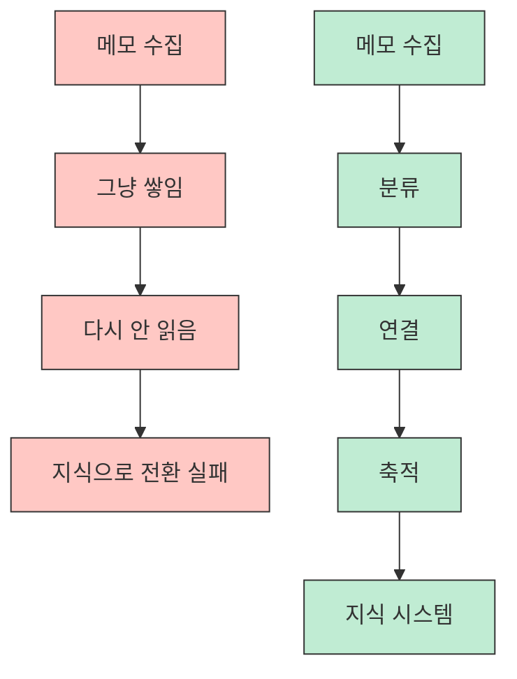
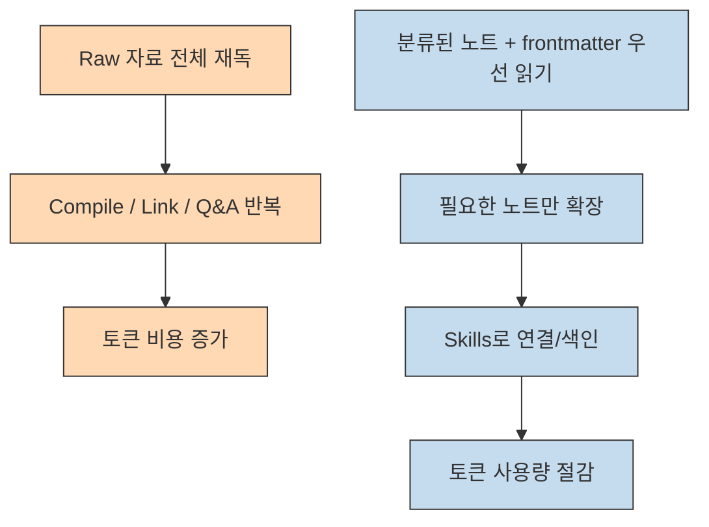
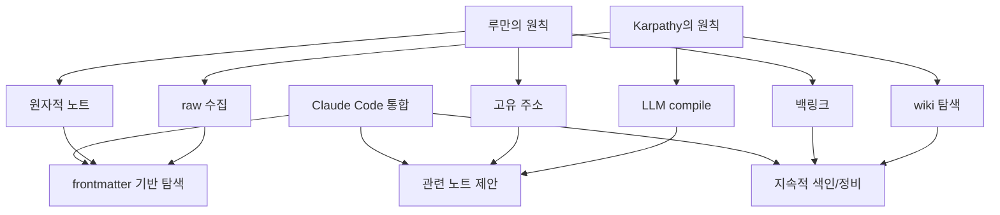
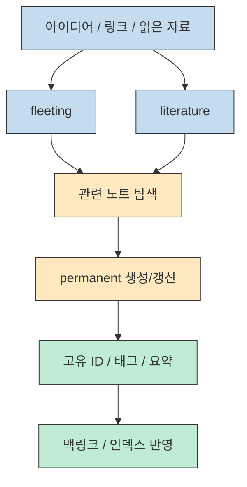

메모 앱을 오래 쓴 사람일수록 비슷한 허무를 압니다. 기록은 계속 쌓이는데, 그 기록이 다시 돌아와 생각을 밀어 올리는 지식으로 바뀌는 순간은 드뭅니다. 이 영상이 던지는 문제의식도 여기서 시작합니다. **수집은 쉬운데 연결과 축적이 안 된다** 는 것입니다. 발표자는 이 문제를 Andrej Karpathy의 `LLM Wiki` 아이디어와 Niklas Luhmann의 제텔카스텐을 겹쳐 보면서, Claude Code의 `skills` 를 이용해 스스로 정리되고 연결되는 지식 시스템으로 바꾸려 합니다. [0:00](https://youtu.be/5JpnmbE039E?t=0) [0:30](https://youtu.be/5JpnmbE039E?t=30) [1:00](https://youtu.be/5JpnmbE039E?t=60)
<!--more-->

핵심은 거창한 벡터 DB나 복잡한 RAG 파이프라인보다 먼저, 메모를 `fleeting`, `literature`, `permanent` 같은 성격별 노트로 나누고, Claude Code가 그 사이를 연결·정리·색인하는 운영 규칙을 갖게 만드는 데 있습니다. 영상은 Karpathy식 `raw → compile → wiki → Obsidian` 흐름을 그대로 따라가기보다, 토큰 비용과 실제 사용성 문제를 고려해 **기존 제텔카스텐 구조 위에 Claude Code skills를 얹는 방식** 으로 풀어 갑니다. [3:00](https://youtu.be/5JpnmbE039E?t=180) [4:20](https://youtu.be/5JpnmbE039E?t=260) [22:00](https://youtu.be/5JpnmbE039E?t=1320)

## Sources

- https://youtu.be/5JpnmbE039E?si=WnSQnr39C3lYHt30

## 1. 왜 메모는 쌓이는데 지식은 잘 안 되는가

영상 초반의 문제 제기는 단순합니다. 사람들은 회의 메모, 링크, 아이디어, 읽은 글 요약을 꾸준히 남기지만, 나중에 다시 꺼내 보지 않습니다. 메모는 저장되지만 재사용되지 않고, 재사용되지 않으면 연결도 일어나지 않습니다. 발표자는 루만의 제텔카스텐을 예로 들며, 지식 시스템의 핵심은 단순 저장이 아니라 `수집 → 분류 → 연결 → 축적` 의 반복이라고 설명합니다. 즉 많이 적는 것보다 서로 닿게 만드는 구조가 먼저입니다. [0:30](https://youtu.be/5JpnmbE039E?t=30) [1:20](https://youtu.be/5JpnmbE039E?t=80) [2:00](https://youtu.be/5JpnmbE039E?t=120)

이 지점에서 Karpathy의 아이디어가 자연스럽게 들어옵니다. 원문 자료를 `raw` 폴더에 모으고, LLM이 그것을 읽어 wiki로 컴파일하고, 사용자는 완성된 결과를 Obsidian에서 읽는 흐름입니다. 발표자는 이 구조가 메모를 단순 저장물이 아니라 **계속 다시 읽히고 다시 조직되는 중간 산출물** 로 바꿔 준다는 점에 주목합니다. [2:00](https://youtu.be/5JpnmbE039E?t=120) [3:00](https://youtu.be/5JpnmbE039E?t=180)

## 2. 카파시식 `raw → compile → Obsidian` 는 왜 그대로 쓰기 어렵나

영상은 Karpathy의 구상을 높이 평가하면서도, 일반 사용자가 그대로 따라 하기엔 비용 문제가 있다고 짚습니다. `compile`, `read`, `link`, `lint`, `Q&A` 같은 단계가 계속 돌면 결국 코퍼스를 반복해서 읽게 되고, 이것이 곧 토큰 폭탄이 된다는 것입니다. 발표자는 “우리만의 솔루션이 필요하다”고 말하며, Claude를 쓰는 현실적인 사용자는 컨텍스트와 토큰 예산을 무시할 수 없다고 설명합니다. [3:30](https://youtu.be/5JpnmbE039E?t=210) [4:20](https://youtu.be/5JpnmbE039E?t=260) [5:30](https://youtu.be/5JpnmbE039E?t=330)

그래서 영상은 Karpathy 모델을 그대로 복제하지 않고, **이미 존재하는 제텔카스텐 운영 체계에 필요한 동작만 skill로 떼어 넣는 방식** 으로 방향을 꺾습니다. 예를 들어 처리된 원문은 archive로 밀어 두고, 항상 전체 본문을 읽는 대신 frontmatter만 먼저 읽으며, 링크와 원문 문맥은 유지하되 매번 전체 vault를 전부 재주사하지 않게 설계하자는 식입니다. 이건 “RAG를 완전히 버린다”라기보다, 지식 정리 과정의 비용을 줄이기 위한 운영 최적화에 가깝습니다. [6:00](https://youtu.be/5JpnmbE039E?t=360) [7:00](https://youtu.be/5JpnmbE039E?t=420)

## 3. 루만의 제텔카스텐이 여기서 다시 중요해지는 이유

발표자가 Karpathy의 위키와 함께 루만을 끌어오는 이유는 분명합니다. 제텔카스텐은 이미 오래전에 `원자성`, `고유 주소`, `백링크`, `점진적 확장` 이라는 원칙을 갖고 있었기 때문입니다. 영상은 이 원칙을 현대 LLM 워크플로에 다시 옮겨 오면서, raw 자료를 요약해서 끝내는 것이 아니라 **생각 단위의 노트가 다른 생각 단위에 연결되는 구조** 를 만들려 합니다. [4:20](https://youtu.be/5JpnmbE039E?t=260) [5:30](https://youtu.be/5JpnmbE039E?t=330)

중요한 건 노트를 예쁘게 만드는 것이 아니라, 새 노트가 기존 체계 어디에 붙어야 하는지를 AI가 제안할 수 있게 만드는 것입니다. 그래서 영상에서는 frontmatter에 짧은 요약과 연결 힌트를 두고, Claude Code가 새 노트를 넣을 위치와 관련 노트를 제안하게 만듭니다. 이 설계는 단순 검색보다 “어디에 연결해야 하는가”를 더 중요하게 본다는 점에서 제텔카스텐적입니다. [16:40](https://youtu.be/5JpnmbE039E?t=1000) [18:00](https://youtu.be/5JpnmbE039E?t=1080) [19:30](https://youtu.be/5JpnmbE039E?t=1170)

## 4. 구현의 중심은 `.claude/skills/` 에 들어가는 작은 운영 규칙들이다

영상에서 가장 실무적인 포인트는 Claude Code의 skills를 지식 시스템의 제어면으로 쓴다는 점입니다. 발표자는 skill을 “이 상황에서는 이렇게 행동하라”는 재사용 가능한 markdown 규칙으로 설명합니다. 즉 모델 자체를 바꾸는 것이 아니라, 특정 상황에서 어떤 폴더를 읽고 어떤 형식으로 출력하고 어떤 기준으로 링크할지 행동을 고정하는 것입니다. [5:30](https://youtu.be/5JpnmbE039E?t=330) [7:00](https://youtu.be/5JpnmbE039E?t=420)

이 접근이 좋은 이유는 지식 관리 작업을 거대한 하나의 프롬프트로 뭉개지 않기 때문입니다. 영상 중반부에는 batch skill, debug skill, self-healing loop 같은 아이디어도 나오는데, 이는 결국 “새 노트 분류”, “링크 복구”, “색인 정리”, “정기 점검” 같은 일을 작은 작업 단위로 쪼개 돌리자는 뜻입니다. 사용자는 아이디어를 던지고, 시스템은 자는 동안 분류·연결·색인을 계속 수행하는 그림입니다. [8:40](https://youtu.be/5JpnmbE039E?t=520) [10:00](https://youtu.be/5JpnmbE039E?t=600) [12:00](https://youtu.be/5JpnmbE039E?t=720)

## 5. `fleeting / literature / permanent` 3계층은 입력 경로를 안정시킨다

실습 파트에서는 Obsidian vault 안에서 Claude Code를 실행하고, 이미 만들어 둔 skill 세트를 보여 줍니다. 여기서 핵심 분류는 세 가지입니다. `fleeting` 은 순간적인 아이디어나 인박스, `literature` 는 책·영상·논문 같은 소스 기반 노트, `permanent` 는 연구 노트이자 장기적으로 남는 연결 노트입니다. 이 구분이 중요한 이유는, 모든 메모를 같은 깊이로 다루지 않게 만들기 때문입니다. [15:30](https://youtu.be/5JpnmbE039E?t=930) [16:40](https://youtu.be/5JpnmbE039E?t=1000)

발표자는 새 노트를 넣을 때 Claude가 관련 기존 노트를 먼저 제안하게 하고, 사용자가 위치를 고르면 Claude가 고유 ID를 붙이고 제목·태그·요약을 채운 구조화된 노트를 생성하게 합니다. 이것은 단순 자동 요약이 아니라 **새 입력을 기존 지식 그래프 안에 삽입하는 절차** 입니다. 결국 진짜 가치가 생기는 곳은 “좋은 요약”이 아니라 “좋은 삽입 위치”입니다. [18:00](https://youtu.be/5JpnmbE039E?t=1080) [19:30](https://youtu.be/5JpnmbE039E?t=1170)

## 6. Karpathy의 ingest/query/lint를 그대로 복제하지 말고 현재 체계에 겹쳐야 한다

후반부에서 발표자는 Karpathy의 개념을 Claude에게 직접 보여 주고, 현재 제텔카스텐 워크플로와 어떻게 합칠지 물어봅니다. Claude는 `raw collection ↔ fleeting/literature`, `compile ↔ permanent`, `Obsidian ↔ front-end` 같은 대응을 제안하고, `ingest`, `query`, `lint`, `index` 같은 새 skill도 제안합니다. 하지만 발표자는 여기서 중요한 태도를 보여 줍니다. **AI가 제안했다고 해서 다 받지 않고, 기존에 이미 있는 동작은 중복 도입하지 않는다** 는 것입니다. [22:00](https://youtu.be/5JpnmbE039E?t=1320) [23:30](https://youtu.be/5JpnmbE039E?t=1410) [25:00](https://youtu.be/5JpnmbE039E?t=1500)

예를 들어 `ingest` 는 멋져 보이지만, 이미 `fleeting` 이 그 역할을 충분히 한다면 새 skill로 중복 구현할 필요가 없습니다. 반대로 `index` 나 `lint` 처럼 노트가 쌓일수록 필요성이 커지는 작업은 별도 skill로 분리할 가치가 있습니다. 이 장면은 Claude Code를 잘 쓰는 법이 곧 기능 추가가 아니라 **기존 작업 체계를 먼저 모델링하고, 부족한 곳만 모듈로 보강하는 일** 임을 잘 보여 줍니다. [25:00](https://youtu.be/5JpnmbE039E?t=1500) [27:00](https://youtu.be/5JpnmbE039E?t=1620) [29:00](https://youtu.be/5JpnmbE039E?t=1740)

## 7. 결국 병목은 토큰이므로, 지식 관리도 예산 안에서 운영해야 한다

영상 말미에서 발표자는 대략 10번 정도 상호작용했을 때 사용량이 20% 정도였다고 언급하며, 지식 관리도 그냥 공짜 작업이 아니라고 경고합니다. 특히 knowledge management는 코드 작성만큼이나 많은 읽기·정리·재작성 비용을 요구하므로, 하루 토큰 예산을 어디에 쓸지 분리해서 생각해야 한다는 점을 강조합니다. [33:00](https://youtu.be/5JpnmbE039E?t=1980) [34:30](https://youtu.be/5JpnmbE039E?t=2070)

이 말은 결국 “자가 컴파일 지식 시스템”의 핵심이 기술 스택보다 운영 규율에 있다는 뜻이기도 합니다. 모든 노트를 매번 다시 읽지 않기, frontmatter를 적극 활용하기, archive를 두어 활성 영역을 줄이기, index와 lint는 배치성 작업으로 분리하기 같은 원칙이 필요한 이유가 바로 여기에 있습니다. Claude Code는 폴더와 skill을 만들어 줄 수 있지만, **무엇을 항상 읽고 무엇을 가끔 읽을지 정하는 일** 은 사용자의 설계 몫입니다. [31:00](https://youtu.be/5JpnmbE039E?t=1860) [35:30](https://youtu.be/5JpnmbE039E?t=2130)

## 실전 적용 포인트

- Karpathy의 `LLM Wiki` 를 그대로 복제하기보다, 현재 쓰는 메모 구조에 `compile`, `index`, `lint` 같은 동작만 선택적으로 덧붙이는 편이 현실적입니다. [22:00](https://youtu.be/5JpnmbE039E?t=1320)
- 모든 입력을 같은 수준으로 처리하지 말고 `fleeting`, `literature`, `permanent` 로 깊이를 분리하면 토큰 낭비를 줄일 수 있습니다. [15:30](https://youtu.be/5JpnmbE039E?t=930)
- 새 노트의 품질보다 먼저, 그 노트를 어디에 연결할지 제안하게 만드는 것이 장기적으로 더 중요합니다. [18:00](https://youtu.be/5JpnmbE039E?t=1080)
- index와 lint는 “없어도 시작은 되지만, 쌓일수록 반드시 필요해지는” 유지보수 계층입니다. [31:00](https://youtu.be/5JpnmbE039E?t=1860)
- 지식 관리도 코딩과 같은 토큰 예산을 먹기 때문에, 운영 빈도와 읽기 범위를 명시적으로 줄여야 합니다. [33:00](https://youtu.be/5JpnmbE039E?t=1980)

## 핵심 요약

이 영상의 핵심은 Karpathy의 위키 아이디어와 루만의 제텔카스텐을 “둘 다 좋다” 수준에서 병렬 소개하는 데 있지 않습니다. 오히려 **Karpathy의 compile 사고방식은 가져오되, 루만식 주소·백링크·원자성으로 구조를 안정화하고, Claude Code skills로 실제 운영 가능한 자동화 단위로 쪼갠다** 는 데 있습니다. [3:00](https://youtu.be/5JpnmbE039E?t=180) [22:00](https://youtu.be/5JpnmbE039E?t=1320)

그래서 이 시스템의 본질은 거대한 AI 두뇌가 아닙니다. `fleeting / literature / permanent` 로 입력 깊이를 나누고, frontmatter로 빠르게 판단하며, 필요한 순간에만 확장 읽기를 하고, index/lint로 장기 건강도를 관리하는 규율입니다. 그런 의미에서 이 영상은 “RAG 없이도 된다”는 선언보다, **좋은 지식 시스템은 좋은 읽기 전략과 좋은 연결 규칙에서 나온다** 는 쪽에 더 가깝습니다. [7:00](https://youtu.be/5JpnmbE039E?t=420) [12:00](https://youtu.be/5JpnmbE039E?t=720) [34:30](https://youtu.be/5JpnmbE039E?t=2070)

## 결론

이미 Obsidian이나 메모 저장소를 오래 굴리고 있다면, 이 영상의 메시지는 명확합니다. 새 툴을 또 하나 추가하기 전에, 지금 쓰는 저장소 안에서 `입력 경로`, `연결 방식`, `정비 루프` 를 먼저 재설계하라는 것입니다. Claude Code는 그 구조를 자동으로 실행해 주는 운영자에 가깝고, Karpathy의 `LLM Wiki` 는 그 운영자가 어떤 방향으로 지식을 축적해야 하는지를 보여 주는 상위 패턴입니다. [2:00](https://youtu.be/5JpnmbE039E?t=120) [35:30](https://youtu.be/5JpnmbE039E?t=2130)
