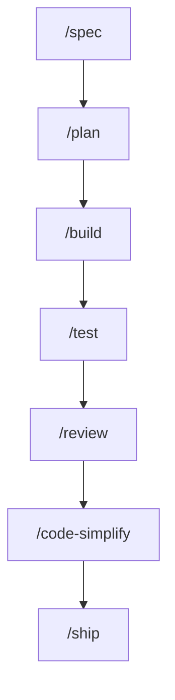
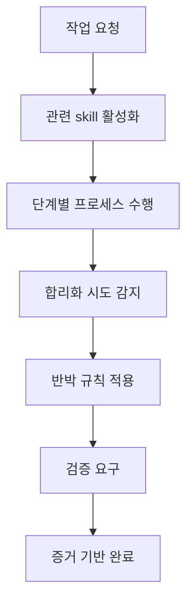
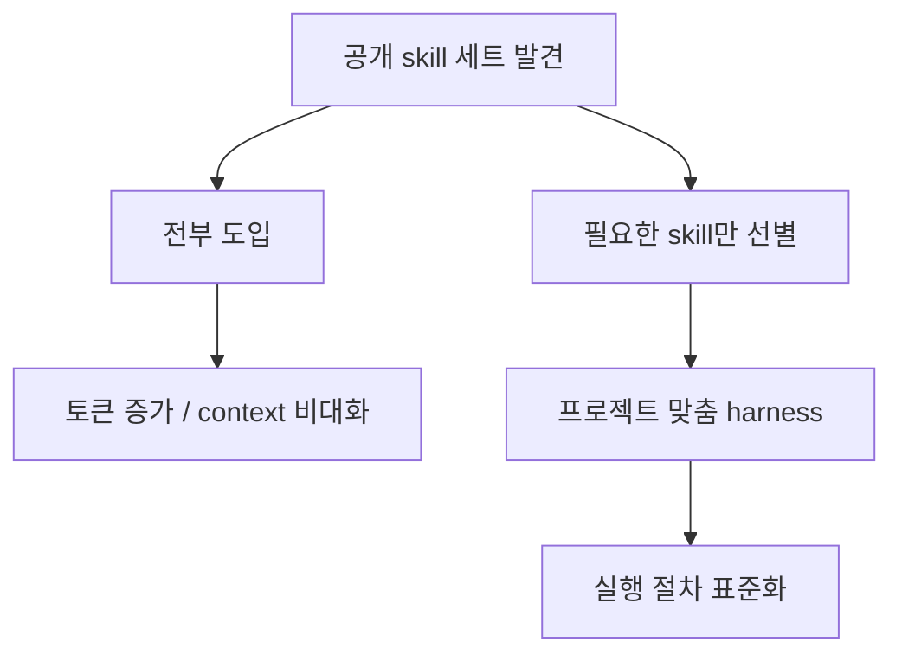

`agent-skills` 저장소가 눈에 띄는 이유는 좋은 프롬프트를 몇 개 모아 둔 프로젝트처럼 보이면서도, 실제로는 훨씬 더 넓은 범위를 다루기 때문입니다. README는 이 저장소를 “AI coding agents를 위한 production-grade engineering skills” 라고 소개하며, 아이디어 정제부터 배포까지 개발 생명주기 전체를 7개의 slash command와 19개의 skill로 구조화합니다. [GitHub README](https://github.com/addyosmani/agent-skills) [GitHub API](https://api.github.com/repos/addyosmani/agent-skills)
<!--more-->

GeekNews 요약도 이 점을 잘 짚습니다. 핵심은 AI 코딩 에이전트가 스펙, 테스트, 보안 리뷰 같은 과정을 건너뛰는 문제를, 시니어 엔지니어의 워크플로를 구조화한 skill 패키지로 보완하려는 시도라는 것입니다. 즉 이 프로젝트는 에이전트를 더 똑똑하게 만들기보다, **에이전트가 덜 건너뛰고 덜 합리화하도록 개발 절차 자체를 패키징** 합니다. [GeekNews](https://news.hada.io/topic?id=28294)

## Sources

- https://news.hada.io/topic?id=28294
- https://github.com/addyosmani/agent-skills
- https://raw.githubusercontent.com/addyosmani/agent-skills/main/README.md

## 1. 이 저장소의 핵심은 7개의 커맨드가 개발 생명주기를 관통한다는 점이다

README는 `/spec`, `/plan`, `/build`, `/test`, `/review`, `/code-simplify`, `/ship` 의 7개 명령을 개발 생명주기와 직접 매핑합니다. 무엇을 만들지 정의하고, 구현 계획을 세우고, 점진적으로 만들고, 테스트로 증명하고, 리뷰하고, 단순화하고, 마지막으로 배포하는 흐름입니다. [GitHub README](https://github.com/addyosmani/agent-skills)

이 구조가 좋은 이유는 AI 에이전트가 “바로 코드부터 쓰는” 습관에 제동을 걸기 때문입니다. `/spec` 과 `/plan` 을 앞단에 명시적으로 두는 순간, 적어도 이 저장소의 기본 철학은 “코드 전에 스펙, 구현 전에 태스크 분해” 라는 방향으로 고정됩니다. GeekNews도 `/spec` 을 “코드 전에 스펙”, `/plan` 을 “소규모 아토믹 태스크로” 요약하며 이 점을 강조합니다. [GeekNews](https://news.hada.io/topic?id=28294)

## 2. 19개 skill은 ‘지식’보다 ‘절차’를 담고 있다

README가 설명하는 중요한 설계 원칙 중 하나는 “Process, not prose” 입니다. 즉 skill은 참고 문서가 아니라, 에이전트가 실제로 따라야 하는 워크플로라는 것입니다. 각 skill에는 overview, triggering conditions, step-by-step process, red flags, verification requirements 같은 구조가 포함됩니다. [GitHub README](https://github.com/addyosmani/agent-skills)

이 때문에 `agent-skills` 는 단순한 best practices 컬렉션과 다릅니다. 예를 들어 test-driven-development skill은 Red-Green-Refactor, 테스트 피라미드, DAMP over DRY, Beyonce Rule 같은 실제 관행을 “언제, 어떤 순서로, 어떤 기준으로” 쓰는지까지 포함하고, security, performance, code review도 각각 별도 workflow로 나뉩니다. GeekNews가 이 프로젝트를 단순 스킬 모음이 아니라 “개발 생명주기 전체에 대응하는 구조화된 스킬 패키지”로 요약한 이유가 바로 여기 있습니다. [GitHub README](https://github.com/addyosmani/agent-skills) [GeekNews](https://news.hada.io/topic?id=28294)

## 3. 가장 흥미로운 부분은 anti-rationalization 설계다

README에서 특히 눈에 띄는 설계 선택은 `anti-rationalization` 입니다. 저장소 설명에 따르면 모든 skill에는 에이전트가 단계를 건너뛰기 위해 쓰는 흔한 변명과, 그에 대한 반박 논리가 포함됩니다. 예를 들어 “테스트는 나중에 추가할게요” 같은 식의 합리화를 막는 구조입니다. [GitHub README](https://github.com/addyosmani/agent-skills)

이 부분은 매우 중요합니다. 많은 AI 도구 설계가 “정답을 더 잘 내게 하자”에 집중하는 반면, 이 프로젝트는 “에이전트가 절차를 생략하려는 유혹을 어떻게 막을까”를 꽤 전면에 둡니다. 결국 시니어 엔지니어링의 가치 중 상당 부분은 뛰어난 아이디어보다도, **뻔한 실수를 반복하지 않는 절차적 규율** 에 있기 때문입니다. [GitHub README](https://github.com/addyosmani/agent-skills)

## 4. verification을 비협상 항목으로 본다는 점도 인상적이다

README는 “Seems right is never sufficient” 라는 방향을 분명히 합니다. 모든 skill은 테스트 통과, 빌드 출력, 런타임 데이터 같은 evidence requirement로 끝나며, 그럴듯해 보인다는 이유로 종료되지 않도록 설계되어 있다고 설명합니다. [GitHub README](https://github.com/addyosmani/agent-skills)

이는 AI 코딩 에이전트의 전형적인 약점과 정면으로 맞닿아 있습니다. 에이전트는 그럴듯한 코드를 빨리 만들어 내지만, 실제로 동작하는지, 배포 가능한지, 보안/성능 기준을 충족하는지는 별개입니다. `agent-skills` 는 바로 그 간극을 메우기 위해 verification을 별도 단계가 아니라 **모든 단계의 종료 조건** 으로 밀어 넣습니다. [GitHub README](https://github.com/addyosmani/agent-skills) [GeekNews](https://news.hada.io/topic?id=28294)

## 5. 설치 대상이 Claude Code 하나가 아니라는 점도 의미 있다

README는 Claude Code를 권장 설치 대상으로 두지만, Cursor, Gemini CLI, Windsurf, OpenCode, GitHub Copilot, Codex 등 다양한 에이전트/IDE 흐름에 맞는 설치 방식을 함께 제시합니다. skill을 plain Markdown 중심으로 설계했기 때문에, 시스템 프롬프트나 instruction file을 받아들이는 거의 모든 환경에 적응시킬 수 있다는 설명입니다. [GitHub README](https://github.com/addyosmani/agent-skills)

이 점은 skill 자체보다 형식의 중요성을 보여 줍니다. 결국 진짜 가치는 특정 모델 전용 비밀 sauce보다, **여러 도구에 걸쳐 재사용 가능한 워크플로 단위로 지식을 포맷팅하는 일** 에 있을 가능성이 큽니다. `agent-skills` 는 이 재사용성을 꽤 의식한 프로젝트로 보입니다. [GitHub README](https://github.com/addyosmani/agent-skills)

## 6. 하지만 모든 skill을 그대로 다 들여오는 게 정답은 아니다

GeekNews 댓글에서 xguru는 요즘 이런 스킬 셋을 공개하는 게 유행처럼 되고 있지만, 어차피 Markdown 파일이므로 그대로 전부 도입할 필요는 없고 많아질수록 토큰 소모량만 늘어난다고 말합니다. 오히려 에이전트에게 “이걸 분석해서 필요한 것만 가져오자”고 시키는 편이 더 낫고, 그렇게 자신만의 하네스를 만들어 가는 것이 좋다는 의견입니다. [GeekNews 댓글](https://news.hada.io/topic?id=28294)

이 코멘트는 이 프로젝트를 사용할 때의 가장 현실적인 경고이기도 합니다. 좋은 skill이 많다고 전부 상시 로드하면, 결국 context budget을 갉아먹는 또 다른 거대 룰셋이 될 수 있습니다. 따라서 `agent-skills` 의 진짜 활용법은 전체를 숭배하는 것이 아니라, **우리 팀과 프로젝트에 맞는 workflow만 선별해 하네스로 재구성하는 것** 에 가깝습니다. [GeekNews](https://news.hada.io/topic?id=28294)

## 실전 적용 포인트

- AI 코딩 에이전트가 코드부터 쓰는 습관이 있다면 `/spec` 과 `/plan` 을 앞단에 강제하는 것만으로도 품질이 달라질 수 있습니다. [GitHub README](https://github.com/addyosmani/agent-skills)
- 좋은 skill은 지식 요약이 아니라 step-by-step workflow와 evidence requirement를 함께 가져야 합니다. [GitHub README](https://github.com/addyosmani/agent-skills)
- anti-rationalization 테이블은 생각보다 중요합니다. 에이전트가 절차를 생략하려는 순간을 막는 장치이기 때문입니다. [GitHub README](https://github.com/addyosmani/agent-skills)
- 이 저장소는 그대로 복붙하기보다, 팀의 하네스 재료로 골라 쓰는 편이 현실적입니다. [GeekNews](https://news.hada.io/topic?id=28294)
- Markdown 기반 skill 형식은 특정 도구보다 workflow 자체를 이식 가능하게 만든다는 점에서 가치가 있습니다. [GitHub README](https://github.com/addyosmani/agent-skills)

## 핵심 요약

`agent-skills` 는 “에이전트가 더 잘 코딩하게 하는 프롬프트”를 모아 둔 저장소가 아닙니다. 더 정확히는 정의→계획→구현→검증→리뷰→배포까지 이어지는 소프트웨어 개발 절차를, command와 skill 단위로 잘게 나눈 engineering workflow 패키지입니다. [GitHub README](https://github.com/addyosmani/agent-skills) [GeekNews](https://news.hada.io/topic?id=28294)

그래서 이 프로젝트의 진짜 가치는 19개의 스킬 수보다도, 시니어 엔지니어가 머릿속으로 수행하던 절차와 품질 게이트를 Markdown 기반 실행 규칙으로 바꾸려 했다는 점에 있습니다. AI 코딩 에이전트 시대에 중요한 것은 정답 문장 하나보다, 절차를 건너뛰지 않게 만드는 구조라는 사실을 잘 보여 줍니다. [GitHub README](https://github.com/addyosmani/agent-skills)

## 결론

앞으로 좋은 에이전트 스킬의 기준은 “이걸 넣으면 더 똑똑해진다”보다 “이걸 넣으면 덜 건너뛰고, 덜 합리화하고, 더 검증하게 된다”가 될 가능성이 큽니다. `agent-skills` 는 그 방향을 꽤 선명하게 보여 주는 저장소입니다. 다만 정말 중요한 것은 이 저장소를 그대로 복제하는 것이 아니라, 필요한 workflow만 골라 자기 팀의 하네스로 재구성하는 일일 것입니다. [GeekNews](https://news.hada.io/topic?id=28294) [GitHub README](https://github.com/addyosmani/agent-skills)
