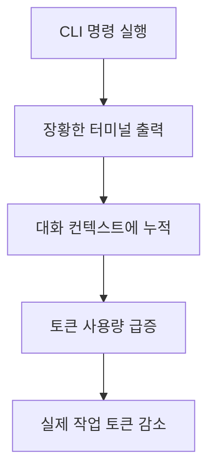
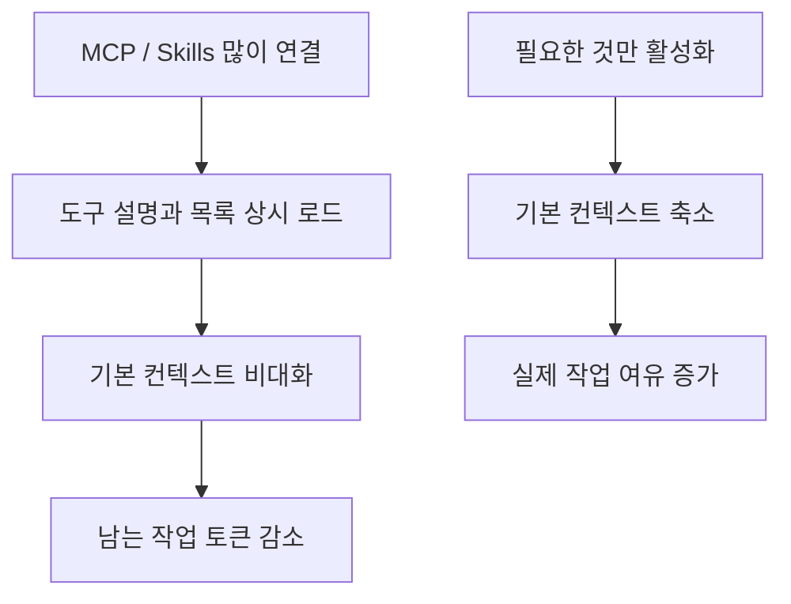
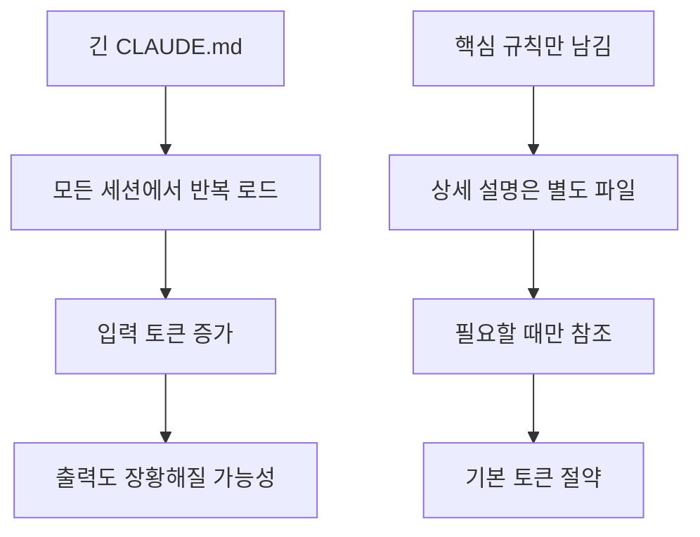

Claude Code를 매일 쓰다 보면 토큰이 “코드를 많이 만들어서”가 아니라, 이상하게도 금방 바닥나는 순간을 자주 겪게 됩니다. 이 Threads 스레드는 그 원인을 꽤 직설적으로 설명합니다. 문제는 코드 생성 자체보다 `git status`, 테스트 로그, 디렉터리 목록 같은 **잡음성 출력과 기본 컨텍스트 오버헤드** 라는 것입니다. 작성자는 30분 세션에 CLI 명령어를 60개 정도 실행하면 터미널 출력만으로 약 21만 토큰이 소모될 수 있다고 지적합니다. [원문 스레드](https://www.threads.com/@unclejobs.ai/post/DW4EUPjkkDd?xmt=AQF0wY1Hitt3SxNVi6ZHFCBycNuHohWZdObB4kyDbmSpSHG6KWxXR0K46WrCaw1IwZO2CzgD&slof=1)
<!--more-->

좋은 점은 해결책도 과장 없이 현실적이라는 것입니다. 모델을 바꾸거나 거대한 시스템을 도입하기보다, `/context` 로 어디에 토큰이 쓰이는지 먼저 보고, 안 쓰는 MCP와 skills를 끄고, `CLAUDE.md` 를 다이어트하고, 주제가 바뀔 때는 `/clear` 로 세션을 끊으라는 식입니다. 결국 핵심은 **더 똑똑한 프롬프트보다 덜 시끄러운 환경** 입니다. [원문 스레드](https://www.threads.com/@unclejobs.ai/post/DW4EUPjkkDd?xmt=AQF0wY1Hitt3SxNVi6ZHFCBycNuHohWZdObB4kyDbmSpSHG6KWxXR0K46WrCaw1IwZO2CzgD&slof=1) [후속 포스트 1] (https://www.threads.com/@unclejobs.ai/post/DWfSx8Wk2Jl) [후속 포스트 2](https://www.threads.com/@unclejobs.ai/post/DWfSzj2k5Ha)

## Sources

- https://www.threads.com/@unclejobs.ai/post/DW4EUPjkkDd?xmt=AQF0wY1Hitt3SxNVi6ZHFCBycNuHohWZdObB4kyDbmSpSHG6KWxXR0K46WrCaw1IwZO2CzgD&slof=1
- https://www.threads.com/@unclejobs.ai/post/DWfSx8Wk2Jl
- https://www.threads.com/@unclejobs.ai/post/DWfSy9Gk6yq
- https://www.threads.com/@unclejobs.ai/post/DWfSzj2k5Ha
- https://www.threads.com/@unclejobs.ai/post/DWU-38hk8Qh

## 1. 토큰은 코드보다 `잡음` 에 더 빨리 녹을 수 있다

스레드의 출발점은 꽤 설득력 있습니다. `cargo test` 한 번에 수천 토큰이 들 수 있지만, 에이전트에게 진짜 필요한 정보는 “262개 통과, 0개 실패” 같은 한 줄인 경우가 많다는 것입니다. 즉 사람이 읽기 좋은 장황한 출력이 모델에게도 그대로 가치 있는 것은 아닙니다. 터미널 세션이 길어질수록 이런 잡음은 누적되고, 결국 200K 컨텍스트 윈도우가 명령어 출력으로만 채워질 수도 있습니다. [원문 스레드](https://www.threads.com/@unclejobs.ai/post/DW4EUPjkkDd?xmt=AQF0wY1Hitt3SxNVi6ZHFCBycNuHohWZdObB4kyDbmSpSHG6KWxXR0K46WrCaw1IwZO2CzgD&slof=1)

이 관점이 중요한 이유는, 많은 사용자가 토큰 부족을 모델 가격이나 플랜 한도 문제로만 이해하기 쉽기 때문입니다. 하지만 실제 병목은 “무엇을 계산하느냐”보다 “무엇을 계속 들고 다니느냐”에 있는 경우가 많습니다. Claude Code는 출력이 길면 길수록, 또 그 출력이 이후 대화에 계속 남을수록 비용이 커집니다. [원문 스레드](https://www.threads.com/@unclejobs.ai/post/DW4EUPjkkDd?xmt=AQF0wY1Hitt3SxNVi6ZHFCBycNuHohWZdObB4kyDbmSpSHG6KWxXR0K46WrCaw1IwZO2CzgD&slof=1)

## 2. 첫 번째 진단 도구는 `/context` 다

작성자가 가장 먼저 권하는 것은 `/context` 를 실행해 현재 토큰이 어디에 쓰이고 있는지 확인하는 일입니다. 이 명령은 시스템 프롬프트, MCP 도구, 메모리 파일, skills가 각각 얼마나 공간을 차지하는지 보여 준다고 설명합니다. 흥미로운 포인트는, 코딩을 시작하기도 전에 컨텍스트의 35% 정도가 이미 차 있는 경우가 적지 않다는 것입니다. [후속 포스트 1](https://www.threads.com/@unclejobs.ai/post/DWfSx8Wk2Jl)

이렇게 보면 토큰 절약의 첫 단계는 최적화가 아니라 계측입니다. 어디에서 새는지 모르면서 줄이려 하면 결국 감으로만 대응하게 됩니다. `/context` 는 Claude Code를 “블랙박스”가 아니라, 현재 적재 상태를 보여 주는 계기판처럼 쓰게 해 줍니다. [후속 포스트 1](https://www.threads.com/@unclejobs.ai/post/DWfSx8Wk2Jl)

## 3. 안 쓰는 MCP와 skills는 그냥 켜 두는 것만으로도 비용이 된다

스레드에서 지적하는 가장 큰 원인 중 하나는 MCP 서버입니다. 호출하지 않아도 연결만 돼 있으면 도구 목록과 설명이 컨텍스트에 들어오기 때문에, 실제로 쓰지 않는 서버를 켜 둔 상태 자체가 비용이라는 것입니다. skills도 비슷한 성격을 가집니다. 안 쓰는 걸 끄기만 해도 기본 컨텍스트가 30%대에서 10%대로 내려갈 수 있다고 합니다. [후속 포스트 1](https://www.threads.com/@unclejobs.ai/post/DWfSx8Wk2Jl)

이 포인트는 Claude Code를 무조건 “많이 연결할수록 강해진다”고 생각하기 쉬운 흐름에 제동을 겁니다. MCP와 skills는 강력하지만, 동시에 기본세를 올리는 구성요소이기도 합니다. 결국 프로젝트마다 필요한 도구만 남겨 두고, 나머지는 그때그때 켜는 편이 더 효율적입니다. [후속 포스트 1](https://www.threads.com/@unclejobs.ai/post/DWfSx8Wk2Jl)

## 4. `CLAUDE.md` 는 길수록 똑똑해지는 파일이 아니다

또 다른 핵심 팁은 `CLAUDE.md` 다이어트입니다. 작성자는 이 파일이 모든 세션에서 로딩되기 때문에, 여기에 들어간 내용은 매 대화마다 토큰을 먹는다고 설명합니다. 특히 프로젝트 설명을 장문으로 넣어 두는 경우가 많은데, 필요한 내용만 남기고 상세 설명은 별도 파일로 빼서 필요할 때만 참조하게 하는 편이 낫다고 권합니다. [후속 포스트 2](https://www.threads.com/@unclejobs.ai/post/DWfSy9Gk6yq)

흥미로운 제안도 하나 있습니다. “가능한 한 간결하게 응답하고, 불필요한 인사나 부연을 생략해” 같은 한 줄을 추가하면 응답 길이 자체가 줄어들 수 있다는 점입니다. 출력도 토큰이기 때문에, 입력 규칙뿐 아니라 답변 스타일도 비용 구조에 영향을 미칩니다. [후속 포스트 2](https://www.threads.com/@unclejobs.ai/post/DWfSy9Gk6yq)

이전 스레드에서 작성자가 정리한 `CLAUDE.md` 범위 구조도 함께 보면 더 명확합니다. 홈 폴더, 프로젝트 루트, 더 좁은 폴더, `.claude/rules/`, auto-memory가 계층적으로 작동하며, 아래로 갈수록 범위는 좁고 우선순위는 높아진다는 설명입니다. 즉 장문 하나에 모든 걸 넣는 대신, **범위에 따라 나누는 설계** 가 더 중요합니다. [CLAUDE.md 구조 포스트](https://www.threads.com/@unclejobs.ai/post/DWU-38hk8Qh)

## 5. 주제가 바뀌면 `/clear` 가 가장 싸다

후속 포스트에서 가장 단순하지만 효과적인 조언은 `/clear` 입니다. Claude Code는 매 메시지마다 전체 대화 기록을 보내기 때문에, 인증 모듈 작업을 하다가 프론트엔드 작업으로 넘어가도 이전 대화가 그대로 딸려옵니다. 주제가 바뀌었는데도 세션을 이어 가면, 이미 필요 없는 맥락에 계속 비용을 지불하는 셈입니다. [후속 포스트 3](https://www.threads.com/@unclejobs.ai/post/DWfSzj2k5Ha)

그래서 작업 주제가 달라지는 순간에는 `/clear` 나 새 세션을 사용하는 편이 낫습니다. 이건 새로운 도구나 거창한 설정 없이 바로 적용할 수 있는 규칙이고, 실제 체감 효과도 큽니다. 결국 세션을 길게 유지하는 것이 항상 생산적이지는 않습니다. [후속 포스트 3](https://www.threads.com/@unclejobs.ai/post/DWfSzj2k5Ha)

## 실전 적용 포인트

- 먼저 `/context` 로 지금 컨텍스트가 어디에서 불어났는지 계측해야 합니다. [후속 포스트 1](https://www.threads.com/@unclejobs.ai/post/DWfSx8Wk2Jl)
- 안 쓰는 MCP와 skills는 “필요할 때만 켜는 자산”으로 다뤄야 합니다. [후속 포스트 1](https://www.threads.com/@unclejobs.ai/post/DWfSx8Wk2Jl)
- `CLAUDE.md` 는 백과사전이 아니라, 상시 주입되는 최소 규칙 파일로 보는 편이 맞습니다. [후속 포스트 2](https://www.threads.com/@unclejobs.ai/post/DWfSy9Gk6yq)
- 주제가 바뀌면 세션을 이어가는 것보다 `/clear` 로 끊는 편이 더 싸고 안전합니다. [후속 포스트 3](https://www.threads.com/@unclejobs.ai/post/DWfSzj2k5Ha)
- 토큰 절약은 코드를 덜 생성하는 게 아니라, 잡음과 기본 컨텍스트를 덜 싣고 다니는 일에 가깝습니다. [원문 스레드](https://www.threads.com/@unclejobs.ai/post/DW4EUPjkkDd?xmt=AQF0wY1Hitt3SxNVi6ZHFCBycNuHohWZdObB4kyDbmSpSHG6KWxXR0K46WrCaw1IwZO2CzgD&slof=1)

## 핵심 요약

이 스레드가 던지는 핵심은 간단합니다. Claude Code의 토큰은 종종 “유용한 사고”보다 “불필요한 적재물”에 먼저 새어 나간다는 것입니다. 터미널 잡음, 안 쓰는 MCP, 안 쓰는 skills, 비대한 `CLAUDE.md`, 주제가 바뀌어도 끌고 가는 대화 기록이 그 대표적인 원인입니다. [원문 스레드](https://www.threads.com/@unclejobs.ai/post/DW4EUPjkkDd?xmt=AQF0wY1Hitt3SxNVi6ZHFCBycNuHohWZdObB4kyDbmSpSHG6KWxXR0K46WrCaw1IwZO2CzgD&slof=1) [후속 포스트 1](https://www.threads.com/@unclejobs.ai/post/DWfSx8Wk2Jl)

그래서 해결책도 의외로 작습니다. `/context` 로 계측하고, 안 쓰는 연결을 줄이고, `CLAUDE.md` 를 짧게 유지하고, 주제가 바뀌면 `/clear` 하는 것. 이 네 가지는 모두 거대한 구조 개편 없이 바로 적용할 수 있고, 동시에 Claude Code를 더 오래 안정적으로 쓰게 해 주는 운영 규칙이기도 합니다. [후속 포스트 2](https://www.threads.com/@unclejobs.ai/post/DWfSy9Gk6yq) [후속 포스트 3](https://www.threads.com/@unclejobs.ai/post/DWfSzj2k5Ha)

## 결론

Claude Code 토큰 절약은 “모델을 덜 쓰는 법”이 아니라 “쓸데없는 것을 덜 보여 주는 법”에 가깝습니다. 이 스레드는 그 점을 매우 현실적으로 보여 줍니다. 잡음이 많은 터미널, 비대한 기본 컨텍스트, 계속 이어지는 세션은 모두 생산성처럼 보이지만 실제로는 비용을 갉아먹는 구조일 수 있습니다. [원문 스레드](https://www.threads.com/@unclejobs.ai/post/DW4EUPjkkDd?xmt=AQF0wY1Hitt3SxNVi6ZHFCBycNuHohWZdObB4kyDbmSpSHG6KWxXR0K46WrCaw1IwZO2CzgD&slof=1)
