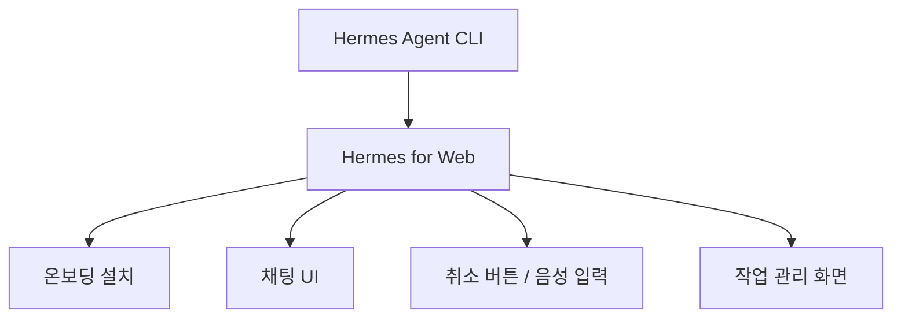
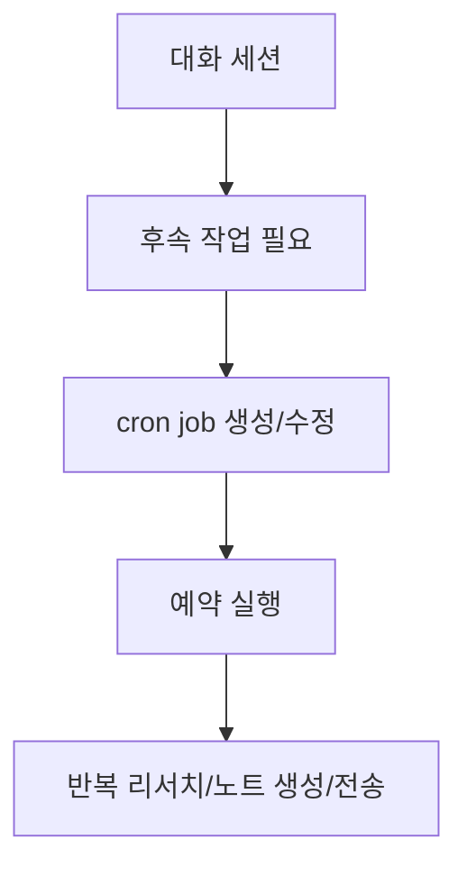
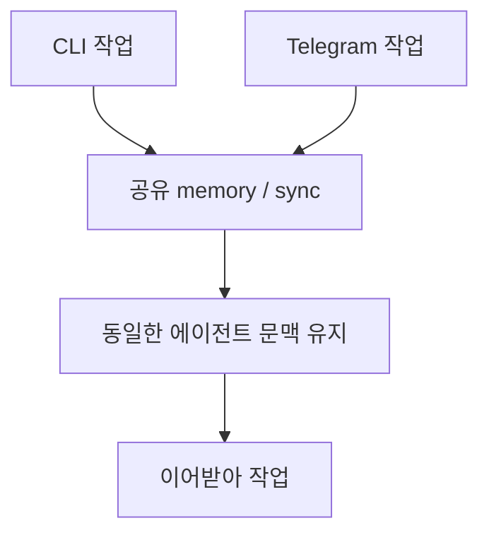

이 영상의 핵심은 Hermes Agent 자체보다, 그 에이전트를 더 많은 사용자가 편하게 다룰 수 있게 만드는 `Hermes for Web` 에 있습니다. 발표자는 Hermes Agent를 2주 정도 직접 써 본 뒤, 설치와 사용이 다소 불편한 지점을 웹 UI와 몇 가지 자동화 패키지로 보완했다고 설명합니다. 결과적으로 CLI 중심 에이전트에 **온보딩, 예약 작업, 메모리 확인, 모델 선택, Obsidian 연동** 을 얹은 관리 화면이 만들어집니다. [0:24](https://youtu.be/VBWM5ZEQtcY?t=24) [1:11](https://youtu.be/VBWM5ZEQtcY?t=71) [2:24](https://youtu.be/VBWM5ZEQtcY?t=144)
<!--more-->

그래서 이 글은 “Hermes가 OpenClaw보다 낫다/아니다” 같은 비교보다, 왜 이런 웹 래퍼가 필요해졌는지와 어떤 작업이 쉬워지는지에 초점을 맞춥니다. 특히 cron job, skills, memory, 로컬 모델 프로필, Telegram-CLI 메모리 공유, Obsidian 노트 생성 같은 기능이 한 화면으로 묶이면서 에이전트를 개인 작업 허브처럼 다루게 된다는 점이 흥미롭습니다. [1:36](https://youtu.be/VBWM5ZEQtcY?t=96) [4:04](https://youtu.be/VBWM5ZEQtcY?t=244) [10:15](https://youtu.be/VBWM5ZEQtcY?t=615)

## Sources

- https://youtu.be/VBWM5ZEQtcY?si=m8gz3r0R5sxdn-AD

## 1. Hermes for Web은 CLI 에이전트의 진입 장벽을 낮추는 래퍼다

영상 초반 데모에서 발표자는 마이크 입력으로 날씨와 미세먼지 예보를 묻고, 작업 중간에도 취소 버튼으로 실행을 멈출 수 있음을 보여 줍니다. 또 Hermes Agent가 아직 설치되지 않은 사용자도 웹 화면 안에서 온보딩 형태로 설치를 진행할 수 있게 했다고 설명합니다. 이는 단순한 “예쁜 UI”가 아니라, 설치와 상호작용의 마찰을 줄이는 레이어입니다. [0:38](https://youtu.be/VBWM5ZEQtcY?t=38) [0:53](https://youtu.be/VBWM5ZEQtcY?t=53) [3:45](https://youtu.be/VBWM5ZEQtcY?t=225)

발표자는 이 프로젝트를 `hermes-for-web` 이라는 GitHub 프로그램으로 소개하고, GitHub 주소를 Claude Code나 Codex에 넘겨 로컬호스트에서 띄우게 하면 된다고 설명합니다. 즉 개발자는 웹 UI를 직접 코딩하기보다, 에이전트에게 설치를 맡겨 빠르게 자기 환경에 올리는 흐름을 전제합니다. [3:25](https://youtu.be/VBWM5ZEQtcY?t=205) [3:33](https://youtu.be/VBWM5ZEQtcY?t=213)

## 2. 화면의 핵심은 대화가 아니라 작업 허브라는 점이다

영상에서 소개하는 웹 화면은 단순 채팅창이 아닙니다. 대화 페이지 외에도 cron job 관리, skills 저장, memory 편집, 세션용 작업 공간, 에이전트 프로필, 아티팩트, 워크플로 항목이 별도로 보입니다. 발표자는 이를 통해 Hermes를 “대화형 비서”보다 **지속적인 작업을 운영하는 허브** 로 다루고 있습니다. [4:31](https://youtu.be/VBWM5ZEQtcY?t=271) [5:18](https://youtu.be/VBWM5ZEQtcY?t=318) [6:22](https://youtu.be/VBWM5ZEQtcY?t=382)

특히 cron job 화면은 꽤 실용적입니다. 기존 예약 작업을 즉시 실행하거나 일시정지, 수정, 삭제할 수 있고, 새 작업이 필요하면 AI가 프롬프트를 채워 생성하도록 만들 수 있습니다. 즉 예약 작업을 코드로만 만지지 않고, 웹 UI에서 지속적으로 운영하는 방식입니다. [5:18](https://youtu.be/VBWM5ZEQtcY?t=318) [5:57](https://youtu.be/VBWM5ZEQtcY?t=357) [6:08](https://youtu.be/VBWM5ZEQtcY?t=368)

## 3. skills와 memory를 ‘보이는 상태’로 만든 점이 중요하다

발표자는 기본 설치된 skill이 30개 이상이며, 새 skill도 저장할 수 있다고 설명합니다. 이 자체는 CLI 환경에서도 가능하지만, 웹 UI에서 어떤 skill이 있는지 확인하고 추가할 수 있다는 점이 차이를 만듭니다. 많은 에이전트 도구가 기능은 강하지만, 실제로 무엇이 깔려 있고 무엇을 재사용할 수 있는지 파악하기 어려운 문제가 있는데, Hermes for Web은 이 가시성을 높이려는 시도로 보입니다. [6:22](https://youtu.be/VBWM5ZEQtcY?t=382) [6:31](https://youtu.be/VBWM5ZEQtcY?t=391)

memory 편집 기능도 같은 맥락입니다. 발표자는 CLI나 Telegram으로 Hermes를 쓸 때는 메모리 상태를 확인하기 쉽지 않다고 말하면서, 웹 UI에서 memory를 직접 열어 편집할 수 있게 했다고 설명합니다. 많이 쓰이지는 않는다고 하더라도, 적어도 “지금 에이전트가 무엇을 기억하고 있는지”를 사용자가 확인 가능한 상태로 만든 점은 중요합니다. [6:36](https://youtu.be/VBWM5ZEQtcY?t=396) [6:52](https://youtu.be/VBWM5ZEQtcY?t=412)

## 4. 로컬 모델과 클라우드 모델을 프로필 단위로 섞어 쓴다

영상 중반부에서 발표자는 Hermes의 기본 모델로 로컬 `Darwin` 계열 모델을 쓰고 있고, 여기에 GPT 계열과 빠른 QN 계열 모델도 함께 쓴다고 설명합니다. 즉 한 에이전트 안에서 단일 모델만 고집하기보다, 작업 성격에 따라 여러 프로필을 두고 선택하는 방식입니다. 웹 UI가 이 프로필 전환을 더 쉽게 만들어 주는 셈입니다. [7:53](https://youtu.be/VBWM5ZEQtcY?t=473) [8:16](https://youtu.be/VBWM5ZEQtcY?t=496)

이 지점은 비용과 속도, 품질의 균형과도 연결됩니다. 로컬 모델로 충분한 작업은 로컬에서 처리하고, 필요한 경우 OpenAI 모델까지 선택해 쓸 수 있도록 열어 두는 방식은 개인 자동화 환경에서 꽤 현실적인 타협입니다. [8:00](https://youtu.be/VBWM5ZEQtcY?t=480)

## 5. 진짜 흥미로운 부분은 CLI와 Telegram의 기억을 이어 붙이는 구조다

발표자가 강조하는 워크플로 중 하나는 `Telegram handoff` 입니다. 기본적으로는 CLI에서 했던 작업과 Telegram 봇에서 했던 작업이 기억을 공유하지 않는 경우가 많기 때문에, 이 둘이 같은 맥락을 이어받을 수 있도록 동기화 구조를 만든다고 설명합니다. 이는 단순 채널 확장이 아니라, **같은 에이전트를 여러 인터페이스에서 연속성 있게 쓰게 만드는 설계** 입니다. [10:15](https://youtu.be/VBWM5ZEQtcY?t=615) [10:29](https://youtu.be/VBWM5ZEQtcY?t=629)

이 구조가 필요한 이유는 분명합니다. 책상에서는 CLI로 작업하고, 이동 중에는 Telegram으로 이어서 보고 싶을 때가 많은데, 기억이 끊기면 사실상 별도 도구를 쓰는 것과 다르지 않습니다. Hermes for Web은 그 사이를 이어 주는 중간 관리층 역할을 합니다. [10:15](https://youtu.be/VBWM5ZEQtcY?t=615)

## 6. Obsidian 자동 저장과 ShareNote 링크는 ‘세컨드 브레인’ 연결점이다

영상 초반과 후반에서 반복해서 드러나는 주제는 Obsidian 연동입니다. 발표자는 대화 내용을 바탕으로 Obsidian 노트 초안을 만들거나, ShareNote 링크를 만들거나, 후속 작업을 예약하는 아티팩트 기능을 보여 줍니다. 즉 에이전트와 대화가 끝난 뒤 결과를 외부 지식 시스템에 넘기는 마지막 단계를 강조합니다. [0:09](https://youtu.be/VBWM5ZEQtcY?t=9) [8:19](https://youtu.be/VBWM5ZEQtcY?t=499) [25:39](https://youtu.be/VBWM5ZEQtcY?t=1539)

이건 단순 export 기능 이상입니다. AI가 만든 결과를 대화창에서 소비하고 끝내지 않고, 개인 노트 시스템과 공유 링크까지 묶어 두면 지식 관리 흐름이 끊기지 않습니다. 영상 설명란에서도 이 프로젝트를 second brain 구축을 돕는 온보딩 과정으로 소개하는 이유가 여기에 있습니다. [설명란 요약](https://youtu.be/VBWM5ZEQtcY?si=m8gz3r0R5sxdn-AD)

## 실전 적용 포인트

- Hermes 같은 CLI 에이전트를 더 자주 쓰게 만드는 요소는 모델 자체보다 설치/관리 UI일 수 있습니다. [3:25](https://youtu.be/VBWM5ZEQtcY?t=205)
- cron job, skills, memory를 한 화면에서 관리하면 “세션형 대화”가 “지속형 작업”으로 바뀝니다. [5:18](https://youtu.be/VBWM5ZEQtcY?t=318) [6:22](https://youtu.be/VBWM5ZEQtcY?t=382)
- 로컬 모델과 클라우드 모델을 프로필로 섞어 쓰는 구조는 개인 자동화 환경에서 현실적입니다. [7:53](https://youtu.be/VBWM5ZEQtcY?t=473)
- Telegram과 CLI의 메모리 동기화는 멀티 인터페이스 에이전트 운영에서 생각보다 중요합니다. [10:15](https://youtu.be/VBWM5ZEQtcY?t=615)
- Obsidian과 ShareNote 연동은 결과물을 세컨드 브레인으로 넘기는 마지막 퍼즐입니다. [25:39](https://youtu.be/VBWM5ZEQtcY?t=1539)

## 핵심 요약

이 영상이 보여 주는 Hermes for Web의 본질은 “Hermes Agent를 웹으로 감쌌다”가 아닙니다. 오히려 설치, 대화, 예약 작업, skill 관리, memory 확인, 모델 프로필, Telegram handoff, Obsidian 저장까지 하나의 운영 패널로 묶어 **에이전트를 장기적으로 굴리는 환경** 을 만든 데 가깝습니다. [2:24](https://youtu.be/VBWM5ZEQtcY?t=144) [4:04](https://youtu.be/VBWM5ZEQtcY?t=244)

그래서 이 프로젝트는 개별 기능보다도 “에이전트 UX”의 사례로 보는 편이 더 적절합니다. 강력한 CLI 에이전트라도 온보딩, 취소, 예약, 기억 확인, 결과 저장 같은 주변 기능이 없으면 일반 사용자에게는 금방 멀어지기 때문입니다. [0:24](https://youtu.be/VBWM5ZEQtcY?t=24) [5:18](https://youtu.be/VBWM5ZEQtcY?t=318)

## 결론

Hermes for Web은 에이전트를 더 똑똑하게 만드는 프로젝트라기보다, 더 자주 쓰고 더 오래 이어서 쓰게 만드는 프로젝트에 가깝습니다. CLI 기반 에이전트가 점점 많아질수록, 결국 경쟁력은 모델 성능만이 아니라 이런 운영 UX에서 갈릴 가능성이 큽니다. 그런 점에서 이 영상은 하나의 도구 소개이면서, 동시에 앞으로의 에이전트 인터페이스가 어떤 방향으로 갈지 보여 주는 사례이기도 합니다. [1:11](https://youtu.be/VBWM5ZEQtcY?t=71) [10:15](https://youtu.be/VBWM5ZEQtcY?t=615)
