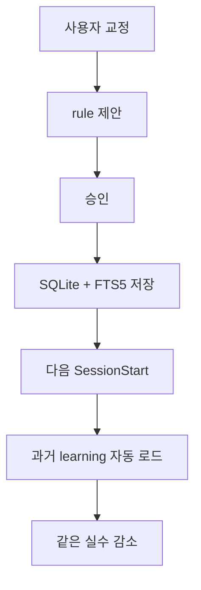
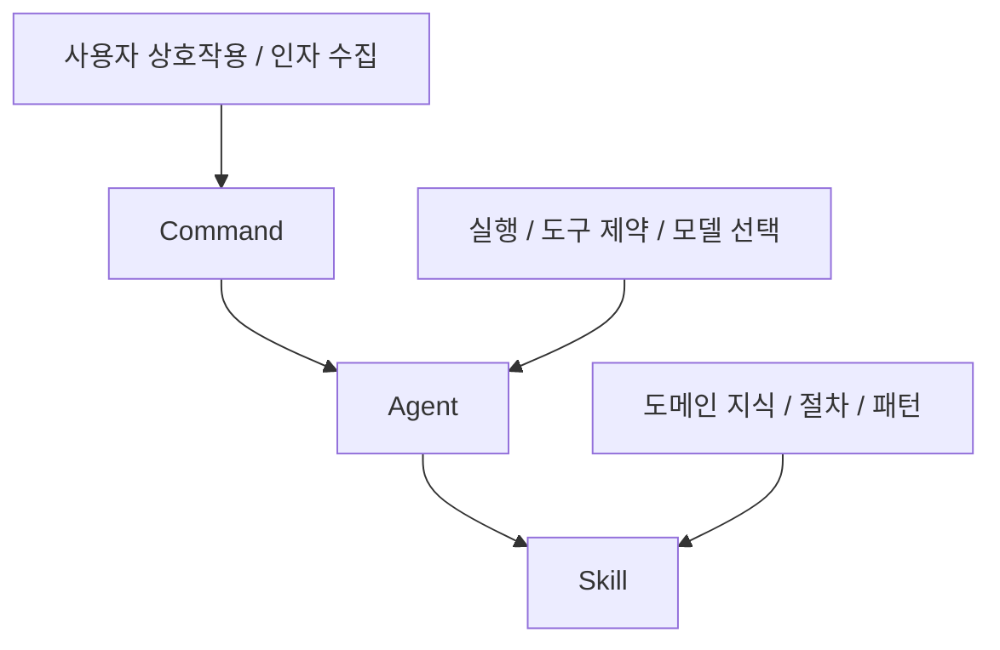
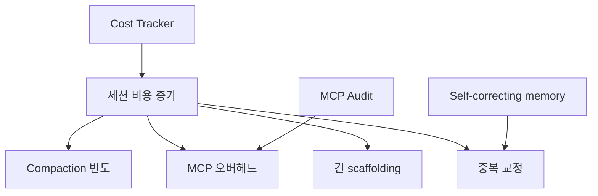

`pro-workflow` 가 흥미로운 이유는 “좋은 프롬프트 모음”에 머물지 않기 때문입니다. 이 프로젝트는 Claude Code가 사용자의 교정을 세션마다 잊어버리는 문제를, **영속 메모리와 자동 규칙 재주입** 으로 풀려는 시도에 가깝습니다. 저장소 README는 이를 `self-correcting memory` 라고 부르며, 교정이 SQLite 데이터베이스에 누적되고 다음 세션 시작 시 다시 로드된다고 설명합니다. [README](https://github.com/rohitg00/pro-workflow) [GitHub API 메타데이터](https://api.github.com/repos/rohitg00/pro-workflow)
<!--more-->

그래서 이 글은 단순 설치법보다, 왜 이 저장소가 주목받는지에 집중합니다. 핵심은 correction을 일회성 대화로 남기지 않고, 검색 가능한 persistent memory로 바꾸는 것, 그리고 commands·agents·skills·hooks를 엮어 Claude Code의 실행 환경 자체를 구조화하는 것입니다. [README](https://github.com/rohitg00/pro-workflow) [Context Engineering Guide](https://github.com/rohitg00/pro-workflow/blob/main/docs/context-engineering.md) [Orchestration Patterns](https://github.com/rohitg00/pro-workflow/blob/main/docs/orchestration-patterns.md)

## Sources

- https://github.com/rohitg00/pro-workflow
- https://raw.githubusercontent.com/rohitg00/pro-workflow/main/README.md
- https://raw.githubusercontent.com/rohitg00/pro-workflow/main/docs/context-engineering.md
- https://raw.githubusercontent.com/rohitg00/pro-workflow/main/docs/orchestration-patterns.md
- https://api.github.com/repos/rohitg00/pro-workflow

## 1. 이 프로젝트의 핵심은 “한 번 교정하면 다음엔 안 틀리게 하자”다

README가 제시하는 문제는 익숙합니다. 월요일에 “테스트에서 DB를 mock하지 마”라고 고쳤는데, 금요일에 또 같은 실수를 반복하는 상황입니다. `pro-workflow` 는 이를 단순 불편이 아니라 Claude Code 사용자가 반복해서 겪는 구조적 문제로 보고, 교정을 persistent rule로 저장해 다음 세션에서 다시 읽히게 하겠다고 말합니다. [README](https://github.com/rohitg00/pro-workflow)

여기서 중요한 포인트는 “세션을 길게 끌자”가 아니라는 점입니다. 오히려 세션이 바뀌어도 교정이 살아남게 만들겠다는 쪽에 가깝습니다. 그래서 이 프로젝트의 진짜 가치는 모델 자체를 바꾸는 것이 아니라, **세션 경계를 넘는 기억의 인프라** 를 제공한다는 데 있습니다. [README](https://github.com/rohitg00/pro-workflow)

## 2. SQLite + FTS5를 쓰는 이유는 ‘대화 기억’이 아니라 ‘검색 가능한 기억’이 필요해서다

README는 correction을 SQLite 데이터베이스에 저장하고 full-text search로 검색 가능하게 만든다고 설명합니다. 이는 단순 메모 파일보다 한 단계 더 나아간 선택입니다. 메모를 적어 두는 것만으로는 다음 세션에 필요한 규칙을 적절히 다시 찾기 어렵지만, 데이터베이스와 FTS를 쓰면 관련 교정을 키워드 기반으로 다시 꺼내 쓰는 것이 쉬워집니다. [README](https://github.com/rohitg00/pro-workflow)

이 구조는 Claude Code가 점점 “기억한다”는 인상을 주기 위해서가 아니라, 실제로는 **적절한 순간에 적절한 기억을 다시 선택해 로드하는 문제** 를 풀려는 설계로 읽는 편이 맞습니다. 이 점은 저장소의 context engineering 문서가 말하는 `Write / Select / Compress / Isolate` 네 가지 연산과도 정확히 연결됩니다. [Context Engineering Guide](https://github.com/rohitg00/pro-workflow/blob/main/docs/context-engineering.md)

## 3. 이 프로젝트는 command > agent > skill 3계층을 명시적으로 쓴다

`orchestration-patterns.md` 는 이 저장소의 작업 구성을 세 층으로 나눕니다. command는 사용자 진입점, agent는 제약된 도구를 가진 실행자, skill은 도메인 지식과 절차를 담는 패키지입니다. 중요한 것은 이 셋을 한데 뭉개지 않고 역할을 분리한다는 점입니다. [Orchestration Patterns](https://github.com/rohitg00/pro-workflow/blob/main/docs/orchestration-patterns.md)

예를 들어 `/develop` 같은 명령은 다단계 개발 흐름의 입구가 되고, planner·reviewer·debugger 같은 agent는 특정 역할에 맞게 도구와 모델이 제한되며, skill은 필요 지식을 preload하거나 on-demand로 호출합니다. 이 패턴은 “명령문 하나로 모든 걸 하게 시키는 방식”보다 훨씬 유지보수성이 높습니다. [README](https://github.com/rohitg00/pro-workflow) [Orchestration Patterns](https://github.com/rohitg00/pro-workflow/blob/main/docs/orchestration-patterns.md)

## 4. compaction을 비용 문제가 아니라 상태 보존 문제로 본다

context-engineering 문서는 Claude Code 같은 도구가 컨텍스트 윈도우가 차면 compaction을 수행하고, 이 과정이 KV cache를 깨뜨리며 cold restart 비용을 만든다고 설명합니다. 그래서 `pro-workflow` 는 단순히 “context를 줄이자”가 아니라, compaction 전후에 상태를 보호하는 `Compact Guard` 같은 레이어를 둡니다. [Context Engineering Guide](https://github.com/rohitg00/pro-workflow/blob/main/docs/context-engineering.md) [README](https://github.com/rohitg00/pro-workflow)

이 관점은 매우 실무적입니다. 긴 세션을 유지하는 도구에서 진짜 손실은 토큰 비용만이 아니라, 중간에 쌓인 작업 상태가 요약 과정에서 흐려지는 것입니다. 그래서 이 프로젝트는 pre-compact, post-compact 훅을 별도로 두고, 필요한 상태를 저장·재주입하는 흐름을 만들어 둡니다. [README](https://github.com/rohitg00/pro-workflow)

## 5. cost tracker와 MCP audit는 “모델 비용”보다 주변 비용을 보게 만든다

v3.2의 새 기능 목록을 보면 `Cost Tracker`, `MCP Audit`, `Permission Tuner` 가 포함됩니다. 이는 이 저장소가 단순 메모리 프로젝트가 아니라, Claude Code를 둘러싼 운영 비용과 마찰까지 줄이려 한다는 뜻입니다. 특히 MCP audit는 요청당 MCP 서버 오버헤드를 분석한다고 되어 있어, 도구를 많이 붙일수록 강해지는 대신 기본 컨텍스트 비용도 올라간다는 문제를 겨냥합니다. [README](https://github.com/rohitg00/pro-workflow)

cost tracking도 같은 흐름입니다. 세션 비용과 토큰 지출을 인식하게 만들면, 사용자는 “왜 이번 세션이 비쌌는가”를 모델 탓만 하지 않고 작업 방식, compaction 빈도, MCP 오버헤드 같은 주변 요인까지 함께 보게 됩니다. 즉 이 프로젝트는 Claude Code를 **하나의 운영 시스템** 으로 바라보게 만듭니다. [README](https://github.com/rohitg00/pro-workflow)

## 6. hooks를 24개 이벤트에 거는 이유는 ‘좋은 조언’이 아니라 ‘자동 개입’을 원해서다

README가 나열하는 hook 이벤트 수는 과할 정도로 많아 보일 수 있습니다. 하지만 그 의미는 분명합니다. SessionStart, SessionEnd, UserPromptSubmit, PreToolUse, PostToolUse, Stop, Compact, Permission, Worktree, FileChanged 등 주요 순간마다 자동 로직이 개입합니다. 이것은 agent가 규칙을 “알고 있다”에 머물지 않고, **특정 시점에 특정 검사를 강제로 받게 만드는 구조** 입니다. [README](https://github.com/rohitg00/pro-workflow)

특히 `type: "prompt"` 기반 LLM hook, secret detection, commit validation, permission denial 분석 같은 기능은 전통적인 lint나 script만으로는 포착하기 어려운 경계 영역을 겨냥합니다. 이 프로젝트가 흥미로운 이유는 단순한 명령 모음이 아니라, 에이전트의 생애주기 곳곳에 작은 안전장치를 심는 방식이기 때문입니다. [README](https://github.com/rohitg00/pro-workflow)

## 7. 결국 이 프로젝트는 Claude Code를 ‘더 오래 쓸수록 나아지는 시스템’으로 바꾸려 한다

저장소 소개 문구 중 가장 중요한 표현은 “Your Claude Code gets smarter every session” 입니다. 많은 도구가 첫 세션의 성능에 집중하는 반면, `pro-workflow` 는 오히려 50세션 이후를 강조합니다. 교정이 누적되고, 규칙이 정리되고, 관련 learning이 다시 재생되면서 correction rate가 줄어드는 구조를 목표로 하기 때문입니다. [README](https://github.com/rohitg00/pro-workflow)

이건 AI 도구를 일회성 생산성 해킹이 아니라 장기 운영 시스템으로 본다는 뜻이기도 합니다. 교정 비용, compaction 비용, context pollution, tool overhead를 모두 관리 대상으로 두고 있기 때문에, 이 프로젝트는 프롬프트 모음집보다 **작업 운영 체계** 에 더 가깝습니다. [README](https://github.com/rohitg00/pro-workflow) [Context Engineering Guide](https://github.com/rohitg00/pro-workflow/blob/main/docs/context-engineering.md)

## 실전 적용 포인트

- Claude Code가 같은 실수를 반복한다면, 대화 로그보다 persistent learning 저장소가 먼저 필요할 수 있습니다. [README](https://github.com/rohitg00/pro-workflow)
- command / agent / skill을 분리하면 “거대한 한 번의 프롬프트”보다 유지보수가 쉬워집니다. [Orchestration Patterns](https://github.com/rohitg00/pro-workflow/blob/main/docs/orchestration-patterns.md)
- compaction은 단순 비용이 아니라 상태 보존 문제로 다뤄야 합니다. [Context Engineering Guide](https://github.com/rohitg00/pro-workflow/blob/main/docs/context-engineering.md)
- MCP와 session cost는 모델 바깥의 숨은 비용이므로 별도 계측이 필요합니다. [README](https://github.com/rohitg00/pro-workflow)
- 이 프로젝트의 진짜 가치는 첫 세션보다 누적된 10, 20, 50세션에서 드러납니다. [README](https://github.com/rohitg00/pro-workflow)

## 핵심 요약

`pro-workflow` 는 Claude Code를 더 강하게 만드는 단순 플러그인이 아니라, 더 오래 쓸수록 덜 교정해도 되는 방향으로 바꾸려는 운영 시스템입니다. SQLite 기반 self-correcting memory, command-agent-skill 3계층, compaction guard, cost tracker, MCP audit, 다수의 lifecycle hook이 모두 그 목적 아래 묶여 있습니다. [README](https://github.com/rohitg00/pro-workflow)

그래서 이 저장소를 볼 때는 “기능이 몇 개 있나”보다, correction을 persistent rule로 바꾸고 그 rule을 세션 경계를 넘어 다시 불러오는 구조를 어떻게 설계했는지가 더 중요합니다. 바로 그 점이 이 프로젝트를 일반적인 명령어/에이전트 번들과 구분해 줍니다. [README](https://github.com/rohitg00/pro-workflow) [Orchestration Patterns](https://github.com/rohitg00/pro-workflow/blob/main/docs/orchestration-patterns.md)

## 결론

많은 Claude Code 보강 프로젝트가 “지금 당장 더 잘 쓰는 법”에 집중한다면, `pro-workflow` 는 “다음 세션에도 덜 틀리는 법”에 집중합니다. 이 차이는 작아 보이지만 실제로는 큽니다. 장기적으로 AI 코딩 도구의 경쟁력은 모델 크기보다도, 사용자의 교정과 규칙을 얼마나 잘 누적하고 재사용하느냐에서 갈릴 가능성이 크기 때문입니다. [GitHub API 메타데이터](https://api.github.com/repos/rohitg00/pro-workflow) [README](https://github.com/rohitg00/pro-workflow)
