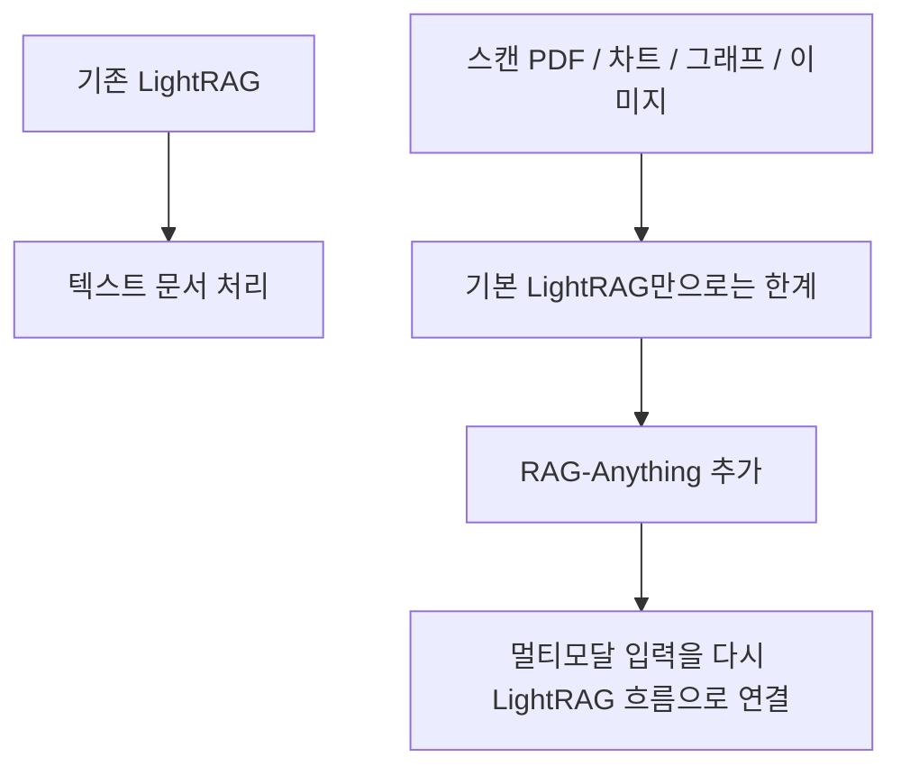
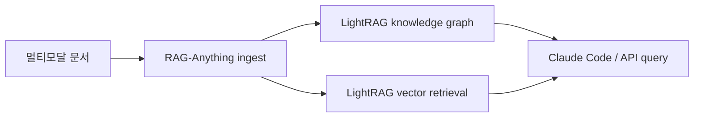
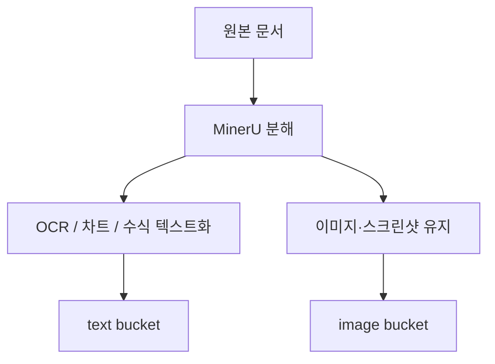
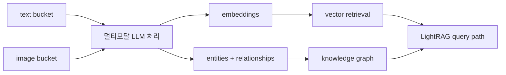

LightRAG를 한 번 써 본 사람이라면 금방 부딪히는 한계가 있습니다. 텍스트 문서는 잘 다루지만, 스캔 PDF나 이미지가 섞인 보고서, 차트와 그래프가 많은 문서는 갑자기 처리 난도가 올라간다는 점입니다. 이 영상은 그 빈칸을 메우는 방법으로 `RAG-Anything` 를 소개합니다. 핵심은 새로운 RAG를 처음부터 다시 만드는 것이 아니라, **LightRAG 위에 멀티모달 문서 처리 레이어를 하나 더 얹는 방식** 이라는 데 있습니다. [0:48](https://youtu.be/rJCgvnXgOiU?t=48) [1:03](https://youtu.be/rJCgvnXgOiU?t=63)
<!--more-->

발표자가 반복해서 강조하는 부분도 바로 이것입니다. 중요한 것은 설치 명령 몇 줄을 복붙하는 것이 아니라, 스캔 문서가 어떤 과정을 거쳐 텍스트와 이미지 단위로 재구성되고, 그 결과가 다시 LightRAG의 임베딩과 지식 그래프 파이프라인으로 합쳐지는지 이해하는 것입니다. 그래야 Claude Code에서 이 스택을 “검색 가능한 멀티모달 지식 베이스”로 제대로 쓸 수 있습니다. [2:40](https://youtu.be/rJCgvnXgOiU?t=160) [3:22](https://youtu.be/rJCgvnXgOiU?t=202)

## Sources

- https://youtu.be/rJCgvnXgOiU?si=KHzumnMX1jGExSes

## 1. 왜 LightRAG만으로는 부족했나

영상의 출발점은 분명합니다. 대부분의 RAG 시스템은 여전히 텍스트 문서에 최적화되어 있고, LightRAG도 기본적으로는 그 한계 안에 있습니다. 발표자는 이미지, 차트, 그래프, 스캔 PDF 같은 비정형 요소가 많은 문서를 기존 RAG만으로 처리하려고 하면 성능과 정확도가 금방 흔들린다고 설명합니다. [0:48](https://youtu.be/rJCgvnXgOiU?t=48) [2:40](https://youtu.be/rJCgvnXgOiU?t=160)

이 지점에서 `RAG-Anything` 의 의미가 생깁니다. 이 프로젝트는 텍스트가 아닌 요소를 별도의 전처리 단계에서 해석 가능한 형태로 바꾼 뒤, 최종적으로는 LightRAG가 원래 잘하던 벡터 검색과 지식 그래프 흐름으로 다시 합류시킵니다. 즉 “텍스트 RAG를 버리고 새로 갈아타는 도구”가 아니라, **텍스트 중심 RAG를 멀티모달 입력까지 확장하는 보강층** 에 가깝습니다. [1:03](https://youtu.be/rJCgvnXgOiU?t=63) [1:27](https://youtu.be/rJCgvnXgOiU?t=87)

## 2. `RAG-Anything` 는 사실상 LightRAG 위에 얹는 래퍼다

발표자는 `RAG-Anything` 를 LightRAG와 분리된 완전한 새 제품처럼 설명하지 않습니다. 오히려 “wrapper” 에 가깝다고 말합니다. 같은 팀에서 만들었고, 결과적으로는 동일한 LightRAG UI, 동일한 지식 그래프, 동일한 API 질의 경로를 계속 활용할 수 있다는 뜻입니다. [1:03](https://youtu.be/rJCgvnXgOiU?t=63) [1:27](https://youtu.be/rJCgvnXgOiU?t=87)

이 설계가 실용적인 이유는 운영 복잡도를 크게 늘리지 않기 때문입니다. 사용자는 검색 인터페이스를 완전히 바꿀 필요가 없고, Claude Code 쪽에서도 질의 단계는 익숙한 LightRAG 경로를 유지할 수 있습니다. 달라지는 것은 ingest 단계입니다. 텍스트만 바로 넣던 대신, 멀티모달 문서는 `RAG-Anything` 쪽 파이프라인을 먼저 거쳐야 합니다. [1:27](https://youtu.be/rJCgvnXgOiU?t=87) [13:11](https://youtu.be/rJCgvnXgOiU?t=791)

다만 영상은 단점도 숨기지 않습니다. 비텍스트 처리를 위해 로컬 모델과 추가 도구가 더 필요하고, 이 ingest 과정은 LightRAG 기본 UI에서 클릭 몇 번으로 끝나는 형태가 아니라 별도 스크립트나 스킬 호출 흐름으로 들어갑니다. 다시 말해 편의성보다 능력을 확장하는 쪽에 무게를 둔 설계입니다. [1:39](https://youtu.be/rJCgvnXgOiU?t=99) [2:03](https://youtu.be/rJCgvnXgOiU?t=123)

## 3. 첫 단계의 핵심은 MinerU가 문서를 조각내는 일이다

영상에서 가장 중요한 구현 포인트는 `MinerU` 입니다. 발표자 설명에 따르면 MinerU는 문서를 읽고 그 안의 구성 요소를 잘게 나눕니다. 헤더, 본문, 차트, 이미지, 수식, 레이아웃 블록처럼 문서의 구성 단위를 먼저 파악하는 역할입니다. 여기서 중요한 점은 MinerU가 곧바로 의미를 “이해”한다기보다, **문서를 처리 가능한 조각으로 분해하는 문서 파서** 에 가깝다는 것입니다. [4:57](https://youtu.be/rJCgvnXgOiU?t=297) [5:27](https://youtu.be/rJCgvnXgOiU?t=327)

이 단계가 필요한 이유는 스캔 PDF나 리포트가 하나의 균일한 텍스트 덩어리가 아니기 때문입니다. 사람은 한 페이지 안에서 제목, 표, 캡션, 그래프, 수식을 자연스럽게 함께 읽지만, RAG 파이프라인은 그런 이질적인 요소를 먼저 분해하지 않으면 후속 처리 품질이 크게 떨어집니다. 그래서 `RAG-Anything` 는 문서를 먼저 “페이지”가 아니라 “구성 요소 집합”으로 다루기 시작합니다. [5:03](https://youtu.be/rJCgvnXgOiU?t=303) [6:07](https://youtu.be/rJCgvnXgOiU?t=367)

## 4. 분해된 결과는 결국 text bucket과 image bucket으로 갈라진다

MinerU가 문서를 조각내면, 그다음에는 각 요소를 어떤 방식으로 의미화할지 결정해야 합니다. 영상에서는 OCR 계열 처리로 스캔 텍스트를 추출하고, 차트나 수식 같은 요소도 가능한 한 텍스트 또는 구조화된 텍스트로 바꾸는 과정을 설명합니다. 하지만 모든 요소가 완전히 텍스트화되지는 않기 때문에, 최종적으로는 두 개의 바구니가 생깁니다. 하나는 text bucket, 다른 하나는 image bucket 입니다. [6:07](https://youtu.be/rJCgvnXgOiU?t=367) [7:06](https://youtu.be/rJCgvnXgOiU?t=426) [7:28](https://youtu.be/rJCgvnXgOiU?t=448)

이 부분이 `RAG-Anything` 의 핵심 차별점입니다. 전통적인 텍스트 RAG는 거의 모든 것을 문자열로 환원하려 하지만, 여기서는 이미지로 남겨야 하는 요소를 억지로 텍스트로 찌그러뜨리지 않습니다. 텍스트로 바꿀 수 있는 것은 text bucket으로, 그대로 봐야 의미가 유지되는 것은 image bucket으로 보냅니다. 즉 멀티모달 문서를 처음부터 **이질적인 증거의 묶음** 으로 취급합니다. [7:28](https://youtu.be/rJCgvnXgOiU?t=448) [8:58](https://youtu.be/rJCgvnXgOiU?t=538)

## 5. 마지막에는 임베딩과 엔티티·관계 추출로 다시 LightRAG에 합류한다

영상 후반부에서 발표자는 분해된 멀티모달 입력이 결국 두 가지 산출물로 이어진다고 설명합니다. 하나는 벡터 검색을 위한 임베딩이고, 다른 하나는 지식 그래프를 위한 엔티티와 관계 추출입니다. 이 구조는 사실 LightRAG의 핵심과 동일합니다. 다른 점은 입력이 처음부터 텍스트가 아니라, 텍스트와 이미지 두 버킷을 거쳐 정리된 멀티모달 표현이라는 점입니다. [8:58](https://youtu.be/rJCgvnXgOiU?t=538)

그래서 사용 경험의 관점에서 보면 `RAG-Anything` 의 진짜 가치도 명확합니다. 문서 해석은 앞단에서 더 복잡해졌지만, 질의 단계에서는 여전히 “벡터 검색 + 엔티티 관계 기반 검색” 이라는 익숙한 LightRAG 패턴을 유지합니다. 발표자가 이 아키텍처를 이해하라고 강조한 이유도, 결국 복잡성은 ingest에 몰리고 검색 경험은 최대한 유지되기 때문입니다. [3:22](https://youtu.be/rJCgvnXgOiU?t=202) [8:58](https://youtu.be/rJCgvnXgOiU?t=538)

## 6. Claude Code에서는 결국 ‘UI 클릭’보다 ‘ingest 명령’이 중요해진다

이 영상이 Claude Code 사용자에게 흥미로운 이유는, 검색보다 적재가 더 중요한 워크플로를 보여 주기 때문입니다. 발표자 설명대로라면 멀티모달 문서는 LightRAG UI에 그냥 올리는 방식보다, Claude Code가 `RAG-Anything` 쪽 스킬이나 스크립트를 이용해 ingest하도록 만드는 흐름이 더 자연스럽습니다. 즉 Claude Code는 “질문하는 도구”일 뿐 아니라, **문서를 어떤 파이프라인으로 지식 베이스에 넣을지 지휘하는 운영층** 으로 쓰이게 됩니다. [2:03](https://youtu.be/rJCgvnXgOiU?t=123) [13:11](https://youtu.be/rJCgvnXgOiU?t=791)

이 관점은 꽤 중요합니다. 텍스트 RAG 시대에는 문서를 넣는 과정이 비교적 단순했기 때문에 검색 UX가 중심이었지만, 멀티모달 RAG에서는 ingest 품질이 성능을 크게 좌우합니다. 그래서 앞으로는 “무엇을 묻느냐” 못지않게 “문서를 어떤 규칙과 도구로 넣었느냐”가 훨씬 중요해집니다.

## 실전 적용 포인트

첫째, PDF를 다룬다고 해서 모두 같은 난이도로 보면 안 됩니다. 텍스트 기반 PDF와 스캔 PDF, 차트 중심 보고서는 ingest 경로를 분리해야 합니다. 이 영상은 바로 그 분기점에서 `RAG-Anything` 의 필요성을 보여 줍니다.

둘째, 멀티모달 RAG를 도입할 때는 검색 UI보다 앞단 파서와 변환기의 품질을 먼저 봐야 합니다. MinerU 같은 문서 분해 단계가 부실하면, 뒤의 임베딩과 지식 그래프는 아무리 좋아도 입력 자체가 흔들립니다.

셋째, Claude Code를 쓴다면 “검색 프롬프트”만 정교하게 만들기보다, ingest용 커맨드나 스킬을 별도로 정리하는 편이 낫습니다. 멀티모달 문서는 넣는 순간의 규칙이 검색 품질을 결정하는 비중이 훨씬 크기 때문입니다.

## 핵심 요약

- `RAG-Anything` 는 LightRAG를 대체하는 도구가 아니라 멀티모달 입력을 붙이는 래퍼에 가깝다.
- 핵심 병목은 검색이 아니라 ingest이며, 스캔 PDF·차트·이미지를 먼저 분해하고 재구성해야 한다.
- MinerU는 문서를 의미 이해보다는 처리 가능한 구성 요소로 분해하는 첫 단계다.
- 분해된 결과는 text bucket과 image bucket으로 나뉘고, 이후 임베딩과 엔티티·관계 추출을 거쳐 다시 LightRAG 검색 경로로 합류한다.
- Claude Code에서는 결국 이 파이프라인을 호출하고 운영하는 ingest 레이어가 중요해진다.

## 결론

이 영상이 보여 주는 가장 큰 변화는 “RAG의 성능은 검색 모델이 아니라 입력 구성 방식에서 갈린다”는 점입니다. 텍스트 문서만 다루던 시기에는 RAG를 검색 기술로 이해해도 큰 무리가 없었지만, 스캔 PDF와 차트, 이미지가 섞인 현실 문서까지 다루려면 먼저 문서를 해체하고 다시 의미 있는 단위로 조립해야 합니다.

그 의미에서 `RAG-Anything` 는 새로운 검색 엔진이라기보다, LightRAG 앞단에 붙는 멀티모달 ingest 시스템으로 보는 편이 더 정확합니다. 그리고 Claude Code의 역할도 단순 질의 도구가 아니라, 이 복잡한 적재 파이프라인을 반복 가능하게 실행하는 작업 오케스트레이터 쪽으로 이동합니다.
