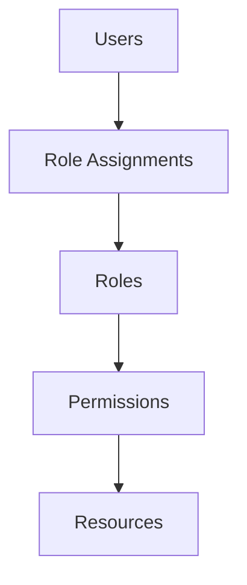
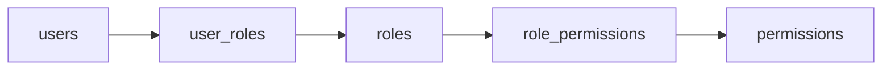
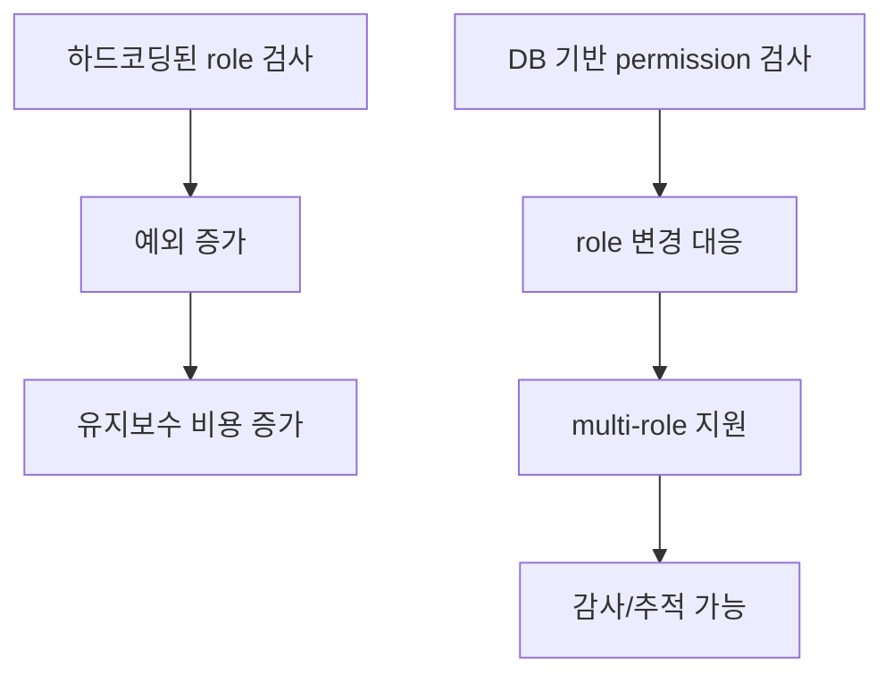

RBAC(Role-Based Access Control)는 익숙한 개념이지만, 실제로 설계할 때는 “사용자에게 권한을 어떻게 직접 붙일 것인가”보다 “권한을 어떻게 중간 레이어로 묶어 확장 가능하게 관리할 것인가”가 더 중요합니다. Rohit의 이 Medium 글은 RBAC를 아주 정석적인 형태로 풀어냅니다. 핵심은 user, role, permission을 분리하고, user-role과 role-permission을 조인 테이블로 연결하는 것입니다. [원문](https://medium.com/@07rohit/designing-a-role-based-access-control-rbac-system-a-scalable-approach-441f05168933)
<!--more-->

흥미로운 점은 이 글이 복잡한 이론보다 “SaaS, 내부 엔터프라이즈 시스템, 멀티테넌트 앱에서도 통할 수 있는 기본형”에 집중한다는 것입니다. 즉 화려한 권한 엔진이 아니라, **변경에 강한 권한 구조의 최소 공통분모** 를 설명하는 글로 읽는 편이 맞습니다. [원문](https://medium.com/@07rohit/designing-a-role-based-access-control-rbac-system-a-scalable-approach-441f05168933)

## Sources

- https://medium.com/@07rohit/designing-a-role-based-access-control-rbac-system-a-scalable-approach-441f05168933

## 1. RBAC의 핵심은 사용자보다 역할에 권한을 부여하는 것이다

원문은 RBAC를 “권한을 개별 사용자에게 직접 붙이지 않고, 역할(role)에 부여한 뒤 사용자를 역할에 연결하는 authorization model”로 설명합니다. 이 방식의 장점은 명확합니다. 사용자가 늘어나도 권한 정의를 반복하지 않아도 되고, 특정 부서나 직군이 공통으로 가져야 할 권한을 한 번에 관리할 수 있습니다. [원문](https://medium.com/@07rohit/designing-a-role-based-access-control-rbac-system-a-scalable-approach-441f05168933)

글에서 제시하는 핵심 구성요소는 다섯 가지입니다. 사용자(Users), 역할(Roles), 권한(Permissions), 리소스(Resources), 그리고 역할 할당(Role Assignments)입니다. 여기서 중요한 것은 resource가 별도 축으로 있다는 점입니다. permission은 단순한 문자열이 아니라 “어떤 대상에 대해 어떤 액션을 허용하는가”라는 형태로 이해해야 확장성이 생깁니다. [원문](https://medium.com/@07rohit/designing-a-role-based-access-control-rbac-system-a-scalable-approach-441f05168933)

## 2. 최소 스키마는 5개 테이블로 충분하다

원문이 제안하는 스키마는 매우 전형적입니다. `users`, `roles`, `permissions` 세 개의 기본 테이블과, `role_permissions`, `user_roles` 두 개의 조인 테이블을 둡니다. `users` 는 이름, 이메일, 비밀번호 해시를 저장하고, `roles` 는 Admin 같은 역할명, `permissions` 는 `view_reports`, `edit_users` 같은 액션 단위를 저장합니다. [원문](https://medium.com/@07rohit/designing-a-role-based-access-control-rbac-system-a-scalable-approach-441f05168933)

이 구조의 장점은 글에서도 직접 말하듯, 개별 사용자 레코드를 수정하지 않고도 동적으로 역할과 권한을 연결할 수 있다는 점입니다. 예를 들어 “Manager 역할에 export_report 권한을 추가하자”라는 요구가 생기면, `role_permissions` 에 행 하나를 넣는 것으로 전체 정책이 반영됩니다. 사용자 수가 늘수록 이 구조의 이점은 더 커집니다. [원문](https://medium.com/@07rohit/designing-a-role-based-access-control-rbac-system-a-scalable-approach-441f05168933)

## 3. 구현의 포인트는 ‘역할 검사’보다 ‘권한 조회’에 있다

원문은 Node.js + Express + MySQL 예시를 통해 RBAC middleware를 구현합니다. 여기서 눈에 띄는 점은 “관리자인가?”를 직접 검사하지 않고, 현재 사용자의 role을 거쳐 permission 목록을 조회한 뒤, 요청된 route가 요구하는 permission이 포함돼 있는지를 보는 방식이라는 것입니다. [원문](https://medium.com/@07rohit/designing-a-role-based-access-control-rbac-system-a-scalable-approach-441f05168933)

이 방식은 역할 이름이 바뀌거나 역할 계층이 복잡해져도 route 정의를 상대적으로 안정적으로 유지할 수 있게 해 줍니다. route는 `checkPermission("view_dashboard")` 같은 식으로 필요한 capability만 선언하고, 실제로 그 capability를 어떤 role이 가지는지는 DB에서 결정됩니다. 즉 권한 체크 로직이 **역할 이름과 분리된다는 점** 이 중요합니다. [원문](https://medium.com/@07rohit/designing-a-role-based-access-control-rbac-system-a-scalable-approach-441f05168933)

## 4. 확장성을 좌우하는 것은 하드코딩을 얼마나 피하느냐이다

원문에서 제안하는 베스트 프랙티스 중 가장 중요한 것은 “역할을 하드코딩하지 말고 database-driven permission checking을 하라”는 부분입니다. 처음에는 `if user.role == admin` 같은 코드가 편해 보이지만, 시스템이 커질수록 role 조합, 예외 정책, 제품 플랜별 차등 권한이 얽히면서 하드코딩은 빠르게 유지보수 지옥이 됩니다. [원문](https://medium.com/@07rohit/designing-a-role-based-access-control-rbac-system-a-scalable-approach-441f05168933)

이 글은 이를 피하기 위해 최소 권한 원칙(Principle of Least Privilege), role hierarchy, dynamic permission checking, multi-role assignment, role change audit를 함께 권장합니다. 특히 multi-role 지원은 현실에서 매우 중요합니다. 한 사용자가 조직상 두 역할을 동시에 가질 수 있는 경우가 많기 때문입니다. [원문](https://medium.com/@07rohit/designing-a-role-based-access-control-rbac-system-a-scalable-approach-441f05168933)

## 5. RBAC는 결국 보안 모델이자 운영 모델이다

이 글이 흥미로운 점은 RBAC를 단순 인증/인가 개념으로 끝내지 않고, 시스템 확장성과 운영 안정성의 문제로 본다는 데 있습니다. 최소 권한 원칙은 보안의 핵심이지만, 동시에 운영 복잡성을 줄이는 방법이기도 합니다. role hierarchy는 정책 반복을 줄여 주고, audit log는 문제 발생 시 원인을 역추적하게 해 줍니다. [원문](https://medium.com/@07rohit/designing-a-role-based-access-control-rbac-system-a-scalable-approach-441f05168933)

즉 RBAC는 단순히 “누가 무엇을 볼 수 있는가”의 문제가 아니라, 제품이 커질수록 변하는 조직 구조와 기능 범위, 운영 리스크를 감당할 수 있는가의 문제이기도 합니다. 이 글이 `scalable approach` 라는 제목을 단 이유도 바로 여기에 있습니다. [원문](https://medium.com/@07rohit/designing-a-role-based-access-control-rbac-system-a-scalable-approach-441f05168933)

## 실전 적용 포인트

- 사용자에게 권한을 직접 붙이지 말고 역할을 경유하게 만드는 것만으로도 구조가 훨씬 유연해집니다. [원문](https://medium.com/@07rohit/designing-a-role-based-access-control-rbac-system-a-scalable-approach-441f05168933)
- 스키마는 `users`, `roles`, `permissions`, `user_roles`, `role_permissions` 5개로 시작하면 충분합니다. [원문](https://medium.com/@07rohit/designing-a-role-based-access-control-rbac-system-a-scalable-approach-441f05168933)
- route 보호는 role 이름보다 permission 단위로 선언하는 편이 장기적으로 안정적입니다. [원문](https://medium.com/@07rohit/designing-a-role-based-access-control-rbac-system-a-scalable-approach-441f05168933)
- 최소 권한 원칙, multi-role, audit log는 초기에 생략하기 쉬우나 운영 단계에서 큰 차이를 만듭니다. [원문](https://medium.com/@07rohit/designing-a-role-based-access-control-rbac-system-a-scalable-approach-441f05168933)
- RBAC는 인증 기능이 아니라 데이터 모델 설계 문제로 봐야 확장성이 확보됩니다. [원문](https://medium.com/@07rohit/designing-a-role-based-access-control-rbac-system-a-scalable-approach-441f05168933)

## 핵심 요약

이 글이 제안하는 RBAC는 새롭거나 복잡한 모델이 아닙니다. 오히려 가장 정석적인 5개 테이블 구조와 permission 기반 middleware를 통해, 왜 역할 중심 권한 관리가 사용자별 권한 관리보다 훨씬 확장 가능하고 안전한지를 보여 줍니다. [원문](https://medium.com/@07rohit/designing-a-role-based-access-control-rbac-system-a-scalable-approach-441f05168933)

핵심은 권한을 role에 묶고, 사용자는 role을 통해 간접적으로 권한을 얻도록 만드는 것입니다. 이렇게 해야 정책 변경, 역할 추가, 사용자 이동, 다중 역할 부여 같은 현실적 요구를 시스템을 깨지 않고 수용할 수 있습니다. [원문](https://medium.com/@07rohit/designing-a-role-based-access-control-rbac-system-a-scalable-approach-441f05168933)

## 결론

RBAC를 제대로 설계한다는 것은 결국 “나중에 바꾸기 쉬운 권한 구조”를 만드는 일입니다. Rohit의 글은 그 기본형을 아주 간결하게 정리합니다. 화려한 권한 프레임워크를 쓰기 전에, 이 5개 테이블과 permission 기반 검사 흐름만 확실히 이해해도 대부분의 SaaS와 내부 시스템에서 충분히 탄탄한 출발점을 만들 수 있습니다. [원문](https://medium.com/@07rohit/designing-a-role-based-access-control-rbac-system-a-scalable-approach-441f05168933)
