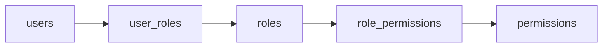
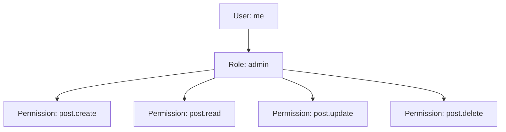

이 영상의 포인트는 RBAC를 깊게 파는 보안 강의라기보다, **바이브 코딩을 할 때 권한 구조를 어떻게 말해야 결과 품질이 달라지는가** 에 있습니다. 발표자는 개발자가 아닌 사람도 이제는 제품을 직접 만드는 시대라 RBAC 같은 단어를 아는 것만으로도 AI에게 훨씬 더 좋은 결과를 끌어낼 수 있다고 말합니다. 특히 프로젝트가 복잡해질수록 촘촘한 권한 설정이 필요해지기 때문에, 역할 기반 권한 모델을 이해하는 것이 기본기가 된다는 설명입니다. [0:00](https://youtu.be/z3yefLP9C3w?t=0) [0:13](https://youtu.be/z3yefLP9C3w?t=13) [0:21](https://youtu.be/z3yefLP9C3w?t=21)
<!--more-->

영상은 RBAC를 중심으로 ABAC, ReBAC도 짧게 언급하지만, 핵심은 결국 “권한을 중복 없이 효율적으로 관리하는 데이터베이스 구조”를 이해시키는 데 있습니다. CMS를 예로 들어 user, role, permission, 그리고 이들을 연결하는 조인 테이블을 머메이드 다이어그램처럼 설명하며, 왜 이런 구조가 유지보수에 유리한지 보여 줍니다. [0:36](https://youtu.be/z3yefLP9C3w?t=36) [3:15](https://youtu.be/z3yefLP9C3w?t=195)

## Sources

- https://youtu.be/z3yefLP9C3w?si=vJAr_1RsxZZECq0q

## 1. RBAC, ABAC, ReBAC는 모두 권한 제어 방식이지만 출발점이 다르다

영상 초반에서 발표자는 현대 권한 제어 시스템으로 RBAC, ABAC, ReBAC를 간단히 소개합니다. RBAC는 역할(role)을 기준으로 권한을 묶는 방식이고, ABAC는 속성(attribute), ReBAC는 관계(relationship)를 기반으로 권한을 판단하는 방식이라는 설명입니다. 다만 이 영상은 세 개를 깊게 비교하기보다, 실제 프로젝트에서 가장 흔하고 기본적인 RBAC를 먼저 잡아 두는 쪽에 집중합니다. [0:36](https://youtu.be/z3yefLP9C3w?t=36) [0:50](https://youtu.be/z3yefLP9C3w?t=50) [1:03](https://youtu.be/z3yefLP9C3w?t=63)

이 포인트가 중요한 이유는, 바이브 코딩에서 AI에게 “권한 시스템 넣어줘”라고 말하는 것과 “RBAC로 설계해줘”라고 말하는 것의 결과가 크게 다르기 때문입니다. 전자는 막연한 요구지만, 후자는 이미 어느 정도 정답 공간을 좁혀 주는 설계 힌트가 됩니다. [1:28](https://youtu.be/z3yefLP9C3w?t=88) [1:32](https://youtu.be/z3yefLP9C3w?t=92)

## 2. RBAC의 핵심은 사용자에게 바로 권한을 붙이지 않는다는 점이다

발표자는 RBAC 개념을 “관리자면 어떤 기능을 허용하고, 일반 사용자면 읽기만 허용한다” 수준으로 아주 쉽게 풀어 설명합니다. 하지만 진짜 핵심은 그걸 구현하는 테이블 구조입니다. 사용자(user)에게 권한(permission)을 직접 붙이는 대신, 먼저 역할(role)을 만들고 그 역할에 권한을 연결한 다음, 다시 사용자를 역할에 연결하는 식으로 중간 단계를 둡니다. [1:39](https://youtu.be/z3yefLP9C3w?t=99) [1:54](https://youtu.be/z3yefLP9C3w?t=114)

이 구조 덕분에 권한을 바꾸고 싶을 때 사용자 개별 레코드를 전부 수정할 필요가 없습니다. 관리자 역할이 가진 권한만 바꾸면, 그 역할을 가진 모든 사용자에게 한 번에 반영됩니다. 즉 RBAC는 권한을 단순히 “보안 설정”이 아니라 **재사용 가능한 묶음으로 관리하는 방식** 으로 보는 것이 맞습니다. [5:49](https://youtu.be/z3yefLP9C3w?t=349) [6:19](https://youtu.be/z3yefLP9C3w?t=379)

## 3. CMS 예제에서는 `users / roles / permissions / user_roles / role_permissions` 가 핵심이다

영상의 중앙 설명은 CMS 예제를 통한 테이블 설계입니다. 가운데는 `roles`, 오른쪽은 `permissions`, 왼쪽은 `users` 가 있고, 역할과 권한은 `role_permissions`, 사용자와 역할은 `user_roles` 로 연결됩니다. permission에는 어떤 리소스에 대해 어떤 액션을 허용하는지 들어가며, 기본적으로는 create, read, update, delete 같은 CRUD 단위로 생각하면 된다고 설명합니다. [3:39](https://youtu.be/z3yefLP9C3w?t=219) [4:00](https://youtu.be/z3yefLP9C3w?t=240) [4:09](https://youtu.be/z3yefLP9C3w?t=249)

예를 들어 관리자(admin) 역할이 post를 생성/수정/읽기/삭제할 수 있는 권한을 가진다면, 그 관계는 `role_permissions` 에 저장됩니다. 그리고 특정 사용자가 관리자라면, 그 사용자는 `user_roles` 를 통해 admin 역할에 연결됩니다. 이렇게 하면 사용자 → 역할 → 권한이 한 번에 이어지면서, 특정 사용자가 어떤 권한을 갖는지 자연스럽게 계산할 수 있습니다. [4:56](https://youtu.be/z3yefLP9C3w?t=296) [5:19](https://youtu.be/z3yefLP9C3w?t=319)

## 4. 이 구조의 진짜 장점은 ‘권한 변경의 파급’을 한 곳에서 다룰 수 있다는 점이다

발표자가 여러 번 강조하는 것은 중복 없이 관리된다는 점입니다. 예를 들어 “관리자도 사용자 삭제는 못 하게 하자”는 정책이 생기면, 모든 관리자 계정을 일일이 손보는 대신 `role_permissions` 에서 admin과 `user.delete` 사이의 연결만 지우면 됩니다. 반대로 관리자에게 새 권한을 주고 싶을 때도 역할과 권한의 관계만 추가하면 됩니다. [5:38](https://youtu.be/z3yefLP9C3w?t=338) [6:01](https://youtu.be/z3yefLP9C3w?t=361)

사용자 관점에서도 마찬가지입니다. 특정 사용자의 권한을 바꾸고 싶다면, 사용자 자체를 수정하기보다 `user_roles` 에서 어떤 역할을 연결할지만 바꾸면 됩니다. 즉 RBAC는 권한을 직접 관리하는 방식이 아니라, **권한의 전파를 설계하는 방식** 이라고 보는 편이 더 정확합니다. [6:05](https://youtu.be/z3yefLP9C3w?t=365) [6:37](https://youtu.be/z3yefLP9C3w?t=397)

## 5. 바이브 코딩에서 중요한 건 이 모델을 ‘프롬프트 단서’로 주는 일이다

이 영상은 이론 설명으로 끝나지 않고, Verdent 안의 planning 모드에서 PM 역할을 선택한 뒤 “CMS 시스템을 만들 거야. RBAC가 어떤 기능인지 설명해 주고 어떤 방식으로 데이터베이스를 구성해야 되는지 알려줘”라고 묻는 장면을 보여 줍니다. 발표자는 그림과 표를 통해 구조를 먼저 이해하고, 그다음 프론트엔드 작업으로 넘어갑니다. [2:12](https://youtu.be/z3yefLP9C3w?t=132) [2:58](https://youtu.be/z3yefLP9C3w?t=178) [6:58](https://youtu.be/z3yefLP9C3w?t=418)

이 흐름이 실전에서 중요한 이유는, AI에게 곧바로 “CMS 만들어줘”라고 하기보다 “RBAC 기반 CMS”라고 말하면 정보 구조, 화면 역할, DB 스키마, CRUD 권한 설계가 한꺼번에 정리되기 쉽기 때문입니다. 다시 말해 RBAC는 보안 용어이면서 동시에 **프롬프트의 설계 힌트** 이기도 합니다. [0:13](https://youtu.be/z3yefLP9C3w?t=13) [7:30](https://youtu.be/z3yefLP9C3w?t=450)

## 6. 역할 예시를 먼저 정하면 UI 설계도 쉬워진다

후반부에서 발표자는 관리자, 에디터, 작가 등 네 개 정도의 권한 그룹을 먼저 잡아 두고, 각기 다른 permission을 갖도록 설계하는 예를 보여 줍니다. 이건 단순한 DB 스키마 설계가 아니라, 이후 프론트엔드에서 어떤 메뉴를 보여 줄지, 어떤 액션 버튼을 숨길지, 어떤 페이지 접근을 막을지까지 자연스럽게 이어집니다. [7:14](https://youtu.be/z3yefLP9C3w?t=434) [7:20](https://youtu.be/z3yefLP9C3w?t=440)

즉 RBAC는 백엔드의 권한 체크만을 위한 개념이 아닙니다. 화면 권한, 메뉴 노출, 액션 가능 여부, 관리자 도구 범위까지 함께 정리해 주기 때문에, 바이브 코딩에서 오히려 더 먼저 잡아 두면 좋은 구조입니다. [7:42](https://youtu.be/z3yefLP9C3w?t=462)

## 실전 적용 포인트

- AI에게 권한 시스템을 만들라고 할 때는 막연히 말하지 말고 `RBAC` 라는 단어를 명시하는 편이 좋습니다. [1:28](https://youtu.be/z3yefLP9C3w?t=88)
- 기본 구조는 `users`, `roles`, `permissions` 와 두 개의 조인 테이블이라는 점만 알아도 절반은 끝입니다. [3:39](https://youtu.be/z3yefLP9C3w?t=219)
- 개별 사용자에 권한을 직접 붙이기보다 역할에 권한을 붙이고 사용자를 역할에 연결해야 변경 비용이 작아집니다. [5:38](https://youtu.be/z3yefLP9C3w?t=338)
- CMS처럼 역할이 분명한 시스템에서는 먼저 역할 집합을 정한 뒤 UI와 DB를 함께 설계하는 편이 효율적입니다. [7:14](https://youtu.be/z3yefLP9C3w?t=434)
- CRUD보다 더 세밀한 조건이 필요하면 ABAC나 ReBAC로 넘어갈 수 있지만, 시작점으로는 RBAC가 가장 이해하기 쉽고 프롬프트에도 잘 먹힙니다. [0:36](https://youtu.be/z3yefLP9C3w?t=36)

## 핵심 요약

이 영상이 말하는 핵심은 간단합니다. RBAC를 아는 것은 개발자만의 교양이 아니라, AI와 함께 제품을 만드는 시대의 기본 설계 언어가 되어 가고 있다는 것입니다. 역할, 권한, 조인 테이블 구조를 알고 있으면 데이터베이스 설계도 쉬워지고, UI 역할 분리도 쉬워지고, 무엇보다 AI에게 더 정확한 문제 정의를 넘길 수 있습니다. [0:13](https://youtu.be/z3yefLP9C3w?t=13) [3:15](https://youtu.be/z3yefLP9C3w?t=195)

그래서 이 영상은 “RBAC가 뭔가요?”에 대한 입문 설명이면서 동시에, 바이브 코딩에서 어떤 단어를 알아야 결과 품질이 달라지는지를 보여 주는 사례이기도 합니다. 단어 하나가 프롬프트의 범위를 정하고, 그 범위가 곧 결과 구조를 바꾸기 때문입니다. [1:28](https://youtu.be/z3yefLP9C3w?t=88)

## 결론

권한 시스템은 프로젝트가 커진 뒤 뒤늦게 덧붙이는 기능처럼 보이지만, 실제로는 초반 정보 구조를 결정하는 핵심 축입니다. 바이브 코딩을 한다면 RBAC를 “백엔드 이론”으로만 보지 말고, AI에게 시스템 구조를 설명할 때 써먹는 기본 어휘로 익혀 두는 편이 훨씬 유리합니다. [0:21](https://youtu.be/z3yefLP9C3w?t=21) [6:58](https://youtu.be/z3yefLP9C3w?t=418)
